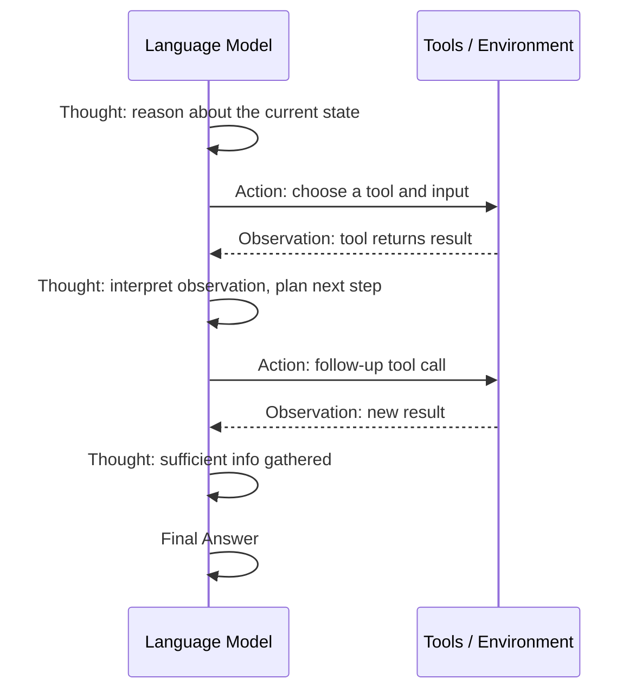

# ReAct (Reason + Act)

ReAct is a prompting and agent-design paradigm that interleaves **reasoning** (chain-of-thought) with **acting** (tool use or environment interaction). Introduced by Yao et al. (2022), it gives language models a structured loop -- Thought, Action, Observation -- that mirrors how humans solve problems: think about what to do, do it, observe the result, and repeat.

## Why ReAct Matters

Traditional chain-of-thought prompting produces reasoning traces but cannot interact with the outside world. Pure action-based agents (e.g., simple tool-calling loops) act without explicit reasoning, making them brittle and hard to debug. ReAct combines both, yielding agents that are **more accurate**, **more interpretable**, and **more grounded** in real information.

:::info Key Insight
ReAct's power comes from the synergy between reasoning and acting. Reasoning helps the agent plan and filter actions; actions bring in fresh information that keeps reasoning grounded.
:::

## The Thought-Action-Observation Loop

The core loop repeats until the agent reaches a final answer or a maximum number of steps:



### Step-by-Step Walkthrough

1. **Thought** -- The model explicitly verbalizes its reasoning. For example: *"I need to find the population of France. I should use the search tool."*
2. **Action** -- The model emits a structured action, such as `Search("population of France 2024")`.
3. **Observation** -- The system executes the action and returns the result to the model as an observation.
4. **Repeat** -- The model reads the observation, generates a new thought, and decides whether to act again or produce a final answer.

## LangGraph Implementation: Prebuilt ReAct Agent

The simplest path to a production ReAct agent is `create_react_agent` from `langgraph.prebuilt`. It wires up the Thought-Action-Observation loop as a compiled graph with tool calling.

```python
"""ReAct agent using langgraph.prebuilt.create_react_agent."""

from __future__ import annotations

import asyncio
import logging
from typing import Annotated

from langchain_core.messages import HumanMessage
from langchain_core.tools import tool
from langchain_openai import ChatOpenAI
from langgraph.prebuilt import create_react_agent

logger = logging.getLogger(__name__)

# ---------------------------------------------------------------------------
# Tool definitions
# ---------------------------------------------------------------------------

@tool
def search(query: str) -> str:
    """Search the web for current information."""
    fake_results: dict[str, str] = {
        "population of france": "The population of France is approximately 68 million (2024).",
        "capital of japan": "The capital of Japan is Tokyo.",
    }
    return fake_results.get(query.lower(), f"No results found for: {query}")


@tool
def calculator(expression: str) -> str:
    """Evaluate a mathematical expression safely."""
    allowed_names: dict[str, object] = {"__builtins__": {}}
    try:
        result = eval(expression, allowed_names)  # noqa: S307
        return str(result)
    except Exception as exc:
        return f"Error: {exc}"


# ---------------------------------------------------------------------------
# Build the prebuilt ReAct agent
# ---------------------------------------------------------------------------

def build_prebuilt_react_agent() -> object:
    """Return a compiled LangGraph ReAct agent."""
    llm = ChatOpenAI(model="gpt-4o", temperature=0.0)
    tools = [search, calculator]
    graph = create_react_agent(model=llm, tools=tools)
    return graph


async def run_prebuilt(question: str) -> str:
    """Execute a question through the prebuilt ReAct agent."""
    graph = build_prebuilt_react_agent()
    config = {"configurable": {"thread_id": "demo-thread"}}
    result = await graph.ainvoke(
        {"messages": [HumanMessage(content=question)]},
        config=config,
    )
    return result["messages"][-1].content
```

:::tip Prebuilt vs. Custom
`create_react_agent` is ideal for rapid prototyping. It handles message formatting, tool dispatch, and the reason-act loop internally. Move to a custom graph (shown next) when you need fine-grained control over node logic, custom state fields, or non-standard routing.
:::

## LangGraph Implementation: Custom Graph Nodes

For full control, build the ReAct loop as explicit graph nodes with typed state, custom routing, and structured logging.

```python
"""Custom ReAct agent with explicit LangGraph nodes."""

from __future__ import annotations

import logging
import operator
from typing import Annotated, Any, Sequence, TypedDict

from langchain_core.messages import (
    AIMessage,
    BaseMessage,
    HumanMessage,
    ToolMessage,
)
from langchain_core.tools import tool as lc_tool
from langchain_openai import ChatOpenAI
from langgraph.graph import END, StateGraph
from pydantic import BaseModel, Field

logger = logging.getLogger(__name__)

# ---------------------------------------------------------------------------
# State schema
# ---------------------------------------------------------------------------

class ReActState(TypedDict):
    """Typed state flowing through the ReAct graph."""
    messages: Annotated[Sequence[BaseMessage], operator.add]
    step_count: int
    max_steps: int

# ---------------------------------------------------------------------------
# Tools
# ---------------------------------------------------------------------------

@lc_tool
def web_search(query: str) -> str:
    """Search the web for current information on a topic."""
    fake_db: dict[str, str] = {
        "population of france": "Approximately 68 million (2024).",
        "gdp of germany": "Germany GDP is roughly $4.5 trillion (2024).",
    }
    return fake_db.get(query.lower(), f"No results for: {query}")


@lc_tool
def math_eval(expression: str) -> str:
    """Evaluate a mathematical expression and return the numeric result."""
    try:
        return str(eval(expression, {"__builtins__": {}}))  # noqa: S307
    except Exception as exc:
        return f"Calculation error: {exc}"


TOOLS = [web_search, math_eval]
TOOL_MAP: dict[str, Any] = {t.name: t for t in TOOLS}

# ---------------------------------------------------------------------------
# Graph nodes
# ---------------------------------------------------------------------------

def reasoning_node(state: ReActState) -> dict[str, Any]:
    """Call the LLM with tool bindings to decide the next action."""
    llm = ChatOpenAI(model="gpt-4o", temperature=0.0).bind_tools(TOOLS)
    response: AIMessage = llm.invoke(state["messages"])
    logger.info(
        "reasoning_node step=%d tool_calls=%d",
        state["step_count"],
        len(response.tool_calls) if response.tool_calls else 0,
    )
    return {
        "messages": [response],
        "step_count": state["step_count"] + 1,
    }


def tool_execution_node(state: ReActState) -> dict[str, Any]:
    """Execute every tool call present in the last AI message."""
    last_message: AIMessage = state["messages"][-1]
    tool_messages: list[ToolMessage] = []

    for call in last_message.tool_calls:
        tool_fn = TOOL_MAP.get(call["name"])
        if tool_fn is None:
            result = f"Unknown tool: {call['name']}"
        else:
            try:
                result = tool_fn.invoke(call["args"])
            except Exception as exc:
                logger.exception("Tool %s failed", call["name"])
                result = f"Tool error: {exc}"

        tool_messages.append(
            ToolMessage(content=str(result), tool_call_id=call["id"])
        )

    return {"messages": tool_messages}


# ---------------------------------------------------------------------------
# Routing logic
# ---------------------------------------------------------------------------

def should_continue(state: ReActState) -> str:
    """Decide whether to call tools, stop, or abort on step limit."""
    last_message = state["messages"][-1]
    if state["step_count"] >= state["max_steps"]:
        logger.warning("Max steps (%d) reached, stopping.", state["max_steps"])
        return "end"
    if hasattr(last_message, "tool_calls") and last_message.tool_calls:
        return "tools"
    return "end"


# ---------------------------------------------------------------------------
# Graph assembly
# ---------------------------------------------------------------------------

def build_custom_react_graph(max_steps: int = 10) -> Any:
    """Compile the custom ReAct graph."""
    graph = StateGraph(ReActState)

    graph.add_node("reason", reasoning_node)
    graph.add_node("tools", tool_execution_node)

    graph.set_entry_point("reason")
    graph.add_conditional_edges("reason", should_continue, {
        "tools": "tools",
        "end": END,
    })
    graph.add_edge("tools", "reason")

    return graph.compile()


async def run_custom_react(question: str, max_steps: int = 10) -> str:
    """Run a question through the custom ReAct graph."""
    app = build_custom_react_graph(max_steps=max_steps)
    initial_state: ReActState = {
        "messages": [HumanMessage(content=question)],
        "step_count": 0,
        "max_steps": max_steps,
    }
    result = await app.ainvoke(initial_state)
    return result["messages"][-1].content
```

### How the Code Works

| Component | Purpose |
|-----------|---------|
| `ReActState` | TypedDict holding messages, step count, and max-step limit |
| `reasoning_node` | Calls the LLM with bound tools; the LLM decides to call a tool or produce a final answer |
| `tool_execution_node` | Dispatches every `tool_call` from the last AI message and returns `ToolMessage` results |
| `should_continue` | Conditional edge: routes to `tools` if tool calls are present, or `END` otherwise |
| `build_custom_react_graph` | Wires nodes and edges into a compiled `StateGraph` |

:::tip Implementation Tip
In production, inject the `ChatOpenAI` instance via dependency injection rather than constructing it inside nodes. This makes the graph testable and allows swapping models per environment.
:::

## When to Use ReAct

ReAct excels in scenarios that require **multi-step information gathering and reasoning**:

- **Question answering with retrieval** -- The agent searches, reads, and synthesizes across multiple sources.
- **Data analysis tasks** -- Reason about which query to run, execute it, interpret results, refine.
- **Customer support bots** -- Look up account info, reason about policies, take actions.
- **Code debugging** -- Read error logs, hypothesize causes, run diagnostic commands.

:::warning When ReAct Is Overkill
For single-step tool calls (e.g., "What is the weather in Paris?"), a simple tool-calling agent is faster and cheaper. ReAct's overhead only pays off when the task requires multiple reasoning-action cycles.
:::

## Limitations

| Limitation | Description |
|------------|-------------|
| **Latency** | Each step requires an LLM call, so multi-step tasks are slow. |
| **Cost** | More steps mean more tokens. A 6-step ReAct trace can cost 5-10x a single call. |
| **Hallucinated actions** | The model may invent tool names or produce malformed actions. |
| **Premature termination** | The model sometimes declares a final answer before gathering enough information. |
| **Error compounding** | A wrong observation early in the loop can derail subsequent reasoning. |

## Comparison with Other Patterns

| Dimension | ReAct | Chain-of-Thought | Plan-and-Execute |
|-----------|-------|-------------------|-------------------|
| **Reasoning** | Interleaved with actions | Upfront, no actions | Upfront plan, then execute |
| **Grounding** | High -- uses real tool outputs | Low -- relies on parametric knowledge | Medium -- plan may be stale |
| **Flexibility** | Adapts each step | Fixed reasoning chain | Can revise plan, but heavier |
| **Latency** | Medium (sequential steps) | Low (single call) | High (plan + execute phases) |
| **Best for** | Multi-step retrieval & reasoning | Simple reasoning tasks | Complex multi-stage workflows |

## Best Practices

1. **Limit max steps** -- Always set a ceiling to prevent runaway loops and control cost.
2. **Use structured tool calling** -- LangGraph's `bind_tools` eliminates regex parsing errors.
3. **Inject few-shot examples** -- Show the model 1-2 complete Thought/Action/Observation traces in the system prompt.
4. **Log every step** -- The trace is ReAct's greatest debugging asset. Use structured logging with step counts.
5. **Add a fallback** -- If the agent hits max steps, escalate to a human or a more capable model.

## Key Takeaways

- ReAct fuses reasoning and acting into a single, interpretable loop.
- The Thought-Action-Observation cycle keeps the agent grounded in real observations.
- LangGraph offers two paths: `create_react_agent` for fast prototyping, and custom `StateGraph` for full control.
- Use it when tasks demand multi-step information gathering; skip it for trivial single-tool calls.

## Further Reading

- Yao, S. et al. "ReAct: Synergizing Reasoning and Acting in Language Models" (ICLR 2023)
- Shinn, N. et al. "Reflexion: Language Agents with Verbal Reinforcement Learning" (NeurIPS 2023)
- LangGraph ReAct Agent documentation
- LangGraph `create_react_agent` API reference
