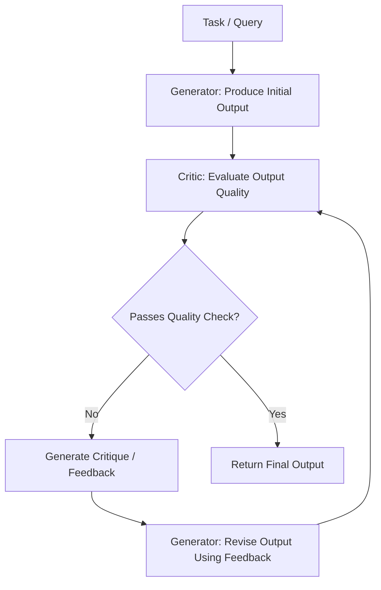
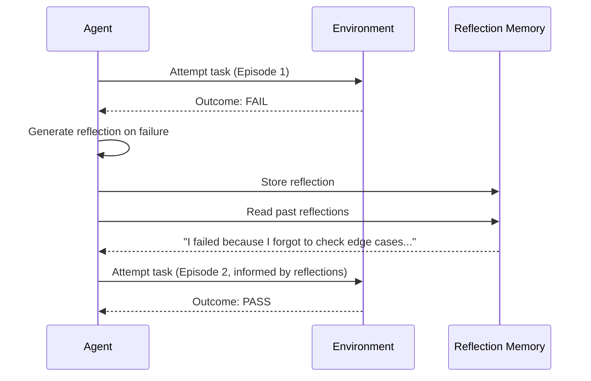
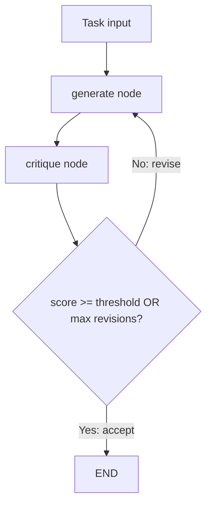

# Reflection and Self-Critique

Reflection is a design pattern where an agent **evaluates its own output**, identifies flaws, and uses that critique to improve subsequent attempts. Instead of accepting the first response as final, the agent enters a deliberate self-improvement loop. This pattern is central to frameworks like Reflexion and is one of the most effective ways to boost agent quality without changing the underlying model.

## Why Reflection Matters

LLMs produce plausible-sounding outputs on the first attempt, but "plausible" is not the same as "correct." Reflection addresses this gap by adding a quality-assurance layer that catches errors, omissions, and logical inconsistencies -- all without requiring an external evaluator.

:::info Core Principle
Reflection works because LLMs are often better at **evaluating** outputs than **generating** them on the first try. The same model that produces a flawed answer can frequently spot the flaw when asked to review it.
:::

## The Reflection Loop



The loop has three core roles:

| Role | Responsibility |
|------|---------------|
| **Generator** | Produces or revises the output |
| **Critic** | Evaluates the output against quality criteria |
| **Controller** | Decides whether to loop again or stop |

## The Reflexion Framework

Reflexion (Shinn et al., 2023) formalizes reflection for agents that interact with environments. After each episode, the agent generates a **verbal reflection** -- a natural-language summary of what went wrong -- and stores it in memory. On the next attempt, the agent reads its past reflections to avoid repeating mistakes.



### Key Differences from Simple Retry

| Simple Retry | Reflexion |
|-------------|-----------|
| Retries the same way, hoping for a different result | Analyzes the failure and changes strategy |
| No memory across attempts | Accumulates reflection memory |
| Random improvement | Directed improvement |

## LangGraph Implementation

The reflection pattern maps naturally to a LangGraph cycle: **generator node** produces output, **critic node** evaluates it, and a **conditional edge** decides whether to accept or loop back for revision. The state tracks the revision count to enforce a hard stop.

```python
"""Reflection pattern as a LangGraph cyclic graph."""

from __future__ import annotations

import logging
import operator
from typing import Annotated, Any, Literal, Sequence, TypedDict

from langchain_core.messages import AIMessage, BaseMessage, HumanMessage, SystemMessage
from langchain_openai import ChatOpenAI
from langgraph.graph import END, StateGraph
from pydantic import BaseModel, Field

logger = logging.getLogger(__name__)

# ---------------------------------------------------------------------------
# Structured output models
# ---------------------------------------------------------------------------

class Critique(BaseModel):
    """Structured critique from the critic node."""
    score: float = Field(..., ge=0.0, le=1.0, description="Quality score 0-1")
    issues: list[str] = Field(default_factory=list, description="Specific issues found")
    suggestions: list[str] = Field(default_factory=list, description="Concrete improvements")
    verdict: Literal["accept", "revise"] = Field(
        ..., description="Whether to accept or request revision"
    )


# ---------------------------------------------------------------------------
# State
# ---------------------------------------------------------------------------

class ReflectionState(TypedDict):
    """State for the reflection graph."""
    messages: Annotated[Sequence[BaseMessage], operator.add]
    task: str
    current_output: str
    critique_history: list[Critique]
    revision_count: int
    max_revisions: int
    quality_threshold: float


# ---------------------------------------------------------------------------
# Generator node
# ---------------------------------------------------------------------------

GENERATOR_SYSTEM = (
    "You are an expert writer and coder. Produce the highest-quality output "
    "you can for the given task. If previous feedback is provided, address "
    "every issue listed."
)


def generator_node(state: ReflectionState) -> dict[str, Any]:
    """Generate or revise the output based on task and prior critiques."""
    llm = ChatOpenAI(model="gpt-4o", temperature=0.0)

    messages: list[BaseMessage] = [SystemMessage(content=GENERATOR_SYSTEM)]

    if state["revision_count"] == 0:
        messages.append(HumanMessage(content=f"Task: {state['task']}"))
    else:
        last_critique = state["critique_history"][-1]
        issues_text = "\n".join(f"- {i}" for i in last_critique.issues)
        suggestions_text = "\n".join(f"- {s}" for s in last_critique.suggestions)
        messages.append(HumanMessage(content=(
            f"Task: {state['task']}\n\n"
            f"Your previous output:\n{state['current_output']}\n\n"
            f"Reviewer feedback (score: {last_critique.score:.2f}):\n"
            f"Issues:\n{issues_text}\n"
            f"Suggestions:\n{suggestions_text}\n\n"
            "Produce a complete revised output addressing ALL issues."
        )))

    response: AIMessage = llm.invoke(messages)
    logger.info("generator_node revision=%d", state["revision_count"])

    return {
        "messages": [response],
        "current_output": response.content,
    }


# ---------------------------------------------------------------------------
# Critic node
# ---------------------------------------------------------------------------

CRITIC_SYSTEM = (
    "You are a rigorous reviewer. Evaluate the output against the task "
    "requirements. Be specific about issues and constructive with suggestions. "
    "Score generously only when quality is genuinely high."
)


def critic_node(state: ReflectionState) -> dict[str, Any]:
    """Critique the current output and produce a structured evaluation."""
    llm = ChatOpenAI(model="gpt-4o", temperature=0.0)
    structured_llm = llm.with_structured_output(Critique)

    critique: Critique = structured_llm.invoke([
        SystemMessage(content=CRITIC_SYSTEM),
        HumanMessage(content=(
            f"Task: {state['task']}\n\n"
            f"Output to review (revision #{state['revision_count']}):\n"
            f"{state['current_output']}"
        )),
    ])

    logger.info(
        "critic_node score=%.2f verdict=%s issues=%d",
        critique.score,
        critique.verdict,
        len(critique.issues),
    )

    return {
        "critique_history": state["critique_history"] + [critique],
        "revision_count": state["revision_count"] + 1,
    }


# ---------------------------------------------------------------------------
# Conditional edge: accept or revise
# ---------------------------------------------------------------------------

def should_revise(state: ReflectionState) -> Literal["revise", "accept"]:
    """Decide whether to revise based on score, verdict, and budget."""
    last_critique = state["critique_history"][-1]

    # Hard stop: revision budget exhausted
    if state["revision_count"] >= state["max_revisions"]:
        logger.info("Max revisions (%d) reached, accepting.", state["max_revisions"])
        return "accept"

    # Accept if score meets threshold
    if last_critique.score >= state["quality_threshold"]:
        logger.info("Quality threshold met: %.2f >= %.2f", last_critique.score, state["quality_threshold"])
        return "accept"

    # Accept if critic says so regardless of score
    if last_critique.verdict == "accept":
        return "accept"

    return "revise"


# ---------------------------------------------------------------------------
# Graph assembly
# ---------------------------------------------------------------------------

def build_reflection_graph(
    max_revisions: int = 3,
    quality_threshold: float = 0.85,
) -> Any:
    """Compile the reflection graph.

    Parameters
    ----------
    max_revisions : int
        Maximum number of generate-critique cycles.
    quality_threshold : float
        Score at or above which the output is accepted.
    """
    graph = StateGraph(ReflectionState)

    graph.add_node("generate", generator_node)
    graph.add_node("critique", critic_node)

    graph.set_entry_point("generate")
    graph.add_edge("generate", "critique")
    graph.add_conditional_edges("critique", should_revise, {
        "revise": "generate",
        "accept": END,
    })

    return graph.compile()


async def run_reflection(
    task: str,
    max_revisions: int = 3,
    quality_threshold: float = 0.85,
) -> dict[str, Any]:
    """Run the reflection loop and return the final output with trace.

    Returns
    -------
    dict with keys: final_output, revision_count, critiques, scores
    """
    app = build_reflection_graph(
        max_revisions=max_revisions,
        quality_threshold=quality_threshold,
    )

    initial_state: ReflectionState = {
        "messages": [],
        "task": task,
        "current_output": "",
        "critique_history": [],
        "revision_count": 0,
        "max_revisions": max_revisions,
        "quality_threshold": quality_threshold,
    }

    result = await app.ainvoke(initial_state)

    return {
        "final_output": result["current_output"],
        "revision_count": result["revision_count"],
        "critiques": [c.model_dump() for c in result["critique_history"]],
        "scores": [c.score for c in result["critique_history"]],
    }
```

### How the Graph Works



| Node | Responsibility |
|------|---------------|
| **generate** | Produces initial output or revises based on feedback |
| **critique** | Scores the output, lists issues, and returns a structured `Critique` |
| **should_revise** | Conditional edge checking score, verdict, and revision budget |

## When Reflection Helps

| Use Case | Why Reflection Works |
|----------|---------------------|
| **Code generation** | The model can "run" the code mentally and catch bugs |
| **Writing and editing** | Catches tone issues, factual errors, structural problems |
| **Data extraction** | Verifies completeness and format compliance |
| **Math and logic** | Catches arithmetic errors and logical gaps |
| **Plan generation** | Identifies missing steps or unrealistic assumptions |

## When Reflection Can Fail

:::warning Diminishing Returns
Reflection is not infinitely useful. After 2-3 iterations, improvements typically plateau. The model may start "hallucinating improvements" -- making changes that are not actually better. Always set a maximum iteration count.
:::

| Failure Mode | Description |
|-------------|-------------|
| **Sycophantic critic** | The critic approves everything to avoid conflict |
| **Oscillating revisions** | The model alternates between two versions without converging |
| **Over-refinement** | The model optimizes for the critique format rather than actual quality |
| **Score inflation** | Self-assigned scores drift upward regardless of real quality |

### Mitigations

1. **Use external validators** -- Supplement LLM critique with deterministic checks (unit tests, linters, schema validation).
2. **Track changes** -- Compute diffs between iterations. If changes are trivial, stop early.
3. **Separate the scoring model** -- Use a different model for the critic than the generator.
4. **Anchor with rubrics** -- Provide explicit evaluation criteria, not just "is this good?"

## Reflection vs. Other Patterns

| Dimension | Reflection | ReAct | Plan-and-Execute |
|-----------|-----------|-------|-------------------|
| **Focus** | Output quality improvement | Information gathering | Task decomposition |
| **Loop type** | Generate-critique-revise | Think-act-observe | Plan-execute-replan |
| **Memory** | Reflections from past attempts | Observation history | Plan state |
| **Best for** | Quality-critical outputs | Multi-step retrieval | Complex workflows |

## Key Takeaways

- Reflection adds a quality-assurance layer that catches errors the generator misses.
- In LangGraph, model it as a cycle: generator node, critic node, conditional edge.
- Use Pydantic `Critique` models for structured, parseable feedback.
- Track `revision_count` in state to enforce a hard stop and prevent infinite loops.
- Combine LLM critique with deterministic validators for the most reliable results.
- Set firm stopping criteria: maximum iterations, quality thresholds, and change-size limits.

## Further Reading

- Shinn, N. et al. "Reflexion: Language Agents with Verbal Reinforcement Learning" (NeurIPS 2023)
- Madaan, A. et al. "Self-Refine: Iterative Refinement with Self-Feedback" (NeurIPS 2023)
- Pan, L. et al. "Automatically Correcting Large Language Models" (ICLR 2024)
- LangGraph cyclic graph documentation
