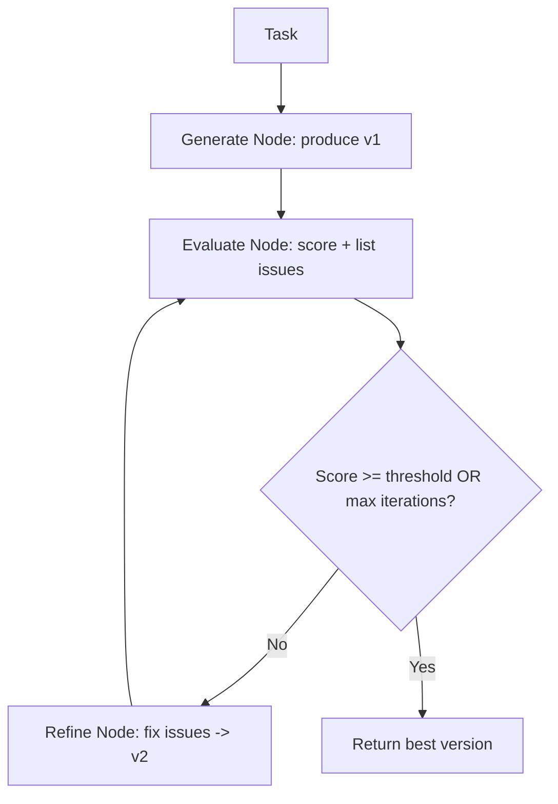
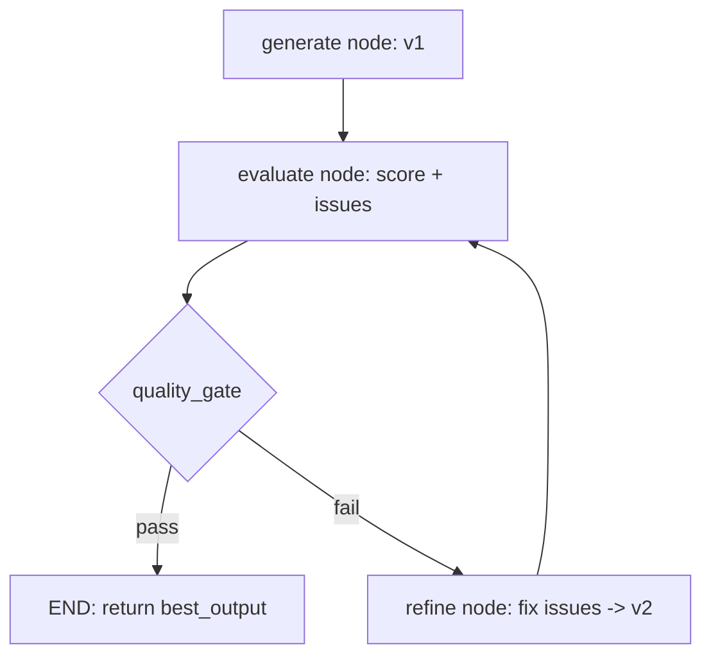

# Self-Refinement

Self-refinement is a pattern where an agent **generates an initial output, critiques it, and iteratively revises it** until a quality threshold is met or a budget is exhausted. Unlike the broader Reflection pattern (which emphasizes cross-episode memory and frameworks like Reflexion), self-refinement focuses specifically on **within-task output polishing** -- taking a single artifact from draft quality to production quality.

## The Core Idea

Most first drafts -- whether code, text, or plans -- contain errors and missed requirements. Self-refinement mimics the human revision process: write, reread, improve, repeat.



## Quality Gates

A quality gate is a set of criteria that the output must satisfy. Gates can be **LLM-evaluated** (subjective) or **deterministic** (objective). The best systems combine both.

### Deterministic Quality Gates

```python
"""Deterministic quality gates for common output types."""

import ast
import json


def check_python_syntax(code: str) -> tuple[bool, str]:
    """Verify that Python code parses without syntax errors."""
    try:
        ast.parse(code)
        return True, "Syntax OK"
    except SyntaxError as e:
        return False, f"Syntax error at line {e.lineno}: {e.msg}"


def check_json_valid(text: str) -> tuple[bool, str]:
    """Verify that text is valid JSON."""
    try:
        json.loads(text)
        return True, "Valid JSON"
    except json.JSONDecodeError as e:
        return False, f"Invalid JSON: {e}"


def check_word_count(
    text: str, min_words: int = 100, max_words: int = 500
) -> tuple[bool, str]:
    """Verify word count is within bounds."""
    count = len(text.split())
    if count < min_words:
        return False, f"Too short: {count} words (minimum: {min_words})"
    if count > max_words:
        return False, f"Too long: {count} words (maximum: {max_words})"
    return True, f"Word count OK: {count}"
```

## LangGraph Implementation

Self-refinement maps to a three-node LangGraph graph: **generate**, **evaluate**, and **refine**, connected by a conditional edge that acts as the quality gate.

```python
"""Self-refinement loop as a LangGraph graph."""

from __future__ import annotations

import logging
import operator
from typing import Annotated, Any, Callable, Literal, Sequence, TypedDict

from langchain_core.messages import AIMessage, BaseMessage, HumanMessage, SystemMessage
from langchain_openai import ChatOpenAI
from langgraph.graph import END, StateGraph
from pydantic import BaseModel, Field

logger = logging.getLogger(__name__)

# ---------------------------------------------------------------------------
# Evaluation model
# ---------------------------------------------------------------------------

class Evaluation(BaseModel):
    """Structured evaluation from the evaluate node."""
    score: float = Field(..., ge=0.0, le=1.0, description="Quality score 0-1")
    issues: list[str] = Field(default_factory=list, description="Specific issues found")
    deterministic_failures: list[str] = Field(
        default_factory=list, description="Failed deterministic checks"
    )
    verdict: Literal["pass", "fail"] = Field(
        ..., description="Whether the output passes quality gate"
    )


# ---------------------------------------------------------------------------
# State
# ---------------------------------------------------------------------------

class RefinementState(TypedDict):
    """State for the self-refinement graph."""
    messages: Annotated[Sequence[BaseMessage], operator.add]
    task: str
    rubric: str
    current_output: str
    best_output: str
    best_score: float
    evaluations: list[Evaluation]
    iteration: int
    max_iterations: int
    quality_threshold: float


# ---------------------------------------------------------------------------
# Generate node
# ---------------------------------------------------------------------------

def generate_node(state: RefinementState) -> dict[str, Any]:
    """Produce the initial output for the task."""
    llm = ChatOpenAI(model="gpt-4o", temperature=0.0)
    response: AIMessage = llm.invoke([
        SystemMessage(content="You are an expert. Complete the task thoroughly and correctly."),
        HumanMessage(content=f"Task: {state['task']}"),
    ])

    logger.info("Generate node produced initial output.")
    return {
        "messages": [response],
        "current_output": response.content,
        "best_output": response.content,
        "best_score": 0.0,
    }


# ---------------------------------------------------------------------------
# Evaluate node (combined deterministic + LLM)
# ---------------------------------------------------------------------------

def evaluate_node(state: RefinementState) -> dict[str, Any]:
    """Score the current output with deterministic checks and LLM critique."""
    output = state["current_output"]

    # --- Deterministic checks ---
    det_failures: list[str] = []
    syntax_ok, syntax_msg = check_python_syntax(output)
    if not syntax_ok:
        det_failures.append(syntax_msg)

    # --- LLM evaluation ---
    llm = ChatOpenAI(model="gpt-4o", temperature=0.0)
    structured_llm = llm.with_structured_output(Evaluation)

    det_context = ""
    if det_failures:
        det_context = "\nDeterministic failures:\n" + "\n".join(f"- {f}" for f in det_failures)

    evaluation: Evaluation = structured_llm.invoke([
        SystemMessage(content=(
            "You are a rigorous quality evaluator. Score the output against the rubric. "
            "Be specific about issues."
        )),
        HumanMessage(content=(
            f"Task: {state['task']}\n\n"
            f"Rubric: {state['rubric']}\n\n"
            f"Output to evaluate:\n{output}\n"
            f"{det_context}"
        )),
    ])

    # Merge deterministic failures into evaluation
    evaluation.deterministic_failures = det_failures
    if det_failures:
        evaluation.verdict = "fail"

    # Track best output
    best_output = state["best_output"]
    best_score = state["best_score"]
    if evaluation.score > best_score:
        best_output = output
        best_score = evaluation.score

    logger.info(
        "Evaluate iteration=%d score=%.2f verdict=%s issues=%d",
        state["iteration"],
        evaluation.score,
        evaluation.verdict,
        len(evaluation.issues),
    )

    return {
        "evaluations": state["evaluations"] + [evaluation],
        "best_output": best_output,
        "best_score": best_score,
        "iteration": state["iteration"] + 1,
    }


# ---------------------------------------------------------------------------
# Quality gate (conditional edge)
# ---------------------------------------------------------------------------

def quality_gate(state: RefinementState) -> Literal["pass", "fail"]:
    """Decide whether to refine further or accept the output."""
    last_eval = state["evaluations"][-1]

    # Hard stop: iteration budget
    if state["iteration"] >= state["max_iterations"]:
        logger.info("Max iterations reached (%d), accepting best.", state["max_iterations"])
        return "pass"

    # Pass if score meets threshold and no deterministic failures
    if (
        last_eval.score >= state["quality_threshold"]
        and last_eval.verdict == "pass"
    ):
        logger.info("Quality threshold met: %.2f", last_eval.score)
        return "pass"

    # Diminishing returns check (after at least 2 evaluations)
    if len(state["evaluations"]) >= 2:
        prev_score = state["evaluations"][-2].score
        improvement = last_eval.score - prev_score
        if improvement < 0.02:
            logger.info("Diminishing returns (improvement=%.3f), accepting best.", improvement)
            return "pass"

    return "fail"


# ---------------------------------------------------------------------------
# Refine node
# ---------------------------------------------------------------------------

def refine_node(state: RefinementState) -> dict[str, Any]:
    """Revise the output to address all identified issues."""
    llm = ChatOpenAI(model="gpt-4o", temperature=0.0)
    last_eval = state["evaluations"][-1]

    all_issues = last_eval.issues + last_eval.deterministic_failures
    issues_text = "\n".join(f"- {issue}" for issue in all_issues)

    response: AIMessage = llm.invoke([
        SystemMessage(content=(
            "You are an expert reviser. Fix ALL listed issues. "
            "Produce the complete revised output, not just the changes."
        )),
        HumanMessage(content=(
            f"Task: {state['task']}\n\n"
            f"Current output:\n{state['current_output']}\n\n"
            f"Issues to fix (score: {last_eval.score:.2f}):\n{issues_text}\n\n"
            "Provide the complete revised output:"
        )),
    ])

    logger.info("Refine node produced revision #%d.", state["iteration"])
    return {
        "messages": [response],
        "current_output": response.content,
    }


# ---------------------------------------------------------------------------
# Graph assembly
# ---------------------------------------------------------------------------

def build_refinement_graph(
    max_iterations: int = 3,
    quality_threshold: float = 0.85,
) -> Any:
    """Compile the self-refinement graph."""
    graph = StateGraph(RefinementState)

    graph.add_node("generate", generate_node)
    graph.add_node("evaluate", evaluate_node)
    graph.add_node("refine", refine_node)

    graph.set_entry_point("generate")
    graph.add_edge("generate", "evaluate")
    graph.add_conditional_edges("evaluate", quality_gate, {
        "pass": END,
        "fail": "refine",
    })
    graph.add_edge("refine", "evaluate")

    return graph.compile()


async def run_self_refinement(
    task: str,
    rubric: str = "Correctness, completeness, clarity, and code quality.",
    max_iterations: int = 3,
    quality_threshold: float = 0.85,
) -> dict[str, Any]:
    """Run the self-refinement loop.

    Returns
    -------
    dict with keys: best_output, best_score, iterations, evaluations
    """
    app = build_refinement_graph(
        max_iterations=max_iterations,
        quality_threshold=quality_threshold,
    )

    initial_state: RefinementState = {
        "messages": [],
        "task": task,
        "rubric": rubric,
        "current_output": "",
        "best_output": "",
        "best_score": 0.0,
        "evaluations": [],
        "iteration": 0,
        "max_iterations": max_iterations,
        "quality_threshold": quality_threshold,
    }

    result = await app.ainvoke(initial_state)

    return {
        "best_output": result["best_output"],
        "best_score": result["best_score"],
        "iterations": result["iteration"],
        "evaluations": [e.model_dump() for e in result["evaluations"]],
    }
```

### How the Graph Works



| Node | Responsibility |
|------|---------------|
| **generate** | Produces the initial output |
| **evaluate** | Runs deterministic checks + LLM critique, produces `Evaluation` |
| **refine** | Revises the output to address all listed issues |
| **quality_gate** | Conditional edge: checks score, verdict, iteration budget, diminishing returns |

## Stopping Criteria

Choosing when to stop refining is critical. Too few iterations leave quality on the table; too many waste tokens and risk degradation.

| Criterion | Description | When to Use |
|-----------|-------------|-------------|
| **Quality threshold** | Stop when score exceeds a target | When you have a reliable scoring mechanism |
| **Max iterations** | Hard cap on revision rounds | Always (safety net) |
| **Diminishing returns** | Stop when improvement per round drops below a minimum | When scores are noisy |
| **Deterministic pass** | Stop when all hard checks pass | For code or structured output |
| **No new issues** | Stop when the critic finds nothing to fix | When issues are the primary signal |
| **Budget exhaustion** | Stop when token/cost budget is used up | Production systems with cost constraints |

:::tip Practical Guidance
For most tasks, **3 iterations with a 0.85 threshold** is a good starting point. The first revision typically captures 60-70% of the improvement. Subsequent rounds see diminishing returns.
:::

## When Self-Refinement Works Best

- **Code generation** -- Syntax checks and test execution provide concrete feedback.
- **Structured data extraction** -- Schema validation catches missing or malformed fields.
- **Technical writing** -- Checklists for completeness, accuracy, and style.
- **Translation** -- Back-translation and fluency scoring guide refinement.

:::warning When It Backfires
Self-refinement can degrade output when the critic is unreliable. If the LLM consistently misjudges quality (e.g., scoring a wrong answer highly), refinement will optimize for the wrong target. Always validate the critic's accuracy before trusting the loop.
:::

## Self-Refinement vs. Related Patterns

| Pattern | Focus | Memory | Scope |
|---------|-------|--------|-------|
| **Self-Refinement** | Polishing a single output | Within-task only | One artifact |
| **Reflection (Reflexion)** | Learning from failures across episodes | Cross-episode memory | Agent behavior |
| **Chain-of-Thought** | Reasoning before answering | None | Single inference |
| **Human-in-the-Loop** | External feedback from humans | Depends on implementation | Variable |

## Key Takeaways

- Self-refinement is the simplest pattern for improving output quality without external feedback.
- In LangGraph, model it as: generate node, evaluate node, conditional quality gate, refine node.
- Combine deterministic checks (syntax, schema, length) with LLM-based critique for robust quality gates.
- Track `best_output` and `best_score` in state to always return the highest-quality version.
- Always define explicit stopping criteria: quality threshold, max iterations, and diminishing returns.
- The first revision gives the biggest improvement; subsequent rounds face diminishing returns.

## Further Reading

- Madaan, A. et al. "Self-Refine: Iterative Refinement with Self-Feedback" (NeurIPS 2023)
- Chen, X. et al. "Teaching Large Language Models to Self-Debug" (ICLR 2024)
- Welleck, S. et al. "Generating Sequences by Learning to Self-Correct" (ICML 2023)
