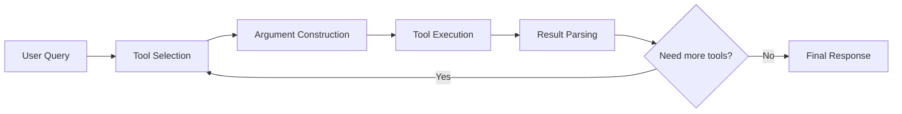
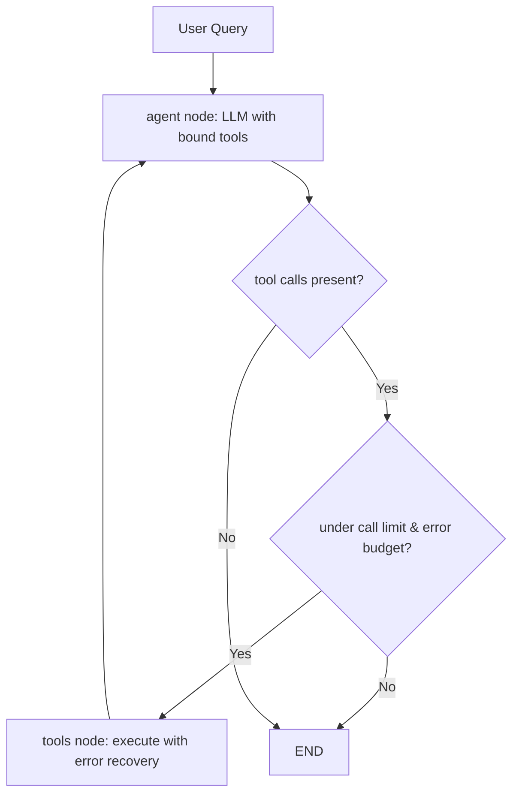

# Tool Use Pattern

Tool use is the ability of an LLM-based agent to **select, invoke, and interpret the results of external tools** at runtime. It transforms a language model from a text generator into an actor that can query databases, call APIs, run code, and manipulate files. This pattern is foundational to virtually every production agent.

## Core Concepts

An agent's tool-use pipeline has four phases:



1. **Tool Selection** -- The model decides which tool (if any) to use.
2. **Argument Construction** -- The model generates the correct arguments for that tool.
3. **Tool Execution** -- The runtime invokes the tool and captures output.
4. **Result Parsing** -- The model interprets the result and decides the next step.

:::info
Modern LLM APIs (OpenAI function calling, Anthropic tool_use, etc.) handle steps 1-2 natively with structured output, eliminating the need for fragile regex parsing. LangGraph's `ToolNode` handles steps 3-4.
:::

## LangGraph Implementation: ToolNode with Custom Tools

LangGraph provides `ToolNode` from `langgraph.prebuilt` for standardized tool execution. Below is a production-grade implementation with custom tool definitions, error recovery, and dynamic tool selection.

```python
"""Tool use pattern with LangGraph ToolNode and custom tools."""

from __future__ import annotations

import asyncio
import logging
import operator
from typing import Annotated, Any, Sequence, TypedDict

from langchain_core.messages import (
    AIMessage,
    BaseMessage,
    HumanMessage,
    ToolMessage,
)
from langchain_core.tools import tool
from langchain_openai import ChatOpenAI
from langgraph.graph import END, StateGraph
from langgraph.prebuilt import ToolNode
from pydantic import BaseModel, Field

logger = logging.getLogger(__name__)

# ---------------------------------------------------------------------------
# Custom tool definitions
# ---------------------------------------------------------------------------

class SearchResult(BaseModel):
    """Structured search result."""
    title: str
    snippet: str
    url: str


@tool
def web_search(query: str) -> str:
    """Search the web for current information. Use for recent events or facts."""
    logger.info("web_search called with query=%s", query)
    return f"Search results for '{query}': France population is 68M (2024)."


@tool
def database_query(sql: str) -> str:
    """Query the customer database with a SQL SELECT statement."""
    logger.info("database_query called with sql=%s", sql)
    if "SELECT" not in sql.upper():
        raise ValueError("Only SELECT queries are permitted.")
    return f"Query result: [{{'customer': 'Acme Corp', 'revenue': 2400000}}]"


@tool
def calculator(expression: str) -> str:
    """Evaluate a mathematical expression and return the numeric result."""
    try:
        result = eval(expression, {"__builtins__": {}})  # noqa: S307
        return str(result)
    except Exception as exc:
        return f"Calculation error: {exc}"


@tool
def send_email(to: str, subject: str, body: str) -> str:
    """Send an email to a recipient. This is a high-risk action requiring approval."""
    logger.info("send_email called to=%s subject=%s", to, subject)
    return f"Email sent to {to} with subject '{subject}'."


ALL_TOOLS = [web_search, database_query, calculator, send_email]

# ---------------------------------------------------------------------------
# State
# ---------------------------------------------------------------------------

class ToolUseState(TypedDict):
    """State for the tool-use agent graph."""
    messages: Annotated[Sequence[BaseMessage], operator.add]
    tool_call_count: int
    max_tool_calls: int
    errors: list[str]

# ---------------------------------------------------------------------------
# Dynamic tool selection node
# ---------------------------------------------------------------------------

class ToolSelectionDecision(BaseModel):
    """LLM output deciding which tools are relevant."""
    relevant_tool_names: list[str] = Field(
        ..., description="Names of tools relevant to the current query"
    )
    reasoning: str = Field(..., description="Why these tools were selected")


def tool_selector_node(state: ToolUseState) -> dict[str, Any]:
    """Dynamically select relevant tools for the current query context."""
    llm = ChatOpenAI(model="gpt-4o", temperature=0.0)
    tool_descriptions = "\n".join(
        f"- {t.name}: {t.description}" for t in ALL_TOOLS
    )
    last_human = next(
        (m.content for m in reversed(state["messages"]) if isinstance(m, HumanMessage)),
        "",
    )

    structured_llm = llm.with_structured_output(ToolSelectionDecision)
    decision: ToolSelectionDecision = structured_llm.invoke([
        HumanMessage(
            content=(
                f"Available tools:\n{tool_descriptions}\n\n"
                f"User query: {last_human}\n\n"
                "Which tools are relevant? Select only what is needed."
            )
        )
    ])
    logger.info(
        "Tool selection: %s reason=%s",
        decision.relevant_tool_names,
        decision.reasoning,
    )
    # Filter tools to only selected ones and bind to LLM in agent node
    return {"messages": []}

# ---------------------------------------------------------------------------
# Agent node (LLM with bound tools)
# ---------------------------------------------------------------------------

def agent_node(state: ToolUseState) -> dict[str, Any]:
    """Call the LLM with all tools bound; let the model pick which to call."""
    llm = ChatOpenAI(model="gpt-4o", temperature=0.0).bind_tools(ALL_TOOLS)
    response: AIMessage = llm.invoke(state["messages"])

    new_count = state["tool_call_count"]
    if response.tool_calls:
        new_count += len(response.tool_calls)

    logger.info(
        "agent_node: tool_calls=%d cumulative=%d",
        len(response.tool_calls) if response.tool_calls else 0,
        new_count,
    )
    return {"messages": [response], "tool_call_count": new_count}


# ---------------------------------------------------------------------------
# Tool error recovery edge
# ---------------------------------------------------------------------------

def tool_error_recovery_node(state: ToolUseState) -> dict[str, Any]:
    """Wrap tool execution with error recovery; inject error context on failure."""
    tool_node = ToolNode(ALL_TOOLS)
    try:
        result = tool_node.invoke(state)
        return result
    except Exception as exc:
        logger.exception("Tool execution failed")
        last_ai: AIMessage = state["messages"][-1]
        error_messages: list[ToolMessage] = []
        for call in last_ai.tool_calls:
            error_messages.append(
                ToolMessage(
                    content=f"TOOL ERROR: {exc}. Please try a different approach.",
                    tool_call_id=call["id"],
                )
            )
        return {
            "messages": error_messages,
            "errors": state.get("errors", []) + [str(exc)],
        }


# ---------------------------------------------------------------------------
# Routing logic
# ---------------------------------------------------------------------------

def should_continue(state: ToolUseState) -> str:
    """Route based on tool calls, error budget, and step limit."""
    last = state["messages"][-1]

    # Step limit guard
    if state["tool_call_count"] >= state["max_tool_calls"]:
        logger.warning("Tool call limit reached: %d", state["tool_call_count"])
        return "end"

    # Error budget guard
    if len(state.get("errors", [])) >= 3:
        logger.warning("Error budget exhausted: %d errors", len(state["errors"]))
        return "end"

    # If the LLM requested tool calls, execute them
    if hasattr(last, "tool_calls") and last.tool_calls:
        return "tools"

    return "end"


# ---------------------------------------------------------------------------
# Graph assembly
# ---------------------------------------------------------------------------

def build_tool_use_graph(max_tool_calls: int = 10) -> Any:
    """Compile the tool-use agent graph."""
    graph = StateGraph(ToolUseState)

    graph.add_node("agent", agent_node)
    graph.add_node("tools", tool_error_recovery_node)

    graph.set_entry_point("agent")
    graph.add_conditional_edges("agent", should_continue, {
        "tools": "tools",
        "end": END,
    })
    graph.add_edge("tools", "agent")

    return graph.compile()


async def run_tool_agent(question: str, max_tool_calls: int = 10) -> str:
    """Execute a question through the tool-use graph."""
    app = build_tool_use_graph(max_tool_calls=max_tool_calls)
    initial_state: ToolUseState = {
        "messages": [HumanMessage(content=question)],
        "tool_call_count": 0,
        "max_tool_calls": max_tool_calls,
        "errors": [],
    }
    result = await app.ainvoke(initial_state)
    return result["messages"][-1].content
```

### How the Graph Works



| Component | Purpose |
|-----------|---------|
| `agent_node` | LLM with `bind_tools`; decides which tools to invoke |
| `tool_error_recovery_node` | Wraps `ToolNode`; catches exceptions and injects error context |
| `should_continue` | Conditional edge enforcing call limits and error budgets |
| `ToolUseState` | Tracks messages, cumulative tool calls, and error history |

## Parallel Tool Execution

LangGraph's `ToolNode` executes all tool calls from a single AI message in parallel by default. When the LLM emits multiple `tool_calls` in one response, they run concurrently.

```python
"""Demonstrating parallel tool calls via ToolNode."""

from langchain_core.messages import AIMessage, HumanMessage
from langgraph.prebuilt import ToolNode


def demonstrate_parallel_execution() -> None:
    """Show that ToolNode handles multiple tool_calls concurrently."""
    tool_node = ToolNode([web_search, calculator, database_query])

    # Simulate an AI message with multiple parallel tool calls
    ai_msg = AIMessage(
        content="",
        tool_calls=[
            {"id": "call_1", "name": "web_search", "args": {"query": "USD to EUR rate"}},
            {"id": "call_2", "name": "calculator", "args": {"expression": "2400000 * 0.92"}},
            {"id": "call_3", "name": "database_query", "args": {"sql": "SELECT COUNT(*) FROM orders"}},
        ],
    )

    # ToolNode dispatches all three concurrently
    state = {"messages": [HumanMessage(content="test"), ai_msg]}
    result = tool_node.invoke(state)
    # result["messages"] contains three ToolMessage objects
```

:::warning Parallel Pitfalls
Only parallelize truly independent calls. If tool B depends on the output of tool A, they must be sequential. The LLM controls this: if it emits them in one message they run in parallel; if across messages, they run sequentially.
:::

## Designing Good Tool Interfaces

The quality of your tool definitions directly impacts agent reliability.

### Principles

1. **Single responsibility** -- Each tool does one thing well. Prefer `search_web` and `search_database` over a generic `search` tool.
2. **Clear boundaries** -- The description should make it obvious when to use (and not use) the tool.
3. **Constrained parameters** -- Use Pydantic validation. A `sort_order` parameter should be a `Literal["asc", "desc"]`, not a free-text string.
4. **Informative errors** -- Return error messages that help the agent self-correct. "Invalid date format, expected YYYY-MM-DD" is better than "Error 400."
5. **Idempotent reads** -- Read operations should be safe to retry. Write operations need confirmation.

### Anti-Patterns to Avoid

| Anti-Pattern | Problem | Fix |
|-------------|---------|-----|
| **God tool** | One tool that does everything based on a "command" parameter | Split into focused tools |
| **Ambiguous names** | `process_data` -- what does it process? | Use specific names: `aggregate_sales_data` |
| **Missing descriptions** | The model guesses when to use the tool | Write detailed descriptions with examples |
| **Unbounded output** | A database query returns 10,000 rows | Add pagination or LIMIT enforcement |
| **No error context** | Tool returns "Failed" with no details | Return structured error messages |

:::tip Designing Good Tool Descriptions
The description is the most important field. A well-written description acts as a routing instruction -- it tells the model **when** to use the tool, not just what it does. Include trigger phrases and contrast with similar tools.
:::

## Error Recovery Strategies

| Strategy | When to Use | LangGraph Implementation |
|----------|-------------|--------------------------|
| **Retry with backoff** | Transient errors (network timeouts) | Error recovery node re-invokes tool |
| **Reformulate arguments** | Invalid input errors | Error fed back to agent node for new tool call |
| **Fall back to different tool** | Tool-specific failures | Conditional edge routes to fallback |
| **Ask the user** | Ambiguous inputs | `interrupt` mechanism (see HITL pattern) |
| **Return partial results** | Some tools succeed, others fail | State accumulates partial results |

## Key Takeaways

- Tool use is what separates an LLM chatbot from an LLM agent.
- LangGraph's `ToolNode` provides standardized, parallel tool execution out of the box.
- Invest in tool descriptions -- they are the routing mechanism.
- Build error recovery into the graph via conditional edges and error-aware nodes.
- Enforce tool call limits and error budgets in state to prevent runaway execution.
- Design tools with single responsibility, constrained parameters, and informative errors.

## Further Reading

- Schick, T. et al. "Toolformer: Language Models Can Teach Themselves to Use Tools" (NeurIPS 2023)
- Qin, Y. et al. "ToolLLM: Facilitating Large Language Models to Master 16000+ Real-world APIs" (ICLR 2024)
- LangGraph ToolNode documentation
- Anthropic tool use documentation
