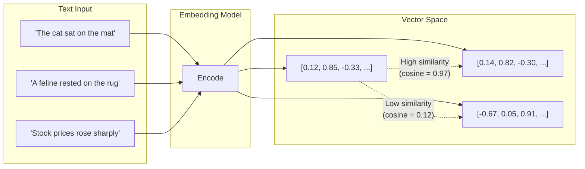
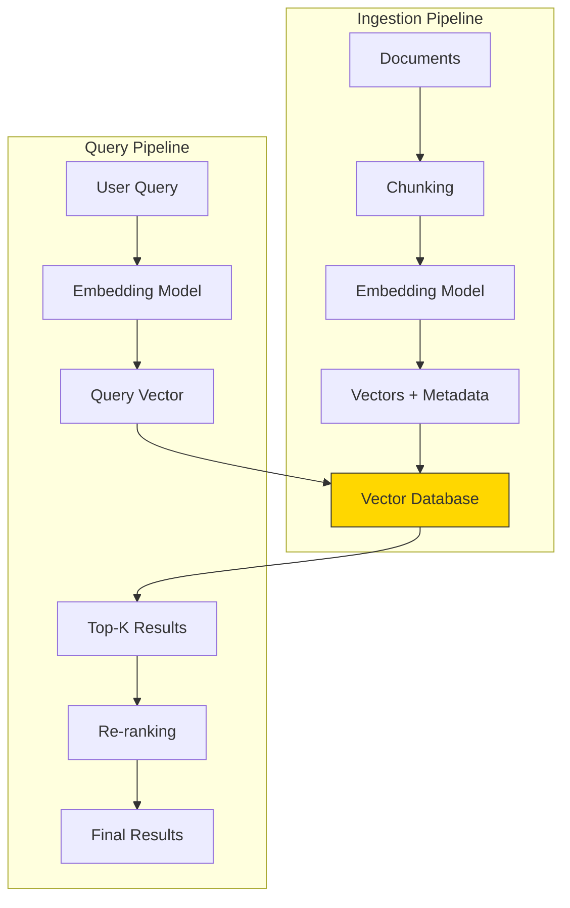
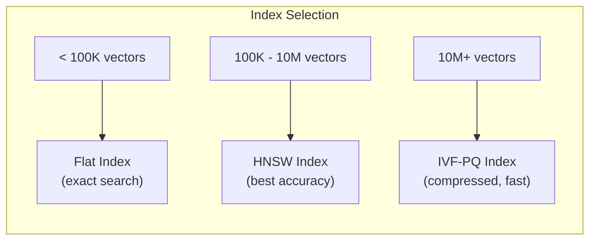

# Embeddings and Vector Stores

Agents need to retrieve relevant information from large knowledge bases. The core technology enabling this is **vector search** -- converting text into numerical vectors (embeddings) and finding the most similar vectors at query time. This page covers the full pipeline from embedding generation to production vector database deployment.

---

## What Are Embeddings?

An **embedding** is a dense numerical vector that captures the semantic meaning of a piece of text. Similar texts produce vectors that are close together in the embedding space; dissimilar texts produce vectors that are far apart.



Key properties of embeddings:

- **Fixed dimensionality** -- regardless of input length, the output vector has a fixed number of dimensions (e.g., 1536 for OpenAI `text-embedding-3-small`).
- **Semantic capture** -- embeddings encode meaning, not just surface-level word overlap. "Dog" and "puppy" will have high similarity. "Bank" (financial) and "bank" (river) will differ based on context.
- **Composability** -- you can embed sentences, paragraphs, or entire documents.

---

## Embedding Models

| Model | Provider | Dimensions | Max Tokens | Use Case |
|---|---|---|---|---|
| `text-embedding-3-small` | OpenAI | 1536 | 8,191 | Cost-effective general purpose |
| `text-embedding-3-large` | OpenAI | 3072 | 8,191 | High-accuracy retrieval |
| `all-MiniLM-L6-v2` | Sentence Transformers | 384 | 256 | Fast, local, lightweight |
| `all-mpnet-base-v2` | Sentence Transformers | 768 | 384 | Best quality open-source |
| `bge-large-en-v1.5` | BAAI | 1024 | 512 | Top MTEB benchmark performer |
| `Cohere embed-v3` | Cohere | 1024 | 512 | Multi-language support |
| `voyage-3` | Voyage AI | 1024 | 32,000 | Long-context embeddings |

:::tip Choosing an Embedding Model
For agentic systems, the most important factors are: (1) **retrieval accuracy** on your specific domain, (2) **latency** for real-time tool use, and (3) **cost** at your expected query volume. Run benchmarks on your own data before committing to a model.
:::

---

## Generating Embeddings

### Using the OpenAI API

```python
from openai import OpenAI

client = OpenAI()


def get_embeddings(texts: list[str], model: str = "text-embedding-3-small") -> list[list[float]]:
    """Generate embeddings for a list of texts."""
    response = client.embeddings.create(
        input=texts,
        model=model,
    )
    return [item.embedding for item in response.data]


# Generate embeddings for sample documents
documents = [
    "Retrieval-Augmented Generation combines search with LLM generation.",
    "Vector databases store and index high-dimensional embeddings.",
    "The transformer architecture uses self-attention mechanisms.",
]

embeddings = get_embeddings(documents)
print(f"Number of embeddings: {len(embeddings)}")
print(f"Embedding dimensions: {len(embeddings[0])}")
# Output: Number of embeddings: 3
# Output: Embedding dimensions: 1536
```

### Using Sentence Transformers (Local, Free)

```python
from sentence_transformers import SentenceTransformer
import numpy as np

model = SentenceTransformer("all-MiniLM-L6-v2")

documents = [
    "Retrieval-Augmented Generation combines search with LLM generation.",
    "Vector databases store and index high-dimensional embeddings.",
    "The transformer architecture uses self-attention mechanisms.",
]

embeddings = model.encode(documents)
print(f"Shape: {embeddings.shape}")  # (3, 384)
```

---

## Similarity Search

Once you have embeddings, you need a way to find the most similar vectors to a query. The three most common distance metrics are:

### Cosine Similarity

Measures the angle between two vectors. Ranges from -1 (opposite) to 1 (identical). The most commonly used metric for text embeddings.

```
cosine_similarity(A, B) = (A . B) / (||A|| * ||B||)
```

### Dot Product

The raw dot product of two vectors. Equivalent to cosine similarity when vectors are normalized (unit length). Faster to compute.

```
dot_product(A, B) = sum(A_i * B_i)
```

### Euclidean Distance (L2)

Measures the straight-line distance between two points in vector space. Lower is more similar.

```
euclidean(A, B) = sqrt(sum((A_i - B_i)^2))
```

```python
import numpy as np


def cosine_similarity(a: np.ndarray, b: np.ndarray) -> float:
    """Compute cosine similarity between two vectors."""
    return np.dot(a, b) / (np.linalg.norm(a) * np.linalg.norm(b))


def find_most_similar(
    query_embedding: np.ndarray,
    document_embeddings: np.ndarray,
    top_k: int = 3,
) -> list[tuple[int, float]]:
    """Find the top-k most similar documents to a query."""
    similarities = [
        cosine_similarity(query_embedding, doc_emb)
        for doc_emb in document_embeddings
    ]
    ranked = sorted(enumerate(similarities), key=lambda x: x[1], reverse=True)
    return ranked[:top_k]


# Example usage
query = model.encode(["How does RAG work?"])
results = find_most_similar(query[0], embeddings, top_k=2)
for idx, score in results:
    print(f"Score: {score:.4f} | Document: {documents[idx]}")
```

<details>
<summary><strong>Deep Dive: When to Use Which Distance Metric</strong></summary>

| Metric | Best For | Normalization Required | Speed |
|---|---|---|---|
| **Cosine** | General text similarity | No (handles magnitude differences) | Medium |
| **Dot Product** | Pre-normalized embeddings (OpenAI, Cohere) | Yes (assumes unit vectors) | Fast |
| **Euclidean** | When magnitude carries meaning | No | Medium |

Most embedding providers (OpenAI, Cohere) return normalized vectors, so cosine similarity and dot product produce identical rankings. Use dot product for speed in production. If you are using an embedding model that does not normalize outputs, prefer cosine similarity.

</details>

---

## Vector Databases

For production systems, you cannot compute similarity against every document on every query. **Vector databases** provide efficient approximate nearest neighbor (ANN) search, scaling to millions or billions of vectors.



### Comparison of Vector Databases

| Database | Type | Hosting | Strengths | Best For |
|---|---|---|---|---|
| **FAISS** | Library | In-process | Extremely fast, battle-tested | Research, prototyping, single-node |
| **Chroma** | Embedded | In-process / Server | Simple API, great DX | Prototyping, small-medium datasets |
| **Pinecone** | Managed SaaS | Cloud | Zero ops, high availability | Production, teams without infra expertise |
| **Weaviate** | Self-hosted / Cloud | Both | Hybrid search, modules | Multi-modal, complex filtering |
| **Qdrant** | Self-hosted / Cloud | Both | Rich filtering, Rust performance | Production with complex metadata queries |
| **Milvus** | Self-hosted / Cloud | Both | Massive scale, GPU support | Billion-scale deployments |
| **pgvector** | Extension | PostgreSQL | Familiar SQL interface | Teams already using PostgreSQL |

---

## Code Examples with Popular Vector Databases

### FAISS (Local, In-Memory)

```python
import faiss
import numpy as np
from sentence_transformers import SentenceTransformer

model = SentenceTransformer("all-MiniLM-L6-v2")

# Prepare documents and embeddings
documents = [
    "Agents use tools to interact with external systems.",
    "RAG combines retrieval with generation for grounded responses.",
    "Multi-agent systems coordinate multiple specialized agents.",
    "Vector databases enable fast similarity search at scale.",
    "Fine-tuning adapts pre-trained models to specific tasks.",
]
embeddings = model.encode(documents).astype("float32")

# Build FAISS index
dimension = embeddings.shape[1]  # 384
index = faiss.IndexFlatL2(dimension)  # Exact search (L2 distance)
index.add(embeddings)

print(f"Index contains {index.ntotal} vectors")

# Query
query = model.encode(["How do agents call APIs?"]).astype("float32")
distances, indices = index.search(query, k=3)

for i, (dist, idx) in enumerate(zip(distances[0], indices[0])):
    print(f"Rank {i+1} | Distance: {dist:.4f} | {documents[idx]}")
```

### ChromaDB

```python
import chromadb
from chromadb.utils import embedding_functions

# Initialize client and embedding function
client = chromadb.Client()
ef = embedding_functions.SentenceTransformerEmbeddingFunction(
    model_name="all-MiniLM-L6-v2"
)

# Create collection
collection = client.create_collection(
    name="agent_knowledge",
    embedding_function=ef,
    metadata={"hnsw:space": "cosine"},
)

# Add documents with metadata
collection.add(
    documents=[
        "Agents use tools to interact with external systems.",
        "RAG combines retrieval with generation for grounded responses.",
        "Multi-agent systems coordinate multiple specialized agents.",
    ],
    metadatas=[
        {"topic": "agents", "difficulty": "beginner"},
        {"topic": "rag", "difficulty": "intermediate"},
        {"topic": "multi-agent", "difficulty": "advanced"},
    ],
    ids=["doc1", "doc2", "doc3"],
)

# Query with metadata filtering
results = collection.query(
    query_texts=["How do agents use tools?"],
    n_results=2,
    where={"difficulty": {"$ne": "advanced"}},
)

for doc, score in zip(results["documents"][0], results["distances"][0]):
    print(f"Score: {score:.4f} | {doc}")
```

---

## Indexing Strategies

Vector databases use **approximate nearest neighbor (ANN)** algorithms to make search fast. Understanding these algorithms helps you choose the right index for your use case.

### Common ANN Algorithms

| Algorithm | How It Works | Trade-off |
|---|---|---|
| **Flat (Brute Force)** | Computes distance to every vector | 100% recall, slow at scale |
| **IVF (Inverted File)** | Clusters vectors, searches only nearby clusters | Fast, needs tuning (nprobe) |
| **HNSW** | Builds a multi-layer graph of connected vectors | Best recall/speed balance, high memory |
| **PQ (Product Quantization)** | Compresses vectors into compact codes | Low memory, lower accuracy |
| **IVF-PQ** | Combines IVF clustering with PQ compression | Scales to billions, good balance |



:::warning HNSW Memory Usage
HNSW indexes store the full vector data plus a graph structure in memory. For 1 million 1536-dimensional vectors (float32), expect approximately 6 GB of RAM for vectors alone, plus 2-4 GB for the graph. Plan your infrastructure accordingly.
:::

<details>
<summary><strong>Deep Dive: Tuning HNSW Parameters</strong></summary>

HNSW (Hierarchical Navigable Small World) has two key parameters:

- **`M`** (default: 16) -- the number of connections per node in the graph. Higher M means better recall but more memory and slower index build. Range: 12-48.
- **`ef_construction`** (default: 200) -- the search breadth during index building. Higher values produce a better graph but take longer to build. Range: 100-500.
- **`ef_search`** (runtime, default: 50) -- the search breadth at query time. Higher values improve recall at the cost of latency. Range: 50-500.

Recommended starting points:

| Dataset Size | M | ef_construction | ef_search |
|---|---|---|---|
| < 100K | 16 | 200 | 100 |
| 100K - 1M | 24 | 300 | 200 |
| 1M - 10M | 32 | 400 | 300 |

Always benchmark on your specific data and query patterns. The optimal parameters depend on the distribution of your vectors.

</details>

---

## Metadata Filtering

Real-world retrieval is rarely pure vector search. You almost always need to filter results by metadata (date, category, user ID, permissions). This is called **filtered search** or **hybrid search**.

```python
# Qdrant example with payload filtering
from qdrant_client import QdrantClient
from qdrant_client.models import (
    Distance,
    FieldCondition,
    Filter,
    MatchValue,
    PointStruct,
    VectorParams,
)

client = QdrantClient(":memory:")

client.create_collection(
    collection_name="knowledge_base",
    vectors_config=VectorParams(size=384, distance=Distance.COSINE),
)

# Insert documents with rich metadata
client.upsert(
    collection_name="knowledge_base",
    points=[
        PointStruct(
            id=1,
            vector=model.encode("Agent memory architectures").tolist(),
            payload={
                "topic": "agents",
                "section": "core-concepts",
                "difficulty": "advanced",
                "last_updated": "2026-01-15",
            },
        ),
        PointStruct(
            id=2,
            vector=model.encode("RAG pipeline basics").tolist(),
            payload={
                "topic": "rag",
                "section": "foundations",
                "difficulty": "beginner",
                "last_updated": "2026-03-01",
            },
        ),
    ],
)

# Search with metadata filters
results = client.query_points(
    collection_name="knowledge_base",
    query=model.encode("How do agents remember things?").tolist(),
    query_filter=Filter(
        must=[
            FieldCondition(key="topic", match=MatchValue(value="agents")),
        ]
    ),
    limit=5,
)
```

:::info Filtering Strategy Matters
There are two approaches to filtered search: **pre-filtering** (filter first, then ANN search on the subset) and **post-filtering** (ANN search first, then filter results). Pre-filtering is more accurate but slower for selective filters. Post-filtering is faster but may return fewer results than requested. Most production databases use a hybrid approach.
:::

---

## Embedding Best Practices for Agentic Systems

| Practice | Description |
|---|---|
| **Chunk before embedding** | Embed chunks (256-512 tokens), not entire documents. Retrieval accuracy drops for long texts. |
| **Store raw text alongside vectors** | You need the original text for generation. Vectors are for search only. |
| **Use the same model for queries and documents** | Mismatched models produce incompatible vector spaces. |
| **Normalize vectors** | If your model does not auto-normalize, normalize before indexing for consistent similarity scores. |
| **Version your embeddings** | When you change the embedding model, you must re-embed all documents. Track which model version produced each vector. |
| **Batch embedding calls** | API embedding calls support batching. Embed 100-2000 texts per call to reduce overhead. |
| **Cache embeddings** | For repeated queries (e.g., common agent tool calls), cache the query embedding. |

---

## Interview Questions

<details>
<summary><strong>Q: You are building a RAG system for a 10-million-document corpus. Walk me through your vector database selection and indexing strategy.</strong></summary>

At 10M documents, I would choose a production-grade vector database like Qdrant or Milvus, or Pinecone if managed infrastructure is preferred. For the index, I would use HNSW if memory permits (~60 GB for 10M x 1536-dim vectors), or IVF-PQ if memory is constrained. I would chunk documents to 512 tokens, use a high-quality embedding model (text-embedding-3-large or bge-large), and build metadata indices for common filter fields. I would also implement a re-ranking stage using a cross-encoder model to improve precision in the final results.

</details>

<details>
<summary><strong>Q: Why might cosine similarity return unexpected results for very short texts?</strong></summary>

Short texts (1-3 words) produce embeddings that are heavily influenced by the model's global semantic space rather than the specific meaning of those words. The embedding of "bank" might end up equidistant between financial and river contexts. Additionally, short texts have less information for the model to create a discriminative embedding. Mitigation: expand short queries with context (e.g., "bank: financial institution" instead of just "bank"), or use a model specifically trained for short-text similarity like `all-MiniLM-L6-v2`.

</details>

<details>
<summary><strong>Q: An agent's retrieval tool is returning irrelevant results. How do you diagnose and fix this?</strong></summary>

Diagnostic steps: (1) Inspect the actual query being embedded -- is it the user's question or a reformulated version? (2) Check the embedding similarity scores -- are they uniformly low (bad embeddings) or all high (embedding collapse)? (3) Examine the retrieved chunks -- are they the wrong granularity? (4) Test with known-relevant documents -- can the system find them at all? Fixes: (1) Add a query reformulation step that transforms the agent's internal query into a better search query. (2) Adjust chunk size and overlap. (3) Add a re-ranking step with a cross-encoder. (4) Implement hybrid search (BM25 + vector) to combine lexical and semantic matching.

</details>

---

## Further Reading

- [MTEB Leaderboard (Massive Text Embedding Benchmark)](https://huggingface.co/spaces/mteb/leaderboard)
- [FAISS Wiki](https://github.com/facebookresearch/faiss/wiki)
- [Pinecone Learning Center](https://www.pinecone.io/learn/)
- [HNSW Paper (Malkov & Yashunin, 2018)](https://arxiv.org/abs/1603.09320)
