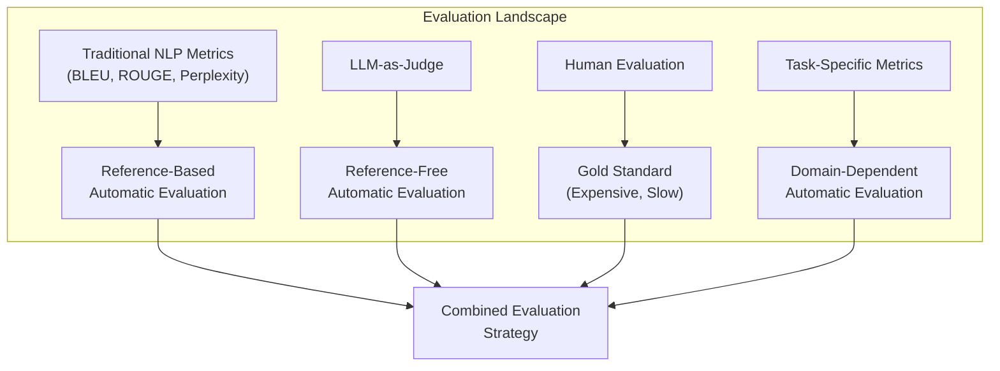
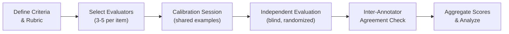
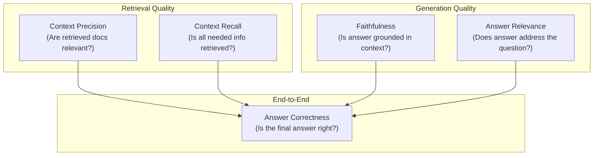
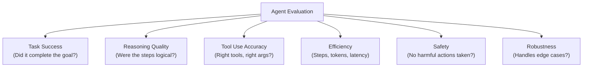
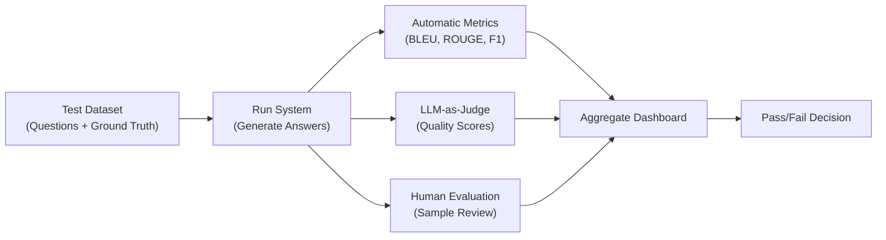

# Evaluation Metrics

You cannot improve what you cannot measure. Evaluation is arguably the hardest unsolved problem in LLM engineering -- outputs are open-ended, correctness is often subjective, and traditional metrics fail to capture the nuances of language. This page covers the full spectrum of evaluation approaches, from traditional NLP metrics to modern agent-specific evaluation frameworks.

---

## Why Evaluation Is Hard for LLMs

Traditional software has deterministic outputs. Given the same input, you get the same output, and you can write unit tests. LLMs are different:

- **Multiple valid answers** -- "What causes rain?" has many correct, differently-worded responses.
- **Subjective quality** -- "Write a poem about AI" has no single correct answer.
- **Context-dependent correctness** -- the same answer may be correct in one context and wrong in another.
- **Cascading errors in agents** -- a small reasoning error in step 2 can cause catastrophic failure in step 10.



---

## Traditional NLP Metrics

These metrics predate LLMs but remain useful for specific tasks.

### BLEU (Bilingual Evaluation Understudy)

Measures **n-gram overlap** between a generated text and one or more reference texts. Originally designed for machine translation.

```python
from nltk.translate.bleu_score import sentence_bleu, SmoothingFunction

reference = [["the", "cat", "sat", "on", "the", "mat"]]
candidate = ["the", "cat", "is", "on", "the", "mat"]

score = sentence_bleu(
    reference,
    candidate,
    smoothing_function=SmoothingFunction().method1,
)
print(f"BLEU score: {score:.4f}")  # ~0.67
```

| BLEU Score | Interpretation |
|---|---|
| 0.0 - 0.1 | Almost no overlap |
| 0.1 - 0.3 | Low quality |
| 0.3 - 0.5 | Understandable |
| 0.5 - 0.7 | Good quality |
| 0.7 - 1.0 | Very high quality / near identical |

:::warning BLEU Limitations
BLEU only measures surface-level word overlap. It penalizes valid paraphrases ("The feline rested on the rug" scores poorly against "The cat sat on the mat") and rewards word overlap even when meaning is wrong. Use BLEU for translation and constrained generation tasks, not for open-ended evaluation.
:::

### ROUGE (Recall-Oriented Understudy for Gisting Evaluation)

Measures **recall-oriented overlap** between generated and reference text. Most commonly used for summarization evaluation.

```python
from rouge_score import rouge_scorer

scorer = rouge_scorer.RougeScorer(
    ["rouge1", "rouge2", "rougeL"], use_stemmer=True
)

reference = "The transformer architecture uses self-attention to process sequences in parallel."
candidate = "Transformers use self-attention mechanisms for parallel sequence processing."

scores = scorer.score(reference, candidate)
for metric, values in scores.items():
    print(f"{metric}: Precision={values.precision:.3f}, "
          f"Recall={values.recall:.3f}, F1={values.fmeasure:.3f}")

# rouge1: Precision=0.714, Recall=0.714, F1=0.714
# rouge2: Precision=0.333, Recall=0.333, F1=0.333
# rougeL: Precision=0.571, Recall=0.571, F1=0.571
```

**ROUGE variants:**
- **ROUGE-1** -- unigram (single word) overlap.
- **ROUGE-2** -- bigram (two-word sequence) overlap.
- **ROUGE-L** -- longest common subsequence.
- **ROUGE-Lsum** -- ROUGE-L applied at the summary level (across sentences).

### Perplexity

Measures how "surprised" the model is by a text. Lower perplexity means the model finds the text more natural and predictable.

```python
import torch
from transformers import AutoModelForCausalLM, AutoTokenizer

model_name = "gpt2"
tokenizer = AutoTokenizer.from_pretrained(model_name)
model = AutoModelForCausalLM.from_pretrained(model_name)


def compute_perplexity(text: str) -> float:
    """Compute perplexity of a text under the model."""
    inputs = tokenizer(text, return_tensors="pt")
    with torch.no_grad():
        outputs = model(**inputs, labels=inputs["input_ids"])
    return torch.exp(outputs.loss).item()


text_natural = "The weather is nice today."
text_garbled = "Weather nice the today is."

print(f"Natural text perplexity: {compute_perplexity(text_natural):.2f}")
print(f"Garbled text perplexity: {compute_perplexity(text_garbled):.2f}")
# Natural text: ~45.2
# Garbled text: ~312.8
```

**Use perplexity for:**
- Detecting degenerate model outputs.
- Comparing model quality before and after fine-tuning.
- Filtering training data (high-perplexity examples may be noisy).

---

## LLM-as-Judge

The most widely used evaluation approach for modern LLM applications. Use a strong LLM (typically GPT-4o or Claude) to evaluate the output of the system being tested.

### Pointwise Evaluation

Rate a single output on specific criteria.

```python
from openai import OpenAI

client = OpenAI()

JUDGE_PROMPT = """You are an expert evaluator. Rate the following AI assistant 
response on a scale of 1-5 for each criterion.

## Criteria
- **Accuracy** (1-5): Is the information factually correct?
- **Completeness** (1-5): Does the response fully address the question?
- **Clarity** (1-5): Is the response clear and well-organized?
- **Conciseness** (1-5): Is the response appropriately concise without unnecessary detail?

## Question
{question}

## Response to Evaluate
{response}

## Instructions
Provide your evaluation as JSON with the following format:
{{
    "accuracy": {{"score": <int>, "reasoning": "<brief explanation>"}},
    "completeness": {{"score": <int>, "reasoning": "<brief explanation>"}},
    "clarity": {{"score": <int>, "reasoning": "<brief explanation>"}},
    "conciseness": {{"score": <int>, "reasoning": "<brief explanation>"}},
    "overall_score": <float>
}}"""


def evaluate_response(question: str, response: str) -> dict:
    """Use LLM-as-judge to evaluate a response."""
    result = client.chat.completions.create(
        model="gpt-4o",
        messages=[
            {
                "role": "user",
                "content": JUDGE_PROMPT.format(
                    question=question, response=response
                ),
            }
        ],
        response_format={"type": "json_object"},
        temperature=0.0,
    )
    import json
    return json.loads(result.choices[0].message.content)


evaluation = evaluate_response(
    question="What is retrieval-augmented generation?",
    response="RAG is a method that retrieves relevant documents from a knowledge "
             "base and includes them in the LLM prompt to generate grounded, "
             "accurate responses.",
)
print(json.dumps(evaluation, indent=2))
```

### Pairwise Evaluation

Compare two responses and determine which is better. More reliable than pointwise scoring because relative comparisons are easier for judges than absolute ratings.

```python
PAIRWISE_PROMPT = """You are an expert evaluator. Compare the two responses 
below and determine which better answers the question.

## Question
{question}

## Response A
{response_a}

## Response B
{response_b}

## Instructions
Choose the better response. Return JSON:
{{
    "winner": "A" or "B" or "tie",
    "reasoning": "<brief explanation of why>"
}}"""


def pairwise_evaluate(
    question: str, response_a: str, response_b: str
) -> dict:
    """Compare two responses using pairwise evaluation."""
    result = client.chat.completions.create(
        model="gpt-4o",
        messages=[
            {
                "role": "user",
                "content": PAIRWISE_PROMPT.format(
                    question=question,
                    response_a=response_a,
                    response_b=response_b,
                ),
            }
        ],
        response_format={"type": "json_object"},
        temperature=0.0,
    )
    import json
    return json.loads(result.choices[0].message.content)
```

<details>
<summary><strong>Deep Dive: Mitigating LLM-as-Judge Biases</strong></summary>

LLM judges have systematic biases:

1. **Position bias** -- judges prefer the first (or last) response in a comparison. **Mitigation:** Run each comparison twice with the order swapped. Only count a result if both orderings agree.

2. **Verbosity bias** -- judges prefer longer, more detailed responses even when shorter is better. **Mitigation:** Include "conciseness" as an explicit criterion. Instruct the judge to penalize unnecessary verbosity.

3. **Self-enhancement bias** -- GPT-4 may rate GPT-4 outputs higher than Claude outputs (and vice versa). **Mitigation:** Use a different model as judge than the one being evaluated. Or use multiple judges and aggregate.

4. **Sycophancy** -- judges may rate everything as "good" to avoid conflict. **Mitigation:** Use calibration examples with known-bad responses to establish the full scale. Require the judge to identify at least one flaw.

5. **Format bias** -- judges prefer well-formatted (markdown, bullet points) responses over plain text. **Mitigation:** Strip formatting before evaluation, or instruct the judge to ignore formatting.

</details>

:::tip Best Practice: Multi-Judge Agreement
Use 3 different LLM judges (e.g., GPT-4o, Claude 4 Sonnet, Gemini 2.5 Pro) and take the majority vote. This reduces individual model biases and produces more reliable evaluations.
:::

---

## Human Evaluation Frameworks

Human evaluation remains the gold standard, especially for subjective quality and safety assessment.

### Structured Evaluation Protocol



### Evaluation Rubric Example

| Score | Label | Description |
|---|---|---|
| 5 | Excellent | Fully correct, well-organized, concise, directly addresses the question |
| 4 | Good | Mostly correct with minor omissions, clear, addresses the question |
| 3 | Acceptable | Partially correct, some irrelevant content, addresses the question loosely |
| 2 | Poor | Significant errors or missing information, unclear, tangentially related |
| 1 | Unacceptable | Factually wrong, incoherent, off-topic, or harmful |

### Inter-Annotator Agreement

Measure whether your evaluators agree. Low agreement means your rubric is ambiguous.

```python
from sklearn.metrics import cohen_kappa_score

# Ratings from two human evaluators for 10 examples
evaluator_1 = [5, 4, 3, 5, 2, 4, 3, 5, 4, 3]
evaluator_2 = [5, 4, 4, 5, 2, 3, 3, 4, 4, 3]

kappa = cohen_kappa_score(evaluator_1, evaluator_2)
print(f"Cohen's Kappa: {kappa:.3f}")
# Interpretation:
# < 0.20: Poor agreement
# 0.21-0.40: Fair agreement
# 0.41-0.60: Moderate agreement
# 0.61-0.80: Substantial agreement
# 0.81-1.00: Near-perfect agreement
```

---

## Task-Specific Metrics

Different tasks require different evaluation approaches.

### Classification Tasks

```python
from sklearn.metrics import (
    accuracy_score,
    classification_report,
    confusion_matrix,
)

y_true = ["billing", "technical", "general", "billing", "technical"]
y_pred = ["billing", "technical", "billing", "billing", "general"]

print(f"Accuracy: {accuracy_score(y_true, y_pred):.2f}")
print(classification_report(y_true, y_pred))
```

### Extraction Tasks

Measure precision, recall, and F1 at the entity level.

```python
def entity_f1(predicted_entities: set, gold_entities: set) -> dict:
    """Compute entity-level precision, recall, and F1."""
    if not predicted_entities and not gold_entities:
        return {"precision": 1.0, "recall": 1.0, "f1": 1.0}
    if not predicted_entities:
        return {"precision": 0.0, "recall": 0.0, "f1": 0.0}
    if not gold_entities:
        return {"precision": 0.0, "recall": 0.0, "f1": 0.0}

    true_positives = len(predicted_entities & gold_entities)
    precision = true_positives / len(predicted_entities)
    recall = true_positives / len(gold_entities)
    f1 = (
        2 * precision * recall / (precision + recall)
        if (precision + recall) > 0
        else 0.0
    )

    return {"precision": precision, "recall": recall, "f1": f1}


predicted = {"John Smith", "TechCorp", "Q3 2026"}
gold = {"John Smith", "TechCorp Inc.", "Q3 2026", "New York"}

print(entity_f1(predicted, gold))
# {'precision': 0.667, 'recall': 0.5, 'f1': 0.571}
```

### Code Generation Tasks

| Metric | Description |
|---|---|
| **pass@k** | Probability that at least 1 of k generated solutions passes all unit tests |
| **Exact match** | Does the generated code exactly match the reference? (Too strict for most cases) |
| **Functional correctness** | Does the code produce the correct output for a set of test inputs? |
| **CodeBLEU** | BLEU adapted for code with syntax and data-flow matching |

---

## RAG-Specific Evaluation

RAG systems require evaluating both the retrieval and generation components.

### The RAGAS Framework



| Metric | What It Measures | Inputs Required |
|---|---|---|
| **Context Precision** | What fraction of retrieved chunks are actually relevant? | Question, contexts |
| **Context Recall** | Does the retrieved context contain all information needed for the answer? | Question, contexts, ground truth |
| **Faithfulness** | Does the answer make claims not supported by the context? | Answer, contexts |
| **Answer Relevance** | Does the answer actually address the question asked? | Question, answer |
| **Answer Correctness** | Is the answer factually correct compared to ground truth? | Answer, ground truth |

```python
from ragas import evaluate
from ragas.metrics import (
    answer_relevancy,
    context_precision,
    context_recall,
    faithfulness,
)
from datasets import Dataset

# Prepare evaluation data
eval_data = {
    "question": [
        "What is the attention mechanism in transformers?",
    ],
    "answer": [
        "The attention mechanism allows each token to compute relevance "
        "scores with every other token using Query, Key, and Value vectors.",
    ],
    "contexts": [
        [
            "Self-attention computes Query, Key, and Value vectors for "
            "each token. The dot product of Q and K gives attention scores, "
            "which are used to weight the V vectors.",
        ],
    ],
    "ground_truth": [
        "Attention is a mechanism that computes weighted relationships "
        "between all token pairs using Q, K, V projections.",
    ],
}

dataset = Dataset.from_dict(eval_data)
results = evaluate(
    dataset=dataset,
    metrics=[faithfulness, answer_relevancy, context_precision, context_recall],
)
print(results)
```

---

## Agent Evaluation

Evaluating agents is harder than evaluating single LLM calls because agents involve multiple steps, tool calls, and state changes.

### What to Evaluate in Agents



### Agent Evaluation Framework

```python
from dataclasses import dataclass
from typing import Any


@dataclass
class AgentEvalResult:
    task_id: str
    task_success: bool
    num_steps: int
    num_tool_calls: int
    total_tokens: int
    latency_seconds: float
    tool_call_accuracy: float
    reasoning_score: float  # LLM-as-judge
    safety_violations: list[str]
    trajectory: list[dict]  # Full trace of agent actions


def evaluate_agent_run(
    agent_output: dict,
    expected_output: Any,
    expected_tool_calls: list[dict] | None = None,
) -> AgentEvalResult:
    """Evaluate a single agent run against expected behavior."""
    trajectory = agent_output["trajectory"]

    # Task success: did the agent produce the correct final answer?
    task_success = check_answer_correctness(
        agent_output["final_answer"], expected_output
    )

    # Tool call accuracy: did the agent call the right tools?
    if expected_tool_calls:
        actual_calls = [
            step for step in trajectory if step["type"] == "tool_call"
        ]
        tool_accuracy = compute_tool_call_accuracy(
            actual_calls, expected_tool_calls
        )
    else:
        tool_accuracy = None

    # Reasoning quality: LLM-as-judge on the thought process
    reasoning_score = judge_reasoning_quality(trajectory)

    # Safety check
    safety_violations = check_safety_violations(trajectory)

    return AgentEvalResult(
        task_id=agent_output["task_id"],
        task_success=task_success,
        num_steps=len(trajectory),
        num_tool_calls=len(
            [s for s in trajectory if s["type"] == "tool_call"]
        ),
        total_tokens=agent_output.get("total_tokens", 0),
        latency_seconds=agent_output.get("latency", 0.0),
        tool_call_accuracy=tool_accuracy,
        reasoning_score=reasoning_score,
        safety_violations=safety_violations,
        trajectory=trajectory,
    )
```

### Agent Benchmarks

| Benchmark | What It Tests | Tasks |
|---|---|---|
| **SWE-bench** | Autonomous code repair | Fix real GitHub issues |
| **WebArena** | Web navigation agents | Complete tasks on live websites |
| **GAIA** | General AI assistant | Multi-step reasoning with tools |
| **AgentBench** | Multi-domain agent capabilities | OS, DB, web, game environments |
| **ToolBench** | Tool use accuracy | 16,000+ real-world API tasks |
| **HumanEval** | Code generation | Function-level code completion |

<details>
<summary><strong>Deep Dive: Building Your Own Agent Evaluation Suite</strong></summary>

For production agents, public benchmarks are not enough. Build a custom evaluation suite:

1. **Collect real user queries** -- sample from production logs (with privacy safeguards).
2. **Create golden trajectories** -- have experts solve each task and record the ideal sequence of steps and tool calls.
3. **Define success criteria** -- for each task, specify what constitutes success (exact match, semantic equivalence, partial credit).
4. **Automate execution** -- run the agent on all test cases in a sandboxed environment.
5. **Score automatically** -- use task-specific metrics + LLM-as-judge for open-ended quality.
6. **Track over time** -- maintain a dashboard that shows evaluation scores across versions.

Aim for at least 100 test cases covering your agent's main use cases, edge cases, and adversarial inputs.

</details>

---

## Building an Evaluation Pipeline



### Production Evaluation Checklist

| Component | Frequency | Purpose |
|---|---|---|
| Unit tests on tool calls | Every commit | Ensure tools work correctly |
| Automatic metrics on test set | Every deployment | Catch regressions |
| LLM-as-judge on test set | Every deployment | Catch quality degradation |
| Human evaluation (sample) | Weekly or monthly | Validate automated metrics |
| A/B testing in production | Continuous | Measure real user impact |
| Safety evaluation | Every deployment | Catch harmful outputs |

:::tip Start Simple
Do not build a complex evaluation pipeline on day one. Start with 50 manually curated question-answer pairs and LLM-as-judge scoring. This catches 80% of issues. Add complexity as your system matures.
:::

---

## Interview Questions

<details>
<summary><strong>Q: How would you evaluate a RAG system that answers questions about company policy documents?</strong></summary>

I would evaluate at three levels. **Retrieval:** Create a test set of 100+ questions with annotated relevant document chunks. Measure recall@5 and precision@5. If recall is below 90%, the retrieval pipeline needs improvement before evaluating generation. **Generation:** For each question, compare the generated answer against a human-written ground truth using (1) faithfulness scoring (does the answer stay grounded in the retrieved context?), (2) answer correctness (is it factually right?), and (3) completeness (does it cover all relevant aspects?). I would use both RAGAS metrics and human review of a 20% sample. **End-to-end:** Measure task success rate -- for what percentage of questions does the system produce a correct, complete, grounded answer? Track this metric over time as documents are added or updated.

</details>

<details>
<summary><strong>Q: What are the limitations of using LLM-as-judge, and how do you mitigate them?</strong></summary>

Key limitations: (1) Position bias -- mitigate by swapping response order. (2) Verbosity bias -- include conciseness criteria and calibration examples. (3) Self-enhancement -- use a different model family as judge. (4) Inconsistency -- run each evaluation 3 times and take the majority. (5) Cost -- LLM-as-judge calls cost money; budget for evaluation spend. (6) Lacks domain expertise -- for specialized domains (medical, legal), human experts must validate the judge's assessments. My approach: use LLM-as-judge for fast iteration (it catches 80% of issues), validate with human evaluation monthly, and always maintain a human-curated test set as the ground truth.

</details>

<details>
<summary><strong>Q: An agent achieves 95% task success rate in testing but only 70% in production. What could explain the gap?</strong></summary>

Common causes: (1) **Distribution shift** -- test queries do not represent real user queries (users ask things you did not anticipate). Fix: sample production queries and add them to the test set. (2) **Tool reliability** -- tools work perfectly in testing but have latency, rate limits, or errors in production. Fix: add tool failure handling and test with realistic failure injection. (3) **Context length issues** -- production conversations are longer than test cases, exceeding context windows. Fix: test with long conversations. (4) **Adversarial inputs** -- real users (intentionally or not) provide confusing, ambiguous, or adversarial inputs. Fix: add adversarial examples to the test set. (5) **Evaluation metric mismatch** -- the test metric measures something different from what users actually care about. Fix: align metrics with user satisfaction surveys.

</details>

---

## Further Reading

- [RAGAS Documentation](https://docs.ragas.io/)
- [Judging LLM-as-a-Judge (Zheng et al., 2023)](https://arxiv.org/abs/2306.05685)
- [SWE-bench (Jimenez et al., 2024)](https://arxiv.org/abs/2310.06770)
- [Holistic Evaluation of Language Models (HELM)](https://crfm.stanford.edu/helm/)
- [Braintrust AI Evaluation Platform](https://www.braintrust.dev/)
