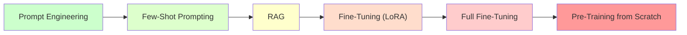
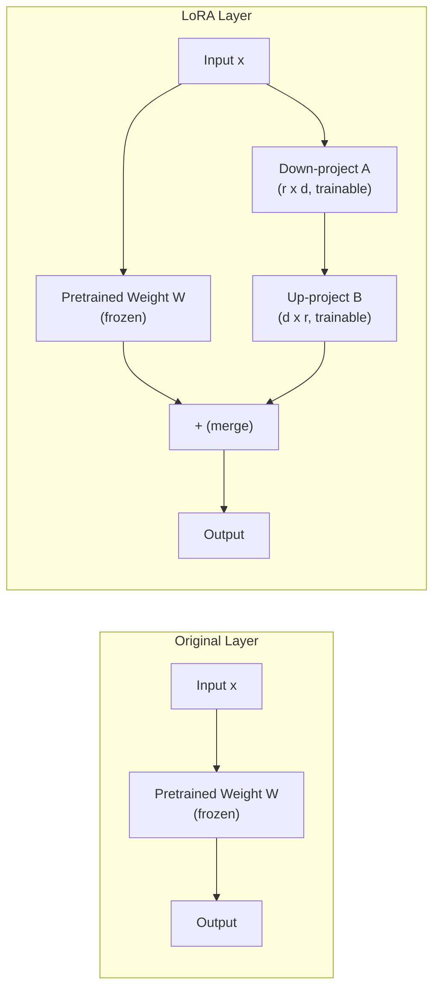
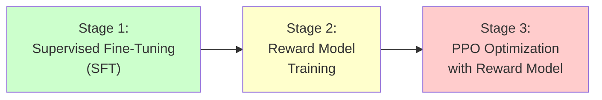
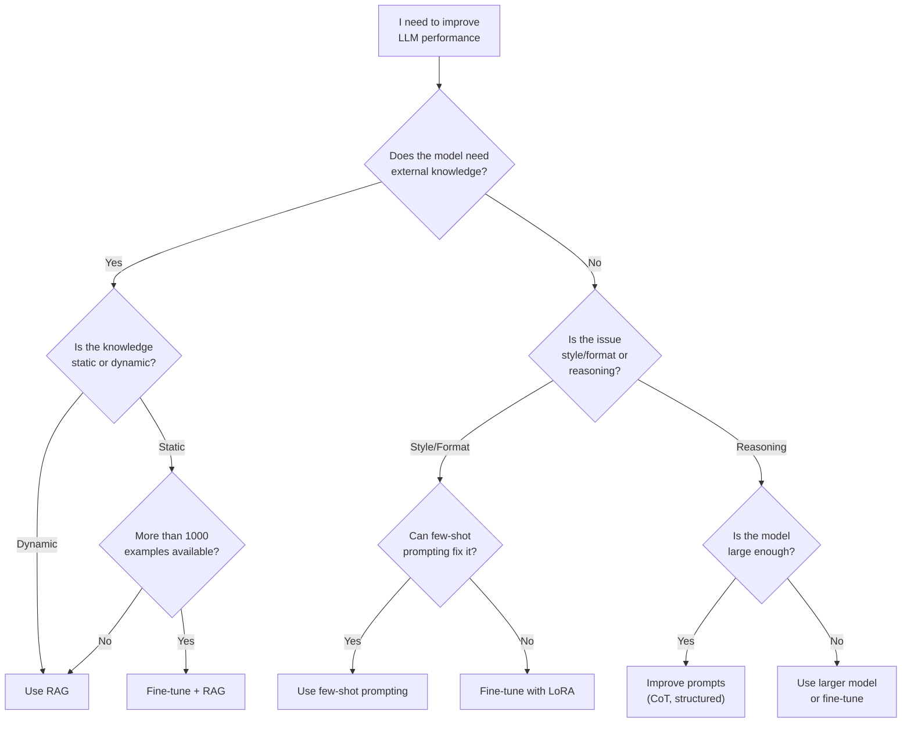

# Fine-Tuning Overview

Fine-tuning adapts a pre-trained LLM to a specific task or domain by training it further on your own data. This page covers when to fine-tune, the major fine-tuning techniques, and a decision framework for choosing between prompting, RAG, and fine-tuning.

---

## The Adaptation Spectrum

Before committing to fine-tuning, understand where it fits among other adaptation strategies.



Moving left to right, approaches become more expensive, more time-consuming, and harder to iterate on -- but also more powerful for specialized tasks.

| Approach | Cost | Data Needed | Time to Iterate | When to Use |
|---|---|---|---|---|
| Prompt engineering | Free | None | Minutes | First attempt at any task |
| Few-shot prompting | Token cost | 3-10 examples | Minutes | Improve output format/style |
| RAG | Infra + tokens | Your knowledge base | Hours | Need external knowledge |
| LoRA fine-tuning | $10-100 GPU | 100-10,000 examples | Hours | Change model behavior/style |
| Full fine-tuning | $1,000-100,000+ GPU | 10,000+ examples | Days | Deep domain specialization |

---

## When to Fine-Tune

Fine-tuning is the right choice when:

1. **The model needs to adopt a specific style or format** -- consistent tone, domain jargon, company voice that prompting cannot reliably reproduce.
2. **You need to reduce latency** -- a fine-tuned smaller model can match a larger model's performance on your specific task, at lower cost and latency.
3. **Few-shot examples are too expensive** -- if you need many examples per call and they consume too many tokens, bake that knowledge into the model weights instead.
4. **The task requires specialized reasoning** -- code generation for a proprietary language, medical diagnosis, legal analysis where the base model consistently underperforms.
5. **You have sufficient high-quality training data** -- at least 100 examples for LoRA, ideally 1,000+.

:::warning When NOT to Fine-Tune
Do not fine-tune when: (1) The base model already performs well with good prompting. (2) You need access to changing information -- use RAG instead. (3) You have fewer than 50 high-quality examples. (4) You need to iterate quickly -- prompt changes deploy in seconds; fine-tuning takes hours or days. (5) You lack the expertise to evaluate fine-tuned model quality and detect regression.
:::

---

## Full Fine-Tuning

Full fine-tuning updates **all parameters** of the model. This gives maximum control but requires significant compute and risks **catastrophic forgetting** -- the model loses its general capabilities while learning the new task.

```python
# Conceptual example using Hugging Face Transformers
from transformers import (
    AutoModelForCausalLM,
    AutoTokenizer,
    Trainer,
    TrainingArguments,
)
from datasets import load_dataset

model_name = "meta-llama/Llama-3.1-8B"
tokenizer = AutoTokenizer.from_pretrained(model_name)
model = AutoModelForCausalLM.from_pretrained(model_name)

dataset = load_dataset("json", data_files="training_data.jsonl")

training_args = TrainingArguments(
    output_dir="./fine_tuned_model",
    num_train_epochs=3,
    per_device_train_batch_size=4,
    gradient_accumulation_steps=8,
    learning_rate=2e-5,
    warmup_steps=100,
    logging_steps=10,
    save_strategy="epoch",
    bf16=True,
)

trainer = Trainer(
    model=model,
    args=training_args,
    train_dataset=dataset["train"],
    tokenizer=tokenizer,
)

trainer.train()
```

**Requirements for full fine-tuning of common model sizes:**

| Model Size | GPU Memory | Typical Hardware | Training Time (10K examples) |
|---|---|---|---|
| 7B | ~28 GB | 1x A100 80GB | 2-4 hours |
| 13B | ~52 GB | 2x A100 80GB | 4-8 hours |
| 70B | ~280 GB | 8x A100 80GB | 1-3 days |

---

## LoRA (Low-Rank Adaptation)

**LoRA** dramatically reduces the cost of fine-tuning by freezing the original model weights and injecting small, trainable **low-rank matrices** into each transformer layer. Instead of updating billions of parameters, you train only millions.



**Key LoRA parameters:**

| Parameter | Description | Typical Values |
|---|---|---|
| `r` (rank) | Dimension of the low-rank matrices | 8, 16, 32, 64 |
| `lora_alpha` | Scaling factor for LoRA updates | 16, 32 (often 2x rank) |
| `lora_dropout` | Dropout applied to LoRA layers | 0.05, 0.1 |
| `target_modules` | Which layers to apply LoRA to | `["q_proj", "v_proj"]` or all linear layers |

```python
from peft import LoraConfig, get_peft_model, TaskType

lora_config = LoraConfig(
    task_type=TaskType.CAUSAL_LM,
    r=16,
    lora_alpha=32,
    lora_dropout=0.05,
    target_modules=["q_proj", "k_proj", "v_proj", "o_proj"],
)

model = AutoModelForCausalLM.from_pretrained(model_name)
peft_model = get_peft_model(model, lora_config)

# Check trainable parameters
peft_model.print_trainable_parameters()
# Output: trainable params: 6,553,600 || all params: 8,030,261,248
#         || trainable%: 0.0816
```

**LoRA advantages:**
- Trains only ~0.1% of parameters (vs 100% for full fine-tuning).
- Requires 4-8x less GPU memory.
- Produces small adapter files (10-100 MB) that can be swapped at inference time.
- Multiple LoRA adapters can be loaded on the same base model for different tasks.

---

## QLoRA (Quantized LoRA)

**QLoRA** combines LoRA with **4-bit quantization** of the base model, reducing memory requirements even further. This makes it possible to fine-tune a 70B parameter model on a single GPU.

```python
from transformers import BitsAndBytesConfig
import torch

bnb_config = BitsAndBytesConfig(
    load_in_4bit=True,
    bnb_4bit_quant_type="nf4",
    bnb_4bit_compute_dtype=torch.bfloat16,
    bnb_4bit_use_double_quant=True,
)

model = AutoModelForCausalLM.from_pretrained(
    model_name,
    quantization_config=bnb_config,
    device_map="auto",
)

# Apply LoRA on top of quantized model
peft_model = get_peft_model(model, lora_config)
```

| Technique | 7B Model Memory | 70B Model Memory |
|---|---|---|
| Full fine-tuning | ~28 GB | ~280 GB |
| LoRA | ~16 GB | ~160 GB |
| QLoRA | ~6 GB | ~48 GB |

:::tip QLoRA Is the Default for Most Teams
Unless you have a dedicated ML infrastructure team and a fleet of A100 GPUs, QLoRA is the practical choice for fine-tuning. It achieves comparable quality to full fine-tuning at a fraction of the cost. Most open-source fine-tuning tutorials and tools (Axolotl, Unsloth) default to QLoRA.
:::

---

## RLHF (Reinforcement Learning from Human Feedback)

**RLHF** is the technique used to align models like ChatGPT with human preferences. It involves three stages:



1. **Supervised Fine-Tuning (SFT)** -- train the model on high-quality demonstrations of desired behavior.
2. **Reward Model Training** -- train a separate model to score outputs based on human preference rankings. Humans compare pairs of outputs and indicate which is better.
3. **PPO Optimization** -- use Proximal Policy Optimization (a reinforcement learning algorithm) to fine-tune the SFT model to maximize the reward model's score while staying close to the SFT model (to prevent reward hacking).

**RLHF is complex and expensive.** It requires:
- Thousands of human preference comparisons.
- Training and maintaining a separate reward model.
- Careful hyperparameter tuning to prevent mode collapse.
- Significant compute for the PPO training loop.

---

## DPO (Direct Preference Optimization)

**DPO** is a simpler alternative to RLHF that achieves similar alignment results without the reward model or RL training loop. It directly optimizes the language model on preference pairs.

```python
# DPO training data format
# Each example has a prompt, a preferred response, and a rejected response
dpo_training_data = [
    {
        "prompt": "Explain quantum computing in simple terms.",
        "chosen": "Quantum computing uses quantum bits (qubits) that can "
                  "represent 0, 1, or both simultaneously...",
        "rejected": "Quantum computing is a paradigm that leverages quantum "
                    "mechanical phenomena such as superposition and entanglement "
                    "to perform computations on quantum bits...",
    },
    {
        "prompt": "How do I handle errors in my Python code?",
        "chosen": "Use try/except blocks to catch and handle specific "
                  "exceptions. Here's an example:\n```python\ntry:\n    "
                  "result = 10 / 0\nexcept ZeroDivisionError:\n    "
                  "print('Cannot divide by zero')\n```",
        "rejected": "You should handle errors in your code. Python has "
                    "error handling mechanisms. You can use try and except.",
    },
]
```

```python
from trl import DPOTrainer, DPOConfig

dpo_config = DPOConfig(
    output_dir="./dpo_model",
    num_train_epochs=1,
    per_device_train_batch_size=4,
    learning_rate=5e-7,
    beta=0.1,  # Controls how much to deviate from reference model
    logging_steps=10,
)

trainer = DPOTrainer(
    model=peft_model,
    ref_model=None,  # Uses implicit reference with LoRA
    args=dpo_config,
    train_dataset=dpo_dataset,
    tokenizer=tokenizer,
)

trainer.train()
```

**DPO vs RLHF:**

| Aspect | RLHF | DPO |
|---|---|---|
| Complexity | High (3-stage pipeline) | Low (single training stage) |
| Reward model | Required | Not required |
| Training stability | Sensitive to hyperparameters | More stable |
| Compute cost | 2-3x more than DPO | Lower |
| Quality | Slightly better on complex tasks | Comparable for most tasks |

:::info Industry Trend
DPO has largely replaced RLHF in practice for most alignment tasks. Major open-source models (Llama 3, Mistral) use DPO or its variants (IPO, KTO) for alignment. RLHF remains relevant for frontier model training where marginal quality improvements justify the complexity.
:::

---

## Data Preparation for Fine-Tuning

The quality of your fine-tuning data determines the quality of your fine-tuned model. Garbage in, garbage out.

### Training Data Format

```json
{"messages": [
    {"role": "system", "content": "You are a helpful customer support agent."},
    {"role": "user", "content": "I need to return a product I bought last week."},
    {"role": "assistant", "content": "I'd be happy to help you with a return. Could you please provide your order number so I can look up the details?"}
]}
{"messages": [
    {"role": "system", "content": "You are a helpful customer support agent."},
    {"role": "user", "content": "My order hasn't arrived yet."},
    {"role": "assistant", "content": "I'm sorry to hear that. Let me check the status of your delivery. Could you share your order number?"}
]}
```

### Data Quality Checklist

| Criterion | Description |
|---|---|
| **Diversity** | Cover the full range of expected inputs |
| **Quality** | Every example should be a gold-standard response |
| **Consistency** | All examples should follow the same format and style |
| **Volume** | Minimum 100 examples for LoRA; 1,000+ for reliable results |
| **Balance** | Roughly equal representation of categories/intents |
| **Deduplication** | Remove near-duplicate examples |
| **Validation split** | Hold out 10-20% for evaluation |

<details>
<summary><strong>Deep Dive: Synthetic Data Generation for Fine-Tuning</strong></summary>

When you lack sufficient training data, you can use a stronger model (e.g., GPT-4o) to generate synthetic training data for a weaker model (e.g., Llama 3.1 8B). This technique is called **model distillation**.

Steps:
1. Define your task with clear instructions and examples.
2. Generate 100 diverse input prompts (manually or using an LLM).
3. Use the strong model to generate high-quality responses.
4. Have humans review and filter the generated data.
5. Fine-tune the weaker model on the filtered synthetic data.

This is cost-effective: generating 1,000 examples with GPT-4o costs roughly $5-20, while fine-tuning on that data can produce a model that handles 80-90% of the strong model's quality on your specific task.

**Caution:** Check the terms of service of the model you are distilling from. Some providers restrict using their model's outputs to train competing models.

</details>

---

## Decision Framework: Prompting vs RAG vs Fine-Tuning



### Quick Reference Decision Table

| Problem | Solution |
|---|---|
| Model does not know about my company's products | RAG |
| Model gives correct answers but in the wrong format | Fine-tuning (LoRA) |
| Model struggles with domain-specific reasoning | Fine-tuning + CoT prompting |
| Model needs real-time information | RAG with live data sources |
| Model is too slow / expensive for my use case | Fine-tune a smaller model to match |
| Model outputs are inconsistent | Fine-tuning + lower temperature |
| Model sometimes gives harmful responses | DPO alignment training |

---

## Evaluation of Fine-Tuned Models

Always evaluate on a held-out test set that the model never saw during training.

```python
from sklearn.metrics import accuracy_score, classification_report
import json


def evaluate_fine_tuned_model(model, tokenizer, test_data: list[dict]) -> dict:
    """Evaluate a fine-tuned model on held-out test data."""
    predictions = []
    ground_truths = []

    for example in test_data:
        prompt = example["messages"][:-1]  # All messages except the last
        expected = example["messages"][-1]["content"]

        inputs = tokenizer.apply_chat_template(
            prompt, return_tensors="pt"
        ).to(model.device)

        outputs = model.generate(inputs, max_new_tokens=512, temperature=0.0)
        predicted = tokenizer.decode(
            outputs[0][inputs.shape[1]:], skip_special_tokens=True
        )

        predictions.append(predicted)
        ground_truths.append(expected)

    return {
        "num_examples": len(test_data),
        "predictions": predictions,
        "ground_truths": ground_truths,
    }
```

### What to Measure

| Metric | What It Catches |
|---|---|
| **Task accuracy** | Does the model get the right answer? |
| **Format compliance** | Does the model follow the expected output format? |
| **Regression testing** | Has general capability degraded? (Test on unrelated tasks) |
| **Latency** | Is inference time acceptable? |
| **Toxicity/Safety** | Has fine-tuning introduced harmful behavior? |

:::warning Watch for Catastrophic Forgetting
After fine-tuning, always test the model on tasks outside your training domain. If performance on general tasks drops significantly, the model has experienced catastrophic forgetting. Mitigations: use LoRA (which preserves base model weights), reduce learning rate, add general-domain examples to training data.
:::

---

## Interview Questions

<details>
<summary><strong>Q: Your team is debating whether to use RAG or fine-tuning for a customer support chatbot. What questions would you ask to make the decision?</strong></summary>

Key questions: (1) Does the chatbot need access to real-time information (order status, inventory)? If yes, RAG is required regardless. (2) Is the issue that the model gives wrong answers or that it gives right answers in the wrong style? Wrong answers = RAG; wrong style = fine-tuning. (3) How many high-quality training examples do we have? Fewer than 100 = RAG; 1,000+ = fine-tuning is viable. (4) How often does the knowledge base change? Frequently = RAG; rarely = fine-tuning could bake it in. (5) What is our latency budget? Fine-tuned smaller models are faster than RAG with a large model. My typical recommendation: start with RAG for knowledge access, then add fine-tuning if the response style or format needs improvement.

</details>

<details>
<summary><strong>Q: Explain the difference between LoRA and full fine-tuning. When would you choose one over the other?</strong></summary>

Full fine-tuning updates all model parameters, giving maximum flexibility but requiring significant compute and risking catastrophic forgetting. LoRA freezes the base model and trains small low-rank adapter matrices, updating only 0.1% of parameters. Choose LoRA when: you have limited compute, you want to preserve general capabilities, you need to serve multiple task-specific adapters on one base model, or you are iterating quickly. Choose full fine-tuning when: you have abundant compute, the task is significantly different from the base model's training, or you need the absolute best performance and are willing to invest in extensive evaluation.

</details>

<details>
<summary><strong>Q: What is DPO and why has it largely replaced RLHF?</strong></summary>

DPO (Direct Preference Optimization) trains a model directly on human preference pairs (preferred vs rejected responses) without needing a separate reward model or RL training loop. RLHF requires three stages (SFT, reward model training, PPO optimization), each with its own hyperparameters and failure modes. DPO collapses this into a single training objective that directly optimizes the policy. It replaced RLHF because: (1) it is simpler to implement, (2) it is more stable during training, (3) it requires less compute, and (4) it achieves comparable quality on most alignment tasks. RLHF still has an edge for frontier models where marginal improvements matter, but DPO is the practical default.

</details>

---

## Further Reading

- [LoRA Paper (Hu et al., 2021)](https://arxiv.org/abs/2106.09685)
- [QLoRA Paper (Dettmers et al., 2023)](https://arxiv.org/abs/2305.14314)
- [DPO Paper (Rafailov et al., 2023)](https://arxiv.org/abs/2305.18290)
- [Hugging Face PEFT Documentation](https://huggingface.co/docs/peft)
- [Axolotl Fine-Tuning Framework](https://github.com/axolotl-ai-cloud/axolotl)
