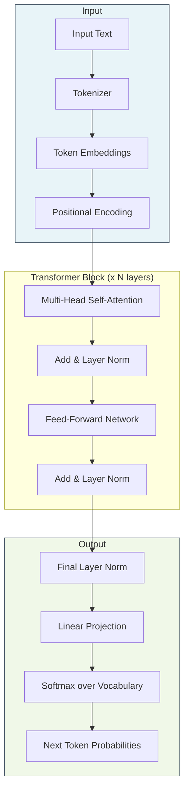
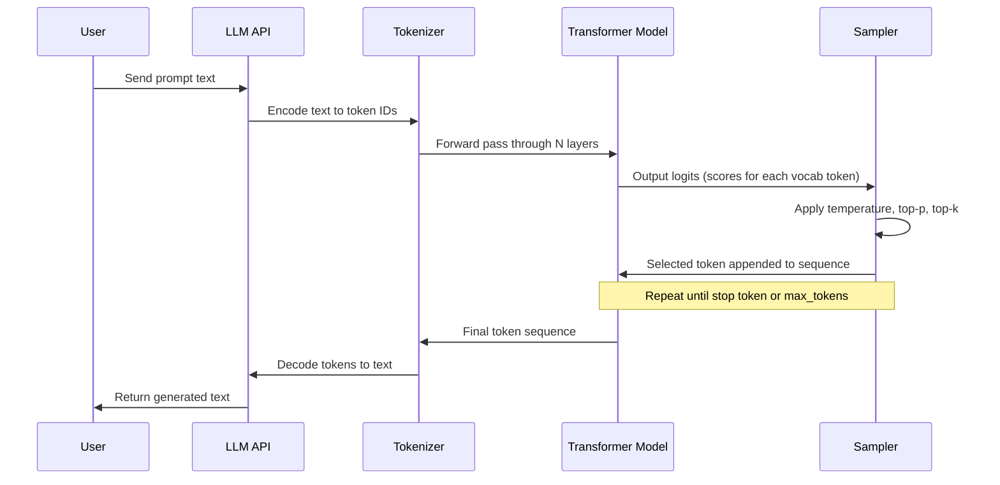
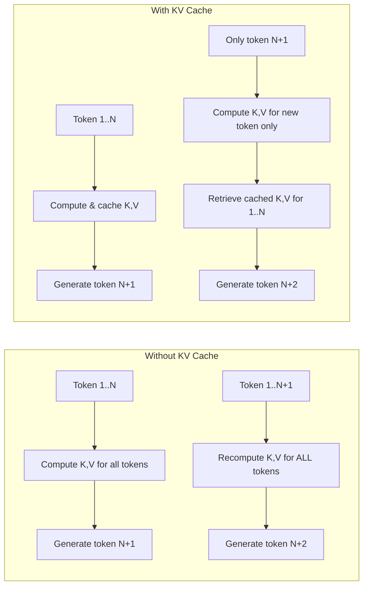

# LLM Fundamentals

Before you can build agents, you need to understand the engine that powers them. This page covers the foundational concepts behind large language models -- from the transformer architecture to the sampling strategies that control their output.

---

## The Transformer Architecture

The **transformer** is the neural network architecture behind every modern LLM. Introduced in the 2017 paper "Attention Is All You Need," it replaced recurrent architectures (RNNs, LSTMs) by processing entire sequences in parallel using a mechanism called **self-attention**.



Modern LLMs like GPT-4, Claude, and Llama are **decoder-only** transformers. They are trained to predict the next token in a sequence, one token at a time. During inference, they generate text **autoregressively** -- each new token is appended to the input and the model runs again.

:::info Encoder vs Decoder
The original transformer had both an encoder and a decoder. **Encoder-only** models (like BERT) are used for classification and embedding tasks. **Decoder-only** models (like GPT) are used for text generation. **Encoder-decoder** models (like T5) are used for sequence-to-sequence tasks like translation.
:::

---

## The Attention Mechanism

Attention is the core innovation that makes transformers work. It allows the model to weigh the relevance of every token in the context when producing each output token.

### Self-Attention in Three Steps

1. **Compute Query, Key, and Value vectors.** Each token's embedding is projected through three learned weight matrices (W_Q, W_K, W_V) to produce Q, K, and V vectors.
2. **Calculate attention scores.** The dot product of Q and K gives a raw relevance score between every pair of tokens. This is scaled by the square root of the key dimension to stabilize gradients.
3. **Produce weighted output.** The scores are passed through softmax to get attention weights, then multiplied by V to produce the final output for each token.

The formula:

```
Attention(Q, K, V) = softmax(QK^T / sqrt(d_k)) * V
```

### Multi-Head Attention

Instead of computing a single attention function, the model uses **multiple heads** (typically 32-128 in large models). Each head can learn to attend to different types of relationships -- one head might focus on syntactic structure, another on semantic similarity, another on positional proximity.

<details>
<summary><strong>Deep Dive: Why Multi-Head Attention Works</strong></summary>

Each attention head operates in a different learned subspace. Think of it as having multiple "perspectives" on the same input. Head 1 might learn that adjectives attend strongly to the nouns they modify. Head 2 might learn that verbs attend to their subjects. Head 15 might learn long-range coreference (linking "he" back to "John" from three paragraphs ago).

The outputs of all heads are concatenated and projected through another linear layer:

```
MultiHead(Q, K, V) = Concat(head_1, ..., head_h) * W_O
where head_i = Attention(Q * W_Q_i, K * W_K_i, V * W_V_i)
```

This gives the model far more expressive power than a single attention function, at a manageable computational cost.

</details>

---

## Tokenization

LLMs do not operate on raw text. Text is first converted into **tokens** -- integer IDs that map to subword units. The most common tokenization algorithm is **Byte Pair Encoding (BPE)**.

| Tokenizer | Used By | Vocabulary Size |
|---|---|---|
| `cl100k_base` | GPT-4, GPT-4o | ~100,000 |
| Claude tokenizer | Claude 3/3.5/4 | ~100,000 |
| SentencePiece | Llama, Mistral | 32,000-128,000 |
| WordPiece | BERT | ~30,000 |

### How BPE Works

1. Start with individual bytes (or characters) as the initial vocabulary.
2. Count the frequency of adjacent token pairs in the training data.
3. Merge the most frequent pair into a single new token.
4. Repeat until the desired vocabulary size is reached.

```python
# Counting tokens with tiktoken (OpenAI's tokenizer)
import tiktoken

encoding = tiktoken.encoding_for_model("gpt-4o")
text = "Agentic AI systems use tool calling to interact with external APIs."

tokens = encoding.encode(text)
print(f"Text: {text}")
print(f"Token count: {len(tokens)}")
print(f"Tokens: {tokens}")
print(f"Decoded tokens: {[encoding.decode([t]) for t in tokens]}")

# Output:
# Text: Agentic AI systems use tool calling to interact with external APIs.
# Token count: 12
# Tokens: [32.., 15836, ...]
# Decoded tokens: ['Agent', 'ic', ' AI', ' systems', ' use', ' tool', ...]
```

:::warning Token Limits Matter
Every LLM has a **context window** -- the maximum number of tokens it can process in a single call. If your input exceeds this limit, the API will return an error. Understanding tokenization is essential for managing context budgets in agentic systems.
:::

---

## Context Windows

The context window is the total number of tokens (input + output) that a model can handle in a single inference call.

| Model | Context Window | Approx. Words |
|---|---|---|
| GPT-3.5 Turbo | 16,384 | ~12,000 |
| GPT-4o | 128,000 | ~96,000 |
| Claude 4 Opus/Sonnet | 200,000 | ~150,000 |
| Llama 3.1 405B | 128,000 | ~96,000 |
| Gemini 2.5 Pro | 1,000,000 | ~750,000 |

**Why this matters for agents:** Agents accumulate context over multiple reasoning steps. Each tool call, observation, and thought consumes tokens. A poorly designed agent can exhaust its context window mid-task, leading to failures or hallucinations as important context falls out of scope.

---

## The Inference Process

When you send a prompt to an LLM, here is what happens:



Each forward pass through the model produces **logits** -- a score for every token in the vocabulary. These logits are then transformed into a probability distribution and a token is **sampled** from that distribution.

---

## Sampling Strategies

Sampling controls how the model selects the next token from the probability distribution. The three key parameters are **temperature**, **top-p**, and **top-k**.

### Temperature

Temperature scales the logits before the softmax function. It controls the "sharpness" of the probability distribution.

- **temperature = 0** -- deterministic; always picks the highest-probability token (greedy decoding).
- **temperature = 0.3-0.7** -- focused but slightly creative; good for most agent tasks.
- **temperature = 1.0** -- the model's natural distribution.
- **temperature > 1.0** -- flatter distribution; more random and creative.

### Top-p (Nucleus Sampling)

Instead of considering all tokens, **top-p** considers only the smallest set of tokens whose cumulative probability exceeds the threshold `p`.

- `top_p = 0.1` -- considers only the most likely tokens (very focused).
- `top_p = 0.9` -- considers most of the distribution (more diverse).

### Top-k

**Top-k** simply limits selection to the `k` most probable tokens.

- `top_k = 1` -- equivalent to greedy decoding.
- `top_k = 50` -- a common default for balanced generation.

:::tip Agent Best Practice
For agentic workflows, use **low temperature (0.0-0.3)** and **low top-p (0.1-0.5)**. Agents need reliable, deterministic reasoning. Creative randomness causes inconsistent tool calls and unpredictable behavior.
:::

<details>
<summary><strong>Deep Dive: How Temperature Affects Probability Distribution</strong></summary>

Given logits `[2.0, 1.5, 0.5, -1.0]` for four tokens:

| Temperature | Token A | Token B | Token C | Token D |
|---|---|---|---|---|
| 0.5 | 0.76 | 0.18 | 0.05 | 0.01 |
| 1.0 | 0.47 | 0.29 | 0.10 | 0.02 |
| 2.0 | 0.35 | 0.28 | 0.20 | 0.09 |

Lower temperature concentrates probability on the top token. Higher temperature spreads probability more evenly across tokens.

</details>

---

## Practical Code Example: OpenAI API with Sampling Parameters

```python
from openai import OpenAI

client = OpenAI()  # Reads OPENAI_API_KEY from environment


def generate_with_params(
    prompt: str,
    temperature: float = 0.7,
    top_p: float = 1.0,
    max_tokens: int = 256,
    model: str = "gpt-4o",
) -> str:
    """Generate text with explicit sampling parameters."""
    response = client.chat.completions.create(
        model=model,
        messages=[
            {
                "role": "system",
                "content": "You are a helpful AI assistant.",
            },
            {
                "role": "user",
                "content": prompt,
            },
        ],
        temperature=temperature,
        top_p=top_p,
        max_tokens=max_tokens,
    )
    return response.choices[0].message.content


# Deterministic output for agent reasoning
reasoning_output = generate_with_params(
    prompt="What are the three steps in the ReAct agent loop?",
    temperature=0.0,
    max_tokens=512,
)
print("Deterministic (temp=0.0):")
print(reasoning_output)

# Creative output for brainstorming
creative_output = generate_with_params(
    prompt="Suggest five creative names for an AI coding assistant.",
    temperature=1.2,
    top_p=0.95,
    max_tokens=256,
)
print("\nCreative (temp=1.2, top_p=0.95):")
print(creative_output)
```

---

## Key Parameters Summary

| Parameter | Range | Effect | Agent Recommendation |
|---|---|---|---|
| `temperature` | 0.0 - 2.0 | Controls randomness | 0.0 - 0.3 |
| `top_p` | 0.0 - 1.0 | Nucleus sampling threshold | 0.1 - 0.5 |
| `top_k` | 1 - vocab size | Limits token candidates | 1 - 10 |
| `max_tokens` | 1 - context limit | Maximum output length | Task-dependent |
| `stop` | string or list | Stop sequences | Tool delimiters |
| `frequency_penalty` | -2.0 - 2.0 | Penalizes repeated tokens | 0.0 (default) |
| `presence_penalty` | -2.0 - 2.0 | Penalizes repeated topics | 0.0 (default) |

---

## KV Cache and Inference Optimization

During autoregressive generation, the model recomputes attention over the entire sequence for each new token. The **KV cache** stores the Key and Value vectors from previous tokens so they do not need to be recomputed.



:::info Why This Matters for Agents
KV cache management directly impacts the **latency** and **cost** of agent inference. Long agent traces with many tool calls accumulate large KV caches. Techniques like **prefix caching** (reusing KV cache for common system prompts) can reduce latency by 50% or more for repeated agent invocations.
:::

---

## Interview Questions

<details>
<summary><strong>Q: Explain the attention mechanism in your own words. Why is it better than RNNs?</strong></summary>

Attention lets every token look at every other token in a single step, regardless of distance. RNNs process tokens sequentially, so information from early tokens gets diluted over long sequences (the vanishing gradient problem). Attention computes direct pairwise relationships, enabling the model to capture long-range dependencies. It also parallelizes across the sequence during training, making transformers dramatically faster to train on modern GPUs.

</details>

<details>
<summary><strong>Q: Why would you use temperature=0 for an agent but temperature=1.0 for a creative writing assistant?</strong></summary>

Agents need deterministic, reliable outputs. They are making decisions -- which tool to call, what arguments to pass, how to interpret results. Non-determinism means the same input could lead to different tool calls, making the system unpredictable and hard to debug. Creative writing benefits from randomness because it produces more diverse, interesting text. The randomness is a feature, not a bug.

</details>

<details>
<summary><strong>Q: A user reports that your agent is failing mid-conversation. The error log shows a context length exceeded error. What do you do?</strong></summary>

First, audit the token usage per turn -- system prompt, conversation history, tool call results, and generated output. Then apply strategies: (1) Summarize older conversation history instead of keeping full transcripts. (2) Truncate or paginate large tool outputs. (3) Use a model with a larger context window. (4) Implement a sliding window that keeps only the N most recent turns. (5) Move to a retrieval-based memory system where past interactions are stored in a vector database and retrieved on demand rather than kept in context.

</details>

---

## Further Reading

- [Attention Is All You Need (Vaswani et al., 2017)](https://arxiv.org/abs/1706.03762)
- [The Illustrated Transformer (Jay Alammar)](https://jalammar.github.io/illustrated-transformer/)
- [OpenAI Tokenizer Tool](https://platform.openai.com/tokenizer)
- [Andrej Karpathy: Let's build GPT from scratch](https://www.youtube.com/watch?v=kCc8FmEb1nY)
