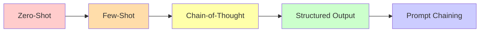
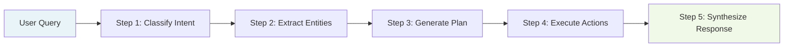
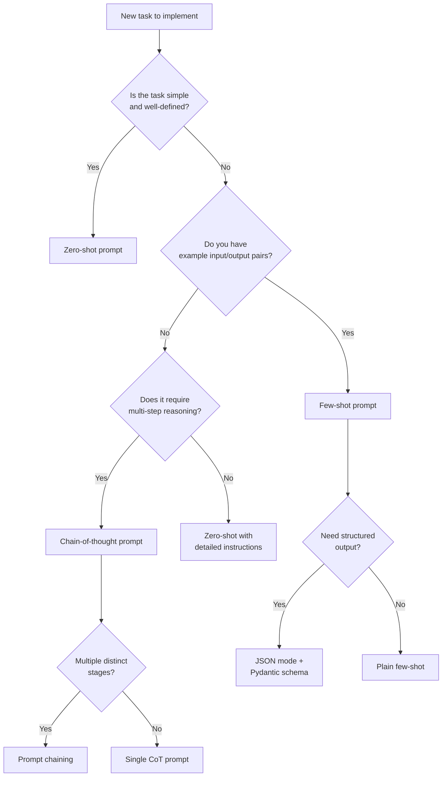

# Prompting Techniques

Prompting is how you communicate intent to an LLM. The quality of your prompts directly determines the quality of your agent's reasoning. This page covers the core prompting techniques you need to know, from basic zero-shot prompts to advanced prompt chaining strategies.

---

## The Prompting Spectrum



As you move from left to right, prompts become more complex but also more reliable and controllable -- exactly what agentic systems require.

---

## Zero-Shot Prompting

A **zero-shot** prompt provides the task description with no examples. The model relies entirely on its pre-training knowledge.

```python
from openai import OpenAI

client = OpenAI()

response = client.chat.completions.create(
    model="gpt-4o",
    messages=[
        {
            "role": "user",
            "content": "Classify the following customer message as 'billing', "
                       "'technical', or 'general'.\n\n"
                       "Message: I can't log into my account after resetting my password.",
        }
    ],
    temperature=0.0,
)

print(response.choices[0].message.content)
# Output: technical
```

**When to use:** Simple, well-defined tasks where the model's pre-training provides sufficient understanding. Good for classification, summarization, and straightforward extraction.

:::warning Limitations
Zero-shot prompting is unreliable for nuanced tasks. The model may interpret the task differently than you intended. For agentic systems, always prefer more structured approaches.
:::

---

## Few-Shot Prompting

**Few-shot** prompting includes examples of the desired input-output behavior directly in the prompt. This dramatically improves consistency and accuracy.

```python
response = client.chat.completions.create(
    model="gpt-4o",
    messages=[
        {
            "role": "system",
            "content": "You classify customer messages into categories.",
        },
        {
            "role": "user",
            "content": "Classify: 'My invoice shows the wrong amount.'"
        },
        {
            "role": "assistant",
            "content": "billing"
        },
        {
            "role": "user",
            "content": "Classify: 'The app crashes when I open settings.'"
        },
        {
            "role": "assistant",
            "content": "technical"
        },
        {
            "role": "user",
            "content": "Classify: 'What are your business hours?'"
        },
        {
            "role": "assistant",
            "content": "general"
        },
        {
            "role": "user",
            "content": "Classify: 'I was charged twice for my subscription.'"
        },
    ],
    temperature=0.0,
)

print(response.choices[0].message.content)
# Output: billing
```

### Best Practices for Few-Shot Examples

| Practice | Why |
|---|---|
| Use 3-5 diverse examples | Covers edge cases without bloating the prompt |
| Order examples from simple to complex | Primes the model for harder cases |
| Include borderline cases | Shows the model where the decision boundary lies |
| Match the output format exactly | The model will mirror the format of your examples |

:::tip Token Efficiency
Few-shot examples consume context tokens. For agentic systems where context is precious, consider using **dynamic few-shot selection** -- retrieve the most relevant examples from a database based on the current input, rather than including a fixed set every time.
:::

---

## Chain-of-Thought (CoT) Prompting

**Chain-of-thought** prompting asks the model to show its reasoning step by step before arriving at a final answer. This dramatically improves performance on tasks requiring multi-step reasoning.

### Standard CoT

```python
response = client.chat.completions.create(
    model="gpt-4o",
    messages=[
        {
            "role": "system",
            "content": "You are a helpful assistant. Think step by step.",
        },
        {
            "role": "user",
            "content": (
                "A company has 3 servers. Each server can handle 1000 requests "
                "per second. During peak hours, traffic increases by 150%. "
                "They want to maintain 30% headroom. How many additional "
                "servers do they need?\n\n"
                "Think through this step by step."
            ),
        },
    ],
    temperature=0.0,
)

print(response.choices[0].message.content)
# The model will produce:
# Step 1: Current capacity = 3 * 1000 = 3000 req/s
# Step 2: Peak traffic = 3000 * 2.5 = 7500 req/s (150% increase = 2.5x)
# Step 3: With 30% headroom, need capacity = 7500 / 0.7 = 10,714 req/s
# Step 4: Servers needed = ceil(10714 / 1000) = 11
# Step 5: Additional servers = 11 - 3 = 8
```

### Zero-Shot CoT

Simply adding "Let's think step by step" to a prompt activates chain-of-thought reasoning without needing examples.

```python
prompt = (
    "If a RAG pipeline processes 500 documents, each averaging 2000 tokens, "
    "and the chunk size is 512 tokens with 50-token overlap, "
    "how many total chunks are created?\n\n"
    "Let's think step by step."
)
```

### Few-Shot CoT

Combine few-shot examples with explicit reasoning chains:

```python
messages = [
    {
        "role": "system",
        "content": "You solve problems by reasoning step by step.",
    },
    {
        "role": "user",
        "content": "If an embedding model processes 100 tokens/sec and I have "
                   "10,000 tokens, how long will embedding take?",
    },
    {
        "role": "assistant",
        "content": "Step 1: Total tokens = 10,000\n"
                   "Step 2: Processing speed = 100 tokens/sec\n"
                   "Step 3: Time = 10,000 / 100 = 100 seconds\n"
                   "Answer: 100 seconds",
    },
    {
        "role": "user",
        "content": "If a vector database indexes 50 vectors/sec and I have "
                   "25,000 chunks, how long will indexing take?",
    },
]
```

:::info Why CoT Matters for Agents
The ReAct pattern -- the most common agent architecture -- is fundamentally chain-of-thought prompting with interleaved tool calls. The agent thinks step by step, decides to call a tool, observes the result, then continues reasoning. CoT is not just a prompting trick; it is the cognitive backbone of agentic AI.
:::

---

## System Prompts

The **system prompt** sets the model's persona, constraints, and behavioral rules. For agents, the system prompt is critical -- it defines the agent's identity, available tools, output format, and guardrails.

```python
AGENT_SYSTEM_PROMPT = """You are a customer support agent for TechCorp.

## Your Capabilities
- Look up order status using the `get_order_status` tool
- Process refunds using the `process_refund` tool
- Escalate complex issues using the `escalate_to_human` tool

## Rules
1. Always verify the customer's identity before accessing account information.
2. Never share internal system details or error messages with customers.
3. If you are unsure about a policy, escalate to a human agent.
4. Respond in the same language the customer uses.
5. Keep responses concise and empathetic.

## Output Format
Always respond in this format:
- THOUGHT: Your internal reasoning (not shown to user)
- ACTION: Tool call if needed
- RESPONSE: Your message to the customer
"""
```

### System Prompt Best Practices

| Practice | Description |
|---|---|
| **Role definition** | Clearly state who the agent is and what it does |
| **Capability boundaries** | Explicitly list what the agent can and cannot do |
| **Output format** | Define the exact format for responses |
| **Guardrails** | State rules the agent must never violate |
| **Escalation criteria** | Define when to hand off to a human |
| **Examples** | Include 1-2 examples of ideal interactions |

---

## Prompt Templates

In production systems, prompts are **parameterized templates** rather than hardcoded strings. This enables reuse, testing, and versioning.

```python
from string import Template

# Simple Python template
CLASSIFICATION_TEMPLATE = Template(
    "Classify the following $document_type into one of these categories: "
    "$categories.\n\n"
    "Document: $document\n\n"
    "Category:"
)

prompt = CLASSIFICATION_TEMPLATE.substitute(
    document_type="support ticket",
    categories="billing, technical, general, urgent",
    document="My payment failed and I'm being locked out of my account.",
)
print(prompt)
```

### Using Jinja2 for Complex Templates

```python
from jinja2 import Template

AGENT_PROMPT = Template("""You are a {{ agent_role }} agent.

Available tools:

- {{ tool.name }}: {{ tool.description }}
  Parameters: {{ tool.parameters }}



Previous conversation:

{{ msg.role }}: {{ msg.content }}



Current user request: {{ user_input }}

Think step by step, then respond.""")

prompt = AGENT_PROMPT.render(
    agent_role="research assistant",
    tools=[
        {"name": "search_web", "description": "Search the internet",
         "parameters": "query: str"},
        {"name": "read_paper", "description": "Read an academic paper",
         "parameters": "url: str"},
    ],
    conversation_history=[
        {"role": "user", "content": "Find recent papers on multi-agent systems."},
        {"role": "assistant", "content": "I found 3 relevant papers. Let me summarize them."},
    ],
    user_input="Which of those papers discusses agent communication protocols?",
)
```

<details>
<summary><strong>Deep Dive: Prompt Versioning and Management</strong></summary>

In production agentic systems, prompts evolve frequently. Best practices for managing them:

1. **Store prompts in version control** -- treat them like code, not configuration.
2. **Use a prompt registry** -- a centralized store (database, config service) where prompts are versioned and tagged.
3. **A/B test prompts** -- run multiple prompt versions simultaneously and measure performance.
4. **Log prompt-response pairs** -- essential for debugging and evaluation.
5. **Separate prompt logic from application logic** -- use template engines so changes to prompts do not require code deployments.

Tools like LangSmith, Weights & Biases Prompts, and PromptLayer provide infrastructure for prompt management at scale.

</details>

---

## Structured Output (JSON Mode)

For agentic systems, you almost always need the model to return **structured data** rather than free-form text. Modern LLMs support JSON mode and function calling to ensure well-formatted output.

### JSON Mode

```python
response = client.chat.completions.create(
    model="gpt-4o",
    messages=[
        {
            "role": "system",
            "content": "Extract the key entities from the user's message. "
                       "Return a JSON object with keys: 'person', 'action', "
                       "'subject', 'urgency' (low/medium/high).",
        },
        {
            "role": "user",
            "content": "John urgently needs the Q3 financial report reviewed "
                       "by end of day.",
        },
    ],
    response_format={"type": "json_object"},
    temperature=0.0,
)

import json
result = json.loads(response.choices[0].message.content)
print(json.dumps(result, indent=2))
# {
#   "person": "John",
#   "action": "review",
#   "subject": "Q3 financial report",
#   "urgency": "high"
# }
```

### Structured Outputs with Pydantic Schema

```python
from pydantic import BaseModel
from typing import Literal


class ToolCall(BaseModel):
    tool_name: str
    arguments: dict
    reasoning: str


class AgentResponse(BaseModel):
    thought: str
    tool_call: ToolCall | None
    final_answer: str | None


response = client.beta.chat.completions.parse(
    model="gpt-4o",
    messages=[
        {
            "role": "system",
            "content": "You are an agent. Decide whether to call a tool or "
                       "respond directly.",
        },
        {
            "role": "user",
            "content": "What is the current price of AAPL stock?",
        },
    ],
    response_format=AgentResponse,
)

agent_response = response.choices[0].message.parsed
print(f"Thought: {agent_response.thought}")
print(f"Tool call: {agent_response.tool_call}")
```

:::tip Why Structured Output Is Essential for Agents
Agents must parse LLM outputs programmatically to decide which tool to call and with what arguments. Free-form text requires fragile regex parsing. Structured output (JSON mode or function calling) eliminates parsing failures and makes agents significantly more reliable.
:::

---

## Prompt Chaining

**Prompt chaining** breaks a complex task into a sequence of simpler LLM calls, where the output of one call feeds into the next. This is the foundation of all agentic workflows.



### Example: Research Pipeline

```python
def research_pipeline(question: str) -> str:
    """A simple prompt chain for research questions."""

    # Step 1: Decompose the question into sub-questions
    decomposition = client.chat.completions.create(
        model="gpt-4o",
        messages=[
            {
                "role": "system",
                "content": "Break the following research question into 3-5 "
                           "specific sub-questions. Return as a JSON list.",
            },
            {"role": "user", "content": question},
        ],
        response_format={"type": "json_object"},
        temperature=0.0,
    )
    sub_questions = json.loads(
        decomposition.choices[0].message.content
    )["questions"]

    # Step 2: Research each sub-question
    findings = []
    for sq in sub_questions:
        research = client.chat.completions.create(
            model="gpt-4o",
            messages=[
                {
                    "role": "system",
                    "content": "Provide a concise, factual answer to this "
                               "research question. Cite your reasoning.",
                },
                {"role": "user", "content": sq},
            ],
            temperature=0.0,
        )
        findings.append({
            "question": sq,
            "finding": research.choices[0].message.content,
        })

    # Step 3: Synthesize findings into a coherent answer
    synthesis = client.chat.completions.create(
        model="gpt-4o",
        messages=[
            {
                "role": "system",
                "content": "Synthesize the following research findings into a "
                           "coherent, well-structured answer to the original "
                           "question. Cite which sub-findings support each "
                           "point.",
            },
            {
                "role": "user",
                "content": f"Original question: {question}\n\n"
                           f"Findings:\n{json.dumps(findings, indent=2)}",
            },
        ],
        temperature=0.3,
    )

    return synthesis.choices[0].message.content


answer = research_pipeline(
    "How do multi-agent systems handle coordination failures?"
)
print(answer)
```

<details>
<summary><strong>Deep Dive: Prompt Chaining vs Agent Loops</strong></summary>

Prompt chaining and agent loops are related but distinct:

| Aspect | Prompt Chaining | Agent Loop |
|---|---|---|
| **Control flow** | Predetermined sequence | Dynamic, decided by the LLM |
| **Steps** | Fixed number | Variable, runs until done |
| **Branching** | Pre-programmed conditionals | LLM decides the next action |
| **Tool use** | Optional | Central to the pattern |
| **Complexity** | Lower | Higher |
| **Predictability** | Higher | Lower |

Prompt chaining is a building block of agentic systems. Simple agents use a fixed chain. Advanced agents use dynamic loops where the LLM decides which chain to invoke next. Most production systems blend both approaches.

</details>

---

## Putting It All Together: A Prompting Decision Framework



---

## Interview Questions

<details>
<summary><strong>Q: When would you use few-shot prompting over fine-tuning?</strong></summary>

Use few-shot prompting when: (1) you have fewer than 100 examples, (2) the task may change frequently, (3) you need quick iteration without retraining, (4) the base model is already close to the desired behavior. Use fine-tuning when: (1) you have hundreds or thousands of examples, (2) the task is stable and well-defined, (3) you need consistent behavior at scale, (4) few-shot examples consume too many tokens and hurt latency/cost.

</details>

<details>
<summary><strong>Q: How does chain-of-thought prompting relate to the ReAct pattern used in agents?</strong></summary>

ReAct (Reasoning + Acting) is an extension of chain-of-thought that interleaves reasoning steps with tool actions. In CoT, the model thinks through a problem purely in text. In ReAct, the model thinks ("I need to look up the current stock price"), acts (calls a tool), observes the result, then thinks again. CoT gave us the insight that explicit reasoning improves accuracy; ReAct applies that insight to interactive, tool-using agents.

</details>

<details>
<summary><strong>Q: Your agent sometimes returns malformed JSON despite using JSON mode. What could be causing this and how do you fix it?</strong></summary>

Possible causes: (1) The model's output was truncated due to max_tokens being too low -- the JSON was cut off mid-object. Fix: increase max_tokens or check response finish_reason. (2) The prompt is ambiguous about the expected schema. Fix: use Pydantic-based structured outputs or provide an explicit JSON schema. (3) The model is an older version without reliable JSON mode support. Fix: upgrade models or add post-processing validation with retry logic. (4) The system prompt conflicts with the JSON format instruction. Fix: audit the full prompt for contradictions.

</details>

---

## Further Reading

- [Chain-of-Thought Prompting (Wei et al., 2022)](https://arxiv.org/abs/2201.11903)
- [ReAct: Synergizing Reasoning and Acting (Yao et al., 2022)](https://arxiv.org/abs/2210.03629)
- [OpenAI Prompt Engineering Guide](https://platform.openai.com/docs/guides/prompt-engineering)
- [Anthropic Prompt Engineering Guide](https://docs.anthropic.com/claude/docs/prompt-engineering)
