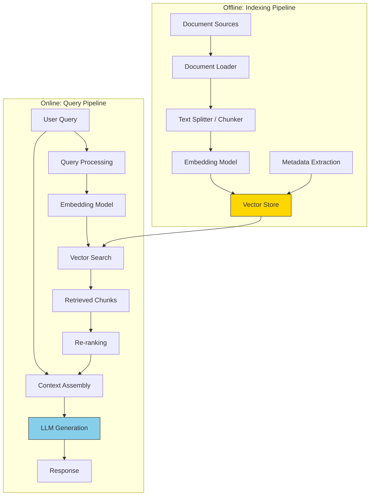
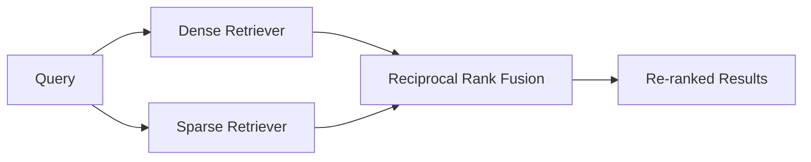

# RAG Basics

**Retrieval-Augmented Generation (RAG)** is the most widely used pattern for grounding LLM responses in external knowledge. Instead of relying solely on the model's training data, RAG retrieves relevant documents at query time and includes them in the prompt. This page covers the full RAG pipeline -- from document loading to evaluation.

---

## Why RAG?

LLMs have three fundamental limitations that RAG addresses:

1. **Knowledge cutoff** -- models are trained on data up to a certain date. They cannot answer questions about recent events.
2. **Hallucination** -- models can generate plausible but factually incorrect information, especially on niche topics.
3. **No access to private data** -- models cannot access your internal documents, databases, or proprietary knowledge.

RAG solves all three by injecting relevant, up-to-date, private context directly into the prompt.

:::info RAG vs Fine-Tuning
RAG and fine-tuning are complementary, not competing, approaches. RAG provides access to external knowledge at inference time. Fine-tuning adjusts the model's behavior and style. Use RAG when you need access to specific, changing data. Use fine-tuning when you need to change how the model writes, reasons, or formats output. Use both when you need both.
:::

---

## The RAG Pipeline



The pipeline has two phases:
- **Indexing (offline)** -- process documents into searchable chunks and store them.
- **Querying (online)** -- retrieve relevant chunks and generate an answer.

---

## Step 1: Document Loading

Documents come in many formats. A robust RAG pipeline handles all of them.

```python
from langchain_community.document_loaders import (
    PyPDFLoader,
    TextLoader,
    UnstructuredMarkdownLoader,
    WebBaseLoader,
)

# Load a PDF
pdf_loader = PyPDFLoader("research_paper.pdf")
pdf_docs = pdf_loader.load()

# Load a web page
web_loader = WebBaseLoader("https://docs.example.com/architecture")
web_docs = web_loader.load()

# Load markdown
md_loader = UnstructuredMarkdownLoader("README.md")
md_docs = md_loader.load()

# Each document has: page_content (text) and metadata (source, page, etc.)
print(f"Loaded {len(pdf_docs)} pages from PDF")
print(f"Metadata: {pdf_docs[0].metadata}")
```

:::tip Production Tip
In production systems, document loading is often the most brittle part of the pipeline. PDFs with complex layouts, tables, and images require specialized parsers. Consider tools like **Unstructured.io**, **LlamaParse**, or **Docling** for robust document parsing.
:::

---

## Step 2: Chunking Strategies

Raw documents are too long to embed effectively. **Chunking** splits them into smaller pieces that fit within the embedding model's context window and are semantically coherent.

### Fixed-Size Chunking

The simplest approach: split text into chunks of a fixed number of characters or tokens, with optional overlap.

```python
from langchain.text_splitter import RecursiveCharacterTextSplitter

splitter = RecursiveCharacterTextSplitter(
    chunk_size=512,
    chunk_overlap=50,
    length_function=len,
    separators=["\n\n", "\n", ". ", " ", ""],
)

text = """Retrieval-Augmented Generation (RAG) is a technique that combines 
information retrieval with text generation. The key insight is that LLMs 
perform better when given relevant context alongside the user's question.

The RAG pipeline has two main phases: indexing and querying. During indexing, 
documents are split into chunks, embedded, and stored in a vector database.
During querying, the user's question is embedded, similar chunks are retrieved,
and the LLM generates an answer based on the retrieved context."""

chunks = splitter.split_text(text)
for i, chunk in enumerate(chunks):
    print(f"Chunk {i} ({len(chunk)} chars): {chunk[:80]}...")
```

### Recursive Character Splitting

`RecursiveCharacterTextSplitter` tries to split at natural boundaries (paragraphs, then sentences, then words) before falling back to character-level splits. This produces more semantically coherent chunks.

### Semantic Chunking

Uses embedding similarity to find natural topic boundaries within a document. Adjacent sentences with low similarity are split into separate chunks.

```python
from langchain_experimental.text_splitter import SemanticChunker
from langchain_openai import OpenAIEmbeddings

semantic_splitter = SemanticChunker(
    OpenAIEmbeddings(model="text-embedding-3-small"),
    breakpoint_threshold_type="percentile",
    breakpoint_threshold_amount=90,
)

semantic_chunks = semantic_splitter.split_text(text)
```

### Chunking Strategy Comparison

| Strategy | Pros | Cons | Best For |
|---|---|---|---|
| **Fixed-size** | Simple, predictable | May split mid-sentence | Homogeneous documents |
| **Recursive** | Respects text structure | May produce uneven sizes | General purpose (recommended default) |
| **Semantic** | Topic-coherent chunks | Slower, requires embeddings | Long documents with clear topic shifts |
| **Document-aware** | Preserves structure (headers, tables) | Requires format-specific parsers | Structured documents (HTML, Markdown) |

:::warning Chunk Size Matters
Chunk size is the single most impactful parameter in a RAG pipeline. Too small (< 100 tokens) and chunks lack sufficient context. Too large (> 1000 tokens) and chunks contain too many topics, reducing retrieval precision. Start with **256-512 tokens** and tune based on evaluation results.
:::

<details>
<summary><strong>Deep Dive: The Overlap Dilemma</strong></summary>

Overlap between chunks ensures that information at chunk boundaries is not lost. A typical overlap is 10-20% of the chunk size (e.g., 50-100 tokens for a 512-token chunk).

However, overlap has costs:
- **Increased storage** -- more chunks means more vectors in your database.
- **Duplicate retrieval** -- overlapping chunks may both be retrieved, wasting context window tokens.
- **Redundant generation** -- the LLM may see the same passage twice.

Mitigation: De-duplicate retrieved chunks before passing them to the LLM. Use metadata (source document, position) to detect and merge overlapping chunks.

</details>

---

## Step 3: Retrieval Methods

### Dense Retrieval (Vector Search)

The standard RAG approach: embed the query and find the most similar chunk embeddings.

```python
from langchain_openai import OpenAIEmbeddings
from langchain_community.vectorstores import FAISS

embeddings = OpenAIEmbeddings(model="text-embedding-3-small")

# Build index from chunks
vectorstore = FAISS.from_texts(
    texts=chunks,
    embedding=embeddings,
    metadatas=[{"source": "rag_guide", "chunk_id": i} for i in range(len(chunks))],
)

# Retrieve relevant chunks
query = "How does the indexing phase of RAG work?"
results = vectorstore.similarity_search_with_score(query, k=4)

for doc, score in results:
    print(f"Score: {score:.4f} | {doc.page_content[:100]}...")
```

### Sparse Retrieval (BM25)

Traditional keyword-based retrieval. Excels at exact term matching that vector search sometimes misses (e.g., product codes, acronyms, proper nouns).

```python
from langchain_community.retrievers import BM25Retriever

bm25_retriever = BM25Retriever.from_texts(
    texts=chunks,
    metadatas=[{"source": "rag_guide", "chunk_id": i} for i in range(len(chunks))],
)
bm25_retriever.k = 4

bm25_results = bm25_retriever.invoke("RAG indexing pipeline")
```

### Hybrid Retrieval

Combines dense and sparse retrieval for the best of both worlds. Uses **Reciprocal Rank Fusion (RRF)** or weighted score combination to merge results.

```python
from langchain.retrievers import EnsembleRetriever

# Create individual retrievers
dense_retriever = vectorstore.as_retriever(search_kwargs={"k": 4})
sparse_retriever = bm25_retriever

# Combine with equal weights
hybrid_retriever = EnsembleRetriever(
    retrievers=[dense_retriever, sparse_retriever],
    weights=[0.5, 0.5],
)

hybrid_results = hybrid_retriever.invoke("RAG indexing pipeline")
print(f"Retrieved {len(hybrid_results)} unique chunks")
```



:::tip Hybrid Is the Production Default
In production RAG systems, hybrid retrieval consistently outperforms either dense or sparse retrieval alone. Dense retrieval catches semantic similarity; sparse retrieval catches exact matches. Together they cover each other's blind spots.
:::

---

## Step 4: Re-Ranking

Initial retrieval is fast but approximate. A **re-ranker** (typically a cross-encoder model) takes the query and each retrieved chunk as a pair and produces a more accurate relevance score.

```python
from sentence_transformers import CrossEncoder

reranker = CrossEncoder("cross-encoder/ms-marco-MiniLM-L-6-v2")

# Re-rank retrieved chunks
query = "How does the indexing phase of RAG work?"
pairs = [(query, doc.page_content) for doc in hybrid_results]
scores = reranker.predict(pairs)

# Sort by re-ranker score
reranked = sorted(
    zip(hybrid_results, scores),
    key=lambda x: x[1],
    reverse=True,
)

print("Re-ranked results:")
for doc, score in reranked[:3]:
    print(f"Score: {score:.4f} | {doc.page_content[:100]}...")
```

---

## Step 5: Generation with Context

The final step assembles the retrieved context and user query into a prompt for the LLM.

```python
from openai import OpenAI

client = OpenAI()


def rag_generate(query: str, context_chunks: list[str], model: str = "gpt-4o") -> str:
    """Generate an answer using retrieved context."""
    context = "\n\n---\n\n".join(context_chunks)

    response = client.chat.completions.create(
        model=model,
        messages=[
            {
                "role": "system",
                "content": (
                    "You are a knowledgeable assistant. Answer the user's question "
                    "based ONLY on the provided context. If the context does not "
                    "contain enough information to answer, say so explicitly. "
                    "Cite which parts of the context support your answer."
                ),
            },
            {
                "role": "user",
                "content": f"Context:\n{context}\n\n---\n\nQuestion: {query}",
            },
        ],
        temperature=0.0,
    )

    return response.choices[0].message.content


# Use the top-3 re-ranked chunks as context
context_chunks = [doc.page_content for doc, _ in reranked[:3]]
answer = rag_generate("How does the indexing phase of RAG work?", context_chunks)
print(answer)
```

---

## Complete RAG Pipeline Example

Here is the full pipeline assembled end to end:

```python
"""Complete RAG pipeline from document to answer."""

from langchain.text_splitter import RecursiveCharacterTextSplitter
from langchain_community.vectorstores import FAISS
from langchain_openai import OpenAIEmbeddings
from openai import OpenAI

client = OpenAI()
embeddings = OpenAIEmbeddings(model="text-embedding-3-small")


def build_index(documents: list[str]) -> FAISS:
    """Chunk documents and build a FAISS index."""
    splitter = RecursiveCharacterTextSplitter(
        chunk_size=512,
        chunk_overlap=50,
    )
    chunks = []
    for doc in documents:
        chunks.extend(splitter.split_text(doc))

    vectorstore = FAISS.from_texts(texts=chunks, embedding=embeddings)
    return vectorstore


def query_rag(vectorstore: FAISS, question: str, k: int = 4) -> str:
    """Retrieve context and generate an answer."""
    # Retrieve
    results = vectorstore.similarity_search(question, k=k)
    context = "\n\n---\n\n".join([r.page_content for r in results])

    # Generate
    response = client.chat.completions.create(
        model="gpt-4o",
        messages=[
            {
                "role": "system",
                "content": (
                    "Answer based ONLY on the provided context. "
                    "If unsure, say you do not know."
                ),
            },
            {
                "role": "user",
                "content": f"Context:\n{context}\n\nQuestion: {question}",
            },
        ],
        temperature=0.0,
    )

    return response.choices[0].message.content


# Usage
documents = [
    "Your document text here...",
    "Another document...",
]
index = build_index(documents)
answer = query_rag(index, "What is retrieval-augmented generation?")
print(answer)
```

---

## Evaluating RAG Systems

RAG evaluation measures the quality of both retrieval and generation.

### Retrieval Metrics

| Metric | What It Measures | How to Compute |
|---|---|---|
| **Recall@K** | Fraction of relevant documents in top-K | relevant_retrieved / total_relevant |
| **Precision@K** | Fraction of top-K results that are relevant | relevant_retrieved / K |
| **MRR** | Position of the first relevant result | 1 / rank_of_first_relevant |
| **NDCG** | Quality of ranking considering position | Uses graded relevance scores |

### Generation Metrics (RAG-Specific)

| Metric | What It Measures | How to Compute |
|---|---|---|
| **Faithfulness** | Is the answer supported by the context? | LLM-as-judge or NLI model |
| **Answer relevance** | Does the answer address the question? | LLM-as-judge |
| **Context precision** | Are the retrieved chunks relevant to the question? | LLM-as-judge |
| **Context recall** | Is all necessary information present in the context? | Compare against ground truth |

### Using RAGAS for Evaluation

```python
from ragas import evaluate
from ragas.metrics import (
    answer_relevancy,
    context_precision,
    context_recall,
    faithfulness,
)
from datasets import Dataset

# Prepare evaluation dataset
eval_data = {
    "question": [
        "What is RAG?",
        "How does chunking affect retrieval?",
    ],
    "answer": [
        "RAG combines retrieval with generation...",
        "Chunk size impacts precision and recall...",
    ],
    "contexts": [
        ["RAG is a technique that...", "The retrieval step..."],
        ["Chunking splits documents...", "Smaller chunks improve..."],
    ],
    "ground_truth": [
        "RAG retrieves relevant documents and uses them as context for LLM generation.",
        "Smaller chunks improve precision but may lose context; larger chunks preserve context but reduce precision.",
    ],
}

dataset = Dataset.from_dict(eval_data)

results = evaluate(
    dataset=dataset,
    metrics=[faithfulness, answer_relevancy, context_precision, context_recall],
)

print(results)
# {'faithfulness': 0.92, 'answer_relevancy': 0.88,
#  'context_precision': 0.85, 'context_recall': 0.90}
```

:::tip Evaluation Is Ongoing
RAG evaluation is not a one-time activity. As you add new documents, change chunking parameters, or update the embedding model, retrieval quality can drift. Build automated evaluation pipelines that run on a representative test set after every change.
:::

---

## Common RAG Failure Modes

<details>
<summary><strong>Failure: The answer is wrong despite relevant documents existing in the corpus</strong></summary>

**Diagnosis path:**
1. Check if the relevant document was retrieved (retrieval failure vs generation failure).
2. If not retrieved: the query embedding may not match the chunk embedding. Try query reformulation, or check if the chunk size is too large (burying the answer in irrelevant text).
3. If retrieved but answer is wrong: the LLM may be ignoring the context. Strengthen the system prompt ("Answer ONLY based on the provided context"). Check if conflicting chunks are confusing the model.

</details>

<details>
<summary><strong>Failure: The system hallucinates information not in the context</strong></summary>

**Mitigation strategies:**
1. Add explicit instructions: "If the context does not contain the answer, say 'I don't have enough information to answer this question.'"
2. Use a faithfulness checker (LLM-as-judge) to flag answers that introduce claims not supported by the context.
3. Lower temperature to 0.0 for stricter factual adherence.
4. Use citation-forcing prompts: "For each claim, cite the specific passage from the context that supports it."

</details>

<details>
<summary><strong>Failure: Retrieved chunks are all from the same document, missing diverse perspectives</strong></summary>

**Mitigation strategies:**
1. Apply **Maximum Marginal Relevance (MMR)** retrieval, which balances relevance with diversity.
2. Add source-diversity constraints: retrieve top-K, then de-duplicate by source document, keeping the best chunk from each source.
3. Use metadata filtering to ensure results come from different sections or documents.

</details>

---

## Interview Questions

<details>
<summary><strong>Q: Walk me through how you would design a RAG system for a company's internal knowledge base with 50,000 documents.</strong></summary>

I would design the system in phases. **Indexing:** Use format-specific loaders (PDF, DOCX, Confluence API). Parse with Unstructured.io for complex layouts. Chunk with recursive splitting at 512 tokens with 50-token overlap. Embed with text-embedding-3-large for high accuracy. Store in Qdrant or Pinecone with metadata (department, date, author, access permissions). **Query:** Implement hybrid retrieval (BM25 + vector search) with RRF fusion. Add a cross-encoder re-ranker. Assemble top-5 chunks as context. Generate with GPT-4o at temperature 0. **Evaluation:** Build a test set of 200+ question-answer pairs with ground truth. Measure faithfulness, relevance, and context precision using RAGAS. Run evaluation after every pipeline change. **Production:** Add access control (users can only retrieve documents they have permission to view). Implement caching for frequent queries. Add observability (log queries, retrieval results, and generation quality).

</details>

<details>
<summary><strong>Q: When would you choose hybrid retrieval over pure vector search?</strong></summary>

Hybrid retrieval is better when: (1) your corpus contains technical terms, product codes, or proper nouns that need exact matching -- BM25 excels at this. (2) Your queries range from vague ("how do I set this up?") to specific ("error code ERR-4523") -- vector search handles the vague queries, BM25 handles the specific ones. (3) You need maximum recall and can afford the slight increase in latency. Pure vector search is sufficient when: your content and queries are purely natural language without domain-specific terms, and latency is the top priority.

</details>

---

## Further Reading

- [RAG Paper (Lewis et al., 2020)](https://arxiv.org/abs/2005.11401)
- [RAGAS: Automated Evaluation of RAG](https://docs.ragas.io/)
- [LangChain RAG Tutorial](https://python.langchain.com/docs/tutorials/rag/)
- [Chunking Strategies Guide (Pinecone)](https://www.pinecone.io/learn/chunking-strategies/)
