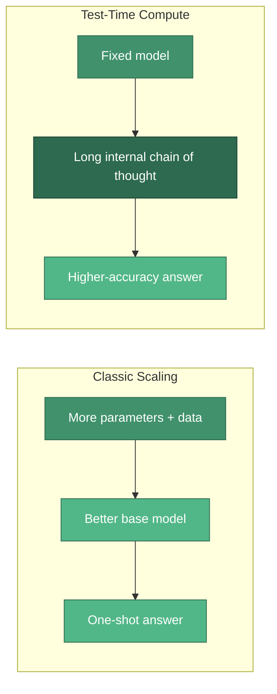
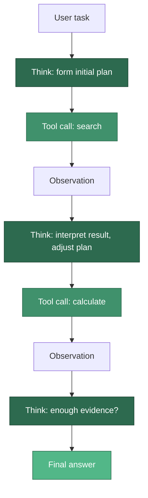
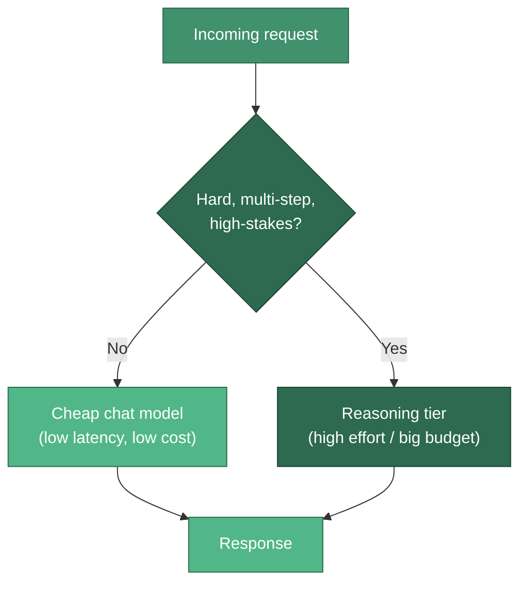

# Reasoning Models & Test-Time Compute

**Reasoning models** -- OpenAI's o-series and GPT-5, Anthropic's extended-thinking Claude, Gemini's thinking models, and DeepSeek-R1 -- are LLMs trained to spend extra *inference-time* compute generating an internal chain of thought before they answer. They trade latency and token cost for markedly higher accuracy on hard, multi-step problems (math, coding, planning, proofs). Crucially, this **test-time compute** is a dial you control: OpenAI exposes a `reasoning_effort` setting, Anthropic a `budget_tokens` thinking budget -- so engineers can tune reasoning depth per request and route only the hard steps to an expensive reasoning tier.

---

## What Changed: Test-Time Compute

For years, the dominant scaling lever was **training compute** -- bigger models, more data, longer pretraining. Reasoning models add a second, orthogonal lever: **inference compute**. Instead of answering in a single forward pass, the model generates a long internal reasoning trace first, effectively "thinking longer" on the same fixed weights.



This differs from **prompted** chain-of-thought (adding "let's think step by step" to a normal model). Here the reasoning is a *product of training* -- the model was reinforcement-trained to produce useful reasoning traces, so its thinking is longer, more self-correcting, and more reliable than anything you can coax out of a base model with a prompt.

:::info CoT-as-a-product vs prompted CoT
On a base model you *ask* for step-by-step reasoning. On a reasoning model the reasoning is baked in -- and manually appending "think step by step" is redundant and can even hurt quality. Let the model do what it was trained to do.
:::

---

## Controlling Reasoning Depth

Both major vendors let you set how hard the model thinks. OpenAI uses discrete **effort levels**; Anthropic uses an explicit **token budget**.

| Provider | Control | Values / Range | Reasoning trace visible? | Where billed |
|---|---|---|---|---|
| OpenAI (o-series, GPT-5) | `reasoning_effort` | `minimal`, `low`, `medium`, `high` (`minimal` added with GPT-5) | No (hidden CoT) | Counted as output tokens |
| Anthropic (extended thinking) | `budget_tokens` | Min 1024; normally `< max_tokens` | Yes (summarized thinking blocks) | Counted as output tokens |

```python
from openai import OpenAI

client = OpenAI()

# Responses API: `reasoning` is a nested object
resp = client.responses.create(
    model="gpt-5",
    reasoning={"effort": "high"},
    input="Prove there are infinitely many primes.",
)
print(resp.output_text)

# Chat Completions API: `reasoning_effort` is a flat top-level parameter
chat = client.chat.completions.create(
    model="o4-mini",
    reasoning_effort="medium",
    messages=[{"role": "user", "content": "Explain the halting problem."}],
)
print(chat.choices[0].message.content)
```

```python
import anthropic

client = anthropic.Anthropic()

msg = client.messages.create(
    model="claude-sonnet-4-5",
    max_tokens=16000,
    thinking={"type": "enabled", "budget_tokens": 10000},  # >=1024 and < max_tokens
    messages=[{"role": "user", "content": "Solve this logic puzzle: ..."}],
)

# The response contains both `thinking` and `text` content blocks
for block in msg.content:
    if block.type == "thinking":
        print("[reasoning]", block.thinking[:200])
    elif block.type == "text":
        print("[answer]", block.text)
```

:::info Model IDs drift
Model identifiers like `gpt-5`, `o4-mini`, and `claude-sonnet-4-5` are used here for illustration. Always confirm the current model IDs and parameter names in the provider docs before shipping.
:::

---

## Interleaved / Extended Thinking

In an agent loop, reasoning does not have to happen only once at the start. **Interleaved thinking** lets the model reason *between* tool calls -- read a tool result, think about what it means, then decide the next call. Anthropic exposes this via a beta header, and in interleaved mode the thinking budget may even exceed `max_tokens` because thinking is spread across multiple turns.



This is the reasoning-model analogue of the classic [ReAct loop](../core-concepts/planning-and-reasoning.md), except the "reason" step is a trained capability rather than a prompt template -- the model self-corrects after each observation without an explicit scaffold telling it to.

---

## When to Route to a Reasoning Tier

Reasoning models are not a free upgrade. They cost more and respond slower, so the winning pattern is a **router**: send easy, latency-sensitive traffic to a cheap chat model and escalate only genuinely hard steps to the reasoning tier.



**Route to a reasoning tier when** the task involves multi-step math, non-trivial code, complex planning, ambiguous requirements, or high-stakes decisions where a wrong answer is expensive. **Stay on a cheap model when** the task is classification, extraction, simple Q&A, formatting, or anything latency-sensitive and user-facing.

:::tip Use effort as a knob, not a switch
You do not have to choose between "reasoning on" and "off". Start at `low`/`medium` effort or a modest `budget_tokens`, measure accuracy, and only raise the dial for the specific step types that need it.
:::

---

## Cost & Latency Tradeoffs

The extra reasoning is not free -- those internal tokens are real tokens the model generates and you pay for them.

:::warning Reasoning tokens are billed
Reasoning/thinking tokens count as **output tokens** on your bill. OpenAI's reasoning tokens are *hidden* (you never see the trace) but still charged -- surfaced in `usage.completion_tokens_details.reasoning_tokens`. High effort or large budgets can push total cost **3-5x** versus a non-reasoning call, and they dramatically increase time-to-first-token (TTFT) because the model must finish thinking before it emits the visible answer.
:::

| Setting | Accuracy on hard tasks | Latency (TTFT) | Cost |
|---|---|---|---|
| No reasoning / `minimal` | Baseline | Fastest | Lowest |
| `low` effort / small budget | Better | Moderate | ~1.5-2x |
| `high` effort / large budget | Best | Slowest | ~3-5x |

For streaming user experiences, the TTFT hit matters: a reasoning model may appear "stuck" for several seconds while it thinks. Budget for it, show a thinking indicator, or route latency-sensitive paths away from the reasoning tier entirely.

---

## Implications for Agent Planning

Reasoning models change how much scaffolding your agent needs. A lot of classic agent engineering -- elaborate [chain-of-thought](../design-patterns/chain-of-thought.md) prompts, explicit [reflection](../design-patterns/reflection-pattern.md) passes, verbose ReAct templates -- existed to squeeze reasoning out of models that were not trained for it. A reasoning-tier model already plans, self-critiques, and backtracks internally.

- **Less prompt scaffolding.** You can drop long "think step by step, then check your work" instructions; the model does this by default.
- **Higher plan quality per call.** One reasoning call often produces a better plan than several rounds of a cheaper model with a ReAct loop -- sometimes at comparable total cost once you count the extra loop iterations.
- **New cost surface.** The savings from fewer orchestration steps must be weighed against per-call reasoning-token cost. Measure end-to-end, not per-request.

:::info Right tool, right step
The pragmatic architecture is hybrid: a reasoning tier for planning and hard sub-problems, cheaper models for routine tool-driven steps. See the [LLM Gateway project](../projects/llm-gateway.md) for how to implement effort-aware routing in practice.
:::

---

## Common Interview Questions

<details>
<summary><strong>Q: What is "test-time compute" and how does it differ from scaling model size?</strong></summary>

Model-size scaling adds parameters and training data to build a stronger base model -- it is a *training-time* investment paid once. Test-time compute keeps the weights fixed but lets the model spend more tokens *at inference* generating an internal chain of thought before answering. It is an orthogonal lever: you can dial reasoning up or down per request without retraining, trading latency and token cost for accuracy on hard multi-step problems.

</details>

<details>
<summary><strong>Q: How do OpenAI and Anthropic differ in how you control reasoning depth?</strong></summary>

OpenAI exposes discrete `reasoning_effort` levels (`minimal`, `low`, `medium`, `high`) and hides the actual reasoning trace, though it still bills those tokens as output and reports them under `usage.completion_tokens_details.reasoning_tokens`. Anthropic exposes an explicit `budget_tokens` thinking budget (minimum 1024, normally below `max_tokens`) and returns visible/summarized thinking blocks alongside the answer.

</details>

<details>
<summary><strong>Q: A teammate hardcodes "think step by step in detail" into every prompt to a reasoning model. What do you tell them?</strong></summary>

On a reasoning model that instruction is redundant -- the model was reinforcement-trained to produce reasoning traces on its own, and manually forcing verbose prompted CoT can actually degrade quality or waste tokens. The right control is the vendor knob (`reasoning_effort` or `budget_tokens`), not prompt engineering the chain of thought.

</details>

<details>
<summary><strong>Q: When would you NOT use a reasoning model?</strong></summary>

For simple, latency-sensitive, or high-volume tasks: classification, extraction, formatting, simple Q&A, and any interactive path where TTFT matters. Reasoning models can cost 3-5x more and add seconds of latency before the first visible token. Route those requests to a cheap chat model and reserve the reasoning tier for genuinely hard, high-stakes steps.

</details>

<details>
<summary><strong>Q: Why do reasoning models reduce the need for explicit ReAct scaffolding?</strong></summary>

Much ReAct/reflection scaffolding existed to coax reasoning and self-correction out of models that were not trained for it. A reasoning model plans, critiques, and backtracks internally -- and with interleaved thinking it can even reason between tool calls -- so a single high-quality reasoning call often replaces several loop iterations of a cheaper model. The tradeoff shifts from "how many orchestration steps" to "how many reasoning tokens", so you measure end-to-end cost rather than per-request.

</details>

---

## Further Reading

- [Planning and Reasoning](../core-concepts/planning-and-reasoning.md) -- the agent loop reasoning operates within.
- [Chain-of-Thought Pattern](../design-patterns/chain-of-thought.md) -- prompted CoT vs trained reasoning.
- [Reflection Pattern](../design-patterns/reflection-pattern.md) -- self-critique that reasoning models partly internalize.
- [LLM Fundamentals](./llm-fundamentals.md) -- tokens, sampling, and inference basics.
- [LLM Gateway Project](../projects/llm-gateway.md) -- implementing effort-aware routing.
- [OpenAI: Reasoning models guide](https://platform.openai.com/docs/guides/reasoning)
- [Anthropic: Extended thinking](https://docs.anthropic.com/en/docs/build-with-claude/extended-thinking)
