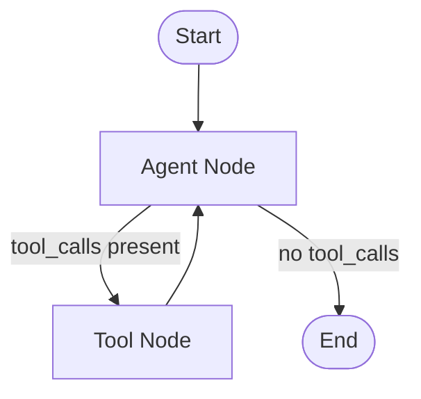
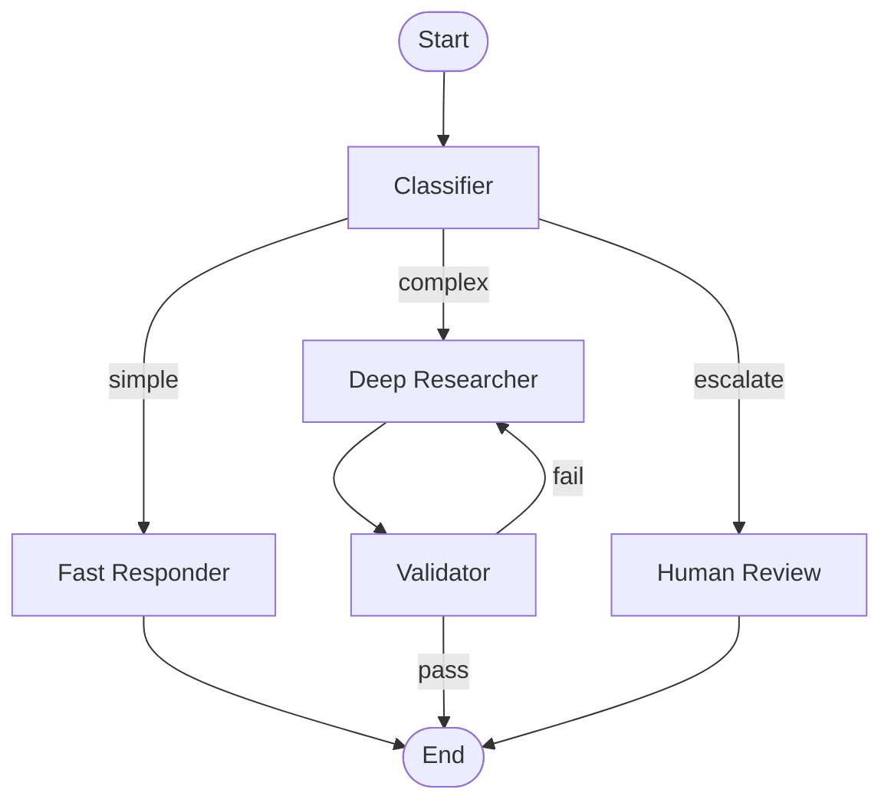

# LangGraph Deep Dive

LangGraph is a framework for building stateful, multi-actor agent applications as directed graphs. Built on top of LangChain primitives, it gives you explicit control over agent control flow, state management, and human-in-the-loop interactions that the older `AgentExecutor` pattern cannot provide.

## Why LangGraph Over LangChain Agents?

The classic LangChain `AgentExecutor` runs a simple loop: call the LLM, execute tools, repeat until done. This works for straightforward tasks but falls apart when you need:

- **Conditional branching** -- different paths based on intermediate results.
- **Cycles and loops** -- retrying a step or looping through refinement.
- **Persistent state** -- checkpointing conversations across sessions.
- **Human approval gates** -- pausing execution for review before continuing.
- **Multi-agent coordination** -- handing off between specialized agents.

LangGraph addresses all of these by modeling your application as a **state graph** where nodes are functions and edges define the flow between them.

:::info Key Insight
Think of LangGraph as "React patterns for agents." Where `AgentExecutor` is an implicit loop, LangGraph makes every decision point, branch, and cycle explicit in your graph definition.
:::

## Architecture: State Graphs

A LangGraph application consists of three elements:

| Element | Description |
|---------|-------------|
| **State** | A typed dictionary that flows through the graph, accumulating results |
| **Nodes** | Python functions that read the state, perform work, and return updates |
| **Edges** | Connections between nodes, including conditional routing |



The diagram above shows the fundamental agent loop in LangGraph: the agent decides whether to call tools, and if so, the tool results feed back into the agent for the next reasoning step.

## Defining State

State is the backbone of every LangGraph application. It is defined as a `TypedDict` with optional **reducer functions** that control how updates are merged.

```python
from typing import Annotated, TypedDict
from langchain_core.messages import BaseMessage
from langgraph.graph.message import add_messages

class AgentState(TypedDict):
    messages: Annotated[list[BaseMessage], add_messages]
    iteration_count: int
    final_answer: str
```

:::tip The add_messages Reducer
The `add_messages` reducer appends new messages to the existing list rather than replacing it. This is critical for maintaining conversation history. Without a reducer, each node update would overwrite the previous value.
:::

## Building a Complete Agent

Here is a full LangGraph agent with tool calling, conditional routing, and a maximum iteration guard.

```python
from typing import Annotated, TypedDict, Literal
from langchain_core.messages import BaseMessage, HumanMessage
from langchain_openai import ChatOpenAI
from langchain_core.tools import tool
from langgraph.graph import StateGraph, START, END
from langgraph.graph.message import add_messages
from langgraph.prebuilt import ToolNode

# --- State ---
class AgentState(TypedDict):
    messages: Annotated[list[BaseMessage], add_messages]

# --- Tools ---
@tool
def search_docs(query: str) -> str:
    """Search the documentation for relevant information."""
    return f"Documentation result for '{query}': Agents use LLMs for reasoning."

@tool
def run_sql(query: str) -> str:
    """Execute a read-only SQL query against the analytics database."""
    return "Query returned 42 rows. Average value: 3.14"

tools = [search_docs, run_sql]

# --- Nodes ---
llm = ChatOpenAI(model="gpt-4o", temperature=0).bind_tools(tools)

def agent_node(state: AgentState) -> dict:
    """The reasoning node -- calls the LLM with the current message history."""
    response = llm.invoke(state["messages"])
    return {"messages": [response]}

tool_node = ToolNode(tools)

# --- Conditional Edge ---
def should_continue(state: AgentState) -> Literal["tools", "end"]:
    """Route to tools if the LLM made tool calls, otherwise finish."""
    last_message = state["messages"][-1]
    if last_message.tool_calls:
        return "tools"
    return "end"

# --- Graph Assembly ---
graph = StateGraph(AgentState)

graph.add_node("agent", agent_node)
graph.add_node("tools", tool_node)

graph.add_edge(START, "agent")
graph.add_conditional_edges("agent", should_continue, {
    "tools": "tools",
    "end": END,
})
graph.add_edge("tools", "agent")

app = graph.compile()

# --- Run ---
result = app.invoke({
    "messages": [HumanMessage(content="How do agents work? Check the docs.")]
})

for msg in result["messages"]:
    print(f"{msg.type}: {msg.content[:100]}")
```

## Conditional Routing

Conditional edges are what make LangGraph powerful. The router function inspects the current state and returns a string key that maps to the next node.

```python
def route_by_complexity(state: AgentState) -> Literal["simple", "complex", "escalate"]:
    """Route based on the assessed complexity of the query."""
    last_msg = state["messages"][-1].content.lower()
    if "simple" in last_msg:
        return "simple"
    elif "complex" in last_msg:
        return "complex"
    return "escalate"

graph.add_conditional_edges("classifier", route_by_complexity, {
    "simple": "fast_responder",
    "complex": "deep_researcher",
    "escalate": "human_review",
})
```

### Multi-Path Graph Example



## Persistence and Checkpointing

LangGraph supports durable checkpointing so that a conversation can be paused, persisted to storage, and resumed later -- even across server restarts.

```python
from langgraph.checkpoint.memory import MemorySaver
from langgraph.checkpoint.postgres import PostgresSaver

# In-memory (development)
memory = MemorySaver()
app = graph.compile(checkpointer=memory)

# PostgreSQL (production)
# pg_checkpointer = PostgresSaver.from_conn_string("postgresql://...")
# app = graph.compile(checkpointer=pg_checkpointer)

# Every invocation with a thread_id resumes from the last checkpoint
config = {"configurable": {"thread_id": "user-123"}}

result1 = app.invoke(
    {"messages": [HumanMessage(content="Find sales data for Q1")]},
    config=config,
)

# Later -- same thread_id picks up the full history
result2 = app.invoke(
    {"messages": [HumanMessage(content="Now compare it with Q2")]},
    config=config,
)
```

:::warning Thread Safety
Each `thread_id` maintains an independent state history. In production, ensure your checkpointer backend (Postgres, Redis) can handle concurrent writes if multiple users interact simultaneously.
:::

## Human-in-the-Loop

LangGraph supports interrupt points where execution pauses and waits for human input before continuing.

```python
from langgraph.graph import StateGraph, START, END

# Compile with an interrupt_before list
app = graph.compile(
    checkpointer=memory,
    interrupt_before=["execute_action"],  # Pause before this node
)

config = {"configurable": {"thread_id": "approval-flow"}}

# First run -- stops before "execute_action"
result = app.invoke(
    {"messages": [HumanMessage(content="Delete all staging data")]},
    config=config,
)
print("Agent wants to execute:", result["messages"][-1].content)

# Human reviews and approves -- resume execution
# Option 1: Resume as-is
result = app.invoke(None, config=config)

# Option 2: Modify state before resuming
app.update_state(config, {"messages": [HumanMessage(content="Approved. Proceed.")]})
result = app.invoke(None, config=config)
```

### Common Interrupt Patterns

| Pattern | Implementation |
|---------|---------------|
| Approval gate | `interrupt_before=["dangerous_action"]` |
| Edit agent output | `update_state()` to modify the pending message |
| Reject and redirect | `update_state()` with instructions to take a different path |
| Multi-step review | Multiple interrupt points at different nodes |

## Streaming

LangGraph provides fine-grained streaming at multiple levels.

```python
# Stream all events
async for event in app.astream_events(
    {"messages": [HumanMessage(content="Analyze this dataset")]},
    config=config,
    version="v2",
):
    kind = event["event"]
    if kind == "on_chat_model_stream":
        # Individual tokens from the LLM
        print(event["data"]["chunk"].content, end="", flush=True)
    elif kind == "on_tool_start":
        print(f"\n--- Calling tool: {event['name']} ---")
    elif kind == "on_tool_end":
        print(f"\n--- Tool result: {event['data'].content[:50]} ---")
```

You can also stream node-level updates to see when each step completes:

```python
for chunk in app.stream(
    {"messages": [HumanMessage(content="Research and summarize")]},
    config=config,
    stream_mode="updates",
):
    node_name = list(chunk.keys())[0]
    print(f"Completed node: {node_name}")
```

## Subgraphs and Multi-Agent Patterns

LangGraph supports composing graphs within graphs, enabling modular multi-agent systems.

```python
# Define specialized sub-agents as separate graphs
researcher_graph = create_researcher_graph()
writer_graph = create_writer_graph()
reviewer_graph = create_reviewer_graph()

# Compose into a parent graph
parent = StateGraph(AgentState)
parent.add_node("researcher", researcher_graph)
parent.add_node("writer", writer_graph)
parent.add_node("reviewer", reviewer_graph)

parent.add_edge(START, "researcher")
parent.add_edge("researcher", "writer")
parent.add_edge("writer", "reviewer")
parent.add_conditional_edges("reviewer", review_decision, {
    "approved": END,
    "revise": "writer",
})
```

## Best Practices

1. **Keep nodes small and focused.** Each node should do one thing. This makes the graph testable and debuggable.
2. **Use typed state.** Define your state as a `TypedDict` so you get editor support and catch errors early.
3. **Add reducers intentionally.** Only use `add_messages` or custom reducers on fields that accumulate data. Simple override semantics work for most fields.
4. **Checkpoint everything in production.** Without a checkpointer, a server restart loses all conversation state.
5. **Set recursion limits.** Use `app.invoke(input, config={"recursion_limit": 25})` to prevent infinite loops.

:::tip Debugging Tip
Enable LangSmith tracing (`LANGCHAIN_TRACING_V2=true`) to visualize the full graph execution, including every node invocation, state snapshot, and conditional edge decision.
:::

## Interview Talking Points

- Explain why a **directed graph** is a better mental model for complex agents than a simple loop.
- Describe the role of **reducers** in state management -- particularly `add_messages` for conversation history.
- Walk through a **human-in-the-loop** flow: interrupt, review, optionally modify state, resume.
- Compare LangGraph's **checkpointing** with stateless API designs -- when do you need persistence?
- Discuss how **conditional edges** replace if/else spaghetti in traditional agent code.
