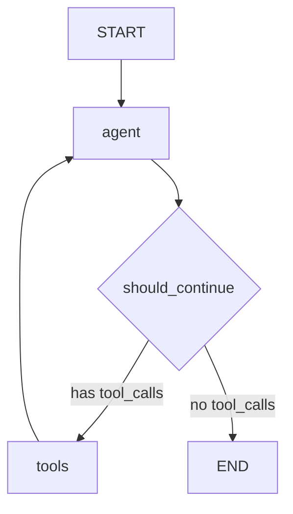

# Build a ReAct Agent with LangGraph

This page walks through a complete implementation of the **ReAct (Reasoning + Acting)** pattern using LangGraph. The agent reasons about a problem, selects tools, executes them, observes results, and repeats until it reaches a final answer -- all managed by an explicit state graph with checkpointing and async support.

:::tip Why LangGraph for ReAct?
LangGraph makes the ReAct loop an explicit, inspectable graph rather than a hidden while-loop. Every state transition is a typed edge you can test, visualize, and checkpoint. When your agent misbehaves in production, you can replay from any snapshot.
:::

---

## Architecture



Each cycle: the **agent node** invokes the LLM with bound tools. If the LLM returns tool calls, the **tools node** executes them and feeds observations back. The **conditional edge** `should_continue` decides whether to loop or finish.

---

## Install Dependencies

```bash
pip install langgraph langchain-openai langchain-core pydantic
```

---

## Step 1: Define the State Model

```python
"""state.py -- Pydantic-validated state for the ReAct agent graph."""

from __future__ import annotations

from typing import Annotated, Sequence
from langchain_core.messages import BaseMessage
from langgraph.graph.message import add_messages
from pydantic import BaseModel, Field


class AgentState(BaseModel):
    """Typed state flowing through every node of the ReAct graph.

    The ``messages`` field uses the ``add_messages`` reducer so each node
    appends to the conversation rather than replacing it.
    """

    messages: Annotated[Sequence[BaseMessage], add_messages] = Field(
        default_factory=list,
        description="Accumulated conversation messages including tool results.",
    )
    iteration_count: int = Field(
        default=0,
        description="Number of agent-tool cycles completed so far.",
    )

    class Config:
        arbitrary_types_allowed = True
```

:::info Why Pydantic for State?
Pydantic gives you runtime validation, serialization, and self-documenting schemas. If a node returns a field with the wrong type, you get an immediate error instead of a silent corruption.
:::

---

## Step 2: Define the Tools

```python
"""tools.py -- Tool definitions with proper schemas for the ReAct agent."""

import math
import json
import urllib.request
from datetime import datetime, timezone

from langchain_core.tools import tool
from pydantic import BaseModel, Field


class CalculatorInput(BaseModel):
    """Input schema for the calculator tool."""
    expression: str = Field(description="A Python-evaluable math expression.")


class WikipediaInput(BaseModel):
    """Input schema for the Wikipedia search tool."""
    query: str = Field(description="The topic to search for on Wikipedia.")


@tool(args_schema=CalculatorInput)
def calculator(expression: str) -> str:
    """Evaluate a mathematical expression and return the numeric result."""
    allowed_names = {
        "abs": abs, "round": round, "min": min, "max": max,
        "pow": pow, "math": math, "int": int, "float": float,
    }
    try:
        result = eval(expression, {"__builtins__": {}}, allowed_names)
        return json.dumps({"expression": expression, "result": str(result)})
    except Exception as exc:
        return json.dumps({"error": f"Evaluation failed: {exc}"})


@tool
def get_current_time() -> str:
    """Return the current UTC date and time in ISO-8601 format."""
    return json.dumps({"utc_now": datetime.now(timezone.utc).isoformat()})


@tool(args_schema=WikipediaInput)
def wikipedia_search(query: str) -> str:
    """Search Wikipedia and return a brief summary for the given query."""
    url = (
        "https://en.wikipedia.org/api/rest_v1/page/summary/"
        + urllib.request.quote(query)
    )
    try:
        req = urllib.request.Request(url, headers={"User-Agent": "ReActAgent/2.0"})
        with urllib.request.urlopen(req, timeout=10) as resp:
            data = json.loads(resp.read().decode())
            return json.dumps({
                "title": data.get("title", "Unknown"),
                "summary": data.get("extract", "No summary available.")[:500],
            })
    except Exception as exc:
        return json.dumps({"error": f"Wikipedia search failed: {exc}"})


ALL_TOOLS = [calculator, get_current_time, wikipedia_search]
```

---

## Step 3: Build the Graph Nodes

```python
"""nodes.py -- Agent and tool nodes for the ReAct graph."""

from __future__ import annotations

import logging
from typing import Any

from langchain_core.messages import AIMessage
from langchain_openai import ChatOpenAI
from langgraph.prebuilt import ToolNode

from state import AgentState
from tools import ALL_TOOLS

logger = logging.getLogger(__name__)

MAX_ITERATIONS = 10


def create_model(
    model_name: str = "gpt-4o",
    temperature: float = 0.0,
) -> ChatOpenAI:
    """Create the LLM with tools bound.

    Separating construction from node logic supports dependency injection
    and makes testing with mock models straightforward.
    """
    llm = ChatOpenAI(model=model_name, temperature=temperature)
    return llm.bind_tools(ALL_TOOLS)


# Module-level model instance -- override via dependency injection in tests.
_model = create_model()


async def agent_node(state: AgentState) -> dict[str, Any]:
    """Invoke the LLM with the current message history.

    Returns a partial state update containing the assistant's response
    and an incremented iteration counter.
    """
    logger.info("Agent node invoked | iteration=%d", state.iteration_count)
    response: AIMessage = await _model.ainvoke(state.messages)
    return {
        "messages": [response],
        "iteration_count": state.iteration_count + 1,
    }


# The prebuilt ToolNode handles execution, error wrapping, and message
# formatting for all tools in a single reusable component.
tool_node = ToolNode(ALL_TOOLS)


def should_continue(state: AgentState) -> str:
    """Conditional edge: decide whether to call tools or finish.

    Returns:
        ``"tools"`` if the last message contains tool calls.
        ``"end"`` if there are no tool calls or we hit the iteration cap.
    """
    if state.iteration_count >= MAX_ITERATIONS:
        logger.warning("Max iterations reached, forcing termination.")
        return "end"

    last_message = state.messages[-1]
    if hasattr(last_message, "tool_calls") and last_message.tool_calls:
        return "tools"
    return "end"
```

:::warning Iteration Guards
Always cap iterations. Without `MAX_ITERATIONS`, a confused model could loop indefinitely, consuming tokens and money. In production, combine this with a cost budget.
:::

---

## Step 4: Assemble and Compile the Graph

```python
"""graph.py -- Build, compile, and expose the ReAct agent graph."""

from __future__ import annotations

from langgraph.graph import StateGraph, START, END
from langgraph.checkpoint.memory import MemorySaver

from state import AgentState
from nodes import agent_node, tool_node, should_continue


def build_react_graph(checkpointer: MemorySaver | None = None) -> StateGraph:
    """Construct the ReAct agent as a LangGraph ``StateGraph``.

    Args:
        checkpointer: Optional checkpointer for state persistence.
            Defaults to an in-memory saver if not provided.

    Returns:
        A compiled graph ready for invocation.
    """
    if checkpointer is None:
        checkpointer = MemorySaver()

    graph = StateGraph(AgentState)

    # -- Nodes --
    graph.add_node("agent", agent_node)
    graph.add_node("tools", tool_node)

    # -- Edges --
    graph.add_edge(START, "agent")
    graph.add_conditional_edges(
        "agent",
        should_continue,
        {"tools": "tools", "end": END},
    )
    graph.add_edge("tools", "agent")

    return graph.compile(checkpointer=checkpointer)
```

---

## Step 5: Run the Agent

```python
"""main.py -- Entry point demonstrating async invocation with memory."""

import asyncio
import logging

from langchain_core.messages import HumanMessage

from graph import build_react_graph

logging.basicConfig(level=logging.INFO, format="%(asctime)s %(name)s %(message)s")


async def main() -> None:
    app = build_react_graph()

    # Each thread_id gets its own conversation memory via the checkpointer.
    config = {"configurable": {"thread_id": "demo-session-1"}}

    queries = [
        "What is the square root of 1764, multiplied by 3, plus 17?",
        "Who invented the transistor and in what year?",
        "What time is it right now in UTC?",
    ]

    for query in queries:
        print(f"\n{'='*60}")
        print(f"USER: {query}")
        print(f"{'='*60}")

        result = await app.ainvoke(
            {"messages": [HumanMessage(content=query)]},
            config=config,
        )

        final_message = result["messages"][-1]
        print(f"AGENT: {final_message.content}")
        print(f"Iterations used: {result['iteration_count']}")


if __name__ == "__main__":
    asyncio.run(main())
```

---

## Step 6: Streaming and Observability

```python
"""stream.py -- Stream both tokens and state updates from the agent."""

import asyncio
from langchain_core.messages import HumanMessage
from graph import build_react_graph


async def stream_agent(query: str) -> None:
    """Stream the agent's execution, printing each node's output."""
    app = build_react_graph()
    config = {"configurable": {"thread_id": "stream-demo"}}

    print(f"Query: {query}\n")

    async for event in app.astream_events(
        {"messages": [HumanMessage(content=query)]},
        config=config,
        version="v2",
    ):
        kind = event["event"]
        if kind == "on_chat_model_stream":
            token = event["data"]["chunk"].content
            if token:
                print(token, end="", flush=True)
        elif kind == "on_tool_start":
            print(f"\n[Tool call: {event['name']}]")
        elif kind == "on_tool_end":
            print(f"[Tool result: {event['data'].content[:120]}]")

    print()


if __name__ == "__main__":
    asyncio.run(stream_agent("What is 2^20 and who was the 20th US president?"))
```

---

## Step 7: Testing the Agent

```python
"""test_react_agent.py -- Unit tests for the ReAct graph."""

import asyncio
import pytest
from langchain_core.messages import HumanMessage, AIMessage
from graph import build_react_graph


@pytest.mark.asyncio
async def test_simple_question_no_tools():
    """A simple greeting should not trigger tool calls."""
    app = build_react_graph()
    config = {"configurable": {"thread_id": "test-1"}}

    result = await app.ainvoke(
        {"messages": [HumanMessage(content="Hello!")]},
        config=config,
    )
    last = result["messages"][-1]
    assert isinstance(last, AIMessage)
    assert last.content  # non-empty response


@pytest.mark.asyncio
async def test_calculator_tool_used():
    """A math question should invoke the calculator tool."""
    app = build_react_graph()
    config = {"configurable": {"thread_id": "test-2"}}

    result = await app.ainvoke(
        {"messages": [HumanMessage(content="What is 123 * 456?")]},
        config=config,
    )
    tool_messages = [
        m for m in result["messages"] if m.type == "tool"
    ]
    assert len(tool_messages) > 0, "Calculator tool should have been called"


@pytest.mark.asyncio
async def test_iteration_cap():
    """The agent should not exceed MAX_ITERATIONS."""
    app = build_react_graph()
    config = {"configurable": {"thread_id": "test-3"}}

    result = await app.ainvoke(
        {"messages": [HumanMessage(content="Keep searching Wikipedia for obscure topics.")]},
        config=config,
    )
    assert result["iteration_count"] <= 10
```

---

## Key Takeaways for Interviews

:::tip Interview Talking Points
1. **LangGraph makes the ReAct loop an explicit graph.** Each node, edge, and conditional is visible and testable -- unlike opaque `AgentExecutor` loops.
2. **`add_messages` is a reducer.** It appends instead of replacing, which is how conversation history accumulates across the agent-tool cycle.
3. **Checkpointing enables memory and time-travel.** `MemorySaver` persists state at every step so you can resume, replay, or debug any execution.
4. **Async support is first-class.** `ainvoke` and `astream_events` let you build non-blocking agents for web servers and high-throughput pipelines.
5. **The prebuilt `ToolNode` handles error wrapping.** It catches tool exceptions and returns them as `ToolMessage` content so the LLM can self-correct.
6. **Iteration guards prevent runaway loops.** Always combine `MAX_ITERATIONS` with a cost budget in production.
:::

---

## Common Failure Modes

| Failure | Cause | Mitigation |
|---|---|---|
| Infinite tool loop | Model never stops calling tools | Iteration cap in `should_continue` |
| Wrong tool selected | Ambiguous tool descriptions | Improve descriptions, add few-shot examples |
| Tool execution error | Bad arguments from model | `ToolNode` wraps errors; model retries |
| State corruption | Node returns wrong types | Pydantic validation catches at runtime |
| Memory overflow | Long conversation history | Summarize messages periodically |

---

## File Structure

```
react-agent/
  state.py        # Pydantic state model
  tools.py        # Tool definitions with schemas
  nodes.py        # Agent node, tool node, routing logic
  graph.py        # Graph assembly and compilation
  main.py         # Async entry point with examples
  stream.py       # Streaming demonstration
  test_react_agent.py  # Pytest test cases
```

This implementation gives you a production-ready ReAct agent in roughly 250 lines of core code, with explicit state management, async execution, memory, and testability -- all powered by LangGraph.
