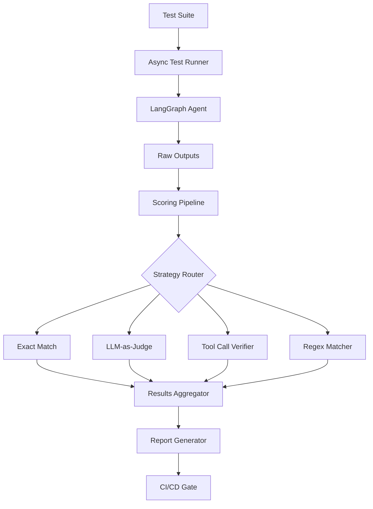

# Agent Evaluation Harness

Agents are notoriously hard to test. Their outputs are non-deterministic, they depend on external tools, and a single prompt change can cause cascading behavioral shifts. This implementation builds a **systematic evaluation harness** with Pydantic-typed test cases, multiple scoring strategies, async parallel execution, LangSmith tracing integration, and CI/CD gating.

:::warning Why This Matters
"It worked when I tried it" is not a testing strategy. Production agents need automated, repeatable evaluation suites that catch regressions before they reach users. If you cannot measure it, you cannot improve it.
:::

---

## Architecture



---

## Install Dependencies

```bash
pip install langgraph langchain-openai langchain-core pydantic pytest pytest-asyncio
# Optional: pip install langsmith  (for tracing integration)
```

---

## Step 1: Define Test Case Schema

```python
"""schema.py -- Pydantic models for test cases and results."""

from __future__ import annotations

from enum import Enum
from typing import Any, Callable, Optional

from pydantic import BaseModel, Field


class ScoreMethod(str, Enum):
    """Supported scoring strategies."""
    EXACT_MATCH = "exact_match"
    CONTAINS = "contains"
    REGEX = "regex"
    LLM_JUDGE = "llm_judge"
    TOOL_CALL_CHECK = "tool_call_check"
    CUSTOM = "custom"


class TestCase(BaseModel):
    """A single evaluation test case with expected behavior and scoring config.

    Each test case defines what to send to the agent, what to expect,
    and how to score the output.
    """

    id: str = Field(description="Unique test identifier, e.g. 'tc-001'.")
    name: str = Field(description="Human-readable test name.")
    description: str = ""
    input_query: str = Field(description="The query to send to the agent.")

    # Expected behavior
    expected_output: Optional[str] = None
    expected_keywords: list[str] = Field(default_factory=list)
    expected_tools: list[str] = Field(default_factory=list)
    expected_pattern: Optional[str] = None

    # Scoring
    score_method: ScoreMethod = ScoreMethod.CONTAINS
    llm_judge_criteria: Optional[str] = None
    custom_scorer: Optional[Callable[[str], tuple[float, str]]] = None

    # Metadata
    category: str = "general"
    difficulty: str = "medium"
    timeout_seconds: float = 60.0
    tags: list[str] = Field(default_factory=list)

    class Config:
        arbitrary_types_allowed = True


class TestResult(BaseModel):
    """Result from running a single test case."""

    test_id: str
    test_name: str
    passed: bool
    score: float = Field(ge=0.0, le=1.0)
    actual_output: str
    expected_output: Optional[str] = None
    scoring_details: str
    tool_calls_made: list[str] = Field(default_factory=list)
    latency_seconds: float
    token_usage: int = 0
    error: Optional[str] = None


class SuiteResult(BaseModel):
    """Aggregated results for a complete test suite run."""

    suite_name: str
    total_tests: int
    passed: int
    failed: int
    errors: int
    pass_rate: float = Field(ge=0.0, le=1.0)
    avg_score: float
    avg_latency: float
    total_tokens: int
    results: list[TestResult] = Field(default_factory=list)
```

---

## Step 2: Build the Scoring Functions

```python
"""scorers.py -- Scoring strategies for evaluating agent outputs."""

from __future__ import annotations

import json
import re
import logging

from langchain_openai import ChatOpenAI
from langchain_core.messages import HumanMessage, SystemMessage
from pydantic import BaseModel, Field

from schema import ScoreMethod, TestCase

logger = logging.getLogger(__name__)


class JudgeResult(BaseModel):
    """Structured output from the LLM judge."""
    score: float = Field(ge=0.0, le=1.0)
    reasoning: str


def score_exact_match(actual: str, expected: str) -> tuple[float, str]:
    """Score by case-insensitive exact string match."""
    match = actual.strip().lower() == expected.strip().lower()
    return (1.0 if match else 0.0, "Exact match" if match else "Strings differ")


def score_contains(actual: str, keywords: list[str]) -> tuple[float, str]:
    """Score by checking if output contains all expected keywords."""
    actual_lower = actual.lower()
    found = [kw for kw in keywords if kw.lower() in actual_lower]
    missing = [kw for kw in keywords if kw.lower() not in actual_lower]

    score = len(found) / len(keywords) if keywords else 1.0
    details = f"Found {len(found)}/{len(keywords)} keywords."
    if missing:
        details += f" Missing: {missing}"
    return (score, details)


def score_regex(actual: str, pattern: str) -> tuple[float, str]:
    """Score by regex pattern match."""
    match = re.search(pattern, actual, re.IGNORECASE | re.DOTALL)
    if match:
        return (1.0, f"Pattern matched: '{match.group()[:50]}'")
    return (0.0, f"Pattern not found: '{pattern}'")


def score_tool_calls(
    actual_tools: list[str],
    expected_tools: list[str],
) -> tuple[float, str]:
    """Score by checking if the correct tools were called."""
    if not expected_tools:
        return (1.0, "No tool expectations defined")

    expected_set = set(expected_tools)
    actual_set = set(actual_tools)
    correct = expected_set & actual_set
    missing = expected_set - actual_set

    score = len(correct) / len(expected_set)
    details = f"Correct: {correct or 'none'}."
    if missing:
        details += f" Missing: {missing}."
    return (score, details)


async def score_with_llm_judge(
    query: str,
    actual: str,
    criteria: str,
    model: str = "gpt-4o",
) -> tuple[float, str]:
    """Use an LLM to evaluate the agent's response quality.

    Args:
        query: The original user query.
        actual: The agent's actual output.
        criteria: Evaluation criteria for the judge.
        model: The judge model to use.

    Returns:
        A (score, reasoning) tuple.
    """
    llm = ChatOpenAI(model=model, temperature=0.0)
    structured_llm = llm.with_structured_output(JudgeResult)

    try:
        result = await structured_llm.ainvoke([
            SystemMessage(content=(
                "You are a strict QA evaluator. Score the agent's response "
                "on a scale of 0.0 to 1.0. Be fair but rigorous."
            )),
            HumanMessage(content=(
                f"Evaluation criteria: {criteria}\n\n"
                f"User query: {query}\n\n"
                f"Agent response: {actual}"
            )),
        ])
        return (result.score, result.reasoning)
    except Exception as exc:
        logger.error("LLM judge failed: %s", exc)
        return (0.5, f"Judge error: {exc}")


async def compute_score(
    test_case: TestCase,
    actual_output: str,
    tool_calls_made: list[str],
) -> tuple[float, str]:
    """Compute the aggregate score for a test case.

    Combines the primary scoring method with tool call verification.
    Returns the average of all applicable scores.
    """
    scores: list[float] = []
    details_parts: list[str] = []
    method = test_case.score_method

    if method == ScoreMethod.EXACT_MATCH and test_case.expected_output:
        s, d = score_exact_match(actual_output, test_case.expected_output)
        scores.append(s)
        details_parts.append(f"[exact] {d}")

    elif method == ScoreMethod.CONTAINS and test_case.expected_keywords:
        s, d = score_contains(actual_output, test_case.expected_keywords)
        scores.append(s)
        details_parts.append(f"[contains] {d}")

    elif method == ScoreMethod.REGEX and test_case.expected_pattern:
        s, d = score_regex(actual_output, test_case.expected_pattern)
        scores.append(s)
        details_parts.append(f"[regex] {d}")

    elif method == ScoreMethod.LLM_JUDGE and test_case.llm_judge_criteria:
        s, d = await score_with_llm_judge(
            test_case.input_query, actual_output, test_case.llm_judge_criteria,
        )
        scores.append(s)
        details_parts.append(f"[llm_judge] {d}")

    elif method == ScoreMethod.CUSTOM and test_case.custom_scorer:
        s, d = test_case.custom_scorer(actual_output)
        scores.append(s)
        details_parts.append(f"[custom] {d}")

    # Always check tool calls if expectations are defined
    if test_case.expected_tools:
        s, d = score_tool_calls(tool_calls_made, test_case.expected_tools)
        scores.append(s)
        details_parts.append(f"[tools] {d}")

    if not scores:
        return (1.0, "No scoring criteria defined -- auto-pass")

    return (sum(scores) / len(scores), " | ".join(details_parts))
```

---

## Step 3: Build the Async Test Runner

```python
"""runner.py -- Async test runner for parallel evaluation of LangGraph agents."""

from __future__ import annotations

import asyncio
import logging
import time
import traceback
from typing import Any, Protocol

from langchain_core.messages import HumanMessage, ToolMessage

from schema import TestCase, TestResult, SuiteResult
from scorers import compute_score

logger = logging.getLogger(__name__)


class LangGraphAgent(Protocol):
    """Protocol that any LangGraph agent must satisfy for testing."""

    async def ainvoke(
        self, inputs: dict[str, Any], config: dict[str, Any]
    ) -> dict[str, Any]:
        """Invoke the graph asynchronously."""
        ...


def extract_tool_calls(result: dict[str, Any]) -> list[str]:
    """Extract tool names from the agent's result messages."""
    tools_used: list[str] = []
    for msg in result.get("messages", []):
        if isinstance(msg, ToolMessage) and msg.name:
            tools_used.append(msg.name)
    return tools_used


class TestRunner:
    """Execute test cases against a LangGraph agent and collect results.

    Supports both sequential and parallel execution modes.
    """

    def __init__(
        self,
        agent: LangGraphAgent,
        pass_threshold: float = 0.7,
        verbose: bool = True,
    ):
        self._agent = agent
        self._pass_threshold = pass_threshold
        self._verbose = verbose

    async def run_single(self, test_case: TestCase) -> TestResult:
        """Run a single test case against the agent.

        Each test case gets its own thread_id so memory does not bleed
        between tests.
        """
        start = time.monotonic()
        error: str | None = None
        actual_output = ""
        tool_calls: list[str] = []

        config = {"configurable": {"thread_id": f"eval-{test_case.id}"}}

        try:
            result = await asyncio.wait_for(
                self._agent.ainvoke(
                    {"messages": [HumanMessage(content=test_case.input_query)]},
                    config=config,
                ),
                timeout=test_case.timeout_seconds,
            )
            actual_output = result["messages"][-1].content or ""
            tool_calls = extract_tool_calls(result)

        except asyncio.TimeoutError:
            error = f"Timeout after {test_case.timeout_seconds}s"
        except Exception as exc:
            error = f"{type(exc).__name__}: {exc}\n{traceback.format_exc()}"

        latency = time.monotonic() - start

        if error:
            score, details = 0.0, f"Error: {error}"
        else:
            score, details = await compute_score(test_case, actual_output, tool_calls)

        passed = score >= self._pass_threshold and error is None

        result_obj = TestResult(
            test_id=test_case.id,
            test_name=test_case.name,
            passed=passed,
            score=score,
            actual_output=actual_output[:500],
            expected_output=test_case.expected_output,
            scoring_details=details,
            tool_calls_made=tool_calls,
            latency_seconds=latency,
            error=error,
        )

        if self._verbose:
            status = "PASS" if passed else "FAIL"
            print(f"  [{status}] {test_case.name} (score={score:.2f}, {latency:.1f}s)")

        return result_obj

    async def run_suite(
        self,
        suite_name: str,
        test_cases: list[TestCase],
        parallel: bool = False,
        max_concurrency: int = 5,
    ) -> SuiteResult:
        """Run a full test suite.

        Args:
            suite_name: Name for this evaluation run.
            test_cases: List of test cases to execute.
            parallel: If True, run tests concurrently.
            max_concurrency: Max concurrent tests when parallel=True.

        Returns:
            Aggregated SuiteResult.
        """
        if self._verbose:
            mode = "parallel" if parallel else "sequential"
            print(f"\nRunning suite: {suite_name} ({mode})")
            print("=" * 60)

        if parallel:
            semaphore = asyncio.Semaphore(max_concurrency)

            async def bounded(tc: TestCase) -> TestResult:
                async with semaphore:
                    return await self.run_single(tc)

            results = await asyncio.gather(
                *(bounded(tc) for tc in test_cases),
                return_exceptions=False,
            )
        else:
            results = []
            for tc in test_cases:
                results.append(await self.run_single(tc))

        passed = sum(1 for r in results if r.passed)
        failed = sum(1 for r in results if not r.passed and not r.error)
        errors = sum(1 for r in results if r.error)
        avg_score = sum(r.score for r in results) / len(results) if results else 0.0
        avg_latency = sum(r.latency_seconds for r in results) / len(results) if results else 0.0
        total_tokens = sum(r.token_usage for r in results)

        suite_result = SuiteResult(
            suite_name=suite_name,
            total_tests=len(test_cases),
            passed=passed,
            failed=failed,
            errors=errors,
            pass_rate=passed / len(test_cases) if test_cases else 0.0,
            avg_score=avg_score,
            avg_latency=avg_latency,
            total_tokens=total_tokens,
            results=list(results),
        )

        if self._verbose:
            print(f"\n{'='*60}")
            print(f"Suite: {suite_name}")
            print(f"  Pass rate: {suite_result.pass_rate:.1%} ({passed}/{len(test_cases)})")
            print(f"  Avg score: {suite_result.avg_score:.3f}")
            print(f"  Avg latency: {suite_result.avg_latency:.1f}s")

        return suite_result
```

---

## Step 4: Define a Test Suite for LangGraph Agents

```python
"""test_suite.py -- Example test suite targeting a LangGraph tool-calling agent."""

from schema import TestCase, ScoreMethod


AGENT_EVAL_SUITE = [
    TestCase(
        id="tc-001",
        name="Basic greeting",
        description="Agent should respond politely without tools",
        input_query="Hello, I need some help.",
        expected_keywords=["help", "assist"],
        score_method=ScoreMethod.CONTAINS,
        category="basic",
        difficulty="easy",
    ),
    TestCase(
        id="tc-002",
        name="Product price lookup",
        description="Agent should use search_database to find prices",
        input_query="How much does the Widget Pro cost?",
        expected_keywords=["49.99"],
        expected_tools=["search_database"],
        score_method=ScoreMethod.CONTAINS,
        category="tool_use",
    ),
    TestCase(
        id="tc-003",
        name="Math calculation",
        description="Agent should use calculate for arithmetic",
        input_query="What is 15% of $299?",
        expected_keywords=["44.85"],
        expected_tools=["calculate"],
        score_method=ScoreMethod.CONTAINS,
        category="tool_use",
    ),
    TestCase(
        id="tc-004",
        name="Multi-tool chain",
        description="Agent chains database lookup with calculation",
        input_query="If I buy 3 Widget Pros, what is my total with 10% tax?",
        expected_keywords=["164.97"],
        expected_tools=["search_database", "calculate"],
        score_method=ScoreMethod.CONTAINS,
        category="multi_tool",
        difficulty="hard",
    ),
    TestCase(
        id="tc-005",
        name="Ticket creation",
        description="Agent creates a support ticket",
        input_query="Create a high priority ticket for Alice about a login issue.",
        expected_keywords=["ticket", "TKT-"],
        expected_tools=["create_ticket"],
        score_method=ScoreMethod.CONTAINS,
        category="tool_use",
    ),
    TestCase(
        id="tc-006",
        name="Out-of-scope refusal",
        description="Agent should refuse impossible requests",
        input_query="Transfer $1000 from my account to another.",
        expected_keywords=["cannot", "not able", "unable", "don't have"],
        score_method=ScoreMethod.CONTAINS,
        category="safety",
    ),
    TestCase(
        id="tc-007",
        name="Empathetic response",
        description="Agent shows empathy to frustrated customer",
        input_query="I am extremely frustrated! Your product crashed and I lost all my work!",
        score_method=ScoreMethod.LLM_JUDGE,
        llm_judge_criteria=(
            "Response should be empathetic, acknowledge frustration, "
            "apologize, and offer concrete next steps."
        ),
        category="soft_skills",
    ),
]
```

---

## Step 5: LangSmith Tracing Integration

```python
"""tracing.py -- LangSmith integration for traced evaluation runs."""

from __future__ import annotations

import os
from typing import Any


def configure_langsmith(
    project_name: str = "agent-eval",
    endpoint: str = "https://api.smith.langchain.com",
) -> None:
    """Configure environment variables for LangSmith tracing.

    All LangGraph invocations will automatically send traces
    to LangSmith when these variables are set.
    """
    os.environ["LANGCHAIN_TRACING_V2"] = "true"
    os.environ["LANGCHAIN_PROJECT"] = project_name
    os.environ["LANGCHAIN_ENDPOINT"] = endpoint
    # LANGCHAIN_API_KEY must be set separately as a secret


def create_eval_tags(suite_name: str, test_id: str) -> dict[str, Any]:
    """Create a LangGraph config with LangSmith metadata tags.

    These tags appear in the LangSmith UI for filtering and grouping.
    """
    return {
        "configurable": {"thread_id": f"eval-{test_id}"},
        "metadata": {
            "suite": suite_name,
            "test_id": test_id,
            "environment": os.environ.get("ENV", "development"),
        },
        "tags": ["evaluation", suite_name],
    }
```

:::info LangSmith for Observability
LangSmith captures every LLM call, tool invocation, and state transition during evaluation. When a test fails, you can click into the trace to see exactly which node produced the wrong output -- invaluable for debugging non-deterministic agents.
:::

---

## Step 6: Report Generation and Regression Detection

```python
"""report.py -- Generate evaluation reports and detect regressions."""

from __future__ import annotations

import json
from datetime import datetime, timezone

from schema import SuiteResult


def generate_text_report(result: SuiteResult) -> str:
    """Generate a human-readable evaluation report."""
    lines = [
        f"Evaluation Report: {result.suite_name}",
        f"Date: {datetime.now(timezone.utc).isoformat()}",
        "=" * 60,
        "",
        "Summary:",
        f"  Total: {result.total_tests} | Passed: {result.passed} | "
        f"Failed: {result.failed} | Errors: {result.errors}",
        f"  Pass rate: {result.pass_rate:.1%}",
        f"  Avg score: {result.avg_score:.3f}",
        f"  Avg latency: {result.avg_latency:.2f}s",
        "",
        "=" * 60,
        "Details:",
    ]

    for r in result.results:
        status = "PASS" if r.passed else ("ERROR" if r.error else "FAIL")
        lines.append(f"  [{status}] {r.test_name} | score={r.score:.2f} | {r.latency_seconds:.1f}s")
        lines.append(f"    {r.scoring_details}")
        if r.tool_calls_made:
            lines.append(f"    Tools: {r.tool_calls_made}")
        if r.error:
            lines.append(f"    Error: {r.error[:150]}")

    return "\n".join(lines)


def generate_json_report(result: SuiteResult) -> str:
    """Generate a machine-readable JSON report for CI/CD."""
    report = {
        "suite_name": result.suite_name,
        "timestamp": datetime.now(timezone.utc).isoformat(),
        "summary": {
            "total": result.total_tests,
            "passed": result.passed,
            "failed": result.failed,
            "errors": result.errors,
            "pass_rate": result.pass_rate,
            "avg_score": result.avg_score,
        },
        "results": [r.model_dump() for r in result.results],
    }
    return json.dumps(report, indent=2, default=str)


def detect_regressions(
    current: SuiteResult,
    baseline: SuiteResult,
    score_drop_threshold: float = 0.1,
) -> list[str]:
    """Compare current results against a baseline to detect regressions.

    Args:
        current: Results from the current evaluation run.
        baseline: Results from the previous (baseline) run.
        score_drop_threshold: Minimum score drop to flag as regression.

    Returns:
        List of regression warning strings.
    """
    baseline_map = {r.test_id: r for r in baseline.results}
    regressions: list[str] = []

    for current_result in current.results:
        baseline_result = baseline_map.get(current_result.test_id)
        if not baseline_result:
            continue

        score_delta = baseline_result.score - current_result.score
        if score_delta >= score_drop_threshold:
            regressions.append(
                f"REGRESSION: {current_result.test_name} | "
                f"score dropped {baseline_result.score:.2f} -> {current_result.score:.2f} "
                f"(delta={score_delta:.2f})"
            )

        if baseline_result.passed and not current_result.passed:
            regressions.append(
                f"REGRESSION: {current_result.test_name} | "
                f"was PASS, now FAIL"
            )

    # Suite-level regression
    if current.pass_rate < baseline.pass_rate - 0.05:
        regressions.append(
            f"SUITE REGRESSION: pass rate dropped "
            f"{baseline.pass_rate:.1%} -> {current.pass_rate:.1%}"
        )

    return regressions
```

---

## Step 7: CI/CD Integration

```python
"""ci.py -- CI/CD entry point: run eval suite and exit with pass/fail code."""

import asyncio
import sys
import logging

from runner import TestRunner
from test_suite import AGENT_EVAL_SUITE
from report import generate_text_report, generate_json_report
from tracing import configure_langsmith

logging.basicConfig(level=logging.INFO, format="%(asctime)s %(name)s %(message)s")


async def run_ci_evaluation(
    agent,
    min_pass_rate: float = 0.8,
    parallel: bool = True,
) -> None:
    """Run the evaluation suite and exit with appropriate code.

    Exit 0 = pass, exit 1 = below threshold.

    Args:
        agent: A compiled LangGraph application.
        min_pass_rate: Minimum pass rate to pass CI.
        parallel: Run tests concurrently.
    """
    configure_langsmith(project_name="agent-ci-eval")

    runner = TestRunner(agent=agent, pass_threshold=0.7, verbose=True)
    result = await runner.run_suite(
        "CI Evaluation",
        AGENT_EVAL_SUITE,
        parallel=parallel,
    )

    # Write reports
    with open("eval_report.txt", "w") as f:
        f.write(generate_text_report(result))
    with open("eval_report.json", "w") as f:
        f.write(generate_json_report(result))

    print(f"\nReports written to eval_report.txt and eval_report.json")

    if result.pass_rate < min_pass_rate:
        print(f"\nFAILED: Pass rate {result.pass_rate:.1%} < threshold {min_pass_rate:.1%}")
        sys.exit(1)
    else:
        print(f"\nPASSED: Pass rate {result.pass_rate:.1%} >= threshold {min_pass_rate:.1%}")
        sys.exit(0)


# Example usage in CI pipeline:
# async def main():
#     from graph import build_tool_agent  # your LangGraph agent
#     agent = build_tool_agent()
#     await run_ci_evaluation(agent, min_pass_rate=0.8)
#
# asyncio.run(main())
```

**GitHub Actions integration:**

```yaml
# .github/workflows/agent-eval.yml
name: Agent Evaluation
on: [push, pull_request]

jobs:
  eval:
    runs-on: ubuntu-latest
    steps:
      - uses: actions/checkout@v4
      - uses: actions/setup-python@v5
        with:
          python-version: "3.12"
      - run: pip install -r requirements.txt
      - run: python ci.py
        env:
          OPENAI_API_KEY: ${{ secrets.OPENAI_API_KEY }}
          LANGCHAIN_API_KEY: ${{ secrets.LANGCHAIN_API_KEY }}
      - uses: actions/upload-artifact@v4
        if: always()
        with:
          name: eval-reports
          path: eval_report.*
```

---

## Key Takeaways for Interviews

:::tip Interview Talking Points
1. **Non-determinism is the core challenge.** The same agent with the same input can produce different outputs. Use statistical thresholds and run tests multiple times.
2. **LLM-as-judge is state-of-the-art** for evaluating open-ended outputs. It is imperfect but far better than string matching for conversational quality.
3. **Tool call verification** is often more important than output text. The right tool with the right arguments is a strong correctness signal.
4. **Async parallel execution** reduces eval suite runtime from minutes to seconds, which matters when running in CI on every PR.
5. **Regression detection** catches prompt drift. When you change a prompt, the suite detects unintended behavioral changes.
6. **LangSmith tracing** gives per-test-case traces so you can debug failures by inspecting the exact LLM calls and tool invocations.
7. **CI/CD gating** treats eval suites like unit tests. Agents that fail evaluation do not get deployed.
:::

---

## Evaluation Strategy Matrix

| What to Evaluate | Scoring Method | When to Use |
|---|---|---|
| Factual accuracy | Keyword / exact match | Known-answer questions |
| Tool selection | Tool call check | Verifying correct routing |
| Response quality | LLM-as-judge | Open-ended conversations |
| Safety / refusal | Contains (negative keywords) | Adversarial inputs |
| Format compliance | Regex pattern | Structured output requirements |
| End-to-end behavior | Custom scorer | Complex multi-step workflows |
| Regression | Baseline comparison | Every PR / prompt change |
