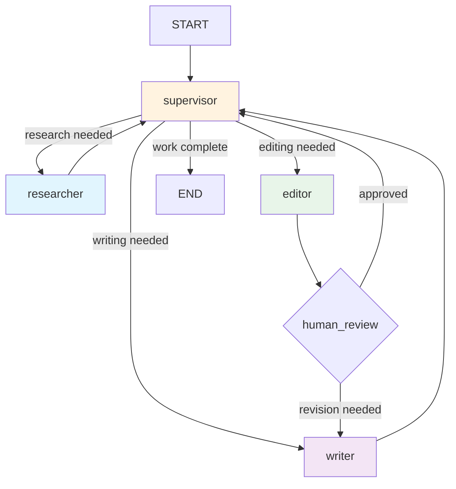

# Multi-Agent System with LangGraph

This implementation demonstrates a **supervisor-based multi-agent system** using LangGraph. A Supervisor agent routes work to three specialists -- Researcher, Writer, and Editor -- who collaborate through shared state to produce a polished article. The architecture supports human-in-the-loop review, cost tracking, and timeout handling.

:::info Why LangGraph Over CrewAI?
LangGraph gives you full control over the routing graph, state transitions, and error handling. CrewAI abstracts these away, which is convenient but opaque. For production systems where you need deterministic routing, custom state management, and debugging visibility, LangGraph is the stronger choice.
:::

---

## Architecture



The **Supervisor** inspects the current state and routes to the next appropriate worker. After the **Editor** finishes, a **human-in-the-loop** checkpoint allows manual approval before the final output.

---

## Install Dependencies

```bash
pip install langgraph langchain-openai langchain-core pydantic
```

---

## Step 1: Define the Shared State

```python
"""state.py -- Shared state for the multi-agent supervisor system."""

from __future__ import annotations

from typing import Annotated, Literal, Sequence
from langchain_core.messages import BaseMessage
from langgraph.graph.message import add_messages
from pydantic import BaseModel, Field


class AgentOutput(BaseModel):
    """Structured output from a specialist agent."""
    agent_name: str
    content: str
    token_count: int = 0


class MultiAgentState(BaseModel):
    """State shared across the supervisor and all specialist agents.

    Each specialist appends to ``outputs`` and the supervisor reads
    them to decide the next routing step.
    """

    # -- Task definition --
    topic: str = Field(description="The topic to research and write about.")
    requirements: str = Field(
        default="800-1200 words, well-structured, engaging",
        description="Quality requirements for the final article.",
    )

    # -- Message history --
    messages: Annotated[Sequence[BaseMessage], add_messages] = Field(
        default_factory=list,
    )

    # -- Agent outputs --
    research_brief: str = Field(default="", description="Output from the Researcher.")
    article_draft: str = Field(default="", description="Output from the Writer.")
    edited_article: str = Field(default="", description="Output from the Editor.")
    outputs: list[AgentOutput] = Field(
        default_factory=list,
        description="Ordered log of all agent outputs.",
    )

    # -- Routing --
    next_agent: Literal[
        "researcher", "writer", "editor", "human_review", "FINISH"
    ] = Field(default="researcher")

    # -- Metadata --
    total_tokens: int = Field(default=0)
    iteration_count: int = Field(default=0)

    class Config:
        arbitrary_types_allowed = True
```

---

## Step 2: Build the Specialist Agents

```python
"""agents.py -- Specialist agent nodes for the multi-agent system."""

from __future__ import annotations

import logging
from typing import Any

from langchain_core.messages import HumanMessage, SystemMessage
from langchain_openai import ChatOpenAI

from state import AgentOutput, MultiAgentState

logger = logging.getLogger(__name__)

llm = ChatOpenAI(model="gpt-4o", temperature=0.2)


async def researcher_node(state: MultiAgentState) -> dict[str, Any]:
    """Research agent: gathers facts and background on the topic.

    Produces a structured research brief with key facts, players,
    current state, and future outlook.
    """
    logger.info("Researcher starting for topic: %s", state.topic[:60])

    response = await llm.ainvoke([
        SystemMessage(content=(
            "You are a senior research analyst with 15 years of experience. "
            "Produce a comprehensive research brief with sections: Overview, "
            "Key Facts & Statistics, Major Players, Current State, Challenges, "
            "and Future Outlook. Be specific and cite sources where possible."
        )),
        HumanMessage(content=f"Research this topic thoroughly: {state.topic}"),
    ])

    output = AgentOutput(
        agent_name="researcher",
        content=response.content,
        token_count=response.usage_metadata.get("total_tokens", 0) if response.usage_metadata else 0,
    )

    return {
        "research_brief": response.content,
        "outputs": state.outputs + [output],
        "messages": [response],
        "total_tokens": state.total_tokens + output.token_count,
    }


async def writer_node(state: MultiAgentState) -> dict[str, Any]:
    """Writer agent: drafts an article from the research brief.

    Uses the research brief and any editorial feedback to produce
    or revise the article draft.
    """
    logger.info("Writer starting draft")

    editorial_context = ""
    if state.edited_article:
        editorial_context = (
            f"\n\nPrevious editorial feedback to incorporate:\n"
            f"{state.edited_article}"
        )

    response = await llm.ainvoke([
        SystemMessage(content=(
            "You are an award-winning technical writer. Write an engaging, "
            "well-structured article based on the research brief. Requirements: "
            f"{state.requirements}. Use clear sections with subheadings, "
            "specific examples, and accessible language."
        )),
        HumanMessage(content=(
            f"Research Brief:\n{state.research_brief}"
            f"{editorial_context}"
            f"\n\nWrite the article about: {state.topic}"
        )),
    ])

    output = AgentOutput(
        agent_name="writer",
        content=response.content,
        token_count=response.usage_metadata.get("total_tokens", 0) if response.usage_metadata else 0,
    )

    return {
        "article_draft": response.content,
        "outputs": state.outputs + [output],
        "messages": [response],
        "total_tokens": state.total_tokens + output.token_count,
    }


async def editor_node(state: MultiAgentState) -> dict[str, Any]:
    """Editor agent: reviews and polishes the article draft.

    Checks accuracy, structure, clarity, tone, and word count.
    Returns the edited article with an editor's note.
    """
    logger.info("Editor reviewing draft")

    response = await llm.ainvoke([
        SystemMessage(content=(
            "You are a veteran editor with 20 years in technical publishing. "
            "Review the article for: (1) factual accuracy, (2) logical structure, "
            "(3) clarity and jargon, (4) engaging intro/conclusion, "
            "(5) appropriate length. Apply all edits and produce the final "
            "polished version. Append a brief editor's note summarizing changes."
        )),
        HumanMessage(content=f"Article to edit:\n{state.article_draft}"),
    ])

    output = AgentOutput(
        agent_name="editor",
        content=response.content,
        token_count=response.usage_metadata.get("total_tokens", 0) if response.usage_metadata else 0,
    )

    return {
        "edited_article": response.content,
        "outputs": state.outputs + [output],
        "messages": [response],
        "total_tokens": state.total_tokens + output.token_count,
    }
```

---

## Step 3: Build the Supervisor

```python
"""supervisor.py -- Supervisor agent that routes work to specialists."""

from __future__ import annotations

import logging
from typing import Any

from langchain_core.messages import HumanMessage, SystemMessage
from langchain_openai import ChatOpenAI
from pydantic import BaseModel, Field

from state import MultiAgentState

logger = logging.getLogger(__name__)

MAX_ITERATIONS = 8
MAX_TOKENS_BUDGET = 50_000


class SupervisorDecision(BaseModel):
    """Structured output for the supervisor's routing decision."""
    next_agent: str = Field(
        description="One of: researcher, writer, editor, FINISH"
    )
    reasoning: str = Field(description="Why this agent should go next.")


llm = ChatOpenAI(model="gpt-4o", temperature=0.0)


async def supervisor_node(state: MultiAgentState) -> dict[str, Any]:
    """Supervisor: inspects state and routes to the next specialist.

    Enforces budget and iteration limits. Uses structured output
    to guarantee a valid routing decision.
    """
    logger.info(
        "Supervisor deciding | iteration=%d tokens=%d",
        state.iteration_count, state.total_tokens,
    )

    # Hard limits
    if state.iteration_count >= MAX_ITERATIONS:
        logger.warning("Max iterations reached, finishing.")
        return {"next_agent": "FINISH", "iteration_count": state.iteration_count + 1}

    if state.total_tokens >= MAX_TOKENS_BUDGET:
        logger.warning("Token budget exhausted, finishing.")
        return {"next_agent": "FINISH", "iteration_count": state.iteration_count + 1}

    # Build progress summary for the supervisor
    completed = [o.agent_name for o in state.outputs]
    progress = (
        f"Agents completed so far: {completed}\n"
        f"Research brief: {'yes' if state.research_brief else 'no'}\n"
        f"Article draft: {'yes' if state.article_draft else 'no'}\n"
        f"Edited article: {'yes' if state.edited_article else 'no'}\n"
        f"Iterations: {state.iteration_count}/{MAX_ITERATIONS}\n"
        f"Tokens used: {state.total_tokens}/{MAX_TOKENS_BUDGET}"
    )

    structured_llm = llm.with_structured_output(SupervisorDecision)

    decision = await structured_llm.ainvoke([
        SystemMessage(content=(
            "You are a project supervisor managing a content creation team.\n"
            "Workers: researcher, writer, editor.\n"
            "Workflow: researcher -> writer -> editor -> FINISH.\n"
            "Route to FINISH only when the edited article is complete.\n"
            "If the editor has finished, respond with FINISH."
        )),
        HumanMessage(content=f"Topic: {state.topic}\nProgress:\n{progress}"),
    ])

    logger.info("Supervisor decided: %s (%s)", decision.next_agent, decision.reasoning)

    return {
        "next_agent": decision.next_agent,
        "iteration_count": state.iteration_count + 1,
    }
```

:::warning Cost Tracking
The `MAX_TOKENS_BUDGET` guard prevents runaway costs when multiple agents call the LLM repeatedly. Always track cumulative token usage in multi-agent systems.
:::

---

## Step 4: Assemble the Graph

```python
"""graph.py -- Build the supervisor multi-agent graph."""

from __future__ import annotations

from langgraph.graph import StateGraph, START, END
from langgraph.checkpoint.memory import MemorySaver

from state import MultiAgentState
from agents import researcher_node, writer_node, editor_node
from supervisor import supervisor_node


def route_from_supervisor(state: MultiAgentState) -> str:
    """Conditional edge from the supervisor to the next agent or END."""
    mapping = {
        "researcher": "researcher",
        "writer": "writer",
        "editor": "editor",
        "FINISH": "end",
    }
    return mapping.get(state.next_agent, "end")


def build_multi_agent_graph(
    checkpointer: MemorySaver | None = None,
    enable_human_review: bool = True,
):
    """Construct the supervisor multi-agent graph.

    Args:
        checkpointer: State persistence backend.
        enable_human_review: If True, adds an interrupt before the
            editor's output is accepted.

    Returns:
        A compiled LangGraph application.
    """
    if checkpointer is None:
        checkpointer = MemorySaver()

    graph = StateGraph(MultiAgentState)

    # -- Nodes --
    graph.add_node("supervisor", supervisor_node)
    graph.add_node("researcher", researcher_node)
    graph.add_node("writer", writer_node)
    graph.add_node("editor", editor_node)

    # -- Edges --
    graph.add_edge(START, "supervisor")

    graph.add_conditional_edges(
        "supervisor",
        route_from_supervisor,
        {
            "researcher": "researcher",
            "writer": "writer",
            "editor": "editor",
            "end": END,
        },
    )

    # All specialists route back to supervisor after completing work.
    graph.add_edge("researcher", "supervisor")
    graph.add_edge("writer", "supervisor")
    graph.add_edge("editor", "supervisor")

    # Human-in-the-loop: interrupt before editor output is finalized.
    interrupt_before = ["editor"] if enable_human_review else []

    return graph.compile(
        checkpointer=checkpointer,
        interrupt_before=interrupt_before,
    )
```

:::tip Human-in-the-Loop
Setting `interrupt_before=["editor"]` pauses execution before the editor runs. The human can inspect the draft, approve it, or modify state before resuming. This is critical for content workflows where quality control requires human judgment.
:::

---

## Step 5: Run the System

```python
"""main.py -- Entry point for the multi-agent content creation system."""

import asyncio
import logging

from graph import build_multi_agent_graph

logging.basicConfig(level=logging.INFO, format="%(asctime)s %(name)s %(message)s")


async def run_without_interrupts(topic: str) -> None:
    """Run the full pipeline without human-in-the-loop."""
    app = build_multi_agent_graph(enable_human_review=False)
    config = {"configurable": {"thread_id": "article-1"}}

    result = await app.ainvoke(
        {"topic": topic},
        config=config,
    )

    print(f"\n{'='*60}")
    print(f"TOPIC: {topic}")
    print(f"ITERATIONS: {result['iteration_count']}")
    print(f"TOTAL TOKENS: {result['total_tokens']}")
    print(f"AGENTS USED: {[o.agent_name for o in result['outputs']]}")
    print(f"{'='*60}")
    print(f"\nFINAL ARTICLE:\n{result['edited_article'][:500]}...")


async def run_with_human_review(topic: str) -> None:
    """Run with human-in-the-loop at the editor stage."""
    app = build_multi_agent_graph(enable_human_review=True)
    config = {"configurable": {"thread_id": "article-review-1"}}

    # Start execution -- will pause before editor
    result = await app.ainvoke({"topic": topic}, config=config)

    # Check current state
    current_state = await app.aget_state(config)
    print(f"Paused at: {current_state.next}")
    print(f"Draft so far:\n{result.get('article_draft', '')[:300]}...")

    # Human approves -- resume execution
    approval = input("\nApprove draft? (yes/no): ").strip().lower()
    if approval == "yes":
        result = await app.ainvoke(None, config=config)
        print(f"\nFinal article:\n{result['edited_article'][:500]}...")
    else:
        print("Draft rejected. Modify state and re-invoke to revise.")


async def main() -> None:
    await run_without_interrupts("The Rise of Agentic AI Systems in 2025")


if __name__ == "__main__":
    asyncio.run(main())
```

---

## Step 6: Subgraph Composition

For complex workflows, encapsulate each specialist as a subgraph that can be reused independently.

```python
"""subgraph.py -- Demonstrate subgraph composition for modular agents."""

from __future__ import annotations

from typing import Annotated, Sequence
from langchain_core.messages import BaseMessage
from langgraph.graph import StateGraph, START, END
from langgraph.graph.message import add_messages
from pydantic import BaseModel, Field

from agents import researcher_node


class ResearchSubgraphState(BaseModel):
    """Minimal state for the standalone research subgraph."""
    topic: str
    messages: Annotated[Sequence[BaseMessage], add_messages] = Field(default_factory=list)
    research_brief: str = ""
    outputs: list = Field(default_factory=list)
    total_tokens: int = 0

    class Config:
        arbitrary_types_allowed = True


def build_research_subgraph():
    """Build a standalone research subgraph.

    This can be composed into a larger graph or used independently
    for research-only tasks.
    """
    graph = StateGraph(ResearchSubgraphState)
    graph.add_node("researcher", researcher_node)
    graph.add_edge(START, "researcher")
    graph.add_edge("researcher", END)
    return graph.compile()
```

---

## Key Takeaways for Interviews

:::tip Interview Talking Points
1. **Supervisor pattern vs. round-robin.** The supervisor dynamically routes based on state, unlike sequential pipelines that follow a fixed order regardless of intermediate results.
2. **Shared state is the coordination mechanism.** Agents communicate through the state graph, not through direct message passing. This is simpler and more debuggable than pub/sub.
3. **Human-in-the-loop with `interrupt_before`** pauses the graph at a checkpoint. The human can inspect, modify, or approve state before resuming -- essential for content moderation.
4. **Token budgets prevent cost blowups.** Multi-agent systems can consume tokens rapidly because each agent makes its own LLM calls. Always cap total spend.
5. **Subgraph composition** lets you build and test specialist agents independently, then compose them into larger workflows.
6. **Structured supervisor output** guarantees valid routing decisions. Without it, the supervisor might return an invalid agent name.
:::

---

## Common Issues and Solutions

| Issue | Cause | Solution |
|---|---|---|
| Supervisor loops between two agents | Ambiguous progress signals | Enrich state summary shown to supervisor |
| Cost overrun | Too many agent iterations | Set `MAX_ITERATIONS` and `MAX_TOKENS_BUDGET` |
| Agent ignores prior work | State not passed properly | Verify state fields are populated before routing |
| Human-in-the-loop timeout | No resume after interrupt | Implement TTL on checkpoints |
| Inconsistent agent quality | Temperature too high | Use `temperature=0.0` for deterministic routing |
