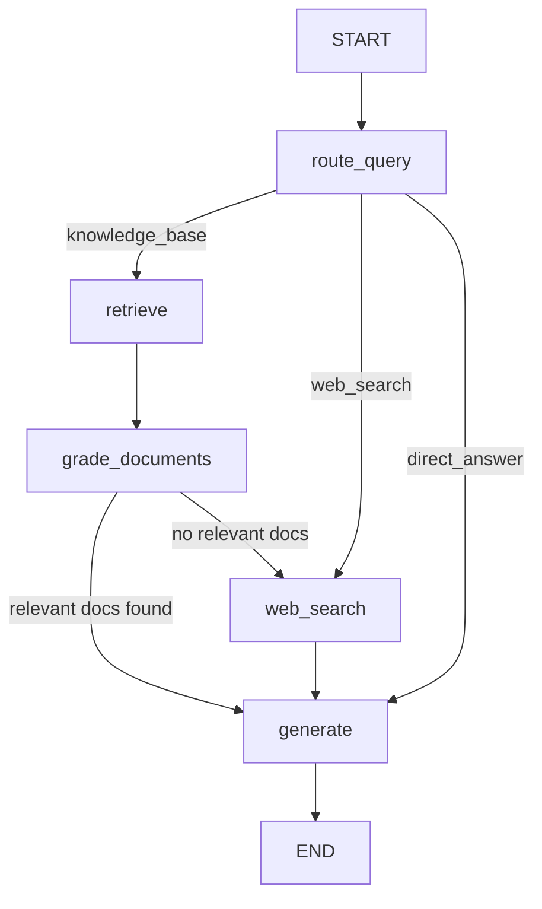

# RAG Agent with LangGraph

This implementation builds an **Adaptive RAG** agent using LangGraph. The agent decides whether to retrieve from a local vector store, fall back to web search, or answer directly -- then grades retrieved documents for relevance before generating a response.

:::info When to Use Adaptive RAG
Use this pattern when your application must answer questions from internal documents but also handle queries outside the knowledge base. The grading step prevents hallucination by filtering out irrelevant retrievals before generation.
:::

---

## Architecture



The **router** classifies the query. The **grader** filters irrelevant retrievals. If no relevant documents survive grading, the graph falls back to web search. The **generator** synthesizes the final answer from whichever source provided context.

---

## Install Dependencies

```bash
pip install langgraph langchain-openai langchain-core langchain-community \
    chromadb pydantic
```

---

## Step 1: Define the State

```python
"""state.py -- Typed state for the Adaptive RAG graph."""

from __future__ import annotations

from typing import Annotated, Literal, Sequence
from langchain_core.documents import Document
from langchain_core.messages import BaseMessage
from langgraph.graph.message import add_messages
from pydantic import BaseModel, Field


class RAGState(BaseModel):
    """State flowing through every node of the Adaptive RAG graph.

    Fields are grouped by lifecycle stage: input, retrieval,
    grading, generation, and metadata.
    """

    # -- Input --
    query: str = Field(description="The user's original question.")
    messages: Annotated[Sequence[BaseMessage], add_messages] = Field(
        default_factory=list,
    )

    # -- Retrieval --
    retrieved_docs: list[Document] = Field(
        default_factory=list,
        description="Raw documents returned by the retriever.",
    )
    relevant_docs: list[Document] = Field(
        default_factory=list,
        description="Documents that passed relevance grading.",
    )

    # -- Routing / Generation --
    route: Literal["knowledge_base", "web_search", "direct_answer"] = Field(
        default="knowledge_base",
    )
    generation: str = Field(default="", description="The final generated answer.")
    web_results: str = Field(default="", description="Fallback web search results.")

    # -- Metadata --
    retry_count: int = Field(default=0)

    class Config:
        arbitrary_types_allowed = True
```

---

## Step 2: Build the Vector Store

```python
"""vectorstore.py -- ChromaDB vector store construction and loading."""

from __future__ import annotations

from langchain_community.document_loaders import TextLoader, DirectoryLoader
from langchain.text_splitter import RecursiveCharacterTextSplitter
from langchain_community.vectorstores import Chroma
from langchain_openai import OpenAIEmbeddings


def build_vectorstore(
    docs_dir: str = "./knowledge_base",
    persist_dir: str = "./chroma_db",
    chunk_size: int = 500,
    chunk_overlap: int = 50,
) -> Chroma:
    """Ingest documents, split, embed, and persist to ChromaDB.

    Args:
        docs_dir: Directory containing source .txt files.
        persist_dir: Path for ChromaDB persistence.
        chunk_size: Maximum characters per chunk.
        chunk_overlap: Overlap between consecutive chunks.

    Returns:
        A persisted Chroma vector store instance.
    """
    loader = DirectoryLoader(
        docs_dir, glob="**/*.txt", loader_cls=TextLoader, show_progress=True,
    )
    documents = loader.load()

    splitter = RecursiveCharacterTextSplitter(
        chunk_size=chunk_size,
        chunk_overlap=chunk_overlap,
        separators=["\n\n", "\n", ". ", " ", ""],
    )
    chunks = splitter.split_documents(documents)

    embeddings = OpenAIEmbeddings(model="text-embedding-3-small")
    vectorstore = Chroma.from_documents(
        documents=chunks, embedding=embeddings, persist_directory=persist_dir,
    )
    return vectorstore


def load_vectorstore(persist_dir: str = "./chroma_db") -> Chroma:
    """Load an existing ChromaDB vector store from disk."""
    embeddings = OpenAIEmbeddings(model="text-embedding-3-small")
    return Chroma(persist_directory=persist_dir, embedding_function=embeddings)
```

---

## Step 3: Build the Graph Nodes

```python
"""nodes.py -- All graph nodes for the Adaptive RAG workflow."""

from __future__ import annotations

import json
import logging
import urllib.request
from typing import Any

from langchain_core.messages import HumanMessage, SystemMessage
from langchain_openai import ChatOpenAI
from pydantic import BaseModel, Field

from state import RAGState
from vectorstore import load_vectorstore

logger = logging.getLogger(__name__)

llm = ChatOpenAI(model="gpt-4o", temperature=0.0)


# ── Structured output models ────────────────────────────────────────────────

class RouteDecision(BaseModel):
    """Schema for the routing LLM call."""
    route: str = Field(description="One of: knowledge_base, web_search, direct_answer")


class GradeResult(BaseModel):
    """Schema for per-document relevance grading."""
    relevant: bool = Field(description="Whether the document is relevant to the query.")


# ── Nodes ────────────────────────────────────────────────────────────────────

async def route_query(state: RAGState) -> dict[str, Any]:
    """Classify the query to decide the retrieval strategy."""
    logger.info("Routing query: %s", state.query[:80])
    structured_llm = llm.with_structured_output(RouteDecision)

    decision = await structured_llm.ainvoke([
        SystemMessage(content=(
            "You are a query router. Classify the user query into one of:\n"
            "- knowledge_base: questions about internal docs, policies, products\n"
            "- web_search: current events, external facts, live data\n"
            "- direct_answer: greetings, simple chat, opinions"
        )),
        HumanMessage(content=state.query),
    ])
    return {"route": decision.route}


async def retrieve(state: RAGState) -> dict[str, Any]:
    """Retrieve documents from the ChromaDB vector store."""
    logger.info("Retrieving documents for: %s", state.query[:80])
    vectorstore = load_vectorstore()
    retriever = vectorstore.as_retriever(search_kwargs={"k": 4})
    docs = await retriever.ainvoke(state.query)
    return {"retrieved_docs": docs}


async def grade_documents(state: RAGState) -> dict[str, Any]:
    """Grade each retrieved document for relevance to the query."""
    logger.info("Grading %d documents", len(state.retrieved_docs))
    structured_llm = llm.with_structured_output(GradeResult)
    relevant = []

    for doc in state.retrieved_docs:
        grade = await structured_llm.ainvoke([
            SystemMessage(content=(
                "You are a relevance grader. Determine if the document "
                "is relevant to the user question. Be strict."
            )),
            HumanMessage(content=(
                f"Question: {state.query}\n\nDocument:\n{doc.page_content}"
            )),
        ])
        if grade.relevant:
            relevant.append(doc)

    logger.info("%d/%d documents passed grading", len(relevant), len(state.retrieved_docs))
    return {"relevant_docs": relevant}


async def web_search(state: RAGState) -> dict[str, Any]:
    """Fallback web search using Wikipedia REST API."""
    logger.info("Web search fallback for: %s", state.query[:80])
    url = (
        "https://en.wikipedia.org/api/rest_v1/page/summary/"
        + urllib.request.quote(state.query)
    )
    try:
        req = urllib.request.Request(url, headers={"User-Agent": "RAGAgent/2.0"})
        with urllib.request.urlopen(req, timeout=10) as resp:
            data = json.loads(resp.read().decode())
            result = f"**{data.get('title', '')}**\n{data.get('extract', '')[:600]}"
    except Exception as exc:
        logger.error("Web search failed: %s", exc)
        result = f"Web search failed: {exc}"

    return {"web_results": result}


async def generate(state: RAGState) -> dict[str, Any]:
    """Generate the final answer from available context."""
    context_parts: list[str] = []

    if state.relevant_docs:
        for i, doc in enumerate(state.relevant_docs, 1):
            source = doc.metadata.get("source", "unknown")
            context_parts.append(f"[Doc {i} - {source}]\n{doc.page_content}")

    if state.web_results:
        context_parts.append(f"[Web Search]\n{state.web_results}")

    context = "\n\n---\n\n".join(context_parts) if context_parts else "No context available."

    response = await llm.ainvoke([
        SystemMessage(content=(
            "You are a helpful assistant. Answer the question using ONLY the "
            "provided context. If the context is insufficient, say so. "
            "Cite sources when available."
        )),
        HumanMessage(content=f"Context:\n{context}\n\nQuestion: {state.query}"),
    ])
    return {"generation": response.content, "messages": [response]}
```

---

## Step 4: Define Conditional Routing

```python
"""routing.py -- Conditional edge functions for the RAG graph."""

from __future__ import annotations

from state import RAGState

MAX_RETRIES = 2


def route_after_classification(state: RAGState) -> str:
    """Route to the appropriate retrieval strategy after query classification."""
    if state.route == "web_search":
        return "web_search"
    if state.route == "direct_answer":
        return "generate"
    return "retrieve"


def route_after_grading(state: RAGState) -> str:
    """Route based on whether any documents passed relevance grading."""
    if state.relevant_docs:
        return "generate"
    if state.retry_count < MAX_RETRIES:
        return "web_search"
    return "generate"
```

---

## Step 5: Assemble the Graph

```python
"""graph.py -- Build and compile the Adaptive RAG graph."""

from __future__ import annotations

from langgraph.graph import StateGraph, START, END
from langgraph.checkpoint.memory import MemorySaver

from state import RAGState
from nodes import route_query, retrieve, grade_documents, web_search, generate
from routing import route_after_classification, route_after_grading


def build_rag_graph(checkpointer: MemorySaver | None = None):
    """Construct the Adaptive RAG graph.

    Args:
        checkpointer: Optional state checkpointer. Defaults to MemorySaver.

    Returns:
        A compiled LangGraph application.
    """
    if checkpointer is None:
        checkpointer = MemorySaver()

    graph = StateGraph(RAGState)

    # -- Nodes --
    graph.add_node("route_query", route_query)
    graph.add_node("retrieve", retrieve)
    graph.add_node("grade_documents", grade_documents)
    graph.add_node("web_search", web_search)
    graph.add_node("generate", generate)

    # -- Edges --
    graph.add_edge(START, "route_query")

    graph.add_conditional_edges(
        "route_query",
        route_after_classification,
        {
            "retrieve": "retrieve",
            "web_search": "web_search",
            "generate": "generate",
        },
    )

    graph.add_edge("retrieve", "grade_documents")

    graph.add_conditional_edges(
        "grade_documents",
        route_after_grading,
        {
            "generate": "generate",
            "web_search": "web_search",
        },
    )

    graph.add_edge("web_search", "generate")
    graph.add_edge("generate", END)

    return graph.compile(checkpointer=checkpointer)
```

---

## Step 6: Run the Agent

```python
"""main.py -- Entry point for the Adaptive RAG agent."""

import asyncio
import logging

from graph import build_rag_graph

logging.basicConfig(level=logging.INFO, format="%(asctime)s %(name)s %(message)s")


async def main() -> None:
    app = build_rag_graph()

    test_queries = [
        "What is the refund policy for digital products?",
        "Who is the current CEO of OpenAI?",
        "Hello, how are you today?",
    ]

    for query in test_queries:
        print(f"\n{'='*60}")
        print(f"QUERY: {query}")
        print(f"{'='*60}")

        config = {"configurable": {"thread_id": f"rag-{hash(query)}"}}
        result = await app.ainvoke({"query": query}, config=config)

        print(f"ROUTE: {result['route']}")
        print(f"DOCS RETRIEVED: {len(result['retrieved_docs'])}")
        print(f"DOCS RELEVANT: {len(result['relevant_docs'])}")
        print(f"ANSWER: {result['generation'][:300]}")


if __name__ == "__main__":
    asyncio.run(main())
```

---

## Step 7: Production Patterns

```python
"""production.py -- Production enhancements: retry, fallback, structured output."""

from __future__ import annotations

import asyncio
import logging
from typing import Any

from langchain_openai import ChatOpenAI
from pydantic import BaseModel, Field

from state import RAGState

logger = logging.getLogger(__name__)


class StructuredAnswer(BaseModel):
    """Structured output schema for the generator."""
    answer: str = Field(description="The answer to the user's question.")
    confidence: float = Field(description="Confidence score between 0.0 and 1.0.")
    sources: list[str] = Field(description="List of sources used.")


async def generate_with_retry(
    state: RAGState,
    max_retries: int = 3,
    backoff_base: float = 1.0,
) -> dict[str, Any]:
    """Generator node with exponential backoff retry.

    Falls back to a simple response if all retries fail.
    """
    llm = ChatOpenAI(model="gpt-4o", temperature=0.0)
    structured_llm = llm.with_structured_output(StructuredAnswer)

    for attempt in range(max_retries):
        try:
            result = await structured_llm.ainvoke(
                f"Answer this question: {state.query}\n\n"
                f"Context: {[d.page_content for d in state.relevant_docs]}"
            )
            return {
                "generation": f"{result.answer}\n\n"
                              f"Confidence: {result.confidence:.0%}\n"
                              f"Sources: {', '.join(result.sources)}",
            }
        except Exception as exc:
            wait = backoff_base * (2 ** attempt)
            logger.warning("Generation attempt %d failed: %s. Retrying in %.1fs", attempt + 1, exc, wait)
            await asyncio.sleep(wait)

    return {"generation": "I was unable to generate an answer. Please try again."}
```

:::warning Structured Output Validation
Using `with_structured_output` forces the LLM to return a Pydantic model. If parsing fails, LangChain raises a `ValidationError` -- which is why the retry wrapper is essential for production.
:::

---

## Key Takeaways for Interviews

:::tip Interview Talking Points
1. **Adaptive RAG outperforms naive RAG.** Routing queries to the right source (vector store, web, direct) reduces irrelevant retrievals and hallucination.
2. **Document grading is the quality gate.** Without it, the generator sees irrelevant chunks and hallucinates. The grader acts as a precision filter.
3. **Fallback chains increase reliability.** If retrieval fails, web search catches it. If both fail, the generator admits ignorance rather than hallucinating.
4. **Structured output with Pydantic** forces the LLM into a schema, making downstream code predictable and type-safe.
5. **Checkpointing enables resumability.** If the web search node fails mid-execution, you can resume from the last checkpoint instead of restarting.
6. **Chunk size tuning is critical.** Too large wastes context window; too small loses semantic coherence. 500 characters with 50 overlap is a solid starting point.
:::

---

## Evaluation Strategy

| What to Test | Method | Expected Outcome |
|---|---|---|
| Query routing accuracy | Suite of labeled queries | 90%+ correct route |
| Retrieval relevance | Graded document overlap | Top-4 docs contain answer |
| Grader precision | Known relevant/irrelevant pairs | No false positives passed |
| Generation faithfulness | LLM-as-judge vs. source docs | No unsupported claims |
| Fallback behavior | Query outside knowledge base | Web search triggered |
