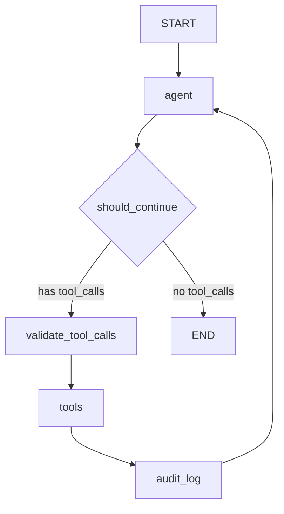

# Tool-Calling Agent with LangGraph

This implementation builds a **tool-calling agent** using LangGraph's prebuilt components. The agent uses structured tool calls (not free-text parsing), supports parallel tool execution, validates results with Pydantic, and includes production patterns like rate limiting, audit logging, and dynamic tool selection.

:::info Why LangGraph for Tool Calling?
LangGraph's `ToolNode` handles tool dispatch, error wrapping, and message formatting in a single reusable component. Combined with the explicit graph structure, you get full control over the tool execution lifecycle -- retries, validation, and audit -- without reimplementing the plumbing.
:::

---

## Architecture



The **agent** node invokes the LLM with bound tools. If tool calls are returned, they pass through a **validation** node before the prebuilt **ToolNode** executes them. An **audit log** node records every tool invocation for compliance.

---

## Install Dependencies

```bash
pip install langgraph langchain-openai langchain-core pydantic
```

---

## Step 1: Define Tools with Pydantic Schemas

```python
"""tools.py -- Tool definitions with Pydantic input schemas."""

from __future__ import annotations

import json
import math
from datetime import datetime, timezone

from langchain_core.tools import tool
from pydantic import BaseModel, Field


class WeatherInput(BaseModel):
    """Input schema for the weather tool."""
    location: str = Field(description="City name, e.g. 'New York'.")
    unit: str = Field(default="celsius", description="Temperature unit: celsius or fahrenheit.")


class CalculatorInput(BaseModel):
    """Input schema for the calculator tool."""
    expression: str = Field(description="A Python-evaluable math expression.")


class DatabaseSearchInput(BaseModel):
    """Input schema for the database search tool."""
    query: str = Field(description="Search query string.")
    table: str = Field(default="products", description="Table to search: products or customers.")


class CreateTicketInput(BaseModel):
    """Input schema for the ticket creation tool."""
    customer_name: str = Field(description="Name of the customer.")
    subject: str = Field(description="Brief subject line for the ticket.")
    priority: str = Field(default="medium", description="Ticket priority: low, medium, high, critical.")
    description: str = Field(default="", description="Detailed description of the issue.")


@tool(args_schema=WeatherInput)
def get_weather(location: str, unit: str = "celsius") -> str:
    """Get current weather for a location. Returns temperature, condition, and humidity."""
    mock_data = {
        "new york": {"temp": 22, "condition": "Partly cloudy", "humidity": 65},
        "london": {"temp": 15, "condition": "Overcast", "humidity": 80},
        "tokyo": {"temp": 28, "condition": "Sunny", "humidity": 55},
    }
    city = location.lower().strip()
    data = mock_data.get(city)
    if not data:
        return json.dumps({"error": f"No weather data for '{location}'."})

    temp = data["temp"]
    if unit == "fahrenheit":
        temp = round(temp * 9 / 5 + 32)

    return json.dumps({"location": location, "temperature": temp, "unit": unit, **data})


@tool(args_schema=CalculatorInput)
def calculate(expression: str) -> str:
    """Evaluate a mathematical expression safely and return the result."""
    allowed = {
        "abs": abs, "round": round, "min": min, "max": max,
        "pow": pow, "math": math, "int": int, "float": float,
    }
    try:
        result = eval(expression, {"__builtins__": {}}, allowed)
        return json.dumps({"expression": expression, "result": result})
    except Exception as exc:
        return json.dumps({"error": str(exc)})


@tool(args_schema=DatabaseSearchInput)
def search_database(query: str, table: str = "products") -> str:
    """Search the internal database for products or customer records."""
    mock_db = {
        "products": [
            {"id": 1, "name": "Widget Pro", "price": 49.99, "stock": 150},
            {"id": 2, "name": "Widget Lite", "price": 19.99, "stock": 300},
            {"id": 3, "name": "Enterprise Suite", "price": 299.00, "stock": 50},
        ],
        "customers": [
            {"id": 101, "name": "Alice", "plan": "enterprise", "since": "2023-01"},
            {"id": 102, "name": "Bob", "plan": "pro", "since": "2024-03"},
        ],
    }
    results = mock_db.get(table, [])
    q = query.lower()
    filtered = [r for r in results if q in json.dumps(r).lower()]
    return json.dumps({"table": table, "query": query, "results": filtered or results})


@tool(args_schema=CreateTicketInput)
def create_ticket(
    customer_name: str,
    subject: str,
    priority: str = "medium",
    description: str = "",
) -> str:
    """Create a new customer support ticket and return the ticket ID."""
    ticket_id = f"TKT-{datetime.now(timezone.utc).strftime('%Y%m%d%H%M%S')}"
    return json.dumps({
        "ticket_id": ticket_id,
        "customer_name": customer_name,
        "subject": subject,
        "priority": priority,
        "status": "open",
    })


ALL_TOOLS = [get_weather, calculate, search_database, create_ticket]
```

---

## Step 2: Define the State

```python
"""state.py -- Agent state for the tool-calling graph."""

from __future__ import annotations

from typing import Annotated, Any, Sequence
from langchain_core.messages import BaseMessage
from langgraph.graph.message import add_messages
from pydantic import BaseModel, Field


class AuditEntry(BaseModel):
    """A single audit log entry for a tool invocation."""
    tool_name: str
    arguments: dict[str, Any]
    result_preview: str
    timestamp: str


class ToolAgentState(BaseModel):
    """State for the tool-calling agent graph.

    Tracks conversation messages, audit log, and iteration metadata.
    """

    messages: Annotated[Sequence[BaseMessage], add_messages] = Field(
        default_factory=list,
    )
    audit_log: list[AuditEntry] = Field(
        default_factory=list,
        description="Ordered log of all tool invocations.",
    )
    iteration_count: int = 0
    total_tool_calls: int = 0

    class Config:
        arbitrary_types_allowed = True
```

---

## Step 3: Build the Graph Nodes

```python
"""nodes.py -- Agent, validation, tool, and audit nodes."""

from __future__ import annotations

import json
import logging
from datetime import datetime, timezone
from typing import Any

from langchain_core.messages import AIMessage, ToolMessage
from langchain_openai import ChatOpenAI
from langgraph.prebuilt import ToolNode

from state import AuditEntry, ToolAgentState
from tools import ALL_TOOLS

logger = logging.getLogger(__name__)

MAX_ITERATIONS = 10


def create_agent_model(model_name: str = "gpt-4o") -> ChatOpenAI:
    """Create the LLM with all tools bound.

    Separated for dependency injection in tests.
    """
    llm = ChatOpenAI(model=model_name, temperature=0.0)
    return llm.bind_tools(ALL_TOOLS)


_model = create_agent_model()


async def agent_node(state: ToolAgentState) -> dict[str, Any]:
    """Invoke the LLM with the current conversation and tool bindings."""
    logger.info("Agent node | iteration=%d", state.iteration_count)
    response = await _model.ainvoke(state.messages)
    return {
        "messages": [response],
        "iteration_count": state.iteration_count + 1,
    }


async def validate_tool_calls(state: ToolAgentState) -> dict[str, Any]:
    """Validate tool call arguments before execution.

    Checks that each tool call references a known tool and that
    required arguments are present. Invalid calls are replaced
    with error ToolMessages so the LLM can self-correct.
    """
    last_message = state.messages[-1]
    if not hasattr(last_message, "tool_calls") or not last_message.tool_calls:
        return {}

    known_tools = {t.name for t in ALL_TOOLS}
    error_messages = []

    for tc in last_message.tool_calls:
        if tc["name"] not in known_tools:
            logger.warning("Unknown tool requested: %s", tc["name"])
            error_messages.append(
                ToolMessage(
                    content=json.dumps({"error": f"Unknown tool: {tc['name']}"}),
                    tool_call_id=tc["id"],
                )
            )

    if error_messages:
        return {"messages": error_messages}
    return {}


# Prebuilt ToolNode handles dispatch, error wrapping, and parallel execution.
tool_node = ToolNode(ALL_TOOLS)


async def audit_log_node(state: ToolAgentState) -> dict[str, Any]:
    """Record tool invocations in the audit log for compliance.

    Reads the most recent ToolMessages and pairs them with the
    preceding AIMessage's tool_calls to build audit entries.
    """
    new_entries: list[AuditEntry] = []
    tool_call_count = 0

    # Walk backwards to find tool messages from the last tool execution
    for msg in reversed(state.messages):
        if isinstance(msg, ToolMessage):
            tool_call_count += 1
            # Find the matching tool call from the AIMessage
            entry = AuditEntry(
                tool_name=msg.name or "unknown",
                arguments={},
                result_preview=msg.content[:200] if msg.content else "",
                timestamp=datetime.now(timezone.utc).isoformat(),
            )
            new_entries.append(entry)
        elif isinstance(msg, AIMessage):
            break

    logger.info("Audit: logged %d tool calls", len(new_entries))
    return {
        "audit_log": state.audit_log + list(reversed(new_entries)),
        "total_tool_calls": state.total_tool_calls + tool_call_count,
    }


def should_continue(state: ToolAgentState) -> str:
    """Conditional edge: route to tools or finish.

    Enforces iteration limits and checks for tool calls.
    """
    if state.iteration_count >= MAX_ITERATIONS:
        logger.warning("Max iterations reached.")
        return "end"

    last_message = state.messages[-1]
    if hasattr(last_message, "tool_calls") and last_message.tool_calls:
        return "validate"
    return "end"
```

:::warning Validation Before Execution
The `validate_tool_calls` node catches invalid tool names before the `ToolNode` runs. This prevents cryptic errors and gives the LLM a structured error message to self-correct.
:::

---

## Step 4: Assemble the Graph

```python
"""graph.py -- Build the tool-calling agent graph."""

from __future__ import annotations

from langgraph.graph import StateGraph, START, END
from langgraph.checkpoint.memory import MemorySaver

from state import ToolAgentState
from nodes import agent_node, validate_tool_calls, tool_node, audit_log_node, should_continue


def build_tool_agent(checkpointer=None):
    """Construct and compile the tool-calling agent graph.

    Args:
        checkpointer: State persistence backend. Defaults to MemorySaver.

    Returns:
        A compiled LangGraph application.
    """
    if checkpointer is None:
        checkpointer = MemorySaver()

    graph = StateGraph(ToolAgentState)

    # -- Nodes --
    graph.add_node("agent", agent_node)
    graph.add_node("validate", validate_tool_calls)
    graph.add_node("tools", tool_node)
    graph.add_node("audit", audit_log_node)

    # -- Edges --
    graph.add_edge(START, "agent")

    graph.add_conditional_edges(
        "agent",
        should_continue,
        {"validate": "validate", "end": END},
    )

    graph.add_edge("validate", "tools")
    graph.add_edge("tools", "audit")
    graph.add_edge("audit", "agent")

    return graph.compile(checkpointer=checkpointer)
```

---

## Step 5: Multi-Turn Conversation with Memory

```python
"""main.py -- Multi-turn conversation demonstrating tool calling with memory."""

import asyncio
import logging

from langchain_core.messages import HumanMessage, SystemMessage

from graph import build_tool_agent

logging.basicConfig(level=logging.INFO, format="%(asctime)s %(name)s %(message)s")

SYSTEM_PROMPT = (
    "You are a helpful customer support assistant for Acme Corp. "
    "Use tools for all factual lookups. Use the calculator for math. "
    "Be concise and professional."
)


async def run_conversation() -> None:
    """Run a scripted multi-turn demo showing tool chaining and memory."""
    app = build_tool_agent()

    # Same thread_id across all messages = shared memory
    config = {"configurable": {"thread_id": "demo-conversation"}}

    conversation = [
        "What products do you have and how much do they cost?",
        "If I buy 5 Widget Pros and 10 Widget Lites, what is my total?",
        "What is the weather in Tokyo right now?",
        "Create a ticket for customer Alice about a billing discrepancy, high priority.",
        "Can you look up Alice's account details?",
    ]

    # Seed with system message on first turn
    first_messages = [
        SystemMessage(content=SYSTEM_PROMPT),
        HumanMessage(content=conversation[0]),
    ]

    result = await app.ainvoke({"messages": first_messages}, config=config)
    print(f"Agent: {result['messages'][-1].content}\n")

    # Subsequent turns: just send the human message; memory handles context
    for user_msg in conversation[1:]:
        print(f"User: {user_msg}")
        result = await app.ainvoke(
            {"messages": [HumanMessage(content=user_msg)]},
            config=config,
        )
        print(f"Agent: {result['messages'][-1].content}")
        print(f"  [Tool calls so far: {result['total_tool_calls']}]\n")

    # Print audit log
    print("=" * 60)
    print("AUDIT LOG")
    print("=" * 60)
    for entry in result["audit_log"]:
        print(f"  {entry.timestamp} | {entry.tool_name} | {entry.result_preview[:80]}")


if __name__ == "__main__":
    asyncio.run(run_conversation())
```

---

## Step 6: Dynamic Tool Selection

```python
"""dynamic_tools.py -- Select tools dynamically based on conversation context."""

from __future__ import annotations

from typing import Any

from langchain_core.messages import AIMessage
from langchain_openai import ChatOpenAI
from pydantic import BaseModel, Field

from state import ToolAgentState
from tools import ALL_TOOLS


class ToolSelection(BaseModel):
    """Structured output for dynamic tool selection."""
    selected_tools: list[str] = Field(
        description="Names of tools relevant to the current query."
    )
    reasoning: str = Field(description="Why these tools were selected.")


async def dynamic_tool_selector(state: ToolAgentState) -> dict[str, Any]:
    """Analyze the conversation and bind only relevant tools.

    This reduces the tool schema size in the prompt, improving
    accuracy for models that struggle with large tool sets.
    """
    llm = ChatOpenAI(model="gpt-4o", temperature=0.0)
    structured_llm = llm.with_structured_output(ToolSelection)

    last_human = None
    for msg in reversed(state.messages):
        if msg.type == "human":
            last_human = msg.content
            break

    if not last_human:
        return {}

    tool_names = [t.name for t in ALL_TOOLS]
    selection = await structured_llm.ainvoke(
        f"Available tools: {tool_names}\n"
        f"User query: {last_human}\n"
        f"Which tools are relevant?"
    )

    selected = [t for t in ALL_TOOLS if t.name in selection.selected_tools]
    if not selected:
        selected = ALL_TOOLS  # Fallback to all tools

    # Rebind the model with the reduced tool set
    model = ChatOpenAI(model="gpt-4o", temperature=0.0).bind_tools(selected)
    response = await model.ainvoke(state.messages)

    return {"messages": [response]}
```

:::tip When to Use Dynamic Tool Selection
When your agent has more than 10 tools, the tool schemas consume significant prompt tokens and can confuse the model. Dynamic selection prunes the tool set per query, improving both accuracy and cost.
:::

---

## Step 7: Cost and Rate Tracking

```python
"""tracking.py -- Cost and rate tracking for production deployments."""

from __future__ import annotations

import time
from collections import deque
from pydantic import BaseModel, Field


class UsageTracker(BaseModel):
    """Track API usage, costs, and rate limits across conversations."""

    prompt_tokens: int = 0
    completion_tokens: int = 0
    tool_calls_count: int = 0
    api_calls_count: int = 0
    cost_per_1k_prompt: float = Field(default=0.0025, description="GPT-4o pricing")
    cost_per_1k_completion: float = Field(default=0.01)

    @property
    def total_tokens(self) -> int:
        return self.prompt_tokens + self.completion_tokens

    @property
    def estimated_cost(self) -> float:
        return (
            (self.prompt_tokens / 1000) * self.cost_per_1k_prompt
            + (self.completion_tokens / 1000) * self.cost_per_1k_completion
        )

    def summary(self) -> str:
        return (
            f"API calls: {self.api_calls_count} | "
            f"Tool calls: {self.tool_calls_count} | "
            f"Tokens: {self.total_tokens:,} | "
            f"Est. cost: ${self.estimated_cost:.4f}"
        )


class RateLimiter:
    """Simple sliding-window rate limiter for API calls."""

    def __init__(self, max_calls: int = 20, window_seconds: float = 60.0):
        self._max_calls = max_calls
        self._window = window_seconds
        self._timestamps: deque[float] = deque()

    def acquire(self) -> bool:
        """Check if a call is allowed under the rate limit."""
        now = time.monotonic()
        while self._timestamps and now - self._timestamps[0] > self._window:
            self._timestamps.popleft()
        if len(self._timestamps) >= self._max_calls:
            return False
        self._timestamps.append(now)
        return True

    def wait_time(self) -> float:
        """Seconds to wait before the next call is allowed."""
        if len(self._timestamps) < self._max_calls:
            return 0.0
        return self._window - (time.monotonic() - self._timestamps[0])
```

---

## Key Takeaways for Interviews

:::tip Interview Talking Points
1. **LangGraph's `ToolNode` is production-ready.** It handles dispatch, error wrapping, and parallel execution out of the box -- no custom tool loop needed.
2. **Pydantic tool schemas are self-documenting.** The model receives structured descriptions, reducing hallucinated arguments compared to plain-text descriptions.
3. **Validation before execution** catches invalid calls early and gives the LLM a structured error to self-correct, rather than a Python traceback.
4. **Audit logging is non-negotiable in enterprise.** Every tool call must be recorded for compliance, debugging, and cost attribution.
5. **Multi-turn memory via checkpointing** means the agent remembers context across messages without manually threading conversation history.
6. **Dynamic tool selection** reduces prompt size and improves accuracy when the tool set is large.
7. **Rate limiting** prevents API quota exhaustion in high-throughput deployments.
:::

---

## LangGraph ToolNode vs. Manual Tool Loop

| Aspect | LangGraph ToolNode | Manual Loop |
|---|---|---|
| Error handling | Wraps exceptions as ToolMessages | Must implement try/except |
| Parallel execution | Built-in for multiple tool_calls | Must use ThreadPoolExecutor |
| Message formatting | Automatic ToolMessage construction | Manual message assembly |
| Validation | Add-on validation node | Must build from scratch |
| Testing | Mock tools via dependency injection | Mock raw API responses |
| Observability | Graph-level streaming + LangSmith | Custom logging |
