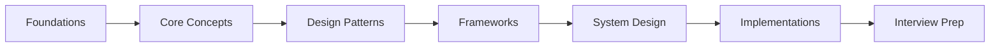

# Agentic AI Interview Kit

**The comprehensive, open-source study guide for mastering agentic AI concepts, design patterns, and system design -- built for engineers preparing for interviews and practitioners building real systems.**

---

## What Is Agentic AI?

Large language models can do more than answer questions. When you give an LLM the ability to **observe** its environment, **reason** about what to do next, **act** by calling tools or APIs, and **learn** from the results, you have built an **agent**. Agentic AI is the discipline of designing, building, and evaluating these autonomous systems.

Unlike traditional software that follows a predetermined control flow, agentic systems exhibit:

- **Autonomy** -- they decide which steps to take without explicit human instruction for every action.
- **Tool use** -- they interact with external systems (databases, APIs, code interpreters) to accomplish goals.
- **Memory** -- they maintain context across interactions, both short-term (within a conversation) and long-term (across sessions).
- **Planning** -- they decompose complex goals into sub-tasks and execute them in a reasoned order.
- **Self-correction** -- they evaluate their own outputs and retry or adjust when something goes wrong.

This matters because agentic AI is rapidly becoming the architecture of choice for building intelligent applications -- from autonomous coding assistants and research agents to multi-agent orchestration platforms that coordinate dozens of specialized agents.

:::tip Why Now?
The convergence of powerful foundation models, mature tool-use frameworks (LangChain, LlamaIndex, CrewAI, AutoGen), and production-grade infrastructure (vector databases, observability platforms) has made agentic AI practical for real-world systems. Interview questions in this space are growing fast.
:::

---

## What You Will Learn

This guide is organized into seven progressive sections. Each section builds on the previous one.

### 1. Foundations
Prerequisite knowledge that every agentic AI engineer must have. Covers LLM internals, prompting techniques, embeddings, RAG pipelines, fine-tuning tradeoffs, and evaluation metrics. If you are new to LLMs, start here.

### 2. Core Concepts
The building blocks of agentic systems. Covers the agent loop (Observe-Think-Act), tool use and function calling, memory architectures (short-term, long-term, episodic), planning and reasoning strategies (ReAct, Plan-and-Execute, Tree of Thought), and guardrails.

### 3. Design Patterns
Proven architectural patterns for building agents. Covers single-agent patterns (router, chain, state machine), multi-agent patterns (supervisor, peer-to-peer, hierarchical), human-in-the-loop patterns, and error recovery strategies.

### 4. Frameworks
Hands-on walkthroughs of the most popular agentic AI frameworks. Covers LangChain/LangGraph, LlamaIndex, CrewAI, AutoGen/AG2, OpenAI Agents SDK, and Semantic Kernel. Each walkthrough includes architecture diagrams and working code.

### 5. System Design
End-to-end system design for agentic applications. Covers scalability, reliability, observability, cost management, security, and deployment. Structured as system design interview questions with full solutions.

### 6. Implementations
Complete, production-grade reference implementations. Covers a customer support agent, a research assistant, a code generation pipeline, and a multi-agent workflow. Each implementation includes architecture diagrams, code, and test strategies.

### 7. Interview Prep
Targeted preparation for agentic AI interviews. Covers common questions organized by difficulty, sample answers, whiteboard exercises, and a study plan.

---

## How to Use This Guide

This guide follows a **progressive learning path**. Each section assumes you have absorbed the material in the sections before it.

**For each topic, you will find:**

- **Concept explanations** -- clear, concise descriptions of what the concept is and why it matters.
- **Mermaid diagrams** -- visual representations of architectures, flows, and relationships.
- **Python code examples** -- practical, runnable code that demonstrates the concept.
- **Interview angles** -- how the topic is likely to appear in an interview.
- **Deep dives** -- collapsible sections with additional depth for advanced readers.

:::info Reading Time
Each page is designed to be read in 10-15 minutes. The entire guide can be completed in a focused weekend of study, or spread across a week of daily sessions.
:::

---

## Quick Start: Where Should You Begin?

Choose your starting point based on your experience level.

| Experience Level | Start Here | Estimated Time |
|---|---|---|
| **New to LLMs** | [Foundations: LLM Fundamentals](./foundations/llm-fundamentals) | Full guide (20-25 hours) |
| **Comfortable with LLMs, new to agents** | [Core Concepts](./core-concepts/what-are-agents) | Sections 2-7 (15-18 hours) |
| **Built simple agents, want depth** | [Design Patterns](./design-patterns/react-pattern) | Sections 3-7 (10-12 hours) |
| **Experienced practitioner, interview prep** | [Interview Prep](./interview-questions/foundational-qa) | Section 7 + review (5-8 hours) |

### If You Have One Hour

Read these three pages in order:

1. [LLM Fundamentals](./foundations/llm-fundamentals) -- understand the engine.
2. [Core Concepts: The Agent Loop](./core-concepts/what-are-agents) -- understand the architecture.
3. [Design Patterns Overview](./design-patterns/react-pattern) -- understand the playbook.

### If You Have One Day

Work through Foundations and Core Concepts end to end. Build the code examples as you go.

### If You Have One Week

Complete the full guide. Spend extra time on System Design and Implementations, as these sections most closely mirror what you will encounter in senior-level interviews.

---

## Prerequisites

To get the most from this guide, you should be comfortable with:

- **Python 3.10+** -- all code examples use Python.
- **Basic ML concepts** -- you do not need to be a researcher, but familiarity with neural networks, loss functions, and gradient descent helps.
- **REST APIs** -- you will work with LLM provider APIs (OpenAI, Anthropic).
- **Software engineering fundamentals** -- data structures, design patterns, distributed systems basics.

:::warning API Keys Required
Many code examples call LLM APIs. You will need API keys from providers like OpenAI or Anthropic. Where possible, we provide alternatives using open-source models that run locally.
:::

---

## Contributing

This is an open-source project. If you find errors, want to add content, or have suggestions, please open an issue or pull request. The goal is to make this the best freely available resource for agentic AI interview preparation.

---

<strong>Notation and Conventions Used in This Guide</strong>

Throughout this guide, we use the following conventions:

- **Bold terms** indicate key vocabulary that you should know for interviews.
- `Code blocks` are used for API parameters, model names, and inline code references.
- Mermaid diagrams are used for architecture and flow visualization.
- Admonition blocks (tip, info, warning, danger) highlight important callouts.
- Collapsible sections (like this one) contain supplementary material for deeper understanding.
- All code examples are written in Python and tested against Python 3.10+.
- Token counts and cost estimates are based on pricing as of early 2026 and may change.

