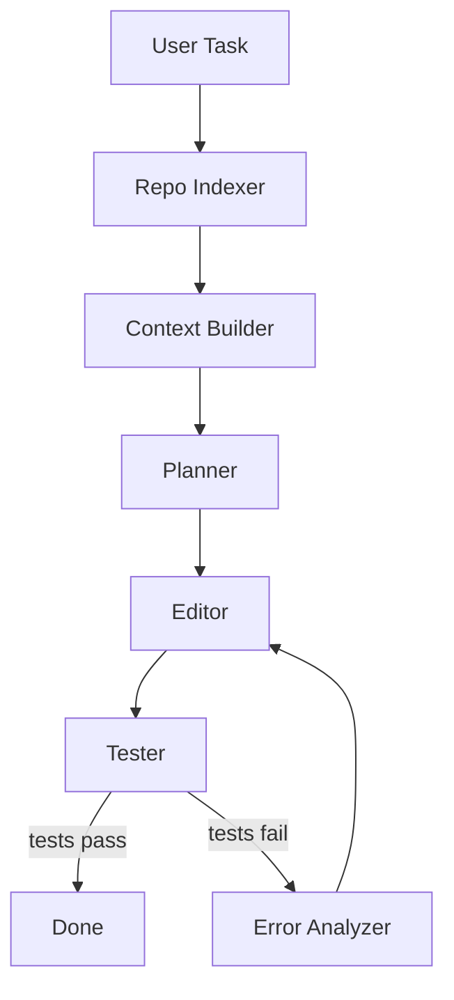
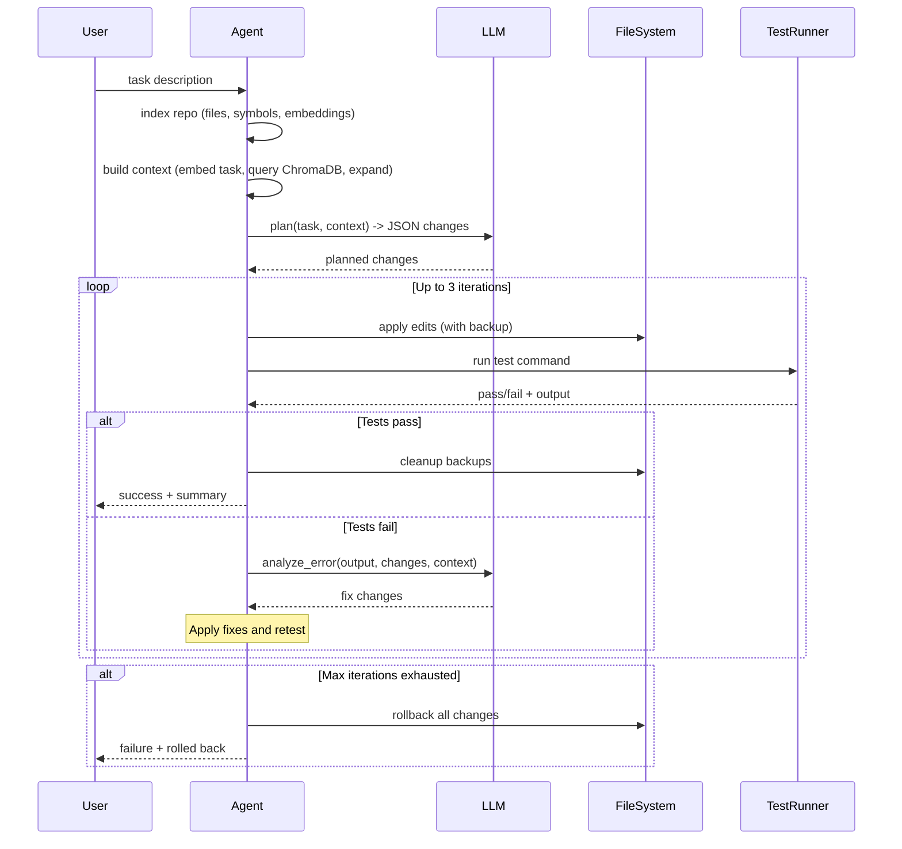

# Project: Code Assistant Agent

Build an AI-powered code assistant that indexes a repository, understands its structure through AST parsing and embeddings, accepts natural language tasks, plans multi-file changes, generates code edits, runs tests, and iterates on failures. This uses a custom agent loop instead of a framework -- the right choice when you need deep integration with file systems, AST parsers, and build tools.

:::info Framework Decision
**Why Custom Implementation?**
- **Deep system integration** -- The agent interacts heavily with file systems, AST parsers, git, and test runners. Framework abstractions add a layer between you and these tools without adding value.
- **Simple agent loop** -- The core cycle is plan, edit, test, fix. This doesn't need a complex state graph -- a simple while loop with well-defined modules is clearer.
- **Domain-specific context building** -- Selecting relevant files for LLM context requires custom logic (AST analysis, import graphs, test file matching) that doesn't fit neatly into framework tool abstractions.
- **Why not LangGraph?** -- LangGraph excels at complex conditional routing and multi-agent coordination. This agent has a single, straightforward loop -- the complexity is in the tools, not the orchestration.
- **Why not LangChain?** -- LangChain's chain abstractions would add indirection to what is fundamentally a direct LLM API call with custom context injection.
:::

---

## Architecture Overview



---

## Prerequisites

- Python 3.10+
- OpenAI API key (or any OpenAI-compatible API)
- A git repository to work with
- `tree-sitter` for AST parsing (optional but recommended)

---

## Setup

```bash
pip install openai chromadb tiktoken python-dotenv
# Optional: pip install tree-sitter tree-sitter-python tree-sitter-javascript
```

`.env`:
```bash
OPENAI_API_KEY=your-key
OPENAI_MODEL=gpt-4o
```

---

## Implementation

### Step 1: Configuration and Utilities

```python
"""config.py -- Configuration and shared utilities for the code assistant."""

from __future__ import annotations

import os
import re
import fnmatch
from pathlib import Path
from dataclasses import dataclass, field
from dotenv import load_dotenv

load_dotenv()

OPENAI_API_KEY = os.getenv("OPENAI_API_KEY", "")
OPENAI_MODEL = os.getenv("OPENAI_MODEL", "gpt-4o")
EMBEDDING_MODEL = "text-embedding-3-small"
MAX_FIX_ITERATIONS = 3
MAX_CONTEXT_TOKENS = 12000
CHROMA_COLLECTION = "repo_index"

# Files and directories to skip during indexing.
DEFAULT_IGNORE_PATTERNS = [
    ".git", "__pycache__", "node_modules", ".venv", "venv",
    "*.pyc", "*.pyo", "*.so", "*.dylib", "*.dll", "*.exe",
    "*.png", "*.jpg", "*.jpeg", "*.gif", "*.ico", "*.svg",
    "*.woff", "*.woff2", "*.ttf", "*.eot",
    "*.zip", "*.tar", "*.gz", "*.bz2",
    "*.lock", "package-lock.json", "yarn.lock",
    ".DS_Store", "Thumbs.db",
]


@dataclass
class FileChunk:
    """A chunk of a source file with metadata for embedding and retrieval."""
    file_path: str
    content: str
    symbols: list[str] = field(default_factory=list)
    language: str = ""
    start_line: int = 0
    end_line: int = 0


def should_ignore(path: str, ignore_patterns: list[str] | None = None) -> bool:
    """Return True if the path matches any ignore pattern."""
    patterns = ignore_patterns or DEFAULT_IGNORE_PATTERNS
    name = os.path.basename(path)
    for pattern in patterns:
        if fnmatch.fnmatch(name, pattern):
            return True
        if pattern in path.split(os.sep):
            return True
    return False


def detect_language(file_path: str) -> str:
    """Map a file extension to a language identifier."""
    ext_map = {
        ".py": "python", ".js": "javascript", ".ts": "typescript",
        ".jsx": "javascript", ".tsx": "typescript",
        ".go": "go", ".rs": "rust", ".java": "java",
        ".rb": "ruby", ".cpp": "cpp", ".c": "c", ".h": "c",
        ".cs": "csharp", ".swift": "swift", ".kt": "kotlin",
        ".sh": "bash", ".yaml": "yaml", ".yml": "yaml",
        ".json": "json", ".toml": "toml", ".md": "markdown",
    }
    ext = Path(file_path).suffix.lower()
    return ext_map.get(ext, "text")


def count_tokens(text: str) -> int:
    """Approximate token count using tiktoken for the cl100k_base encoding."""
    import tiktoken
    enc = tiktoken.get_encoding("cl100k_base")
    return len(enc.encode(text))


SYMBOL_PATTERNS = {
    "python": [
        (r"^class\s+(\w+)", "class"),
        (r"^def\s+(\w+)", "function"),
        (r"^async\s+def\s+(\w+)", "function"),
    ],
    "javascript": [
        (r"(?:class|const|let|var|function)\s+(\w+)", "symbol"),
        (r"export\s+(?:default\s+)?(?:class|function|const)\s+(\w+)", "symbol"),
    ],
    "typescript": [
        (r"(?:class|const|let|var|function|interface|type|enum)\s+(\w+)", "symbol"),
        (r"export\s+(?:default\s+)?(?:class|function|const|interface|type)\s+(\w+)", "symbol"),
    ],
    "go": [
        (r"^func\s+(?:\(\w+\s+\*?\w+\)\s+)?(\w+)", "function"),
        (r"^type\s+(\w+)\s+struct", "struct"),
        (r"^type\s+(\w+)\s+interface", "interface"),
    ],
    "java": [
        (r"(?:public|private|protected)?\s*class\s+(\w+)", "class"),
        (r"(?:public|private|protected)\s+\w+\s+(\w+)\s*\(", "method"),
    ],
}


def extract_symbols(content: str, language: str) -> list[str]:
    """Extract top-level symbol names from source code using regex patterns."""
    symbols = []
    patterns = SYMBOL_PATTERNS.get(language, [])
    for line in content.splitlines():
        stripped = line.rstrip()
        for pattern, _ in patterns:
            match = re.match(pattern, stripped)
            if match:
                symbols.append(match.group(1))
    return symbols


IMPORT_PATTERNS = {
    "python": [
        r"^from\s+([\w.]+)\s+import",
        r"^import\s+([\w.]+)",
    ],
    "javascript": [
        r"(?:import|require)\s*\(?['\"]([^'\"]+)['\"]",
    ],
    "typescript": [
        r"import\s+.*?from\s+['\"]([^'\"]+)['\"]",
    ],
    "go": [
        r'"([^"]+)"',
    ],
}


def extract_imports(content: str, language: str) -> list[str]:
    """Extract import/dependency paths from source code."""
    imports = []
    patterns = IMPORT_PATTERNS.get(language, [])
    for line in content.splitlines():
        for pattern in patterns:
            match = re.search(pattern, line)
            if match:
                imports.append(match.group(1))
    return imports
```

---

### Step 2: Repo Indexer

```python
"""indexer.py -- Walk a repository, extract symbols, embed chunks, store in ChromaDB."""

from __future__ import annotations

import os
import logging
from pathlib import Path

import chromadb
from openai import OpenAI

from config import (
    OPENAI_API_KEY, EMBEDDING_MODEL, CHROMA_COLLECTION,
    FileChunk, should_ignore, detect_language, extract_symbols,
    extract_imports,
)

logger = logging.getLogger(__name__)
client = OpenAI(api_key=OPENAI_API_KEY)


class RepoIndexer:
    """Index a repository into ChromaDB for semantic retrieval.

    Walks the file tree, extracts symbols and imports, chunks files,
    generates embeddings via the OpenAI API, and stores everything
    in a local ChromaDB collection.
    """

    def __init__(self, repo_path: str, chroma_path: str = ".code_assistant_index"):
        self.repo_path = os.path.abspath(repo_path)
        self.chroma_client = chromadb.PersistentClient(path=chroma_path)
        self.collection = self.chroma_client.get_or_create_collection(
            name=CHROMA_COLLECTION,
            metadata={"hnsw:space": "cosine"},
        )
        self.import_graph: dict[str, list[str]] = {}
        self.file_symbols: dict[str, list[str]] = {}

    def index(self) -> dict[str, int]:
        """Walk the repo, chunk files, embed, and store. Returns stats."""
        chunks = self._collect_chunks()
        if not chunks:
            logger.warning("No indexable files found in %s", self.repo_path)
            return {"files": 0, "chunks": 0, "symbols": 0}

        # Embed in batches of 100 (OpenAI API limit for embeddings).
        batch_size = 100
        total_symbols = 0
        unique_files = set()

        for i in range(0, len(chunks), batch_size):
            batch = chunks[i : i + batch_size]
            texts = [c.content for c in batch]
            response = client.embeddings.create(input=texts, model=EMBEDDING_MODEL)
            embeddings = [item.embedding for item in response.data]

            ids = [f"{c.file_path}:{c.start_line}-{c.end_line}" for c in batch]
            metadatas = [
                {
                    "file_path": c.file_path,
                    "language": c.language,
                    "symbols": ", ".join(c.symbols),
                    "start_line": c.start_line,
                    "end_line": c.end_line,
                }
                for c in batch
            ]

            self.collection.upsert(
                ids=ids,
                documents=texts,
                embeddings=embeddings,
                metadatas=metadatas,
            )

            for c in batch:
                unique_files.add(c.file_path)
                total_symbols += len(c.symbols)

        stats = {
            "files": len(unique_files),
            "chunks": len(chunks),
            "symbols": total_symbols,
        }
        logger.info(
            "Indexed %d files, %d chunks, %d symbols",
            stats["files"], stats["chunks"], stats["symbols"],
        )
        return stats

    # -- Private helpers -------------------------------------------------------

    def _collect_chunks(self) -> list[FileChunk]:
        """Walk the repo and produce FileChunk objects for every indexable file."""
        chunks: list[FileChunk] = []

        for root, dirs, files in os.walk(self.repo_path):
            # Prune ignored directories in-place so os.walk skips them.
            dirs[:] = [d for d in dirs if not should_ignore(d)]

            for fname in files:
                full_path = os.path.join(root, fname)
                rel_path = os.path.relpath(full_path, self.repo_path)

                if should_ignore(rel_path):
                    continue

                language = detect_language(rel_path)
                if language in ("text",):
                    continue  # Skip unknown file types.

                try:
                    content = Path(full_path).read_text(encoding="utf-8", errors="ignore")
                except OSError:
                    continue

                if not content.strip() or len(content) > 200_000:
                    continue  # Skip empty or enormous files.

                symbols = extract_symbols(content, language)
                self.file_symbols[rel_path] = symbols

                imports = extract_imports(content, language)
                self.import_graph[rel_path] = imports

                file_chunks = self._chunk_file(rel_path, content, language, symbols)
                chunks.extend(file_chunks)

        return chunks

    def _chunk_file(
        self,
        rel_path: str,
        content: str,
        language: str,
        all_symbols: list[str],
        max_lines: int = 80,
        overlap: int = 10,
    ) -> list[FileChunk]:
        """Split a file into overlapping line-based chunks."""
        lines = content.splitlines()
        chunks: list[FileChunk] = []

        if len(lines) <= max_lines:
            chunks.append(FileChunk(
                file_path=rel_path,
                content=content,
                symbols=all_symbols,
                language=language,
                start_line=1,
                end_line=len(lines),
            ))
            return chunks

        start = 0
        while start < len(lines):
            end = min(start + max_lines, len(lines))
            chunk_lines = lines[start:end]
            chunk_content = "\n".join(chunk_lines)

            # Find symbols that appear in this chunk.
            chunk_symbols = [
                s for s in all_symbols if s in chunk_content
            ]

            chunks.append(FileChunk(
                file_path=rel_path,
                content=chunk_content,
                symbols=chunk_symbols,
                language=language,
                start_line=start + 1,
                end_line=end,
            ))

            start += max_lines - overlap

        return chunks
```

---

### Step 3: Context Builder

```python
"""context_builder.py -- Select and assemble the most relevant files for a task."""

from __future__ import annotations

import os
import logging
from pathlib import Path

import chromadb
from openai import OpenAI

from config import (
    OPENAI_API_KEY, EMBEDDING_MODEL, CHROMA_COLLECTION,
    MAX_CONTEXT_TOKENS, count_tokens,
)

logger = logging.getLogger(__name__)
client = OpenAI(api_key=OPENAI_API_KEY)


class ContextBuilder:
    """Build a token-budget-aware context string from the indexed repository.

    Given a natural language task description, this class:
    1. Embeds the task.
    2. Queries ChromaDB for the most similar file chunks.
    3. Expands the result set with related files (imports, test files).
    4. Fits the final selection within the token budget.
    5. Returns a formatted context string with file contents.
    """

    def __init__(
        self,
        repo_path: str,
        import_graph: dict[str, list[str]],
        chroma_path: str = ".code_assistant_index",
    ):
        self.repo_path = os.path.abspath(repo_path)
        self.import_graph = import_graph
        chroma_client = chromadb.PersistentClient(path=chroma_path)
        self.collection = chroma_client.get_or_create_collection(
            name=CHROMA_COLLECTION,
        )

    def build_context(
        self, task: str, max_tokens: int = MAX_CONTEXT_TOKENS
    ) -> tuple[str, list[str]]:
        """Build the context string for the given task.

        Returns:
            A tuple of (formatted_context, list_of_selected_file_paths).
        """
        # Step 1: Embed the task and query for similar chunks.
        response = client.embeddings.create(input=[task], model=EMBEDDING_MODEL)
        task_embedding = response.data[0].embedding

        results = self.collection.query(
            query_embeddings=[task_embedding],
            n_results=15,
            include=["documents", "metadatas", "distances"],
        )

        # Step 2: Rank unique files by best chunk distance.
        file_scores: dict[str, float] = {}
        for meta, distance in zip(
            results["metadatas"][0], results["distances"][0]
        ):
            fp = meta["file_path"]
            # ChromaDB cosine distance: lower is more similar.
            if fp not in file_scores or distance < file_scores[fp]:
                file_scores[fp] = distance

        # Step 3: Expand with related files (imports, test counterparts).
        expanded: dict[str, float] = dict(file_scores)
        for fp, score in list(file_scores.items()):
            for related in self._find_related_files(fp):
                if related not in expanded:
                    expanded[related] = score + 0.15  # Slight penalty for indirect match.

        # Step 4: Sort by score (ascending -- lower distance is better).
        ranked = sorted(expanded.items(), key=lambda x: x[1])

        # Step 5: Fit within the token budget.
        selected_files, context_str = self._fit_to_budget(ranked, max_tokens)

        logger.info(
            "Context built: %d files selected (%d tokens)",
            len(selected_files),
            count_tokens(context_str),
        )
        return context_str, selected_files

    def _find_related_files(self, file_path: str) -> list[str]:
        """Find files related to the given file via imports and test naming."""
        related: list[str] = []

        # Direct imports from the import graph.
        for imp in self.import_graph.get(file_path, []):
            # Try to resolve relative import to a file path.
            candidate = imp.replace(".", os.sep)
            for ext in [".py", ".js", ".ts", ".go", ".java", ""]:
                full = candidate + ext
                if os.path.isfile(os.path.join(self.repo_path, full)):
                    related.append(full)
                    break

        # Test file counterparts: foo.py <-> test_foo.py / tests/test_foo.py
        name = Path(file_path).stem
        parent = str(Path(file_path).parent)
        if name.startswith("test_"):
            # This is a test file -- find the source.
            source_name = name[5:]  # Strip test_ prefix.
            candidates = [
                str(Path(parent) / f"{source_name}.py"),
                f"src/{source_name}.py",
                f"{source_name}.py",
            ]
            for c in candidates:
                if os.path.isfile(os.path.join(self.repo_path, c)):
                    related.append(c)
                    break
        else:
            # This is a source file -- find its test.
            test_candidates = [
                str(Path(parent) / f"test_{name}.py"),
                f"tests/test_{name}.py",
                f"test/test_{name}.py",
                str(Path(parent) / f"{name}_test.py"),
            ]
            for c in test_candidates:
                if os.path.isfile(os.path.join(self.repo_path, c)):
                    related.append(c)
                    break

        return related

    def _fit_to_budget(
        self, ranked: list[tuple[str, float]], max_tokens: int
    ) -> tuple[list[str], str]:
        """Select files that fit within the token budget and format them."""
        selected: list[str] = []
        parts: list[str] = []
        used_tokens = 0

        for file_path, _score in ranked:
            full_path = os.path.join(self.repo_path, file_path)
            try:
                content = Path(full_path).read_text(encoding="utf-8", errors="ignore")
            except OSError:
                continue

            file_block = f"### {file_path}\n```\n{content}\n```"
            block_tokens = count_tokens(file_block)

            if used_tokens + block_tokens > max_tokens:
                # Try a truncated version (first 60 lines).
                truncated_lines = content.splitlines()[:60]
                truncated = "\n".join(truncated_lines)
                file_block = f"### {file_path} (truncated)\n```\n{truncated}\n```"
                block_tokens = count_tokens(file_block)
                if used_tokens + block_tokens > max_tokens:
                    continue  # Skip entirely if even truncated version doesn't fit.

            selected.append(file_path)
            parts.append(file_block)
            used_tokens += block_tokens

        context_str = "\n\n".join(parts)
        return selected, context_str
```

---

### Step 4: File Editor

```python
"""file_editor.py -- Safe file reading, editing, creation, and rollback."""

from __future__ import annotations

import os
import shutil
import logging
from pathlib import Path
from dataclasses import dataclass, field

logger = logging.getLogger(__name__)


@dataclass
class EditOperation:
    """A single search-and-replace edit within a file."""
    file_path: str
    search: str
    replace: str


@dataclass
class FileEditor:
    """Utilities for safe file editing with backup and rollback.

    Every file is backed up before its first edit so that catastrophic
    failures can be rolled back to the original state.
    """

    repo_path: str
    backups: dict[str, str] = field(default_factory=dict)

    def read_file(self, rel_path: str) -> str:
        """Read and return the content of a file relative to the repo root."""
        full_path = os.path.join(self.repo_path, rel_path)
        return Path(full_path).read_text(encoding="utf-8")

    def apply_edit(self, edit: EditOperation) -> bool:
        """Apply a search/replace edit to a file. Returns True on success."""
        full_path = os.path.join(self.repo_path, edit.file_path)

        if not os.path.isfile(full_path):
            logger.error("File not found: %s", full_path)
            return False

        content = Path(full_path).read_text(encoding="utf-8")

        # Backup before first edit.
        if edit.file_path not in self.backups:
            backup_path = full_path + ".bak"
            shutil.copy2(full_path, backup_path)
            self.backups[edit.file_path] = backup_path
            logger.info("Backed up %s -> %s", edit.file_path, backup_path)

        if edit.search not in content:
            logger.warning(
                "Search text not found in %s, skipping edit", edit.file_path
            )
            return False

        new_content = content.replace(edit.search, edit.replace, 1)
        Path(full_path).write_text(new_content, encoding="utf-8")
        logger.info("Applied edit to %s", edit.file_path)
        return True

    def create_file(self, rel_path: str, content: str) -> bool:
        """Create a new file (or overwrite) relative to the repo root."""
        full_path = os.path.join(self.repo_path, rel_path)
        os.makedirs(os.path.dirname(full_path), exist_ok=True)
        Path(full_path).write_text(content, encoding="utf-8")
        logger.info("Created file: %s", rel_path)
        return True

    def rollback(self) -> int:
        """Restore all backed-up files. Returns the number of files restored."""
        restored = 0
        for rel_path, backup_path in self.backups.items():
            full_path = os.path.join(self.repo_path, rel_path)
            if os.path.isfile(backup_path):
                shutil.copy2(backup_path, full_path)
                os.remove(backup_path)
                restored += 1
                logger.info("Rolled back %s", rel_path)
        self.backups.clear()
        return restored

    def cleanup_backups(self) -> None:
        """Remove all backup files after a successful run."""
        for _rel_path, backup_path in self.backups.items():
            if os.path.isfile(backup_path):
                os.remove(backup_path)
        self.backups.clear()
```

---

### Step 5: Agent Loop (Planner + Editor + Tester + Error Analyzer)

```python
"""agent.py -- The core agent loop: plan, edit, test, fix."""

from __future__ import annotations

import json
import subprocess
import logging
from dataclasses import dataclass, field

from openai import OpenAI

from config import OPENAI_API_KEY, OPENAI_MODEL, MAX_FIX_ITERATIONS
from indexer import RepoIndexer
from context_builder import ContextBuilder
from file_editor import FileEditor, EditOperation

logger = logging.getLogger(__name__)
client = OpenAI(api_key=OPENAI_API_KEY)


@dataclass
class PlannedChange:
    """A single planned file change produced by the Planner."""
    file_path: str
    action: str          # "modify" or "create"
    description: str
    search: str = ""     # For modify: text to find
    replace: str = ""    # For modify: replacement text
    content: str = ""    # For create: full file content


def _call_llm(system: str, user: str) -> str:
    """Make a chat completion call and return the assistant's response text."""
    response = client.chat.completions.create(
        model=OPENAI_MODEL,
        temperature=0.0,
        messages=[
            {"role": "system", "content": system},
            {"role": "user", "content": user},
        ],
    )
    return response.choices[0].message.content or ""


def _call_llm_json(system: str, user: str) -> dict | list:
    """Make a chat completion call expecting a JSON response."""
    response = client.chat.completions.create(
        model=OPENAI_MODEL,
        temperature=0.0,
        response_format={"type": "json_object"},
        messages=[
            {"role": "system", "content": system},
            {"role": "user", "content": user},
        ],
    )
    text = response.choices[0].message.content or "{}"
    return json.loads(text)


class CodeAssistant:
    """The main agent: indexes a repo, plans changes, edits files, runs tests.

    The core loop is: plan -> edit -> test -> if fail: analyze + fix -> retest.
    This repeats up to MAX_FIX_ITERATIONS times before giving up.
    """

    def __init__(
        self,
        repo_path: str,
        test_command: str = "pytest",
        chroma_path: str = ".code_assistant_index",
    ):
        self.repo_path = repo_path
        self.test_command = test_command
        self.chroma_path = chroma_path
        self.editor = FileEditor(repo_path=repo_path)
        self.import_graph: dict[str, list[str]] = {}

    def run(self, task: str) -> dict:
        """Main entry point. Accepts a natural language task and executes it.

        Returns a dict with keys: success, files_modified, test_output, iterations.
        """
        # Phase 1: Index the repository.
        print(f"[Indexing repository: {self.repo_path}]")
        indexer = RepoIndexer(self.repo_path, chroma_path=self.chroma_path)
        stats = indexer.index()
        self.import_graph = indexer.import_graph
        print(f"[Indexed: {stats['files']} files, {stats['symbols']} symbols]")

        # Phase 2: Build context.
        print("[Building context...]")
        ctx_builder = ContextBuilder(
            self.repo_path, self.import_graph, chroma_path=self.chroma_path
        )
        context, selected_files = ctx_builder.build_context(task)
        print(f"[Context: {len(selected_files)} relevant files selected]")

        # Phase 3: Plan changes.
        print("[Planning changes...]")
        plan = self._plan(task, context)
        if not plan:
            print("[Planner produced no changes. Task may already be done.]")
            return {
                "success": True,
                "files_modified": [],
                "test_output": "",
                "iterations": 0,
            }
        print(f"[Plan: {len(plan)} file(s) to change]")

        # Phase 4: Edit -> Test -> Fix loop.
        files_modified: list[str] = []
        iteration = 0

        self._apply_edits(plan)
        files_modified = [c.file_path for c in plan]
        print(f"[Editing: {', '.join(files_modified)}]")

        while iteration < MAX_FIX_ITERATIONS:
            iteration += 1
            print(f"[Testing (iteration {iteration})...]")
            passed, test_output = self._test()

            if passed:
                print(f"[Tests passed on iteration {iteration}]")
                self.editor.cleanup_backups()
                return {
                    "success": True,
                    "files_modified": files_modified,
                    "test_output": test_output,
                    "iterations": iteration,
                }

            print(f"[Tests failed. Analyzing errors...]")
            if iteration >= MAX_FIX_ITERATIONS:
                break

            # Analyze the failure and generate a fix.
            fixes = self._analyze_error(test_output, plan, context)
            if not fixes:
                print("[Error analyzer could not produce a fix. Stopping.]")
                break

            print(f"[Applying {len(fixes)} fix(es)...]")
            self._apply_edits(fixes)
            for fix in fixes:
                if fix.file_path not in files_modified:
                    files_modified.append(fix.file_path)

        # All iterations exhausted -- roll back.
        print("[Max fix iterations reached. Rolling back changes.]")
        self.editor.rollback()
        return {
            "success": False,
            "files_modified": [],
            "test_output": test_output,
            "iterations": iteration,
        }

    # -- Private methods -------------------------------------------------------

    def _plan(self, task: str, context: str) -> list[PlannedChange]:
        """Ask the LLM to produce a plan: which files to change and how."""
        system = (
            "You are a senior software engineer. Given a task and repository context, "
            "produce a JSON object with a single key 'changes' containing an array. "
            "Each element has: file_path (string), action ('modify' or 'create'), "
            "description (string), and for 'modify': search (exact text to find) and "
            "replace (replacement text). For 'create': content (full file content). "
            "Be precise with search text -- it must match the file exactly. "
            "Make minimal, targeted changes."
        )
        user = f"Task: {task}\n\nRepository context:\n{context}"

        result = _call_llm_json(system, user)
        changes_raw = result.get("changes", []) if isinstance(result, dict) else []

        plan: list[PlannedChange] = []
        for c in changes_raw:
            plan.append(PlannedChange(
                file_path=c.get("file_path", ""),
                action=c.get("action", "modify"),
                description=c.get("description", ""),
                search=c.get("search", ""),
                replace=c.get("replace", ""),
                content=c.get("content", ""),
            ))
        return plan

    def _apply_edits(self, changes: list[PlannedChange]) -> None:
        """Apply a list of planned changes to the filesystem."""
        for change in changes:
            if change.action == "create":
                self.editor.create_file(change.file_path, change.content)
            elif change.action == "modify":
                edit = EditOperation(
                    file_path=change.file_path,
                    search=change.search,
                    replace=change.replace,
                )
                self.editor.apply_edit(edit)

    def _test(self) -> tuple[bool, str]:
        """Run the test command and return (passed, output)."""
        try:
            result = subprocess.run(
                self.test_command.split(),
                cwd=self.repo_path,
                capture_output=True,
                text=True,
                timeout=120,
            )
            output = result.stdout + "\n" + result.stderr
            passed = result.returncode == 0
            return passed, output.strip()
        except subprocess.TimeoutExpired:
            return False, "Test command timed out after 120 seconds."
        except FileNotFoundError:
            return False, f"Test command not found: {self.test_command}"

    def _analyze_error(
        self,
        test_output: str,
        previous_changes: list[PlannedChange],
        context: str,
    ) -> list[PlannedChange]:
        """Analyze test failures and produce fix changes."""
        changes_summary = "\n".join(
            f"- {c.file_path}: {c.description}" for c in previous_changes
        )

        # Read the current content of modified files so the LLM sees the actual state.
        file_contents = ""
        for change in previous_changes:
            try:
                content = self.editor.read_file(change.file_path)
                file_contents += f"\n### {change.file_path}\n```\n{content}\n```\n"
            except OSError:
                pass

        system = (
            "You are a senior software engineer debugging test failures. "
            "Given the test output, the changes that were made, and the current "
            "file contents, produce a JSON object with a 'changes' array containing "
            "fixes. Each fix has: file_path, action ('modify'), description, "
            "search (exact text to find in the current file), replace (fix text). "
            "Only fix what is broken. Be precise with search text."
        )
        user = (
            f"Test output:\n{test_output[-3000:]}\n\n"
            f"Previous changes:\n{changes_summary}\n\n"
            f"Current file contents:\n{file_contents}\n\n"
            f"Repository context:\n{context[:4000]}"
        )

        result = _call_llm_json(system, user)
        fixes_raw = result.get("changes", []) if isinstance(result, dict) else []

        fixes: list[PlannedChange] = []
        for f in fixes_raw:
            fixes.append(PlannedChange(
                file_path=f.get("file_path", ""),
                action=f.get("action", "modify"),
                description=f.get("description", ""),
                search=f.get("search", ""),
                replace=f.get("replace", ""),
                content=f.get("content", ""),
            ))
        return fixes
```

---

### Step 6: Run the Assistant

```python
"""main.py -- CLI entry point for the code assistant agent."""

from __future__ import annotations

import argparse
import logging
import sys

from agent import CodeAssistant


def main() -> None:
    parser = argparse.ArgumentParser(
        description="AI Code Assistant -- indexes a repo, plans changes, edits, and tests."
    )
    parser.add_argument(
        "--repo",
        required=True,
        help="Path to the git repository to work with.",
    )
    parser.add_argument(
        "--task",
        required=True,
        help="Natural language description of the coding task.",
    )
    parser.add_argument(
        "--test-command",
        default="pytest",
        help="Command to run tests (default: pytest).",
    )
    parser.add_argument(
        "--index-path",
        default=".code_assistant_index",
        help="Path for the ChromaDB index (default: .code_assistant_index).",
    )
    parser.add_argument(
        "--verbose", "-v",
        action="store_true",
        help="Enable verbose logging.",
    )
    args = parser.parse_args()

    log_level = logging.DEBUG if args.verbose else logging.INFO
    logging.basicConfig(
        level=log_level,
        format="%(asctime)s [%(levelname)s] %(name)s: %(message)s",
    )

    assistant = CodeAssistant(
        repo_path=args.repo,
        test_command=args.test_command,
        chroma_path=args.index_path,
    )

    result = assistant.run(args.task)

    print("\n" + "=" * 60)
    if result["success"]:
        print(f"Done! {len(result['files_modified'])} file(s) modified.")
        for f in result["files_modified"]:
            print(f"  - {f}")
        print(f"Tests passed after {result['iterations']} iteration(s).")
    else:
        print("Failed to complete the task.")
        print(f"Ran {result['iterations']} fix iteration(s).")
        print("All changes have been rolled back.")
        sys.exit(1)


if __name__ == "__main__":
    main()
```

---

## How to Run

```bash
python main.py --repo /path/to/your/project \
    --task "Add input validation to the user registration endpoint"

# Example output:
# [Indexing repository: /path/to/your/project]
# [Indexed: 142 files, 1847 symbols]
# [Building context...]
# [Context: 8 relevant files selected]
# [Planning changes...]
# [Plan: 3 file(s) to change]
# [Editing: src/routes/auth.py, src/models/user.py, tests/test_auth.py]
# [Testing (iteration 1)...]
# [Tests passed on iteration 1]
#
# ============================================================
# Done! 3 file(s) modified.
#   - src/routes/auth.py
#   - src/models/user.py
#   - tests/test_auth.py
# Tests passed after 1 iteration(s).
```

Use a custom test command for non-Python projects:

```bash
python main.py --repo ./my-node-app \
    --task "Add rate limiting middleware to the Express server" \
    --test-command "npm test"

python main.py --repo ./my-go-service \
    --task "Add retry logic to the HTTP client" \
    --test-command "go test ./..."
```

---

## File Structure

```
code-assistant/
  config.py            # Configuration, ignore patterns, symbol extraction
  indexer.py           # Repository walker, chunker, ChromaDB embeddings
  context_builder.py   # Semantic search, file expansion, token budgeting
  file_editor.py       # Safe editing with backup and rollback
  agent.py             # Core agent loop: plan, edit, test, fix
  main.py              # CLI entry point
  .env                 # API key and model configuration
```

---

## Key Design Decisions

| Decision | Rationale |
|----------|-----------|
| Custom agent loop over framework | Complexity is in the tools (AST, git, tests), not orchestration |
| ChromaDB for local indexing | Runs locally, no external service needed, persistent across runs |
| Token-budget-aware context | Prevents context overflow; prioritizes most relevant files first |
| Max 3 fix iterations | Prevents infinite loops on unfixable test failures |
| File backup before edit | Enables safe rollback on catastrophic failures |
| Search/replace edits over full rewrites | Minimal diffs reduce LLM errors and make changes reviewable |
| Import graph expansion | Including imported files and test counterparts improves context quality |
| Line-based chunking with overlap | Keeps chunks aligned with code structure; overlap prevents losing context at boundaries |

---

## How the Agent Loop Works

The agent follows a strict cycle with a bounded number of retries:



---

## Extension Ideas

- **AST-aware editing**: Use tree-sitter for precise function/class-level edits instead of text replacement
- **Git integration**: Auto-create branches, commit changes with descriptive messages, open PRs
- **CI/CD bridge**: Trigger CI pipeline after changes, interpret remote build failures
- **Multi-language support**: Add language-specific symbol extractors and import parsers for Ruby, Rust, C#
- **Streaming output**: Stream planner reasoning and editor output to terminal in real-time using the OpenAI streaming API
- **Codebase chat**: Add a conversational mode for asking questions about the code without making changes
- **Incremental indexing**: Detect changed files via git diff and re-index only those, avoiding full re-index on every run
- **Cost tracking**: Log token usage per LLM call and report total cost at the end of each run

---

## Common Failure Modes

| Failure | Cause | Mitigation |
|---|---|---|
| Search text not found | LLM hallucinated the file content | Back up files; log a warning and skip the edit |
| Infinite fix loop | Each fix introduces a new failure | Iteration cap (default 3); rollback on exhaustion |
| Context too large | Too many relevant files for the token budget | Token-budget fitting with truncation and prioritization |
| Wrong file selected | Embedding similarity matched the wrong file | Import graph expansion provides structural signal beyond embeddings |
| Test command fails to run | Missing test framework or wrong command | Surface the error clearly; accept `--test-command` as a CLI arg |
| Large repo indexing is slow | Embedding API calls for thousands of chunks | Batch embeddings (100 per call); skip binary and generated files |

---

## Key Takeaways for Interviews

:::tip Interview Talking Points
1. **Custom loops beat frameworks when the complexity is in the tools, not the orchestration.** This agent's difficulty is in file parsing, context building, and test execution -- a framework would not help with any of that.
2. **Token budgets are non-negotiable.** Without explicit budget management, the LLM context overflows and quality degrades. The context builder ranks files by relevance and truncates to fit.
3. **Search/replace edits are safer than full file rewrites.** They produce minimal diffs, reduce LLM hallucination surface area, and make changes easy to review.
4. **Rollback is a production requirement.** Any agent that modifies files must be able to undo its changes. Backup-before-edit is simple and reliable.
5. **The fix loop needs a hard cap.** Without one, a confused LLM will cycle endlessly. Three iterations is enough to catch simple regressions without burning tokens.
6. **Embedding-based retrieval alone is insufficient.** Import graph expansion and test file matching provide structural context that pure semantic similarity misses.
:::
