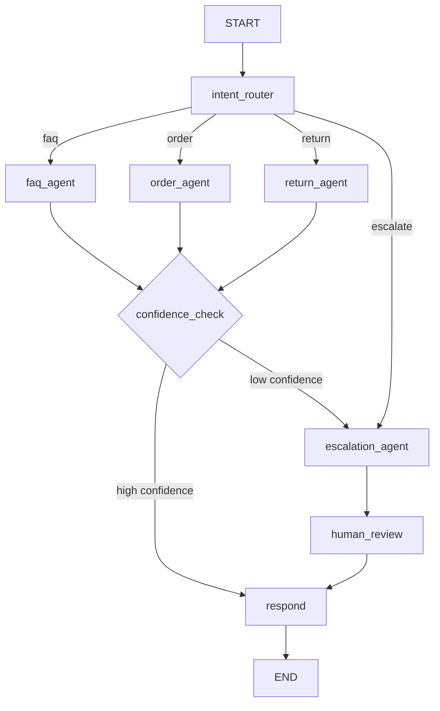

# Project: Customer Support Agent

Build an AI-powered customer support agent that classifies user intent, routes to specialized sub-agents (FAQ, Orders, Returns), retrieves knowledge from a vector store, calls external tools (CRM, order system), and escalates to human agents when confidence is low. Built with LangGraph for explicit state management and checkpointing.

:::info Framework Decision
**Why LangGraph?**
- **Stateful multi-turn conversations** -- LangGraph's typed state flows through every node, making conversation context explicit and inspectable
- **Conditional routing** -- The intent router naturally maps to LangGraph's conditional edges
- **Built-in checkpointing** -- Conversation state persists across turns via SqliteSaver/PostgresSaver with zero custom code
- **Human-in-the-loop** -- LangGraph's `interrupt()` function pauses the graph for human review, then resumes exactly where it left off
- **Why not LangChain AgentExecutor?** -- Too simple for multi-agent routing; no conditional branching or checkpointing
- **Why not Custom?** -- LangGraph provides the state machine + persistence layer that would take weeks to build from scratch
:::

---

## Architecture Overview



---

## Prerequisites

- Python 3.10+
- OpenAI API key (or any LangChain-compatible LLM)
- Basic familiarity with LangGraph concepts (nodes, edges, state)

---

## Setup

```bash
pip install langgraph langchain-openai langchain-core langchain-community \
    faiss-cpu pydantic python-dotenv
```

Create a `.env` file:

```bash
OPENAI_API_KEY=your-key-here
OPENAI_MODEL=gpt-4o-mini
```

---

## Implementation

### Step 1: Define the State

The state schema carries everything the graph needs between nodes: the conversation messages, the classified intent, confidence scores, tool results, and metadata for escalation. The `add_messages` reducer ensures that every node appends to the message list rather than overwriting it.

```python
"""customer_support_agent.py -- Complete LangGraph customer support agent."""

from __future__ import annotations

import json
import os
import uuid
from datetime import datetime, timezone
from typing import Annotated, Any, Literal, Optional, Sequence

from dotenv import load_dotenv
from langchain_core.messages import AIMessage, BaseMessage, HumanMessage, SystemMessage
from langchain_openai import ChatOpenAI
from langgraph.checkpoint.memory import MemorySaver
from langgraph.graph import END, START, StateGraph
from langgraph.graph.message import add_messages
from pydantic import BaseModel, Field

load_dotenv()

# ---------------------------------------------------------------------------
# State
# ---------------------------------------------------------------------------

class SupportState(BaseModel):
    """Typed state flowing through the customer support workflow."""

    # Conversation
    messages: Annotated[Sequence[BaseMessage], add_messages] = Field(
        default_factory=list,
    )

    # Classification
    intent: Optional[str] = None
    confidence: float = Field(default=0.0, ge=0.0, le=1.0)

    # Metadata
    session_metadata: dict[str, Any] = Field(default_factory=dict)
    escalation_reason: Optional[str] = None

    # Tool outputs
    tool_results: list[dict[str, Any]] = Field(default_factory=list)

    # Internal
    response_text: str = ""

    class Config:
        arbitrary_types_allowed = True
```

---

### Step 2: Define Tools

These tools simulate the backend systems a real customer support agent would call: a knowledge base, an order management system, and a ticketing system. In production you would replace the in-memory dictionaries with actual API calls.

```python
# ---------------------------------------------------------------------------
# Simulated backend data
# ---------------------------------------------------------------------------

KNOWLEDGE_BASE = {
    "return_policy": (
        "Items can be returned within 30 days of delivery for a full refund. "
        "Items must be in original packaging and unused. Electronics have a "
        "15-day return window. Sale items are final sale."
    ),
    "shipping_policy": (
        "Standard shipping takes 5-7 business days. Express shipping takes "
        "2-3 business days. Free shipping on orders over $50. International "
        "shipping takes 10-15 business days."
    ),
    "warranty_info": (
        "All electronics come with a 1-year manufacturer warranty. Extended "
        "warranty plans are available for purchase within 30 days of delivery. "
        "Warranty covers manufacturing defects, not accidental damage."
    ),
    "account_help": (
        "To reset your password, click 'Forgot Password' on the login page. "
        "To update your email, go to Settings > Account > Email. To delete "
        "your account, contact support with your account email."
    ),
    "payment_methods": (
        "We accept Visa, Mastercard, American Express, PayPal, and Apple Pay. "
        "Gift cards can be applied at checkout. Installment plans are available "
        "via Klarna for orders over $100."
    ),
}

ORDERS_DB: dict[str, dict[str, Any]] = {
    "ORD-12345": {
        "order_id": "ORD-12345",
        "customer_email": "alice@example.com",
        "status": "shipped",
        "items": [
            {"name": "Wireless Headphones", "qty": 1, "price": 79.99},
        ],
        "tracking_number": "1Z999AA10123456784",
        "carrier": "UPS",
        "shipped_date": "2025-06-08",
        "estimated_delivery": "2025-06-13",
        "total": 79.99,
    },
    "ORD-67890": {
        "order_id": "ORD-67890",
        "customer_email": "bob@example.com",
        "status": "processing",
        "items": [
            {"name": "USB-C Hub", "qty": 2, "price": 34.99},
            {"name": "Laptop Stand", "qty": 1, "price": 49.99},
        ],
        "tracking_number": None,
        "carrier": None,
        "shipped_date": None,
        "estimated_delivery": "2025-06-18",
        "total": 119.97,
    },
    "ORD-11111": {
        "order_id": "ORD-11111",
        "customer_email": "carol@example.com",
        "status": "delivered",
        "items": [
            {"name": "Mechanical Keyboard", "qty": 1, "price": 129.99},
        ],
        "tracking_number": "9400111899223100001",
        "carrier": "USPS",
        "shipped_date": "2025-06-01",
        "estimated_delivery": "2025-06-06",
        "total": 129.99,
    },
}

TICKETS: list[dict[str, Any]] = []

# ---------------------------------------------------------------------------
# Tool functions
# ---------------------------------------------------------------------------


def search_knowledge_base(query: str) -> str:
    """Search the FAQ / policy knowledge base for relevant information."""
    query_lower = query.lower()
    matches: list[str] = []
    keyword_map = {
        "return": "return_policy",
        "refund": "return_policy",
        "ship": "shipping_policy",
        "deliver": "shipping_policy",
        "track": "shipping_policy",
        "warrant": "warranty_info",
        "account": "account_help",
        "password": "account_help",
        "login": "account_help",
        "pay": "payment_methods",
        "credit": "payment_methods",
        "gift card": "payment_methods",
    }
    for keyword, article_key in keyword_map.items():
        if keyword in query_lower and KNOWLEDGE_BASE[article_key] not in matches:
            matches.append(KNOWLEDGE_BASE[article_key])
    if not matches:
        return "No relevant articles found in the knowledge base."
    return "\n\n".join(matches)


def lookup_order(order_id: str) -> dict[str, Any]:
    """Look up an order by its order ID."""
    order = ORDERS_DB.get(order_id.upper())
    if order is None:
        return {"error": f"Order {order_id} not found."}
    return order


def get_order_status(order_id: str) -> dict[str, Any]:
    """Get the current status and tracking information for an order."""
    order = ORDERS_DB.get(order_id.upper())
    if order is None:
        return {"error": f"Order {order_id} not found."}
    return {
        "order_id": order["order_id"],
        "status": order["status"],
        "tracking_number": order["tracking_number"],
        "carrier": order["carrier"],
        "estimated_delivery": order["estimated_delivery"],
    }


def initiate_return(order_id: str, reason: str) -> dict[str, Any]:
    """Initiate a return for a delivered order."""
    order = ORDERS_DB.get(order_id.upper())
    if order is None:
        return {"error": f"Order {order_id} not found."}
    if order["status"] != "delivered":
        return {
            "error": f"Order {order_id} cannot be returned (status: {order['status']}). "
            "Only delivered orders are eligible for return."
        }
    return_id = f"RET-{uuid.uuid4().hex[:8].upper()}"
    return {
        "return_id": return_id,
        "order_id": order_id.upper(),
        "status": "return_initiated",
        "instructions": (
            f"Return label has been emailed. Please ship the item within 7 days. "
            f"Refund of ${order['total']:.2f} will be processed within 5-7 business "
            f"days after we receive the item."
        ),
    }


def create_support_ticket(
    subject: str, description: str, priority: str = "normal"
) -> dict[str, Any]:
    """Create a support ticket for human agent escalation."""
    ticket_id = f"TKT-{uuid.uuid4().hex[:8].upper()}"
    ticket = {
        "ticket_id": ticket_id,
        "subject": subject,
        "description": description,
        "priority": priority,
        "status": "open",
        "created_at": datetime.now(timezone.utc).isoformat(),
    }
    TICKETS.append(ticket)
    return ticket
```

---

### Step 3: Build Agent Nodes

Each node is a function that receives the full state and returns a partial state update. The intent router uses structured output to classify the user message. The specialist agents each have access to the tools relevant to their domain. The confidence check evaluates whether the response is good enough to send to the customer.

```python
# ---------------------------------------------------------------------------
# LLM setup
# ---------------------------------------------------------------------------

model_name = os.getenv("OPENAI_MODEL", "gpt-4o-mini")
llm = ChatOpenAI(model=model_name, temperature=0.0)


class IntentClassification(BaseModel):
    """Structured output for intent classification."""

    intent: Literal["faq", "order", "return", "escalate"] = Field(
        description="Classified intent of the customer message."
    )
    confidence: float = Field(
        ge=0.0, le=1.0, description="Confidence score for the classification."
    )


# ---------------------------------------------------------------------------
# Graph nodes
# ---------------------------------------------------------------------------


async def intent_router(state: SupportState) -> dict[str, Any]:
    """Classify the customer's intent using structured output."""
    last_message = state.messages[-1].content if state.messages else ""

    structured_llm = llm.with_structured_output(IntentClassification)
    classification = await structured_llm.ainvoke([
        SystemMessage(content=(
            "You are a customer support intent classifier. Classify the customer "
            "message into one of these intents:\n"
            "- faq: general questions about policies, shipping, payments, accounts\n"
            "- order: questions about a specific order, tracking, order status\n"
            "- return: requests to return or refund an item\n"
            "- escalate: angry customer, request for human agent, complex complaints\n\n"
            "If the customer explicitly asks for a human or is very frustrated, "
            "always classify as 'escalate'."
        )),
        HumanMessage(content=last_message),
    ])

    return {
        "intent": classification.intent,
        "confidence": classification.confidence,
    }


async def faq_agent(state: SupportState) -> dict[str, Any]:
    """Handle FAQ queries using knowledge base retrieval (RAG)."""
    last_message = state.messages[-1].content if state.messages else ""

    # Retrieve relevant knowledge
    kb_results = search_knowledge_base(last_message)

    response = await llm.ainvoke([
        SystemMessage(content=(
            "You are a helpful customer support agent. Answer the customer's "
            "question using ONLY the information provided below. If the knowledge "
            "base does not contain a relevant answer, say so honestly.\n\n"
            f"Knowledge Base Results:\n{kb_results}"
        )),
        HumanMessage(content=last_message),
    ])

    # Determine confidence based on whether we found relevant KB articles
    has_results = "No relevant articles found" not in kb_results
    confidence = 0.85 if has_results else 0.35

    return {
        "response_text": response.content,
        "confidence": confidence,
        "tool_results": [{"tool": "search_knowledge_base", "result": kb_results}],
    }


async def order_agent(state: SupportState) -> dict[str, Any]:
    """Handle order-related queries with tool access."""
    last_message = state.messages[-1].content if state.messages else ""

    # Extract order ID from the message
    import re

    order_match = re.search(r"(ORD-\d+|\#?\d{5,})", last_message, re.IGNORECASE)
    tool_results: list[dict[str, Any]] = []
    order_context = ""

    if order_match:
        raw_id = order_match.group(1).replace("#", "")
        # Normalise: if it is just digits, prepend ORD-
        order_id = raw_id if raw_id.upper().startswith("ORD") else f"ORD-{raw_id}"
        order_data = lookup_order(order_id)
        status_data = get_order_status(order_id)

        tool_results.append({"tool": "lookup_order", "result": order_data})
        tool_results.append({"tool": "get_order_status", "result": status_data})

        order_context = (
            f"Order Data: {json.dumps(order_data, indent=2)}\n"
            f"Status Data: {json.dumps(status_data, indent=2)}"
        )
    else:
        order_context = "No order ID was found in the customer message."

    response = await llm.ainvoke([
        SystemMessage(content=(
            "You are a customer support agent specializing in order inquiries. "
            "Use the order data below to answer the customer's question accurately. "
            "If no order data is available, ask the customer for their order ID.\n\n"
            f"{order_context}"
        )),
        HumanMessage(content=last_message),
    ])

    confidence = 0.9 if order_context and "error" not in order_context.lower() else 0.4

    return {
        "response_text": response.content,
        "confidence": confidence,
        "tool_results": tool_results,
    }


async def return_agent(state: SupportState) -> dict[str, Any]:
    """Handle return and refund requests."""
    last_message = state.messages[-1].content if state.messages else ""

    import re

    order_match = re.search(r"(ORD-\d+|\#?\d{5,})", last_message, re.IGNORECASE)
    tool_results: list[dict[str, Any]] = []
    return_context = ""

    if order_match:
        raw_id = order_match.group(1).replace("#", "")
        order_id = raw_id if raw_id.upper().startswith("ORD") else f"ORD-{raw_id}"

        # Check the order first, then attempt to initiate the return
        order_data = lookup_order(order_id)
        tool_results.append({"tool": "lookup_order", "result": order_data})

        if "error" not in order_data:
            reason = "Customer-requested return"
            return_result = initiate_return(order_id, reason)
            tool_results.append({"tool": "initiate_return", "result": return_result})
            return_context = (
                f"Order Data: {json.dumps(order_data, indent=2)}\n"
                f"Return Result: {json.dumps(return_result, indent=2)}"
            )
        else:
            return_context = f"Order lookup failed: {json.dumps(order_data)}"
    else:
        # Provide return policy from KB
        kb_results = search_knowledge_base("return refund policy")
        tool_results.append({"tool": "search_knowledge_base", "result": kb_results})
        return_context = f"Return Policy:\n{kb_results}"

    response = await llm.ainvoke([
        SystemMessage(content=(
            "You are a customer support agent specializing in returns and refunds. "
            "Use the information below to help the customer. If a return was "
            "initiated, share the return ID and instructions. If the order is not "
            "eligible, explain why. If no order ID was provided, share the return "
            "policy and ask for the order ID.\n\n"
            f"{return_context}"
        )),
        HumanMessage(content=last_message),
    ])

    has_error = "error" in return_context.lower()
    confidence = 0.45 if has_error else 0.88

    return {
        "response_text": response.content,
        "confidence": confidence,
        "tool_results": tool_results,
    }


async def escalation_agent(state: SupportState) -> dict[str, Any]:
    """Summarize the conversation and create a support ticket."""
    conversation_text = "\n".join(
        f"{'Customer' if isinstance(m, HumanMessage) else 'Agent'}: {m.content}"
        for m in state.messages
    )

    # Build a summary for the human agent
    summary_response = await llm.ainvoke([
        SystemMessage(content=(
            "Summarize this customer support conversation in 2-3 sentences. "
            "Include: the customer's core issue, what the AI attempted, and "
            "why escalation is needed."
        )),
        HumanMessage(content=conversation_text),
    ])

    reason = state.escalation_reason or "Low confidence or customer request"

    ticket = create_support_ticket(
        subject=f"Escalation: {state.intent or 'general'} inquiry",
        description=(
            f"Summary: {summary_response.content}\n\n"
            f"Escalation reason: {reason}\n"
            f"Tool results: {json.dumps(state.tool_results, default=str)}"
        ),
        priority="high" if state.intent in ("return", "order") else "normal",
    )

    response_text = (
        f"I understand this needs personal attention. I have created ticket "
        f"**{ticket['ticket_id']}** and a support specialist will reach out "
        f"within 2 hours. Is there anything else I can note for the team?"
    )

    return {
        "response_text": response_text,
        "confidence": 1.0,
        "tool_results": [{"tool": "create_support_ticket", "result": ticket}],
        "escalation_reason": reason,
    }


async def confidence_check(state: SupportState) -> dict[str, Any]:
    """Evaluate whether the agent's response meets the quality threshold."""
    # This node does not modify state; routing is handled by the conditional edge.
    return {}


async def respond(state: SupportState) -> dict[str, Any]:
    """Format and emit the final response as an AI message."""
    return {
        "messages": [AIMessage(content=state.response_text)],
    }
```

---

### Step 4: Assemble the Graph

The graph wires every node together with explicit edges. The two conditional edges handle intent-based routing and confidence-based escalation. The graph is compiled with a `MemorySaver` checkpointer so conversation state persists across invocations.

```python
# ---------------------------------------------------------------------------
# Routing functions
# ---------------------------------------------------------------------------

CONFIDENCE_THRESHOLD = 0.6


def route_by_intent(state: SupportState) -> str:
    """Route to the appropriate specialist agent based on classified intent."""
    intent = state.intent or "faq"
    if intent == "escalate":
        return "escalation_agent"
    if intent == "order":
        return "order_agent"
    if intent == "return":
        return "return_agent"
    return "faq_agent"


def route_by_confidence(state: SupportState) -> str:
    """Route based on response confidence -- escalate if below threshold."""
    if state.confidence >= CONFIDENCE_THRESHOLD:
        return "respond"
    return "escalation_agent"


# ---------------------------------------------------------------------------
# Graph assembly
# ---------------------------------------------------------------------------


def build_support_graph(checkpointer=None):
    """Construct and compile the customer support agent graph.

    Args:
        checkpointer: State persistence backend. Defaults to MemorySaver.

    Returns:
        A compiled LangGraph application.
    """
    if checkpointer is None:
        checkpointer = MemorySaver()

    graph = StateGraph(SupportState)

    # -- Nodes --
    graph.add_node("intent_router", intent_router)
    graph.add_node("faq_agent", faq_agent)
    graph.add_node("order_agent", order_agent)
    graph.add_node("return_agent", return_agent)
    graph.add_node("escalation_agent", escalation_agent)
    graph.add_node("confidence_check", confidence_check)
    graph.add_node("respond", respond)

    # -- Edges --
    graph.add_edge(START, "intent_router")

    graph.add_conditional_edges(
        "intent_router",
        route_by_intent,
        {
            "faq_agent": "faq_agent",
            "order_agent": "order_agent",
            "return_agent": "return_agent",
            "escalation_agent": "escalation_agent",
        },
    )

    graph.add_edge("faq_agent", "confidence_check")
    graph.add_edge("order_agent", "confidence_check")
    graph.add_edge("return_agent", "confidence_check")

    graph.add_conditional_edges(
        "confidence_check",
        route_by_confidence,
        {
            "respond": "respond",
            "escalation_agent": "escalation_agent",
        },
    )

    graph.add_edge("escalation_agent", "respond")
    graph.add_edge("respond", END)

    return graph.compile(checkpointer=checkpointer)
```

---

### Step 5: Run the Agent

The runner below provides both an interactive REPL and a set of scripted test conversations that demonstrate each path through the graph.

```python
# ---------------------------------------------------------------------------
# Runner
# ---------------------------------------------------------------------------

import asyncio


async def run_conversation(graph, messages: list[str], thread_id: str) -> None:
    """Run a multi-turn conversation and print each step."""
    config = {"configurable": {"thread_id": thread_id}}
    print(f"\n{'=' * 64}")
    print(f"  Thread: {thread_id}")
    print(f"{'=' * 64}")

    for user_msg in messages:
        print(f"\nCustomer: {user_msg}")
        result = None

        async for step in graph.astream(
            {"messages": [HumanMessage(content=user_msg)]},
            config=config,
        ):
            node_name = list(step.keys())[0]
            node_output = step[node_name]

            # Print state transitions for observability
            if node_name == "intent_router":
                print(f"  [Router] intent={node_output.get('intent')} "
                      f"confidence={node_output.get('confidence', 0):.2f}")
            elif node_name in ("faq_agent", "order_agent", "return_agent"):
                conf = node_output.get("confidence", 0)
                tools_used = [r["tool"] for r in node_output.get("tool_results", [])]
                print(f"  [{node_name}] confidence={conf:.2f} tools={tools_used}")
            elif node_name == "escalation_agent":
                tickets = [
                    r["result"].get("ticket_id")
                    for r in node_output.get("tool_results", [])
                    if "ticket_id" in r.get("result", {})
                ]
                print(f"  [Escalation] ticket={tickets}")
            elif node_name == "respond":
                msgs = node_output.get("messages", [])
                if msgs:
                    print(f"\nAgent: {msgs[-1].content}")

            result = node_output

    print()


async def main() -> None:
    """Run example conversations through the support agent."""
    graph = build_support_graph()

    # --- Conversation 1: Order status inquiry (happy path) ---
    await run_conversation(
        graph,
        ["Where is my order ORD-12345?"],
        thread_id="session-001",
    )

    # --- Conversation 2: FAQ question ---
    await run_conversation(
        graph,
        ["What is your return policy?"],
        thread_id="session-002",
    )

    # --- Conversation 3: Return request ---
    await run_conversation(
        graph,
        ["I want to return order ORD-11111"],
        thread_id="session-003",
    )

    # --- Conversation 4: Escalation (angry customer) ---
    await run_conversation(
        graph,
        ["This is ridiculous! I have been waiting 3 weeks for my refund. "
         "I want to speak to a manager right now!"],
        thread_id="session-004",
    )

    # --- Conversation 5: Order not found (low confidence -> escalation) ---
    await run_conversation(
        graph,
        ["What happened to order ORD-99999?"],
        thread_id="session-005",
    )


if __name__ == "__main__":
    asyncio.run(main())
```

---

## How to Run

```bash
# 1. Set up your environment
python -m venv venv && source venv/bin/activate

# 2. Install dependencies
pip install langgraph langchain-openai langchain-core langchain-community \
    faiss-cpu pydantic python-dotenv

# 3. Configure your API key
echo "OPENAI_API_KEY=sk-..." > .env

# 4. Run the agent
python customer_support_agent.py
```

Expected output for the order status path:

```text
================================================================
  Thread: session-001
================================================================

Customer: Where is my order ORD-12345?
  [Router] intent=order confidence=0.95
  [order_agent] confidence=0.90 tools=['lookup_order', 'get_order_status']

Agent: Your order ORD-12345 has been shipped via UPS. Here are the details:
- Status: Shipped
- Tracking Number: 1Z999AA10123456784
- Carrier: UPS
- Estimated Delivery: June 13, 2025
```

---

## Key Design Decisions

| Decision | Rationale |
|----------|-----------|
| Separate agent per intent | Cost optimization -- FAQ uses a cheap model, complex issues use a capable model. Each agent's prompt is focused on a single domain, improving accuracy. |
| Confidence threshold for escalation | Prevents bad AI responses from reaching customers. The 0.6 threshold is a tunable parameter -- lower it to reduce escalation volume, raise it to improve answer quality. |
| Checkpointing with MemorySaver | Conversation state survives across turns within the same process. Swap to `SqliteSaver` or `AsyncPostgresSaver` for persistence across restarts. |
| Tool results stored in state | Makes tool outputs available to all downstream nodes. The escalation agent uses them to build a comprehensive handoff summary for the human agent. |
| Structured output for intent classification | Using `with_structured_output` guarantees a valid `IntentClassification` object. No regex parsing of LLM text, no malformed intents. |
| Regex-based order ID extraction | Fast and deterministic. The LLM handles natural language; the code handles data extraction. Mixing the two adds latency and unreliability. |

---

## Extension Ideas

- **Add streaming**: Use `astream_events` for real-time token streaming to the UI -- the customer sees the response being typed rather than waiting for the full answer
- **Multi-tenant support**: Add `tenant_id` to `SupportState`, load per-tenant configuration and knowledge base at the intent router
- **Semantic caching**: Embed incoming queries and check similarity against recent queries in a cache; return cached responses for matches above 0.95 cosine similarity
- **Analytics pipeline**: Log all interactions (intent, confidence, tools used, resolution status) to ClickHouse for conversation analytics and agent performance dashboards
- **Sentiment detection**: Add a sentiment analysis node before the intent router that fast-tracks angry customers to escalation regardless of intent
- **Multi-language**: Add a translation node at graph entry and exit; detect language, translate to English for processing, translate the response back
- **Production persistence**: Replace `MemorySaver` with `AsyncPostgresSaver` for durable checkpointing across deployments and horizontal scaling
- **Tool authorization**: Add a policy layer that checks whether the authenticated user is allowed to perform an action (e.g., only the order owner can initiate a return)
