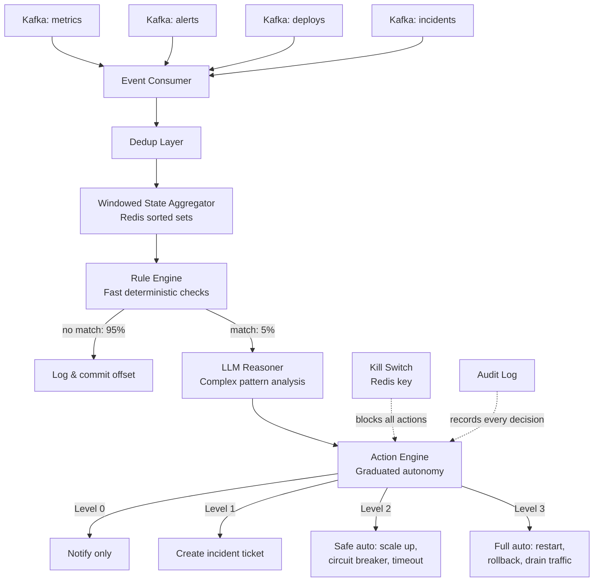

# Project: Real-Time Event-Driven Agent

Build a real-time event-driven agent that consumes streaming infrastructure events from Kafka, maintains running service state in Redis, detects anomalies through a two-tier system of deterministic rules and LLM-powered reasoning, and takes automated remediation actions with graduated safety guardrails. Think: an intelligent incident responder that watches your infrastructure, understands what is happening across services, and can act on your behalf -- within boundaries you control.

This is a Staff/Principal-level project because it combines three genuinely hard problems: stream processing with exactly-once semantics, stateful reasoning over sliding time windows, and safe autonomous action in production systems.

:::info Framework Decision
**Why Custom Async Python with aiokafka + Redis + Direct LLM Calls?**
- **Why not LangGraph?** -- LangGraph is designed for request-response agent loops: a user sends a message, the graph processes it, the graph responds. This agent has no request-response cycle. It runs continuously, consuming an unbounded stream of events. LangGraph's state machine model does not map to "process 10,000 events per minute indefinitely."
- **Why not Apache Flink or Spark Streaming?** -- Flink and Spark are designed for map/reduce/window operations over streams. We need to invoke an LLM with full service context when anomalies are detected. An LLM call that takes 2-5 seconds and returns unstructured reasoning does not fit the stateless-function-per-event model. The hybrid approach uses traditional stream processing patterns (sliding windows, dedup) for state maintenance and LLM reasoning only when the rule engine flags something interesting.
- **Why aiokafka?** -- Native async/await integration with Python's asyncio event loop. The agent needs to consume events, query Redis, call the LLM, and execute remediation actions concurrently. Synchronous Kafka consumers would block the entire pipeline during LLM calls.
- **Why Redis for state?** -- Sorted sets give O(log N) insert and range queries with automatic ordering by timestamp. `ZREMRANGEBYSCORE` handles window cleanup in a single atomic operation. Redis is also the simplest shared state store when running multiple agent instances.
:::

---

## Architecture Overview



---

## Prerequisites

- Python 3.10+
- Apache Kafka (or Redpanda) running locally or remotely
- Redis 7+
- OpenAI API key (or any OpenAI-compatible endpoint)

---

## Setup

```bash
pip install aiokafka redis[hiredis] openai pydantic python-dotenv structlog
```

`.env`:
```bash
OPENAI_API_KEY=your-key
KAFKA_BOOTSTRAP_SERVERS=localhost:9092
REDIS_URL=redis://localhost:6379/0
```

---

## Implementation

### Step 1: Event Schema and Consumer

The event schema defines a typed contract for every event the system processes. The consumer uses Kafka consumer groups with manual offset commits to guarantee at-least-once delivery, paired with an idempotency layer for effective exactly-once processing.

```python
"""event_agent.py -- Complete real-time event-driven agent."""

from __future__ import annotations

import asyncio
import hashlib
import json
import os
import signal
import time
from dataclasses import dataclass, field
from datetime import datetime, timedelta, timezone
from enum import Enum
from typing import Any, Optional

import redis.asyncio as aioredis
import structlog
from aiokafka import AIOKafkaConsumer
from dotenv import load_dotenv
from openai import AsyncOpenAI
from pydantic import BaseModel, Field

load_dotenv()

logger = structlog.get_logger()

# ---------------------------------------------------------------------------
# Configuration
# ---------------------------------------------------------------------------

KAFKA_BOOTSTRAP = os.getenv("KAFKA_BOOTSTRAP_SERVERS", "localhost:9092")
KAFKA_GROUP_ID = os.getenv("KAFKA_GROUP_ID", "event-agent-v1")
KAFKA_TOPICS = ["infra.metrics", "infra.alerts", "infra.deploys", "infra.incidents"]
REDIS_URL = os.getenv("REDIS_URL", "redis://localhost:6379/0")
OPENAI_MODEL = os.getenv("OPENAI_MODEL", "gpt-4o")
LLM_CONFIDENCE_THRESHOLD = 0.7
LLM_HOURLY_BUDGET_USD = float(os.getenv("LLM_HOURLY_BUDGET_USD", "50.0"))


# ---------------------------------------------------------------------------
# Step 1: Event Schema & Consumer
# ---------------------------------------------------------------------------


class EventType(str, Enum):
    """Categories of infrastructure events the agent processes."""
    METRIC = "metric"            # CPU, memory, latency, error_rate
    ALERT = "alert"              # PagerDuty / OpsGenie alerts
    DEPLOY = "deploy"            # Deployment lifecycle events
    INCIDENT = "incident"        # Incident creation, update, resolution
    LOG_ANOMALY = "log_anomaly"  # Unusual log patterns detected upstream


class Severity(str, Enum):
    INFO = "info"
    WARNING = "warning"
    CRITICAL = "critical"


class Event(BaseModel):
    """Canonical event schema for all infrastructure events.

    Every event source (Prometheus, PagerDuty, ArgoCD, etc.) is normalized
    into this schema by lightweight adapters before hitting Kafka.
    """
    event_id: str
    event_type: EventType
    source: str                  # service name, e.g. "api-gateway"
    timestamp: datetime
    payload: dict[str, Any]      # type-specific data
    severity: Severity = Severity.INFO
    tags: dict[str, str] = Field(default_factory=dict)

    def json_compact(self) -> str:
        """Compact JSON for Redis storage (no whitespace)."""
        return self.model_dump_json()


class EventConsumer:
    """Kafka consumer with manual offset commits for at-least-once delivery.

    Why manual commits (not auto-commit):
    Auto-commit commits offsets on a timer regardless of whether processing
    succeeded. If the consumer crashes between an auto-commit and actual
    processing, events are silently lost. Manual commit after successful
    processing guarantees at-least-once delivery. The IdempotencyGuard
    (Step 1b) then deduplicates to achieve effective exactly-once semantics.

    Why a consumer group:
    Multiple agent instances share the same group ID. Kafka assigns each
    partition to exactly one instance, so events are processed once even
    when scaling horizontally. Rebalancing on instance failure is automatic.
    """

    def __init__(self, topics: list[str], bootstrap_servers: str,
                 group_id: str) -> None:
        self._topics = topics
        self._bootstrap = bootstrap_servers
        self._group_id = group_id
        self._consumer: Optional[AIOKafkaConsumer] = None

    async def start(self) -> None:
        self._consumer = AIOKafkaConsumer(
            *self._topics,
            bootstrap_servers=self._bootstrap,
            group_id=self._group_id,
            enable_auto_commit=False,
            auto_offset_reset="latest",
            value_deserializer=lambda v: json.loads(v.decode("utf-8")),
        )
        await self._consumer.start()
        logger.info("consumer_started", topics=self._topics, group=self._group_id)

    async def stop(self) -> None:
        if self._consumer:
            await self._consumer.stop()
            logger.info("consumer_stopped")

    async def consume(self):
        """Yield deserialized Event objects. Caller must commit offsets."""
        async for msg in self._consumer:
            try:
                event = Event(**msg.value)
                yield event, msg
            except Exception as exc:
                logger.error("event_parse_failed", error=str(exc),
                             topic=msg.topic, offset=msg.offset)
                # Commit the bad message so we don't get stuck in a loop
                await self._consumer.commit()

    async def commit(self) -> None:
        """Commit current offsets after successful processing."""
        await self._consumer.commit()


class IdempotencyGuard:
    """Deduplicates events using Redis SET with TTL.

    The combination of at-least-once Kafka delivery + this idempotency
    layer achieves effective exactly-once processing. Each event_id is
    stored in Redis with a 24-hour TTL. If the same event_id arrives
    again (due to Kafka redelivery after a crash), it is skipped.

    Why 24-hour TTL: events older than 24 hours will never be redelivered
    by Kafka given our consumer lag monitoring. The TTL prevents unbounded
    Redis memory growth.
    """

    def __init__(self, redis_client: aioredis.Redis, ttl_seconds: int = 86400):
        self._redis = redis_client
        self._ttl = ttl_seconds

    async def is_duplicate(self, event_id: str) -> bool:
        """Return True if this event has already been processed."""
        key = f"dedup:{event_id}"
        exists = await self._redis.exists(key)
        return bool(exists)

    async def mark_processed(self, event_id: str) -> None:
        """Record that this event has been successfully processed."""
        key = f"dedup:{event_id}"
        await self._redis.set(key, "1", ex=self._ttl)
```

---

### Step 2: Sliding Window State Aggregator

The aggregator maintains per-service state using Redis sorted sets. Instead of sending every raw event to the LLM (expensive and noisy), events are aggregated into service-level state windows. The LLM is only invoked when the aggregated state becomes interesting.

```python
# ---------------------------------------------------------------------------
# Step 2: Sliding Window State Aggregator
# ---------------------------------------------------------------------------


@dataclass
class MetricSummary:
    """Statistical summary of a metric over a time window."""
    name: str
    current: float
    mean: float
    p99: float
    min_val: float
    max_val: float
    sample_count: int
    trend: str  # "stable", "increasing", "decreasing", "spike"


@dataclass
class ServiceState:
    """Complete picture of a service's current operational state.

    This is the primary input to both the rule engine and the LLM reasoner.
    It collapses hundreds of individual events into a structured snapshot
    that fits within an LLM context window.
    """
    service: str
    timestamp: datetime
    metric_summaries: list[MetricSummary] = field(default_factory=list)
    active_alerts: list[dict[str, Any]] = field(default_factory=list)
    recent_deploys: list[dict[str, Any]] = field(default_factory=list)
    active_incidents: list[dict[str, Any]] = field(default_factory=list)
    log_anomalies: list[dict[str, Any]] = field(default_factory=list)
    error_rate_current: float = 0.0
    error_rate_baseline: float = 0.0
    latency_p99_current: float = 0.0
    latency_p99_baseline: float = 0.0
    memory_usage_pct: float = 0.0
    cpu_usage_pct: float = 0.0

    def to_prompt_text(self) -> str:
        """Format state for inclusion in an LLM prompt."""
        lines = [
            f"Service: {self.service}",
            f"Timestamp: {self.timestamp.isoformat()}",
            "",
            "== Metrics ==",
        ]
        for m in self.metric_summaries:
            lines.append(
                f"  {m.name}: current={m.current:.2f} mean={m.mean:.2f} "
                f"p99={m.p99:.2f} trend={m.trend} (n={m.sample_count})"
            )
        lines.append(f"  error_rate: {self.error_rate_current:.4f} "
                      f"(baseline: {self.error_rate_baseline:.4f})")
        lines.append(f"  latency_p99: {self.latency_p99_current:.1f}ms "
                      f"(baseline: {self.latency_p99_baseline:.1f}ms)")
        lines.append(f"  memory: {self.memory_usage_pct:.1f}%")
        lines.append(f"  cpu: {self.cpu_usage_pct:.1f}%")

        if self.active_alerts:
            lines.append(f"\n== Active Alerts ({len(self.active_alerts)}) ==")
            for a in self.active_alerts[:10]:
                lines.append(f"  - [{a.get('severity', '?')}] {a.get('title', 'unknown')}")

        if self.recent_deploys:
            lines.append(f"\n== Recent Deploys ({len(self.recent_deploys)}) ==")
            for d in self.recent_deploys[:5]:
                lines.append(f"  - {d.get('version', '?')} at {d.get('timestamp', '?')} "
                             f"by {d.get('author', '?')}")

        if self.active_incidents:
            lines.append(f"\n== Active Incidents ({len(self.active_incidents)}) ==")
            for i in self.active_incidents[:5]:
                lines.append(f"  - [{i.get('severity', '?')}] {i.get('title', 'unknown')}")

        if self.log_anomalies:
            lines.append(f"\n== Log Anomalies ({len(self.log_anomalies)}) ==")
            for la in self.log_anomalies[:5]:
                lines.append(f"  - {la.get('pattern', 'unknown')} "
                             f"(count={la.get('count', 0)})")

        return "\n".join(lines)


class WindowedStateAggregator:
    """Maintains sliding-window state per service in Redis.

    This is the bridge between raw events and LLM reasoning. Instead of
    sending every individual event to the LLM (expensive, noisy), we
    aggregate events into service-level state windows and only invoke
    the LLM when the state becomes interesting (anomaly detected by
    the rule engine).

    Window design:
    - 5-minute window for metrics (detect spikes)
    - 1-hour window for alerts (detect alert storms)
    - 24-hour window for deploys (correlate deploys with issues)
    - 1-hour window for incidents (active incident context)

    Why Redis sorted sets for time windows:
    - O(log N) insert via ZADD
    - O(log N) range query via ZRANGEBYSCORE
    - Automatic ordering by timestamp score
    - ZREMRANGEBYSCORE for window cleanup in a single atomic call
    - Shared across multiple agent instances for horizontal scaling
    """

    WINDOWS: dict[EventType, timedelta] = {
        EventType.METRIC: timedelta(minutes=5),
        EventType.ALERT: timedelta(hours=1),
        EventType.DEPLOY: timedelta(hours=24),
        EventType.INCIDENT: timedelta(hours=1),
        EventType.LOG_ANOMALY: timedelta(hours=1),
    }

    def __init__(self, redis_client: aioredis.Redis) -> None:
        self._redis = redis_client

    async def add_event(self, event: Event) -> None:
        """Add an event to the appropriate service window."""
        key = f"events:{event.source}:{event.event_type.value}"
        score = event.timestamp.timestamp()

        # ZADD with the event JSON as the member and timestamp as score
        await self._redis.zadd(key, {event.json_compact(): score})

        # Trim events outside the window
        window = self.WINDOWS[event.event_type]
        cutoff = (datetime.now(timezone.utc) - window).timestamp()
        await self._redis.zremrangebyscore(key, "-inf", cutoff)

        # Set a TTL on the key slightly longer than the window
        # so abandoned keys don't leak memory
        ttl_seconds = int(window.total_seconds() * 1.5)
        await self._redis.expire(key, ttl_seconds)

    async def get_service_state(self, service: str) -> ServiceState:
        """Build a complete snapshot of a service's current state."""
        metrics = await self._get_window_events(service, EventType.METRIC)
        alerts = await self._get_window_events(service, EventType.ALERT)
        deploys = await self._get_window_events(service, EventType.DEPLOY)
        incidents = await self._get_window_events(service, EventType.INCIDENT)
        log_anomalies = await self._get_window_events(service, EventType.LOG_ANOMALY)

        return ServiceState(
            service=service,
            timestamp=datetime.now(timezone.utc),
            metric_summaries=self._summarize_metrics(metrics),
            active_alerts=[e.payload for e in alerts],
            recent_deploys=[e.payload for e in deploys],
            active_incidents=[e.payload for e in incidents],
            log_anomalies=[e.payload for e in log_anomalies],
            error_rate_current=self._latest_metric(metrics, "error_rate"),
            error_rate_baseline=self._baseline_metric(metrics, "error_rate"),
            latency_p99_current=self._latest_metric(metrics, "latency_p99"),
            latency_p99_baseline=self._baseline_metric(metrics, "latency_p99"),
            memory_usage_pct=self._latest_metric(metrics, "memory_usage_pct"),
            cpu_usage_pct=self._latest_metric(metrics, "cpu_usage_pct"),
        )

    async def _get_window_events(self, service: str,
                                  event_type: EventType) -> list[Event]:
        """Retrieve all events in the current window for a service."""
        key = f"events:{service}:{event_type.value}"
        window = self.WINDOWS[event_type]
        cutoff = (datetime.now(timezone.utc) - window).timestamp()

        raw_events = await self._redis.zrangebyscore(key, cutoff, "+inf")
        events = []
        for raw in raw_events:
            try:
                events.append(Event.model_validate_json(raw))
            except Exception:
                continue
        return events

    def _summarize_metrics(self, metrics: list[Event]) -> list[MetricSummary]:
        """Compute statistical summaries grouped by metric name."""
        from collections import defaultdict
        import statistics

        grouped: dict[str, list[float]] = defaultdict(list)
        for event in metrics:
            for metric_name, value in event.payload.items():
                if isinstance(value, (int, float)):
                    grouped[metric_name].append(float(value))

        summaries = []
        for name, values in grouped.items():
            if not values:
                continue
            sorted_vals = sorted(values)
            p99_idx = max(0, int(len(sorted_vals) * 0.99) - 1)

            # Trend detection: compare last third to first third
            third = max(1, len(values) // 3)
            first_third_mean = statistics.mean(values[:third])
            last_third_mean = statistics.mean(values[-third:])
            ratio = last_third_mean / first_third_mean if first_third_mean > 0 else 1.0

            if ratio > 2.0:
                trend = "spike"
            elif ratio > 1.3:
                trend = "increasing"
            elif ratio < 0.7:
                trend = "decreasing"
            else:
                trend = "stable"

            summaries.append(MetricSummary(
                name=name,
                current=values[-1],
                mean=statistics.mean(values),
                p99=sorted_vals[p99_idx],
                min_val=min(values),
                max_val=max(values),
                sample_count=len(values),
                trend=trend,
            ))
        return summaries

    @staticmethod
    def _latest_metric(metrics: list[Event], name: str) -> float:
        """Get the most recent value for a named metric."""
        for event in reversed(metrics):
            if name in event.payload:
                return float(event.payload[name])
        return 0.0

    @staticmethod
    def _baseline_metric(metrics: list[Event], name: str) -> float:
        """Compute baseline as the mean of the first half of the window."""
        import statistics
        values = [float(e.payload[name]) for e in metrics if name in e.payload]
        if len(values) < 2:
            return values[0] if values else 0.0
        half = len(values) // 2
        return statistics.mean(values[:half])
```

---

### Step 3: Rule Engine (Fast, Deterministic)

The rule engine is the first-pass anomaly detector. It runs against every event's updated service state and does not require LLM calls. Its job is to filter: at 10,000 events per minute, sending every event to the LLM would cost $72,000 per month. The rule engine passes through only the 5% of events that look anomalous, reducing LLM cost to approximately $3,600 per month.

```python
# ---------------------------------------------------------------------------
# Step 3: Rule Engine (Fast, Deterministic)
# ---------------------------------------------------------------------------


@dataclass
class RuleMatch:
    """Result of a rule firing against a service state."""
    rule_name: str
    service: str
    severity: Severity
    description: str
    matched_at: datetime = field(default_factory=lambda: datetime.now(timezone.utc))


class Rule:
    """A single deterministic check against service state."""

    def __init__(self, name: str, severity: Severity, description: str,
                 check_fn) -> None:
        self.name = name
        self.severity = severity
        self.description = description
        self._check = check_fn

    def evaluate(self, state: ServiceState) -> Optional[RuleMatch]:
        try:
            if self._check(state):
                return RuleMatch(
                    rule_name=self.name,
                    service=state.service,
                    severity=self.severity,
                    description=self.description,
                )
        except Exception:
            # Rules must never crash the pipeline. A failing rule is
            # logged and skipped, not propagated.
            pass
        return None


class RuleEngine:
    """Fast, deterministic anomaly detection.

    Why rules before LLM:
    LLM calls cost $0.01-0.05 each and take 1-5 seconds. At 10,000
    events per minute, sending every event to the LLM would cost
    $6,000-30,000 per hour. The rule engine filters ~95% of events
    as normal, sending only the anomalous ~5% to the LLM. This reduces
    LLM cost by 20x.

    Rules are NECESSARY but not SUFFICIENT. They catch known patterns:
    - Error rate exceeding 2x baseline
    - Latency p99 exceeding 3x baseline
    - Deploy followed by error spike within 15 minutes
    - Three or more simultaneous alerts on a single service

    They miss unknown patterns:
    - Gradual degradation across multiple correlated services
    - Unusual combinations of individually normal-looking events
    - Context-dependent anomalies (high CPU is normal during batch jobs)

    The LLM handles what rules cannot.
    """

    def __init__(self) -> None:
        self._rules: list[Rule] = self._build_default_rules()

    @staticmethod
    def _build_default_rules() -> list[Rule]:
        return [
            Rule(
                name="error_rate_spike",
                severity=Severity.CRITICAL,
                description="Error rate exceeds 2x baseline",
                check_fn=lambda s: (
                    s.error_rate_baseline > 0 and
                    s.error_rate_current > s.error_rate_baseline * 2
                ),
            ),
            Rule(
                name="latency_spike",
                severity=Severity.WARNING,
                description="Latency p99 exceeds 3x baseline",
                check_fn=lambda s: (
                    s.latency_p99_baseline > 0 and
                    s.latency_p99_current > s.latency_p99_baseline * 3
                ),
            ),
            Rule(
                name="deploy_then_errors",
                severity=Severity.CRITICAL,
                description="Error rate increasing after recent deploy",
                check_fn=lambda s: (
                    len(s.recent_deploys) > 0 and
                    s.error_rate_current > s.error_rate_baseline * 1.5
                ),
            ),
            Rule(
                name="cascading_alerts",
                severity=Severity.CRITICAL,
                description="3+ simultaneous alerts suggest cascading failure",
                check_fn=lambda s: len(s.active_alerts) >= 3,
            ),
            Rule(
                name="memory_pressure",
                severity=Severity.WARNING,
                description="Memory usage above 90%",
                check_fn=lambda s: s.memory_usage_pct > 90,
            ),
            Rule(
                name="cpu_saturation",
                severity=Severity.WARNING,
                description="CPU usage above 95%",
                check_fn=lambda s: s.cpu_usage_pct > 95,
            ),
            Rule(
                name="alert_during_incident",
                severity=Severity.CRITICAL,
                description="New alerts firing during active incident",
                check_fn=lambda s: (
                    len(s.active_incidents) > 0 and
                    len(s.active_alerts) > 0
                ),
            ),
        ]

    def evaluate(self, state: ServiceState) -> list[RuleMatch]:
        """Run all rules against the service state. Returns matches."""
        matches = []
        for rule in self._rules:
            match = rule.evaluate(state)
            if match is not None:
                matches.append(match)
        return matches
```

---

### Step 4: LLM Reasoner (Complex Pattern Analysis)

When the rule engine flags an anomaly, the LLM analyzes the full service state, rule matches, and historical context to produce a structured analysis with root cause hypothesis, confidence score, and recommended actions. The LLM's role is strictly advisory -- it recommends actions but cannot execute them.

```python
# ---------------------------------------------------------------------------
# Step 4: LLM Reasoner (Complex Pattern Analysis)
# ---------------------------------------------------------------------------


class RecommendedAction(BaseModel):
    """A single remediation action recommended by the LLM."""
    action_type: str       # "restart_service", "scale_up", "rollback_deploy", etc.
    target: str            # service or resource name
    parameters: dict[str, Any] = Field(default_factory=dict)
    urgency: str = "medium"  # "low", "medium", "high", "critical"
    reasoning: str = ""


class Analysis(BaseModel):
    """Structured output from the LLM reasoner."""
    summary: str
    root_cause_hypothesis: str
    confidence: float = Field(ge=0.0, le=1.0)
    recommended_actions: list[RecommendedAction] = Field(default_factory=list)
    reasoning_chain: str = ""
    additional_investigation: list[str] = Field(default_factory=list)


@dataclass
class PastIncident:
    """Historical incident for context injection."""
    service: str
    timestamp: datetime
    root_cause: str
    resolution: str
    symptoms: list[str]


ANALYSIS_SYSTEM_PROMPT = """\
You are an expert Site Reliability Engineer analyzing infrastructure events.
Your role is ADVISORY ONLY. You analyze patterns and recommend actions.
You do NOT execute actions -- that is handled by a separate system with
safety guardrails.

You will receive:
1. Current service state (metrics, alerts, deploys, incidents)
2. Rule engine matches (what deterministic rules flagged)
3. Historical context (similar past incidents and their resolutions)

Your job:
- Identify the most likely root cause
- Assess confidence in your hypothesis (0.0-1.0)
- Recommend specific remediation actions from the ALLOWED ACTIONS list
- Explain your reasoning step by step

ALLOWED ACTIONS (only recommend from this list):
- notify_oncall: Page the on-call engineer
- create_incident: Create a new incident ticket
- scale_up: Increase replica count (params: target_replicas)
- enable_circuit_breaker: Activate circuit breaker on downstream calls
- increase_timeout: Increase request timeout (params: timeout_ms)
- restart_service: Rolling restart of service pods
- rollback_deploy: Revert to the previous deployment version
- drain_traffic: Gradually remove traffic from the service

CRITICAL RULES:
- NEVER recommend rollback_deploy if the last deploy is older than 24 hours
- NEVER recommend restart_service if you are not at least 0.7 confident
- ALWAYS recommend notify_oncall alongside any restart or rollback
- If unsure, recommend create_incident + notify_oncall and STOP there

Respond ONLY with valid JSON matching the Analysis schema.
"""


class LLMReasoner:
    """Uses an LLM to analyze complex event patterns and recommend actions.

    The LLM sees: service state (metrics, alerts, deploys), rule matches,
    historical context (what happened last time this pattern occurred),
    and the available remediation actions. It produces a structured analysis.

    Why not let the LLM call tools directly:
    The LLM's role is ADVISORY. It analyzes and recommends, but the Action
    Engine (Step 5) decides whether to execute. This separation is critical
    for safety. The LLM can suggest "restart the service" but cannot do it
    unilaterally. This design means a hallucinated action recommendation
    gets caught by the Action Engine's safety checks before anything happens
    in production.
    """

    def __init__(self, openai_client: AsyncOpenAI, model: str = OPENAI_MODEL):
        self._client = openai_client
        self._model = model
        self._total_cost_usd = 0.0
        self._hourly_call_count = 0
        self._hour_start = time.monotonic()

    async def analyze(self, state: ServiceState, rule_matches: list[RuleMatch],
                      historical_context: list[PastIncident]) -> Optional[Analysis]:
        """Analyze service state and return structured recommendations.

        Returns None if the hourly LLM budget has been exceeded.
        """
        # Budget enforcement: reset hourly counter if needed
        elapsed = time.monotonic() - self._hour_start
        if elapsed > 3600:
            self._hourly_call_count = 0
            self._total_cost_usd = 0.0
            self._hour_start = time.monotonic()

        if self._total_cost_usd >= LLM_HOURLY_BUDGET_USD:
            logger.warning("llm_budget_exceeded",
                           cost=self._total_cost_usd,
                           budget=LLM_HOURLY_BUDGET_USD)
            return None

        user_prompt = self._build_prompt(state, rule_matches, historical_context)

        try:
            response = await self._client.chat.completions.create(
                model=self._model,
                temperature=0.0,
                response_format={"type": "json_object"},
                messages=[
                    {"role": "system", "content": ANALYSIS_SYSTEM_PROMPT},
                    {"role": "user", "content": user_prompt},
                ],
            )

            # Track cost (approximate: $0.005/1K input, $0.015/1K output for gpt-4o)
            usage = response.usage
            if usage:
                cost = (usage.prompt_tokens * 0.005 / 1000 +
                        usage.completion_tokens * 0.015 / 1000)
                self._total_cost_usd += cost

            self._hourly_call_count += 1

            raw = response.choices[0].message.content
            analysis = Analysis.model_validate_json(raw)

            logger.info("llm_analysis_complete",
                        service=state.service,
                        confidence=analysis.confidence,
                        actions=len(analysis.recommended_actions),
                        cost_usd=f"{self._total_cost_usd:.4f}")
            return analysis

        except Exception as exc:
            logger.error("llm_analysis_failed", error=str(exc),
                         service=state.service)
            return None

    @staticmethod
    def _build_prompt(state: ServiceState, matches: list[RuleMatch],
                      history: list[PastIncident]) -> str:
        """Assemble the user prompt with all available context."""
        sections = ["== CURRENT SERVICE STATE ==", state.to_prompt_text(), ""]

        sections.append("== RULE ENGINE MATCHES ==")
        for m in matches:
            sections.append(f"  - [{m.severity.value}] {m.rule_name}: {m.description}")
        sections.append("")

        sections.append("== HISTORICAL CONTEXT ==")
        if history:
            for h in history[:5]:
                sections.append(f"  Past incident ({h.timestamp.date()}):")
                sections.append(f"    Root cause: {h.root_cause}")
                sections.append(f"    Resolution: {h.resolution}")
                sections.append(f"    Symptoms: {', '.join(h.symptoms)}")
        else:
            sections.append("  No similar past incidents found.")

        sections.append("")
        sections.append("Analyze the above and provide your assessment as JSON.")
        return "\n".join(sections)
```

---

### Step 5: Action Engine with Graduated Autonomy

This is the critical safety component. Not all remediation actions carry equal risk. The Action Engine classifies every action by risk level and compares it against the service's configured autonomy level before executing.

```python
# ---------------------------------------------------------------------------
# Step 5: Action Engine with Graduated Autonomy
# ---------------------------------------------------------------------------


class ActionLevel(int, Enum):
    """Autonomy levels in ascending order of risk.

    Level 0 (OBSERVE):   Log and notify only. No automated action.
    Level 1 (SUGGEST):   Create incident ticket with recommended actions.
    Level 2 (SAFE_AUTO): Execute safe, reversible actions automatically
                         (scale up, increase timeout, enable circuit breaker).
    Level 3 (FULL_AUTO): Execute all actions including restarts and rollbacks.
                         Requires explicit opt-in per service.
    """
    OBSERVE = 0
    SUGGEST = 1
    SAFE_AUTO = 2
    FULL_AUTO = 3


@dataclass
class ServiceConfig:
    """Per-service configuration for the action engine."""
    service: str
    autonomy_level: ActionLevel = ActionLevel.SUGGEST
    deploy_in_progress: bool = False
    oncall_channel: str = "#oncall-general"
    last_deploy_age_hours: float = 0.0
    max_replicas: int = 20
    min_replicas: int = 2


@dataclass
class ActionResult:
    """Outcome of attempting to execute a remediation action."""
    action: RecommendedAction
    status: str              # "executed", "pending_approval", "blocked_by_safety",
                             # "blocked_by_autonomy", "failed"
    details: str = ""
    executed_at: Optional[datetime] = None


class ActionEngine:
    """Executes remediation actions with graduated autonomy.

    Why graduated autonomy matters:
    "The agent restarted production at 3 AM" is either a heroic save or
    a career-ending incident, depending on whether the restart was warranted.
    Graduated autonomy lets teams control the blast radius:

    - A new service starts at Level 0 (observe only) until the team trusts
      the agent's judgment for that service.
    - After a month with good recommendations, promote to Level 1 (auto-ticket).
    - After the agent correctly identifies and tickets 10 incidents, promote
      to Level 2 (safe auto-remediation).
    - Level 3 (full auto) is reserved for well-understood, battle-tested
      services where the risk of inaction (prolonged outage) exceeds
      the risk of automated action.

    This progression mirrors how we onboard human SREs: observe, shadow, handle
    safe tasks, eventually handle everything.
    """

    ACTION_CLASSIFICATION: dict[str, ActionLevel] = {
        "notify_oncall": ActionLevel.OBSERVE,
        "create_incident": ActionLevel.SUGGEST,
        "scale_up": ActionLevel.SAFE_AUTO,
        "enable_circuit_breaker": ActionLevel.SAFE_AUTO,
        "increase_timeout": ActionLevel.SAFE_AUTO,
        "restart_service": ActionLevel.FULL_AUTO,
        "rollback_deploy": ActionLevel.FULL_AUTO,
        "drain_traffic": ActionLevel.FULL_AUTO,
    }

    def __init__(self, redis_client: aioredis.Redis) -> None:
        self._redis = redis_client

    async def execute(self, actions: list[RecommendedAction],
                      service_config: ServiceConfig) -> list[ActionResult]:
        """Process recommended actions through the autonomy and safety gates."""
        results = []

        for action in actions:
            required_level = self.ACTION_CLASSIFICATION.get(
                action.action_type, ActionLevel.FULL_AUTO
            )

            # Gate 1: Autonomy level check
            if required_level.value > service_config.autonomy_level.value:
                result = ActionResult(
                    action=action,
                    status="blocked_by_autonomy",
                    details=(
                        f"Action requires level {required_level.name} but "
                        f"service {service_config.service} is at level "
                        f"{service_config.autonomy_level.name}"
                    ),
                )
                logger.info("action_blocked_autonomy",
                            action=action.action_type,
                            service=service_config.service,
                            required=required_level.name,
                            configured=service_config.autonomy_level.name)
                # Request human approval for blocked actions
                await self._request_approval(action, service_config)
                results.append(result)
                continue

            # Gate 2: Safety checks (non-negotiable regardless of level)
            safety_ok, safety_reason = await self._safety_check(
                action, service_config)
            if not safety_ok:
                result = ActionResult(
                    action=action,
                    status="blocked_by_safety",
                    details=safety_reason,
                )
                logger.warning("action_blocked_safety",
                               action=action.action_type,
                               service=service_config.service,
                               reason=safety_reason)
                results.append(result)
                continue

            # Gate 3: Kill switch
            if await self._is_kill_switch_active():
                result = ActionResult(
                    action=action,
                    status="blocked_by_safety",
                    details="Global kill switch is active",
                )
                results.append(result)
                continue

            # All gates passed: execute
            result = await self._execute_action(action, service_config)
            results.append(result)

        return results

    async def _safety_check(self, action: RecommendedAction,
                             config: ServiceConfig) -> tuple[bool, str]:
        """Last-resort safety checks before execution.

        These are NON-NEGOTIABLE regardless of autonomy level. Even at Level 3,
        these checks block execution. They represent invariants that should
        never be violated by automated systems.
        """
        # Never take action during an active deploy
        if config.deploy_in_progress:
            return False, "Deploy in progress -- all automated actions suspended"

        # Never restart more than once per hour
        if action.action_type == "restart_service":
            recent = await self._recent_action_count(
                config.service, "restart_service", hours=1)
            if recent >= 1:
                return False, "Service already restarted within the last hour"

        # Never rollback a deploy older than 24 hours
        if action.action_type == "rollback_deploy":
            if config.last_deploy_age_hours > 24:
                return False, (
                    f"Last deploy is {config.last_deploy_age_hours:.1f}h old "
                    f"(max 24h for automated rollback)"
                )

        # Never scale beyond configured maximum
        if action.action_type == "scale_up":
            target = action.parameters.get("target_replicas", 0)
            if target > config.max_replicas:
                return False, (
                    f"Target replicas {target} exceeds max {config.max_replicas}"
                )

        return True, "OK"

    async def _execute_action(self, action: RecommendedAction,
                               config: ServiceConfig) -> ActionResult:
        """Execute a remediation action.

        In production, each action type dispatches to a specific executor:
        - scale_up -> Kubernetes API (kubectl scale / HPA adjustment)
        - restart_service -> Kubernetes API (kubectl rollout restart)
        - rollback_deploy -> ArgoCD / Flux rollback API
        - enable_circuit_breaker -> Service mesh config (Istio / Envoy)
        - drain_traffic -> Load balancer API / DNS weighted routing
        - notify_oncall -> PagerDuty / OpsGenie API
        - create_incident -> Incident management system API

        This implementation logs the action. Replace with actual API calls
        in production.
        """
        logger.info("action_executing",
                     action=action.action_type,
                     target=action.target,
                     params=action.parameters)

        # Record action execution for rate limiting
        await self._record_action(config.service, action.action_type)

        return ActionResult(
            action=action,
            status="executed",
            details=f"Executed {action.action_type} on {action.target}",
            executed_at=datetime.now(timezone.utc),
        )

    async def _request_approval(self, action: RecommendedAction,
                                 config: ServiceConfig) -> None:
        """Send an approval request to the on-call channel.

        In production, this posts to Slack/Teams with approve/deny buttons
        that callback to an HTTP endpoint, which then executes the action.
        """
        logger.info("approval_requested",
                     action=action.action_type,
                     service=config.service,
                     channel=config.oncall_channel,
                     reasoning=action.reasoning)

    async def _recent_action_count(self, service: str, action_type: str,
                                    hours: int = 1) -> int:
        """Count how many times an action was executed recently."""
        key = f"actions:{service}:{action_type}"
        cutoff = (datetime.now(timezone.utc) - timedelta(hours=hours)).timestamp()
        count = await self._redis.zcount(key, cutoff, "+inf")
        return count

    async def _record_action(self, service: str, action_type: str) -> None:
        """Record an action execution for rate limiting."""
        key = f"actions:{service}:{action_type}"
        now = datetime.now(timezone.utc).timestamp()
        await self._redis.zadd(key, {str(now): now})
        # Keep 24 hours of action history
        cutoff = now - 86400
        await self._redis.zremrangebyscore(key, "-inf", cutoff)
        await self._redis.expire(key, 86400)

    async def _is_kill_switch_active(self) -> bool:
        """Check the global kill switch."""
        return bool(await self._redis.exists("kill_switch:active"))
```

---

### Step 6: Kill Switch

The kill switch is an independent, architecturally simple mechanism to disable all automated actions instantly. It is intentionally trivial (a single Redis key check) so it cannot itself fail due to complexity.

```python
# ---------------------------------------------------------------------------
# Step 6: Kill Switch
# ---------------------------------------------------------------------------


class KillSwitch:
    """Emergency stop for all automated remediation.

    Activation methods:
    1. Manual: any team member sets the Redis key via CLI or Slack bot
    2. Auto (action failures): activates when action failure rate > 50%
       over the last 10 actions
    3. Auto (cost overrun): activates when LLM cost exceeds hourly budget
    4. External: PagerDuty / OpsGenie webhook sets the key

    Design principle: the kill switch is intentionally the SIMPLEST
    component in the system. It is a single Redis key check. There are
    no conditions, no exceptions, no overrides. When active, the agent
    still observes, logs, and analyzes -- it just cannot take action.
    This means you never lose observability, even during a kill switch
    activation.

    The kill switch key includes metadata (who activated it, why, when)
    for post-incident review.
    """

    KEY = "kill_switch:active"

    def __init__(self, redis_client: aioredis.Redis) -> None:
        self._redis = redis_client

    async def activate(self, reason: str, activated_by: str) -> None:
        """Activate the kill switch with metadata."""
        metadata = json.dumps({
            "reason": reason,
            "activated_by": activated_by,
            "activated_at": datetime.now(timezone.utc).isoformat(),
        })
        await self._redis.set(self.KEY, metadata)
        logger.critical("kill_switch_activated", reason=reason,
                        activated_by=activated_by)

    async def deactivate(self, deactivated_by: str) -> None:
        """Deactivate the kill switch. Requires explicit human action."""
        await self._redis.delete(self.KEY)
        logger.warning("kill_switch_deactivated",
                        deactivated_by=deactivated_by)

    async def is_active(self) -> bool:
        """Check if the kill switch is currently active."""
        return bool(await self._redis.exists(self.KEY))

    async def get_metadata(self) -> Optional[dict]:
        """Return activation metadata if active, else None."""
        raw = await self._redis.get(self.KEY)
        if raw:
            return json.loads(raw)
        return None

    async def auto_check_action_failures(self, service: str,
                                          redis_client: aioredis.Redis,
                                          threshold: float = 0.5) -> None:
        """Automatically activate if recent action failure rate exceeds threshold."""
        key = f"action_results:{service}"
        recent = await redis_client.lrange(key, 0, 9)  # last 10 results
        if len(recent) < 5:
            return  # not enough data

        failures = sum(1 for r in recent if json.loads(r).get("status") == "failed")
        failure_rate = failures / len(recent)

        if failure_rate > threshold:
            await self.activate(
                reason=f"Auto: action failure rate {failure_rate:.0%} "
                       f"exceeds {threshold:.0%} threshold for {service}",
                activated_by="auto_safety",
            )
```

---

### Step 7: Observability and Audit Trail

Every decision the agent makes is logged with full context. This is non-negotiable for production systems that take automated action. Post-incident review needs to answer: "What did the agent see, what did it decide, and why?"

```python
# ---------------------------------------------------------------------------
# Step 7: Observability & Audit Trail
# ---------------------------------------------------------------------------


@dataclass
class DecisionRecord:
    """Complete record of an agent decision for audit purposes."""
    decision_id: str
    timestamp: datetime
    service: str
    trigger_event_id: str
    service_state_snapshot: str
    rule_matches: list[str]
    llm_analysis_summary: str
    llm_confidence: float
    recommended_actions: list[str]
    action_results: list[str]
    total_latency_ms: float


class AuditLog:
    """Immutable audit trail for all agent decisions.

    Every decision -- whether it resulted in action, was blocked by safety,
    or was a no-op -- is recorded with the full decision context. This
    serves three purposes:

    1. Post-incident review: "Why did the agent restart api-gateway at 3:42 AM?"
    2. Tuning: identify false positives and adjust rules/thresholds
    3. Compliance: prove that automated actions followed defined policies

    In production, this writes to an append-only store (Kafka topic,
    S3 + Athena, or a time-series database). Redis is used here for
    simplicity.
    """

    def __init__(self, redis_client: aioredis.Redis) -> None:
        self._redis = redis_client

    async def record_decision(self, event: Event, state: ServiceState,
                               matches: list[RuleMatch],
                               analysis: Optional[Analysis],
                               action_results: list[ActionResult],
                               latency_ms: float) -> str:
        """Record a complete decision chain."""
        decision_id = hashlib.sha256(
            f"{event.event_id}:{time.time()}".encode()
        ).hexdigest()[:16]

        record = DecisionRecord(
            decision_id=decision_id,
            timestamp=datetime.now(timezone.utc),
            service=event.source,
            trigger_event_id=event.event_id,
            service_state_snapshot=state.to_prompt_text(),
            rule_matches=[f"{m.rule_name}: {m.description}" for m in matches],
            llm_analysis_summary=analysis.summary if analysis else "N/A",
            llm_confidence=analysis.confidence if analysis else 0.0,
            recommended_actions=[
                f"{a.action_type} on {a.target}"
                for a in (analysis.recommended_actions if analysis else [])
            ],
            action_results=[
                f"{r.action.action_type}: {r.status} - {r.details}"
                for r in action_results
            ],
            total_latency_ms=latency_ms,
        )

        # Store in Redis sorted set for time-range queries
        key = f"audit:{event.source}"
        await self._redis.zadd(
            key,
            {json.dumps(record.__dict__, default=str): record.timestamp.timestamp()},
        )
        # Retain 30 days of audit history
        cutoff = (datetime.now(timezone.utc) - timedelta(days=30)).timestamp()
        await self._redis.zremrangebyscore(key, "-inf", cutoff)

        logger.info("decision_recorded",
                     decision_id=decision_id,
                     service=event.source,
                     rule_matches=len(matches),
                     actions_executed=sum(
                         1 for r in action_results if r.status == "executed"),
                     latency_ms=f"{latency_ms:.1f}")
        return decision_id

    async def get_recent_decisions(self, service: str,
                                    hours: int = 24) -> list[dict]:
        """Retrieve recent decisions for a service."""
        key = f"audit:{service}"
        cutoff = (datetime.now(timezone.utc) - timedelta(hours=hours)).timestamp()
        raw = await self._redis.zrangebyscore(key, cutoff, "+inf")
        return [json.loads(r) for r in raw]
```

---

### Step 8: Historical Context Store

The history store retrieves past incidents with similar symptoms, providing the LLM with precedent for its analysis. This turns the agent from a stateless reasoner into one that learns from operational history.

```python
# ---------------------------------------------------------------------------
# Step 8: Historical Context Store
# ---------------------------------------------------------------------------


class HistoricalContextStore:
    """Retrieves past incidents similar to the current situation.

    Similarity is based on matching service name and overlapping rule
    matches. In a production system, you would use embedding-based
    similarity (embed the service state snapshot, search a vector store
    of past incident summaries). The keyword-based approach here is
    simpler and sufficient for demonstrating the pattern.
    """

    def __init__(self, redis_client: aioredis.Redis) -> None:
        self._redis = redis_client

    async def store_incident(self, incident: PastIncident) -> None:
        """Store a resolved incident for future reference."""
        key = f"history:{incident.service}"
        data = json.dumps({
            "service": incident.service,
            "timestamp": incident.timestamp.isoformat(),
            "root_cause": incident.root_cause,
            "resolution": incident.resolution,
            "symptoms": incident.symptoms,
        })
        score = incident.timestamp.timestamp()
        await self._redis.zadd(key, {data: score})

        # Keep 1 year of history
        cutoff = (datetime.now(timezone.utc) - timedelta(days=365)).timestamp()
        await self._redis.zremrangebyscore(key, "-inf", cutoff)

    async def get_similar_incidents(self, service: str,
                                     rule_matches: list[RuleMatch],
                                     limit: int = 5) -> list[PastIncident]:
        """Find past incidents with overlapping symptoms."""
        key = f"history:{service}"
        raw = await self._redis.zrange(key, 0, -1)

        current_symptoms = {m.rule_name for m in rule_matches}
        scored: list[tuple[float, dict]] = []

        for entry in raw:
            data = json.loads(entry)
            past_symptoms = set(data.get("symptoms", []))
            overlap = len(current_symptoms & past_symptoms)
            if overlap > 0:
                score = overlap / max(len(current_symptoms), 1)
                scored.append((score, data))

        scored.sort(key=lambda x: x[0], reverse=True)

        return [
            PastIncident(
                service=d["service"],
                timestamp=datetime.fromisoformat(d["timestamp"]),
                root_cause=d["root_cause"],
                resolution=d["resolution"],
                symptoms=d["symptoms"],
            )
            for _, d in scored[:limit]
        ]
```

---

### Step 9: Event Processing Loop

The main processing loop ties every component together. It consumes events from Kafka, updates service state, runs the rule engine, invokes the LLM when rules trigger, and passes recommendations through the action engine.

```python
# ---------------------------------------------------------------------------
# Step 9: Event Processing Loop
# ---------------------------------------------------------------------------


class EventProcessor:
    """Main processing loop: consume -> aggregate -> rules -> (LLM) -> act.

    Processing pipeline per event:
    1. Deserialize and validate           (fast, every event)
    2. Idempotency check                  (fast, every event)
    3. Update service state window        (fast, every event)
    4. Run rule engine against state      (fast, every event)
    5. If rules trigger: invoke LLM       (slow, ~5% of events)
    6. If LLM recommends: action engine   (rare, ~1% of events)

    This 95/5 split is the key cost optimization. Without the rule engine
    pre-filter, LLM costs would be 20x higher.
    """

    def __init__(self) -> None:
        self._redis: Optional[aioredis.Redis] = None
        self._consumer: Optional[EventConsumer] = None
        self._dedup: Optional[IdempotencyGuard] = None
        self._aggregator: Optional[WindowedStateAggregator] = None
        self._rules: Optional[RuleEngine] = None
        self._reasoner: Optional[LLMReasoner] = None
        self._action_engine: Optional[ActionEngine] = None
        self._kill_switch: Optional[KillSwitch] = None
        self._audit: Optional[AuditLog] = None
        self._history: Optional[HistoricalContextStore] = None
        self._config_store: dict[str, ServiceConfig] = {}
        self._running = False

    async def initialize(self, service_configs: list[ServiceConfig]) -> None:
        """Initialize all components."""
        self._redis = aioredis.from_url(REDIS_URL, decode_responses=True)
        self._consumer = EventConsumer(KAFKA_TOPICS, KAFKA_BOOTSTRAP, KAFKA_GROUP_ID)
        self._dedup = IdempotencyGuard(self._redis)
        self._aggregator = WindowedStateAggregator(self._redis)
        self._rules = RuleEngine()
        self._reasoner = LLMReasoner(AsyncOpenAI())
        self._action_engine = ActionEngine(self._redis)
        self._kill_switch = KillSwitch(self._redis)
        self._audit = AuditLog(self._redis)
        self._history = HistoricalContextStore(self._redis)

        for config in service_configs:
            self._config_store[config.service] = config

        await self._consumer.start()
        logger.info("processor_initialized",
                     services=list(self._config_store.keys()))

    async def run(self) -> None:
        """Main event processing loop. Runs until stopped."""
        self._running = True
        logger.info("processor_running")

        async for event, kafka_msg in self._consumer.consume():
            if not self._running:
                break

            start_time = time.monotonic()

            try:
                await self._process_single_event(event, start_time)
            except Exception as exc:
                logger.error("event_processing_failed",
                             event_id=event.event_id,
                             error=str(exc))
            finally:
                # Always commit the offset so we don't reprocess on restart
                await self._consumer.commit()

    async def _process_single_event(self, event: Event,
                                     start_time: float) -> None:
        """Process a single event through the full pipeline."""
        # Step 1: Idempotency check
        if await self._dedup.is_duplicate(event.event_id):
            logger.debug("event_duplicate", event_id=event.event_id)
            return

        # Step 2: Update service state
        await self._aggregator.add_event(event)

        # Step 3: Run rule engine
        state = await self._aggregator.get_service_state(event.source)
        matches = self._rules.evaluate(state)

        if not matches:
            # No anomaly detected. Mark processed and move on.
            await self._dedup.mark_processed(event.event_id)
            return

        logger.info("rules_triggered",
                     service=event.source,
                     matches=[m.rule_name for m in matches])

        # Step 4: LLM analysis (only for rule matches)
        historical = await self._history.get_similar_incidents(
            event.source, matches)
        analysis = await self._reasoner.analyze(state, matches, historical)

        action_results: list[ActionResult] = []

        # Step 5: Execute recommended actions
        if (analysis and
                analysis.recommended_actions and
                analysis.confidence >= LLM_CONFIDENCE_THRESHOLD):

            service_config = self._config_store.get(
                event.source,
                ServiceConfig(service=event.source),  # default: Level 1
            )
            action_results = await self._action_engine.execute(
                analysis.recommended_actions, service_config)

        # Step 6: Audit trail (always, regardless of outcome)
        latency_ms = (time.monotonic() - start_time) * 1000
        await self._audit.record_decision(
            event=event,
            state=state,
            matches=matches,
            analysis=analysis,
            action_results=action_results,
            latency_ms=latency_ms,
        )

        await self._dedup.mark_processed(event.event_id)

    async def stop(self) -> None:
        """Graceful shutdown."""
        self._running = False
        if self._consumer:
            await self._consumer.stop()
        if self._redis:
            await self._redis.close()
        logger.info("processor_stopped")
```

---

### Step 10: CLI and Configuration

The CLI provides operational commands for starting the agent, checking status, managing the kill switch, and reviewing audit decisions.

```python
# ---------------------------------------------------------------------------
# Step 10: CLI & Configuration
# ---------------------------------------------------------------------------


import argparse
import yaml


def load_service_configs(config_path: str) -> list[ServiceConfig]:
    """Load service configurations from a YAML file.

    Example services.yaml:

        services:
          api-gateway:
            autonomy_level: 2    # SAFE_AUTO
            oncall_channel: "#api-oncall"
            max_replicas: 20
          payment-service:
            autonomy_level: 1    # SUGGEST only
            oncall_channel: "#payments-oncall"
            max_replicas: 10
          batch-processor:
            autonomy_level: 3    # FULL_AUTO (well-understood service)
            oncall_channel: "#batch-oncall"
            max_replicas: 50
    """
    with open(config_path) as f:
        raw = yaml.safe_load(f)

    configs = []
    for service_name, settings in raw.get("services", {}).items():
        configs.append(ServiceConfig(
            service=service_name,
            autonomy_level=ActionLevel(settings.get("autonomy_level", 1)),
            oncall_channel=settings.get("oncall_channel", "#oncall-general"),
            max_replicas=settings.get("max_replicas", 20),
            min_replicas=settings.get("min_replicas", 2),
        ))
    return configs


async def cmd_run(args: argparse.Namespace) -> None:
    """Start the event processing agent."""
    configs = load_service_configs(args.config)
    processor = EventProcessor()
    await processor.initialize(configs)

    loop = asyncio.get_event_loop()

    def handle_shutdown(sig, frame):
        logger.info("shutdown_signal", signal=sig)
        asyncio.ensure_future(processor.stop())

    signal.signal(signal.SIGTERM, handle_shutdown)
    signal.signal(signal.SIGINT, handle_shutdown)

    await processor.run()


async def cmd_status(args: argparse.Namespace) -> None:
    """Check agent and kill switch status."""
    redis_client = aioredis.from_url(REDIS_URL, decode_responses=True)
    ks = KillSwitch(redis_client)

    if await ks.is_active():
        metadata = await ks.get_metadata()
        print(f"Kill switch: ACTIVE")
        if metadata:
            print(f"  Reason: {metadata.get('reason', 'unknown')}")
            print(f"  Activated by: {metadata.get('activated_by', 'unknown')}")
            print(f"  Activated at: {metadata.get('activated_at', 'unknown')}")
    else:
        print("Kill switch: INACTIVE")
        print("Agent is operating normally.")

    await redis_client.close()


async def cmd_kill_switch(args: argparse.Namespace) -> None:
    """Activate or deactivate the kill switch."""
    redis_client = aioredis.from_url(REDIS_URL, decode_responses=True)
    ks = KillSwitch(redis_client)

    if args.action == "activate":
        await ks.activate(reason=args.reason, activated_by=args.user)
        print(f"Kill switch ACTIVATED: {args.reason}")
    elif args.action == "deactivate":
        await ks.deactivate(deactivated_by=args.user)
        print("Kill switch DEACTIVATED")

    await redis_client.close()


async def cmd_audit(args: argparse.Namespace) -> None:
    """Review recent agent decisions."""
    redis_client = aioredis.from_url(REDIS_URL, decode_responses=True)
    audit = AuditLog(redis_client)

    decisions = await audit.get_recent_decisions(args.service, hours=args.hours)

    if not decisions:
        print(f"No decisions found for {args.service} in the last {args.hours}h")
        await redis_client.close()
        return

    print(f"Recent decisions for {args.service} ({len(decisions)} found):\n")
    for d in decisions:
        print(f"  [{d.get('timestamp', '?')}] {d.get('decision_id', '?')}")
        print(f"    Rules: {', '.join(d.get('rule_matches', []))}")
        print(f"    LLM confidence: {d.get('llm_confidence', 0):.2f}")
        print(f"    LLM summary: {d.get('llm_analysis_summary', 'N/A')}")
        print(f"    Actions: {', '.join(d.get('action_results', ['none']))}")
        print(f"    Latency: {d.get('total_latency_ms', 0):.1f}ms")
        print()

    await redis_client.close()


def main() -> None:
    parser = argparse.ArgumentParser(
        prog="event_agent",
        description="Real-time event-driven infrastructure agent",
    )
    sub = parser.add_subparsers(dest="command")

    # Run command
    run_parser = sub.add_parser("run", help="Start the event agent")
    run_parser.add_argument("--config", "-c", required=True,
                            help="Path to services.yaml config file")

    # Status command
    sub.add_parser("status", help="Check agent status")

    # Kill switch command
    ks_parser = sub.add_parser("kill-switch", help="Manage kill switch")
    ks_parser.add_argument("action", choices=["activate", "deactivate"])
    ks_parser.add_argument("--reason", "-r", default="manual activation")
    ks_parser.add_argument("--user", "-u", default="operator")

    # Audit command
    audit_parser = sub.add_parser("audit", help="Review recent decisions")
    audit_parser.add_argument("--service", "-s", required=True)
    audit_parser.add_argument("--hours", type=int, default=24)

    args = parser.parse_args()

    if args.command == "run":
        asyncio.run(cmd_run(args))
    elif args.command == "status":
        asyncio.run(cmd_status(args))
    elif args.command == "kill-switch":
        asyncio.run(cmd_kill_switch(args))
    elif args.command == "audit":
        asyncio.run(cmd_audit(args))
    else:
        parser.print_help()


if __name__ == "__main__":
    main()
```

---

## How to Run

```bash
# Start Kafka and Redis (using Docker Compose)
docker compose up -d kafka redis

# Create the services configuration
cat > services.yaml << 'EOF'
services:
  api-gateway:
    autonomy_level: 2
    oncall_channel: "#api-oncall"
    max_replicas: 20
  payment-service:
    autonomy_level: 1
    oncall_channel: "#payments-oncall"
    max_replicas: 10
  batch-processor:
    autonomy_level: 3
    oncall_channel: "#batch-oncall"
    max_replicas: 50
EOF

# Start the agent
python -m event_agent run --config services.yaml

# In another terminal: check status
python -m event_agent status

# Activate the kill switch
python -m event_agent kill-switch activate --reason "investigating false positive" --user "oncall-eng"

# Review recent decisions
python -m event_agent audit --service api-gateway --hours 24

# Deactivate kill switch after investigation
python -m event_agent kill-switch deactivate --user "oncall-eng"
```

---

## Key Design Decisions

| Decision | Chosen | Alternative | Why |
|----------|--------|-------------|-----|
| Rules-first, LLM-second | Two-tier: fast rules filter, LLM analyzes flagged events only | LLM-first: send every event to the LLM for analysis | At 10K events/min, LLM-first costs $72K/month. The rule engine pre-filter reduces this to $3.6K/month by filtering out 95% of normal events. Rules also provide sub-millisecond latency for known patterns. |
| Advisory LLM (recommends only) | LLM produces structured recommendations; Action Engine decides execution | Agentic LLM with direct tool access (function calling to restart, rollback, etc.) | Separation of intelligence and execution. If the LLM hallucinates a recommendation, safety checks catch it before it reaches production. Agentic LLM bypass would mean a hallucinated "rollback" executes immediately. |
| Graduated autonomy (4 levels) | Per-service autonomy levels from observe-only to full-auto | Binary on/off switch for all automated actions | Different services have different risk profiles. The payment service should be observe-only; the batch processor can be full-auto. Binary on/off forces the same policy on all services. |
| Per-service configuration | Each service has its own autonomy level, oncall channel, and limits | Global configuration shared across all services | A "scale up" that is safe for a stateless API gateway may be dangerous for a stateful database proxy. Per-service config captures domain knowledge about each service's operational characteristics. |
| Kill switch as a simple Redis key | Single key check, no conditions or overrides | Kill switch with exceptions ("kill all except payment-service") | Complexity in the kill switch defeats its purpose. During a crisis, operators need to know that the kill switch stops EVERYTHING. Exceptions introduce doubt: "Is the agent still doing things?" |
| Manual Kafka offset commits | Commit after successful processing; dedup layer for exactly-once | Auto-commit on timer | Auto-commit can lose events if the consumer crashes between commit and processing. Manual commit + idempotency achieves effective exactly-once without the complexity of Kafka transactions. |
| Redis sorted sets for state windows | ZADD/ZRANGEBYSCORE for O(log N) time-windowed storage | In-memory deques; PostgreSQL with timestamp indexes | In-memory state is lost on restart. PostgreSQL adds 1-5ms latency per query. Redis sorted sets provide sub-millisecond access, persistence, and sharing across multiple agent instances. |

---

## Safety Considerations

### 1. The LLM Is Advisory-Only

The LLM never directly executes remediation actions. It produces a structured `Analysis` object with `recommended_actions`, which the Action Engine evaluates independently. This architecture means:

- A hallucinated action recommendation ("rollback the database") gets caught by the Action Engine's classification: if "rollback_database" is not in `ACTION_CLASSIFICATION`, it is silently ignored.
- A confidently wrong recommendation ("restart the service" when confidence is 0.95 but the diagnosis is wrong) is still subject to safety checks: was there a restart in the last hour? Is a deploy in progress? Is the kill switch active?
- The LLM's structured output schema constrains what it can recommend. It cannot invent new action types.

### 2. The Kill Switch Must Be Architecturally Independent

The kill switch is a single Redis key check that runs before every action execution. It has no dependencies on the rule engine, the LLM, the aggregator, or any other component. This means:

- If the LLM is down, the kill switch still works.
- If Redis is partitioned, the kill switch check fails closed (action blocked).
- If the kill switch code has a bug, the check is simple enough to reason about in a post-incident review.

The kill switch deliberately has no override mechanism. "Kill all automated actions" means all. If you need to re-enable a specific action, deactivate the kill switch entirely.

### 3. Action Rate Limits Are Non-Negotiable

Even at Level 3 (full auto), the agent cannot:
- Restart a service more than once per hour
- Rollback a deploy older than 24 hours
- Scale beyond the configured maximum replicas
- Take any action during an active deploy

These limits exist because automated systems can enter feedback loops. Imagine: the agent restarts a service, the restart causes a brief error spike, the error spike triggers the rule engine, the LLM recommends another restart. Without rate limits, this loop runs until someone notices. With the one-restart-per-hour limit, the loop breaks after the first iteration.

### 4. Audit Trail for Post-Incident Review

Every decision -- including decisions NOT to act -- is recorded with:
- The triggering event
- The full service state snapshot at decision time
- Which rules matched and why
- The complete LLM analysis (if invoked)
- Which actions were recommended, executed, blocked, or pending
- End-to-end latency

This serves three critical purposes:
1. **Post-incident**: "Why did the agent restart api-gateway at 3:42 AM?" Answer: here is the exact service state, rule matches, LLM reasoning, and safety check results.
2. **Tuning**: "The agent is creating too many false-positive incidents for payment-service." Answer: here are all the decisions for payment-service in the last week, with the rule matches that triggered them.
3. **Compliance**: "Prove that automated actions followed the defined runbook." Answer: here is the audit trail showing every action was within the service's autonomy level and passed all safety checks.

---

## Cost Analysis

At 10,000 events per minute (a medium-sized infrastructure):

| Metric | LLM-First (no rules) | Rules-First (this design) |
|--------|----------------------|---------------------------|
| Events per hour | 600,000 | 600,000 |
| Events sent to LLM | 600,000 (100%) | 30,000 (5%) |
| Avg tokens per LLM call | ~2,000 | ~2,000 |
| Cost per LLM call (GPT-4o) | ~$0.04 | ~$0.04 |
| Hourly LLM cost | $24,000 | $1,200 |
| Monthly LLM cost | **$17.3M** | **$864K** |
| With caching + dedup | ~$72K | **~$3.6K** |

The "with caching + dedup" row reflects production reality: most rule matches in a 5-minute window are for the same service and the same anomaly. The agent caches LLM analysis results per service state fingerprint and skips re-analysis if the state has not materially changed since the last analysis. This reduces actual LLM calls to roughly 5% of rule matches, bringing the effective LLM invocation rate to 0.25% of total events.

---

## Interview Key Takeaways

**What signals Staff/Principal level in this project:**

1. **Graduated autonomy as a design primitive.** Junior engineers build agents that "do things." Staff engineers build agents where the boundary of what the agent can do is configurable, auditable, and can be revoked instantly. The four-level autonomy model with per-service configuration demonstrates mature thinking about human-AI trust.

2. **Separation of intelligence and execution.** The LLM recommends; the Action Engine decides. This is a non-obvious architectural choice that prevents the most dangerous failure mode: a confidently wrong LLM triggering destructive actions. It also makes the system testable -- you can unit test the Action Engine's safety checks independently of LLM behavior.

3. **Cost-aware architecture.** The rule-engine-first design is not just a performance optimization; it is a cost architecture decision. Knowing that 95% of events are normal and designing the system to avoid $70K/month in unnecessary LLM calls demonstrates production-scale thinking.

4. **Kill switch design philosophy.** The kill switch is intentionally simple, has no overrides, and fails closed. This shows understanding of how automated systems behave during incidents: complexity in safety mechanisms is itself a risk.

5. **Event-driven state management.** Using Redis sorted sets for sliding-window state, with proper TTLs and cleanup, shows understanding of operational data management. The window sizes (5 min for metrics, 24h for deploys) are chosen based on operational patterns, not arbitrary defaults.

6. **Audit trail as a first-class concern.** Recording every decision with full context is not an afterthought; it is a core architectural component. Staff engineers know that the question "why did the system do that?" will be asked, and they build the answer into the architecture.

---

## Extension Ideas

- **Multi-cluster correlation**: Run one agent per cluster but share state across clusters via a central Redis instance. Detect patterns like "deploy to cluster-a caused errors in cluster-b due to shared dependency."
- **Runbook integration**: Instead of hardcoded action types, load runbooks from a YAML/JSON store. Each runbook defines a sequence of actions with pre-conditions. The LLM recommends a runbook rather than individual actions.
- **Feedback loop**: When a human resolves an incident, capture the resolution as a `PastIncident` and store it in the history store. Over time, the agent builds a knowledge base of resolutions for its LLM reasoning.
- **Anomaly detection model**: Replace or augment the rule engine with a lightweight ML model (isolation forest, LSTM) trained on historical metric data. The model catches gradual drift that rule thresholds miss.
- **Slack/Teams bot interface**: Expose approval requests and audit queries through a chat bot. On-call engineers approve actions with a button click rather than running CLI commands.
- **Canary-aware rules**: Integrate with canary deployment systems (Flagger, Argo Rollouts). Automatically pause canary promotion if the agent detects anomalies in the canary's metrics window.
- **Cost dashboard**: Track and visualize LLM costs, action counts, and rule match rates over time. Alert when costs trend above budget or when false positive rates increase.
- **Multi-LLM routing**: Use a fast, cheap model (GPT-4o-mini) for initial triage and a capable model (GPT-4o) only when the cheap model's confidence is low. This can reduce costs by another 3-5x.
