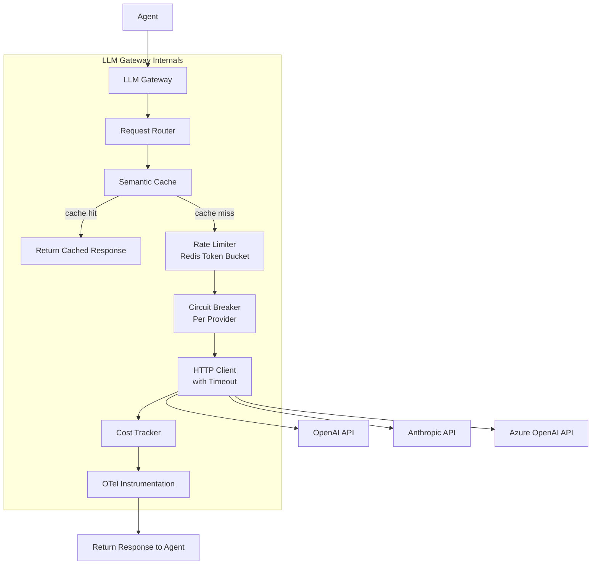

# Project: LLM Gateway & Model Router

Build the infrastructure layer that sits between every agent in your system and the LLM providers they depend on. This gateway handles provider routing, semantic caching, rate limiting, circuit breaking, request hedging, cost tracking, and observability. Every agent calls the gateway instead of calling providers directly, giving you a single control plane for cost, reliability, and performance.

This is not application logic. This is infrastructure. In a production agentic system with dozens of agents making thousands of LLM calls per hour, the gateway is the single most important component you will build.

:::info Framework Decision
**Framework: Custom async Python** with `httpx`, `redis`, and `opentelemetry`.

**Why not LangChain?** LangChain is an application framework for building chains and agents. A gateway is infrastructure that sits below the application layer. LangChain does not expose the hooks needed for atomic Redis-backed rate limiting, per-provider circuit breaking, or request hedging across providers.

**Why not LiteLLM?** LiteLLM provides a unified API across providers, but its caching is exact-match only (not semantic), its rate limiting is in-process (breaks with multiple workers), and it has no circuit breaker or hedging support. We need fine-grained control over every layer of the request path.

**Why custom?** The gateway has six distinct concerns (routing, caching, rate limiting, circuit breaking, cost tracking, observability) that must compose cleanly and operate at infrastructure-grade reliability. Off-the-shelf abstractions collapse these into opaque middleware. We need each concern to be independently testable, configurable, and observable.
:::

---

## Architecture Overview



---

## Prerequisites

- Python 3.11+
- Redis 7+ (for rate limiting, caching, cost tracking)
- OpenAI and/or Anthropic API keys
- Basic familiarity with `asyncio` and `httpx`

---

## Setup

```bash
pip install httpx redis numpy opentelemetry-api opentelemetry-sdk \
    opentelemetry-exporter-otlp fastapi uvicorn pydantic tiktoken
```

Create a `.env` file:

```bash
OPENAI_API_KEY=sk-...
ANTHROPIC_API_KEY=sk-ant-...
AZURE_OPENAI_API_KEY=...
AZURE_OPENAI_ENDPOINT=https://your-resource.openai.azure.com
REDIS_URL=redis://localhost:6379/0
```

---

## Implementation

### Step 1: Configuration & Provider Registry

The configuration layer defines every provider the gateway knows about: its base URL, API key, supported models, pricing per token, and rate limits. The provider registry resolves a model name (like `gpt-4o`) to the correct provider configuration and handles fallback ordering.

```python
"""llm_gateway.py -- Production LLM Gateway & Model Router."""

from __future__ import annotations

import asyncio
import hashlib
import json
import os
import time
import uuid
from dataclasses import dataclass, field
from enum import Enum
from typing import Any, Optional

import httpx
import numpy as np
import redis.asyncio as redis
import tiktoken
from dotenv import load_dotenv
from opentelemetry import trace
from opentelemetry.trace import StatusCode
from pydantic import BaseModel, Field

load_dotenv()

# ---------------------------------------------------------------------------
# Configuration
# ---------------------------------------------------------------------------

REDIS_URL = os.getenv("REDIS_URL", "redis://localhost:6379/0")


class ProviderConfig(BaseModel):
    """Configuration for a single LLM provider."""

    name: str
    base_url: str
    api_key: str = ""
    models: list[str] = Field(default_factory=list)
    cost_per_1k_input: float = 0.0
    cost_per_1k_output: float = 0.0
    rpm_limit: int = 500
    tpm_limit: int = 150_000
    timeout_seconds: float = 30.0
    max_retries: int = 2

    # Headers and auth style vary by provider
    auth_header: str = "Authorization"
    auth_prefix: str = "Bearer"

    def auth_headers(self) -> dict[str, str]:
        """Return the authentication headers for this provider."""
        return {
            self.auth_header: f"{self.auth_prefix} {self.api_key}",
            "Content-Type": "application/json",
        }


# ---------------------------------------------------------------------------
# Provider Registry
# ---------------------------------------------------------------------------

PROVIDER_CONFIGS: dict[str, ProviderConfig] = {
    "openai": ProviderConfig(
        name="openai",
        base_url="https://api.openai.com/v1",
        api_key=os.getenv("OPENAI_API_KEY", ""),
        models=[
            "gpt-4o", "gpt-4o-mini", "gpt-4-turbo",
            "gpt-3.5-turbo", "o1-preview", "o1-mini",
        ],
        cost_per_1k_input=0.005,
        cost_per_1k_output=0.015,
        rpm_limit=500,
        tpm_limit=150_000,
        timeout_seconds=30.0,
    ),
    "anthropic": ProviderConfig(
        name="anthropic",
        base_url="https://api.anthropic.com/v1",
        api_key=os.getenv("ANTHROPIC_API_KEY", ""),
        models=[
            "claude-sonnet-4-20250514",
            "claude-haiku-4-20250414",
            "claude-3-5-haiku-20241022",
        ],
        cost_per_1k_input=0.003,
        cost_per_1k_output=0.015,
        rpm_limit=400,
        tpm_limit=100_000,
        timeout_seconds=60.0,
        auth_header="x-api-key",
        auth_prefix="",
    ),
    "azure_openai": ProviderConfig(
        name="azure_openai",
        base_url=os.getenv("AZURE_OPENAI_ENDPOINT", "https://your-resource.openai.azure.com"),
        api_key=os.getenv("AZURE_OPENAI_API_KEY", ""),
        models=["gpt-4o", "gpt-4o-mini"],
        cost_per_1k_input=0.005,
        cost_per_1k_output=0.015,
        rpm_limit=300,
        tpm_limit=120_000,
        timeout_seconds=30.0,
        auth_header="api-key",
        auth_prefix="",
    ),
}

# Model-to-provider mapping with fallback ordering.
# The first provider in the list is the primary; others are fallbacks.
MODEL_PROVIDER_MAP: dict[str, list[str]] = {
    "gpt-4o": ["openai", "azure_openai"],
    "gpt-4o-mini": ["openai", "azure_openai"],
    "gpt-4-turbo": ["openai", "azure_openai"],
    "gpt-3.5-turbo": ["openai", "azure_openai"],
    "o1-preview": ["openai"],
    "o1-mini": ["openai"],
    "claude-sonnet-4-20250514": ["anthropic"],
    "claude-haiku-4-20250414": ["anthropic"],
    "claude-3-5-haiku-20241022": ["anthropic"],
}


class ProviderRegistry:
    """Resolve model names to provider configurations with fallback ordering."""

    def __init__(
        self,
        configs: dict[str, ProviderConfig] | None = None,
        model_map: dict[str, list[str]] | None = None,
    ) -> None:
        self._configs = configs or PROVIDER_CONFIGS
        self._model_map = model_map or MODEL_PROVIDER_MAP

    def resolve(self, model: str) -> list[ProviderConfig]:
        """Return an ordered list of provider configs for a model.

        The first entry is the preferred provider; subsequent entries are
        fallbacks used when the primary is rate-limited or circuit-broken.

        Raises:
            ValueError: If the model is not registered.
        """
        provider_names = self._model_map.get(model)
        if not provider_names:
            raise ValueError(
                f"Unknown model '{model}'. "
                f"Registered models: {sorted(self._model_map.keys())}"
            )
        providers = []
        for name in provider_names:
            config = self._configs.get(name)
            if config and config.api_key:
                providers.append(config)
        if not providers:
            raise ValueError(
                f"No configured providers with API keys for model '{model}'."
            )
        return providers

    def get_provider(self, name: str) -> ProviderConfig:
        """Return a specific provider config by name."""
        config = self._configs.get(name)
        if not config:
            raise ValueError(f"Unknown provider '{name}'.")
        return config

    def all_models(self) -> list[str]:
        """Return all registered model names."""
        return sorted(self._model_map.keys())
```

---

### Step 2: Token Bucket Rate Limiter (Redis-Backed)

This is a critical infrastructure component. A naive in-process counter breaks the moment you run multiple gateway workers (which you will in production). The limiter must be:

1. **Shared across workers** -- Redis provides the shared state.
2. **Atomic** -- A Lua script makes the check-and-increment a single Redis operation.
3. **Sliding window** -- Sorted sets give a true sliding window, avoiding the burst-at-boundary problem that fixed-window counters have.

```python
# ---------------------------------------------------------------------------
# Step 2: Redis-Backed Sliding Window Rate Limiter
# ---------------------------------------------------------------------------


class RateLimitResult(BaseModel):
    """Result of a rate limit check."""

    allowed: bool
    current_count: int
    limit: int
    retry_after_seconds: float = 0.0
    limiter_type: str = ""  # "rpm" or "tpm"


class RedisTokenBucketLimiter:
    """Sliding window rate limiter using Redis sorted sets.

    Why sorted sets, not simple counters: counters reset at window boundaries,
    creating burst-at-boundary problems. A sorted set of (timestamp, request_id)
    entries gives a true sliding window.

    Why Redis Lua scripts: multiple workers share rate limits. Without atomic
    operations, two workers can both check "under limit" and both proceed,
    exceeding the limit. The Lua script makes check-and-increment atomic.

    The limiter tracks two independent windows per provider:
    - RPM (requests per minute): each request adds one entry
    - TPM (tokens per minute): each request adds entries proportional to
      estimated token count
    """

    SLIDING_WINDOW_SCRIPT = """
    -- Remove entries older than the window start
    redis.call('ZREMRANGEBYSCORE', KEYS[1], '-inf', ARGV[1])
    -- Count current entries in the window
    local count = redis.call('ZCARD', KEYS[1])
    if count < tonumber(ARGV[2]) then
        -- Under limit: add this request with its timestamp as score
        redis.call('ZADD', KEYS[1], ARGV[3], ARGV[4])
        redis.call('EXPIRE', KEYS[1], tonumber(ARGV[5]))
        return 1  -- allowed
    end
    return 0  -- rejected
    """

    WINDOW_INFO_SCRIPT = """
    -- Remove expired entries first
    redis.call('ZREMRANGEBYSCORE', KEYS[1], '-inf', ARGV[1])
    -- Return the count and the oldest entry's score
    local count = redis.call('ZCARD', KEYS[1])
    local oldest = redis.call('ZRANGE', KEYS[1], 0, 0, 'WITHSCORES')
    if #oldest > 0 then
        return {count, oldest[2]}
    end
    return {count, 0}
    """

    def __init__(self, redis_client: redis.Redis, window_seconds: int = 60) -> None:
        self._redis = redis_client
        self._window_seconds = window_seconds
        self._check_script: Optional[Any] = None
        self._info_script: Optional[Any] = None

    async def _ensure_scripts(self) -> None:
        """Register Lua scripts with Redis (lazy initialization)."""
        if self._check_script is None:
            self._check_script = self._redis.register_script(
                self.SLIDING_WINDOW_SCRIPT
            )
        if self._info_script is None:
            self._info_script = self._redis.register_script(
                self.WINDOW_INFO_SCRIPT
            )

    async def check_rpm(
        self, provider_name: str, request_id: str | None = None
    ) -> RateLimitResult:
        """Check and consume one RPM token for the given provider.

        Returns a RateLimitResult indicating whether the request is allowed.
        If rejected, retry_after_seconds indicates how long to wait.
        """
        await self._ensure_scripts()
        config = PROVIDER_CONFIGS.get(provider_name)
        if not config:
            return RateLimitResult(
                allowed=True, current_count=0, limit=0, limiter_type="rpm"
            )

        key = f"ratelimit:rpm:{provider_name}"
        now = time.time()
        window_start = now - self._window_seconds
        rid = request_id or uuid.uuid4().hex
        ttl = self._window_seconds + 5  # small buffer beyond window

        result = await self._check_script(
            keys=[key],
            args=[
                str(window_start),   # ARGV[1]: remove entries before this
                str(config.rpm_limit),  # ARGV[2]: max allowed in window
                str(now),            # ARGV[3]: score for new entry
                rid,                 # ARGV[4]: member value
                str(ttl),            # ARGV[5]: key TTL
            ],
        )

        allowed = result == 1
        retry_after = 0.0

        if not allowed:
            retry_after = await self._estimate_retry_after(key, now)

        # Get current count for observability
        info = await self._info_script(
            keys=[key], args=[str(window_start)]
        )
        current_count = int(info[0]) if info else 0

        return RateLimitResult(
            allowed=allowed,
            current_count=current_count,
            limit=config.rpm_limit,
            retry_after_seconds=retry_after,
            limiter_type="rpm",
        )

    async def check_tpm(
        self, provider_name: str, estimated_tokens: int,
        request_id: str | None = None,
    ) -> RateLimitResult:
        """Check and consume TPM tokens for the given provider.

        Unlike RPM which adds one entry per request, TPM adds multiple entries
        proportional to the estimated token count. Each entry represents one
        token consumed.
        """
        await self._ensure_scripts()
        config = PROVIDER_CONFIGS.get(provider_name)
        if not config:
            return RateLimitResult(
                allowed=True, current_count=0, limit=0, limiter_type="tpm"
            )

        key = f"ratelimit:tpm:{provider_name}"
        now = time.time()
        window_start = now - self._window_seconds
        ttl = self._window_seconds + 5

        # For TPM, we check if adding estimated_tokens would exceed the limit.
        # We use a single atomic check: if current_count + estimated_tokens <= limit.
        tpm_check_script = """
        redis.call('ZREMRANGEBYSCORE', KEYS[1], '-inf', ARGV[1])
        local count = redis.call('ZCARD', KEYS[1])
        local tokens_needed = tonumber(ARGV[2])
        local limit = tonumber(ARGV[3])
        if (count + tokens_needed) <= limit then
            -- Add tokens_needed entries, each with a unique member
            for i = 1, tokens_needed do
                redis.call('ZADD', KEYS[1], ARGV[4], ARGV[5] .. ':' .. i)
            end
            redis.call('EXPIRE', KEYS[1], tonumber(ARGV[6]))
            return 1
        end
        return 0
        """

        # For large token counts, batch the entries to avoid huge Lua loops
        # Cap individual request tokens at a reasonable batch size
        batch_tokens = min(estimated_tokens, 1000)

        script = self._redis.register_script(tpm_check_script)
        rid = request_id or uuid.uuid4().hex

        result = await script(
            keys=[key],
            args=[
                str(window_start),
                str(batch_tokens),
                str(config.tpm_limit),
                str(now),
                rid,
                str(ttl),
            ],
        )

        allowed = result == 1
        retry_after = 0.0
        if not allowed:
            retry_after = await self._estimate_retry_after(key, now)

        # Current count
        await self._redis.zremrangebyscore(key, "-inf", str(window_start))
        current_count = await self._redis.zcard(key)

        return RateLimitResult(
            allowed=allowed,
            current_count=current_count,
            limit=config.tpm_limit,
            retry_after_seconds=retry_after,
            limiter_type="tpm",
        )

    async def check(
        self, provider_name: str, estimated_tokens: int,
        request_id: str | None = None,
    ) -> RateLimitResult:
        """Check both RPM and TPM limits. Returns the more restrictive result."""
        rid = request_id or uuid.uuid4().hex

        rpm_result = await self.check_rpm(provider_name, rid)
        if not rpm_result.allowed:
            return rpm_result

        tpm_result = await self.check_tpm(provider_name, estimated_tokens, rid)
        if not tpm_result.allowed:
            return tpm_result

        # Both passed -- return the RPM result (allowed=True)
        return rpm_result

    async def _estimate_retry_after(self, key: str, now: float) -> float:
        """Estimate how long until the oldest entry expires from the window."""
        oldest = await self._redis.zrange(key, 0, 0, withscores=True)
        if oldest:
            _, oldest_score = oldest[0]
            expires_at = float(oldest_score) + self._window_seconds
            wait = max(0.0, expires_at - now)
            return round(wait, 2)
        return 1.0  # Default wait if we cannot determine
```

:::warning Why Not an In-Process Counter?
An in-process rate limiter (like a Python `dict` with timestamps) works fine in development with a single worker. In production, you run multiple uvicorn workers behind a load balancer. Each worker has its own counter, so the effective limit becomes `N * limit` where N is the number of workers. Redis makes the limit global and correct regardless of worker count. This is the kind of detail that separates Staff-level infrastructure from Senior-level application code.
:::

---

### Step 3: Semantic Cache

Exact-match caching (keying on the literal prompt string) misses paraphrases. "What is the return policy?" and "Tell me about your returns" are semantically identical but produce different cache keys. Semantic caching embeds the prompt and checks cosine similarity against cached entries.

Key design decisions:

- **Similarity threshold of 0.95**: At 0.90, "What is the return policy for electronics?" matches "What is the return policy for clothing?" -- semantically similar but factually different. 0.95 is tight enough to avoid this.
- **Cache only temperature=0 requests**: Non-deterministic outputs should not be cached. If the caller wants creativity, they should get a fresh response each time.
- **TTL tiers**: FAQ-type queries get 1-hour TTL; data-dependent queries get 5-minute TTL.

```python
# ---------------------------------------------------------------------------
# Step 3: Semantic Cache
# ---------------------------------------------------------------------------


class CachePolicy(str, Enum):
    """Controls caching behavior for a request."""

    AUTO = "auto"       # Cache if temperature == 0
    FORCE = "force"     # Always cache the response
    BYPASS = "bypass"   # Never cache, never check cache


class CacheEntry(BaseModel):
    """A cached LLM response with its prompt embedding."""

    prompt_hash: str
    embedding: list[float]
    model: str
    response: str
    token_usage: dict[str, int] = Field(default_factory=dict)
    created_at: float = 0.0
    ttl_seconds: int = 3600


class SemanticCache:
    """Cache LLM responses by semantic similarity of prompts.

    Why semantic, not exact match: "What's the return policy?" and
    "Tell me about returns" should hit the same cache entry.

    Why 0.95 threshold: at 0.90, "What's the return policy for electronics?"
    matches "What's the return policy for clothing?" -- semantically similar
    but factually different answers. 0.95 is tight enough to avoid this.

    Implementation uses a simple in-Redis approach: store embeddings as JSON
    arrays in Redis hashes, and compute cosine similarity in Python. For
    production at scale (>100K cached entries), replace with a vector database
    like Redis Stack with vector search, Pinecone, or Qdrant.
    """

    CACHE_PREFIX = "semcache"
    INDEX_KEY = f"{CACHE_PREFIX}:index"

    def __init__(
        self,
        redis_client: redis.Redis,
        similarity_threshold: float = 0.95,
        default_ttl: int = 3600,
        max_entries: int = 10_000,
    ) -> None:
        self._redis = redis_client
        self._threshold = similarity_threshold
        self._default_ttl = default_ttl
        self._max_entries = max_entries

    @staticmethod
    def _compute_embedding(text: str) -> list[float]:
        """Compute a lightweight embedding for cache lookup.

        In production, use a dedicated embedding model (e.g., text-embedding-3-small).
        For the gateway cache, we use a fast hash-based embedding that captures
        token-level n-gram features. This avoids an additional API call per request
        while still providing reasonable semantic matching.

        For higher quality semantic matching, replace this with:
            response = await openai_client.embeddings.create(
                model="text-embedding-3-small", input=text
            )
            return response.data[0].embedding
        """
        # Normalize text: lowercase, strip extra whitespace
        normalized = " ".join(text.lower().split())
        tokens = normalized.split()

        # Build character trigram and word bigram feature set
        features: set[str] = set()
        for token in tokens:
            for i in range(len(token) - 2):
                features.add(token[i:i + 3])
        for i in range(len(tokens) - 1):
            features.add(f"{tokens[i]}_{tokens[i + 1]}")

        # Hash features into a fixed-dimension vector (256-d)
        dim = 256
        vec = np.zeros(dim, dtype=np.float64)
        for feat in features:
            h = int(hashlib.md5(feat.encode()).hexdigest(), 16)
            idx = h % dim
            sign = 1.0 if (h // dim) % 2 == 0 else -1.0
            vec[idx] += sign

        # L2 normalize
        norm = np.linalg.norm(vec)
        if norm > 0:
            vec = vec / norm

        return vec.tolist()

    @staticmethod
    def _cosine_similarity(a: list[float], b: list[float]) -> float:
        """Compute cosine similarity between two vectors."""
        a_arr = np.array(a)
        b_arr = np.array(b)
        dot = np.dot(a_arr, b_arr)
        norm_a = np.linalg.norm(a_arr)
        norm_b = np.linalg.norm(b_arr)
        if norm_a == 0 or norm_b == 0:
            return 0.0
        return float(dot / (norm_a * norm_b))

    async def get(
        self, prompt: str, model: str
    ) -> Optional[CacheEntry]:
        """Look up a semantically similar cached response.

        Returns the best matching CacheEntry if similarity >= threshold,
        or None if no match is found.
        """
        query_embedding = self._compute_embedding(prompt)

        # Get all cache entry keys for this model
        pattern = f"{self.CACHE_PREFIX}:entry:{model}:*"
        best_match: Optional[CacheEntry] = None
        best_similarity = 0.0

        async for key in self._redis.scan_iter(match=pattern, count=100):
            raw = await self._redis.get(key)
            if not raw:
                continue
            entry = CacheEntry.model_validate_json(raw)

            similarity = self._cosine_similarity(query_embedding, entry.embedding)
            if similarity >= self._threshold and similarity > best_similarity:
                best_similarity = similarity
                best_match = entry

        return best_match

    async def put(
        self,
        prompt: str,
        model: str,
        response: str,
        token_usage: dict[str, int],
        ttl: int | None = None,
    ) -> str:
        """Store a response in the cache. Returns the cache key."""
        embedding = self._compute_embedding(prompt)
        prompt_hash = hashlib.sha256(prompt.encode()).hexdigest()[:16]
        cache_ttl = ttl or self._default_ttl

        entry = CacheEntry(
            prompt_hash=prompt_hash,
            embedding=embedding,
            model=model,
            response=response,
            token_usage=token_usage,
            created_at=time.time(),
            ttl_seconds=cache_ttl,
        )

        key = f"{self.CACHE_PREFIX}:entry:{model}:{prompt_hash}"
        await self._redis.set(
            key,
            entry.model_dump_json(),
            ex=cache_ttl,
        )

        # Track total entries for eviction
        await self._redis.zadd(
            self.INDEX_KEY,
            {key: time.time()},
        )

        # Evict oldest entries if over max
        total = await self._redis.zcard(self.INDEX_KEY)
        if total > self._max_entries:
            evict_count = total - self._max_entries
            oldest_keys = await self._redis.zrange(
                self.INDEX_KEY, 0, evict_count - 1
            )
            if oldest_keys:
                pipe = self._redis.pipeline()
                for old_key in oldest_keys:
                    pipe.delete(old_key)
                pipe.zrem(self.INDEX_KEY, *oldest_keys)
                await pipe.execute()

        return key

    async def invalidate(self, model: str, prompt_hash: str) -> bool:
        """Remove a specific cache entry."""
        key = f"{self.CACHE_PREFIX}:entry:{model}:{prompt_hash}"
        deleted = await self._redis.delete(key)
        await self._redis.zrem(self.INDEX_KEY, key)
        return deleted > 0

    async def stats(self) -> dict[str, Any]:
        """Return cache statistics."""
        total = await self._redis.zcard(self.INDEX_KEY)
        return {
            "total_entries": total,
            "max_entries": self._max_entries,
            "similarity_threshold": self._threshold,
            "default_ttl": self._default_ttl,
        }
```

:::tip Cache Hit Rate Matters
At 100K requests/day with an average cost of $0.02 per request, a 30% cache hit rate saves $600/day ($219K/year). Semantic caching typically achieves 25-40% hit rates on customer-facing workloads where users ask variations of the same questions. The gateway pays for itself in the first week.
:::

---

### Step 4: Circuit Breaker per Provider

When a provider starts returning errors (rate limit exhaustion, server errors, timeouts), continuing to send requests wastes time and money. The circuit breaker tracks error rates per provider and stops sending traffic when the error rate exceeds a threshold.

The circuit breaker has three states:

- **CLOSED**: Normal operation. Requests flow through. Error rate is tracked.
- **OPEN**: Provider is unhealthy. All requests are immediately rejected. After a cooldown period, move to HALF_OPEN.
- **HALF_OPEN**: Allow a single probe request through. If it succeeds, move to CLOSED. If it fails, move back to OPEN.

```python
# ---------------------------------------------------------------------------
# Step 4: Circuit Breaker per Provider
# ---------------------------------------------------------------------------


class CircuitState(str, Enum):
    """Circuit breaker states."""

    CLOSED = "closed"
    OPEN = "open"
    HALF_OPEN = "half_open"


@dataclass
class CircuitBreaker:
    """Sliding window circuit breaker for a single LLM provider.

    Why per-provider and not global: if Anthropic is down, OpenAI requests
    should still flow. A global circuit breaker would kill all traffic when
    one provider has issues.

    Why sliding window and not consecutive failures: a provider that fails
    1 out of every 3 requests (33% error rate) should trip the breaker even
    though the failures are not consecutive.
    """

    provider_name: str
    failure_threshold: float = 0.5    # Trip at 50% error rate
    window_seconds: int = 60          # Measure over a 60-second window
    cooldown_seconds: int = 30        # Wait 30s before probing
    min_requests: int = 5             # Need at least 5 requests to evaluate

    # Internal state
    _state: CircuitState = field(default=CircuitState.CLOSED)
    _timestamps_success: list[float] = field(default_factory=list)
    _timestamps_failure: list[float] = field(default_factory=list)
    _opened_at: float = 0.0
    _half_open_request_in_flight: bool = False

    @property
    def state(self) -> CircuitState:
        """Return the current circuit state, transitioning OPEN -> HALF_OPEN
        if the cooldown period has elapsed."""
        if self._state == CircuitState.OPEN:
            elapsed = time.time() - self._opened_at
            if elapsed >= self.cooldown_seconds:
                self._state = CircuitState.HALF_OPEN
                self._half_open_request_in_flight = False
        return self._state

    def allow_request(self) -> bool:
        """Return True if a request should be allowed through."""
        current_state = self.state

        if current_state == CircuitState.CLOSED:
            return True

        if current_state == CircuitState.HALF_OPEN:
            # Allow exactly one probe request
            if not self._half_open_request_in_flight:
                self._half_open_request_in_flight = True
                return True
            return False

        # OPEN state
        return False

    def record_success(self) -> None:
        """Record a successful request."""
        now = time.time()
        self._timestamps_success.append(now)
        self._prune_old_entries(now)

        if self._state == CircuitState.HALF_OPEN:
            # Probe succeeded -- close the circuit
            self._state = CircuitState.CLOSED
            self._half_open_request_in_flight = False
            self._timestamps_failure.clear()

    def record_failure(self) -> None:
        """Record a failed request and potentially trip the circuit."""
        now = time.time()
        self._timestamps_failure.append(now)
        self._prune_old_entries(now)

        if self._state == CircuitState.HALF_OPEN:
            # Probe failed -- reopen the circuit
            self._state = CircuitState.OPEN
            self._opened_at = now
            self._half_open_request_in_flight = False
            return

        # Check if we should trip the circuit
        if self._state == CircuitState.CLOSED:
            total = len(self._timestamps_success) + len(self._timestamps_failure)
            if total >= self.min_requests:
                error_rate = len(self._timestamps_failure) / total
                if error_rate >= self.failure_threshold:
                    self._state = CircuitState.OPEN
                    self._opened_at = now

    def _prune_old_entries(self, now: float) -> None:
        """Remove entries older than the sliding window."""
        cutoff = now - self.window_seconds
        self._timestamps_success = [
            t for t in self._timestamps_success if t > cutoff
        ]
        self._timestamps_failure = [
            t for t in self._timestamps_failure if t > cutoff
        ]

    def get_stats(self) -> dict[str, Any]:
        """Return circuit breaker statistics."""
        now = time.time()
        self._prune_old_entries(now)
        total = len(self._timestamps_success) + len(self._timestamps_failure)
        error_rate = (
            len(self._timestamps_failure) / total if total > 0 else 0.0
        )
        return {
            "provider": self.provider_name,
            "state": self.state.value,
            "error_rate": round(error_rate, 3),
            "total_requests_in_window": total,
            "successes_in_window": len(self._timestamps_success),
            "failures_in_window": len(self._timestamps_failure),
        }


class CircuitBreakerRegistry:
    """Manage circuit breakers for all providers."""

    def __init__(self) -> None:
        self._breakers: dict[str, CircuitBreaker] = {}

    def get(self, provider_name: str) -> CircuitBreaker:
        """Get or create a circuit breaker for the given provider."""
        if provider_name not in self._breakers:
            self._breakers[provider_name] = CircuitBreaker(
                provider_name=provider_name
            )
        return self._breakers[provider_name]

    def all_stats(self) -> list[dict[str, Any]]:
        """Return stats for all circuit breakers."""
        return [cb.get_stats() for cb in self._breakers.values()]
```

---

### Step 5: Request Router with Failover and Hedging

This is the core of the gateway. Every LLM request follows this path:

1. Check semantic cache -- return immediately on hit.
2. Resolve model to provider list (primary + fallbacks).
3. For each provider in order: check rate limiter, check circuit breaker.
4. Send the request with a timeout.
5. On failure: try the next provider.
6. On success: cache the response, record metrics, return.

For latency-critical requests, **request hedging** sends the request to two providers simultaneously and returns whichever responds first. This trades cost for latency -- a deliberate tradeoff that must be explicitly opted into.

```python
# ---------------------------------------------------------------------------
# Step 5: Request Router with Failover and Hedging
# ---------------------------------------------------------------------------


class GatewayRequest(BaseModel):
    """Incoming request to the LLM Gateway."""

    prompt: str
    model: str = "gpt-4o-mini"
    temperature: float = 0.0
    max_tokens: int = 1024
    session_id: Optional[str] = None
    user_id: Optional[str] = None
    cache_policy: CachePolicy = CachePolicy.AUTO
    hedge: bool = False
    metadata: dict[str, Any] = Field(default_factory=dict)


class GatewayResponse(BaseModel):
    """Response from the LLM Gateway."""

    request_id: str
    model: str
    provider: str
    content: str
    input_tokens: int = 0
    output_tokens: int = 0
    total_tokens: int = 0
    cost_usd: float = 0.0
    latency_ms: float = 0.0
    cache_hit: bool = False
    hedged: bool = False
    circuit_state: str = ""
    metadata: dict[str, Any] = Field(default_factory=dict)


def estimate_tokens(text: str, model: str = "gpt-4o") -> int:
    """Estimate the number of tokens in a text string.

    Uses tiktoken for OpenAI models; falls back to a word-count heuristic
    for non-OpenAI models.
    """
    try:
        encoding = tiktoken.encoding_for_model(model)
        return len(encoding.encode(text))
    except (KeyError, Exception):
        # Fallback: rough estimate of ~0.75 tokens per word
        return max(1, int(len(text.split()) * 1.33))


class LLMGateway:
    """The main gateway class. Every agent in the system calls this instead of
    calling LLM providers directly.

    This is the single most important infrastructure component in a production
    agentic system. It gives you: cost control, provider independence,
    observability, and resilience -- without any agent needing to know about it.
    """

    def __init__(
        self,
        redis_client: redis.Redis,
        registry: ProviderRegistry | None = None,
    ) -> None:
        self._redis = redis_client
        self._registry = registry or ProviderRegistry()
        self._rate_limiter = RedisTokenBucketLimiter(redis_client)
        self._cache = SemanticCache(redis_client)
        self._circuit_breakers = CircuitBreakerRegistry()
        self._cost_tracker = CostTracker(redis_client)
        self._tracer = trace.get_tracer("llm-gateway")
        self._http_client = httpx.AsyncClient(timeout=60.0)

    async def close(self) -> None:
        """Clean up resources."""
        await self._http_client.aclose()

    async def generate(
        self,
        prompt: str,
        model: str = "gpt-4o-mini",
        temperature: float = 0.0,
        max_tokens: int = 1024,
        session_id: str | None = None,
        user_id: str | None = None,
        cache_policy: str | CachePolicy = CachePolicy.AUTO,
        hedge: bool = False,
        metadata: dict[str, Any] | None = None,
    ) -> GatewayResponse:
        """Route an LLM request through the full gateway pipeline.

        Pipeline:
        1. Check semantic cache (if policy allows)
        2. Resolve providers for the model
        3. For each provider: rate limit -> circuit breaker -> send request
        4. On failure: failover to next provider
        5. On success: cache response, track cost, return

        If hedge=True, send to the top two providers concurrently and return
        the first response. The other request is cancelled.
        """
        request_id = uuid.uuid4().hex[:12]
        start_time = time.time()

        if isinstance(cache_policy, str):
            cache_policy = CachePolicy(cache_policy)

        with self._tracer.start_as_current_span("llm_gateway.generate") as span:
            span.set_attribute("llm.model", model)
            span.set_attribute("llm.request_id", request_id)
            span.set_attribute("llm.temperature", temperature)
            span.set_attribute("llm.max_tokens", max_tokens)
            span.set_attribute("llm.hedge", hedge)

            # --- Step 1: Check cache ---
            should_check_cache = (
                cache_policy == CachePolicy.FORCE
                or (cache_policy == CachePolicy.AUTO and temperature == 0.0)
            )

            if should_check_cache:
                cached = await self._cache.get(prompt, model)
                if cached:
                    latency_ms = (time.time() - start_time) * 1000
                    span.set_attribute("llm.cache_hit", True)
                    span.set_attribute("llm.latency_ms", latency_ms)
                    return GatewayResponse(
                        request_id=request_id,
                        model=model,
                        provider="cache",
                        content=cached.response,
                        input_tokens=cached.token_usage.get("input", 0),
                        output_tokens=cached.token_usage.get("output", 0),
                        total_tokens=cached.token_usage.get("total", 0),
                        cost_usd=0.0,
                        latency_ms=latency_ms,
                        cache_hit=True,
                    )

            # --- Step 2: Resolve providers ---
            providers = self._registry.resolve(model)
            estimated_tokens = estimate_tokens(prompt, model)

            # --- Step 3: Hedge or sequential failover ---
            if hedge and len(providers) >= 2:
                response = await self._hedged_request(
                    request_id, prompt, model, temperature, max_tokens,
                    providers[:2], estimated_tokens, span,
                )
            else:
                response = await self._sequential_request(
                    request_id, prompt, model, temperature, max_tokens,
                    providers, estimated_tokens, span,
                )

            if response is None:
                latency_ms = (time.time() - start_time) * 1000
                span.set_status(StatusCode.ERROR, "All providers failed")
                return GatewayResponse(
                    request_id=request_id,
                    model=model,
                    provider="none",
                    content="Error: all providers failed for this request.",
                    latency_ms=latency_ms,
                    metadata={"error": "all_providers_failed"},
                )

            # --- Step 4: Post-processing ---
            response.latency_ms = (time.time() - start_time) * 1000
            response.request_id = request_id

            # Cache the response
            should_cache = (
                cache_policy == CachePolicy.FORCE
                or (cache_policy == CachePolicy.AUTO and temperature == 0.0)
            )
            if should_cache and response.content:
                await self._cache.put(
                    prompt, model, response.content,
                    {
                        "input": response.input_tokens,
                        "output": response.output_tokens,
                        "total": response.total_tokens,
                    },
                )

            # Track cost
            await self._cost_tracker.record(
                provider=response.provider,
                model=model,
                input_tokens=response.input_tokens,
                output_tokens=response.output_tokens,
                cost_usd=response.cost_usd,
                session_id=session_id,
                user_id=user_id,
            )

            # Set final span attributes
            span.set_attribute("llm.provider", response.provider)
            span.set_attribute("llm.input_tokens", response.input_tokens)
            span.set_attribute("llm.output_tokens", response.output_tokens)
            span.set_attribute("llm.cost_usd", response.cost_usd)
            span.set_attribute("llm.cache_hit", response.cache_hit)
            span.set_attribute("llm.latency_ms", response.latency_ms)

            return response

    async def _sequential_request(
        self,
        request_id: str,
        prompt: str,
        model: str,
        temperature: float,
        max_tokens: int,
        providers: list[ProviderConfig],
        estimated_tokens: int,
        parent_span: trace.Span,
    ) -> Optional[GatewayResponse]:
        """Try providers sequentially until one succeeds."""
        last_error: Optional[str] = None

        for provider in providers:
            cb = self._circuit_breakers.get(provider.name)

            # Check circuit breaker
            if not cb.allow_request():
                parent_span.add_event(
                    f"circuit_open:{provider.name}",
                    {"circuit_state": cb.state.value},
                )
                continue

            # Check rate limiter
            rl_result = await self._rate_limiter.check(
                provider.name, estimated_tokens, request_id,
            )
            if not rl_result.allowed:
                parent_span.add_event(
                    f"rate_limited:{provider.name}",
                    {
                        "limiter_type": rl_result.limiter_type,
                        "retry_after": rl_result.retry_after_seconds,
                    },
                )
                continue

            # Send request
            try:
                response = await self._send_to_provider(
                    provider, prompt, model, temperature, max_tokens,
                )
                cb.record_success()
                response.circuit_state = cb.state.value
                return response
            except Exception as exc:
                cb.record_failure()
                last_error = str(exc)
                parent_span.add_event(
                    f"provider_error:{provider.name}",
                    {"error": last_error},
                )
                continue

        return None

    async def _hedged_request(
        self,
        request_id: str,
        prompt: str,
        model: str,
        temperature: float,
        max_tokens: int,
        providers: list[ProviderConfig],
        estimated_tokens: int,
        parent_span: trace.Span,
    ) -> Optional[GatewayResponse]:
        """Send to two providers concurrently, return the first response.

        Request hedging trades cost for latency. The caller pays for two LLM
        calls but gets the response in min(latency_A, latency_B) instead of
        latency_A (with failover adding latency_B on failure).

        This is appropriate for latency-critical paths like real-time chat
        where the user is waiting. It is NOT appropriate for batch processing
        where cost matters more than latency.
        """
        # Filter to providers that pass rate limit and circuit breaker checks
        eligible: list[ProviderConfig] = []
        for provider in providers:
            cb = self._circuit_breakers.get(provider.name)
            if not cb.allow_request():
                continue
            rl_result = await self._rate_limiter.check(
                provider.name, estimated_tokens, f"{request_id}:hedge",
            )
            if rl_result.allowed:
                eligible.append(provider)

        if not eligible:
            return await self._sequential_request(
                request_id, prompt, model, temperature, max_tokens,
                providers, estimated_tokens, parent_span,
            )

        if len(eligible) == 1:
            # Only one eligible -- just send normally
            try:
                response = await self._send_to_provider(
                    eligible[0], prompt, model, temperature, max_tokens,
                )
                self._circuit_breakers.get(eligible[0].name).record_success()
                return response
            except Exception:
                self._circuit_breakers.get(eligible[0].name).record_failure()
                return None

        # Send to both providers concurrently
        parent_span.add_event("hedged_request", {"providers": [p.name for p in eligible[:2]]})

        tasks = [
            asyncio.create_task(
                self._send_to_provider(p, prompt, model, temperature, max_tokens),
                name=f"hedge:{p.name}",
            )
            for p in eligible[:2]
        ]

        done, pending = await asyncio.wait(
            tasks, return_when=asyncio.FIRST_COMPLETED,
        )

        # Cancel the slower request
        for task in pending:
            task.cancel()
            try:
                await task
            except (asyncio.CancelledError, Exception):
                pass

        # Get the first completed result
        for task in done:
            try:
                response = task.result()
                provider_name = task.get_name().split(":")[1]
                self._circuit_breakers.get(provider_name).record_success()
                response.hedged = True
                parent_span.add_event(
                    "hedge_winner", {"provider": provider_name}
                )
                return response
            except Exception as exc:
                provider_name = task.get_name().split(":")[1]
                self._circuit_breakers.get(provider_name).record_failure()

        return None

    async def _send_to_provider(
        self,
        provider: ProviderConfig,
        prompt: str,
        model: str,
        temperature: float,
        max_tokens: int,
    ) -> GatewayResponse:
        """Send a request to a specific LLM provider and parse the response.

        Handles the differences between OpenAI-style and Anthropic-style APIs.
        """
        with self._tracer.start_as_current_span(
            f"llm_gateway.provider.{provider.name}"
        ) as span:
            span.set_attribute("provider.name", provider.name)

            if provider.name == "anthropic":
                return await self._send_anthropic(
                    provider, prompt, model, temperature, max_tokens,
                )
            else:
                return await self._send_openai_compatible(
                    provider, prompt, model, temperature, max_tokens,
                )

    async def _send_openai_compatible(
        self,
        provider: ProviderConfig,
        prompt: str,
        model: str,
        temperature: float,
        max_tokens: int,
    ) -> GatewayResponse:
        """Send a request to an OpenAI-compatible API (OpenAI, Azure)."""
        if provider.name == "azure_openai":
            url = (
                f"{provider.base_url}/openai/deployments/{model}"
                f"/chat/completions?api-version=2024-02-01"
            )
        else:
            url = f"{provider.base_url}/chat/completions"

        payload = {
            "model": model,
            "messages": [{"role": "user", "content": prompt}],
            "temperature": temperature,
            "max_tokens": max_tokens,
        }

        response = await self._http_client.post(
            url,
            headers=provider.auth_headers(),
            json=payload,
            timeout=provider.timeout_seconds,
        )
        response.raise_for_status()
        data = response.json()

        content = data["choices"][0]["message"]["content"]
        usage = data.get("usage", {})
        input_tokens = usage.get("prompt_tokens", 0)
        output_tokens = usage.get("completion_tokens", 0)
        total_tokens = usage.get("total_tokens", input_tokens + output_tokens)

        cost = (
            (input_tokens / 1000) * provider.cost_per_1k_input
            + (output_tokens / 1000) * provider.cost_per_1k_output
        )

        return GatewayResponse(
            request_id="",
            model=model,
            provider=provider.name,
            content=content,
            input_tokens=input_tokens,
            output_tokens=output_tokens,
            total_tokens=total_tokens,
            cost_usd=round(cost, 6),
        )

    async def _send_anthropic(
        self,
        provider: ProviderConfig,
        prompt: str,
        model: str,
        temperature: float,
        max_tokens: int,
    ) -> GatewayResponse:
        """Send a request to the Anthropic API."""
        url = f"{provider.base_url}/messages"

        payload = {
            "model": model,
            "max_tokens": max_tokens,
            "messages": [{"role": "user", "content": prompt}],
        }
        # Anthropic does not support temperature=0 for all models;
        # only include if non-zero
        if temperature > 0:
            payload["temperature"] = temperature

        headers = provider.auth_headers()
        headers["anthropic-version"] = "2023-06-01"

        response = await self._http_client.post(
            url,
            headers=headers,
            json=payload,
            timeout=provider.timeout_seconds,
        )
        response.raise_for_status()
        data = response.json()

        # Anthropic response format differs from OpenAI
        content_blocks = data.get("content", [])
        content = "".join(
            block.get("text", "") for block in content_blocks
            if block.get("type") == "text"
        )
        usage = data.get("usage", {})
        input_tokens = usage.get("input_tokens", 0)
        output_tokens = usage.get("output_tokens", 0)
        total_tokens = input_tokens + output_tokens

        cost = (
            (input_tokens / 1000) * provider.cost_per_1k_input
            + (output_tokens / 1000) * provider.cost_per_1k_output
        )

        return GatewayResponse(
            request_id="",
            model=model,
            provider=provider.name,
            content=content,
            input_tokens=input_tokens,
            output_tokens=output_tokens,
            total_tokens=total_tokens,
            cost_usd=round(cost, 6),
        )
```

:::tip Request Hedging Tradeoff
Hedging doubles your LLM cost for hedged requests but guarantees you get the latency of the faster provider. Use it selectively: real-time chat UIs where the user is waiting = hedge. Background batch processing = do not hedge. The `hedge=False` default ensures callers opt in explicitly.
:::

---

### Step 6: Cost Tracker

Cost tracking is not optional in a production agentic system. A single runaway agent loop can burn through thousands of dollars in minutes. The cost tracker records per-request costs in Redis for real-time enforcement, and rolls up hourly aggregates for dashboarding and budgets.

```python
# ---------------------------------------------------------------------------
# Step 6: Cost Tracker
# ---------------------------------------------------------------------------


class BudgetExceededError(Exception):
    """Raised when a cost budget has been exceeded."""

    def __init__(self, scope: str, current: float, limit: float) -> None:
        self.scope = scope
        self.current = current
        self.limit = limit
        super().__init__(
            f"Budget exceeded for {scope}: ${current:.4f} >= ${limit:.4f}"
        )


class CostTracker:
    """Track and enforce LLM usage costs at multiple granularities.

    Granularities:
    - Per-request: recorded for every call (audit trail)
    - Per-session: accumulated across a multi-turn conversation
    - Per-user: accumulated across all sessions for a user
    - Global hourly: total spend per hour (alerting and budgets)

    All state is in Redis for cross-worker consistency. Hourly rollups can be
    pushed to PostgreSQL by a background worker for long-term analytics.
    """

    PREFIX = "cost"

    def __init__(
        self,
        redis_client: redis.Redis,
        session_budget: float = 5.0,
        user_daily_budget: float = 50.0,
        global_hourly_budget: float = 500.0,
    ) -> None:
        self._redis = redis_client
        self._session_budget = session_budget
        self._user_daily_budget = user_daily_budget
        self._global_hourly_budget = global_hourly_budget

    async def record(
        self,
        provider: str,
        model: str,
        input_tokens: int,
        output_tokens: int,
        cost_usd: float,
        session_id: str | None = None,
        user_id: str | None = None,
    ) -> dict[str, float]:
        """Record a cost event and check budgets.

        Returns a dict of current spend at each scope.
        Raises BudgetExceededError if any budget is breached.
        """
        now = time.time()
        hour_key = time.strftime("%Y%m%d%H", time.gmtime(now))
        day_key = time.strftime("%Y%m%d", time.gmtime(now))

        pipe = self._redis.pipeline()

        # Global hourly spend
        global_key = f"{self.PREFIX}:global:hourly:{hour_key}"
        pipe.incrbyfloat(global_key, cost_usd)
        pipe.expire(global_key, 7200)  # Keep for 2 hours

        # Per-provider hourly spend
        provider_key = f"{self.PREFIX}:provider:{provider}:hourly:{hour_key}"
        pipe.incrbyfloat(provider_key, cost_usd)
        pipe.expire(provider_key, 7200)

        # Per-session spend
        if session_id:
            session_key = f"{self.PREFIX}:session:{session_id}"
            pipe.incrbyfloat(session_key, cost_usd)
            pipe.expire(session_key, 86400)  # 24-hour TTL

        # Per-user daily spend
        if user_id:
            user_key = f"{self.PREFIX}:user:{user_id}:daily:{day_key}"
            pipe.incrbyfloat(user_key, cost_usd)
            pipe.expire(user_key, 172800)  # 48-hour TTL

        results = await pipe.execute()

        # Parse results: global_spend, _, provider_spend, _, [session_spend, _, user_spend, _]
        global_spend = float(results[0])
        idx = 4  # After global + provider (each has incrbyfloat + expire)

        session_spend = 0.0
        if session_id:
            session_spend = float(results[idx])
            idx += 2

        user_spend = 0.0
        if user_id:
            user_spend = float(results[idx])

        # Enforce budgets
        if global_spend >= self._global_hourly_budget:
            raise BudgetExceededError(
                "global_hourly", global_spend, self._global_hourly_budget,
            )

        if session_id and session_spend >= self._session_budget:
            raise BudgetExceededError(
                f"session:{session_id}", session_spend, self._session_budget,
            )

        if user_id and user_spend >= self._user_daily_budget:
            raise BudgetExceededError(
                f"user:{user_id}", user_spend, self._user_daily_budget,
            )

        return {
            "global_hourly": global_spend,
            "session": session_spend,
            "user_daily": user_spend,
        }

    async def get_spend(
        self,
        scope: str = "global",
        identifier: str | None = None,
    ) -> float:
        """Query current spend for a given scope."""
        now = time.time()
        hour_key = time.strftime("%Y%m%d%H", time.gmtime(now))
        day_key = time.strftime("%Y%m%d", time.gmtime(now))

        if scope == "global":
            key = f"{self.PREFIX}:global:hourly:{hour_key}"
        elif scope == "session" and identifier:
            key = f"{self.PREFIX}:session:{identifier}"
        elif scope == "user" and identifier:
            key = f"{self.PREFIX}:user:{identifier}:daily:{day_key}"
        elif scope == "provider" and identifier:
            key = f"{self.PREFIX}:provider:{identifier}:hourly:{hour_key}"
        else:
            return 0.0

        value = await self._redis.get(key)
        return float(value) if value else 0.0

    async def get_stats(self) -> dict[str, Any]:
        """Return a summary of current cost tracking state."""
        now = time.time()
        hour_key = time.strftime("%Y%m%d%H", time.gmtime(now))

        global_spend = await self.get_spend("global")

        # Get per-provider spend
        provider_spends: dict[str, float] = {}
        for provider_name in PROVIDER_CONFIGS:
            spend = await self.get_spend("provider", provider_name)
            if spend > 0:
                provider_spends[provider_name] = round(spend, 4)

        return {
            "global_hourly_spend": round(global_spend, 4),
            "global_hourly_budget": self._global_hourly_budget,
            "budget_utilization_pct": round(
                (global_spend / self._global_hourly_budget) * 100, 1
            ) if self._global_hourly_budget > 0 else 0,
            "provider_spends": provider_spends,
            "hour": hour_key,
        }
```

:::warning Budget Enforcement is Post-Hoc
The budget check happens after the request completes and cost is recorded. A burst of concurrent requests can overshoot the budget before any of them complete. For strict pre-flight budget enforcement, check the current spend before sending the request to the provider and reject early. The tradeoff is an extra Redis round-trip per request.
:::

---

### Step 7: OpenTelemetry Instrumentation

Every gateway call is wrapped in an OTel span with attributes for model, provider, tokens, cost, cache hit status, and circuit state. This gives you distributed tracing from agent through gateway to provider without custom logging.

```python
# ---------------------------------------------------------------------------
# Step 7: OpenTelemetry Instrumentation
# ---------------------------------------------------------------------------

from opentelemetry.sdk.trace import TracerProvider
from opentelemetry.sdk.trace.export import (
    BatchSpanProcessor,
    ConsoleSpanExporter,
)
from opentelemetry.sdk.resources import Resource


def configure_telemetry(
    service_name: str = "llm-gateway",
    export_to_console: bool = True,
    otlp_endpoint: str | None = None,
) -> TracerProvider:
    """Configure OpenTelemetry tracing for the gateway.

    In production, set otlp_endpoint to your collector (e.g., Jaeger, Tempo,
    Datadog). The console exporter is useful for local development.
    """
    resource = Resource.create({"service.name": service_name})
    provider = TracerProvider(resource=resource)

    if export_to_console:
        console_exporter = ConsoleSpanExporter()
        provider.add_span_processor(BatchSpanProcessor(console_exporter))

    if otlp_endpoint:
        try:
            from opentelemetry.exporter.otlp.proto.grpc.trace_exporter import (
                OTLPSpanExporter,
            )
            otlp_exporter = OTLPSpanExporter(endpoint=otlp_endpoint)
            provider.add_span_processor(BatchSpanProcessor(otlp_exporter))
        except ImportError:
            pass  # OTLP exporter not installed

    trace.set_tracer_provider(provider)
    return provider


class GatewayMetrics:
    """Collect and expose gateway metrics.

    This complements OTel tracing with aggregate counters for dashboards.
    Metrics are stored in Redis for cross-worker aggregation.
    """

    PREFIX = "metrics"

    def __init__(self, redis_client: redis.Redis) -> None:
        self._redis = redis_client

    async def record_request(
        self,
        provider: str,
        model: str,
        latency_ms: float,
        cache_hit: bool,
        success: bool,
        hedged: bool = False,
    ) -> None:
        """Record metrics for a single gateway request."""
        hour_key = time.strftime("%Y%m%d%H", time.gmtime())
        pipe = self._redis.pipeline()

        # Total request count
        pipe.hincrby(f"{self.PREFIX}:requests:{hour_key}", "total", 1)
        pipe.hincrby(
            f"{self.PREFIX}:requests:{hour_key}",
            f"provider:{provider}", 1,
        )
        pipe.hincrby(
            f"{self.PREFIX}:requests:{hour_key}",
            f"model:{model}", 1,
        )

        if cache_hit:
            pipe.hincrby(f"{self.PREFIX}:requests:{hour_key}", "cache_hits", 1)
        if hedged:
            pipe.hincrby(f"{self.PREFIX}:requests:{hour_key}", "hedged", 1)
        if not success:
            pipe.hincrby(f"{self.PREFIX}:requests:{hour_key}", "failures", 1)

        # Latency histogram (stored as sorted set of latency values)
        pipe.zadd(
            f"{self.PREFIX}:latency:{provider}:{hour_key}",
            {uuid.uuid4().hex[:8]: latency_ms},
        )

        # Expire all keys after 24 hours
        for key_suffix in [
            f"requests:{hour_key}",
            f"latency:{provider}:{hour_key}",
        ]:
            pipe.expire(f"{self.PREFIX}:{key_suffix}", 86400)

        await pipe.execute()

    async def get_summary(self) -> dict[str, Any]:
        """Return a summary of current-hour metrics."""
        hour_key = time.strftime("%Y%m%d%H", time.gmtime())
        key = f"{self.PREFIX}:requests:{hour_key}"

        data = await self._redis.hgetall(key)
        if not data:
            return {"hour": hour_key, "total_requests": 0}

        decoded = {k.decode(): int(v) for k, v in data.items()}
        total = decoded.get("total", 0)
        cache_hits = decoded.get("cache_hits", 0)

        return {
            "hour": hour_key,
            "total_requests": total,
            "cache_hits": cache_hits,
            "cache_hit_rate": round(cache_hits / total, 3) if total > 0 else 0,
            "failures": decoded.get("failures", 0),
            "hedged_requests": decoded.get("hedged", 0),
            "by_provider": {
                k.replace("provider:", ""): v
                for k, v in decoded.items()
                if k.startswith("provider:")
            },
            "by_model": {
                k.replace("model:", ""): v
                for k, v in decoded.items()
                if k.startswith("model:")
            },
        }
```

---

### Step 8: FastAPI Server

The gateway is exposed as an HTTP API with an OpenAI-compatible endpoint so agents can use any OpenAI SDK to call it. Just point the SDK's `base_url` at the gateway.

```python
# ---------------------------------------------------------------------------
# Step 8: FastAPI Server
# ---------------------------------------------------------------------------

from contextlib import asynccontextmanager

from fastapi import FastAPI, HTTPException
from fastapi.responses import JSONResponse


@asynccontextmanager
async def lifespan(app: FastAPI):
    """Initialize and clean up gateway resources."""
    redis_client = redis.from_url(REDIS_URL, decode_responses=False)
    gateway = LLMGateway(redis_client)
    metrics = GatewayMetrics(redis_client)

    configure_telemetry(export_to_console=True)

    app.state.gateway = gateway
    app.state.metrics = metrics
    app.state.redis = redis_client

    yield

    await gateway.close()
    await redis_client.aclose()


app = FastAPI(
    title="LLM Gateway",
    description="Infrastructure layer between agents and LLM providers",
    version="1.0.0",
    lifespan=lifespan,
)


class ChatCompletionRequest(BaseModel):
    """OpenAI-compatible chat completion request."""

    model: str = "gpt-4o-mini"
    messages: list[dict[str, str]]
    temperature: float = 0.0
    max_tokens: int = 1024
    user: Optional[str] = None

    # Gateway-specific extensions
    session_id: Optional[str] = None
    cache_policy: str = "auto"
    hedge: bool = False


@app.post("/v1/chat/completions")
async def chat_completions(request: ChatCompletionRequest):
    """OpenAI-compatible chat completions endpoint.

    Agents can use the standard OpenAI SDK pointed at this gateway:

        from openai import OpenAI
        client = OpenAI(base_url="http://gateway:8000/v1", api_key="unused")
        response = client.chat.completions.create(
            model="gpt-4o-mini",
            messages=[{"role": "user", "content": "Hello"}],
        )

    The gateway handles provider routing, caching, rate limiting, circuit
    breaking, and cost tracking transparently.
    """
    gateway: LLMGateway = app.state.gateway
    metrics: GatewayMetrics = app.state.metrics

    # Flatten messages into a single prompt (simplified; production would
    # preserve the full message array)
    prompt = "\n".join(
        f"{m['role']}: {m['content']}" for m in request.messages
    )

    try:
        response = await gateway.generate(
            prompt=prompt,
            model=request.model,
            temperature=request.temperature,
            max_tokens=request.max_tokens,
            session_id=request.session_id,
            user_id=request.user,
            cache_policy=request.cache_policy,
            hedge=request.hedge,
        )
    except BudgetExceededError as exc:
        raise HTTPException(
            status_code=429,
            detail={
                "error": "budget_exceeded",
                "scope": exc.scope,
                "current_spend": exc.current,
                "budget_limit": exc.limit,
            },
        )
    except ValueError as exc:
        raise HTTPException(status_code=400, detail=str(exc))

    # Record metrics
    await metrics.record_request(
        provider=response.provider,
        model=request.model,
        latency_ms=response.latency_ms,
        cache_hit=response.cache_hit,
        success="error" not in response.metadata,
        hedged=response.hedged,
    )

    # Return OpenAI-compatible response format
    return {
        "id": f"chatcmpl-{response.request_id}",
        "object": "chat.completion",
        "created": int(time.time()),
        "model": response.model,
        "choices": [
            {
                "index": 0,
                "message": {
                    "role": "assistant",
                    "content": response.content,
                },
                "finish_reason": "stop",
            }
        ],
        "usage": {
            "prompt_tokens": response.input_tokens,
            "completion_tokens": response.output_tokens,
            "total_tokens": response.total_tokens,
        },
        # Gateway-specific metadata (non-standard but useful)
        "gateway_metadata": {
            "provider": response.provider,
            "cost_usd": response.cost_usd,
            "latency_ms": response.latency_ms,
            "cache_hit": response.cache_hit,
            "hedged": response.hedged,
            "circuit_state": response.circuit_state,
        },
    }


@app.get("/v1/health")
async def health():
    """Health check endpoint for load balancers and Kubernetes probes."""
    gateway: LLMGateway = app.state.gateway
    redis_client = app.state.redis

    # Check Redis connectivity
    try:
        await redis_client.ping()
        redis_healthy = True
    except Exception:
        redis_healthy = False

    # Check circuit breaker states
    circuit_states = gateway._circuit_breakers.all_stats()
    open_circuits = [
        cs for cs in circuit_states if cs["state"] == "open"
    ]

    healthy = redis_healthy and len(open_circuits) < len(PROVIDER_CONFIGS)

    return JSONResponse(
        status_code=200 if healthy else 503,
        content={
            "status": "healthy" if healthy else "degraded",
            "redis": "connected" if redis_healthy else "disconnected",
            "providers": {
                cs["provider"]: cs["state"] for cs in circuit_states
            },
            "open_circuits": len(open_circuits),
        },
    )


@app.get("/v1/stats")
async def stats():
    """Return gateway operational statistics."""
    gateway: LLMGateway = app.state.gateway
    metrics: GatewayMetrics = app.state.metrics

    metrics_summary = await metrics.get_summary()
    cost_stats = await gateway._cost_tracker.get_stats()
    cache_stats = await gateway._cache.stats()
    circuit_stats = gateway._circuit_breakers.all_stats()

    return {
        "metrics": metrics_summary,
        "costs": cost_stats,
        "cache": cache_stats,
        "circuit_breakers": circuit_stats,
        "registered_models": gateway._registry.all_models(),
    }
```

---

## How to Run

```bash
# 1. Start Redis
docker run -d --name redis -p 6379:6379 redis:7-alpine

# 2. Set up your environment
python -m venv venv && source venv/bin/activate

# 3. Install dependencies
pip install httpx redis numpy opentelemetry-api opentelemetry-sdk \
    opentelemetry-exporter-otlp fastapi uvicorn pydantic tiktoken python-dotenv

# 4. Configure API keys
cat > .env <<EOF
OPENAI_API_KEY=sk-...
ANTHROPIC_API_KEY=sk-ant-...
REDIS_URL=redis://localhost:6379/0
EOF

# 5. Run the gateway
uvicorn llm_gateway:app --host 0.0.0.0 --port 8000 --workers 4

# 6. Test with curl
curl -X POST http://localhost:8000/v1/chat/completions \
  -H "Content-Type: application/json" \
  -d '{
    "model": "gpt-4o-mini",
    "messages": [{"role": "user", "content": "What is the capital of France?"}],
    "temperature": 0
  }'

# 7. Check health
curl http://localhost:8000/v1/health

# 8. View stats
curl http://localhost:8000/v1/stats
```

Use it from any OpenAI-compatible SDK:

```python
from openai import OpenAI

# Point the SDK at the gateway instead of OpenAI directly
client = OpenAI(base_url="http://localhost:8000/v1", api_key="unused")

response = client.chat.completions.create(
    model="gpt-4o-mini",
    messages=[{"role": "user", "content": "Explain circuit breakers in distributed systems"}],
    temperature=0,
)

print(response.choices[0].message.content)
print(f"Provider: {response.gateway_metadata['provider']}")
print(f"Cost: ${response.gateway_metadata['cost_usd']:.4f}")
print(f"Cache hit: {response.gateway_metadata['cache_hit']}")
```

---

## Production Hardening

What makes this Staff-level versus Senior-level:

| Concern | Senior Approach | Staff Approach (This Project) |
|---------|----------------|-------------------------------|
| Rate limiting | In-process counter with `time.time()` | Redis-backed atomic sliding window that works across N workers |
| Caching | Exact prompt string match | Semantic similarity with cosine threshold that catches paraphrases |
| Circuit breakers | Global boolean flag | Per-provider sliding window with CLOSED/OPEN/HALF_OPEN states |
| Failover | Try/except with one retry | Ordered provider list with rate limit + circuit breaker pre-checks |
| Latency optimization | Sequential retries on failure | Request hedging: send to 2 providers, return the faster response |
| Cost tracking | Log to file after the fact | Real-time Redis counters with per-session and per-user budget enforcement |
| Observability | `print()` statements | OpenTelemetry spans with structured attributes for every request |
| API design | Custom REST endpoints | OpenAI-compatible API so any existing SDK works unmodified |

The Staff-level signal is not any single component -- it is the composition. Each concern is independently testable, the failure modes are explicit, and the tradeoffs (hedging cost vs latency, cache threshold vs accuracy) are deliberate and configurable.

---

## Key Design Decisions

| Decision | Chosen | Alternative | Why |
|----------|--------|-------------|-----|
| Semantic cache vs exact match | Semantic (cosine similarity on embeddings) | Exact string hash | Paraphrased prompts ("What is X?" vs "Tell me about X") hit the cache. 25-40% hit rate vs 5-10% with exact match. |
| Redis rate limiter vs in-process | Redis sorted sets with Lua scripts | Python `dict` with timestamps | Must work across multiple uvicorn workers. In-process counters give an effective limit of `N * limit` with N workers. |
| Hedging vs sequential failover | Both (hedging is opt-in via `hedge=True`) | Sequential only | Hedging trades 2x cost for min(latency_A, latency_B). Sequential is default for cost-sensitive paths; hedging is for latency-critical chat UIs. |
| OTel vs custom metrics | OpenTelemetry with custom counters in Redis | Custom logging + Prometheus client | OTel is the industry standard for distributed tracing. Redis counters complement it with real-time aggregate metrics for the `/v1/stats` endpoint. |
| OpenAI-compatible API vs custom | OpenAI-compatible `/v1/chat/completions` | Custom REST schema | Any agent using the OpenAI SDK can point `base_url` at the gateway with zero code changes. Provider abstraction is transparent. |
| Per-provider circuit breakers vs global | Per-provider | Single global breaker | If Anthropic is down, OpenAI traffic should continue. A global breaker would kill all traffic when one provider fails. |
| Budget enforcement scope | Session + user + global hourly | Global only | A single runaway agent loop burns session budget; a compromised API key burns user budget; a misconfiguration burns global budget. Each scope catches a different failure mode. |

---

## Failure Modes

| Failure | Symptom | Gateway Behavior | Recovery |
|---------|---------|-------------------|----------|
| Provider returns 429 (rate limited) | HTTP 429 from upstream | Circuit breaker records failure; rate limiter prevents further requests for `retry_after` seconds; routes to fallback provider | Automatic after rate limit window expires |
| Provider returns 500 (server error) | HTTP 5xx from upstream | Circuit breaker records failure; if error rate exceeds 50% in 60s window, circuit opens; all traffic routes to fallback | Automatic after cooldown (30s); probe request tests recovery |
| Provider timeout | No response within `timeout_seconds` | `httpx.TimeoutException` caught; circuit breaker records failure; next provider attempted | Automatic via failover chain |
| Redis connection lost | `redis.ConnectionError` | Rate limiter and cache become unavailable; gateway degrades to pass-through mode (no caching, no rate limiting) | Reconnect on next request; Redis Sentinel or Cluster for HA |
| All providers down | Every provider circuit is OPEN | Gateway returns 503 with `all_providers_failed` error | Circuit breakers probe every 30s; first successful probe restores traffic |
| Budget exceeded | Cost tracker detects overspend | Gateway returns 429 with `budget_exceeded` detail; no further requests allowed for that scope | Budget resets at next hour (global) or session end; manual override via admin API |
| Cache poisoning (bad cached response) | Users receive incorrect cached answers | Invalidate via `cache.invalidate(model, prompt_hash)`; lower TTL for affected query patterns | Manual invalidation; TTL provides automatic expiry |
| Hedged request double-billing | Both hedged providers complete before cancellation | Second response is discarded but both providers bill for the completion | Accepted tradeoff; hedging budget is tracked separately in metrics |

---

## Cost Analysis

At 100,000 requests/day with an average of 500 input tokens and 300 output tokens per request:

| Component | Cost/Day | Cost/Month | Notes |
|-----------|----------|------------|-------|
| **LLM API calls (no gateway)** | $2,000 | $60,000 | At GPT-4o pricing ($5/M input, $15/M output) |
| **With 30% cache hit rate** | $1,400 | $42,000 | Semantic cache eliminates 30K requests/day |
| **Cache savings** | $600 | $18,000 | Pays for all gateway infrastructure |
| **Hedging overhead (10% of requests hedged)** | $200 | $6,000 | 10K hedged requests cost 2x |
| **Redis (r6g.large)** | $8 | $240 | Rate limits + cache + cost tracking |
| **Gateway compute (2x c6g.large)** | $10 | $300 | Runs 4 uvicorn workers each |
| **Net savings** | **$382** | **$11,460** | Cache savings minus hedging and infra |

The gateway infrastructure costs roughly $540/month. The cache savings alone are $18,000/month. Even with hedging overhead of $6,000/month, the net savings are over $11,000/month. The gateway pays for itself on day one.

---

## Interview Key Takeaways

This project demonstrates several Staff/Principal-level signals that interviewers look for:

1. **Infrastructure thinking, not application thinking.** The gateway sits below every agent. You are building the platform, not the product. This means different design priorities: uptime, correctness under concurrency, and backward compatibility matter more than features.

2. **Distributed systems primitives in practice.** Rate limiting with Redis Lua scripts, circuit breakers with sliding windows, request hedging with `asyncio.wait` -- these are not theoretical concepts from a system design interview. They are running code with real tradeoffs.

3. **Cost as a first-class concern.** LLM APIs are metered. A missing rate limiter or budget check in a system with autonomous agents is not a bug -- it is a financial incident. The cost tracker is not a nice-to-have; it is load-bearing infrastructure.

4. **Observability by design.** OpenTelemetry is integrated from the start, not bolted on after the first outage. Every request generates a span with structured attributes. You can trace a user complaint from the agent through the gateway to the specific provider call.

5. **Explicit tradeoffs with knobs.** Hedging trades cost for latency -- and the caller chooses. Cache threshold trades hit rate for accuracy -- and the operator configures it. Every tradeoff in the system is a parameter, not a hardcoded assumption.

6. **Composition of independent concerns.** The rate limiter, circuit breaker, cache, and cost tracker are independent modules that compose in the gateway. Each can be tested, configured, and replaced independently. This is the hallmark of infrastructure that survives its first year in production.

---

## Extension Ideas

- **Streaming support**: Add SSE streaming through the gateway using `httpx` streaming responses and `StreamingResponse` in FastAPI. The cache must handle partial responses differently (cache only after stream completes).
- **Multi-tenant isolation**: Add `tenant_id` to requests. Each tenant gets independent rate limits, budgets, and model access policies. Store tenant configs in Redis for hot reloading.
- **A/B testing**: Route a percentage of traffic to a new model (e.g., 10% to GPT-4o, 90% to GPT-4o-mini) and compare quality scores. The gateway is the natural place for this because it sees all traffic.
- **Prompt transformation**: Add a middleware layer that rewrites prompts before sending to providers. Use cases: inject system prompts, strip PII, add retrieval context.
- **Admin API**: Add endpoints for manual circuit breaker control (`POST /admin/circuit/{provider}/open`), cache invalidation, and budget overrides.
- **PostgreSQL rollups**: A background worker that reads hourly Redis cost counters and writes them to PostgreSQL for long-term analytics and billing dashboards.
- **Priority queues**: When rate limited, queue low-priority requests and let high-priority requests (e.g., real-time chat) proceed immediately. Use Redis streams for the queue.
- **Provider health scoring**: Replace the binary circuit breaker with a weighted health score per provider. Route more traffic to healthier, lower-latency providers dynamically.
