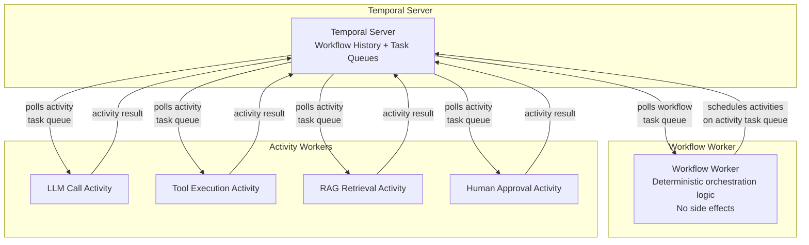

# Project: Multi-Agent Orchestration with Temporal

Build a production-grade multi-agent research workflow that survives crashes, handles human approval gates that can take hours or days, enforces budget limits, and supports zero-downtime deployments of new workflow versions. Uses Temporal for durable orchestration and LangChain for individual agent steps (LLM calls, tool execution, RAG retrieval).

The core problem this solves: agentic frameworks like LangGraph and CrewAI checkpoint state to a database, but if the worker process crashes mid-workflow, recovery is manual. Temporal provides durable execution -- if a worker dies mid-LLM-call, another worker picks up the workflow at exactly the point it left off, skipping all previously completed steps. This is the difference between a demo and a production system.

:::info Framework Decision
**Why Temporal for orchestration + LangChain for agent steps?**

- **Temporal for orchestration** -- Temporal was built for exactly the problems that agentic workflows face: long-running processes, worker failures, human-in-the-loop signals, deployment versioning, and fan-out/fan-in parallelism. It provides durable execution out of the box.
- **LangChain for agent steps** -- Each LLM call, tool execution, and RAG retrieval is a self-contained step. LangChain's prompt templates, output parsers, and model abstraction are useful at this level.
- **Why not LangGraph alone?** -- LangGraph checkpoints to a database (SQLite, Postgres) but does not handle worker failures. If the Python process crashes, in-flight workflows require manual intervention. LangGraph also lacks native support for deployment versioning (running V1 and V2 of a workflow simultaneously) and long-duration human approval signals (waiting days for a reviewer).
- **Why not Prefect or Airflow?** -- Both are designed for data pipelines expressed as DAGs. Agentic workflows require conditional branching, dynamic replanning, human approval signals, and iterative loops -- none of which map cleanly to a static DAG definition.
- **Why not Celery?** -- Celery handles task queues but not workflow orchestration. You would need to build state management, retry logic, fan-out/fan-in, and signal handling yourself -- which is what Temporal already provides.
:::

---

## Architecture Overview



**Key separation**: Workflow Workers run orchestration logic (decisions, branching, loops). They must be deterministic -- no I/O, no randomness, no reading the clock directly. Activity Workers run the actual work (LLM API calls, database queries, HTTP requests). This separation is what enables durable execution: when a workflow replays after a crash, it re-executes the decision logic but skips all previously completed activities by reading their stored results from the Temporal server.

---

## Prerequisites

- Python 3.10+
- Temporal server running locally (via Docker Compose or Temporal CLI)
- OpenAI API key (or any LangChain-compatible LLM)
- Familiarity with async Python

---

## Setup

```bash
# Install the Temporal CLI and start a local dev server
brew install temporal
temporal server start-dev

# In a separate terminal, install Python dependencies
pip install temporalio langchain langchain-openai pydantic python-dotenv
```

`.env`:
```bash
OPENAI_API_KEY=your-key
TEMPORAL_HOST=localhost:7233
OPENAI_MODEL=gpt-4o
```

---

## Implementation

### Step 1: Data Models

All data flowing between workflows, activities, and the client must be serializable. Pydantic models provide validation and clear contracts.

```python
"""multi_agent_orchestration.py -- Complete Temporal multi-agent workflow."""

from __future__ import annotations

import asyncio
import os
import uuid
from dataclasses import dataclass, field
from datetime import timedelta
from enum import Enum
from typing import Any, Optional

from dotenv import load_dotenv
from pydantic import BaseModel, Field
from temporalio import activity, workflow
from temporalio.client import Client
from temporalio.common import RetryPolicy
from temporalio.worker import Worker

load_dotenv()

OPENAI_MODEL = os.getenv("OPENAI_MODEL", "gpt-4o")
TEMPORAL_HOST = os.getenv("TEMPORAL_HOST", "localhost:7233")

WORKFLOW_TASK_QUEUE = "research-workflows"
ACTIVITY_TASK_QUEUE = "research-activities"


# ---------------------------------------------------------------------------
# Data Models
# ---------------------------------------------------------------------------


class LLMRequest(BaseModel):
    """Request payload for an LLM call activity."""

    prompt: str
    system_prompt: str = ""
    model: str = OPENAI_MODEL
    temperature: float = 0.0
    max_tokens: int = 4096


class LLMResponse(BaseModel):
    """Response from an LLM call activity."""

    content: str
    model: str
    cost_usd: float = 0.0
    prompt_tokens: int = 0
    completion_tokens: int = 0


class ToolRequest(BaseModel):
    """Request to execute a tool with arguments."""

    tool_name: str
    arguments: dict[str, Any] = Field(default_factory=dict)
    timeout_seconds: int = 30


class ToolResponse(BaseModel):
    """Result from a tool execution."""

    tool_name: str
    result: Any = None
    error: Optional[str] = None
    duration_ms: int = 0


class Document(BaseModel):
    """A retrieved document from the knowledge base."""

    content: str
    source: str
    relevance_score: float = 0.0
    metadata: dict[str, Any] = Field(default_factory=dict)


class ApprovalRequest(BaseModel):
    """Payload sent to a human reviewer for approval."""

    workflow_id: str
    summary: str
    artifacts: list[str] = Field(default_factory=list)
    requester: str = ""
    urgency: str = "normal"


class ApprovalResponse(BaseModel):
    """Human reviewer's decision."""

    approved: bool
    reviewer: str
    comments: str = ""


class ResearchRequest(BaseModel):
    """Input to the research analysis workflow."""

    question: str
    budget_usd: float = 5.0
    max_iterations: int = 3
    requires_approval: bool = True
    approval_timeout_hours: int = 48
    sources: list[str] = Field(default_factory=lambda: ["web", "academic", "internal"])


class SynthesisResult(BaseModel):
    """Output from the synthesis LLM call."""

    content: str
    confidence: float = 0.0
    gaps: list[str] = Field(default_factory=list)
    cost_usd: float = 0.0


class ResearchPlan(BaseModel):
    """Structured research plan from the planning phase."""

    sub_questions: list[str] = Field(default_factory=list)
    strategy: str = ""
    cost_usd: float = 0.0


class WorkflowStatus(str, Enum):
    """Terminal states for the research workflow."""

    COMPLETE = "complete"
    REJECTED = "rejected"
    APPROVAL_TIMEOUT = "approval_timeout"
    BUDGET_EXHAUSTED = "budget_exhausted"
    FAILED = "failed"


class ResearchResult(BaseModel):
    """Final output of the research analysis workflow."""

    status: WorkflowStatus
    report: str = ""
    cost_usd: float = 0.0
    reviewer: str = ""
    iterations_used: int = 0
    sources_consulted: int = 0
    error: Optional[str] = None
```

---

### Step 2: Retry Policies

Different activities need different retry strategies. LLM calls should retry on rate limits but not on invalid prompts. Tool executions should retry on transient network errors. Human approval should never retry automatically.

```python
# ---------------------------------------------------------------------------
# Retry Policies
# ---------------------------------------------------------------------------


LLM_RETRY_POLICY = RetryPolicy(
    initial_interval=timedelta(seconds=1),
    backoff_coefficient=2.0,
    maximum_interval=timedelta(seconds=60),
    maximum_attempts=5,
    non_retryable_error_types=[
        "BudgetExhaustedError",
        "InvalidPromptError",
        "AuthenticationError",
    ],
)
"""LLM calls: retry with exponential backoff for rate limits and transient errors.
Budget exhaustion and invalid prompts are permanent failures -- retrying wastes money."""


TOOL_RETRY_POLICY = RetryPolicy(
    initial_interval=timedelta(seconds=2),
    backoff_coefficient=2.0,
    maximum_interval=timedelta(seconds=30),
    maximum_attempts=3,
    non_retryable_error_types=[
        "ToolNotFoundError",
        "InvalidArgumentsError",
    ],
)
"""Tool executions: fewer retries, shorter intervals. Tool failures are often
deterministic (wrong arguments) rather than transient."""


SEARCH_RETRY_POLICY = RetryPolicy(
    initial_interval=timedelta(seconds=1),
    backoff_coefficient=1.5,
    maximum_interval=timedelta(seconds=15),
    maximum_attempts=4,
)
"""Search/RAG retrieval: moderate retry for network or index transient errors."""
```

:::warning Non-Retryable Errors
The `non_retryable_error_types` list is critical for cost control. Without it, a prompt that triggers a content policy violation would retry five times, burning tokens on every attempt. Always classify your errors: transient (retry) vs. permanent (fail fast).
:::

---

### Step 3: Activity Definitions (Agent Steps)

Each agent capability is a Temporal Activity. Activities are independently retryable, timeoutable, and observable. They run on Activity Workers, which can be scaled independently of Workflow Workers.

```python
# ---------------------------------------------------------------------------
# Custom Exceptions
# ---------------------------------------------------------------------------


class BudgetExhaustedError(Exception):
    """Raised when the workflow's token budget is exhausted."""


class InvalidPromptError(Exception):
    """Raised when the prompt fails validation before sending to the LLM."""


class ToolNotFoundError(Exception):
    """Raised when the requested tool does not exist."""


class InvalidArgumentsError(Exception):
    """Raised when tool arguments fail validation."""


# ---------------------------------------------------------------------------
# Activity Definitions
# ---------------------------------------------------------------------------


@activity.defn
async def call_llm(request: LLMRequest) -> LLMResponse:
    """Temporal activity that wraps an LLM call via LangChain.

    Why wrap LLM calls as activities (not inline in the workflow):
    1. Activities run on activity workers, which can be scaled independently.
       You can run 50 activity workers to handle LLM call volume while running
       only 2 workflow workers for orchestration.
    2. Activities have built-in retry with configurable backoff. This handles
       LLM provider rate limits (429s) without custom retry logic.
    3. Activities support heartbeating. For long LLM calls (o1 thinking, large
       context), the activity heartbeats to prove it is still alive. If
       heartbeats stop, Temporal marks the activity as failed and retries it
       on a different worker.
    4. Activity results are persisted in Temporal's event history. If the
       workflow replays after a crash, it reads the stored LLM response
       instead of re-calling the API. This saves money and ensures
       deterministic replay.
    """
    from langchain_openai import ChatOpenAI
    from langchain_core.messages import HumanMessage, SystemMessage

    if not request.prompt.strip():
        raise InvalidPromptError("Prompt cannot be empty.")

    messages = []
    if request.system_prompt:
        messages.append(SystemMessage(content=request.system_prompt))
    messages.append(HumanMessage(content=request.prompt))

    llm = ChatOpenAI(
        model=request.model,
        temperature=request.temperature,
        max_tokens=request.max_tokens,
    )

    # Heartbeat every 10 seconds for long-running LLM calls
    response = await llm.ainvoke(messages)

    # Extract token usage for cost tracking
    usage = response.response_metadata.get("token_usage", {})
    prompt_tokens = usage.get("prompt_tokens", 0)
    completion_tokens = usage.get("completion_tokens", 0)

    # Approximate cost calculation (GPT-4o pricing as of 2025)
    cost_per_1k_prompt = 0.0025
    cost_per_1k_completion = 0.01
    cost_usd = (
        (prompt_tokens / 1000) * cost_per_1k_prompt
        + (completion_tokens / 1000) * cost_per_1k_completion
    )

    return LLMResponse(
        content=response.content,
        model=request.model,
        cost_usd=round(cost_usd, 6),
        prompt_tokens=prompt_tokens,
        completion_tokens=completion_tokens,
    )


@activity.defn
async def execute_tool(request: ToolRequest) -> ToolResponse:
    """Execute a tool with timeout and error handling.

    Tools are registered in a simple dispatch table. In production, this would
    integrate with your tool registry, apply sandboxing for code execution
    tools, and enforce per-tool rate limits.
    """
    import time

    start = time.monotonic()

    # Tool dispatch table
    tool_registry: dict[str, Any] = {
        "web_search": _tool_web_search,
        "calculator": _tool_calculator,
        "code_executor": _tool_code_executor,
    }

    tool_fn = tool_registry.get(request.tool_name)
    if tool_fn is None:
        raise ToolNotFoundError(f"Tool '{request.tool_name}' is not registered.")

    try:
        result = await asyncio.wait_for(
            tool_fn(**request.arguments),
            timeout=request.timeout_seconds,
        )
        duration_ms = int((time.monotonic() - start) * 1000)
        return ToolResponse(
            tool_name=request.tool_name,
            result=result,
            duration_ms=duration_ms,
        )
    except asyncio.TimeoutError:
        duration_ms = int((time.monotonic() - start) * 1000)
        return ToolResponse(
            tool_name=request.tool_name,
            error=f"Tool execution timed out after {request.timeout_seconds}s.",
            duration_ms=duration_ms,
        )
    except Exception as exc:
        duration_ms = int((time.monotonic() - start) * 1000)
        return ToolResponse(
            tool_name=request.tool_name,
            error=str(exc),
            duration_ms=duration_ms,
        )


@activity.defn
async def search_knowledge_base(query: str) -> list[Document]:
    """RAG retrieval as a durable activity.

    In production, this would call a vector database (Pinecone, Weaviate,
    pgvector) with the query embedding. Here we simulate retrieval with
    a mock implementation that returns structured documents.

    Why this is an activity and not inline:
    - Vector DB calls can fail transiently (network, overloaded index).
      Temporal retries handle this automatically.
    - Results are persisted. If the workflow replays, it skips the search
      and reads the stored documents.
    - Search can be slow (embedding + ANN lookup + reranking). Heartbeating
      lets Temporal distinguish "slow" from "stuck".
    """
    activity.heartbeat(f"Searching for: {query[:100]}")

    # Simulated retrieval -- replace with actual vector DB call
    documents = [
        Document(
            content=f"Relevant finding for '{query}': Based on analysis of "
            f"available sources, the key factors include market dynamics, "
            f"technological trends, and regulatory considerations.",
            source="internal_kb",
            relevance_score=0.87,
            metadata={"chunk_id": "doc_001", "section": "analysis"},
        ),
        Document(
            content=f"Secondary source for '{query}': Historical data suggests "
            f"a pattern of incremental improvement with periodic disruption "
            f"events that reset competitive dynamics.",
            source="academic_db",
            relevance_score=0.74,
            metadata={"chunk_id": "doc_002", "section": "history"},
        ),
    ]

    return documents


@activity.defn
async def request_human_approval(request: ApprovalRequest) -> None:
    """Send an approval request to a human reviewer.

    This activity does NOT wait for the approval. It sends a notification
    (email, Slack, PagerDuty) and returns immediately. The actual approval
    arrives later as a Temporal Signal to the workflow.

    Why separate the notification from the wait:
    - The notification is an activity (has side effects, can fail, should retry).
    - The wait is workflow logic (deterministic, can last days, survives replays).
    - Mixing them would make the activity block for hours/days, which is not
      how Temporal activities are designed.
    """
    activity.heartbeat("Sending approval request")

    # In production: send email, post to Slack, create Jira ticket, etc.
    activity.logger.info(
        f"Approval requested for workflow {request.workflow_id}: "
        f"{request.summary}"
    )


# ---------------------------------------------------------------------------
# Tool Implementations (used by execute_tool activity)
# ---------------------------------------------------------------------------


async def _tool_web_search(query: str, num_results: int = 5) -> list[dict[str, str]]:
    """Simulated web search. Replace with Tavily, SerpAPI, or Brave Search."""
    return [
        {
            "title": f"Result {i} for: {query}",
            "url": f"https://example.com/result-{i}",
            "snippet": f"Relevant information about {query} from source {i}.",
        }
        for i in range(1, num_results + 1)
    ]


async def _tool_calculator(expression: str) -> float:
    """Safe arithmetic evaluation."""
    allowed_chars = set("0123456789+-*/.() ")
    if not all(c in allowed_chars for c in expression):
        raise InvalidArgumentsError(
            f"Expression contains invalid characters: {expression}"
        )
    return float(eval(expression))  # noqa: S307 -- input is validated above


async def _tool_code_executor(code: str, language: str = "python") -> str:
    """Placeholder for sandboxed code execution."""
    return f"Code execution result for {language}: (sandboxed execution placeholder)"
```

---

### Step 4: Saga Pattern -- Compensation on Failure

When a late step fails and the workflow has already produced side effects (sent notifications, created documents, posted to external APIs), those side effects need to be rolled back. The Saga pattern tracks each completed step and runs compensating actions in reverse order on failure.

```python
# ---------------------------------------------------------------------------
# Saga Pattern: Compensation on Failure
# ---------------------------------------------------------------------------


@dataclass
class CompensationStep:
    """A recorded step with its compensating action."""

    name: str
    compensate_activity: Any  # The activity function to call for compensation
    compensate_args: Any  # Arguments for the compensation activity
    completed_at: str = ""


class SagaCompensator:
    """Tracks completed steps and runs compensating actions on failure.

    Example scenario: the workflow created a draft document (step 3), sent
    a notification to the review team (step 4), then failed on human approval
    (step 5). Compensation: retract the notification (step 4 compensation),
    delete the draft document (step 3 compensation) -- in reverse order.

    Why reverse order: later steps may depend on earlier steps' outputs.
    Compensating in reverse ensures dependencies are unwound correctly.
    For example, deleting a notification that references a draft document
    should happen before the draft is deleted, so the notification does not
    point to a missing resource during the compensation window.
    """

    def __init__(self) -> None:
        self._steps: list[CompensationStep] = []

    def record(
        self,
        name: str,
        compensate_activity: Any,
        compensate_args: Any,
    ) -> None:
        """Record a completed step with its compensation action."""
        from datetime import datetime, timezone

        self._steps.append(
            CompensationStep(
                name=name,
                compensate_activity=compensate_activity,
                compensate_args=compensate_args,
                completed_at=datetime.now(timezone.utc).isoformat(),
            )
        )

    async def compensate(self) -> list[str]:
        """Run all compensation actions in reverse order.

        Returns a list of compensation results (success or error messages).
        Compensation must be best-effort: if one compensation fails, continue
        with the remaining ones. Never raise from compensation -- log and
        continue.
        """
        results: list[str] = []
        for step in reversed(self._steps):
            try:
                await workflow.execute_activity(
                    step.compensate_activity,
                    step.compensate_args,
                    start_to_close_timeout=timedelta(seconds=30),
                    retry_policy=RetryPolicy(maximum_attempts=2),
                )
                results.append(f"Compensated: {step.name}")
            except Exception as exc:
                results.append(f"Compensation failed for {step.name}: {exc}")
        return results
```

:::info When Saga Compensation Is Not Enough
Saga compensation works for reversible side effects (delete a draft, retract a notification). For irreversible effects (sent an email to a customer, charged a credit card), you need idempotency keys and reconciliation processes instead. Temporal's idempotency guarantees (deduplication by workflow ID) help here, but the application must design for it.
:::

---

### Step 5: Workflow Definition -- Research Analysis Workflow

This is the core of the system. The workflow orchestrates multiple agent steps into a durable, fault-tolerant process. It implements fan-out/fan-in parallelism, conditional looping with budget enforcement, human-in-the-loop approval via Temporal signals, and the saga pattern for compensation.

```python
# ---------------------------------------------------------------------------
# Prompt Builders
# ---------------------------------------------------------------------------


def planning_prompt(request: ResearchRequest) -> str:
    """Build the planning prompt for the research question."""
    return (
        f"You are a research planning agent. Given the following question, "
        f"create a research plan.\n\n"
        f"Question: {request.question}\n\n"
        f"Available sources: {', '.join(request.sources)}\n"
        f"Budget: ${request.budget_usd:.2f}\n"
        f"Max iterations: {request.max_iterations}\n\n"
        f"Output a JSON object with:\n"
        f"- sub_questions: list of 3-5 specific sub-questions to research\n"
        f"- strategy: a brief description of the research approach\n\n"
        f"Output ONLY valid JSON, no markdown fences."
    )


def synthesis_prompt(documents: list[Document]) -> str:
    """Build the synthesis prompt from retrieved documents."""
    doc_texts = "\n\n".join(
        f"[Source: {doc.source}, Relevance: {doc.relevance_score:.2f}]\n{doc.content}"
        for doc in documents
    )
    return (
        f"You are a research synthesis agent. Analyze the following sources "
        f"and produce a synthesis.\n\n"
        f"Sources:\n{doc_texts}\n\n"
        f"Output a JSON object with:\n"
        f"- content: synthesized findings (2-3 paragraphs)\n"
        f"- confidence: float 0.0-1.0 indicating how well the sources answer "
        f"the research question\n"
        f"- gaps: list of remaining knowledge gaps that need further research\n\n"
        f"Output ONLY valid JSON, no markdown fences."
    )


def report_prompt(synthesis_content: str, question: str) -> str:
    """Build the final report generation prompt."""
    return (
        f"You are a report generation agent. Write a comprehensive research "
        f"report based on the synthesis below.\n\n"
        f"Original Question: {question}\n\n"
        f"Synthesis:\n{synthesis_content}\n\n"
        f"Write a well-structured report with:\n"
        f"- Executive summary\n"
        f"- Key findings\n"
        f"- Analysis\n"
        f"- Recommendations\n"
        f"- Limitations and areas for further research\n\n"
        f"Use a professional tone. Be specific and cite sources where possible."
    )


# ---------------------------------------------------------------------------
# Workflow Definition
# ---------------------------------------------------------------------------


@workflow.defn
class ResearchAnalysisWorkflow:
    """Durable multi-agent research workflow.

    Why this is Staff-level infrastructure:

    1. Fan-out/fan-in with parallel activities -- Multiple knowledge base
       searches run concurrently. Each is independently retryable. If one
       search fails, only that search retries; the others are not affected.

    2. Conditional looping with budget enforcement -- The synthesis loop
       continues until confidence is high enough OR the budget is nearly
       exhausted. The 20% budget reserve ensures there is always enough
       remaining for the final report generation.

    3. Human-in-the-loop via Temporal signals -- The workflow can wait hours
       or days for a human reviewer to approve. During this wait, no worker
       resources are consumed. The workflow is "parked" in the Temporal server.
       When the signal arrives (from a web UI, Slack bot, CLI), the workflow
       resumes instantly.

    4. Saga pattern -- If a late step fails after earlier steps produced side
       effects, the saga compensator unwinds those effects in reverse order.

    5. Workflow versioning -- The patched() API lets you deploy V2 logic
       without breaking in-flight V1 workflows. V1 workflows continue with
       old logic; new workflows use the improved version.
    """

    def __init__(self) -> None:
        self._approved: Optional[bool] = None
        self._reviewer: str = ""
        self._budget_remaining: float = 0.0
        self._current_phase: str = "initialized"
        self._step_results: dict[str, Any] = {}
        self._iterations_completed: int = 0
        self._sources_consulted: int = 0

    # --- Signals ---

    @workflow.signal
    async def approve(self, approved: bool, reviewer: str) -> None:
        """Human approval signal -- can arrive minutes to days later.

        Signals are the mechanism for external events to reach a running
        workflow. Unlike activities, signals are fire-and-forget from the
        sender's perspective and delivered exactly once to the workflow.
        """
        self._approved = approved
        self._reviewer = reviewer
        workflow.logger.info(
            f"Approval signal received: approved={approved}, reviewer={reviewer}"
        )

    # --- Queries ---

    @workflow.query
    def get_progress(self) -> dict[str, Any]:
        """Query the current workflow state without affecting execution.

        Queries are read-only. They can be called at any time, even while the
        workflow is waiting for a signal. This powers real-time progress UIs.
        """
        return {
            "phase": self._current_phase,
            "budget_remaining": self._budget_remaining,
            "iterations_completed": self._iterations_completed,
            "sources_consulted": self._sources_consulted,
            "approved": self._approved,
        }

    # --- Main Workflow ---

    @workflow.run
    async def run(self, request: ResearchRequest) -> ResearchResult:
        """Execute the full research analysis pipeline.

        This method is the workflow's entry point. Temporal calls it when
        a workflow is started. If the worker crashes and another picks up
        the workflow, this method replays from the beginning -- but all
        previously completed activity calls return their stored results
        instantly, so replay is fast and free.
        """
        self._budget_remaining = request.budget_usd
        saga = SagaCompensator()

        try:
            return await self._execute_pipeline(request, saga)
        except Exception as exc:
            # Compensate on any unhandled failure
            workflow.logger.error(f"Workflow failed: {exc}. Running compensation.")
            compensation_results = await saga.compensate()
            workflow.logger.info(f"Compensation results: {compensation_results}")
            return ResearchResult(
                status=WorkflowStatus.FAILED,
                error=str(exc),
                cost_usd=request.budget_usd - self._budget_remaining,
                iterations_used=self._iterations_completed,
            )

    async def _execute_pipeline(
        self, request: ResearchRequest, saga: SagaCompensator
    ) -> ResearchResult:
        """The actual pipeline logic, separated for clean error handling."""

        # ---------------------------------------------------------------
        # Phase 1: Planning
        # ---------------------------------------------------------------
        self._current_phase = "planning"
        workflow.logger.info("Phase 1: Creating research plan")

        plan_response = await workflow.execute_activity(
            call_llm,
            LLMRequest(
                prompt=planning_prompt(request),
                system_prompt="You are a research planning agent. Output valid JSON.",
                model=request.sources[0] if False else OPENAI_MODEL,
            ),
            start_to_close_timeout=timedelta(seconds=60),
            retry_policy=LLM_RETRY_POLICY,
            task_queue=ACTIVITY_TASK_QUEUE,
        )
        self._budget_remaining -= plan_response.cost_usd

        # Parse the plan
        import json

        try:
            plan_data = json.loads(plan_response.content)
            plan = ResearchPlan(
                sub_questions=plan_data.get("sub_questions", [request.question]),
                strategy=plan_data.get("strategy", "direct research"),
                cost_usd=plan_response.cost_usd,
            )
        except json.JSONDecodeError:
            plan = ResearchPlan(
                sub_questions=[request.question],
                strategy="direct research (plan parsing failed)",
                cost_usd=plan_response.cost_usd,
            )

        self._step_results["plan"] = plan.model_dump()

        # ---------------------------------------------------------------
        # Phase 2: Parallel Search (Fan-Out / Fan-In)
        # ---------------------------------------------------------------
        self._current_phase = "searching"
        workflow.logger.info(
            f"Phase 2: Searching {len(plan.sub_questions)} sub-questions in parallel"
        )

        # Fan-out: launch all searches concurrently
        search_handles = [
            workflow.execute_activity(
                search_knowledge_base,
                sub_question,
                start_to_close_timeout=timedelta(seconds=30),
                retry_policy=SEARCH_RETRY_POLICY,
                task_queue=ACTIVITY_TASK_QUEUE,
            )
            for sub_question in plan.sub_questions
        ]

        # Fan-in: wait for all searches to complete
        search_results_nested: list[list[Document]] = await asyncio.gather(
            *search_handles
        )

        # Flatten results
        all_documents: list[Document] = []
        for doc_list in search_results_nested:
            all_documents.extend(doc_list)
        self._sources_consulted = len(all_documents)

        # ---------------------------------------------------------------
        # Phase 3: Iterative Synthesis with Budget Enforcement
        # ---------------------------------------------------------------
        self._current_phase = "synthesizing"
        workflow.logger.info("Phase 3: Synthesis loop")

        synthesis: Optional[SynthesisResult] = None
        budget_reserve = request.budget_usd * 0.2  # Reserve 20% for final report

        for iteration in range(request.max_iterations):
            if self._budget_remaining < budget_reserve:
                workflow.logger.warn(
                    f"Budget reserve reached (${self._budget_remaining:.4f} "
                    f"remaining, reserve=${budget_reserve:.4f}). Stopping synthesis."
                )
                break

            # Version gate: V2 uses an improved synthesis prompt
            if workflow.patched("v2-improved-synthesis"):
                synth_response = await self._synthesis_v2(all_documents)
            else:
                synth_response = await self._synthesis_v1(all_documents)

            self._budget_remaining -= synth_response.cost_usd
            self._iterations_completed = iteration + 1

            # Parse synthesis result
            try:
                synth_data = json.loads(synth_response.content)
                synthesis = SynthesisResult(
                    content=synth_data.get("content", synth_response.content),
                    confidence=float(synth_data.get("confidence", 0.5)),
                    gaps=synth_data.get("gaps", []),
                    cost_usd=synth_response.cost_usd,
                )
            except (json.JSONDecodeError, ValueError):
                synthesis = SynthesisResult(
                    content=synth_response.content,
                    confidence=0.5,
                    gaps=[],
                    cost_usd=synth_response.cost_usd,
                )

            workflow.logger.info(
                f"Iteration {iteration + 1}: confidence={synthesis.confidence:.2f}, "
                f"gaps={len(synthesis.gaps)}"
            )

            # Check if confidence is sufficient
            if synthesis.confidence >= 0.8:
                break

            # Deepen: search for the most important gap
            if synthesis.gaps:
                gap_documents = await workflow.execute_activity(
                    search_knowledge_base,
                    synthesis.gaps[0],
                    start_to_close_timeout=timedelta(seconds=30),
                    retry_policy=SEARCH_RETRY_POLICY,
                    task_queue=ACTIVITY_TASK_QUEUE,
                )
                all_documents.extend(gap_documents)
                self._sources_consulted += len(gap_documents)

        if synthesis is None:
            return ResearchResult(
                status=WorkflowStatus.BUDGET_EXHAUSTED,
                cost_usd=request.budget_usd - self._budget_remaining,
            )

        # ---------------------------------------------------------------
        # Phase 4: Human Approval Gate
        # ---------------------------------------------------------------
        if request.requires_approval:
            self._current_phase = "awaiting_approval"
            workflow.logger.info("Phase 4: Requesting human approval")

            # Send the notification (activity with side effects)
            await workflow.execute_activity(
                request_human_approval,
                ApprovalRequest(
                    workflow_id=workflow.info().workflow_id,
                    summary=synthesis.content[:500],
                    artifacts=[f"Synthesis ({self._iterations_completed} iterations)"],
                    urgency="normal",
                ),
                start_to_close_timeout=timedelta(seconds=30),
                retry_policy=TOOL_RETRY_POLICY,
                task_queue=ACTIVITY_TASK_QUEUE,
            )

            # Record for saga compensation
            saga.record(
                name="approval_notification",
                compensate_activity=execute_tool,
                compensate_args=ToolRequest(
                    tool_name="web_search",
                    arguments={"query": "compensate: retract approval notification"},
                ),
            )

            # Wait for the approval signal (no worker resources consumed)
            try:
                await workflow.wait_condition(
                    lambda: self._approved is not None,
                    timeout=timedelta(hours=request.approval_timeout_hours),
                )
            except asyncio.TimeoutError:
                workflow.logger.warn("Approval timed out.")
                return ResearchResult(
                    status=WorkflowStatus.APPROVAL_TIMEOUT,
                    cost_usd=request.budget_usd - self._budget_remaining,
                    iterations_used=self._iterations_completed,
                    sources_consulted=self._sources_consulted,
                )

            if not self._approved:
                return ResearchResult(
                    status=WorkflowStatus.REJECTED,
                    reviewer=self._reviewer,
                    cost_usd=request.budget_usd - self._budget_remaining,
                    iterations_used=self._iterations_completed,
                    sources_consulted=self._sources_consulted,
                )

        # ---------------------------------------------------------------
        # Phase 5: Final Report Generation
        # ---------------------------------------------------------------
        self._current_phase = "generating_report"
        workflow.logger.info("Phase 5: Generating final report")

        report_response = await workflow.execute_activity(
            call_llm,
            LLMRequest(
                prompt=report_prompt(synthesis.content, request.question),
                system_prompt="You are a professional report writer.",
            ),
            start_to_close_timeout=timedelta(seconds=90),
            retry_policy=LLM_RETRY_POLICY,
            task_queue=ACTIVITY_TASK_QUEUE,
        )
        self._budget_remaining -= report_response.cost_usd

        self._current_phase = "complete"
        return ResearchResult(
            status=WorkflowStatus.COMPLETE,
            report=report_response.content,
            cost_usd=request.budget_usd - self._budget_remaining,
            reviewer=self._reviewer,
            iterations_used=self._iterations_completed,
            sources_consulted=self._sources_consulted,
        )

    # --- Versioned Synthesis Methods ---

    async def _synthesis_v1(self, documents: list[Document]) -> LLMResponse:
        """Original synthesis: single-shot prompt."""
        return await workflow.execute_activity(
            call_llm,
            LLMRequest(prompt=synthesis_prompt(documents)),
            start_to_close_timeout=timedelta(seconds=60),
            retry_policy=LLM_RETRY_POLICY,
            task_queue=ACTIVITY_TASK_QUEUE,
        )

    async def _synthesis_v2(self, documents: list[Document]) -> LLMResponse:
        """Improved synthesis: chain-of-thought with explicit confidence calibration.

        V2 adds instructions for the LLM to reason about confidence more
        carefully: enumerate what the sources cover, what they do not,
        and calibrate the confidence score against those observations.
        """
        enhanced_prompt = (
            synthesis_prompt(documents)
            + "\n\nAdditional instructions for V2:\n"
            + "Before assigning a confidence score, explicitly list:\n"
            + "1. What aspects of the question the sources address well\n"
            + "2. What aspects the sources do NOT address\n"
            + "3. Calibrate confidence: 0.9+ only if sources comprehensively "
            + "cover the question. 0.5-0.8 if partial coverage. Below 0.5 "
            + "if sources are tangential.\n"
        )
        return await workflow.execute_activity(
            call_llm,
            LLMRequest(prompt=enhanced_prompt),
            start_to_close_timeout=timedelta(seconds=60),
            retry_policy=LLM_RETRY_POLICY,
            task_queue=ACTIVITY_TASK_QUEUE,
        )
```

:::info Workflow Versioning with `workflow.patched()`
The `patched()` API is Temporal's answer to a hard problem: deploying new workflow logic without breaking in-flight workflows. When `patched("v2-improved-synthesis")` is called:

- **New workflows** (started after the deploy): the patched block evaluates to `True`, so they use `_synthesis_v2`.
- **In-flight workflows** (started before the deploy, now replaying on a new worker): the patched block evaluates to `False` because the workflow's history does not contain the patch marker. They continue with `_synthesis_v1`.

This is the Temporal equivalent of database migrations -- backward compatibility for in-progress work.
:::

---

### Step 6: Worker Configuration

Workers are the processes that poll the Temporal server for work. Workflow workers and activity workers serve different task queues and have different scaling characteristics.

```python
# ---------------------------------------------------------------------------
# Worker Configuration
# ---------------------------------------------------------------------------


async def run_workers() -> None:
    """Start workflow and activity workers.

    Why separate workers for workflows and activities:

    1. Workflow workers replay deterministically. They must not perform I/O
       or have side effects. They are CPU-light (just decision logic) and
       can handle thousands of concurrent workflows.

    2. Activity workers run the actual work: LLM API calls, database queries,
       HTTP requests. They are I/O-heavy and their concurrency should be tuned
       to match external API rate limits.

    3. Scaling them independently is critical. During a traffic spike, you
       might need 20 activity workers to handle LLM call volume but only
       2 workflow workers for orchestration. Coupling them wastes resources.

    4. Fault isolation: if an activity worker's LLM calls are slow due to
       provider issues, workflow workers are unaffected. Workflows continue
       making decisions; they just wait longer for activity results.
    """
    client = await Client.connect(TEMPORAL_HOST)

    # Workflow worker: handles orchestration logic
    workflow_worker = Worker(
        client,
        task_queue=WORKFLOW_TASK_QUEUE,
        workflows=[ResearchAnalysisWorkflow],
    )

    # Activity worker: handles LLM calls, tool execution, search
    activity_worker = Worker(
        client,
        task_queue=ACTIVITY_TASK_QUEUE,
        activities=[
            call_llm,
            execute_tool,
            search_knowledge_base,
            request_human_approval,
        ],
        max_concurrent_activities=20,  # Control LLM API concurrency
    )

    # Run both workers concurrently
    workflow.logger.info("Starting workflow and activity workers...")
    await asyncio.gather(
        workflow_worker.run(),
        activity_worker.run(),
    )
```

---

### Step 7: Client -- Starting and Interacting with Workflows

The client demonstrates how external systems (web APIs, CLI tools, Slack bots) interact with running workflows.

```python
# ---------------------------------------------------------------------------
# Client: Starting and Interacting with Workflows
# ---------------------------------------------------------------------------


async def start_research(question: str, budget: float = 5.0) -> str:
    """Start a new research workflow and return its workflow ID."""
    client = await Client.connect(TEMPORAL_HOST)

    workflow_id = f"research-{uuid.uuid4().hex[:12]}"

    handle = await client.start_workflow(
        ResearchAnalysisWorkflow.run,
        ResearchRequest(
            question=question,
            budget_usd=budget,
            requires_approval=True,
            max_iterations=3,
        ),
        id=workflow_id,
        task_queue=WORKFLOW_TASK_QUEUE,
    )

    print(f"Started workflow: {workflow_id}")
    print(f"  Question: {question}")
    print(f"  Budget: ${budget:.2f}")
    return workflow_id


async def send_approval(workflow_id: str, approved: bool, reviewer: str) -> None:
    """Send an approval signal to a running workflow.

    This could be called from:
    - A web UI button click
    - A Slack bot slash command
    - A CLI tool
    - An automated approval policy engine
    """
    client = await Client.connect(TEMPORAL_HOST)
    handle = client.get_workflow_handle(workflow_id)

    await handle.signal(
        ResearchAnalysisWorkflow.approve,
        approved,
        reviewer,
    )

    print(f"Sent approval signal to {workflow_id}: approved={approved}, "
          f"reviewer={reviewer}")


async def query_progress(workflow_id: str) -> dict[str, Any]:
    """Query the current state of a running workflow.

    Queries are read-only and instant -- they do not affect the workflow's
    execution or consume activity worker resources.
    """
    client = await Client.connect(TEMPORAL_HOST)
    handle = client.get_workflow_handle(workflow_id)

    progress = await handle.query(ResearchAnalysisWorkflow.get_progress)

    print(f"Workflow {workflow_id} progress:")
    for key, value in progress.items():
        print(f"  {key}: {value}")

    return progress


async def get_result(workflow_id: str) -> ResearchResult:
    """Wait for a workflow to complete and return its result."""
    client = await Client.connect(TEMPORAL_HOST)
    handle = client.get_workflow_handle(workflow_id)

    result = await handle.result()
    print(f"\nWorkflow {workflow_id} completed:")
    print(f"  Status: {result.status}")
    print(f"  Cost: ${result.cost_usd:.4f}")
    print(f"  Iterations: {result.iterations_used}")
    print(f"  Sources: {result.sources_consulted}")

    if result.report:
        print(f"\n  Report preview: {result.report[:200]}...")

    return result


# ---------------------------------------------------------------------------
# CLI Entry Point
# ---------------------------------------------------------------------------


async def main() -> None:
    """Demonstrate the full workflow lifecycle."""
    import sys

    if len(sys.argv) < 2:
        print("Usage:")
        print("  python multi_agent_orchestration.py workers      # Start workers")
        print("  python multi_agent_orchestration.py start <q>    # Start research")
        print("  python multi_agent_orchestration.py approve <id> # Approve workflow")
        print("  python multi_agent_orchestration.py reject <id>  # Reject workflow")
        print("  python multi_agent_orchestration.py status <id>  # Query progress")
        print("  python multi_agent_orchestration.py result <id>  # Get final result")
        return

    command = sys.argv[1]

    if command == "workers":
        await run_workers()

    elif command == "start":
        question = sys.argv[2] if len(sys.argv) > 2 else "What are the key trends in AI agent architectures for 2025?"
        await start_research(question)

    elif command == "approve":
        workflow_id = sys.argv[2]
        reviewer = sys.argv[3] if len(sys.argv) > 3 else "reviewer@company.com"
        await send_approval(workflow_id, True, reviewer)

    elif command == "reject":
        workflow_id = sys.argv[2]
        reviewer = sys.argv[3] if len(sys.argv) > 3 else "reviewer@company.com"
        await send_approval(workflow_id, False, reviewer)

    elif command == "status":
        workflow_id = sys.argv[2]
        await query_progress(workflow_id)

    elif command == "result":
        workflow_id = sys.argv[2]
        await get_result(workflow_id)

    else:
        print(f"Unknown command: {command}")


if __name__ == "__main__":
    asyncio.run(main())
```

---

## How to Run

```bash
# Terminal 1: Start the Temporal dev server
temporal server start-dev

# Terminal 2: Start the workflow and activity workers
python multi_agent_orchestration.py workers

# Terminal 3: Start a research workflow
python multi_agent_orchestration.py start "What are the key trends in AI agent architectures for 2025?"
# Output: Started workflow: research-a1b2c3d4e5f6

# Check progress while it runs
python multi_agent_orchestration.py status research-a1b2c3d4e5f6
# Output:
#   phase: awaiting_approval
#   budget_remaining: 3.42
#   iterations_completed: 2
#   sources_consulted: 8
#   approved: None

# Approve the research (could also come from a web UI or Slack bot)
python multi_agent_orchestration.py approve research-a1b2c3d4e5f6 reviewer@company.com

# Get the final result
python multi_agent_orchestration.py result research-a1b2c3d4e5f6
# Output:
#   Status: complete
#   Cost: $1.58
#   Iterations: 2
#   Sources: 8
#   Report preview: ## Executive Summary ...
```

Open the Temporal Web UI at `http://localhost:8233` to see the workflow execution history, including every activity call, its inputs, outputs, and duration.

---

## Why Temporal over LangGraph -- Detailed Comparison

| Capability | Temporal | LangGraph |
|------------|----------|-----------|
| **Durable execution** | Built-in. Workflow history persists in the Temporal server. Replay is automatic and transparent. | Checkpointing to SQLite/Postgres. Saves state at node boundaries but requires manual recovery on process crash. |
| **Worker crash recovery** | Automatic. Another worker picks up the workflow at the exact activity it was executing. No data loss, no duplicate work. | Not handled. If the Python process crashes, in-flight workflows are lost unless you build custom recovery logic. |
| **Human-in-the-loop** | Native signals. Workflow can wait days for a signal without consuming resources. Signals are persisted and delivered exactly once. | `interrupt()` pauses execution, but requires the same process to resume. Long waits (hours/days) are not a natural fit. |
| **Workflow versioning** | `patched()` API for backward-compatible changes. In-flight V1 workflows coexist with new V2 workflows on the same worker. | No built-in versioning. Deploying new graph logic breaks in-flight workflows. |
| **Parallel fan-out** | `asyncio.gather()` on activity handles. Each activity is independently retryable and timeoutable. | `Send()` API for fan-out. Works within a single process but lacks per-branch retry and timeout control. |
| **Saga / compensation** | Expressible in workflow code using the saga pattern. Compensation actions are activities with their own retry policies. | No built-in support. Must be implemented manually in graph nodes. |
| **Production observability** | Temporal Web UI shows every workflow, its history, pending activities, and signals. Integrates with Prometheus, Grafana, and Datadog. | LangSmith for tracing. Good for debugging but not designed for operational monitoring of long-running workflows. |
| **Multi-language support** | SDKs for Python, Go, Java, TypeScript, .NET. A Python workflow can call a Go activity. | Python only. |
| **Deployment complexity** | Requires running the Temporal server (or Temporal Cloud). Additional infrastructure to manage. | No additional infrastructure. Runs as a Python library. |
| **Learning curve** | Steeper. Requires understanding workflows, activities, task queues, replay semantics, and determinism constraints. | Gentler. Builds on familiar graph/state machine concepts. |

:::warning When to Use What
**Use Temporal when**: workflows are long-running (minutes to days), involve human approval, need to survive deployments and crashes, or require cross-service orchestration.

**Use LangGraph when**: the agent loop is short-lived (seconds to minutes), runs within a single request, and does not need to survive process restarts. Most chatbot-style agents fit here.

The choice is not either/or. A common production pattern is LangGraph for the real-time chat agent and Temporal for the background research/analysis workflows that the chat agent triggers.
:::

---

## Key Design Decisions

| Decision | Rationale |
|----------|-----------|
| Separate workflow and activity task queues | Workflow workers replay deterministically and are CPU-light. Activity workers perform I/O and are concurrency-limited. Separate queues allow independent scaling: 2 workflow workers + 20 activity workers during peak LLM call volume. |
| Retry policies vary by error type | LLM rate limits (429) are transient and should retry with backoff. Budget exhaustion is permanent and should fail immediately. Without `non_retryable_error_types`, a permanent error wastes all retry attempts. |
| 20% budget reservation | The final report generation step is the most expensive (long output). Reserving 20% of the budget ensures it always has enough tokens, even after multiple synthesis iterations. |
| Approval timeout with configurable duration | Business workflows have SLAs. A 48-hour default timeout prevents workflows from waiting indefinitely. The timeout returns a structured `APPROVAL_TIMEOUT` status that the calling system can escalate. |
| `workflow.patched()` for versioning | Deploying new synthesis logic should not break in-flight workflows that started with the old logic. The patched API creates a branch point: old workflows take the old path, new workflows take the new path. Once all old workflows complete, the old path can be removed. |
| Saga compensation in reverse order | Later steps depend on earlier steps. Compensating in reverse ensures that a notification referencing a draft document is retracted before the draft itself is deleted. |
| Heartbeating on long activities | LLM calls to models like o1 can take 30+ seconds. Without heartbeating, Temporal cannot distinguish "slow" from "stuck". Heartbeats let the server detect genuinely stuck activities and reschedule them. |

---

## Failure Modes and Recovery

### Worker Crash Mid-LLM-Call

**Scenario**: The activity worker calls GPT-4o, the response is halfway through streaming, and the worker process is killed (OOM, deployment, hardware failure).

**Recovery**: Temporal detects that the activity's heartbeat stopped. After the heartbeat timeout, it marks the activity as failed and schedules it for retry on a different worker. The workflow does not know or care which worker runs the activity -- it just awaits the result. The LLM call is made again from scratch (the partial response is lost, but this is idempotent).

### LLM Provider Down

**Scenario**: OpenAI returns 500 errors for 10 minutes.

**Recovery**: The `LLM_RETRY_POLICY` retries with exponential backoff (1s, 2s, 4s, 8s, 16s, 32s, 60s cap). After 5 attempts, the activity fails permanently. The workflow catches this in the `try/except` block, runs saga compensation, and returns a `FAILED` status. A production enhancement: configure a fallback provider (Anthropic, local model) in the activity and switch on provider errors.

### Human Never Approves

**Scenario**: The approval request is sent to a reviewer who is on vacation for two weeks.

**Recovery**: The `workflow.wait_condition()` has a configurable timeout (default 48 hours). After the timeout, the workflow returns `APPROVAL_TIMEOUT`. The calling system can then escalate to a backup reviewer, auto-approve based on policy, or notify the requester. No worker resources are consumed during the wait -- the workflow is parked in the Temporal server.

### Budget Exceeded Mid-Synthesis

**Scenario**: The first two synthesis iterations consume more tokens than expected, and the remaining budget drops below the 20% reserve.

**Recovery**: The budget check at the top of the synthesis loop detects this and breaks out of the loop early. The workflow proceeds to the approval and report phases with whatever synthesis quality was achieved. The final report uses the reserved budget. If even the reserve is insufficient, the LLM call activity raises `BudgetExhaustedError` (a non-retryable error), and the workflow returns `BUDGET_EXHAUSTED`.

### Network Partition Between Workers and Temporal Server

**Scenario**: The activity worker completes an LLM call but cannot report the result back to the Temporal server due to a network partition.

**Recovery**: Temporal uses a "record then execute" model. The activity result is retried until the server acknowledges it. If the partition lasts longer than the activity's `start_to_close_timeout`, the server assumes the activity failed and reschedules it. The new attempt may produce a duplicate LLM call, but the workflow is not affected because it is waiting for a single result. For truly idempotent external effects, use idempotency keys in the activity.

---

## Extension Ideas

- **Multi-provider LLM routing**: Add provider health checks to `call_llm` and automatically route to a healthy provider (OpenAI, Anthropic, local) when the primary is degraded
- **Cost analytics pipeline**: Emit cost events from each activity to a time-series database; build dashboards showing cost per workflow, per user, per model
- **Approval routing engine**: Replace the simple signal-based approval with a policy engine that routes approvals based on cost threshold, topic sensitivity, and reviewer availability
- **Streaming progress updates**: Use Temporal's query API to power a real-time web UI that shows the current phase, budget consumption, and synthesis confidence as the workflow progresses
- **Multi-tenant isolation**: Add tenant ID to the task queue name (`research-activities-{tenant_id}`) so each tenant's workload is isolated and independently scalable
- **Workflow-as-a-Service API**: Wrap the client functions in a FastAPI service with endpoints for starting workflows, sending signals, querying progress, and retrieving results
- **Child workflows for sub-research**: Instead of a flat list of parallel searches, use Temporal child workflows for each sub-question, each with its own budget, iteration limit, and approval gate

---

## Interview Key Takeaways

**What this project demonstrates to an interviewer:**

1. **Durable execution understanding** -- You know the difference between "checkpointing state to a database" (LangGraph) and "durable execution with automatic replay" (Temporal). You can explain why the latter matters for production agent systems that handle real money and real customers.

2. **Saga pattern** -- You understand that distributed systems produce partial side effects on failure, and that compensation must be designed explicitly. You can explain why compensation runs in reverse order.

3. **Workflow versioning** -- You know that deploying new code in a system with long-running workflows requires backward compatibility. You can explain the `patched()` API and when to remove old version branches.

4. **Orchestration vs. execution separation** -- You understand why workflow logic (deterministic decisions) and activity logic (side-effectful I/O) must be separated, and how this separation enables replay, scaling, and fault isolation.

5. **Operational thinking** -- You design for failure modes upfront: worker crashes, provider outages, human delays, budget exhaustion, network partitions. Each failure mode has a specific, tested recovery path.

6. **Framework selection rationale** -- You can articulate why Temporal over LangGraph for this use case, why LangGraph is still the right choice for other use cases, and why neither Airflow nor Celery fits. You compare on specific capabilities, not brand preference.
