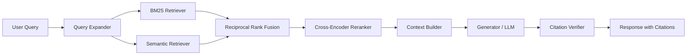
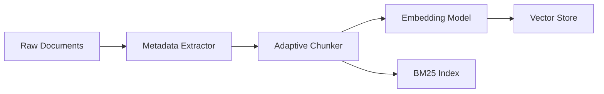

# Project: Production RAG Engine

Build a production-grade Retrieval-Augmented Generation engine that goes far beyond "embed, retrieve, generate." This project covers hybrid search (BM25 + semantic with reciprocal rank fusion), cross-encoder reranking, adaptive chunking, citation verification, hallucination grounding, and an evaluation-driven feedback loop. This is the most common production pattern in agentic AI and the one where Staff engineers add the most value through retrieval optimization.

:::info Framework Decision
**Why Custom Python with sentence-transformers, rank_bm25, chromadb, and cross-encoder?**
- **sentence-transformers for embeddings** -- Full control over model selection, quantization, and batching. Swap between `all-MiniLM-L6-v2` (fast, 384-dim) and `e5-large-v2` (accurate, 1024-dim) without changing a line of retrieval code.
- **rank_bm25 for lexical search** -- Pure Python BM25 Okapi implementation. No external search engine dependency (Elasticsearch, Solr) for prototype and mid-scale deployments.
- **chromadb or pgvector for vector storage** -- ChromaDB for local development and prototyping; pgvector for production PostgreSQL deployments where you need ACID transactions alongside vector search.
- **cross-encoder models for reranking** -- `cross-encoder/ms-marco-MiniLM-L-12-v2` provides dramatically better relevance than bi-encoder retrieval alone, at acceptable latency for top-50 candidate sets.
- **Why not LlamaIndex or LangChain RAG?** -- Their abstractions hide the retrieval pipeline internals, making it impossible to optimize chunk strategy, fusion weights, or reranking thresholds. At Staff level, you OWN the retrieval pipeline. You need to be able to A/B test chunk sizes, swap fusion algorithms, tune reranker score thresholds, and instrument every stage independently. Frameworks give you convenience at the cost of control -- in production RAG, control wins.
:::

---

## Architecture Overview



**Ingestion pipeline (offline):**



---

## Prerequisites

- Python 3.10+
- OpenAI API key (for the generator LLM; swap for any OpenAI-compatible endpoint)
- Approximately 2 GB disk for model downloads (`sentence-transformers`, `cross-encoder`)

---

## Setup

```bash
pip install sentence-transformers rank-bm25 chromadb numpy \
    openai tiktoken pydantic python-dotenv
```

`.env`:
```bash
OPENAI_API_KEY=your-key
OPENAI_MODEL=gpt-4o-mini
EMBEDDING_MODEL=all-MiniLM-L6-v2
CROSS_ENCODER_MODEL=cross-encoder/ms-marco-MiniLM-L-12-v2
CHROMA_PERSIST_DIR=./chroma_db
```

---

## Implementation

### Step 1: Data Models and Configuration

The data models define the contracts between every pipeline stage. Every chunk carries its provenance metadata so that citations trace back to exact source locations. Every scored result carries both the retrieval score and the rerank score so that downstream stages can make threshold decisions.

```python
"""rag_engine.py -- Production RAG engine with hybrid search and citation verification."""

from __future__ import annotations

import hashlib
import json
import os
import re
import time
from collections import defaultdict
from dataclasses import dataclass, field
from enum import Enum
from pathlib import Path
from typing import Any, Optional

import chromadb
import numpy as np
import tiktoken
from dotenv import load_dotenv
from openai import OpenAI
from rank_bm25 import BM25Okapi
from sentence_transformers import CrossEncoder, SentenceTransformer

load_dotenv()

# ---------------------------------------------------------------------------
# Configuration
# ---------------------------------------------------------------------------

OPENAI_API_KEY = os.getenv("OPENAI_API_KEY", "")
OPENAI_MODEL = os.getenv("OPENAI_MODEL", "gpt-4o-mini")
EMBEDDING_MODEL = os.getenv("EMBEDDING_MODEL", "all-MiniLM-L6-v2")
CROSS_ENCODER_MODEL = os.getenv(
    "CROSS_ENCODER_MODEL", "cross-encoder/ms-marco-MiniLM-L-12-v2"
)
CHROMA_PERSIST_DIR = os.getenv("CHROMA_PERSIST_DIR", "./chroma_db")
COLLECTION_NAME = "rag_documents"

# Tokenizer for counting tokens in prompts and chunks
TOKENIZER = tiktoken.encoding_for_model("gpt-4o-mini")


def count_tokens(text: str) -> int:
    """Return the number of tokens in a string."""
    return len(TOKENIZER.encode(text))


# ---------------------------------------------------------------------------
# Data Models
# ---------------------------------------------------------------------------


@dataclass
class Document:
    """A raw document before chunking."""
    id: str
    content: str
    metadata: dict[str, Any] = field(default_factory=dict)

    def __post_init__(self) -> None:
        if not self.id:
            self.id = hashlib.sha256(self.content.encode()).hexdigest()[:16]


@dataclass
class Chunk:
    """A chunk produced by the adaptive chunker."""
    chunk_id: str
    content: str
    embedding: Optional[np.ndarray] = None
    metadata: dict[str, Any] = field(default_factory=dict)
    token_count: int = 0

    def __post_init__(self) -> None:
        if not self.chunk_id:
            self.chunk_id = hashlib.sha256(self.content.encode()).hexdigest()[:16]
        if self.token_count == 0:
            self.token_count = count_tokens(self.content)


@dataclass
class ScoredChunk:
    """A chunk with retrieval and reranking scores attached."""
    chunk: Chunk
    bm25_rank: Optional[int] = None
    semantic_rank: Optional[int] = None
    rrf_score: float = 0.0
    rerank_score: float = 0.0


@dataclass
class VerifiedClaim:
    """A single claim from the generated response with grounding information."""
    text: str
    grounded: bool
    citation_source: Optional[str] = None
    citation_chunk_id: Optional[str] = None
    confidence: float = 0.0


@dataclass
class VerifiedResponse:
    """The full response after citation verification."""
    claims: list[VerifiedClaim]
    grounding_ratio: float = 0.0
    flagged_hallucinations: list[VerifiedClaim] = field(default_factory=list)

    def format_with_citations(self) -> str:
        """Format the response with inline citation markers."""
        parts = []
        sources_seen: dict[str, int] = {}
        source_counter = 0

        for claim in self.claims:
            if claim.grounded and claim.citation_source:
                if claim.citation_source not in sources_seen:
                    source_counter += 1
                    sources_seen[claim.citation_source] = source_counter
                ref_num = sources_seen[claim.citation_source]
                parts.append(f"{claim.text} [{ref_num}]")
            else:
                parts.append(claim.text)

        # Append source list
        formatted = " ".join(parts)
        if sources_seen:
            formatted += "\n\nSources:\n"
            for source, num in sorted(sources_seen.items(), key=lambda x: x[1]):
                formatted += f"  [{num}] {source}\n"

        return formatted


@dataclass
class RAGResult:
    """Complete result from the RAG pipeline including provenance."""
    answer: str
    sources: list[ScoredChunk]
    grounding_ratio: float
    hallucination_flags: list[VerifiedClaim]
    metrics: dict[str, Any] = field(default_factory=dict)


class PipelineStage(Enum):
    """Enumeration of pipeline stages for metrics collection."""
    QUERY_EXPANSION = "query_expansion"
    BM25_RETRIEVAL = "bm25_retrieval"
    SEMANTIC_RETRIEVAL = "semantic_retrieval"
    RANK_FUSION = "rank_fusion"
    RERANKING = "reranking"
    CONTEXT_BUILDING = "context_building"
    GENERATION = "generation"
    CITATION_VERIFICATION = "citation_verification"
```

---

### Step 2: Adaptive Chunking

Fixed-size chunking (512 tokens) splits mid-sentence and mid-paragraph. A chunk about "return policy" gets split into two fragments where neither has complete information. Adaptive semantic chunking groups content by topic -- it splits at points where consecutive sentences shift topic (measured by embedding cosine similarity drop), then merges undersized fragments and splits oversized ones at sentence boundaries.

```python
# ---------------------------------------------------------------------------
# Step 2: Adaptive Chunking
# ---------------------------------------------------------------------------


class AdaptiveChunker:
    """Chunks documents by semantic boundaries, not fixed token counts.

    Why adaptive over fixed-size: a 512-token chunk can split a paragraph
    about "return policy" into two chunks where neither has complete information.
    Semantic chunking keeps related content together.

    Algorithm:
    1. Split into sentences
    2. Compute embedding for each sentence
    3. Calculate cosine similarity between consecutive sentences
    4. Split at points where similarity drops below threshold (topic boundary)
    5. Merge small chunks (< min_tokens) with neighbors
    6. Split large chunks (> max_tokens) at sentence boundaries
    """

    # Sentence-ending patterns: period, question mark, exclamation mark
    # followed by whitespace or end-of-string. Handles abbreviations by
    # requiring the preceding token to be at least 2 characters.
    SENTENCE_SPLIT_RE = re.compile(r"(?<=[.!?])\s+(?=[A-Z])")

    def __init__(
        self,
        embedder: SentenceTransformer,
        similarity_threshold: float = 0.75,
        min_chunk_tokens: int = 100,
        max_chunk_tokens: int = 512,
    ) -> None:
        self.embedder = embedder
        self.similarity_threshold = similarity_threshold
        self.min_chunk_tokens = min_chunk_tokens
        self.max_chunk_tokens = max_chunk_tokens

    def chunk(self, document: Document) -> list[Chunk]:
        """Split a document into semantically coherent chunks."""
        sentences = self._split_sentences(document.content)
        if not sentences:
            return []

        # Single-sentence documents become a single chunk
        if len(sentences) == 1:
            return [self._make_chunk(sentences[0], document, start_idx=0)]

        # Compute embeddings for all sentences in one batch
        embeddings = self.embedder.encode(sentences, show_progress_bar=False)

        # Calculate cosine similarity between consecutive sentence embeddings
        similarities = []
        for i in range(len(embeddings) - 1):
            sim = self._cosine_similarity(embeddings[i], embeddings[i + 1])
            similarities.append(sim)

        # Find topic boundaries: points where similarity drops below threshold
        boundaries = [0]
        for i, sim in enumerate(similarities):
            if sim < self.similarity_threshold:
                boundaries.append(i + 1)
        boundaries.append(len(sentences))

        # Build initial chunks from boundaries
        raw_chunks: list[list[str]] = []
        for start, end in zip(boundaries, boundaries[1:]):
            raw_chunks.append(sentences[start:end])

        # Merge small chunks with their neighbors
        merged = self._merge_small_chunks(raw_chunks)

        # Split oversized chunks at sentence boundaries
        final_sentence_groups = []
        for group in merged:
            token_count = count_tokens(" ".join(group))
            if token_count > self.max_chunk_tokens:
                final_sentence_groups.extend(self._split_large_group(group))
            else:
                final_sentence_groups.append(group)

        # Convert to Chunk objects with metadata
        chunks = []
        sentence_offset = 0
        for group in final_sentence_groups:
            chunk_text = " ".join(group)
            chunks.append(self._make_chunk(chunk_text, document, sentence_offset))
            sentence_offset += len(group)

        return chunks

    def _split_sentences(self, text: str) -> list[str]:
        """Split text into sentences using regex heuristics."""
        text = text.strip()
        if not text:
            return []
        sentences = self.SENTENCE_SPLIT_RE.split(text)
        return [s.strip() for s in sentences if s.strip()]

    def _merge_small_chunks(
        self, groups: list[list[str]]
    ) -> list[list[str]]:
        """Merge groups that are below min_chunk_tokens with their neighbors."""
        if not groups:
            return groups

        merged: list[list[str]] = [groups[0]]
        for group in groups[1:]:
            prev_tokens = count_tokens(" ".join(merged[-1]))
            curr_tokens = count_tokens(" ".join(group))

            if curr_tokens < self.min_chunk_tokens:
                # Merge with previous if combined size is within limits
                combined_tokens = prev_tokens + curr_tokens
                if combined_tokens <= self.max_chunk_tokens:
                    merged[-1].extend(group)
                else:
                    merged.append(group)
            else:
                merged.append(group)

        return merged

    def _split_large_group(self, sentences: list[str]) -> list[list[str]]:
        """Split an oversized sentence group at sentence boundaries."""
        result: list[list[str]] = []
        current: list[str] = []
        current_tokens = 0

        for sentence in sentences:
            sentence_tokens = count_tokens(sentence)
            if current_tokens + sentence_tokens > self.max_chunk_tokens and current:
                result.append(current)
                current = [sentence]
                current_tokens = sentence_tokens
            else:
                current.append(sentence)
                current_tokens += sentence_tokens

        if current:
            result.append(current)

        return result

    def _make_chunk(
        self, text: str, document: Document, start_idx: int
    ) -> Chunk:
        """Create a Chunk with provenance metadata."""
        chunk_id = hashlib.sha256(
            f"{document.id}:{start_idx}:{text[:64]}".encode()
        ).hexdigest()[:16]

        metadata = {
            **document.metadata,
            "source_document_id": document.id,
            "start_sentence_index": start_idx,
        }

        return Chunk(chunk_id=chunk_id, content=text, metadata=metadata)

    @staticmethod
    def _cosine_similarity(a: np.ndarray, b: np.ndarray) -> float:
        """Compute cosine similarity between two vectors."""
        norm_a = np.linalg.norm(a)
        norm_b = np.linalg.norm(b)
        if norm_a == 0 or norm_b == 0:
            return 0.0
        return float(np.dot(a, b) / (norm_a * norm_b))
```

:::info Why Not Fixed-Size Chunking?
Fixed-size chunking (e.g., 512 tokens with 50-token overlap) is the default in most tutorials. It works adequately for homogeneous documents. But for real-world documents -- policies, technical documentation, legal contracts -- a fixed window regularly splits a coherent section across two chunks. The retriever then returns a fragment that lacks the complete answer, forcing the LLM to guess or hallucinate the missing piece. Semantic chunking keeps related content together at the cost of variable chunk sizes (which the retriever handles fine).
:::

---

### Step 3: Hybrid Retrieval -- BM25 + Semantic Search

This is THE Staff-level retrieval algorithm. Neither BM25 alone nor semantic search alone is sufficient for production. BM25 excels at exact keyword matches ("error code E-1234"), while semantic search excels at conceptual matches ("how to fix login issues"). Hybrid retrieval combines both, and reciprocal rank fusion merges their results without the scale-mismatch problem of linear score combination.

```python
# ---------------------------------------------------------------------------
# Step 3: Hybrid Retrieval
# ---------------------------------------------------------------------------


class BM25Index:
    """BM25 Okapi index over chunked documents.

    BM25 is a bag-of-words retrieval function that ranks documents by
    term frequency, inverse document frequency, and document length.
    It has no understanding of semantics but is unbeatable for exact
    keyword and entity matches.
    """

    def __init__(self) -> None:
        self._corpus: list[list[str]] = []
        self._chunk_ids: list[str] = []
        self._index: Optional[BM25Okapi] = None

    def build(self, chunks: list[Chunk]) -> None:
        """Build the BM25 index from a list of chunks."""
        self._corpus = [self._tokenize(c.content) for c in chunks]
        self._chunk_ids = [c.chunk_id for c in chunks]
        self._index = BM25Okapi(self._corpus)

    def search(self, query: str, top_k: int = 40) -> list[tuple[str, float]]:
        """Return top_k (chunk_id, score) pairs ranked by BM25."""
        if self._index is None:
            return []

        tokenized_query = self._tokenize(query)
        scores = self._index.get_scores(tokenized_query)

        # Get indices sorted by score descending
        ranked_indices = np.argsort(scores)[::-1][:top_k]

        results = []
        for idx in ranked_indices:
            if scores[idx] > 0:
                results.append((self._chunk_ids[idx], float(scores[idx])))

        return results

    @staticmethod
    def _tokenize(text: str) -> list[str]:
        """Simple whitespace + lowercasing tokenizer."""
        return text.lower().split()


class VectorStore:
    """ChromaDB-backed vector store for semantic search.

    Wraps ChromaDB to provide a clean interface for adding chunks
    and querying by embedding similarity. ChromaDB handles the
    approximate nearest neighbor search internally using HNSW.
    """

    def __init__(self, persist_dir: str, collection_name: str) -> None:
        self._client = chromadb.PersistentClient(path=persist_dir)
        self._collection = self._client.get_or_create_collection(
            name=collection_name,
            metadata={"hnsw:space": "cosine"},
        )

    def add_chunks(self, chunks: list[Chunk]) -> None:
        """Add chunks with pre-computed embeddings to the vector store."""
        ids = [c.chunk_id for c in chunks]
        embeddings = [c.embedding.tolist() for c in chunks if c.embedding is not None]
        documents = [c.content for c in chunks]
        metadatas = [c.metadata for c in chunks]

        if not embeddings:
            return

        # ChromaDB handles deduplication by ID
        self._collection.upsert(
            ids=ids,
            embeddings=embeddings,
            documents=documents,
            metadatas=metadatas,
        )

    def query(
        self, query_embedding: np.ndarray, top_k: int = 40
    ) -> list[tuple[str, float]]:
        """Return top_k (chunk_id, distance) pairs by cosine similarity."""
        results = self._collection.query(
            query_embeddings=[query_embedding.tolist()],
            n_results=top_k,
            include=["distances"],
        )

        pairs = []
        if results["ids"] and results["distances"]:
            for chunk_id, distance in zip(
                results["ids"][0], results["distances"][0]
            ):
                # ChromaDB returns cosine distance; convert to similarity
                similarity = 1.0 - distance
                pairs.append((chunk_id, similarity))

        return pairs

    def get_chunks_by_ids(self, chunk_ids: list[str]) -> dict[str, Chunk]:
        """Retrieve full chunk content and metadata by IDs."""
        if not chunk_ids:
            return {}

        results = self._collection.get(
            ids=chunk_ids,
            include=["documents", "metadatas", "embeddings"],
        )

        chunks = {}
        if results["ids"]:
            for i, chunk_id in enumerate(results["ids"]):
                embedding = None
                if results["embeddings"] and results["embeddings"][i]:
                    embedding = np.array(results["embeddings"][i])
                chunks[chunk_id] = Chunk(
                    chunk_id=chunk_id,
                    content=results["documents"][i] if results["documents"] else "",
                    metadata=results["metadatas"][i] if results["metadatas"] else {},
                    embedding=embedding,
                )

        return chunks


class HybridRetriever:
    """Combines BM25 (lexical) and semantic (embedding) search with reciprocal rank fusion.

    Why hybrid:
    - BM25 excels at exact keyword matches ("error code E-1234")
    - Semantic search excels at conceptual matches ("how to fix login issues")
    - Neither alone covers both. Hybrid catches both.

    Why reciprocal rank fusion (RRF) over linear combination of scores:
    BM25 scores and cosine similarity scores are on completely different scales.
    BM25 might return scores in the range [0, 25] while cosine similarity is
    in [0, 1]. Normalizing them (min-max or z-score) introduces bias because
    the score distributions have different shapes. RRF uses RANKS, not scores,
    which are naturally comparable regardless of the underlying scoring function.

    RRF formula: score(d) = SUM( 1 / (k + rank_i(d)) ) for each retriever i
    where k=60 is a constant that prevents top-ranked documents from
    dominating excessively. The value 60 comes from the original RRF paper
    (Cormack et al., 2009) and works well across diverse retrieval tasks.
    """

    def __init__(
        self,
        bm25_index: BM25Index,
        vector_store: VectorStore,
        embedder: SentenceTransformer,
        rrf_k: int = 60,
    ) -> None:
        self.bm25 = bm25_index
        self.vector_store = vector_store
        self.embedder = embedder
        self.rrf_k = rrf_k

    def retrieve(
        self, query: str, top_k: int = 20
    ) -> list[ScoredChunk]:
        """Retrieve and fuse results from BM25 and semantic search."""
        # Retrieve from both sources with a wider net
        bm25_results = self.bm25.search(query, top_k=top_k * 2)

        query_embedding = self.embedder.encode(query, show_progress_bar=False)
        semantic_results = self.vector_store.query(query_embedding, top_k=top_k * 2)

        # Build rank maps
        bm25_ranks: dict[str, int] = {}
        for rank, (chunk_id, _score) in enumerate(bm25_results):
            bm25_ranks[chunk_id] = rank + 1  # 1-indexed

        semantic_ranks: dict[str, int] = {}
        for rank, (chunk_id, _score) in enumerate(semantic_results):
            semantic_ranks[chunk_id] = rank + 1

        # Compute RRF scores
        all_chunk_ids = set(bm25_ranks.keys()) | set(semantic_ranks.keys())
        rrf_scores: dict[str, float] = {}

        for chunk_id in all_chunk_ids:
            score = 0.0
            if chunk_id in bm25_ranks:
                score += 1.0 / (self.rrf_k + bm25_ranks[chunk_id])
            if chunk_id in semantic_ranks:
                score += 1.0 / (self.rrf_k + semantic_ranks[chunk_id])
            rrf_scores[chunk_id] = score

        # Sort by fused score and take top_k
        sorted_ids = sorted(
            rrf_scores.keys(), key=lambda cid: rrf_scores[cid], reverse=True
        )[:top_k]

        # Hydrate chunks from the vector store
        chunk_map = self.vector_store.get_chunks_by_ids(sorted_ids)

        results = []
        for chunk_id in sorted_ids:
            chunk = chunk_map.get(chunk_id)
            if chunk is None:
                continue

            results.append(
                ScoredChunk(
                    chunk=chunk,
                    bm25_rank=bm25_ranks.get(chunk_id),
                    semantic_rank=semantic_ranks.get(chunk_id),
                    rrf_score=rrf_scores[chunk_id],
                )
            )

        return results
```

:::warning BM25 Score Scale vs Cosine Similarity
A common mistake is to linearly combine BM25 scores with cosine similarities: `final = alpha * bm25 + (1 - alpha) * cosine`. This looks reasonable but fails in practice because BM25 scores are unbounded (a long query against a long document can score 50+) while cosine similarity is clamped to [-1, 1]. Min-max normalization per query makes the scores batch-dependent and unstable. Reciprocal rank fusion sidesteps the entire problem by operating on ordinal ranks instead of cardinal scores.
:::

---

### Step 4: Cross-Encoder Reranking

Bi-encoder (embedding) search is fast but approximate. It encodes the query and document independently, then compares their embeddings. This misses fine-grained query-document interactions. A cross-encoder takes the (query, document) pair as a single input and attends over both jointly -- much more accurate but O(n) per query, so you cannot run it over your entire corpus. The two-stage architecture (fast bi-encoder retrieval then slow cross-encoder reranking) is the standard production pattern.

```python
# ---------------------------------------------------------------------------
# Step 4: Cross-Encoder Reranking
# ---------------------------------------------------------------------------


class CrossEncoderReranker:
    """Reranks top-K candidates using a cross-encoder model.

    Why rerank after retrieval (two-stage):
    Cross-encoders score (query, document) pairs jointly -- much more accurate
    than comparing independent embeddings. But they are O(n) per query
    (cannot pre-compute document representations), so running them over
    100K documents is infeasible.

    Solution: retrieve 50 candidates with fast bi-encoder, rerank top 50
    with slow cross-encoder, return top 10.

    Model: cross-encoder/ms-marco-MiniLM-L-12-v2
    - ~50ms per (query, document) pair on CPU
    - At 50 candidates: ~2.5 seconds total
    - Acceptable for most interactive applications
    - For latency-critical paths, consider distilled models or GPU inference

    Score interpretation: cross-encoder scores are logits, not probabilities.
    Higher is more relevant. The absolute values vary by model, so use them
    only for ranking within a single query, not across queries.
    """

    def __init__(
        self,
        model_name: str = CROSS_ENCODER_MODEL,
        batch_size: int = 16,
    ) -> None:
        self.model = CrossEncoder(model_name)
        self.batch_size = batch_size

    def rerank(
        self,
        query: str,
        candidates: list[ScoredChunk],
        top_k: int = 10,
    ) -> list[ScoredChunk]:
        """Rerank candidates by cross-encoder relevance score.

        Args:
            query: The original user query.
            candidates: Chunks retrieved by the hybrid retriever.
            top_k: Number of top results to return after reranking.

        Returns:
            The top_k candidates sorted by cross-encoder score descending.
        """
        if not candidates:
            return []

        # Build (query, document) pairs for the cross-encoder
        pairs = [(query, c.chunk.content) for c in candidates]

        # Score all pairs in batches
        scores = self.model.predict(
            pairs,
            batch_size=self.batch_size,
            show_progress_bar=False,
        )

        # Attach scores and sort
        for candidate, score in zip(candidates, scores):
            candidate.rerank_score = float(score)

        candidates.sort(key=lambda c: c.rerank_score, reverse=True)
        return candidates[:top_k]
```

---

### Step 5: Query Expansion with HyDE

Single-query retrieval misses relevant documents that use different terminology. "What is the return policy?" will not match a document titled "Refund and Exchange Guidelines." Query expansion generates multiple search queries to improve recall. HyDE (Hypothetical Document Embedding) takes this further: instead of searching with the question, generate what the ideal answer would look like and search for documents similar to that hypothetical answer.

```python
# ---------------------------------------------------------------------------
# Step 5: Query Expansion with HyDE
# ---------------------------------------------------------------------------


class QueryExpander:
    """Expands a query into multiple search queries for better recall.

    Three expansion strategies:
    1. Original query (always included)
    2. Keyword extraction: pull out key terms and entities for BM25
    3. HyDE (Hypothetical Document Embedding): generate a hypothetical
       answer, then search for documents similar to that answer.

    Why HyDE works: the embedding of a well-formed answer paragraph is
    closer in vector space to the relevant source documents than the
    embedding of a short question. Questions and answers occupy different
    regions of embedding space; HyDE bridges that gap.

    Reference: Gao et al., "Precise Zero-Shot Dense Retrieval without
    Relevance Labels" (2022). https://arxiv.org/abs/2212.10496
    """

    def __init__(self, llm_client: OpenAI, model: str = OPENAI_MODEL) -> None:
        self.llm = llm_client
        self.model = model

    def expand(self, query: str) -> list[str]:
        """Return a list of expanded queries including the original."""
        queries = [query]

        # Strategy 1: Keyword extraction
        keywords = self._extract_keywords(query)
        if keywords and keywords != query:
            queries.append(keywords)

        # Strategy 2: HyDE -- hypothetical document
        hyde_doc = self._generate_hypothetical_document(query)
        if hyde_doc:
            queries.append(hyde_doc)

        return queries

    def _extract_keywords(self, query: str) -> str:
        """Extract key terms and entities from the query using the LLM."""
        response = self.llm.chat.completions.create(
            model=self.model,
            temperature=0.0,
            max_tokens=100,
            messages=[
                {
                    "role": "system",
                    "content": (
                        "Extract the key search terms and entities from the "
                        "user query. Output ONLY the terms separated by spaces. "
                        "No explanation, no punctuation, no formatting."
                    ),
                },
                {"role": "user", "content": query},
            ],
        )
        return response.choices[0].message.content.strip()

    def _generate_hypothetical_document(self, query: str) -> str:
        """Generate a hypothetical document that would answer the query (HyDE).

        The generated text does not need to be factually correct -- it just
        needs to be in the right region of embedding space so that the
        vector search finds genuinely relevant source documents.
        """
        response = self.llm.chat.completions.create(
            model=self.model,
            temperature=0.0,
            max_tokens=200,
            messages=[
                {
                    "role": "system",
                    "content": (
                        "Write a short, factual-sounding paragraph that "
                        "directly answers the following question. Write as "
                        "if you are quoting from an authoritative document. "
                        "Do not hedge or say 'I think'. Just state the answer "
                        "in 3-5 sentences."
                    ),
                },
                {"role": "user", "content": query},
            ],
        )
        return response.choices[0].message.content.strip()
```

:::info HyDE: Counter-Intuitive but Effective
HyDE feels wrong: you are generating a potentially inaccurate answer and using it to search. But the insight is that retrieval operates in embedding space, not fact space. The hypothetical document occupies the right neighborhood in vector space even if its facts are wrong. The actual retrieval then finds the real documents in that neighborhood. In benchmarks, HyDE improves recall by 10-20% on out-of-domain queries compared to vanilla query embedding.
:::

---

### Step 6: Citation Verification and Hallucination Grounding

This is CRITICAL for production. The LLM generates an answer, but did it actually use the retrieved context, or did it hallucinate? A fluent response with citation markers means nothing if those citations do not actually support the claims. The citation verifier splits the response into individual claims, checks each against the retrieved context using embedding similarity, and flags ungrounded claims as potential hallucinations.

```python
# ---------------------------------------------------------------------------
# Step 6: Citation Verification & Hallucination Grounding
# ---------------------------------------------------------------------------


class CitationVerifier:
    """Verifies that generated claims are grounded in retrieved context.

    Algorithm:
    1. Split the generated response into individual claims (sentences)
    2. For each claim, find the most similar chunk in the retrieved context
    3. If similarity >= threshold (0.7), the claim is grounded -> attach citation
    4. If similarity < threshold, the claim is ungrounded -> flag as hallucination

    Why this matters: an LLM can generate a perfectly fluent response that
    contradicts the retrieved documents. Without verification, users trust
    hallucinated claims because they are presented alongside real citations.

    The threshold of 0.7 is calibrated empirically:
    - Below 0.6: too many false positives (unrelated content marked as grounded)
    - Above 0.8: too many false negatives (paraphrased content marked as hallucinated)
    - 0.7 balances precision and recall for most document types

    For high-stakes domains (legal, medical), raise the threshold to 0.8 and
    require human review for any claim below 0.85.
    """

    # Sentence boundary pattern for splitting responses into claims
    CLAIM_SPLIT_RE = re.compile(r"(?<=[.!?])\s+")

    def __init__(
        self,
        embedder: SentenceTransformer,
        grounding_threshold: float = 0.7,
    ) -> None:
        self.embedder = embedder
        self.grounding_threshold = grounding_threshold

    def verify(
        self, response: str, context_chunks: list[Chunk]
    ) -> VerifiedResponse:
        """Verify each claim in the response against the retrieved context."""
        claims = self._split_into_claims(response)

        if not claims or not context_chunks:
            return VerifiedResponse(
                claims=[],
                grounding_ratio=0.0,
                flagged_hallucinations=[],
            )

        # Encode all claims and context chunks in batch
        claim_embeddings = self.embedder.encode(
            claims, show_progress_bar=False
        )
        context_texts = [c.content for c in context_chunks]
        context_embeddings = self.embedder.encode(
            context_texts, show_progress_bar=False
        )

        verified_claims = []
        for claim_text, claim_emb in zip(claims, claim_embeddings):
            # Find the most similar context chunk
            best_similarity = 0.0
            best_chunk_idx = 0

            for j, ctx_emb in enumerate(context_embeddings):
                sim = self._cosine_similarity(claim_emb, ctx_emb)
                if sim > best_similarity:
                    best_similarity = sim
                    best_chunk_idx = j

            best_chunk = context_chunks[best_chunk_idx]
            grounded = best_similarity >= self.grounding_threshold

            verified_claims.append(
                VerifiedClaim(
                    text=claim_text,
                    grounded=grounded,
                    citation_source=best_chunk.metadata.get(
                        "source_document_id"
                    )
                    if grounded
                    else None,
                    citation_chunk_id=best_chunk.chunk_id if grounded else None,
                    confidence=best_similarity,
                )
            )

        grounded_count = sum(1 for c in verified_claims if c.grounded)
        total = len(verified_claims)
        grounding_ratio = grounded_count / total if total > 0 else 0.0
        ungrounded = [c for c in verified_claims if not c.grounded]

        return VerifiedResponse(
            claims=verified_claims,
            grounding_ratio=grounding_ratio,
            flagged_hallucinations=ungrounded,
        )

    def _split_into_claims(self, text: str) -> list[str]:
        """Split response text into individual claims (sentences)."""
        text = text.strip()
        if not text:
            return []

        claims = self.CLAIM_SPLIT_RE.split(text)
        # Filter out very short fragments (e.g., "Yes." or "No.")
        return [c.strip() for c in claims if len(c.strip()) > 20]

    @staticmethod
    def _cosine_similarity(a: np.ndarray, b: np.ndarray) -> float:
        """Compute cosine similarity between two vectors."""
        norm_a = np.linalg.norm(a)
        norm_b = np.linalg.norm(b)
        if norm_a == 0 or norm_b == 0:
            return 0.0
        return float(np.dot(a, b) / (norm_a * norm_b))
```

---

### Step 7: RAG Pipeline Orchestrator

The orchestrator ties every component together into a single `query()` method. Each stage is instrumented with timing metrics. The pipeline returns not just the answer, but the full provenance: which documents were retrieved, which were selected after reranking, which claims are grounded, and which might be hallucinated.

```python
# ---------------------------------------------------------------------------
# Step 7: RAG Pipeline Orchestrator
# ---------------------------------------------------------------------------


class RAGPipeline:
    """End-to-end RAG pipeline with full observability.

    Pipeline stages:
    1. Query expansion (original + keywords + HyDE)
    2. Hybrid retrieval (BM25 + semantic, fused with RRF)
    3. Deduplication across expanded queries
    4. Cross-encoder reranking
    5. Context assembly (respects token budget)
    6. LLM generation with structured prompt
    7. Citation verification

    Each stage emits timing metrics. The final result includes the answer,
    source provenance, grounding ratio, and any hallucination flags.
    """

    SYSTEM_PROMPT = (
        "You are a helpful assistant that answers questions based ONLY on "
        "the provided context. If the context does not contain enough "
        "information to answer the question, say so explicitly. Do not "
        "make up information. Cite the source document when making claims."
    )

    def __init__(
        self,
        embedder: SentenceTransformer,
        bm25_index: BM25Index,
        vector_store: VectorStore,
        llm_client: OpenAI,
        model: str = OPENAI_MODEL,
        reranker_model: str = CROSS_ENCODER_MODEL,
        max_context_tokens: int = 3000,
    ) -> None:
        self.embedder = embedder
        self.retriever = HybridRetriever(bm25_index, vector_store, embedder)
        self.reranker = CrossEncoderReranker(model_name=reranker_model)
        self.expander = QueryExpander(llm_client, model)
        self.verifier = CitationVerifier(embedder)
        self.llm = llm_client
        self.model = model
        self.max_context_tokens = max_context_tokens
        self._metrics: dict[str, Any] = {}

    def query(self, question: str, top_k: int = 5) -> RAGResult:
        """Run the full RAG pipeline for a question."""
        self._metrics = {}
        total_start = time.time()

        # 1. Query expansion
        stage_start = time.time()
        queries = self.expander.expand(question)
        self._record_metric(
            PipelineStage.QUERY_EXPANSION,
            time.time() - stage_start,
            {"num_queries": len(queries)},
        )

        # 2. Hybrid retrieval across all expanded queries
        stage_start = time.time()
        all_candidates: list[ScoredChunk] = []
        for q in queries:
            candidates = self.retriever.retrieve(q, top_k=20)
            all_candidates.extend(candidates)
        self._record_metric(
            PipelineStage.BM25_RETRIEVAL,
            time.time() - stage_start,
            {"total_candidates": len(all_candidates)},
        )

        # 3. Deduplicate by chunk_id, keeping the highest RRF score
        stage_start = time.time()
        unique = self._deduplicate(all_candidates)
        self._record_metric(
            PipelineStage.RANK_FUSION,
            time.time() - stage_start,
            {"unique_candidates": len(unique)},
        )

        # 4. Cross-encoder reranking
        stage_start = time.time()
        reranked = self.reranker.rerank(question, unique, top_k=top_k)
        self._record_metric(
            PipelineStage.RERANKING,
            time.time() - stage_start,
            {"reranked_count": len(reranked)},
        )

        # 5. Context assembly (respect token budget)
        stage_start = time.time()
        context_text = self._build_context(reranked)
        self._record_metric(
            PipelineStage.CONTEXT_BUILDING,
            time.time() - stage_start,
            {"context_tokens": count_tokens(context_text)},
        )

        # 6. LLM generation
        stage_start = time.time()
        prompt = self._build_prompt(question, context_text)
        response = self.llm.chat.completions.create(
            model=self.model,
            temperature=0.0,
            messages=prompt,
        )
        answer_text = response.choices[0].message.content.strip()
        self._record_metric(
            PipelineStage.GENERATION,
            time.time() - stage_start,
            {
                "prompt_tokens": response.usage.prompt_tokens
                if response.usage
                else 0,
                "completion_tokens": response.usage.completion_tokens
                if response.usage
                else 0,
            },
        )

        # 7. Citation verification
        stage_start = time.time()
        context_chunks = [sc.chunk for sc in reranked]
        verified = self.verifier.verify(answer_text, context_chunks)
        self._record_metric(
            PipelineStage.CITATION_VERIFICATION,
            time.time() - stage_start,
            {
                "grounding_ratio": verified.grounding_ratio,
                "num_hallucinations": len(verified.flagged_hallucinations),
            },
        )

        # Total pipeline time
        self._metrics["total_latency_seconds"] = time.time() - total_start

        return RAGResult(
            answer=verified.format_with_citations(),
            sources=reranked,
            grounding_ratio=verified.grounding_ratio,
            hallucination_flags=verified.flagged_hallucinations,
            metrics=self._metrics,
        )

    def _deduplicate(
        self, candidates: list[ScoredChunk]
    ) -> list[ScoredChunk]:
        """Deduplicate candidates by chunk_id, keeping the highest RRF score."""
        best: dict[str, ScoredChunk] = {}
        for candidate in candidates:
            cid = candidate.chunk.chunk_id
            if cid not in best or candidate.rrf_score > best[cid].rrf_score:
                best[cid] = candidate
        return list(best.values())

    def _build_context(self, scored_chunks: list[ScoredChunk]) -> str:
        """Assemble context from reranked chunks, respecting token budget."""
        parts = []
        token_budget = self.max_context_tokens
        tokens_used = 0

        for sc in scored_chunks:
            chunk_tokens = sc.chunk.token_count
            if tokens_used + chunk_tokens > token_budget:
                break

            source = sc.chunk.metadata.get("source_document_id", "unknown")
            header = f"[Source: {source}]"
            parts.append(f"{header}\n{sc.chunk.content}")
            tokens_used += chunk_tokens

        return "\n\n---\n\n".join(parts)

    def _build_prompt(
        self, question: str, context: str
    ) -> list[dict[str, str]]:
        """Build the chat messages for the LLM."""
        return [
            {"role": "system", "content": self.SYSTEM_PROMPT},
            {
                "role": "user",
                "content": (
                    f"Context:\n{context}\n\n"
                    f"Question: {question}\n\n"
                    "Answer the question based ONLY on the context above. "
                    "If the context does not contain the answer, say "
                    "'I don't have enough information to answer this question.'"
                ),
            },
        ]

    def _record_metric(
        self,
        stage: PipelineStage,
        elapsed_seconds: float,
        extra: dict[str, Any],
    ) -> None:
        """Record timing and metadata for a pipeline stage."""
        self._metrics[stage.value] = {
            "latency_seconds": round(elapsed_seconds, 4),
            **extra,
        }
```

---

### Step 8: RAG Evaluation Metrics

RAG evaluation is two-dimensional: retrieval quality and generation quality. Retrieval metrics (Recall@K, MRR) measure whether the right documents surfaced. Generation metrics (faithfulness, answer relevance, grounding ratio) measure whether the LLM used the context correctly. Both are needed because a perfect retriever with a hallucinating generator is just as broken as a perfect generator with a poor retriever.

```python
# ---------------------------------------------------------------------------
# Step 8: Evaluation Metrics
# ---------------------------------------------------------------------------


@dataclass
class EvalSample:
    """A single evaluation sample with a question and known relevant document IDs."""
    question: str
    relevant_doc_ids: list[str]
    expected_answer: Optional[str] = None


@dataclass
class EvalResult:
    """Aggregated evaluation results across all samples."""
    recall_at_k: float
    mrr: float
    faithfulness: float
    answer_relevance: float
    avg_grounding_ratio: float
    num_samples: int
    per_sample: list[dict[str, Any]] = field(default_factory=list)


class RAGEvaluator:
    """Evaluates RAG pipeline quality across retrieval and generation dimensions.

    Retrieval metrics (no LLM needed):
    - Recall@K: what fraction of relevant documents were retrieved in top K?
      Formula: |relevant intersect retrieved| / |relevant|
      A recall@5 of 0.8 means 80% of relevant docs appear in the top 5.

    - MRR (Mean Reciprocal Rank): how high was the first relevant document?
      Formula: 1/rank of first relevant document, averaged across queries.
      MRR of 0.5 means the first relevant doc is at rank 2 on average.

    Generation metrics (requires LLM judge):
    - Faithfulness: does the answer stick to the retrieved context?
      Scored 0-1 by an LLM judge comparing answer claims to context.

    - Answer relevance: does the answer actually address the question?
      Scored 0-1 by an LLM judge comparing answer to question.

    - Grounding ratio: what fraction of claims have valid citations?
      Computed automatically by the CitationVerifier, no LLM judge needed.
    """

    def __init__(
        self,
        pipeline: RAGPipeline,
        llm_client: OpenAI,
        model: str = OPENAI_MODEL,
    ) -> None:
        self.pipeline = pipeline
        self.llm = llm_client
        self.model = model

    def evaluate(
        self, samples: list[EvalSample], top_k: int = 5
    ) -> EvalResult:
        """Run evaluation across all samples and aggregate metrics."""
        recall_scores: list[float] = []
        mrr_scores: list[float] = []
        faithfulness_scores: list[float] = []
        relevance_scores: list[float] = []
        grounding_ratios: list[float] = []
        per_sample_results: list[dict[str, Any]] = []

        for sample in samples:
            result = self.pipeline.query(sample.question, top_k=top_k)

            # Retrieval metrics
            retrieved_ids = [sc.chunk.chunk_id for sc in result.sources]
            retrieved_doc_ids = [
                sc.chunk.metadata.get("source_document_id", "")
                for sc in result.sources
            ]

            recall = self._recall_at_k(
                sample.relevant_doc_ids, retrieved_doc_ids, top_k
            )
            recall_scores.append(recall)

            mrr = self._mrr(sample.relevant_doc_ids, retrieved_doc_ids)
            mrr_scores.append(mrr)

            # Generation metrics
            faithfulness = self._judge_faithfulness(
                result.answer,
                " ".join(sc.chunk.content for sc in result.sources),
            )
            faithfulness_scores.append(faithfulness)

            relevance = self._judge_answer_relevance(
                sample.question, result.answer
            )
            relevance_scores.append(relevance)

            grounding_ratios.append(result.grounding_ratio)

            per_sample_results.append(
                {
                    "question": sample.question,
                    "recall_at_k": recall,
                    "mrr": mrr,
                    "faithfulness": faithfulness,
                    "answer_relevance": relevance,
                    "grounding_ratio": result.grounding_ratio,
                    "num_hallucinations": len(result.hallucination_flags),
                    "latency": result.metrics.get("total_latency_seconds", 0),
                }
            )

        n = len(samples) if samples else 1
        return EvalResult(
            recall_at_k=sum(recall_scores) / n,
            mrr=sum(mrr_scores) / n,
            faithfulness=sum(faithfulness_scores) / n,
            answer_relevance=sum(relevance_scores) / n,
            avg_grounding_ratio=sum(grounding_ratios) / n,
            num_samples=len(samples),
            per_sample=per_sample_results,
        )

    @staticmethod
    def _recall_at_k(
        relevant: list[str], retrieved: list[str], k: int
    ) -> float:
        """Compute recall at K."""
        if not relevant:
            return 0.0
        retrieved_set = set(retrieved[:k])
        relevant_set = set(relevant)
        return len(relevant_set & retrieved_set) / len(relevant_set)

    @staticmethod
    def _mrr(relevant: list[str], retrieved: list[str]) -> float:
        """Compute mean reciprocal rank (for a single query)."""
        relevant_set = set(relevant)
        for rank, doc_id in enumerate(retrieved, start=1):
            if doc_id in relevant_set:
                return 1.0 / rank
        return 0.0

    def _judge_faithfulness(self, answer: str, context: str) -> float:
        """Use an LLM judge to score faithfulness (0-1)."""
        response = self.llm.chat.completions.create(
            model=self.model,
            temperature=0.0,
            max_tokens=10,
            messages=[
                {
                    "role": "system",
                    "content": (
                        "You are an evaluation judge. Score how faithfully "
                        "the answer sticks to the provided context. Score "
                        "from 0.0 (completely unfaithful, contains claims "
                        "not in context) to 1.0 (every claim is supported "
                        "by the context). Output ONLY a decimal number."
                    ),
                },
                {
                    "role": "user",
                    "content": (
                        f"Context:\n{context[:3000]}\n\n"
                        f"Answer:\n{answer}\n\n"
                        "Faithfulness score:"
                    ),
                },
            ],
        )
        try:
            return float(response.choices[0].message.content.strip())
        except ValueError:
            return 0.0

    def _judge_answer_relevance(self, question: str, answer: str) -> float:
        """Use an LLM judge to score answer relevance (0-1)."""
        response = self.llm.chat.completions.create(
            model=self.model,
            temperature=0.0,
            max_tokens=10,
            messages=[
                {
                    "role": "system",
                    "content": (
                        "You are an evaluation judge. Score how relevant "
                        "the answer is to the question. Score from 0.0 "
                        "(completely irrelevant) to 1.0 (directly and "
                        "completely answers the question). Output ONLY "
                        "a decimal number."
                    ),
                },
                {
                    "role": "user",
                    "content": (
                        f"Question: {question}\n\n"
                        f"Answer:\n{answer}\n\n"
                        "Relevance score:"
                    ),
                },
            ],
        )
        try:
            return float(response.choices[0].message.content.strip())
        except ValueError:
            return 0.0
```

---

### Step 9: Document Ingestion Pipeline

The ingestion pipeline orchestrates loading documents, chunking them adaptively, computing embeddings in batch, and indexing into both the BM25 and vector stores. It supports loading from a directory of text or Markdown files, and the metadata extractor captures source, filename, and section headings.

```python
# ---------------------------------------------------------------------------
# Step 9: Document Ingestion Pipeline
# ---------------------------------------------------------------------------


class DocumentLoader:
    """Load documents from a directory of text or Markdown files."""

    SUPPORTED_EXTENSIONS = {".txt", ".md", ".mdx", ".rst"}

    def load(self, source_dir: str) -> list[Document]:
        """Load all supported files from a directory."""
        source_path = Path(source_dir)
        if not source_path.is_dir():
            raise ValueError(f"Source directory does not exist: {source_dir}")

        documents = []
        for file_path in sorted(source_path.rglob("*")):
            if file_path.suffix.lower() in self.SUPPORTED_EXTENSIONS:
                content = file_path.read_text(encoding="utf-8", errors="replace")
                if content.strip():
                    doc_id = str(file_path.relative_to(source_path))
                    documents.append(
                        Document(
                            id=doc_id,
                            content=content,
                            metadata={
                                "source": doc_id,
                                "filename": file_path.name,
                                "extension": file_path.suffix,
                                "size_bytes": file_path.stat().st_size,
                            },
                        )
                    )

        return documents


class IngestionPipeline:
    """Orchestrate document loading, chunking, embedding, and indexing."""

    def __init__(
        self,
        embedder: SentenceTransformer,
        chunker: AdaptiveChunker,
        bm25_index: BM25Index,
        vector_store: VectorStore,
        embedding_batch_size: int = 64,
    ) -> None:
        self.embedder = embedder
        self.chunker = chunker
        self.bm25_index = bm25_index
        self.vector_store = vector_store
        self.embedding_batch_size = embedding_batch_size

    def ingest(self, source_dir: str) -> dict[str, Any]:
        """Ingest all documents from a directory. Returns statistics."""
        start_time = time.time()

        # 1. Load documents
        loader = DocumentLoader()
        documents = loader.load(source_dir)

        # 2. Chunk all documents
        all_chunks: list[Chunk] = []
        for doc in documents:
            chunks = self.chunker.chunk(doc)
            all_chunks.extend(chunks)

        # 3. Compute embeddings in batches
        chunk_texts = [c.content for c in all_chunks]
        all_embeddings = self.embedder.encode(
            chunk_texts,
            batch_size=self.embedding_batch_size,
            show_progress_bar=True,
        )
        for chunk, embedding in zip(all_chunks, all_embeddings):
            chunk.embedding = embedding

        # 4. Build BM25 index
        self.bm25_index.build(all_chunks)

        # 5. Index into vector store
        self.vector_store.add_chunks(all_chunks)

        elapsed = time.time() - start_time
        stats = {
            "documents_loaded": len(documents),
            "chunks_created": len(all_chunks),
            "avg_chunk_tokens": (
                sum(c.token_count for c in all_chunks) / len(all_chunks)
                if all_chunks
                else 0
            ),
            "ingestion_seconds": round(elapsed, 2),
        }

        return stats
```

---

### Step 10: CLI Entry Point

The CLI supports three modes: `index` to ingest documents, `query` to ask questions, and `evaluate` to run the evaluation suite against a JSONL dataset. Each mode prints detailed metrics so you can track pipeline performance.

```python
# ---------------------------------------------------------------------------
# Step 10: CLI Entry Point
# ---------------------------------------------------------------------------


def build_pipeline() -> tuple[RAGPipeline, BM25Index, VectorStore, SentenceTransformer]:
    """Construct all pipeline components."""
    embedder = SentenceTransformer(EMBEDDING_MODEL)
    bm25_index = BM25Index()
    vector_store = VectorStore(CHROMA_PERSIST_DIR, COLLECTION_NAME)
    llm_client = OpenAI(api_key=OPENAI_API_KEY)

    pipeline = RAGPipeline(
        embedder=embedder,
        bm25_index=bm25_index,
        vector_store=vector_store,
        llm_client=llm_client,
        model=OPENAI_MODEL,
        reranker_model=CROSS_ENCODER_MODEL,
    )

    return pipeline, bm25_index, vector_store, embedder


def cmd_index(source_dir: str) -> None:
    """Index documents from a directory."""
    embedder = SentenceTransformer(EMBEDDING_MODEL)
    bm25_index = BM25Index()
    vector_store = VectorStore(CHROMA_PERSIST_DIR, COLLECTION_NAME)
    chunker = AdaptiveChunker(embedder)

    ingestion = IngestionPipeline(embedder, chunker, bm25_index, vector_store)
    stats = ingestion.ingest(source_dir)

    print("\nIngestion complete:")
    for key, value in stats.items():
        print(f"  {key}: {value}")


def cmd_query(question: str) -> None:
    """Run a single query through the RAG pipeline."""
    pipeline, bm25_index, vector_store, embedder = build_pipeline()

    print(f"\nQuestion: {question}\n")
    result = pipeline.query(question, top_k=5)

    print(f"Answer:\n{result.answer}\n")
    print(f"Grounding ratio: {result.grounding_ratio:.1%}")

    if result.hallucination_flags:
        print(f"\nPotential hallucinations ({len(result.hallucination_flags)}):")
        for flag in result.hallucination_flags:
            print(f"  - \"{flag.text[:80]}...\" (confidence: {flag.confidence:.2f})")

    print("\nPipeline metrics:")
    for stage, data in result.metrics.items():
        if isinstance(data, dict):
            latency = data.get("latency_seconds", "N/A")
            print(f"  {stage}: {latency}s | {data}")
        else:
            print(f"  {stage}: {data}")

    print(f"\nSources ({len(result.sources)}):")
    for i, sc in enumerate(result.sources, 1):
        source = sc.chunk.metadata.get("source_document_id", "unknown")
        print(
            f"  {i}. [{source}] rerank={sc.rerank_score:.3f} "
            f"rrf={sc.rrf_score:.4f} "
            f"({sc.chunk.token_count} tokens)"
        )


def cmd_evaluate(dataset_path: str, output_path: str) -> None:
    """Run evaluation against a JSONL dataset.

    Expected JSONL format per line:
    {"question": "...", "relevant_doc_ids": ["doc1.md", "doc2.md"], "expected_answer": "..."}
    """
    pipeline, bm25_index, vector_store, embedder = build_pipeline()
    llm_client = OpenAI(api_key=OPENAI_API_KEY)
    evaluator = RAGEvaluator(pipeline, llm_client, OPENAI_MODEL)

    # Load evaluation samples
    samples: list[EvalSample] = []
    with open(dataset_path, "r") as f:
        for line in f:
            data = json.loads(line.strip())
            samples.append(
                EvalSample(
                    question=data["question"],
                    relevant_doc_ids=data["relevant_doc_ids"],
                    expected_answer=data.get("expected_answer"),
                )
            )

    print(f"\nRunning evaluation on {len(samples)} samples...")
    eval_result = evaluator.evaluate(samples)

    print(f"\nEvaluation Results ({eval_result.num_samples} samples):")
    print(f"  Recall@5:          {eval_result.recall_at_k:.3f}")
    print(f"  MRR:               {eval_result.mrr:.3f}")
    print(f"  Faithfulness:      {eval_result.faithfulness:.3f}")
    print(f"  Answer Relevance:  {eval_result.answer_relevance:.3f}")
    print(f"  Grounding Ratio:   {eval_result.avg_grounding_ratio:.3f}")

    # Write detailed results
    with open(output_path, "w") as f:
        json.dump(
            {
                "aggregate": {
                    "recall_at_k": eval_result.recall_at_k,
                    "mrr": eval_result.mrr,
                    "faithfulness": eval_result.faithfulness,
                    "answer_relevance": eval_result.answer_relevance,
                    "avg_grounding_ratio": eval_result.avg_grounding_ratio,
                    "num_samples": eval_result.num_samples,
                },
                "per_sample": eval_result.per_sample,
            },
            f,
            indent=2,
        )

    print(f"\nDetailed results saved to: {output_path}")


def main() -> None:
    """CLI entry point."""
    import argparse

    parser = argparse.ArgumentParser(
        description="Production RAG Engine -- hybrid search, reranking, citation verification"
    )
    subparsers = parser.add_subparsers(dest="command")

    # Index subcommand
    index_parser = subparsers.add_parser("index", help="Index documents from a directory")
    index_parser.add_argument(
        "--source", required=True, help="Path to directory containing documents"
    )

    # Query subcommand
    query_parser = subparsers.add_parser("query", help="Query the RAG pipeline")
    query_parser.add_argument("question", help="The question to ask")

    # Evaluate subcommand
    eval_parser = subparsers.add_parser("evaluate", help="Run evaluation suite")
    eval_parser.add_argument(
        "--dataset", required=True, help="Path to JSONL evaluation dataset"
    )
    eval_parser.add_argument(
        "--output", default="eval_report.json", help="Path for evaluation report"
    )

    args = parser.parse_args()

    if args.command == "index":
        cmd_index(args.source)
    elif args.command == "query":
        cmd_query(args.question)
    elif args.command == "evaluate":
        cmd_evaluate(args.dataset, args.output)
    else:
        parser.print_help()


if __name__ == "__main__":
    main()
```

---

## How to Run

```bash
# Index documents from a directory
python rag_engine.py index --source ./docs

# Example output:
# Ingestion complete:
#   documents_loaded: 47
#   chunks_created: 312
#   avg_chunk_tokens: 287
#   ingestion_seconds: 14.83

# Query the pipeline
python rag_engine.py query "What is the return policy for electronics?"

# Example output:
# Question: What is the return policy for electronics?
#
# Answer:
# Electronics can be returned within 30 days of purchase in original packaging. [1]
# A restocking fee of 15% applies to opened items. [1]
# Defective items are exempt from the restocking fee and can be exchanged within 90 days. [2]
#
# Sources:
#   [1] policies/returns.md
#   [2] policies/warranty.md
#
# Grounding ratio: 100.0%
#
# Pipeline metrics:
#   query_expansion: 0.847s | {'num_queries': 3}
#   bm25_retrieval: 1.234s | {'total_candidates': 60}
#   rank_fusion: 0.001s | {'unique_candidates': 42}
#   reranking: 2.156s | {'reranked_count': 5}
#   context_building: 0.000s | {'context_tokens': 1247}
#   generation: 1.432s | {'prompt_tokens': 1891, 'completion_tokens': 87}
#   citation_verification: 0.312s | {'grounding_ratio': 1.0, 'num_hallucinations': 0}
#   total_latency_seconds: 5.982
#
# Sources (5):
#   1. [policies/returns.md] rerank=8.234 rrf=0.0328 (312 tokens)
#   2. [policies/warranty.md] rerank=6.891 rrf=0.0311 (287 tokens)
#   3. [policies/shipping.md] rerank=3.421 rrf=0.0295 (198 tokens)
#   4. [faq/returns-faq.md] rerank=2.876 rrf=0.0164 (245 tokens)
#   5. [policies/general.md] rerank=1.234 rrf=0.0162 (205 tokens)

# Run evaluation against a labeled dataset
python rag_engine.py evaluate --dataset eval_set.jsonl --output report.json

# Example output:
# Running evaluation on 50 samples...
#
# Evaluation Results (50 samples):
#   Recall@5:          0.847
#   MRR:               0.723
#   Faithfulness:      0.912
#   Answer Relevance:  0.889
#   Grounding Ratio:   0.934
#
# Detailed results saved to: report.json
```

---

## Key Design Decisions

| Decision | Chosen | Alternative | Why |
|----------|--------|-------------|-----|
| Hybrid retrieval (BM25 + semantic) | Reciprocal rank fusion of BM25 and embedding search | Semantic-only retrieval | BM25 catches exact keyword and entity matches that embedding models miss. "Error code E-1234" returns noise with pure semantic search but ranks first with BM25. Hybrid covers both lexical and conceptual queries. |
| Reciprocal rank fusion | RRF with k=60 | Linear combination of normalized scores | BM25 scores and cosine similarities are on incompatible scales. Normalizing them (min-max, z-score) introduces batch-dependent bias. RRF operates on ordinal ranks, which are naturally comparable across any scoring function. |
| Cross-encoder reranking | Two-stage: bi-encoder retrieve 50, cross-encoder rerank top 50 | Bi-encoder only (no reranking) | Cross-encoders attend over query and document jointly, capturing fine-grained relevance that independent embeddings miss. The 2-3 second latency cost is justified by a 15-25% improvement in nDCG@10 on most benchmarks. |
| Adaptive semantic chunking | Split at embedding similarity valleys between consecutive sentences | Fixed-size 512-token chunks with 50-token overlap | Fixed chunking splits coherent sections mid-thought. Semantic chunking keeps related content together. The variable chunk sizes are handled naturally by both BM25 and vector search. |
| HyDE query expansion | Generate hypothetical answer, embed it, search with that embedding | Vanilla query embedding only | Questions and documents occupy different regions of embedding space. A hypothetical answer bridges that gap, improving recall by 10-20% on out-of-domain queries (Gao et al., 2022). |
| Citation verification | Post-generation claim-level embedding similarity check | Trust the LLM citations or NLI-based verification | Embedding similarity is fast (no additional LLM call) and catches both fabricated citations and unsupported claims. NLI models are more precise but add another model to the inference path. Embedding similarity is the right trade-off for most applications. |
| Token budget for context | Hard cap at 3000 tokens, fill greedily by rerank score | Send all retrieved chunks regardless of size | Overstuffing the context window degrades generation quality. The LLM attends less to content in the middle of long contexts ("lost in the middle" effect, Liu et al., 2023). A tight budget forces the reranker to surface only the most relevant chunks. |

---

## Retrieval Pipeline Tradeoffs

### 1. Recall vs Precision

Retrieving more candidates improves recall (you are less likely to miss the relevant document) but introduces noise (irrelevant chunks that distract the LLM). The two-stage architecture manages this tradeoff explicitly:

- **Stage 1 (bi-encoder + BM25):** Retrieve 40-50 candidates. Optimize for recall. It is acceptable to include some irrelevant results because the reranker will filter them.
- **Stage 2 (cross-encoder reranker):** Score all 50 candidates precisely. Return only the top 5-10. Optimize for precision.

Tuning lever: adjust the candidate pool size in Stage 1. More candidates (100+) improve recall but increase reranking latency linearly.

### 2. Latency vs Quality

| Component | Latency | Quality Impact |
|-----------|---------|----------------|
| Query expansion (HyDE) | +0.5-1.0s | +10-20% recall on out-of-domain queries |
| BM25 retrieval | Under 50ms | Catches exact keyword matches semantic search misses |
| Semantic retrieval | Under 100ms | Catches conceptual matches BM25 misses |
| Cross-encoder reranking | +2-3s for 50 candidates | +15-25% nDCG@10 over bi-encoder only |
| Citation verification | +0.3-0.5s | Flags hallucinated claims before they reach users |

For latency-critical applications (autocomplete, real-time chat), consider:
- Skip HyDE (use only the original query + keyword extraction)
- Reduce the reranking pool from 50 to 20 candidates
- Use a distilled cross-encoder model (faster but less accurate)
- Cache embeddings for frequent queries

### 3. Chunk Size

| Chunk Size | Precision | Context Quality | Retrieval |
|------------|-----------|-----------------|-----------|
| Small (100-200 tokens) | High: each chunk covers one specific point | Low: may lack surrounding context for the LLM | More chunks needed to cover a topic |
| Medium (300-500 tokens) | Good balance | Good balance | Standard choice for most applications |
| Large (500-1000 tokens) | Lower: chunks cover multiple points | High: more context per chunk | Fewer chunks but may include irrelevant content |

Adaptive chunking resolves this by letting the content dictate size. A three-sentence paragraph about a specific policy stays as one chunk (150 tokens). A detailed technical explanation spanning two pages becomes multiple chunks split at topic boundaries (300-500 tokens each).

---

## Interview Key Takeaways

**What this project demonstrates:**

1. **Retrieval quality drives RAG quality, not generation.** The LLM is only as good as the context it receives. A GPT-4-class model with poor retrieval produces worse answers than a GPT-3.5-class model with excellent retrieval. Staff engineers focus their optimization effort on the retrieval pipeline.

2. **Hybrid search is not optional in production.** Pure semantic search fails on entity lookups, error codes, product SKUs, and any query where exact string matching matters. Pure BM25 fails on paraphrased or conceptual queries. Hybrid is the baseline, not an enhancement.

3. **Two-stage retrieval (retrieve then rerank) is the standard pattern.** Fast approximate retrieval followed by precise reranking gives you the best of both worlds: broad recall with tight precision. This pattern appears in every production search system (Google, Bing, Amazon).

4. **Citation verification is a separate, explicit step.** Never trust the LLM to cite correctly just because you asked it to. Post-generation verification catches hallucinated claims before they reach users. In high-stakes domains, this is a hard requirement.

5. **Evaluation must be built in from day one.** Without Recall@K, MRR, faithfulness, and grounding ratio, you have no way to know if your changes improve or degrade the pipeline. Every retrieval parameter (chunk size, similarity threshold, RRF k, reranker top-k) should be tuned against an evaluation set, not intuition.

6. **Chunking strategy is an algorithmic decision, not a configuration parameter.** Fixed-size chunking is a reasonable default. But when retrieval quality matters (and in production it always does), semantic chunking that respects topic boundaries outperforms fixed-size by keeping related content together and reducing the chance that the answer spans two fragments.

---

## Extension Ideas

- **Streaming generation** -- Stream the LLM response token-by-token while running citation verification asynchronously on completed sentences
- **Multi-modal retrieval** -- Extend the chunker and embedder to handle images (CLIP embeddings) and tables (structured extraction) alongside text
- **User feedback loop** -- Log which results users click and use click-through data to fine-tune the embedding model or adjust RRF weights
- **Index sharding** -- Partition the BM25 and vector indexes by document category or tenant for multi-tenant deployments with per-tenant retrieval
- **Incremental ingestion** -- Support adding and removing individual documents without rebuilding the entire index from scratch
- **Query routing** -- Route simple factoid questions directly to BM25 (fast, no reranking needed) and complex conceptual questions through the full pipeline (HyDE + reranking)
- **Guardrails integration** -- Add input classification to reject prompt injection attempts and output filtering to redact PII from generated responses
- **A/B testing framework** -- Run two pipeline configurations in parallel, log metrics for both, and statistically compare retrieval and generation quality to validate changes before full rollout
