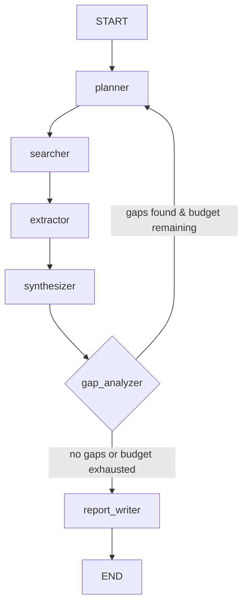

# Project: Deep Research Agent

Build an autonomous research agent that takes a question, creates a research plan, searches the web and academic sources, extracts and synthesizes information, tracks citations, identifies knowledge gaps, performs iterative deepening, and produces a structured research report. Built with LangGraph for its natural support of cyclic graphs and state checkpointing.

:::info Framework Decision
**Why LangGraph?**
- **Cyclic graph support** -- The plan, search, synthesize, deepen, re-plan loop maps directly to LangGraph's conditional edges with cycles
- **State checkpointing** -- Long-running research (minutes to hours) can resume from any checkpoint if interrupted
- **Parallel fan-out** -- LangGraph's `Send` API enables parallel search across multiple sources
- **Budget enforcement** -- State tracks token/cost usage; conditional edges can halt when budget is reached
- **Why not LangChain AgentExecutor?** -- No native support for cycles, parallel fan-out, or budget-aware termination
- **Why not Custom?** -- The iterative deepening cycle with state tracking, checkpointing, and parallel execution is exactly what LangGraph is built for
:::

---

## Architecture Overview



---

## Prerequisites

- Python 3.10+
- OpenAI API key
- Tavily API key (for web search) -- free tier available at tavily.com

---

## Setup

```bash
pip install langgraph langchain-openai langchain-core langchain-community \
    tavily-python pydantic python-dotenv httpx
```

`.env`:
```bash
OPENAI_API_KEY=your-key
TAVILY_API_KEY=your-tavily-key
```

---

## Implementation

### Step 1: Define the State

The state schema is the backbone of the research agent. It tracks everything: the original question, the decomposed research plan, raw sources, extracted findings with citations, synthesis drafts across iterations, identified knowledge gaps, iteration counts, and the token budget. Every node reads from and writes to this shared state.

```python
"""state.py -- State schema for the deep research agent."""

from __future__ import annotations

from typing import Annotated, Optional
from langchain_core.messages import BaseMessage
from langgraph.graph.message import add_messages
from pydantic import BaseModel, Field


class Source(BaseModel):
    """A single source discovered during research."""
    url: str = Field(description="URL of the source.")
    title: str = Field(default="", description="Title of the source page or paper.")
    content: str = Field(default="", description="Extracted text content.")
    relevance_score: float = Field(default=0.0, ge=0.0, le=1.0, description="Relevance to the research question.")


class Finding(BaseModel):
    """A single research finding backed by evidence."""
    claim: str = Field(description="The factual claim or insight.")
    evidence: str = Field(default="", description="Supporting evidence extracted from sources.")
    citations: list[str] = Field(default_factory=list, description="URLs of supporting sources.")
    confidence: float = Field(default=0.5, ge=0.0, le=1.0, description="Confidence in this finding.")


class ResearchState(BaseModel):
    """Typed state flowing through the research agent graph.

    Fields are organized by lifecycle: input, planning, search,
    analysis, quality, budget, and output.
    """

    # -- Conversation --
    messages: Annotated[list[BaseMessage], add_messages] = Field(default_factory=list)

    # -- Input --
    research_question: str = Field(default="", description="The original research question.")

    # -- Planning --
    research_plan: list[str] = Field(default_factory=list, description="Sub-questions to investigate.")

    # -- Search --
    sources: list[Source] = Field(default_factory=list, description="All discovered sources.")
    seen_urls: set[str] = Field(default_factory=set, description="URLs already processed (dedup).")

    # -- Analysis --
    findings: list[Finding] = Field(default_factory=list, description="Extracted research findings.")
    synthesis: str = Field(default="", description="Current synthesis draft.")

    # -- Quality --
    gaps: list[str] = Field(default_factory=list, description="Identified knowledge gaps.")

    # -- Iteration control --
    iteration: int = Field(default=0, description="Current deepening iteration.")
    max_iterations: int = Field(default=3, description="Maximum deepening iterations.")

    # -- Budget --
    token_budget: int = Field(default=100000, description="Maximum tokens to spend.")
    tokens_used: int = Field(default=0, description="Running total of tokens consumed.")

    # -- Output --
    final_report: Optional[str] = Field(default=None, description="The completed research report.")

    class Config:
        arbitrary_types_allowed = True
```

:::tip Why Track `seen_urls` in State?
Across multiple deepening iterations, the searcher may encounter the same URLs. The `seen_urls` set prevents re-fetching and re-processing content the agent has already consumed, saving both time and tokens.
:::

---

### Step 2: Define Search Tools

The search layer wraps external APIs into simple functions that the searcher node calls. Web search uses the Tavily API for its research-optimized results. URL fetching uses `httpx` for async HTTP with a timeout. An optional academic search hits the Semantic Scholar API for peer-reviewed papers.

```python
"""tools.py -- Search tools for the research agent."""

from __future__ import annotations

import os
import logging
from typing import Any

import httpx
from dotenv import load_dotenv
from tavily import TavilyClient

load_dotenv()
logger = logging.getLogger(__name__)

tavily_client = TavilyClient(api_key=os.getenv("TAVILY_API_KEY", ""))

FETCH_TIMEOUT = 15.0


async def web_search(query: str, max_results: int = 5) -> list[dict[str, Any]]:
    """Search the web using the Tavily API.

    Args:
        query: The search query.
        max_results: Maximum number of results to return.

    Returns:
        A list of dicts with keys: url, title, content.
    """
    try:
        response = tavily_client.search(
            query=query,
            search_depth="advanced",
            max_results=max_results,
            include_raw_content=False,
        )
        results = []
        for item in response.get("results", []):
            results.append({
                "url": item.get("url", ""),
                "title": item.get("title", ""),
                "content": item.get("content", ""),
            })
        return results
    except Exception as exc:
        logger.warning("Web search failed for query '%s': %s", query, exc)
        return []


async def fetch_url(url: str) -> str:
    """Fetch and extract text content from a URL.

    Args:
        url: The URL to fetch.

    Returns:
        The extracted text content, truncated to 8000 characters.
    """
    try:
        async with httpx.AsyncClient(timeout=FETCH_TIMEOUT, follow_redirects=True) as client:
            response = await client.get(url, headers={"User-Agent": "ResearchAgent/1.0"})
            response.raise_for_status()
            text = response.text
            # Strip HTML tags with a simple approach for content extraction
            import re
            text = re.sub(r"<script[^>]*>.*?</script>", "", text, flags=re.DOTALL)
            text = re.sub(r"<style[^>]*>.*?</style>", "", text, flags=re.DOTALL)
            text = re.sub(r"<[^>]+>", " ", text)
            text = re.sub(r"\s+", " ", text).strip()
            return text[:8000]
    except Exception as exc:
        logger.warning("Failed to fetch URL '%s': %s", url, exc)
        return ""


async def academic_search(query: str, max_results: int = 3) -> list[dict[str, Any]]:
    """Search Semantic Scholar for academic papers.

    Args:
        query: The search query.
        max_results: Maximum number of results to return.

    Returns:
        A list of dicts with keys: url, title, content (abstract).
    """
    try:
        async with httpx.AsyncClient(timeout=FETCH_TIMEOUT) as client:
            response = await client.get(
                "https://api.semanticscholar.org/graph/v1/paper/search",
                params={"query": query, "limit": max_results, "fields": "title,abstract,url"},
            )
            response.raise_for_status()
            data = response.json()
            results = []
            for paper in data.get("data", []):
                results.append({
                    "url": paper.get("url", f"https://api.semanticscholar.org/paper/{paper.get('paperId', '')}"),
                    "title": paper.get("title", ""),
                    "content": paper.get("abstract", "") or "",
                })
            return results
    except Exception as exc:
        logger.warning("Academic search failed for query '%s': %s", query, exc)
        return []
```

---

### Step 3: Build the Nodes

Each node is an async function that receives the current `ResearchState` and returns a dict of state updates. The nodes form a pipeline: planner decomposes the question, searcher gathers sources, extractor pulls findings, synthesizer merges them, gap_analyzer decides whether to loop, and report_writer produces the final output.

```python
"""nodes.py -- All graph nodes for the deep research agent."""

from __future__ import annotations

import json
import logging
from typing import Any

from langchain_core.messages import HumanMessage, SystemMessage
from langchain_openai import ChatOpenAI
from pydantic import BaseModel, Field

from state import ResearchState, Source, Finding
from tools import web_search, academic_search

logger = logging.getLogger(__name__)

llm = ChatOpenAI(model="gpt-4o", temperature=0.0)
creative_llm = ChatOpenAI(model="gpt-4o", temperature=0.3)


# -- Structured output schemas --

class ResearchPlan(BaseModel):
    """Structured output for the research planner."""
    sub_questions: list[str] = Field(description="List of specific sub-questions to investigate.")


class ExtractedFindings(BaseModel):
    """Structured output for the extractor."""
    findings: list[dict[str, Any]] = Field(
        description="List of findings, each with keys: claim, evidence, citations (list of URLs), confidence (0-1)."
    )


class GapAnalysis(BaseModel):
    """Structured output for the gap analyzer."""
    gaps: list[str] = Field(description="Knowledge gaps that need further investigation.")
    is_sufficient: bool = Field(description="Whether the current research is sufficient for a quality report.")


# -- Nodes --

async def planner(state: ResearchState) -> dict[str, Any]:
    """Decompose the research question into specific sub-questions.

    On the first iteration, creates a fresh research plan. On subsequent
    iterations, generates targeted sub-questions to fill identified gaps.
    """
    logger.info("Planning iteration %d for: %s", state.iteration, state.research_question[:80])

    if state.iteration == 0:
        prompt = (
            "You are a research planner. Decompose the following research question "
            "into 3-5 specific, searchable sub-questions. Each sub-question should "
            "target a distinct aspect of the topic. Return them ordered by priority "
            "(most critical first).\n\n"
            f"Research question: {state.research_question}"
        )
    else:
        prompt = (
            "You are a research planner performing iterative deepening. The following "
            "knowledge gaps were identified in the previous research iteration. "
            "Generate 2-3 targeted sub-questions to fill these gaps.\n\n"
            f"Original question: {state.research_question}\n\n"
            f"Knowledge gaps:\n" + "\n".join(f"- {g}" for g in state.gaps) + "\n\n"
            f"Existing findings ({len(state.findings)} total):\n"
            + "\n".join(f"- {f.claim}" for f in state.findings[:10])
        )

    structured_llm = llm.with_structured_output(ResearchPlan)
    plan = await structured_llm.ainvoke([
        SystemMessage(content="You are a meticulous research planner."),
        HumanMessage(content=prompt),
    ])

    new_plan = plan.sub_questions
    logger.info("Generated %d sub-questions", len(new_plan))

    return {
        "research_plan": new_plan,
        "iteration": state.iteration + 1,
        "tokens_used": state.tokens_used + 500,  # Estimate for planning call
    }


async def searcher(state: ResearchState) -> dict[str, Any]:
    """Search web and academic sources for each sub-question.

    Deduplicates results against previously seen URLs to avoid
    reprocessing sources from earlier iterations.
    """
    logger.info("Searching for %d sub-questions", len(state.research_plan))

    new_sources: list[Source] = []
    seen = set(state.seen_urls)
    tokens_estimate = 0

    for sub_question in state.research_plan:
        # Web search
        web_results = await web_search(sub_question, max_results=4)
        for result in web_results:
            url = result["url"]
            if url in seen:
                continue
            seen.add(url)
            new_sources.append(Source(
                url=url,
                title=result.get("title", ""),
                content=result.get("content", ""),
                relevance_score=0.0,
            ))
            tokens_estimate += len(result.get("content", "")) // 4

        # Academic search
        academic_results = await academic_search(sub_question, max_results=2)
        for result in academic_results:
            url = result["url"]
            if url in seen:
                continue
            seen.add(url)
            new_sources.append(Source(
                url=url,
                title=result.get("title", ""),
                content=result.get("content", ""),
                relevance_score=0.0,
            ))
            tokens_estimate += len(result.get("content", "")) // 4

    logger.info("Found %d new sources (total seen: %d)", len(new_sources), len(seen))

    return {
        "sources": state.sources + new_sources,
        "seen_urls": seen,
        "tokens_used": state.tokens_used + tokens_estimate,
    }


async def extractor(state: ResearchState) -> dict[str, Any]:
    """Extract key findings from search results with source attribution.

    Processes the most recent batch of sources (from the current iteration)
    and produces structured findings, each linked to its supporting citations.
    """
    # Only process sources added in this iteration
    existing_source_count = len(state.sources) - len([
        s for s in state.sources if s.url not in {f.citations[0] for f in state.findings if f.citations}
    ])

    sources_text = ""
    for i, source in enumerate(state.sources):
        if source.content:
            sources_text += f"\n[Source {i + 1}] {source.title}\nURL: {source.url}\n{source.content[:2000]}\n"

    if not sources_text.strip():
        logger.warning("No source content available for extraction")
        return {"tokens_used": state.tokens_used + 100}

    prompt = (
        "You are a research analyst. Extract key findings from the following sources. "
        "For each finding, provide:\n"
        "- claim: a specific factual claim or insight\n"
        "- evidence: the supporting evidence from the source text\n"
        "- citations: a list of source URLs that support this claim\n"
        "- confidence: a float 0-1 indicating how well-supported the claim is\n\n"
        "Focus on claims that are directly relevant to the research question.\n"
        "Avoid duplicating findings that already exist.\n\n"
        f"Research question: {state.research_question}\n\n"
        f"Existing findings to avoid duplicating:\n"
        + "\n".join(f"- {f.claim}" for f in state.findings[:10]) + "\n\n"
        f"Sources:\n{sources_text}"
    )

    structured_llm = llm.with_structured_output(ExtractedFindings)
    try:
        extraction = await structured_llm.ainvoke([
            SystemMessage(content="You are a precise research analyst. Extract only well-supported findings."),
            HumanMessage(content=prompt),
        ])

        new_findings = []
        for f in extraction.findings:
            new_findings.append(Finding(
                claim=f.get("claim", ""),
                evidence=f.get("evidence", ""),
                citations=f.get("citations", []),
                confidence=min(max(f.get("confidence", 0.5), 0.0), 1.0),
            ))

        logger.info("Extracted %d new findings", len(new_findings))
        token_cost = len(sources_text) // 4 + 500
        return {
            "findings": state.findings + new_findings,
            "tokens_used": state.tokens_used + token_cost,
        }
    except Exception as exc:
        logger.error("Extraction failed: %s", exc)
        return {"tokens_used": state.tokens_used + 200}


async def synthesizer(state: ResearchState) -> dict[str, Any]:
    """Combine all findings into a coherent synthesis draft.

    Merges findings from all iterations into a single narrative,
    preserving citation links and noting areas of disagreement.
    """
    logger.info("Synthesizing %d findings", len(state.findings))

    findings_text = ""
    for i, finding in enumerate(state.findings):
        citations_str = ", ".join(finding.citations) if finding.citations else "no citation"
        findings_text += (
            f"\n{i + 1}. {finding.claim}\n"
            f"   Evidence: {finding.evidence[:300]}\n"
            f"   Sources: {citations_str}\n"
            f"   Confidence: {finding.confidence:.1f}\n"
        )

    prompt = (
        "You are a research synthesizer. Combine the following findings into a "
        "coherent synthesis. Group related findings by theme. Note any contradictions "
        "between sources. Preserve inline citation references using [N] notation where "
        "N is the finding number.\n\n"
        f"Research question: {state.research_question}\n\n"
        f"Findings:\n{findings_text}"
    )

    response = await creative_llm.ainvoke([
        SystemMessage(content="You are an expert research synthesizer. Write clearly and cite sources."),
        HumanMessage(content=prompt),
    ])

    token_cost = len(findings_text) // 4 + len(response.content) // 4
    logger.info("Synthesis draft generated (%d characters)", len(response.content))

    return {
        "synthesis": response.content,
        "tokens_used": state.tokens_used + token_cost,
    }


async def gap_analyzer(state: ResearchState) -> dict[str, Any]:
    """Identify knowledge gaps in the current research.

    Compares findings against the original research question and sub-questions
    to determine what is missing. Returns gaps and a sufficiency flag.
    """
    logger.info("Analyzing gaps (iteration %d/%d, tokens %d/%d)",
                state.iteration, state.max_iterations, state.tokens_used, state.token_budget)

    prompt = (
        "You are a research quality analyst. Review the synthesis below and identify "
        "knowledge gaps -- important aspects of the research question that have not been "
        "adequately addressed, claims with low confidence, or areas where more evidence "
        "is needed.\n\n"
        "Return:\n"
        "- gaps: a list of specific knowledge gaps (empty list if research is sufficient)\n"
        "- is_sufficient: true if the research adequately covers the question, false otherwise\n\n"
        f"Research question: {state.research_question}\n\n"
        f"Sub-questions investigated:\n"
        + "\n".join(f"- {q}" for q in state.research_plan) + "\n\n"
        f"Current synthesis:\n{state.synthesis[:3000]}\n\n"
        f"Number of sources: {len(state.sources)}\n"
        f"Number of findings: {len(state.findings)}\n"
        f"Low confidence findings: {sum(1 for f in state.findings if f.confidence < 0.5)}"
    )

    structured_llm = llm.with_structured_output(GapAnalysis)
    analysis = await structured_llm.ainvoke([
        SystemMessage(content="You are a strict research quality analyst."),
        HumanMessage(content=prompt),
    ])

    logger.info("Gap analysis: %d gaps found, sufficient=%s", len(analysis.gaps), analysis.is_sufficient)

    return {
        "gaps": analysis.gaps,
        "tokens_used": state.tokens_used + 800,
    }


async def report_writer(state: ResearchState) -> dict[str, Any]:
    """Generate the final structured research report with citations.

    Produces a report with: Executive Summary, Key Findings, Detailed Analysis,
    Contradictions and Uncertainties, and a numbered References section.
    """
    logger.info("Writing final report (%d findings, %d sources)", len(state.findings), len(state.sources))

    # Build a reference list from unique source URLs
    unique_sources: dict[str, Source] = {}
    for source in state.sources:
        if source.url and source.url not in unique_sources:
            unique_sources[source.url] = source
    references = list(unique_sources.values())

    ref_list = ""
    for i, ref in enumerate(references, 1):
        ref_list += f"[{i}] {ref.title or 'Untitled'} - {ref.url}\n"

    url_to_ref: dict[str, int] = {ref.url: i + 1 for i, ref in enumerate(references)}

    findings_text = ""
    for finding in state.findings:
        ref_numbers = [str(url_to_ref[u]) for u in finding.citations if u in url_to_ref]
        ref_str = ", ".join(ref_numbers) if ref_numbers else "uncited"
        findings_text += f"- {finding.claim} [refs: {ref_str}] (confidence: {finding.confidence:.1f})\n"

    prompt = (
        "You are a professional research report writer. Generate a comprehensive, "
        "well-structured research report based on the following synthesis and findings.\n\n"
        "The report MUST include these sections:\n"
        "1. Executive Summary (2-3 paragraphs)\n"
        "2. Key Findings (bulleted list of the most important discoveries)\n"
        "3. Detailed Analysis (organized by theme, with inline citations using [N] notation)\n"
        "4. Contradictions and Uncertainties (areas of disagreement or low confidence)\n"
        "5. Recommendations for Further Research\n"
        "6. References (numbered list)\n\n"
        "Use [N] notation for inline citations, where N corresponds to the reference number.\n\n"
        f"Research question: {state.research_question}\n\n"
        f"Synthesis:\n{state.synthesis}\n\n"
        f"Findings:\n{findings_text}\n\n"
        f"References:\n{ref_list}\n\n"
        f"Research statistics:\n"
        f"- Iterations completed: {state.iteration}\n"
        f"- Sources consulted: {len(state.sources)}\n"
        f"- Findings extracted: {len(state.findings)}\n"
        f"- Tokens used: {state.tokens_used}"
    )

    response = await creative_llm.ainvoke([
        SystemMessage(content="You are an expert research report writer. Write clearly, cite rigorously, and flag uncertainties."),
        HumanMessage(content=prompt),
    ])

    token_cost = len(prompt) // 4 + len(response.content) // 4
    logger.info("Final report generated (%d characters)", len(response.content))

    return {
        "final_report": response.content,
        "tokens_used": state.tokens_used + token_cost,
    }
```

:::warning Cycles Need Exit Conditions
The `gap_analyzer -> planner` loop creates a cycle. Without `max_iterations` and `token_budget` guards, the graph could loop indefinitely. The routing function in the next step enforces both exit conditions.
:::

---

### Step 4: Assemble the Graph

The graph wires nodes together with a conditional edge at `gap_analyzer` that decides whether to loop back to the planner (if gaps exist and budget remains) or proceed to the report writer.

```python
"""graph.py -- Build and compile the research agent graph."""

from __future__ import annotations

from langgraph.graph import StateGraph, START, END
from langgraph.checkpoint.memory import MemorySaver

from state import ResearchState
from nodes import planner, searcher, extractor, synthesizer, gap_analyzer, report_writer


def should_continue(state: ResearchState) -> str:
    """Decide whether to deepen research or write the final report.

    Continues research if ALL of the following are true:
      - There are identified knowledge gaps
      - The iteration count has not reached the maximum
      - The token budget has not been exhausted (80% threshold)

    Otherwise, proceeds to report generation.
    """
    budget_remaining = state.tokens_used < (state.token_budget * 0.8)
    iterations_remaining = state.iteration < state.max_iterations
    has_gaps = len(state.gaps) > 0

    if has_gaps and iterations_remaining and budget_remaining:
        return "deepen"
    return "report"


def build_research_agent(checkpointer=None):
    """Construct and compile the deep research agent graph.

    Args:
        checkpointer: State persistence backend. Defaults to MemorySaver.

    Returns:
        A compiled LangGraph application.
    """
    if checkpointer is None:
        checkpointer = MemorySaver()

    graph = StateGraph(ResearchState)

    # -- Nodes --
    graph.add_node("planner", planner)
    graph.add_node("searcher", searcher)
    graph.add_node("extractor", extractor)
    graph.add_node("synthesizer", synthesizer)
    graph.add_node("gap_analyzer", gap_analyzer)
    graph.add_node("report_writer", report_writer)

    # -- Linear edges --
    graph.add_edge(START, "planner")
    graph.add_edge("planner", "searcher")
    graph.add_edge("searcher", "extractor")
    graph.add_edge("extractor", "synthesizer")
    graph.add_edge("synthesizer", "gap_analyzer")

    # -- Conditional edge: loop or finalize --
    graph.add_conditional_edges(
        "gap_analyzer",
        should_continue,
        {"deepen": "planner", "report": "report_writer"},
    )

    graph.add_edge("report_writer", END)

    return graph.compile(checkpointer=checkpointer)
```

:::tip Budget as a First-Class Concern
The `should_continue` function checks token usage at 80% of budget, not 100%. This reserves 20% of the budget for report generation so the agent never runs out of tokens before producing a deliverable.
:::

---

### Step 5: Run a Research Task

The entry point accepts a research question, configures iteration and budget limits, streams execution through each node with real-time progress output, and prints the final report.

```python
"""research_agent.py -- Entry point for the deep research agent."""

from __future__ import annotations

import asyncio
import logging
import os
import sys

from dotenv import load_dotenv

from graph import build_research_agent
from state import ResearchState

load_dotenv()
logging.basicConfig(
    level=logging.INFO,
    format="%(asctime)s [%(levelname)s] %(name)s: %(message)s",
)
logger = logging.getLogger(__name__)


async def run_research(
    question: str,
    max_iterations: int = 3,
    token_budget: int = 100000,
) -> str:
    """Execute a full research task and return the final report.

    Args:
        question: The research question to investigate.
        max_iterations: Maximum number of deepening iterations.
        token_budget: Maximum tokens to spend across the entire task.

    Returns:
        The final research report as a string.
    """
    app = build_research_agent()
    config = {"configurable": {"thread_id": f"research-{hash(question)}"}}

    initial_state = {
        "research_question": question,
        "max_iterations": max_iterations,
        "token_budget": token_budget,
    }

    print(f"\nResearch Question: {question}")
    print("=" * 70)

    final_state = {}
    async for step in app.astream(initial_state, config=config):
        node_name = list(step.keys())[0]
        node_output = step[node_name]

        # Progress reporting
        if node_name == "planner":
            plan = node_output.get("research_plan", [])
            print(f"\n[Planning] {len(plan)} sub-questions identified:")
            for q in plan:
                print(f"  - {q}")
        elif node_name == "searcher":
            sources = node_output.get("sources", [])
            print(f"\n[Searching] {len(sources)} total sources found")
        elif node_name == "extractor":
            findings = node_output.get("findings", [])
            print(f"\n[Extracting] {len(findings)} total findings")
        elif node_name == "synthesizer":
            synthesis = node_output.get("synthesis", "")
            print(f"\n[Synthesizing] Draft generated ({len(synthesis)} chars)")
        elif node_name == "gap_analyzer":
            gaps = node_output.get("gaps", [])
            tokens = node_output.get("tokens_used", 0)
            if gaps:
                print(f"\n[Gap Analysis] {len(gaps)} gaps found, deepening...")
                for g in gaps:
                    print(f"  - {g}")
            else:
                print("\n[Gap Analysis] Research sufficient, generating report...")
            print(f"  Tokens used: {tokens}")
        elif node_name == "report_writer":
            print("\n[Report] Final report generated")

        final_state = node_output

    report = final_state.get("final_report", "No report generated.")
    return report


async def main() -> None:
    """Run the research agent with a sample question."""
    question = (
        "What are the latest advances in mechanistic interpretability of LLMs?"
    )

    if len(sys.argv) > 1:
        question = " ".join(sys.argv[1:])

    report = await run_research(question, max_iterations=3, token_budget=100000)

    print("\n" + "=" * 70)
    print("FINAL RESEARCH REPORT")
    print("=" * 70)
    print(report)


if __name__ == "__main__":
    asyncio.run(main())
```

---

## How to Run

```bash
# Set API keys in .env, then:
python research_agent.py

# Or pass a custom question:
python research_agent.py "What are the latest advances in mechanistic interpretability of LLMs?"
```

**Expected output:**

```text
Research Question: What are the latest advances in mechanistic interpretability of LLMs?
======================================================================

[Planning] 4 sub-questions identified:
  - What are the key techniques used in mechanistic interpretability?
  - What recent papers or breakthroughs have advanced the field?
  - How is mechanistic interpretability applied to transformer architectures?
  - What are the current limitations and open challenges?

[Searching] 12 total sources found

[Extracting] 8 total findings

[Synthesizing] Draft generated (2847 chars)

[Gap Analysis] 2 gaps found, deepening...
  - Limited coverage of sparse autoencoders for feature extraction
  - No information on scaling interpretability to frontier models
  Tokens used: 34200

[Planning] 2 sub-questions identified:
  - How are sparse autoencoders used for LLM feature extraction?
  - What challenges exist in scaling interpretability to 100B+ parameter models?

[Searching] 17 total sources found

[Extracting] 12 total findings

[Synthesizing] Draft generated (4103 chars)

[Gap Analysis] Research sufficient, generating report...
  Tokens used: 58700

[Report] Final report generated

======================================================================
FINAL RESEARCH REPORT
======================================================================
# Mechanistic Interpretability of LLMs: A Research Report
...
```

---

## Key Design Decisions

| Decision | Rationale |
|----------|-----------|
| Iteration cap at 3 | Prevents runaway research; diminishing returns after 3 passes |
| Token budget enforcement at 80% | Reserves 20% of budget for report generation so the agent always produces a deliverable |
| Per-task ephemeral state | Prevents cross-task contamination; clean state per question |
| Source deduplication by URL | Avoids processing the same source multiple times across iterations |
| Confidence scoring on findings | Enables the gap analyzer to identify weak areas needing more research |
| Temperature 0 for analysis, 0.3 for synthesis | Analysis requires precision; synthesis benefits from slight creativity |
| Structured output for planning and extraction | Pydantic schemas enforce consistent data shapes from LLM responses |
| Separate extractor and synthesizer nodes | Extraction is per-source factual work; synthesis is cross-source narrative work. Separating them improves both accuracy and testability. |

---

## Extension Ideas

- **Parallel search with `Send`**: Use LangGraph's `Send` API to fan out searches for each sub-question simultaneously, reducing search phase latency from serial sum to parallel max
- **PDF processing**: Add PyMuPDF-based extraction for research papers linked in search results
- **Persistent vector store**: Index source chunks in FAISS or Chroma for cross-session retrieval and semantic deduplication
- **Fact verification node**: Add a dedicated verification node that cross-checks each claim against its cited source text, catching hallucinated citations before they reach the report
- **Export formats**: Generate Markdown, PDF (via WeasyPrint), or Notion page from the final report
- **Human-in-the-loop**: Add an interrupt before the report_writer node so a human can review findings and redirect research
- **Multi-model routing**: Use a cheaper model (gpt-4o-mini) for planning and searching, reserving gpt-4o for synthesis and report writing to reduce cost by 40-60%
- **LangSmith tracing**: Enable LangSmith for full observability into each node's inputs, outputs, and token consumption across iterations

---

## Interview Talking Points

:::tip Key Points to Emphasize
1. **LangGraph's cyclic graph support** is the reason this uses LangGraph over LangChain AgentExecutor. The iterative deepening loop (gap_analyzer to planner) is a cycle that LangGraph handles natively.
2. **State checkpointing** means a 15-minute deep research task can resume from the last completed node if the process crashes. This is critical for long-running agent workloads.
3. **Budget-aware termination** is a first-class concern, not an afterthought. The 80% threshold ensures the agent always reserves capacity for report generation.
4. **Source deduplication** across iterations prevents the common failure mode where an agent re-fetches and re-processes the same content in each loop, wasting tokens without adding information.
5. **Structured outputs** (Pydantic models) for planning and extraction enforce consistent data shapes and make the system testable without running LLM calls.
6. **Separation of extraction and synthesis** is a deliberate design choice. Extraction is factual (what does this source say?); synthesis is analytical (what does it all mean together?). Combining them in one prompt degrades both.
:::
