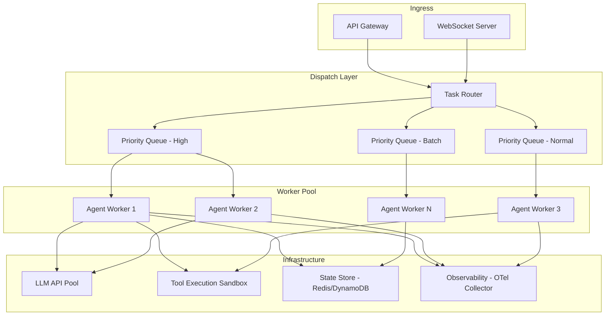
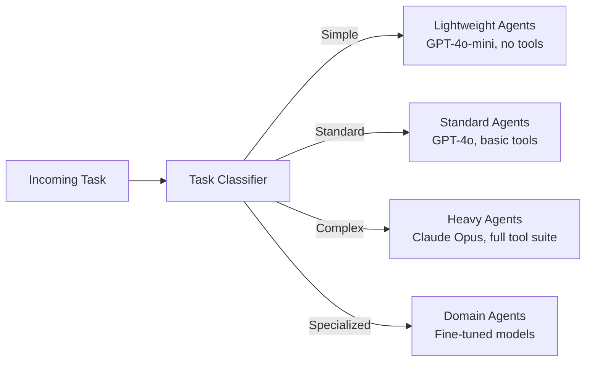
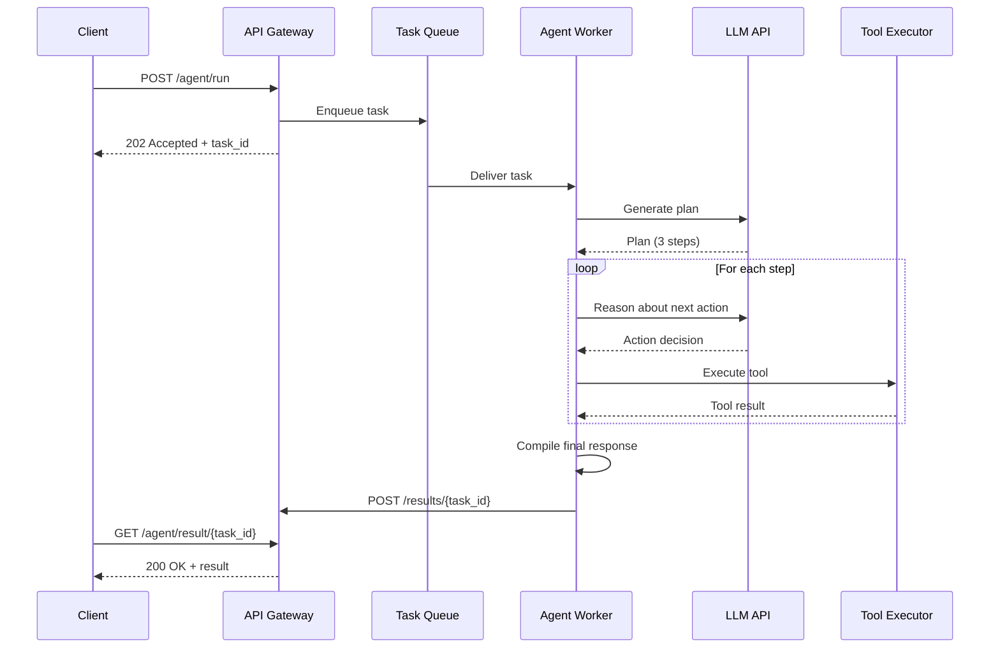

# Agent Orchestration at Scale

A single agent handling one request is straightforward. Thousands of agents processing millions of requests with varying latencies, costs, and failure modes is a distributed systems problem. This page covers the architecture patterns that make large-scale agent orchestration possible.

---

## High-Level Architecture



---

## Queue-Based Dispatching

The foundation of scalable agent orchestration is asynchronous, queue-based dispatching. Instead of processing requests synchronously, the system enqueues tasks and lets a pool of workers consume them at their own pace.

### Why Queues?

| Problem | Queue-Based Solution |
|---------|---------------------|
| LLM API latency is unpredictable (1-30s) | Workers process at their own pace; callers do not block |
| Burst traffic overwhelms LLM rate limits | Queue absorbs bursts; workers drain at a sustainable rate |
| Worker crashes lose in-flight work | Message redelivery ensures at-least-once processing |
| Different tasks need different priorities | Priority queues route urgent tasks to the front |

### Implementation Pattern

```python
import asyncio
from dataclasses import dataclass, field
from enum import IntEnum

class Priority(IntEnum):
    HIGH = 0      # User-facing, real-time
    NORMAL = 1    # Standard agent tasks
    BATCH = 2     # Background processing, bulk operations

@dataclass(order=True)
class AgentTask:
    priority: Priority
    task_id: str = field(compare=False)
    session_id: str = field(compare=False)
    payload: dict = field(compare=False)
    created_at: float = field(compare=False)

class TaskDispatcher:
    def __init__(self, queue_client, num_workers: int = 10):
        self.queue = queue_client
        self.num_workers = num_workers

    async def submit(self, task: AgentTask):
        """Submit a task to the priority queue."""
        await self.queue.enqueue(
            queue_name=f"agent-tasks-{task.priority.name.lower()}",
            message=task,
            deduplication_id=task.task_id,
        )

    async def start_workers(self):
        """Start a pool of workers that consume from all priority queues."""
        workers = [
            asyncio.create_task(self._worker_loop(i))
            for i in range(self.num_workers)
        ]
        await asyncio.gather(*workers)

    async def _worker_loop(self, worker_id: int):
        while True:
            # Poll high-priority first, then normal, then batch
            task = (
                await self.queue.dequeue("agent-tasks-high")
                or await self.queue.dequeue("agent-tasks-normal")
                or await self.queue.dequeue("agent-tasks-batch")
            )
            if task:
                await self._process(worker_id, task)
            else:
                await asyncio.sleep(0.1)
```

:::tip
In production, use a managed queue service (SQS, Cloud Tasks, RabbitMQ) rather than an in-process priority queue. Managed queues provide durability, dead-letter routing, and visibility metrics out of the box.
:::

---

## Task Routing

Not all agent tasks are equal. A simple FAQ lookup needs a fast, cheap model. A complex multi-step research task needs a powerful model with tool access. Task routing ensures each request goes to the right agent configuration.

### Routing Strategies



### Example Router

```python
from enum import Enum

class TaskComplexity(Enum):
    SIMPLE = "simple"
    STANDARD = "standard"
    COMPLEX = "complex"
    SPECIALIZED = "specialized"

class TaskRouter:
    def __init__(self, classifier_llm, agent_pools: dict):
        self.classifier = classifier_llm
        self.pools = agent_pools

    async def route(self, task: AgentTask) -> str:
        """Classify a task and route to the appropriate agent pool."""
        complexity = await self._classify(task)

        pool = self.pools[complexity]
        worker = await pool.acquire_worker()
        return worker

    async def _classify(self, task: AgentTask) -> TaskComplexity:
        """Use a small, fast LLM to classify task complexity."""
        prompt = f"""Classify this task's complexity:
Task: {task.payload['instruction']}

Rules:
- SIMPLE: Direct answers, FAQs, single-step lookups
- STANDARD: Multi-step reasoning, 1-3 tool calls
- COMPLEX: Research tasks, multi-tool orchestration, long-running
- SPECIALIZED: Domain-specific (legal, medical, financial)

Respond with one word: SIMPLE, STANDARD, COMPLEX, or SPECIALIZED."""

        result = await self.classifier.generate(prompt, max_tokens=10)
        return TaskComplexity(result.strip().lower())
```

:::info Cost Optimization
Task routing is one of the highest-leverage cost optimizations in agentic systems. Routing 60% of traffic to a model that costs 10x less than the premium tier can reduce LLM spend by 50% or more with minimal quality impact.
:::

---

## Load Balancing Agents

Agent workloads are fundamentally different from traditional web workloads. A single agent step might take 500ms (simple LLM call) or 60 seconds (multi-tool research chain). Standard round-robin load balancing causes head-of-line blocking.

### Strategies

| Strategy | Description | Best For |
|----------|-------------|----------|
| **Weighted round-robin** | Distribute based on worker capacity | Homogeneous workloads |
| **Least-connections** | Route to the worker with fewest active tasks | Variable-latency tasks |
| **Work-stealing** | Idle workers pull tasks from busy workers' queues | Mixed short/long tasks |
| **Capacity-aware** | Route based on current token budget remaining | LLM rate-limit management |

### Capacity-Aware Load Balancer

```python
class CapacityAwareBalancer:
    """Routes tasks based on remaining LLM token budget per worker."""

    def __init__(self, workers: list, rate_limiter):
        self.workers = workers
        self.rate_limiter = rate_limiter

    async def select_worker(self, estimated_tokens: int):
        """Select the worker with the most remaining token budget."""
        candidates = []
        for worker in self.workers:
            remaining = await self.rate_limiter.remaining_budget(worker.id)
            if remaining >= estimated_tokens:
                candidates.append((remaining, worker))

        if not candidates:
            raise BackpressureError("All workers at capacity. Requeue the task.")

        # Select worker with most headroom
        candidates.sort(reverse=True, key=lambda x: x[0])
        return candidates[0][1]
```

---

## Horizontal Scaling

### Scaling Dimensions

Agentic systems have multiple independent scaling axes.

```mermaid
graph TD
    subgraph "Scaling Axes"
        A[API Gateway] -->|Scale by request rate| A1[Auto-scale replicas]
        B[Agent Workers] -->|Scale by queue depth| B1[Auto-scale pods/containers]
        C[LLM Inference] -->|Scale by token throughput| C1[Multiple API keys / providers]
        D[Tool Executors] -->|Scale by tool call volume| D1[Separate tool worker pool]
        E[State Store] -->|Scale by session count| E1[Shard by session ID]
    end
```



### Auto-Scaling Configuration (Kubernetes)

```yaml
apiVersion: autoscaling/v2
kind: HorizontalPodAutoscaler
metadata:
  name: agent-worker-hpa
spec:
  scaleTargetRef:
    apiVersion: apps/v1
    kind: Deployment
    name: agent-workers
  minReplicas: 3
  maxReplicas: 50
  metrics:
    # Scale based on queue depth
    - type: External
      external:
        metric:
          name: sqs_approximate_number_of_messages_visible
          selector:
            matchLabels:
              queue: agent-tasks
        target:
          type: AverageValue
          averageValue: "5"  # Target 5 messages per worker
    # Also consider CPU for tool execution
    - type: Resource
      resource:
        name: cpu
        target:
          type: Utilization
          targetAverageUtilization: 70
  behavior:
    scaleUp:
      stabilizationWindowSeconds: 30   # Scale up quickly
    scaleDown:
      stabilizationWindowSeconds: 300  # Scale down slowly to avoid flapping
```

---

## Async Execution

Most agent tasks are I/O-bound (waiting for LLM responses, tool execution, database queries). Async execution maximizes throughput per worker.

### Request Lifecycle



### Long-Polling and Streaming

For interactive use cases, clients need results as they are produced, not after the entire agent loop completes.

```python
from fastapi import FastAPI
from fastapi.responses import StreamingResponse
import asyncio

app = FastAPI()

@app.post("/agent/run-stream")
async def run_agent_stream(request: AgentRequest):
    async def event_stream():
        async for event in agent.run_streaming(request):
            match event.type:
                case "thinking":
                    yield f"data: {json.dumps({'type': 'thinking', 'content': event.content})}\n\n"
                case "tool_call":
                    yield f"data: {json.dumps({'type': 'tool_call', 'tool': event.tool_name})}\n\n"
                case "tool_result":
                    yield f"data: {json.dumps({'type': 'tool_result', 'result': event.result})}\n\n"
                case "final":
                    yield f"data: {json.dumps({'type': 'final', 'content': event.content})}\n\n"

    return StreamingResponse(event_stream(), media_type="text/event-stream")
```

---

## Workflow Engines

For complex, multi-step agent orchestration -- especially when steps can run for minutes, require human approval, or must be durable across process restarts -- use a workflow engine.

### Temporal Example

```python
from temporalio import workflow, activity
from datetime import timedelta

@activity.defn
async def call_llm(prompt: str, model: str) -> str:
    response = await llm_client.generate(prompt, model=model)
    return response

@activity.defn
async def execute_tool(tool_name: str, params: dict) -> dict:
    return await tool_executor.execute(tool_name, params)

@workflow.defn
class AgentWorkflow:
    @workflow.run
    async def run(self, task: AgentTask) -> str:
        # Step 1: Plan
        plan = await workflow.execute_activity(
            call_llm,
            args=[task.planning_prompt, "gpt-4o"],
            start_to_close_timeout=timedelta(seconds=30),
            retry_policy=RetryPolicy(maximum_attempts=3),
        )

        steps = parse_plan(plan)

        # Step 2: Execute each step with checkpointing
        results = []
        for step in steps:
            if step.requires_approval:
                # Wait for human approval (durable timer -- survives restarts)
                approved = await workflow.wait_condition(
                    lambda: self.approval_received,
                    timeout=timedelta(hours=24),
                )
                if not approved:
                    return "Task cancelled: approval timeout."

            result = await workflow.execute_activity(
                execute_tool,
                args=[step.tool_name, step.params],
                start_to_close_timeout=timedelta(seconds=60),
                retry_policy=RetryPolicy(maximum_attempts=3),
            )
            results.append(result)

        # Step 3: Synthesize
        return await workflow.execute_activity(
            call_llm,
            args=[build_synthesis_prompt(results), "gpt-4o"],
            start_to_close_timeout=timedelta(seconds=30),
        )
```

### Temporal vs. Prefect vs. Custom

| Feature | Temporal | Prefect | Custom (Queues + DB) |
|---------|----------|---------|---------------------|
| Durable execution | Built-in | Built-in | Must implement |
| Human-in-the-loop | Native signals | Limited | Must implement |
| Versioning | Workflow versioning | Flow versioning | Must implement |
| Observability | Temporal UI | Prefect UI | Must build |
| Learning curve | High | Medium | Low (initially) |
| Operational overhead | Temporal cluster | Prefect server | Just queues + DB |

:::warning
Custom orchestration seems simpler at first, but production requirements (retries, timeouts, checkpointing, versioning, observability) accumulate quickly. Evaluate Temporal or a similar engine before building your own -- the total cost of ownership is often lower.
:::

---

## Backpressure

When downstream systems (LLM APIs, tool services) cannot keep up with incoming traffic, the system must apply backpressure to prevent cascading failure.

### Backpressure Strategies

```python
class BackpressureController:
    def __init__(self, max_concurrent: int, max_queue_depth: int):
        self.semaphore = asyncio.Semaphore(max_concurrent)
        self.max_queue_depth = max_queue_depth
        self.current_queue_depth = 0

    async def submit(self, task: AgentTask):
        # Strategy 1: Reject when queue is full
        if self.current_queue_depth >= self.max_queue_depth:
            raise ServiceOverloadedError(
                "System at capacity. Retry after backoff.",
                retry_after=30,
            )

        self.current_queue_depth += 1

        try:
            # Strategy 2: Limit concurrency with semaphore
            async with self.semaphore:
                return await self._process(task)
        finally:
            self.current_queue_depth -= 1

    async def _process(self, task: AgentTask):
        # Strategy 3: Adaptive rate limiting based on error rate
        if self.error_rate > 0.3:
            await asyncio.sleep(self._adaptive_delay())
        return await self.worker.process(task)

    def _adaptive_delay(self) -> float:
        """Increase delay as error rate increases."""
        return min(30.0, 1.0 * (self.error_rate / 0.1) ** 2)
```

### Key Backpressure Signals

| Signal | Source | Action |
|--------|--------|--------|
| Queue depth exceeds threshold | Message queue metrics | Reject new tasks with 429 |
| LLM rate limit hit | API response (429) | Reduce worker concurrency |
| Tool execution timeouts spike | Tool executor metrics | Shed load on that tool |
| Memory/CPU pressure on workers | Container metrics | Stop accepting new tasks |

---

## Interview Preparation

**Sample question:** "Design a system that orchestrates 1,000 concurrent agent sessions with different priority levels."

**Strong answer checklist:**
1. Queue-based dispatch with priority lanes (high/normal/batch)
2. Task routing to match complexity with appropriate model tier
3. Stateless workers with externalized state for horizontal scaling
4. Async execution with SSE/WebSocket for real-time streaming
5. Backpressure via queue depth limits and adaptive rate limiting
6. Auto-scaling based on queue depth, not just CPU
7. Workflow engine (Temporal) for durable, multi-step agent tasks
8. Observability at every layer -- not an afterthought
