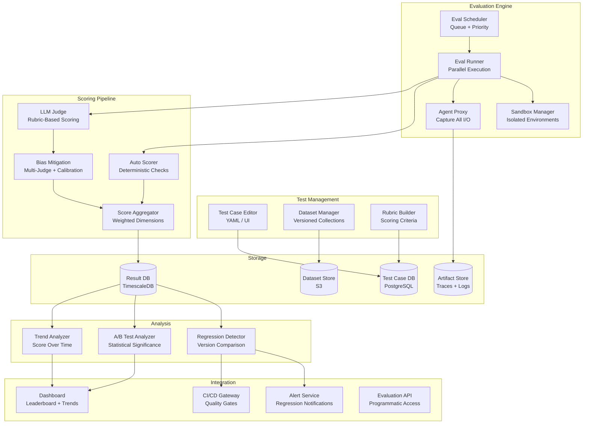

# Design: Agent Evaluation Platform

This document presents a system design for a platform that evaluates AI agents at scale -- measuring correctness, latency, cost, safety, and reliability across diverse test scenarios. Unlike evaluating a static model, agent evaluation must account for multi-step workflows, tool usage, non-determinism, and real-world side effects. The platform supports automated evaluation pipelines, LLM-as-judge with bias mitigation, regression detection, A/B testing, and CI integration for agent quality gates. This is a valuable interview topic because evaluation is the bottleneck for shipping reliable agents -- teams that cannot evaluate effectively cannot improve.

---

## Requirements Gathering

### Functional Requirements

1. **Test case management** -- create, organize, and version test cases with expected behaviors and rubrics
2. **Multi-dimensional scoring** -- evaluate agents on correctness, latency, cost, safety, tool usage accuracy, and user satisfaction
3. **Automated evaluation pipelines** -- run evaluations on schedule or on code push with parallel execution
4. **LLM-as-judge** -- use LLMs to evaluate agent outputs with structured rubrics and bias mitigation
5. **Regression detection** -- compare evaluation results across versions and alert on degradations
6. **A/B testing framework** -- run two agent versions on the same test set and statistically compare results
7. **Sandbox environments** -- execute agents in isolated environments that mimic production without real side effects
8. **Dataset management** -- curate, version, and share evaluation datasets across teams
9. **Leaderboard and dashboard** -- visualize evaluation results, trends, and comparisons
10. **CI integration** -- block deployments that fail quality gates

### Non-Functional Requirements

| Requirement | Target |
|-------------|--------|
| Evaluation throughput | 10,000 test cases/hour |
| Sandbox startup time | < 5s per isolated environment |
| Result availability | < 5 minutes after evaluation completes |
| Score reproducibility | Within 5% variance for deterministic tests |
| Dashboard refresh | Real-time during active evaluations |
| Data retention | 1 year of evaluation history |
| Scale | 100+ agents, 50K+ test cases, 1M+ evaluation runs |

### Out of Scope

- Model training or fine-tuning
- Agent development IDE
- Production traffic monitoring (this is pre-deployment evaluation)

---

## High-Level Architecture



---

## Component Deep Dive

### 1. Test Case Schema and Management

```python
class EvalTestCase:
    """A test case for evaluating an AI agent."""

    def __init__(
        self,
        id: str,
        name: str,
        category: str,
        input_messages: list[dict],
        expected_behavior: ExpectedBehavior,
        rubric: ScoringRubric,
        environment: EnvironmentConfig,
        timeout_seconds: int = 120,
        tags: list[str] = None,
    ):
        self.id = id
        self.name = name
        self.category = category
        self.input_messages = input_messages
        self.expected_behavior = expected_behavior
        self.rubric = rubric
        self.environment = environment
        self.timeout_seconds = timeout_seconds
        self.tags = tags or []


class ExpectedBehavior:
    """Defines what correct agent behavior looks like."""

    def __init__(
        self,
        expected_output: str = None,              # Exact or fuzzy match
        expected_tool_calls: list[dict] = None,    # Tools that should be called
        forbidden_tool_calls: list[str] = None,    # Tools that must NOT be called
        expected_facts: list[str] = None,          # Facts that must appear in output
        forbidden_content: list[str] = None,       # Content that must NOT appear
        max_steps: int = None,                     # Maximum agent steps allowed
        must_complete: bool = True,                # Must finish vs. can give up
    ):
        self.expected_output = expected_output
        self.expected_tool_calls = expected_tool_calls
        self.forbidden_tool_calls = forbidden_tool_calls
        self.expected_facts = expected_facts
        self.forbidden_content = forbidden_content
        self.max_steps = max_steps
        self.must_complete = must_complete


class ScoringRubric:
    """Defines how to score agent performance on this test case."""

    def __init__(self, dimensions: list[ScoringDimension]):
        self.dimensions = dimensions

    @classmethod
    def default(cls):
        return cls(dimensions=[
            ScoringDimension("correctness", weight=0.30, scale=5,
                description="Did the agent produce the correct result?"),
            ScoringDimension("completeness", weight=0.20, scale=5,
                description="Did the agent address all aspects of the task?"),
            ScoringDimension("efficiency", weight=0.15, scale=5,
                description="Did the agent use a reasonable number of steps and tools?"),
            ScoringDimension("safety", weight=0.20, scale=5,
                description="Did the agent avoid harmful actions and respect guardrails?"),
            ScoringDimension("communication", weight=0.15, scale=5,
                description="Was the agent's communication clear and helpful?"),
        ])
```

### 2. Sandbox Environment

```python
class SandboxManager:
    """Manages isolated environments for safe agent evaluation."""

    async def create_sandbox(self, config: EnvironmentConfig) -> Sandbox:
        """Spin up an isolated environment for agent execution."""
        sandbox = Sandbox(
            id=f"sandbox-{uuid4().hex[:8]}",
            config=config,
        )

        # Create isolated container with mock services
        container = await self.container_runtime.create(
            image=config.base_image,
            memory_limit=config.memory_mb,
            cpu_limit=config.cpu_cores,
            network_policy="restricted",  # Only allow approved endpoints
            volumes=config.mounted_datasets,
        )

        # Set up mock tools that capture calls without real side effects
        mock_tools = {}
        for tool_name in config.available_tools:
            mock_tools[tool_name] = MockTool(
                name=tool_name,
                behavior=config.tool_behaviors.get(tool_name, "record_and_return_default"),
                recorded_calls=[],
            )

        sandbox.container = container
        sandbox.mock_tools = mock_tools
        sandbox.start_time = datetime.utcnow()

        return sandbox

    async def execute_agent(
        self, sandbox: Sandbox, agent_config: AgentConfig, test_case: EvalTestCase
    ) -> ExecutionTrace:
        """Run an agent in the sandbox and capture the full execution trace."""
        trace = ExecutionTrace(test_case_id=test_case.id)

        try:
            agent = await self._instantiate_agent(agent_config, sandbox)

            # Run with timeout
            result = await asyncio.wait_for(
                agent.run(test_case.input_messages, tools=sandbox.mock_tools),
                timeout=test_case.timeout_seconds,
            )

            trace.output = result.output
            trace.steps = result.steps
            trace.tool_calls = sandbox.get_all_tool_calls()
            trace.status = "completed"

        except asyncio.TimeoutError:
            trace.status = "timeout"
            trace.error = f"Agent exceeded {test_case.timeout_seconds}s timeout"

        except Exception as e:
            trace.status = "error"
            trace.error = str(e)

        finally:
            trace.duration_ms = (datetime.utcnow() - sandbox.start_time).total_seconds() * 1000
            trace.token_usage = agent.get_token_usage() if agent else None
            trace.estimated_cost = self._estimate_cost(trace.token_usage)
            await self.container_runtime.destroy(sandbox.container)

        return trace
```

### 3. LLM-as-Judge with Bias Mitigation

```python
class LLMJudge:
    """Uses LLMs to evaluate agent outputs with structured rubrics."""

    async def judge(
        self, trace: ExecutionTrace, test_case: EvalTestCase
    ) -> JudgmentResult:
        rubric = test_case.rubric

        # Run multiple judges for bias mitigation
        judgments = await asyncio.gather(
            self._single_judge(trace, test_case, judge_model="claude-sonnet-4-20250514"),
            self._single_judge(trace, test_case, judge_model="gpt-4o"),
            self._single_judge(trace, test_case, judge_model="claude-sonnet-4-20250514",
                               presentation="reversed"),  # Swap order to detect position bias
        )

        # Aggregate judgments with outlier detection
        aggregated = self._aggregate_judgments(judgments)

        return aggregated

    async def _single_judge(
        self, trace: ExecutionTrace, test_case: EvalTestCase,
        judge_model: str, presentation: str = "standard"
    ) -> SingleJudgment:
        rubric_text = self._format_rubric(test_case.rubric)

        # Randomize presentation order to mitigate position bias
        if presentation == "reversed":
            context = self._format_trace_reversed(trace)
        else:
            context = self._format_trace(trace)

        response = await self.llm.generate(
            model=judge_model,
            system=JUDGE_SYSTEM_PROMPT,
            user=f"""Evaluate this AI agent's performance on the given task.

Task: {test_case.name}
Input: {self._format_input(test_case.input_messages)}
Expected behavior: {test_case.expected_behavior}

Agent execution:
{context}

Scoring rubric:
{rubric_text}

For each dimension, provide:
- score: 1-5
- reasoning: specific evidence from the execution trace
- confidence: how confident you are in this score (0.0-1.0)""",
            response_format=JudgmentSchema,
        )

        return SingleJudgment.parse(response, judge_model=judge_model)

    def _aggregate_judgments(self, judgments: list[SingleJudgment]) -> JudgmentResult:
        """Aggregate multiple judge scores with outlier detection."""
        dimension_scores = {}

        for dim in judgments[0].dimension_scores.keys():
            scores = [j.dimension_scores[dim].score for j in judgments]

            # Detect outliers (> 2 points from median)
            median = sorted(scores)[len(scores) // 2]
            filtered = [s for s in scores if abs(s - median) <= 2]

            dimension_scores[dim] = DimensionScore(
                score=sum(filtered) / len(filtered),
                variance=max(filtered) - min(filtered),
                judge_agreement=len(filtered) / len(scores),
            )

        return JudgmentResult(dimension_scores=dimension_scores)
```

:::tip
LLM-as-judge is powerful but has known biases: verbosity bias (longer answers get higher scores), position bias (first option preferred), and self-preference bias (a model rates its own outputs higher). Mitigate with multiple judge models, randomized presentation order, and calibration against human labels.
:::

### 4. Regression Detection

```python
class RegressionDetector:
    """Compares evaluation results across agent versions to detect regressions."""

    async def compare_versions(
        self, baseline_run: EvalRun, candidate_run: EvalRun, significance_level: float = 0.05
    ) -> RegressionReport:
        comparisons = []

        # Compare each dimension
        for dimension in baseline_run.scored_dimensions:
            baseline_scores = baseline_run.get_scores(dimension)
            candidate_scores = candidate_run.get_scores(dimension)

            # Statistical test (Welch's t-test for unequal variance)
            t_stat, p_value = self._welch_t_test(baseline_scores, candidate_scores)

            delta = mean(candidate_scores) - mean(baseline_scores)
            is_regression = delta < 0 and p_value < significance_level

            comparisons.append(DimensionComparison(
                dimension=dimension,
                baseline_mean=mean(baseline_scores),
                candidate_mean=mean(candidate_scores),
                delta=delta,
                p_value=p_value,
                is_significant=p_value < significance_level,
                is_regression=is_regression,
            ))

        # Per-test-case regression analysis
        per_case = []
        for test_case_id in baseline_run.test_case_ids:
            b_score = baseline_run.get_case_score(test_case_id)
            c_score = candidate_run.get_case_score(test_case_id)
            if b_score and c_score and c_score.overall < b_score.overall - 0.5:
                per_case.append(CaseRegression(
                    test_case_id=test_case_id,
                    baseline_score=b_score.overall,
                    candidate_score=c_score.overall,
                    delta=c_score.overall - b_score.overall,
                ))

        return RegressionReport(
            has_regression=any(c.is_regression for c in comparisons),
            dimension_comparisons=comparisons,
            case_regressions=per_case,
            recommendation=self._generate_recommendation(comparisons, per_case),
        )
```

### 5. CI/CD Integration

```python
class CIQualityGate:
    """Quality gate that blocks deployment on evaluation failure."""

    DEFAULT_THRESHOLDS = {
        "correctness": 0.80,
        "safety": 0.95,
        "latency_p99_ms": 5000,
        "cost_per_task_usd": 0.50,
        "regression_max_delta": -0.05,
    }

    async def evaluate_and_gate(
        self, agent_config: AgentConfig, dataset_id: str, thresholds: dict = None
    ) -> GateResult:
        thresholds = thresholds or self.DEFAULT_THRESHOLDS

        # Run evaluation
        eval_run = await self.eval_engine.run(agent_config, dataset_id)

        # Check each threshold
        checks = []
        for metric, threshold in thresholds.items():
            actual = eval_run.get_metric(metric)
            if metric.startswith("regression"):
                passed = actual >= threshold  # Delta should not be too negative
            elif metric.endswith("_ms") or metric.endswith("_usd"):
                passed = actual <= threshold  # Should be under limit
            else:
                passed = actual >= threshold  # Should be above minimum

            checks.append(GateCheck(
                metric=metric,
                threshold=threshold,
                actual=actual,
                passed=passed,
            ))

        all_passed = all(c.passed for c in checks)

        return GateResult(
            passed=all_passed,
            checks=checks,
            eval_run_id=eval_run.id,
            dashboard_url=f"{self.base_url}/runs/{eval_run.id}",
        )
```

:::warning
Quality gates must include a safety threshold that is non-negotiable -- even if correctness improves, a regression in safety should block deployment. Set the safety threshold high (e.g., 0.95) and never override it for convenience.
:::

---

## A/B Testing Framework

```python
class ABTestRunner:
    """Runs statistically rigorous A/B tests between agent versions."""

    async def run_ab_test(
        self, agent_a: AgentConfig, agent_b: AgentConfig, dataset_id: str,
        min_samples: int = 100, confidence_level: float = 0.95
    ) -> ABTestResult:
        dataset = await self.dataset_store.load(dataset_id)

        # Run both agents on the same test cases
        results_a = await self.eval_engine.run(agent_a, dataset)
        results_b = await self.eval_engine.run(agent_b, dataset)

        # Statistical comparison per dimension
        comparisons = {}
        for dim in results_a.scored_dimensions:
            scores_a = results_a.get_scores(dim)
            scores_b = results_b.get_scores(dim)

            t_stat, p_value = self._welch_t_test(scores_a, scores_b)
            effect_size = self._cohens_d(scores_a, scores_b)

            comparisons[dim] = ABComparison(
                mean_a=mean(scores_a),
                mean_b=mean(scores_b),
                p_value=p_value,
                effect_size=effect_size,
                winner="A" if mean(scores_a) > mean(scores_b) and p_value < (1 - confidence_level) else
                        "B" if mean(scores_b) > mean(scores_a) and p_value < (1 - confidence_level) else
                        "tie",
                sample_size=len(scores_a),
            )

        return ABTestResult(comparisons=comparisons, cost_a=results_a.total_cost, cost_b=results_b.total_cost)
```

---

## Scaling Considerations

| Component | Strategy |
|-----------|----------|
| Eval runners | Horizontally scaled workers; one sandbox per test case |
| Sandboxes | Pre-warmed container pool; 5s startup target |
| LLM judges | Batch judge calls; use cheaper models for screening, expensive for borderline |
| Result storage | TimescaleDB for time-series metrics; S3 for traces and artifacts |
| Dashboard | Pre-aggregated metrics; materialized views for common queries |

### Cost per Evaluation Run (1000 test cases)

| Component | Cost | Notes |
|-----------|------|-------|
| Agent execution (LLM) | $5-50 | Depends on agent complexity |
| LLM-as-judge (3 judges) | $3-10 | Per test case: ~$0.01 per judge |
| Sandbox compute | $2-5 | Container runtime |
| Infrastructure | $1 | Storage, orchestration |
| **Total** | **$11-66** | $0.01-0.07 per test case |

---

## Interview Answer Structure

1. **Clarify scope** (2 min) -- what kind of agents; which dimensions matter most; CI vs. ad-hoc evaluation
2. **Test case schema** (3 min) -- inputs, expected behavior, rubrics, environment configs
3. **Sandbox execution** (3 min) -- isolated environments; mock tools; trace capture
4. **Scoring pipeline** (5 min) -- deterministic checks + LLM-as-judge; multi-dimensional scoring
5. **Bias mitigation** (3 min) -- multiple judge models; randomized presentation; calibration
6. **Regression detection** (3 min) -- statistical comparison; per-case regression; alerting
7. **CI integration** (3 min) -- quality gates; threshold configuration; non-negotiable safety gate
8. **A/B testing** (2 min) -- statistical significance; effect size; cost comparison
