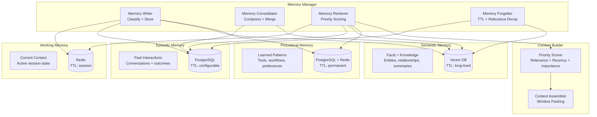
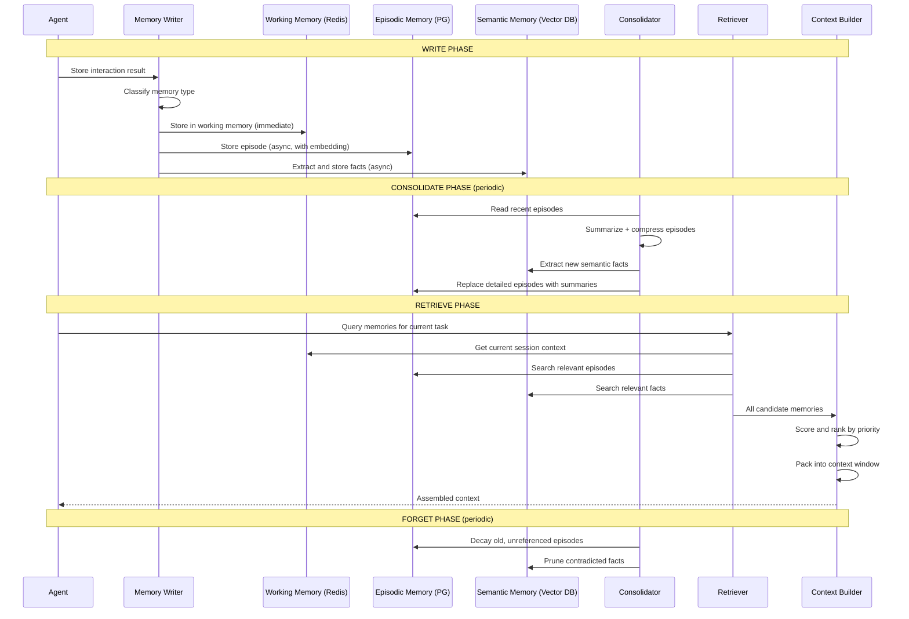

# Design: Agent Memory System

This document presents a deep system design for a production-grade agent memory system -- the infrastructure that enables AI agents to remember past interactions, learn from experience, maintain context across sessions, and share knowledge between agents. Memory is arguably the most important differentiator between a stateless LLM wrapper and a true agent. This design covers the full memory taxonomy (working, episodic, semantic, procedural), storage backends, lifecycle management, context window optimization, and cross-agent memory sharing. This is a high-value interview topic because it sits at the core of agent architecture and touches on distributed systems, information retrieval, and cognitive science.

---

## Requirements Gathering

### Functional Requirements

1. **Memory taxonomy** -- support working memory (current session), episodic memory (past interactions), semantic memory (facts and knowledge), and procedural memory (learned patterns and workflows)
2. **Write, consolidate, retrieve, forget** -- full memory lifecycle with automatic consolidation and configurable retention
3. **Context window management** -- dynamically select the most relevant memories to fill the LLM context window
4. **Cross-session persistence** -- memories survive agent restarts and session boundaries
5. **Memory sharing** -- agents can share relevant memories with other agents in a multi-agent system
6. **Priority scoring** -- rank memories by relevance, recency, importance, and access frequency
7. **Privacy and data retention** -- enforce data retention policies, support GDPR deletion, and isolate per-user memories

### Non-Functional Requirements

| Requirement | Target |
|-------------|--------|
| Write latency | < 50ms for working memory; < 200ms for persistent |
| Retrieval latency | < 100ms for top-20 memories |
| Context assembly latency | < 300ms to build full context |
| Storage per agent | Support 100K+ memories per agent instance |
| Cross-agent sharing latency | < 500ms |
| Retention compliance | 100% enforcement of TTL and deletion policies |
| Scale | 10K+ concurrent agents, 1B+ total memories |

### Out of Scope

- Training or fine-tuning models on memories (this is a runtime system)
- Memory visualization and debugging UI (separate tooling)
- Agent decision-making logic (this is the memory layer only)

---

## Memory Taxonomy



---

## Data Flow: Memory Lifecycle



---

## Component Deep Dive

### 1. Memory Writer

```python
class MemoryWriter:
    """Classifies and stores memories across the appropriate backends."""

    def __init__(self, working_store, episodic_store, semantic_store, procedural_store, embedder):
        self.working = working_store       # Redis
        self.episodic = episodic_store     # PostgreSQL
        self.semantic = semantic_store     # Vector DB
        self.procedural = procedural_store # PostgreSQL + Redis
        self.embedder = embedder

    async def write(self, agent_id: str, memory: RawMemory) -> list[str]:
        """Write a memory to the appropriate store(s)."""
        memory_ids = []

        # Always write to working memory (fast path)
        wm_id = await self.working.set(
            key=f"{agent_id}:wm:{memory.id}",
            value=memory.serialize(),
            ttl=memory.session_ttl or 3600,
        )
        memory_ids.append(wm_id)

        # Classify and write to persistent stores (async)
        classification = await self._classify(memory)

        if classification.is_episodic:
            embedding = await self.embedder.embed(memory.content)
            em_id = await self.episodic.insert(EpisodicMemory(
                agent_id=agent_id,
                content=memory.content,
                embedding=embedding,
                outcome=memory.outcome,
                timestamp=memory.timestamp,
                importance=classification.importance_score,
                metadata=memory.metadata,
                ttl=self._compute_ttl(classification),
            ))
            memory_ids.append(em_id)

        if classification.has_facts:
            facts = await self._extract_facts(memory)
            for fact in facts:
                embedding = await self.embedder.embed(fact.statement)
                sm_id = await self.semantic.upsert(SemanticMemory(
                    agent_id=agent_id,
                    statement=fact.statement,
                    embedding=embedding,
                    confidence=fact.confidence,
                    source_episode=memory.id,
                    entity_tags=fact.entities,
                ))
                memory_ids.append(sm_id)

        if classification.is_procedural:
            pm_id = await self.procedural.upsert(ProceduralMemory(
                agent_id=agent_id,
                pattern_name=classification.pattern_name,
                pattern=memory.content,
                success_rate=1.0,  # Initial; updated over time
                usage_count=1,
            ))
            memory_ids.append(pm_id)

        return memory_ids

    async def _classify(self, memory: RawMemory) -> MemoryClassification:
        """Classify a memory into types using a lightweight LLM call."""
        response = await self.classifier_llm.generate(
            system=MEMORY_CLASSIFICATION_PROMPT,
            user=f"""Classify this memory:

Content: {memory.content[:500]}
Type of interaction: {memory.interaction_type}
Outcome: {memory.outcome}

Determine:
1. Is this episodic? (a specific interaction to remember)
2. Does it contain facts? (extractable knowledge)
3. Is it procedural? (a reusable pattern or workflow)
4. Importance score (0.0-1.0)""",
            response_format=MemoryClassificationSchema,
        )
        return MemoryClassification.parse(response)

    async def _extract_facts(self, memory: RawMemory) -> list[Fact]:
        """Extract factual statements from a memory for semantic storage."""
        response = await self.classifier_llm.generate(
            system=FACT_EXTRACTION_PROMPT,
            user=f"""Extract factual statements from this interaction:

{memory.content}

For each fact:
- statement: a self-contained factual statement
- confidence: how confident (0.0-1.0)
- entities: key entities mentioned""",
            response_format=FactListSchema,
        )
        return [Fact.parse(f) for f in response.facts]
```

### 2. Memory Retriever with Priority Scoring

```python
class MemoryRetriever:
    """Retrieves and ranks memories across all stores using priority scoring."""

    async def retrieve(
        self, agent_id: str, query: str, context: RetrievalContext, budget_tokens: int = 50_000
    ) -> list[ScoredMemory]:
        # Parallel retrieval from all stores
        working, episodic, semantic, procedural = await asyncio.gather(
            self._retrieve_working(agent_id),
            self._retrieve_episodic(agent_id, query, top_k=30),
            self._retrieve_semantic(agent_id, query, top_k=30),
            self._retrieve_procedural(agent_id, query, top_k=10),
        )

        # Score all memories
        candidates = []
        for memory in working + episodic + semantic + procedural:
            score = self._compute_priority_score(memory, query, context)
            candidates.append(ScoredMemory(memory=memory, score=score))

        # Sort by priority score
        candidates.sort(key=lambda x: x.score, reverse=True)

        # Deduplicate (same fact from episodic and semantic)
        candidates = self._deduplicate(candidates)

        return candidates

    def _compute_priority_score(
        self, memory, query: str, context: RetrievalContext
    ) -> float:
        """Multi-factor priority scoring for memory ranking."""
        weights = {
            "relevance": 0.35,
            "recency": 0.20,
            "importance": 0.20,
            "access_frequency": 0.10,
            "type_bonus": 0.15,
        }

        scores = {}

        # Relevance: cosine similarity to current query
        scores["relevance"] = memory.similarity_score or 0.0

        # Recency: exponential decay based on age
        age_hours = (datetime.utcnow() - memory.timestamp).total_seconds() / 3600
        scores["recency"] = math.exp(-age_hours / (24 * 7))  # Half-life of ~1 week

        # Importance: assigned at write time, boosted by outcomes
        scores["importance"] = memory.importance

        # Access frequency: how often this memory has been retrieved
        scores["access_frequency"] = min(memory.access_count / 10, 1.0)

        # Type bonus: working memory gets a boost in current session
        type_bonuses = {
            "working": 0.3,
            "procedural": 0.2,
            "semantic": 0.1,
            "episodic": 0.0,
        }
        scores["type_bonus"] = type_bonuses.get(memory.memory_type, 0.0)

        # Weighted sum
        return sum(weights[k] * scores[k] for k in weights)
```

### 3. Context Window Manager

```python
class ContextWindowManager:
    """Packs the most valuable memories into the context window."""

    def __init__(self, tokenizer, max_tokens: int = 128_000):
        self.tokenizer = tokenizer
        self.max_tokens = max_tokens

    def assemble_context(
        self,
        system_prompt: str,
        current_query: str,
        memories: list[ScoredMemory],
        reserved_for_output: int = 4096,
    ) -> AssembledContext:
        # Calculate available budget
        system_tokens = self.tokenizer.count(system_prompt)
        query_tokens = self.tokenizer.count(current_query)
        budget = self.max_tokens - system_tokens - query_tokens - reserved_for_output

        # Allocate budget by memory type (ensure diversity)
        allocations = {
            "working": int(budget * 0.40),     # Current session gets most space
            "procedural": int(budget * 0.15),  # Reusable patterns
            "semantic": int(budget * 0.25),    # Factual knowledge
            "episodic": int(budget * 0.20),    # Past experiences
        }

        included = []
        for memory_type, type_budget in allocations.items():
            type_memories = [m for m in memories if m.memory.memory_type == memory_type]
            remaining = type_budget

            for scored_memory in type_memories:
                tokens = self.tokenizer.count(scored_memory.memory.content)
                if tokens <= remaining:
                    included.append(scored_memory)
                    remaining -= tokens
                elif tokens > type_budget * 0.5:
                    # Memory too large -- summarize it
                    summarized = self._summarize_to_fit(scored_memory, remaining)
                    if summarized:
                        included.append(summarized)
                        remaining -= self.tokenizer.count(summarized.memory.content)

        # Final sort: working memory first (recency), then by score
        included.sort(key=lambda m: (
            0 if m.memory.memory_type == "working" else 1,
            -m.score,
        ))

        return AssembledContext(
            memories=included,
            tokens_used=sum(self.tokenizer.count(m.memory.content) for m in included),
            tokens_available=budget,
            memories_dropped=len(memories) - len(included),
        )
```

### 4. Memory Consolidator

The consolidator runs periodically to compress episodic memories into summaries and extract durable facts into semantic memory.

```python
class MemoryConsolidator:
    """Periodically consolidates memories: compress episodes, extract facts, prune stale data."""

    async def consolidate(self, agent_id: str):
        """Run a full consolidation cycle for an agent."""
        # Phase 1: Summarize old detailed episodes
        await self._summarize_old_episodes(agent_id)

        # Phase 2: Extract new semantic facts from recent episodes
        await self._extract_semantic_facts(agent_id)

        # Phase 3: Merge duplicate or near-duplicate semantic memories
        await self._merge_semantic_duplicates(agent_id)

        # Phase 4: Update procedural memory success rates
        await self._update_procedural_stats(agent_id)

        # Phase 5: Forget (apply retention policies)
        await self._apply_retention_policies(agent_id)

    async def _summarize_old_episodes(self, agent_id: str):
        """Replace detailed episodes older than threshold with summaries."""
        threshold = datetime.utcnow() - timedelta(days=7)
        old_episodes = await self.episodic.query(
            agent_id=agent_id,
            before=threshold,
            is_summary=False,
            limit=100,
        )

        if not old_episodes:
            return

        # Group by topic/task for coherent summarization
        groups = self._group_by_topic(old_episodes)

        for topic, episodes in groups.items():
            summary = await self.llm.generate(
                system=CONSOLIDATION_PROMPT,
                user=f"""Summarize these {len(episodes)} interactions into a concise memory.

Topic: {topic}
Episodes:
{self._format_episodes(episodes)}

Preserve:
- Key decisions and their outcomes
- Important facts learned
- Errors made and lessons learned
- User preferences discovered""",
            )

            # Store summary
            await self.episodic.insert(EpisodicMemory(
                agent_id=agent_id,
                content=summary,
                embedding=await self.embedder.embed(summary),
                importance=max(e.importance for e in episodes),
                is_summary=True,
                summarized_from=[e.id for e in episodes],
                timestamp=max(e.timestamp for e in episodes),
            ))

            # Remove detailed episodes
            for episode in episodes:
                await self.episodic.delete(episode.id)

    async def _apply_retention_policies(self, agent_id: str):
        """Apply TTL and relevance-based forgetting."""
        # Delete expired memories
        await self.episodic.delete_expired()
        await self.semantic.delete_expired()

        # Relevance decay: memories that are never retrieved lose importance
        stale = await self.episodic.query(
            agent_id=agent_id,
            last_accessed_before=datetime.utcnow() - timedelta(days=30),
            importance_below=0.3,
        )
        for memory in stale:
            await self.episodic.delete(memory.id)
```

### 5. Cross-Agent Memory Sharing

```python
class MemorySharing:
    """Enables agents to share relevant memories within a multi-agent system."""

    async def share(
        self, source_agent: str, target_agent: str, query: str, max_memories: int = 10
    ) -> list[SharedMemory]:
        # Retrieve relevant memories from source agent
        memories = await self.retriever.retrieve(
            agent_id=source_agent,
            query=query,
            context=RetrievalContext(sharing_mode=True),
        )

        # Filter: only share non-private memories
        shareable = [m for m in memories if m.memory.sharing_policy != "private"]

        # Apply access control
        shareable = [m for m in shareable if self._check_sharing_permissions(
            source_agent, target_agent, m.memory
        )]

        # Redact sensitive information
        redacted = []
        for m in shareable[:max_memories]:
            redacted_content = await self._redact_sensitive(m.memory.content)
            redacted.append(SharedMemory(
                content=redacted_content,
                source_agent=source_agent,
                memory_type=m.memory.memory_type,
                relevance_score=m.score,
                shared_at=datetime.utcnow(),
            ))

        # Store in target agent's episodic memory with provenance
        for shared in redacted:
            await self.writer.write(target_agent, RawMemory(
                content=f"[Shared from {source_agent}] {shared.content}",
                interaction_type="shared_memory",
                metadata={"source_agent": source_agent, "original_score": shared.relevance_score},
            ))

        return redacted
```

---

## Privacy and Data Retention

:::warning
Memory systems store potentially sensitive user information across sessions. Every memory must have an associated retention policy, and the system must support hard deletion (not just soft delete) for GDPR compliance. The "right to be forgotten" means removing a user's memories from all stores -- including vector databases where deletion of individual embeddings can be complex.
:::

```python
class RetentionPolicyEnforcer:
    """Enforces data retention policies across all memory stores."""

    POLICIES = {
        "transient": timedelta(hours=1),
        "session": timedelta(hours=24),
        "short_term": timedelta(days=7),
        "medium_term": timedelta(days=90),
        "long_term": timedelta(days=365),
        "permanent": None,  # Never expires (procedural memory)
    }

    async def handle_deletion_request(self, user_id: str):
        """GDPR Article 17: Right to erasure."""
        # Delete from all stores
        await asyncio.gather(
            self.working_store.delete_by_user(user_id),
            self.episodic_store.delete_by_user(user_id),
            self.semantic_store.delete_by_user(user_id),
            self.procedural_store.delete_by_user(user_id),
        )

        # Verify deletion
        remaining = await self._count_user_memories(user_id)
        if remaining > 0:
            raise DeletionIncompleteError(f"{remaining} memories remain after deletion")

        # Audit log (required even after deletion)
        await self.audit.log(
            action="gdpr_erasure",
            user_id=user_id,
            timestamp=datetime.utcnow(),
            memories_deleted="all",
        )
```

---

## Benchmarking Memory Quality

```python
class MemoryQualityBenchmark:
    """Evaluates memory system effectiveness."""

    async def evaluate(self, test_scenarios: list[MemoryTestCase]) -> BenchmarkReport:
        metrics = {
            "retrieval_relevance": [],
            "context_utilization": [],
            "memory_freshness": [],
            "consolidation_quality": [],
            "cross_session_recall": [],
        }

        for scenario in test_scenarios:
            # Simulate a multi-turn conversation
            for turn in scenario.turns:
                await self.memory_system.write(scenario.agent_id, turn.memory)

            # Test retrieval quality
            retrieved = await self.memory_system.retrieve(
                scenario.agent_id, scenario.test_query
            )

            metrics["retrieval_relevance"].append(
                self._ndcg(retrieved, scenario.expected_memories)
            )

            # Test context assembly efficiency
            context = await self.memory_system.assemble_context(
                scenario.agent_id, scenario.test_query
            )
            metrics["context_utilization"].append(
                context.tokens_used / context.tokens_available
            )

        return BenchmarkReport(
            metrics={k: sum(v) / len(v) for k, v in metrics.items()}
        )
```

---

## Scaling Considerations

| Component | Backend | Scale Strategy |
|-----------|---------|---------------|
| Working memory | Redis Cluster | Shard by agent_id; TTL auto-cleanup |
| Episodic memory | PostgreSQL | Partition by agent_id + time; read replicas |
| Semantic memory | Pinecone / pgvector | Namespace per agent; approximate search |
| Procedural memory | PostgreSQL + Redis cache | Small dataset; cache hot patterns |
| Consolidator | Background workers | Scheduled per agent; distributed lock |

### Cost Analysis (per 1K agents)

| Component | Monthly Cost | Notes |
|-----------|-------------|-------|
| Redis (working memory) | $200 | 50MB per agent, 50GB total |
| PostgreSQL (episodic) | $500 | 100K episodes per agent |
| Vector DB (semantic) | $300 | 500K vectors per 1K agents |
| Embedding compute | $100 | Amortized over writes |
| Consolidation compute | $50 | Periodic batch jobs |
| **Total** | **$1,150/month** | $1.15 per agent per month |

:::info
At $1.15 per agent per month, memory is one of the cheapest components in an agent system -- but also one of the highest-leverage. An agent with good memory provides dramatically better user experience than one that forgets everything between sessions.
:::

---

## Interview Answer Structure

1. **Clarify scope** (2 min) -- single agent vs. multi-agent; session vs. persistent; privacy requirements
2. **Memory taxonomy** (5 min) -- explain working, episodic, semantic, and procedural memory with concrete examples
3. **Storage backend mapping** (3 min) -- why Redis for working, PostgreSQL for episodic, vector DB for semantic
4. **Write and retrieve flow** (5 min) -- how memories are classified, stored, scored, and assembled into context
5. **Consolidation** (3 min) -- why and how episodes are compressed; fact extraction; forgetting
6. **Context window management** (3 min) -- priority scoring; budget allocation by type; summarization for overflow
7. **Cross-agent sharing** (2 min) -- sharing protocol; access control; provenance tracking
8. **Privacy** (2 min) -- GDPR compliance; hard deletion across stores; retention policies
