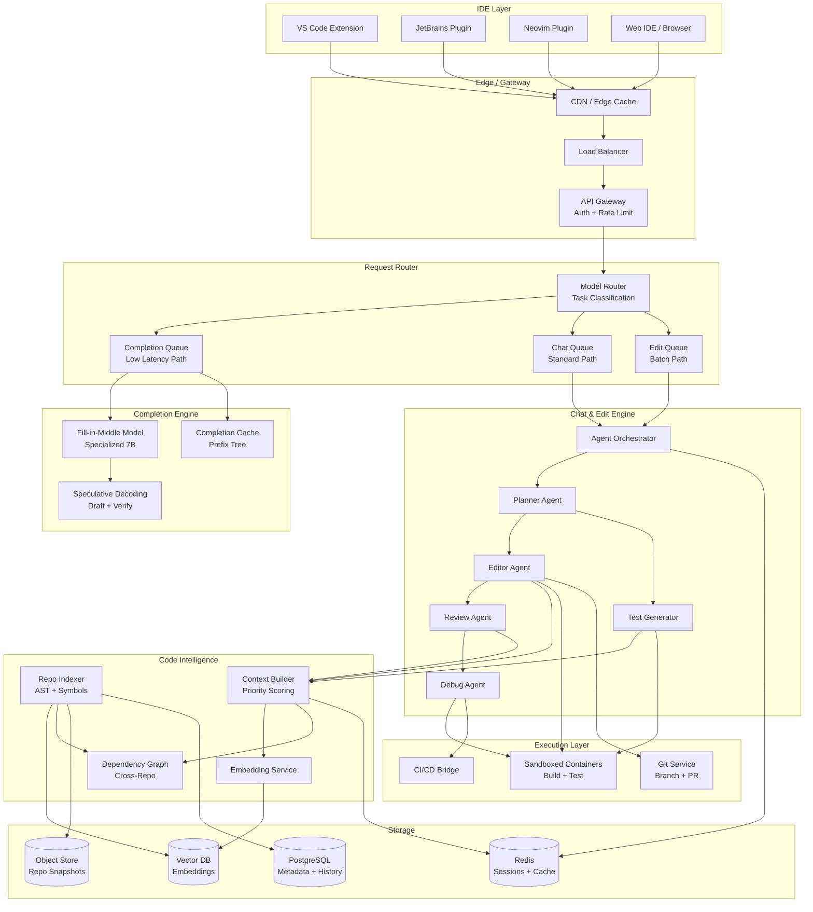
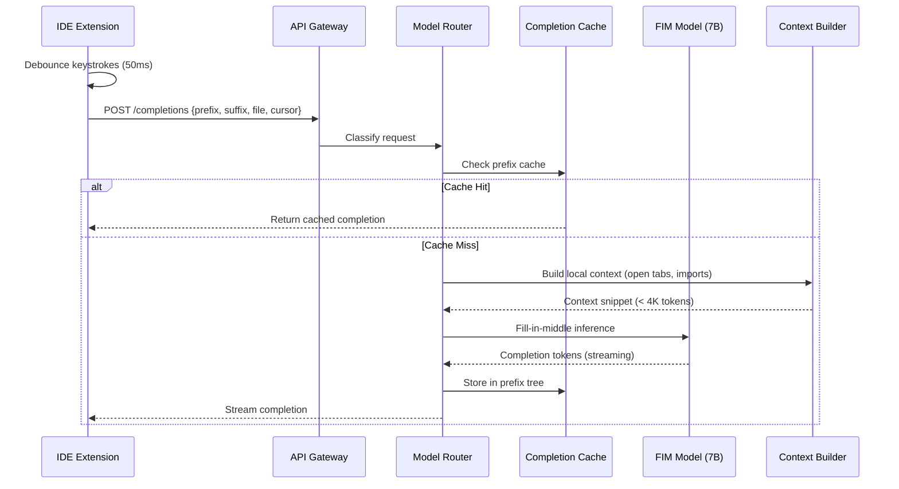

# Design: AI Coding Assistant

This document presents a comprehensive system design for a production-grade AI coding assistant -- a system that provides real-time code completions, chat-based assistance, multi-file editing, test generation, code review automation, and CI/CD integration at the scale of millions of developers. Think GitHub Copilot, Cursor, or Cody. This goes beyond a single-repo agent to cover IDE-native integration, sub-200ms completion latency, cost optimization through model routing, and enterprise-grade security.

---

## Requirements Gathering

### Functional Requirements

1. **Real-time code completion** -- inline suggestions as developers type, with multi-line and whole-function completions
2. **Chat mode** -- conversational interface for explaining code, debugging, and complex edits
3. **Repo-wide context** -- understand an entire codebase through AST parsing, dependency graphs, and semantic embeddings
4. **Multi-file editing** -- coordinated changes across files with structured diff generation
5. **Test generation pipeline** -- generate unit, integration, and property-based tests from source code
6. **Code review automation** -- review PRs, detect bugs, suggest improvements, enforce style
7. **CI/CD integration** -- trigger builds, interpret failures, auto-fix broken tests
8. **Multi-repo support** -- navigate and understand monorepos and cross-repository dependencies

### Non-Functional Requirements

| Requirement | Target |
|-------------|--------|
| Completion latency (inline) | < 200ms for first token |
| Completion latency (multi-line) | < 500ms for full suggestion |
| Chat response latency | < 2s for first token |
| Availability | 99.9% uptime |
| Concurrent users | 2M+ simultaneous sessions |
| Context accuracy | > 85% of suggestions reference correct files |
| Cost per user per day | < $0.15 |
| Security | Zero data leakage between tenants; no credential exposure |

### Out of Scope

- Full autonomous software engineering (no unsupervised production deploys)
- Non-code file types (design files, spreadsheets) in V1
- On-device model inference (all inference is cloud-based)

---

## High-Level Architecture



---

## Data Flow: Inline Completion

The completion path is the most latency-sensitive part of the system. Every keystroke potentially triggers a completion request.



### IDE Integration Architecture

The IDE extension is a critical component. It must be lightweight, non-blocking, and language-aware.

```python
class IDEExtensionBackend:
    """Server-side handler for IDE extension requests."""

    def __init__(self, ctx_builder, model_router, cache):
        self.ctx_builder = ctx_builder
        self.model_router = model_router
        self.cache = cache
        self.debounce_ms = 50
        self.max_local_context_tokens = 4096

    async def handle_completion(self, request: CompletionRequest) -> CompletionResponse:
        """Handle inline completion with sub-200ms target."""
        # Step 1: Build lightweight local context (no network calls)
        local_ctx = self._build_local_context(
            prefix=request.prefix[-2000:],       # Last 2000 chars before cursor
            suffix=request.suffix[:500],          # Next 500 chars after cursor
            file_path=request.file_path,
            open_tabs=request.open_tab_snippets,  # Summaries of open files
            language=request.language,
        )

        # Step 2: Check completion cache (prefix-tree lookup)
        cache_key = self._compute_cache_key(local_ctx)
        cached = await self.cache.get(cache_key)
        if cached and self._is_still_relevant(cached, request):
            return CompletionResponse(completions=cached, source="cache")

        # Step 3: Route to appropriate model
        model = self.model_router.select_model(
            task="completion",
            context_length=len(local_ctx),
            language=request.language,
            latency_budget_ms=180,
        )

        # Step 4: Run inference
        completion = await model.fill_in_middle(
            prefix=local_ctx.prefix,
            suffix=local_ctx.suffix,
            max_tokens=256,
            temperature=0.0,
            stop_sequences=["\n\n", "def ", "class ", "```"],
        )

        await self.cache.set(cache_key, completion, ttl=60)
        return CompletionResponse(completions=[completion], source="model")

    def _build_local_context(self, prefix, suffix, file_path, open_tabs, language):
        """Assemble context without any remote calls for speed."""
        parts = []
        # Current file context is highest priority
        parts.append(f"# File: {file_path}\n{prefix}")

        # Add relevant snippets from open tabs (pre-ranked by IDE)
        token_budget = self.max_local_context_tokens - len(prefix) // 4
        for tab in open_tabs[:5]:
            snippet = tab.relevant_snippet[:500]
            if len(snippet) // 4 < token_budget:
                parts.append(f"# Related: {tab.path}\n{snippet}")
                token_budget -= len(snippet) // 4

        return LocalContext(prefix="\n".join(parts), suffix=suffix)
```

---

## Component Deep Dive

### 1. Model Router and Cost Optimization

Not every request needs the most expensive model. The model router classifies requests and routes them to the cheapest model that can handle the task.

```python
class ModelRouter:
    """Routes requests to optimal model based on task, complexity, and budget."""

    ROUTING_TABLE = {
        "completion_simple": {"model": "fim-7b", "cost_per_1k": 0.001, "latency_p99_ms": 150},
        "completion_complex": {"model": "fim-34b", "cost_per_1k": 0.005, "latency_p99_ms": 300},
        "chat_simple": {"model": "claude-haiku", "cost_per_1k": 0.01, "latency_p99_ms": 800},
        "chat_complex": {"model": "claude-sonnet", "cost_per_1k": 0.06, "latency_p99_ms": 1500},
        "edit_multi_file": {"model": "claude-opus", "cost_per_1k": 0.15, "latency_p99_ms": 5000},
        "code_review": {"model": "claude-sonnet", "cost_per_1k": 0.06, "latency_p99_ms": 2000},
    }

    def classify_and_route(self, request) -> ModelConfig:
        task_type = self._classify_task(request)
        config = self.ROUTING_TABLE[task_type]

        # Check if user is on a paid tier with access to premium models
        if request.user_tier == "free" and config["cost_per_1k"] > 0.01:
            config = self._downgrade_model(config)

        # Apply latency budget constraint
        if request.latency_budget_ms and config["latency_p99_ms"] > request.latency_budget_ms:
            config = self._find_faster_alternative(config, request.latency_budget_ms)

        return ModelConfig(**config)

    def _classify_task(self, request) -> str:
        if request.type == "completion":
            return "completion_complex" if self._is_complex(request) else "completion_simple"
        if request.type == "chat":
            return "chat_complex" if len(request.context_files) > 3 else "chat_simple"
        if request.type == "edit":
            return "edit_multi_file"
        return "chat_simple"

    def _is_complex(self, request) -> bool:
        """Heuristics: cross-file references, complex types, algorithmic code."""
        indicators = [
            len(request.prefix) > 500,
            "import" in request.prefix[-200:],
            request.language in ("rust", "haskell", "scala"),
            any(kw in request.prefix[-300:] for kw in ["async", "generic", "template"]),
        ]
        return sum(indicators) >= 2
```

:::tip
In a system design interview, the model router is a strong talking point. It shows you understand cost-performance tradeoffs -- the single biggest operational challenge for AI coding assistants at scale.
:::

### 2. Repo-Wide Context Building

For chat and edit modes, the system needs deep understanding of the codebase. This goes beyond the simple prefix/suffix of completions.

```python
class RepoContextBuilder:
    """Builds rich context from repo-wide understanding."""

    def __init__(self, vector_db, dep_graph, ast_index, tokenizer):
        self.vector_db = vector_db
        self.dep_graph = dep_graph
        self.ast_index = ast_index
        self.tokenizer = tokenizer

    async def build_context(
        self, query: str, target_files: list[str], max_tokens: int = 120_000
    ) -> RepoContext:
        budget = TokenBudget(total=max_tokens)
        sections = []

        # Priority 1: Repo map (always included, ~500 tokens)
        repo_map = await self._generate_repo_map()
        sections.append(ContextSection("repo_map", repo_map, priority=100))
        budget.deduct(repo_map)

        # Priority 2: Target files -- full content
        for f in target_files:
            content = await self._read_file(f)
            sections.append(ContextSection("target", content, priority=90, path=f))
            budget.deduct(content)

        # Priority 3: AST-based symbol references (callers, callees, type defs)
        symbols = await self.ast_index.get_symbols_in_files(target_files)
        for sym in symbols:
            refs = await self.dep_graph.get_references(sym, depth=2)
            for ref in refs[:10]:
                snippet = await self._extract_symbol_context(ref)
                sections.append(ContextSection("reference", snippet, priority=70, path=ref.path))

        # Priority 4: Semantic search results
        sem_results = await self.vector_db.search(query, top_k=30)
        for result in sem_results:
            if result.path not in target_files:
                sections.append(ContextSection(
                    "semantic", result.content, priority=50 + result.score * 20, path=result.path
                ))

        # Priority 5: Recently edited files (from IDE telemetry)
        # Priority 6: Test files for target files

        # Assemble within token budget using priority scoring
        return self._assemble(sections, budget)

    def _assemble(self, sections: list, budget: TokenBudget) -> RepoContext:
        """Pack sections into context window by priority, respecting budget."""
        sections.sort(key=lambda s: s.priority, reverse=True)
        included = []
        for section in sections:
            tokens = self.tokenizer.count(section.content)
            if budget.remaining >= tokens:
                included.append(section)
                budget.deduct_tokens(tokens)
        return RepoContext(sections=included, tokens_used=budget.total - budget.remaining)
```

### 3. Multi-File Edit with Diff Generation

```python
class MultiFileEditor:
    """Generates coordinated edits across multiple files as structured diffs."""

    async def generate_edits(self, task: str, context: RepoContext) -> EditPlan:
        # Phase 1: Plan which files need changes
        plan = await self.planner_llm.generate(
            system=PLANNER_PROMPT,
            user=f"Task: {task}\n\nRepo context:\n{context.render()}",
            response_format=EditPlanSchema,
        )

        # Phase 2: Generate edits for each file in dependency order
        edits = []
        for file_plan in self._topological_sort(plan.files):
            file_edit = await self.editor_llm.generate(
                system=EDITOR_PROMPT,
                user=f"""Generate a search-and-replace edit for {file_plan.path}.
Goal: {file_plan.change_description}
Current file content:
{await self._read_file(file_plan.path)}
Already-applied edits in other files:
{self._summarize_edits(edits)}""",
                response_format=FileEditSchema,
            )
            edits.append(file_edit)

        # Phase 3: Validate all edits together
        validation = await self._validate_edit_plan(edits)
        if not validation.is_valid:
            edits = await self._fix_conflicts(edits, validation.conflicts)

        return EditPlan(edits=edits, summary=plan.summary)
```

### 4. Test Generation Pipeline

```python
class TestGenerationPipeline:
    async def generate_tests(self, source_files: list[str], edits: list[FileEdit]) -> list[TestFile]:
        # Detect test framework and conventions
        conventions = await self._detect_conventions()

        # Find existing tests
        existing_tests = {}
        for src in source_files:
            test_path = self._find_test_file(src)
            if test_path:
                existing_tests[src] = await self._read_file(test_path)

        # Generate tests per source file
        test_files = []
        for src in source_files:
            relevant_edits = [e for e in edits if e.file_path == src]
            test_code = await self.llm.generate(
                system=TEST_GEN_PROMPT,
                user=f"""Source: {src}
Changes: {self._format_edits(relevant_edits)}
Existing tests: {existing_tests.get(src, 'None')}
Framework: {conventions.framework}
Patterns: {conventions.patterns}

Generate tests covering:
1. Happy path for each changed function
2. Edge cases (empty, null, boundary values)
3. Error paths (invalid input, exceptions)
4. Integration with dependent functions""",
            )
            test_files.append(TestFile(path=self._test_path(src), content=test_code))

        # Validate tests compile and run
        for tf in test_files:
            result = await self.sandbox.run_test(tf)
            if not result.passed:
                tf.content = await self._fix_test(tf, result.output)

        return test_files
```

---

## Scaling to Millions of Users

### Completion Path Optimization

| Technique | Impact |
|-----------|--------|
| Prefix-tree caching | 30-40% cache hit rate for common patterns |
| Speculative decoding | 2-3x faster inference with draft model |
| KV-cache sharing | Reuse cached prefixes across similar requests |
| Regional deployment | < 50ms network latency to nearest region |
| Request batching | Batch concurrent requests for GPU efficiency |
| Model quantization | INT8/INT4 for completion models, minimal quality loss |

### Cost Breakdown per User per Day

| Component | Cost | Optimization |
|-----------|------|--------------|
| Completions (~200/day) | $0.04 | Small FIM model, caching |
| Chat (~10 messages/day) | $0.06 | Model routing by complexity |
| Edit/Review (~2/day) | $0.03 | Batch processing, context pruning |
| Indexing (amortized) | $0.01 | Incremental updates only |
| Infrastructure | $0.02 | Shared GPU pools |
| **Total** | **$0.16** | Target: < $0.15 with caching improvements |

:::info
GitHub Copilot charges $10/month (~$0.33/day) for individual users and $19/month (~$0.63/day) for business. Keeping cost per user under $0.15/day leaves healthy margins even at the individual tier.
:::

---

## Security Architecture

| Threat | Mitigation |
|--------|------------|
| Cross-tenant data leakage | Strict tenant isolation; separate embedding namespaces; no shared KV caches |
| IP protection (proprietary code) | Code never stored beyond session; encryption at rest and in transit |
| Credential exposure in suggestions | Real-time secret scanning on all outputs; pattern matching for API keys, passwords |
| Prompt injection via code comments | Input sanitization; instruction hierarchy in system prompts |
| Malicious code generation | Static analysis on generated code; sandbox execution before delivery |
| Unauthorized repo access | OAuth scopes; fine-grained repo permissions; audit logging |

:::warning
For enterprise deployments, offer a VPC-isolated deployment option where customer code never leaves their cloud account. This is a non-negotiable requirement for many large enterprises and a key competitive differentiator.
:::

---

## Trade-Off Analysis

| Decision | Option A | Option B | Chosen | Rationale |
|----------|----------|----------|--------|-----------|
| Completion model | Large general model (70B) | Specialized FIM model (7B) | 7B FIM | 10x lower latency, 20x lower cost; fine-tuned models match quality for completions |
| Context strategy | Always fetch full repo context | Adaptive context by task type | Adaptive | Completions need only local context; chat/edit need repo-wide |
| Caching layer | Per-user cache only | Shared + per-user cache | Both | Shared cache for common libraries; per-user for project-specific patterns |
| Diff format | Whole file replacement | Search-and-replace blocks | Search-replace | Lower token usage; easier to review; supports partial file edits |
| IDE communication | REST polling | WebSocket streaming | WebSocket | Required for real-time streaming of completions and chat responses |

---

## Interview Answer Structure

1. **Clarify scope** (2 min) -- inline completions vs. chat vs. autonomous editing; single IDE vs. multi-IDE
2. **Two-path architecture** (3 min) -- explain why completions and chat/edit are fundamentally different paths with different latency and cost profiles
3. **Deep dive: Completion latency** (5 min) -- how to achieve sub-200ms: small models, speculative decoding, prefix caching, edge deployment
4. **Deep dive: Context building** (5 min) -- AST parsing, dependency graphs, semantic search, priority-based context assembly
5. **Multi-file editing** (3 min) -- topological ordering, structured diffs, cross-file validation
6. **Cost optimization** (3 min) -- model routing, caching strategies, per-user cost analysis
7. **Security** (2 min) -- tenant isolation, secret scanning, enterprise VPC deployment
8. **Scale numbers** (2 min) -- 2M concurrent users, 200 completions/user/day = 400M completions/day
