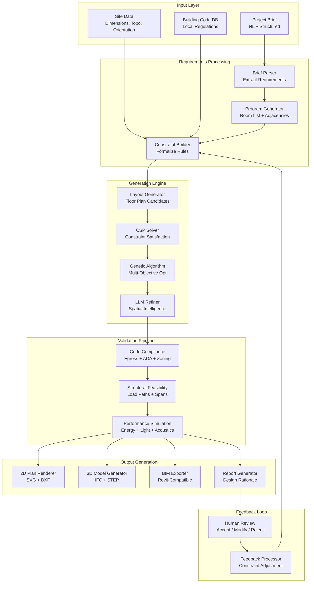
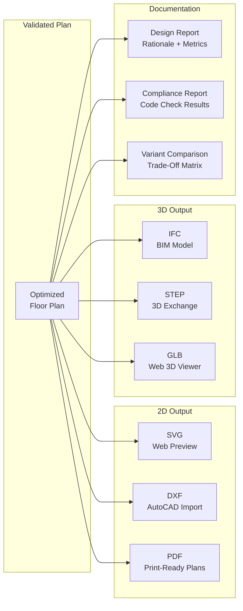

# Design: AI System that Generates Building Plans

This document presents a system design for an AI system that generates architectural building plans from a set of requirements -- rooms, spatial constraints, budget, site dimensions, and regulatory constraints. The system combines generative AI with constraint satisfaction, building code compliance, structural feasibility validation, and multi-objective optimization to produce viable floor plans, 3D models, and BIM output. This is a compelling interview topic because it involves the intersection of generative models, hard optimization constraints, and domain expertise -- a space where pure LLM approaches fall short and hybrid architectures are essential.

---

## Requirements Gathering

### Functional Requirements

1. **Requirements parsing** -- extract rooms, sizes, adjacencies, constraints, and preferences from natural language briefs
2. **Generative design** -- produce multiple floor plan candidates that satisfy the requirements
3. **Building code compliance** -- check generated plans against local building codes (egress, accessibility, zoning)
4. **Structural feasibility** -- validate that the generated layout supports viable structural systems
5. **Multi-objective optimization** -- optimize across cost, energy efficiency, spatial efficiency, and natural light
6. **Iterative refinement** -- accept human feedback and re-generate or adjust plans
7. **Output formats** -- 2D floor plans (SVG/DXF), 3D models (IFC/STEP), BIM-ready output
8. **Simulation integration** -- connect to energy, lighting, and acoustic simulation tools for validation

### Non-Functional Requirements

| Requirement | Target |
|-------------|--------|
| Generation time (single floor) | < 2 minutes for 5 plan variants |
| Generation time (multi-story) | < 10 minutes for 5 variants |
| Code compliance rate | > 95% of generated plans pass compliance check |
| Structural feasibility rate | > 90% of plans are structurally viable |
| Output precision | All dimensions accurate to 1cm |
| Optimization convergence | Pareto-optimal within 5% of theoretical best |

### Out of Scope

- Detailed structural engineering (beam sizing, foundation design)
- MEP system layout (plumbing, electrical routing)
- Interior design and furniture placement
- Construction documentation

---

## High-Level Architecture



---

## Component Deep Dive

### 1. Requirements Parsing and Program Generation

```python
class ProjectBriefParser:
    """Parses natural language project briefs into structured requirements."""

    async def parse(self, brief: str, site_data: SiteData) -> ProjectProgram:
        # Use LLM to extract structured requirements
        response = await self.llm.generate(
            system=BRIEF_PARSING_PROMPT,
            user=f"""Parse this architectural project brief into a structured program.

Brief:
{brief}

Site:
- Dimensions: {site_data.dimensions}
- Orientation: {site_data.orientation}
- Zoning: {site_data.zoning_class}
- Setbacks: {site_data.setbacks}

Extract:
1. Room list with minimum/desired sizes
2. Adjacency requirements (which rooms should be near each other)
3. Access requirements (entries, corridors, service access)
4. Special constraints (views, noise separation, security zones)
5. Budget tier (economy / standard / premium)
6. Sustainability goals (LEED level, energy targets)""",
            response_format=ProjectProgramSchema,
        )

        program = ProjectProgram.parse(response)

        # Validate program feasibility
        total_area = sum(room.min_area for room in program.rooms)
        usable_site_area = site_data.buildable_area * program.max_floors
        if total_area > usable_site_area * 0.85:  # 85% efficiency factor
            program.warnings.append(
                f"Required area ({total_area} sqm) may exceed buildable area "
                f"({usable_site_area * 0.85:.0f} sqm at 85% efficiency)"
            )

        return program


class ConstraintBuilder:
    """Converts requirements into formal constraints for the solver."""

    async def build(self, program: ProjectProgram, site: SiteData, codes: list[BuildingCode]) -> ConstraintSet:
        constraints = ConstraintSet()

        # Hard constraints (must satisfy)
        constraints.add_hard("site_boundary", SiteBoundaryConstraint(site.boundary, site.setbacks))
        constraints.add_hard("min_room_size", MinRoomSizeConstraints(program.rooms))
        constraints.add_hard("egress", EgressConstraints(codes, program.occupancy_type))
        constraints.add_hard("accessibility", ADAConstraints(codes))
        constraints.add_hard("structural_grid", StructuralGridConstraint(max_span=12.0))

        # Soft constraints (optimize toward)
        constraints.add_soft("adjacency", AdjacencyConstraints(program.adjacencies), weight=0.8)
        constraints.add_soft("natural_light", NaturalLightConstraint(site.orientation), weight=0.6)
        constraints.add_soft("views", ViewConstraints(program.view_preferences, site), weight=0.4)
        constraints.add_soft("circulation", CirculationEfficiencyConstraint(), weight=0.7)
        constraints.add_soft("cost", CostConstraint(program.budget_tier), weight=0.5)

        # Code-specific constraints
        for code in codes:
            code_constraints = await self._extract_code_constraints(code, program)
            for cc in code_constraints:
                constraints.add_hard(f"code_{code.name}_{cc.name}", cc)

        return constraints
```

### 2. Layout Generation with Hybrid Approach

The generation engine uses a three-stage hybrid approach: procedural generation for initial candidates, constraint satisfaction for feasibility, and genetic algorithms for optimization.

```python
class LayoutGenerator:
    """Generates floor plan candidates using a hybrid procedural + optimization approach."""

    async def generate(
        self, program: ProjectProgram, constraints: ConstraintSet, num_candidates: int = 20
    ) -> list[FloorPlan]:
        # Stage 1: Generate initial candidates with different strategies
        candidates = []

        # Strategy A: Grid-based placement
        candidates.extend(await self._grid_based_generation(program, constraints, n=8))

        # Strategy B: Graph-based from adjacency requirements
        candidates.extend(await self._adjacency_driven_generation(program, constraints, n=6))

        # Strategy C: LLM-guided spatial layout
        candidates.extend(await self._llm_guided_generation(program, constraints, n=6))

        # Stage 2: Filter through hard constraints
        feasible = []
        for candidate in candidates:
            violations = constraints.check_hard(candidate)
            if not violations:
                feasible.append(candidate)
            else:
                # Try to repair minor violations
                repaired = await self._repair_layout(candidate, violations, constraints)
                if repaired:
                    feasible.append(repaired)

        # Stage 3: Optimize with genetic algorithm
        optimized = await self._optimize(feasible, constraints, generations=100)

        # Stage 4: LLM refinement for spatial quality
        refined = []
        for plan in optimized[:num_candidates]:
            refined_plan = await self._llm_refine(plan, program)
            refined.append(refined_plan)

        return refined

    async def _llm_guided_generation(self, program, constraints, n) -> list[FloorPlan]:
        """Use LLM spatial reasoning to generate layout concepts."""
        response = await self.llm.generate(
            system=LAYOUT_GENERATION_PROMPT,
            user=f"""Generate {n} different floor plan concepts.

Rooms: {self._format_rooms(program.rooms)}
Site: {constraints.site_boundary}
Adjacency requirements: {program.adjacencies}

For each concept, provide:
- Layout strategy (linear, courtyard, L-shaped, etc.)
- Room placement grid (row, column positions)
- Corridor routing
- Entry point location

Think about circulation, natural light, and spatial flow.""",
            response_format=LayoutConceptListSchema,
        )

        # Convert LLM concepts to geometric floor plans
        plans = []
        for concept in response.concepts:
            plan = self._concept_to_geometry(concept, constraints.site_boundary)
            plans.append(plan)

        return plans


class MultiObjectiveOptimizer:
    """Genetic algorithm for multi-objective floor plan optimization."""

    OBJECTIVES = [
        ("spatial_efficiency", 0.25),   # Minimize wasted space
        ("circulation_ratio", 0.20),    # Minimize corridor area
        ("adjacency_score", 0.20),      # Maximize adjacency satisfaction
        ("natural_light", 0.15),        # Maximize daylight factor
        ("structural_regularity", 0.10),  # Prefer regular grids
        ("cost_estimate", 0.10),        # Minimize estimated cost
    ]

    async def optimize(
        self, population: list[FloorPlan], constraints: ConstraintSet, generations: int = 100
    ) -> list[FloorPlan]:
        for gen in range(generations):
            # Evaluate fitness
            scored = [(plan, self._evaluate(plan, constraints)) for plan in population]

            # Select parents (NSGA-II style non-dominated sorting)
            parents = self._non_dominated_sort(scored)

            # Crossover and mutation
            offspring = []
            for i in range(0, len(parents) - 1, 2):
                child = self._crossover(parents[i], parents[i + 1])
                child = self._mutate(child, mutation_rate=0.1)
                offspring.append(child)

            # Filter offspring through hard constraints
            valid_offspring = [o for o in offspring if not constraints.check_hard(o)]

            # Combine and select next generation
            population = self._select_next_gen(scored + [(o, self._evaluate(o, constraints)) for o in valid_offspring])

        # Return Pareto front
        return self._extract_pareto_front(population, constraints)
```

### 3. Building Code Compliance Checker

```python
class BuildingCodeChecker:
    """Checks generated plans against applicable building codes."""

    async def check(self, plan: FloorPlan, codes: list[BuildingCode]) -> ComplianceReport:
        findings = []

        # Egress checks
        findings.extend(await self._check_egress(plan, codes))

        # Accessibility checks (ADA/equivalent)
        findings.extend(await self._check_accessibility(plan, codes))

        # Zoning checks (height, FAR, setbacks)
        findings.extend(await self._check_zoning(plan, codes))

        # Fire separation
        findings.extend(await self._check_fire_separation(plan, codes))

        # Ventilation and light
        findings.extend(await self._check_ventilation_light(plan, codes))

        return ComplianceReport(
            is_compliant=all(f.severity != "violation" for f in findings),
            findings=findings,
            checked_sections=[s for code in codes for s in code.applicable_sections],
        )

    async def _check_egress(self, plan: FloorPlan, codes: list[BuildingCode]) -> list[Finding]:
        """Verify egress paths, exit widths, and travel distances."""
        findings = []

        for room in plan.rooms:
            # Calculate travel distance to nearest exit
            nearest_exit = plan.find_nearest_exit(room.centroid)
            travel_distance = plan.compute_path_length(room.centroid, nearest_exit.location)

            max_distance = self._get_max_travel_distance(room.occupancy_type, codes)
            if travel_distance > max_distance:
                findings.append(Finding(
                    severity="violation",
                    code_section=f"IBC 1017.1",
                    element=room.name,
                    message=f"Travel distance {travel_distance:.1f}m exceeds maximum "
                            f"{max_distance}m for {room.occupancy_type} occupancy",
                    suggested_fix="Add an additional exit or reposition the room closer to an exit",
                ))

        return findings
```

### 4. Iterative Refinement with Human Feedback

```python
class IterativeRefinementEngine:
    """Processes human feedback and adjusts constraints for re-generation."""

    async def process_feedback(
        self, feedback: HumanFeedback, current_plan: FloorPlan, constraints: ConstraintSet
    ) -> ConstraintSet:
        # Parse feedback into constraint modifications
        modifications = await self.llm.generate(
            system=FEEDBACK_PARSING_PROMPT,
            user=f"""The architect provided feedback on this floor plan.

Current plan summary: {current_plan.summary()}
Feedback: {feedback.text}
Annotated areas: {feedback.annotations}

Translate this feedback into constraint modifications:
- New constraints to add
- Existing constraints to modify (with new parameters)
- Constraints to remove or relax""",
            response_format=ConstraintModificationSchema,
        )

        # Apply modifications
        updated = constraints.clone()
        for mod in modifications.additions:
            updated.add(mod.type, mod.constraint, mod.weight)
        for mod in modifications.changes:
            updated.modify(mod.constraint_id, mod.new_parameters)
        for mod in modifications.removals:
            updated.remove(mod.constraint_id)

        return updated
```

---

## Output Generation



:::info
The IFC (Industry Foundation Classes) output is the most important for professional use. IFC is the open standard for BIM data exchange, and generating valid IFC files means the AI-generated plan can be imported directly into Revit, ArchiCAD, or any BIM-compliant software for further development.
:::

---

## Scaling Considerations

| Component | Strategy |
|-----------|----------|
| Layout generation | Embarrassingly parallel -- generate candidates on separate workers |
| Genetic algorithm | GPU-accelerated fitness evaluation; distributed population across workers |
| Compliance checking | Rule engine with cached code lookups; parallelize per building system |
| 3D model generation | Template-based BIM generation; GPU for geometry operations |
| Simulation | Delegate to external simulation services with async callback |

### Cost per Generation

| Component | Cost | Notes |
|-----------|------|-------|
| LLM calls (parsing + refinement) | $0.10-0.30 | 3-5 LLM calls per generation cycle |
| Optimization compute | $0.05-0.15 | CPU for GA, 100 generations |
| Compliance checking | $0.02 | Rule-based, fast |
| 3D model generation | $0.05-0.10 | Geometry computation |
| Simulation (if requested) | $0.20-0.50 | External simulation APIs |
| **Total per cycle** | **$0.42-1.05** | Including 5 plan variants |

:::tip
In a system design interview, highlight the hybrid approach: LLMs are good at spatial reasoning and understanding requirements, but they cannot guarantee constraint satisfaction. Combining LLM creativity with formal optimization (CSP + GA) gives you the best of both worlds.
:::

---

## Interview Answer Structure

1. **Clarify scope** (2 min) -- building type; residential vs. commercial; single story vs. multi-story
2. **Requirements parsing** (3 min) -- NL brief to structured program; constraint formalization
3. **Generation pipeline** (5 min) -- three-stage hybrid: procedural + CSP + genetic algorithm
4. **LLM role** (3 min) -- spatial reasoning for initial concepts; refinement for quality; not sole generator
5. **Compliance and validation** (5 min) -- building code checks; structural feasibility; simulation integration
6. **Iterative refinement** (3 min) -- human feedback loop; constraint adjustment; re-generation
7. **Output formats** (2 min) -- 2D/3D/BIM export; IFC for professional workflow integration
8. **Trade-offs** (2 min) -- generation quality vs. speed; hard vs. soft constraints; optimization depth
