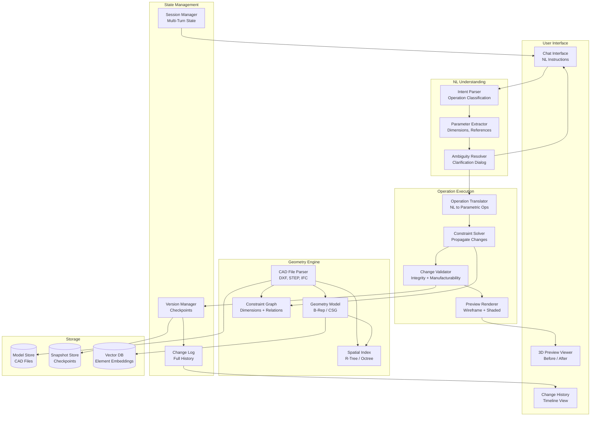
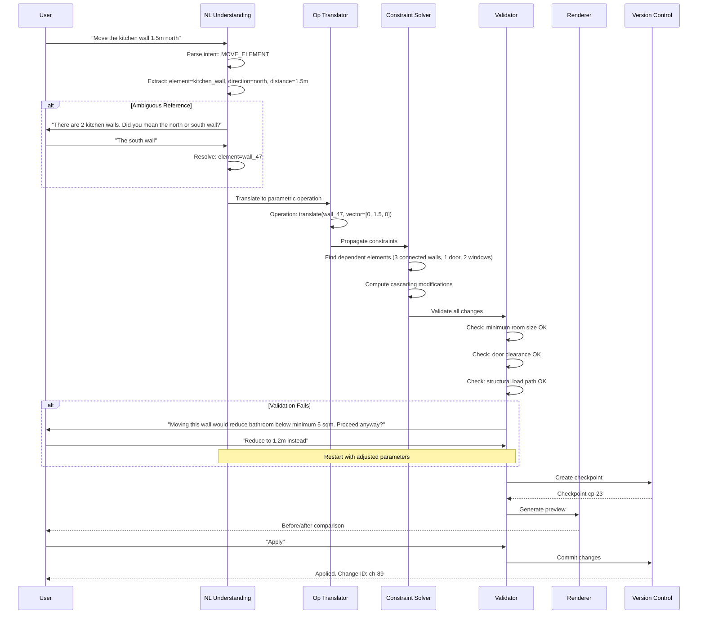

# Design: AI Agent that Modifies CAD Models

This document presents a system design for an AI agent that understands CAD models and modifies them through natural language instructions. The agent parses CAD files (DXF, STEP, IFC), builds a geometric and semantic understanding, translates user intent into parametric operations, validates changes against structural and manufacturing constraints, and supports multi-turn dialog with undo/redo. This is a fascinating system design problem because it bridges the gap between natural language understanding and precise geometric operations -- a domain where approximate answers are not acceptable.

---

## Requirements Gathering

### Functional Requirements

1. **CAD file parsing** -- read and understand DXF, STEP, IFC, and proprietary formats
2. **Geometric understanding** -- comprehend spatial relationships, dimensions, tolerances, and constraints
3. **Natural language to parametric operations** -- translate instructions like "make the wall 2 meters longer" into exact geometric transformations
4. **Constraint solver integration** -- ensure modifications respect existing constraints (dimensions, alignments, connections)
5. **Change validation** -- verify structural integrity, manufacturability, and standards compliance after each change
6. **Undo/redo with version control** -- every modification creates a checkpoint; full change history
7. **Preview rendering** -- show before/after comparison before applying destructive operations
8. **Multi-turn modification dialog** -- support iterative refinement through conversation
9. **Safety checks** -- warn before destructive operations; require confirmation for large-scale changes

### Non-Functional Requirements

| Requirement | Target |
|-------------|--------|
| Operation latency (simple) | < 3s for single-element modifications |
| Operation latency (complex) | < 15s for multi-element cascading changes |
| Geometric precision | Sub-millimeter accuracy for all operations |
| Parse time (typical model) | < 10s for models with < 50K elements |
| Undo latency | < 1s to revert any operation |
| Constraint satisfaction | 100% -- no invalid states allowed |

### Out of Scope

- Creating models from scratch (see the Building Plan Generator design)
- Physical simulation (FEA, CFD)
- Rendering photorealistic images (only preview wireframes and shaded views)

---

## High-Level Architecture



---

## Modification Workflow



---

## Component Deep Dive

### 1. CAD File Parser and Geometry Model

```python
class CADFileParser:
    """Parses CAD files into an internal geometry model."""

    FORMAT_HANDLERS = {
        ".dxf": "parse_dxf",
        ".step": "parse_step",
        ".stp": "parse_step",
        ".ifc": "parse_ifc",
        ".dwg": "parse_dwg",
    }

    async def parse(self, file_path: str) -> GeometryModel:
        ext = Path(file_path).suffix.lower()
        handler = getattr(self, self.FORMAT_HANDLERS[ext])
        raw_geometry = await handler(file_path)

        # Build the internal model
        model = GeometryModel()

        for element in raw_geometry.elements:
            # Classify element type (wall, door, beam, pipe, etc.)
            element_type = await self._classify_element(element)

            # Extract geometric properties
            geom_props = self._extract_geometry(element)

            # Extract dimensional constraints
            constraints = self._extract_constraints(element, raw_geometry)

            model.add_element(Element(
                id=element.id,
                type=element_type,
                geometry=geom_props,
                constraints=constraints,
                properties=element.custom_properties,
                layer=element.layer,
            ))

        # Build spatial index for efficient queries
        model.build_spatial_index()

        # Build constraint graph
        model.build_constraint_graph()

        return model

    def _extract_geometry(self, element) -> GeometryProperties:
        """Extract bounding box, centroid, volume, and topology."""
        return GeometryProperties(
            bounding_box=element.compute_bbox(),
            centroid=element.compute_centroid(),
            area=element.compute_area(),
            volume=element.compute_volume() if element.is_3d else None,
            vertices=element.vertex_count,
            topology=element.topology_type,  # B-Rep, CSG, mesh
        )
```

### 2. Natural Language to Parametric Operations

```python
class OperationTranslator:
    """Translates natural language instructions into precise geometric operations."""

    OPERATION_TYPES = [
        "translate", "rotate", "scale", "mirror",
        "extend", "trim", "fillet", "chamfer",
        "add_element", "remove_element", "copy_element",
        "modify_parameter", "align", "distribute",
    ]

    async def translate(
        self, intent: ParsedIntent, model: GeometryModel, session: Session
    ) -> list[ParametricOperation]:
        # Resolve element references to specific model elements
        target_elements = await self._resolve_references(
            intent.element_references, model, session
        )

        # Use LLM to generate the operation with precise parameters
        response = await self.llm.generate(
            system=OPERATION_TRANSLATION_PROMPT,
            user=f"""Translate this instruction into geometric operations.

Instruction: {intent.raw_text}
Target elements: {self._format_elements(target_elements)}
Current model state: {model.get_context_around(target_elements)}
Available operations: {self.OPERATION_TYPES}

For each operation specify:
- operation_type: one of {self.OPERATION_TYPES}
- target_element_id: the element to modify
- parameters: exact numeric parameters (all units in meters)
- dependencies: other elements that must be updated""",
            response_format=OperationListSchema,
        )

        operations = self._parse_operations(response)

        # Validate numeric precision
        for op in operations:
            op.parameters = self._enforce_precision(op.parameters, decimal_places=4)

        return operations

    async def _resolve_references(
        self, references: list[str], model: GeometryModel, session: Session
    ) -> list[Element]:
        """Resolve natural language element references to model elements."""
        resolved = []

        for ref in references:
            # Try exact match by name or ID
            element = model.find_by_name(ref)
            if element:
                resolved.append(element)
                continue

            # Try spatial reference ("the wall near the entrance")
            element = await self._resolve_spatial_reference(ref, model)
            if element:
                resolved.append(element)
                continue

            # Try semantic search over element descriptions
            candidates = await self._semantic_search(ref, model)
            if len(candidates) == 1:
                resolved.append(candidates[0])
            elif len(candidates) > 1:
                # Ambiguous -- need clarification
                raise AmbiguousReferenceError(ref, candidates)
            else:
                raise ElementNotFoundError(ref)

        return resolved
```

### 3. Constraint Solver

```python
class ConstraintSolver:
    """Propagates changes through the constraint graph to maintain model integrity."""

    async def propagate(
        self, operations: list[ParametricOperation], model: GeometryModel
    ) -> PropagationResult:
        # Get all elements affected by the operations
        affected = set()
        for op in operations:
            affected.add(op.target_element_id)
            # Walk the constraint graph to find dependents
            dependents = model.constraint_graph.get_dependents(
                op.target_element_id, depth=5
            )
            affected.update(dependents)

        # Clone the model state for safe computation
        working_model = model.clone()

        # Apply primary operations
        for op in operations:
            working_model.apply_operation(op)

        # Iteratively solve constraints until stable
        max_iterations = 50
        for iteration in range(max_iterations):
            violations = working_model.check_constraints(list(affected))
            if not violations:
                break

            for violation in violations:
                fix = self._compute_fix(violation, working_model)
                working_model.apply_operation(fix)
                affected.update(
                    model.constraint_graph.get_dependents(fix.target_element_id)
                )

        if violations:
            return PropagationResult(
                success=False,
                message=f"Could not satisfy {len(violations)} constraints after {max_iterations} iterations",
                unresolved=violations,
            )

        # Compute the full set of changes
        all_changes = working_model.diff(model)
        return PropagationResult(
            success=True,
            primary_changes=operations,
            cascading_changes=all_changes,
            affected_elements=list(affected),
        )
```

### 4. Change Validation and Safety Checks

```python
class ChangeValidator:
    """Validates proposed changes against structural, manufacturing, and safety rules."""

    async def validate(
        self, changes: PropagationResult, model: GeometryModel
    ) -> ValidationResult:
        checks = await asyncio.gather(
            self._check_geometry_validity(changes, model),
            self._check_minimum_dimensions(changes, model),
            self._check_structural_integrity(changes, model),
            self._check_manufacturability(changes, model),
            self._check_clearances(changes, model),
        )

        warnings = []
        errors = []

        for check in checks:
            warnings.extend(check.warnings)
            errors.extend(check.errors)

        # Safety gate: require confirmation for large-scale changes
        if len(changes.affected_elements) > 20:
            warnings.append(Warning(
                severity="high",
                message=f"This operation affects {len(changes.affected_elements)} elements. "
                        f"Please review the preview carefully before applying.",
            ))

        return ValidationResult(
            is_valid=len(errors) == 0,
            errors=errors,
            warnings=warnings,
            requires_confirmation=len(warnings) > 0 or len(changes.affected_elements) > 10,
        )

    async def _check_minimum_dimensions(self, changes, model) -> CheckResult:
        """Verify no room or element falls below minimum required dimensions."""
        violations = []
        for element_id in changes.affected_elements:
            element = model.get_element(element_id)
            if element.type == "room":
                area = element.compute_area()
                min_area = self._get_minimum_area(element.room_type)
                if area < min_area:
                    violations.append(
                        f"{element.name}: area {area:.1f} sqm is below minimum {min_area} sqm"
                    )
        return CheckResult(errors=violations if violations else [], warnings=[])
```

### 5. Version Control and Undo/Redo

```python
class ModelVersionManager:
    """Manages model checkpoints for undo/redo and change history."""

    async def create_checkpoint(self, model: GeometryModel, description: str) -> str:
        checkpoint_id = f"cp-{uuid4().hex[:8]}"

        # Store a delta snapshot (not full copy) for efficiency
        if self.previous_checkpoint:
            delta = model.compute_delta(self.previous_checkpoint.model_state)
            await self.snapshot_store.store_delta(checkpoint_id, delta)
        else:
            await self.snapshot_store.store_full(checkpoint_id, model.serialize())

        # Record in change log
        await self.change_log.append(ChangeEntry(
            checkpoint_id=checkpoint_id,
            description=description,
            timestamp=datetime.utcnow(),
            affected_elements=model.last_change_elements,
            delta_size=len(delta) if delta else model.element_count,
        ))

        self.previous_checkpoint = Checkpoint(checkpoint_id, model.clone())
        return checkpoint_id

    async def undo(self, model: GeometryModel) -> GeometryModel:
        """Revert to the previous checkpoint."""
        entries = await self.change_log.get_recent(limit=2)
        if len(entries) < 2:
            raise NothingToUndoError()

        target = entries[1]  # The checkpoint before the last change
        return await self._restore_checkpoint(target.checkpoint_id)

    async def undo_to(self, checkpoint_id: str) -> GeometryModel:
        """Revert to a specific checkpoint."""
        return await self._restore_checkpoint(checkpoint_id)
```

---

## Safety and Destructive Operations

:::warning
CAD model modifications can be irreversible in their downstream effects (e.g., a structural change that invalidates weeks of detailing work). The system must always create a checkpoint before any modification, show a preview before applying, and require explicit confirmation for operations that affect more than a threshold number of elements.
:::

| Risk Level | Trigger | Action |
|------------|---------|--------|
| Low | Single element parameter change | Apply immediately after preview |
| Medium | 2-10 elements affected | Show preview, require confirmation |
| High | 10-50 elements cascading | Detailed impact report, explicit "I understand" confirmation |
| Critical | Structural element removal or > 50 affected elements | Require typed confirmation, log to audit trail |

---

## Scaling Considerations

| Component | Strategy |
|-----------|----------|
| CAD parsing | Worker pool with format-specific containers; cache parsed models |
| Constraint solving | CPU-bound; scale with compute instances; timeout and approximate for large models |
| Spatial indexing | R-tree fits in memory for most models (< 100K elements); shard for mega-models |
| Version storage | Delta compression; garbage-collect old checkpoints after 30 days |
| Preview rendering | GPU pool for real-time wireframe; pre-rendered snapshots for history view |

---

## Interview Answer Structure

1. **Clarify scope** (2 min) -- which CAD formats; modification complexity; standalone vs. plugin
2. **Workflow diagram** (3 min) -- user intent to validated change; the full loop including ambiguity resolution
3. **NL to operations** (5 min) -- how natural language is translated to precise parametric operations
4. **Constraint solver** (5 min) -- how changes propagate through the constraint graph; convergence guarantees
5. **Validation and safety** (3 min) -- what checks are run; how destructive operations are gated
6. **Version control** (3 min) -- checkpoint-based undo; delta storage; audit trail
7. **Geometric precision** (2 min) -- sub-millimeter accuracy; numerical stability; unit handling
