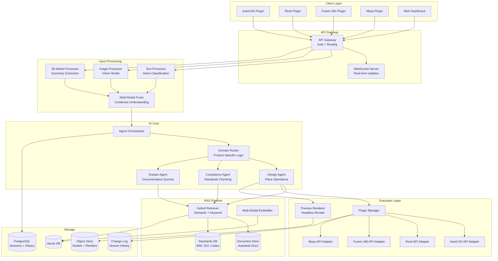
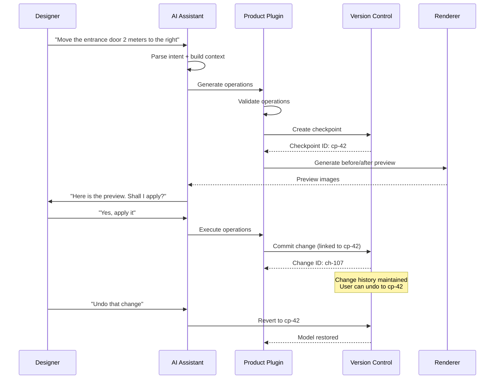

# Design: ChatGPT for Autodesk

This document presents a system design for an AI assistant built specifically for Autodesk products -- AutoCAD, Revit, Fusion 360, Maya, and Civil 3D. Unlike a general-purpose chatbot, this system must understand engineering and design domains, process multi-modal inputs (text, images, 3D models), execute operations through Autodesk APIs, and comply with industry standards like BIM, ISO, and building codes. This is a compelling system design problem because it sits at the intersection of domain-specific AI, multi-modal understanding, and enterprise software integration.

---

## Requirements Gathering

### Functional Requirements

1. **Multi-modal input** -- accept text queries, annotated screenshots, 2D drawings, and 3D model references
2. **Domain-specific RAG** -- retrieve information from Autodesk documentation, engineering standards (BIM, ISO, ASHRAE), and building codes
3. **Plugin architecture** -- extensible plugins for each Autodesk product with product-specific actions
4. **Natural language to design operations** -- translate user intent into Autodesk API calls (draw, modify, dimension, annotate)
5. **Version control for designs** -- track changes made by the assistant, support undo/redo, maintain change history
6. **Collaboration** -- share AI-generated suggestions with team members, support multi-user sessions
7. **Rendering preview** -- generate visual previews of proposed changes before applying them
8. **Standards compliance** -- check designs against applicable building codes, material specifications, and industry standards

### Non-Functional Requirements

| Requirement | Target |
|-------------|--------|
| Response latency (text) | < 3s for first token |
| Response latency (with preview) | < 10s including render |
| API operation accuracy | > 95% of generated operations are valid |
| Standards compliance recall | > 90% of applicable violations detected |
| Concurrent users | 50K+ simultaneous sessions |
| Availability | 99.9% uptime during business hours |
| Data residency | Support regional deployment for enterprise customers |

### Out of Scope

- Fully autonomous design generation (V1 is assistant, not autonomous designer)
- Real-time collaborative editing (handled by Autodesk's existing systems)
- Physical simulation (structural, thermal) -- delegated to existing simulation tools

---

## High-Level Architecture



---

## Component Deep Dive

### 1. Multi-Modal Input Processing

The system must fuse information from text, images, and 3D model context into a unified understanding.

```python
class MultiModalInputProcessor:
    """Processes and fuses multi-modal inputs from Autodesk plugins."""

    def __init__(self, vision_model, geometry_engine, text_embedder):
        self.vision_model = vision_model
        self.geometry_engine = geometry_engine
        self.text_embedder = text_embedder

    async def process(self, request: AssistantRequest) -> UnifiedContext:
        tasks = []

        # Process text input
        if request.text:
            tasks.append(self._process_text(request.text, request.product))

        # Process screenshot / annotated image
        if request.image:
            tasks.append(self._process_image(request.image))

        # Process 3D model context (selected elements, viewport state)
        if request.model_context:
            tasks.append(self._process_model_context(request.model_context))

        results = await asyncio.gather(*tasks)
        return self._fuse_modalities(results)

    async def _process_image(self, image: bytes) -> ImageUnderstanding:
        """Use vision model to understand screenshots and annotated drawings."""
        response = await self.vision_model.analyze(
            image=image,
            prompt="""Analyze this engineering/design screenshot. Identify:
1. Product type (AutoCAD, Revit, Fusion 360, Maya)
2. Visible elements (walls, beams, components, dimensions)
3. Any annotations, markups, or highlighted areas
4. Current view context (plan view, 3D perspective, section)
5. Any visible issues or areas of interest""",
        )
        return ImageUnderstanding.parse(response)

    async def _process_model_context(self, ctx: ModelContext) -> GeometryUnderstanding:
        """Extract geometric understanding from the active model."""
        # Get selected elements with their properties
        elements = []
        for element_id in ctx.selected_elements:
            elem = await self.geometry_engine.get_element(element_id)
            elements.append({
                "id": elem.id,
                "type": elem.category,
                "properties": elem.parameters,
                "geometry_summary": self._summarize_geometry(elem.geometry),
                "relationships": await self._get_relationships(elem),
            })

        return GeometryUnderstanding(
            product=ctx.product,
            active_view=ctx.view_type,
            selected_elements=elements,
            model_summary=await self._generate_model_summary(ctx.model_id),
        )
```

### 2. Domain Router and Plugin Architecture

Each Autodesk product has its own API surface, terminology, and workflow patterns. The domain router directs requests to product-specific logic.

```python
class DomainRouter:
    """Routes requests to product-specific agents and plugins."""

    def __init__(self):
        self.plugins: dict[str, ProductPlugin] = {}

    def register_plugin(self, product: str, plugin: ProductPlugin):
        self.plugins[product] = plugin

    async def route(self, context: UnifiedContext) -> AgentResponse:
        product = context.detected_product
        plugin = self.plugins.get(product)
        if not plugin:
            raise UnsupportedProductError(product)

        # Get product-specific tools and documentation
        tools = plugin.get_available_tools(context)
        domain_docs = plugin.get_domain_context(context)

        # Classify intent within the product domain
        intent = await self._classify_intent(context, product)

        if intent.type == "design_operation":
            return await self._handle_design(context, plugin, tools, domain_docs)
        elif intent.type == "compliance_check":
            return await self._handle_compliance(context, plugin, domain_docs)
        elif intent.type == "explanation":
            return await self._handle_explanation(context, domain_docs)
        elif intent.type == "troubleshooting":
            return await self._handle_troubleshoot(context, plugin, tools, domain_docs)


class RevitPlugin(ProductPlugin):
    """Plugin for Autodesk Revit -- BIM modeling."""

    TOOLS = [
        Tool("create_wall", "Create a wall with specified parameters"),
        Tool("create_floor", "Create a floor slab"),
        Tool("place_family", "Place a Revit family instance"),
        Tool("modify_parameter", "Change a parameter on a selected element"),
        Tool("create_section", "Create a section view"),
        Tool("run_clash_detection", "Detect clashes between disciplines"),
        Tool("export_schedule", "Export a schedule to table format"),
    ]

    async def execute_operation(self, operation: DesignOperation) -> OperationResult:
        """Translate a design operation into Revit API calls."""
        api_calls = self._translate_to_revit_api(operation)

        # Validate before execution
        validation = await self._validate_operations(api_calls)
        if not validation.is_valid:
            return OperationResult(
                success=False,
                message=f"Validation failed: {validation.errors}",
                suggested_fix=validation.suggestion,
            )

        # Execute within a transaction (supports undo)
        async with self.revit_api.transaction("AI Assistant Operation") as txn:
            results = []
            for call in api_calls:
                result = await self.revit_api.execute(call)
                results.append(result)
                if not result.success:
                    txn.rollback()
                    return OperationResult(success=False, message=result.error)

        return OperationResult(success=True, results=results, transaction_id=txn.id)
```

### 3. Domain-Specific RAG Pipeline

Engineering documentation requires specialized chunking and retrieval strategies.

```python
class EngineeringRAGPipeline:
    """RAG pipeline optimized for engineering and design documentation."""

    async def ingest_document(self, doc: Document):
        """Ingest an engineering document with domain-aware chunking."""
        if doc.type == "building_code":
            chunks = await self._chunk_building_code(doc)
        elif doc.type == "technical_standard":
            chunks = await self._chunk_standard(doc)
        elif doc.type == "autodesk_help":
            chunks = await self._chunk_help_doc(doc)
        else:
            chunks = await self._chunk_generic(doc)

        for chunk in chunks:
            embedding = await self.embedder.embed(chunk.text)
            await self.vector_db.upsert(
                id=chunk.id,
                embedding=embedding,
                metadata={
                    "source": doc.source,
                    "doc_type": doc.type,
                    "product": doc.product,
                    "section": chunk.section_path,
                    "code_reference": chunk.code_reference,
                    "version": doc.version,
                },
                content=chunk.text,
            )

    async def _chunk_building_code(self, doc: Document) -> list[Chunk]:
        """Specialized chunking for building codes -- preserves section hierarchy."""
        chunks = []
        for section in doc.parse_sections():
            # Each code section is a self-contained chunk
            chunk_text = f"[{doc.code_name} Section {section.number}] {section.title}\n"
            chunk_text += section.text

            # Include parent section context for hierarchy
            if section.parent:
                chunk_text = f"Under: {section.parent.title}\n" + chunk_text

            # Include cross-references
            for ref in section.cross_references:
                chunk_text += f"\nSee also: {ref}"

            chunks.append(Chunk(
                text=chunk_text,
                section_path=section.full_path,
                code_reference=f"{doc.code_name} {section.number}",
            ))
        return chunks

    async def retrieve(self, query: str, product: str, context: UnifiedContext) -> list[RetrievalResult]:
        """Hybrid retrieval with domain-aware filtering."""
        # Semantic search
        semantic_results = await self.vector_db.search(
            query=query,
            top_k=20,
            filter={"product": {"$in": [product, "general"]}},
        )

        # Keyword search for exact code references (e.g., "IBC 2021 Section 1607.1")
        keyword_results = await self.keyword_index.search(
            query=query,
            filter={"doc_type": {"$in": ["building_code", "technical_standard"]}},
        )

        # Merge and re-rank
        combined = self._merge_results(semantic_results, keyword_results)
        reranked = await self.reranker.rerank(query, combined, top_k=10)

        return reranked
```

### 4. Rendering Preview Generation

Before applying changes, the system generates a visual preview so the user can confirm.

```python
class PreviewRenderer:
    """Generates visual previews of proposed design changes."""

    async def generate_preview(
        self, model_id: str, operations: list[DesignOperation]
    ) -> Preview:
        # Clone the current model state
        preview_model = await self.model_store.clone(model_id)

        # Apply proposed operations to the clone
        for op in operations:
            await self.geometry_engine.apply(preview_model, op)

        # Render before/after comparison
        before_render = await self.renderer.render(
            model_id=model_id,
            view=operations[0].suggested_view,
            highlight=None,
        )
        after_render = await self.renderer.render(
            model_id=preview_model.id,
            view=operations[0].suggested_view,
            highlight=[op.affected_elements for op in operations],
        )

        # Generate diff overlay
        diff_render = await self.renderer.render_diff(before_render, after_render)

        # Clean up clone
        await self.model_store.delete(preview_model.id)

        return Preview(
            before=before_render,
            after=after_render,
            diff=diff_render,
            operations_summary=self._summarize_operations(operations),
        )
```

---

## Version Control for Design Changes



---

## Scaling Considerations

| Component | Strategy |
|-----------|----------|
| Input processing | GPU-backed vision model pool; pre-process images at edge |
| RAG retrieval | Partitioned vector DB by product; cached frequent queries |
| Plugin execution | One plugin instance per active session; pooled connections to Autodesk APIs |
| Preview rendering | Headless GPU render farm; pre-warmed containers |
| Model storage | Tiered: hot (SSD) for active sessions, warm (object store) for recent, cold (archive) |

### Cost per Session

| Component | Cost/Session | Notes |
|-----------|-------------|-------|
| LLM inference | $0.05-0.20 | Depends on query complexity |
| Vision processing | $0.01-0.05 | Only when images provided |
| RAG retrieval | $0.001 | Cached embeddings |
| Preview rendering | $0.02-0.10 | GPU render time |
| Infrastructure | $0.01 | Amortized |
| **Total** | **$0.09-0.37** | Per session (avg 5-10 interactions) |

:::info
Autodesk products have high per-seat costs ($2K-$5K/year). An AI assistant adding $50-100/year to the cost is easily justified if it saves even 30 minutes per week of engineering time.
:::

---

## Trade-Off Analysis

| Decision | Option A | Option B | Chosen | Rationale |
|----------|----------|----------|--------|-----------|
| Plugin vs. monolithic | Product-specific plugins | Single unified agent | Plugins | Each product has unique APIs and workflows; plugins enable independent versioning |
| Preview rendering | Client-side | Server-side headless | Server-side | Consistent rendering; client may lack GPU; enables web dashboard previews |
| Standards database | Embedded in prompts | Separate RAG pipeline | RAG | Standards are large and version-specific; RAG enables updates without redeployment |
| Change execution | Direct API calls | Transaction-wrapped | Transaction | Must support atomic undo; partial changes leave models in broken states |
| Multi-modal fusion | Early fusion (single model) | Late fusion (separate then merge) | Late fusion | Allows specialized models per modality; easier to debug and improve independently |

---

## Interview Answer Structure

1. **Clarify scope** (2 min) -- which Autodesk products; assistant vs. autonomous; enterprise vs. individual
2. **Multi-modal architecture** (3 min) -- explain how text, images, and 3D model context are processed and fused
3. **Plugin system** (5 min) -- why a plugin per product; how plugins expose tools; transaction-based execution
4. **Domain-specific RAG** (5 min) -- specialized chunking for building codes and standards; hybrid retrieval
5. **Preview and version control** (3 min) -- checkpoint-based undo; before/after rendering
6. **Compliance checking** (3 min) -- how the agent checks against building codes and standards
7. **Scale and cost** (2 min) -- per-session economics; rendering farm; enterprise deployment
8. **Security** (2 min) -- IP protection for proprietary designs; data residency; access control
