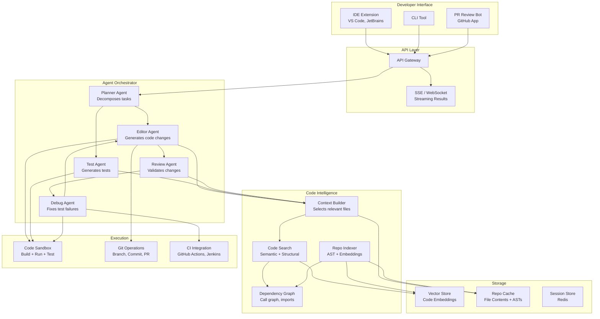
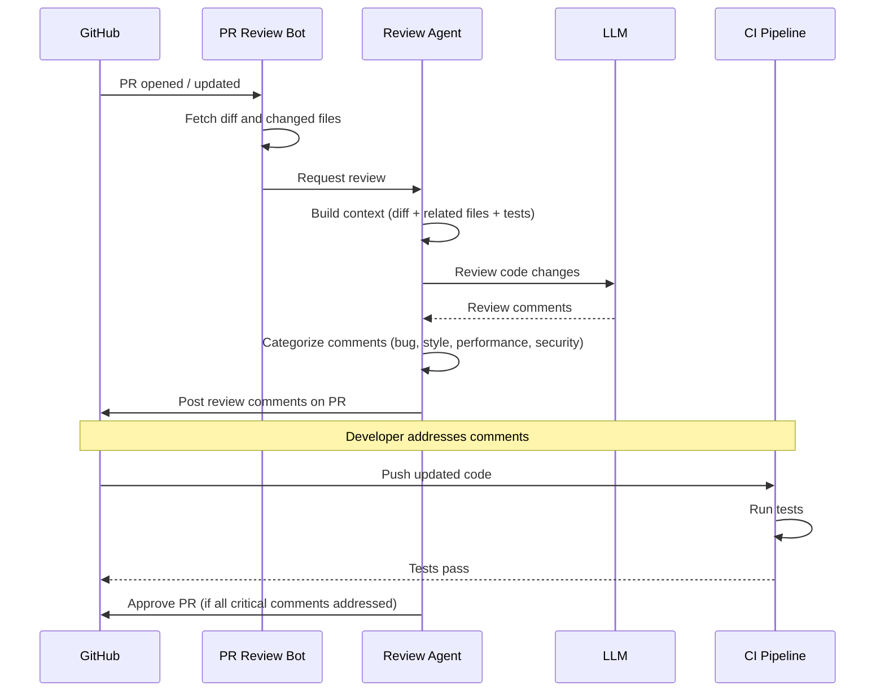

# Case Study: Code Assistant

This case study designs a production AI coding assistant -- an agent that understands codebases, edits multiple files, generates tests, reviews code, and integrates with CI/CD. This is one of the most complex agentic system designs because it combines deep context understanding, multi-step planning, and high-stakes execution (code changes that break builds cost real money).

---

## Requirements Gathering

### Functional Requirements

1. **Repo understanding** -- index and understand a codebase (structure, dependencies, conventions)
2. **Multi-file editing** -- make coordinated changes across multiple files
3. **Test generation** -- generate unit and integration tests for new or existing code
4. **Code review** -- review pull requests and provide actionable feedback
5. **CI integration** -- trigger builds, interpret test results, and iterate on failures
6. **Natural language interaction** -- developers describe what they want in plain language

### Non-Functional Requirements

| Requirement | Target |
|-------------|--------|
| Latency (simple edit) | < 15 seconds |
| Latency (multi-file change) | < 60 seconds |
| Code correctness | > 90% of generated code passes tests on first attempt |
| Context window utilization | Efficiently handle repos with 100K+ lines |
| Security | Never leak secrets, never commit credentials |
| Cost per task | < $0.50 for typical changes |

---

## High-Level Architecture



---

## Component Deep Dive

### 1. Repo Indexer

The indexer processes a codebase into searchable representations. It runs on initial setup and incrementally on file changes.

```python
class RepoIndexer:
    async def index_repository(self, repo_path: str):
        """Full index of a repository."""
        files = await self._discover_files(repo_path)

        for file_path in files:
            content = await self._read_file(file_path)

            # Layer 1: File-level embedding
            embedding = await self.embedder.embed(
                f"File: {file_path}\n{content[:8000]}"
            )
            await self.vector_store.upsert(
                id=file_path,
                embedding=embedding,
                metadata={"path": file_path, "language": self._detect_language(file_path)},
            )

            # Layer 2: Function/class-level embeddings (finer granularity)
            symbols = await self._extract_symbols(content, file_path)
            for symbol in symbols:
                sym_embedding = await self.embedder.embed(
                    f"{symbol.type} {symbol.name}: {symbol.docstring}\n{symbol.source}"
                )
                await self.vector_store.upsert(
                    id=f"{file_path}::{symbol.name}",
                    embedding=sym_embedding,
                    metadata={
                        "path": file_path,
                        "symbol": symbol.name,
                        "type": symbol.type,
                        "line_start": symbol.line_start,
                        "line_end": symbol.line_end,
                    },
                )

            # Layer 3: Dependency graph
            imports = await self._extract_imports(content, file_path)
            for imp in imports:
                await self.dep_graph.add_edge(file_path, imp.resolved_path)

    async def incremental_update(self, changed_files: list[str]):
        """Update index for changed files only."""
        for file_path in changed_files:
            await self._remove_file_from_index(file_path)
            await self._index_single_file(file_path)
            await self._update_dependents(file_path)
```

### 2. Context Builder

The most critical component. It decides which files and code snippets to include in the LLM's context window -- too little and the agent makes incorrect changes, too much and it exceeds the context limit or gets confused.

```python
class ContextBuilder:
    def __init__(self, search, dep_graph, tokenizer, max_tokens: int = 100000):
        self.search = search
        self.dep_graph = dep_graph
        self.tokenizer = tokenizer
        self.max_tokens = max_tokens

    async def build_context(self, task: str, target_files: list[str] = None) -> str:
        budget = self.max_tokens
        context_parts = []

        # 1. Repo structure overview (always included)
        structure = await self._get_repo_structure()
        structure_tokens = self._count_tokens(structure)
        context_parts.append(("repo_structure", structure))
        budget -= structure_tokens

        # 2. Target files (full content if specified)
        if target_files:
            for f in target_files:
                content = await self._read_file(f)
                tokens = self._count_tokens(content)
                if tokens <= budget * 0.4:  # Cap at 40% of budget per file
                    context_parts.append(("target_file", f"### {f}\n```\n{content}\n```"))
                    budget -= tokens

        # 3. Semantically related files
        related = await self.search.search(task, top_k=20)
        for result in related:
            if result.path in (target_files or []):
                continue
            content = await self._read_file(result.path)
            tokens = self._count_tokens(content)
            if tokens > budget * 0.15:
                # File too large -- include only relevant symbols
                content = await self._extract_relevant_symbols(result.path, task)
                tokens = self._count_tokens(content)
            if tokens <= budget:
                context_parts.append(("related_file", f"### {result.path}\n```\n{content}\n```"))
                budget -= tokens

        # 4. Dependency context (imports, callers, callees)
        if target_files:
            deps = await self.dep_graph.get_related(target_files, depth=1)
            for dep_file in deps:
                if budget <= 0:
                    break
                symbols = await self._extract_relevant_symbols(dep_file, task)
                tokens = self._count_tokens(symbols)
                if tokens <= budget:
                    context_parts.append(("dependency", f"### {dep_file}\n```\n{symbols}\n```"))
                    budget -= tokens

        return self._assemble_context(context_parts)
```

### 3. Editor Agent

The editor generates code changes as structured diffs rather than rewriting entire files. This reduces token usage and makes changes easier to review.

```python
EDIT_FORMAT_INSTRUCTIONS = (
    "For each edit, specify the file path, the original code block, "
    "and the replacement.\n"
    "Use the format: FILE: path, ORIGINAL: ..., REPLACEMENT: ..."
)

class EditorAgent:
    async def generate_edit(self, task: str, context: str) -> list[FileEdit]:
        prompt = (
            f"Task: {task}\n\n"
            f"Repository context:\n{context}\n\n"
            f"Generate the minimal set of file edits.\n"
            f"{EDIT_FORMAT_INSTRUCTIONS}"
        )
        response = await self.llm.generate(
            system_prompt=EDITOR_SYSTEM_PROMPT,
            messages=[{"role": "user", "content": prompt}],
            model="claude-sonnet-4-20250514",
            max_tokens=8000,
        )

        edits = self._parse_edits(response)

        for edit in edits:
            if not await self._validate_edit(edit):
                raise InvalidEditError(f"Edit to {edit.file_path} failed validation")

        return edits
```

### 4. Test Generation Agent

```python
class TestGenerationAgent:
    async def generate_tests(self, source_file: str, edits: list[FileEdit]) -> str:
        # Get the existing test file (if any)
        test_file = self._find_test_file(source_file)
        existing_tests = await self._read_file(test_file) if test_file else ""

        # Get testing conventions from the repo
        conventions = await self._detect_test_conventions()

        response = await self.llm.generate(
            system_prompt=TEST_GEN_SYSTEM_PROMPT,
            messages=[{
                "role": "user",
                "content": f"""Generate tests for the following code changes.

Source file: {source_file}
Changes: {self._format_edits(edits)}
Existing tests: {existing_tests}
Test framework: {conventions.framework}
Conventions: {conventions.patterns}

Generate comprehensive tests covering:
1. Happy path for each changed function
2. Edge cases (empty input, null values, boundary conditions)
3. Error cases (invalid input, exceptions)
""",
            }],
            model="claude-sonnet-4-20250514",
        )

        return response
```

### 5. Debug Agent

When tests fail, the debug agent analyzes the failure and generates a fix.

```python
class DebugAgent:
    async def fix_test_failure(
        self,
        test_output: str,
        source_files: list[str],
        test_files: list[str],
        max_attempts: int = 3,
    ) -> list[FileEdit]:
        for attempt in range(max_attempts):
            # Analyze the failure
            analysis = await self.llm.generate(
                system_prompt=DEBUG_SYSTEM_PROMPT,
                messages=[{
                    "role": "user",
                    "content": f"""Test failure (attempt {attempt + 1}/{max_attempts}):

{test_output}

Source files:
{await self._read_files(source_files)}

Test files:
{await self._read_files(test_files)}

Analyze the failure and generate a fix. The fix should be minimal.
""",
                }],
            )

            edits = self._parse_edits(analysis)
            await self._apply_edits(edits)

            # Re-run tests
            test_result = await self.sandbox.run_tests(test_files)
            if test_result.passed:
                return edits

            test_output = test_result.output

        raise DebugFailedError(f"Could not fix tests after {max_attempts} attempts")
```

---

## Code Review Flow



### Review Agent Logic

```python
class CodeReviewAgent:
    REVIEW_CATEGORIES = ["bug", "security", "performance", "style", "clarity", "test_coverage"]

    async def review_pr(self, pr_diff: str, context: str) -> list[ReviewComment]:
        response = await self.llm.generate(
            system_prompt=CODE_REVIEW_PROMPT,
            messages=[{
                "role": "user",
                "content": f"""Review this pull request diff.

Context (related files, project conventions):
{context}

Diff:
{pr_diff}

For each issue found, provide:
- File and line number
- Category: {self.REVIEW_CATEGORIES}
- Severity: critical / warning / suggestion
- Description of the issue
- Suggested fix (if applicable)
""",
            }],
        )

        comments = self._parse_review(response)

        # Filter out low-confidence comments to reduce noise
        return [c for c in comments if c.confidence > 0.7]
```

---

## CI Integration

```python
class CIIntegration:
    async def run_and_iterate(self, edits: list[FileEdit], max_iterations: int = 3):
        """Apply edits, run CI, and iterate on failures."""
        for iteration in range(max_iterations):
            # Apply edits to a feature branch
            branch = await self.git.create_branch(f"ai-edit-{uuid4()}")
            await self.git.apply_edits(edits, branch)

            # Trigger CI
            ci_run = await self.ci.trigger(branch)
            result = await self.ci.wait_for_completion(ci_run, timeout=300)

            if result.passed:
                return {"branch": branch, "status": "success", "iterations": iteration + 1}

            # CI failed -- use debug agent to fix
            edits = await self.debug_agent.fix_test_failure(
                test_output=result.output,
                source_files=self._get_changed_files(edits),
                test_files=self._get_test_files(edits),
            )

        return {"status": "failed", "iterations": max_iterations, "last_output": result.output}
```

---

## Scaling Considerations

### Per-Request Resource Usage

| Operation | Duration | Tokens | Cost |
|-----------|----------|--------|------|
| Repo indexing (initial, 50K LOC) | 5-10 min | 500K embedding tokens | $0.05 |
| Context building | 1-3s | 0 (local operations) | $0 |
| Code generation (single file) | 5-15s | 10K-30K tokens | $0.05-0.30 |
| Code generation (multi-file) | 15-60s | 30K-100K tokens | $0.15-1.00 |
| Test generation | 10-20s | 15K-40K tokens | $0.10-0.40 |
| Code review (PR) | 10-30s | 20K-60K tokens | $0.10-0.60 |
| Debug loop (per iteration) | 15-30s | 20K-50K tokens | $0.10-0.50 |

### Scaling Strategy

| Component | Strategy |
|-----------|---------|
| Repo indexer | Run as a background job; incremental updates on file changes |
| Vector store | Partition by repository; use managed service (Pinecone, pgvector) |
| Agent workers | Stateless, horizontally scaled; queue-based dispatch |
| Code sandbox | Ephemeral containers per execution; pool for fast startup |
| LLM calls | Multiple providers; route by task complexity |

---

## Security Considerations

| Risk | Mitigation |
|------|------------|
| Generated code contains credentials | Pre-commit hook scans for secrets; sandbox has no access to env vars |
| Agent modifies protected files | File-level ACL; certain paths are read-only |
| Malicious code injection via PR | Sandbox isolation; changes require human review before merge |
| Repo data exfiltration | Agent has no network access except to approved APIs |
| Prompt injection via code comments | Sanitize code comments before including in LLM context |

:::warning
Never allow an AI coding assistant to auto-merge changes to production branches. Always require human review. The agent should create PRs, not merge them. This is a non-negotiable guardrail.
:::

---

## Interview Answer Structure

1. **Clarify scope** (2 min) -- IDE integration vs. PR bot vs. CLI; single-repo vs. multi-repo
2. **Architecture diagram** (3 min) -- show the separation between code intelligence, agent orchestration, and execution
3. **Deep dive: Context Builder** (5 min) -- this is the hardest problem; explain how you select relevant code within token limits
4. **Deep dive: Edit-Test-Debug loop** (5 min) -- the agent generates code, runs tests, and iterates on failures
5. **CI integration** (3 min) -- how the agent interacts with the build pipeline
6. **Scaling and cost** (3 min) -- per-task cost, indexing strategy, caching
7. **Security** (2 min) -- sandboxing, no auto-merge, secret scanning
