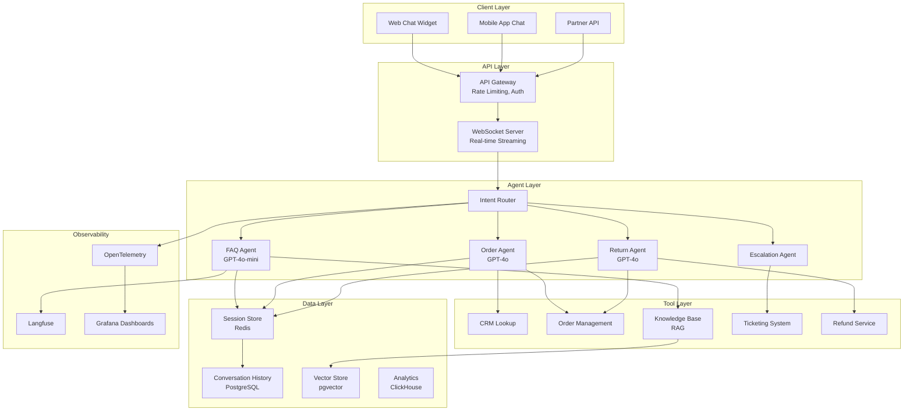
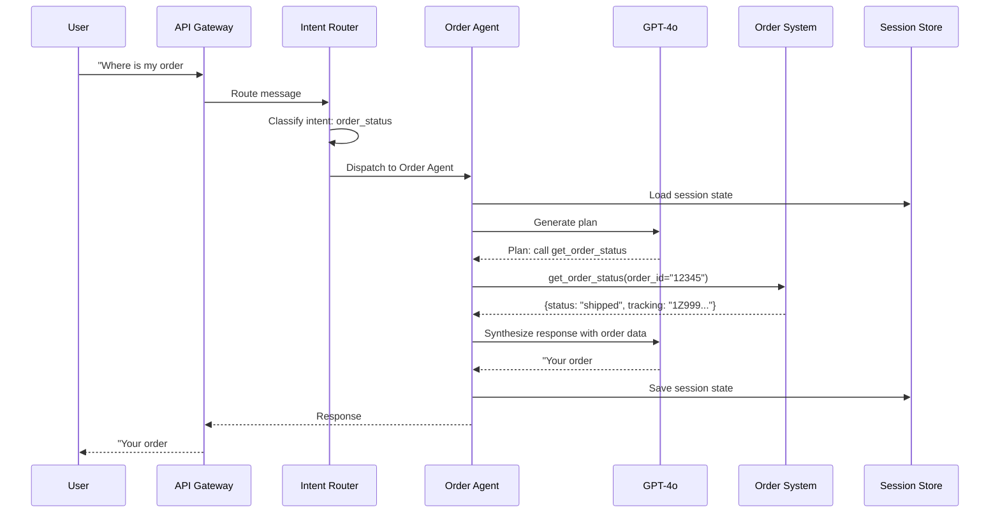
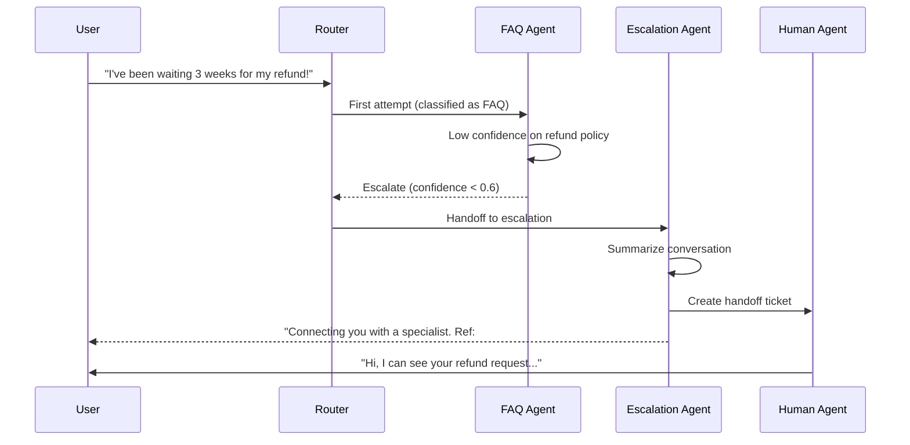

# Case Study: Customer Support Agent

This case study walks through a full system design for an AI-powered customer support agent -- the kind of problem you might receive in a system design interview. We cover requirements gathering, high-level architecture, component design, data flow, scaling, and cost analysis.

---

## Requirements Gathering

Before drawing any diagrams, clarify the requirements with the interviewer.

### Functional Requirements

1. Handle customer inquiries via chat (web and mobile)
2. Answer questions about products, orders, returns, and account details
3. Perform actions: look up orders, initiate returns, create support tickets, issue refunds
4. Escalate to human agents when the AI cannot resolve the issue
5. Support multi-turn conversations with context retention
6. Provide consistent responses aligned with company policies

### Non-Functional Requirements

| Requirement | Target |
|-------------|--------|
| Latency (first response) | < 3 seconds |
| Latency (subsequent turns) | < 2 seconds |
| Availability | 99.9% uptime |
| Concurrent sessions | 5,000 |
| Resolution rate (no human) | > 70% |
| Cost per conversation | < $0.15 |
| Security | PII masking, SOC 2, GDPR compliance |

### Out of Scope (State Explicitly)

- Voice support (chat only for this design)
- Proactive outreach (reactive only)
- Multi-language (English only for V1)

---

## High-Level Architecture



---

## Component Breakdown

### 1. Intent Router

The router classifies incoming messages and routes them to the appropriate specialist agent. This is a cost optimization -- simple FAQ questions go to a cheap, fast model; complex order issues go to a more capable model.

```python
class IntentRouter:
    INTENTS = {
        "faq": {"agent": "faq_agent", "model": "gpt-4o-mini", "priority": "low"},
        "order_status": {"agent": "order_agent", "model": "gpt-4o", "priority": "normal"},
        "return_request": {"agent": "return_agent", "model": "gpt-4o", "priority": "normal"},
        "billing_issue": {"agent": "order_agent", "model": "gpt-4o", "priority": "high"},
        "complaint": {"agent": "escalation_agent", "model": "gpt-4o", "priority": "high"},
        "unknown": {"agent": "faq_agent", "model": "gpt-4o-mini", "priority": "normal"},
    }

    async def route(self, message: str, session: SessionState) -> dict:
        # Use a small, fast model for classification
        intent = await self.classifier.classify(
            message=message,
            conversation_history=session.messages[-4:],
            model="gpt-4o-mini",
        )

        config = self.INTENTS.get(intent, self.INTENTS["unknown"])

        # Override: if the user explicitly asks for a human, escalate immediately
        if self._requests_human(message):
            config = self.INTENTS["complaint"]

        return config
```

### 2. FAQ Agent (RAG-Based)

Handles product questions, policy inquiries, and general information by retrieving from a knowledge base.

```python
class FAQAgent:
    async def handle(self, message: str, session: SessionState) -> AgentResponse:
        # Retrieve relevant knowledge base articles
        context_docs = await self.knowledge_base.search(
            query=message,
            top_k=5,
            filter={"status": "published"},
        )

        # Generate response with retrieved context
        response = await self.llm.generate(
            system_prompt=FAQ_SYSTEM_PROMPT,
            messages=session.messages + [
                {"role": "system", "content": f"Relevant articles:\n{self._format_docs(context_docs)}"},
                {"role": "user", "content": message},
            ],
            model="gpt-4o-mini",
            temperature=0.1,  # Low temperature for consistency
        )

        # Check confidence -- escalate if low
        if response.confidence < 0.6:
            return AgentResponse(
                text="Let me connect you with a specialist who can help with this.",
                action="escalate",
                metadata={"reason": "low_confidence", "score": response.confidence},
            )

        return AgentResponse(text=response.text, action="respond")
```

### 3. Order Agent

Handles order lookups, status checks, and modifications. This agent has access to the CRM and order management system.

```python
class OrderAgent:
    TOOLS = [
        ToolDefinition(
            name="lookup_order",
            description="Look up an order by order ID or customer email",
            parameters=[
                ToolParameter(name="order_id", type="string", required=False),
                ToolParameter(name="email", type="string", required=False),
            ],
        ),
        ToolDefinition(
            name="get_order_status",
            description="Get the current status and tracking info for an order",
            parameters=[
                ToolParameter(name="order_id", type="string", required=True),
            ],
        ),
        ToolDefinition(
            name="create_support_ticket",
            description="Create a support ticket for issues that need manual review",
            parameters=[
                ToolParameter(name="subject", type="string", required=True),
                ToolParameter(name="description", type="string", required=True),
                ToolParameter(name="priority", type="string", enum=["low", "medium", "high"]),
            ],
        ),
    ]
```

### 4. Escalation Agent

Manages the handoff to human agents when the AI cannot resolve the issue.

```python
class EscalationAgent:
    async def escalate(self, session: SessionState, reason: str) -> AgentResponse:
        # Summarize the conversation for the human agent
        summary = await self.llm.generate(
            prompt=f"""Summarize this customer conversation for a human support agent.
Include: customer issue, steps already taken, relevant order/account info.

Conversation:
{self._format_conversation(session.messages)}""",
            model="gpt-4o-mini",
        )

        # Create a handoff in the ticketing system
        ticket = await self.ticketing.create_handoff(
            session_id=session.session_id,
            customer_id=session.user_id,
            summary=summary,
            conversation_history=session.messages,
            priority=self._determine_priority(session),
            reason=reason,
        )

        return AgentResponse(
            text="I am connecting you with a support specialist who can help further. "
                 "They will have the full context of our conversation. "
                 f"Your reference number is {ticket.id}.",
            action="escalate",
            metadata={"ticket_id": ticket.id},
        )
```

---

## Data Flow

### Happy Path: Order Status Inquiry



### Escalation Path



---

## Scaling Considerations

### Traffic Patterns

| Time | Traffic Level | Strategy |
|------|--------------|----------|
| Business hours (9 AM - 6 PM) | Peak: 5,000 concurrent | Full scaling |
| Evening (6 PM - 11 PM) | Moderate: 2,000 concurrent | Moderate scaling |
| Night (11 PM - 9 AM) | Low: 500 concurrent | Minimum scaling |
| Sale events (Black Friday) | Spike: 20,000 concurrent | Pre-scaled + auto-scale |

### Scaling Architecture

```python
# Auto-scaling configuration
SCALING_CONFIG = {
    "agent_workers": {
        "min_replicas": 5,
        "max_replicas": 100,
        "scale_metric": "queue_depth",
        "target_per_worker": 10,  # 10 concurrent sessions per worker
        "scale_up_cooldown": 30,  # seconds
        "scale_down_cooldown": 300,  # seconds
    },
    "redis_session_store": {
        "cluster_mode": True,
        "shards": 3,
        "replicas_per_shard": 2,
    },
    "llm_api": {
        "providers": ["openai", "azure_openai"],
        "rate_limit_per_provider": 10000,  # RPM
        "failover": "automatic",
    },
}
```

### Bottleneck Analysis

| Component | Bottleneck | Mitigation |
|-----------|-----------|------------|
| LLM API | Rate limits (TPM/RPM) | Multiple API keys, multiple providers, request queuing |
| WebSocket server | Connection count | Horizontal scaling, connection pooling |
| Redis | Memory for sessions | Cluster mode, TTL on sessions, tiered storage |
| Knowledge base (vector search) | Query latency under load | Read replicas, result caching |
| Order management API | Rate limits from upstream | Cache recent orders, batch queries |

---

## Cost Analysis

### Per-Conversation Cost Breakdown

| Component | Tokens/Calls | Unit Cost | Cost per Conversation |
|-----------|-------------|-----------|----------------------|
| Intent classification | 200 tokens (mini) | $0.15/1M | $0.00003 |
| FAQ response (3 turns) | 3,000 tokens (mini) | $0.15/1M in, $0.60/1M out | $0.0008 |
| Order lookup (3 turns) | 4,500 tokens (4o) | $2.50/1M in, $10/1M out | $0.015 |
| RAG retrieval | 3 queries | $0.001/query | $0.003 |
| Redis session | 1 session | ~$0 | negligible |
| **Total (FAQ path)** | | | **$0.004** |
| **Total (order path)** | | | **$0.018** |
| **Blended average** | 60% FAQ, 40% order | | **$0.010** |

:::tip
The blended cost per conversation ($0.01) is well under the $0.15 budget. This headroom allows for longer conversations, retries, and the occasional expensive escalation path without exceeding budget.
:::

### Monthly Cost at Scale

| Metric | Value |
|--------|-------|
| Daily conversations | 50,000 |
| Monthly conversations | 1,500,000 |
| Blended cost per conversation | $0.010 |
| **Monthly LLM cost** | **$15,000** |
| Infrastructure (Redis, compute, networking) | $3,000 |
| Observability (Langfuse, Grafana) | $500 |
| **Total monthly cost** | **$18,500** |

---

## Failure Modes and Mitigations

| Failure | Impact | Mitigation |
|---------|--------|------------|
| Primary LLM down | No AI responses | Fallback to Azure OpenAI; circuit breaker |
| Redis down | Session loss | Redis Cluster with replicas; fall back to stateless mode |
| Order API down | Cannot look up orders | Return cached data if available; apologize and create ticket |
| Vector store slow | Slow FAQ responses | Cache top-100 FAQ answers; serve from cache on timeout |
| Prompt injection | Unauthorized actions | Input filtering, tool sandboxing, least privilege |

---

## Interview Answer Structure

When presenting this design in an interview, structure your answer as follows:

1. **Clarify requirements** (2 minutes) -- functional and non-functional, explicitly state what is out of scope
2. **High-level architecture** (3 minutes) -- draw the mermaid diagram, explain the flow
3. **Deep dive into 2-3 components** (10 minutes) -- intent routing, the order agent, escalation
4. **Data flow** (3 minutes) -- walk through a happy path and an edge case
5. **Scaling** (3 minutes) -- bottleneck analysis, auto-scaling strategy
6. **Cost analysis** (2 minutes) -- per-conversation cost, monthly projection
7. **Trade-offs and extensions** (2 minutes) -- what you would do differently with more time

:::info
The interviewer does not expect you to cover everything. They want to see that you can make reasonable trade-offs, identify bottlenecks, and think about production concerns (cost, security, observability) that juniors miss.
:::
