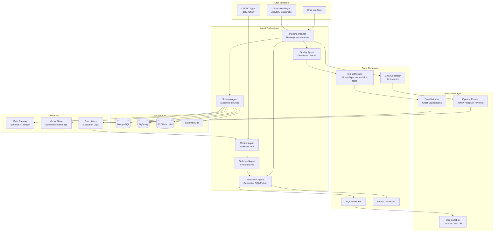
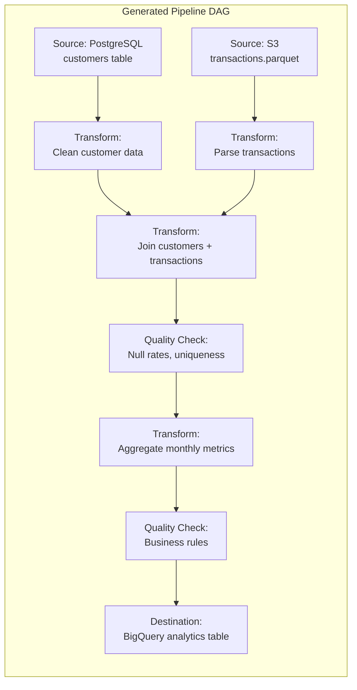
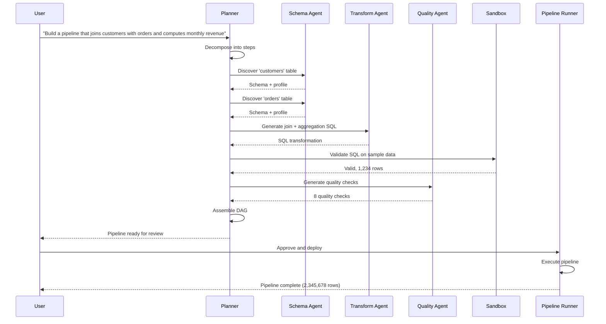

# Case Study: Data Pipeline Agent

This case study designs an AI agent that helps data engineers build and manage data pipelines -- automating schema discovery, transformation generation, data quality checks, and pipeline monitoring. This is a compelling system design problem because it combines agentic reasoning with infrastructure automation and must handle both correctness and efficiency at scale.

---

## Requirements Gathering

### Functional Requirements

1. **Schema discovery** -- connect to data sources (databases, APIs, files) and automatically discover schemas
2. **Transformation generation** -- generate SQL/Python transformations based on natural language descriptions
3. **Pipeline construction** -- assemble discovered sources and transformations into a runnable pipeline (DAG)
4. **Data quality checks** -- automatically generate and run quality checks (null rates, uniqueness, distributions)
5. **Monitoring and alerting** -- detect anomalies in pipeline runs and alert data engineers
6. **Self-healing** -- attempt to fix common pipeline failures automatically (schema drift, missing data)

### Non-Functional Requirements

| Requirement | Target |
|-------------|--------|
| Latency (schema discovery) | < 30 seconds per source |
| Latency (transformation generation) | < 20 seconds |
| Pipeline correctness | 100% of generated SQL must be syntactically valid |
| Data quality | Detect 95% of schema drift within one pipeline run |
| Cost per pipeline task | < $0.25 |
| Security | Never expose raw credentials; use IAM roles and secret managers |

---

## High-Level Architecture



---

## Component Deep Dive

### 1. Schema Discovery Agent

The schema agent connects to data sources, extracts schema information, and builds a semantic understanding of the data.

```python
class SchemaDiscoveryAgent:
    async def discover(self, source_config: dict) -> DataSource:
        """Discover the schema of a data source."""
        connector = self._get_connector(source_config["type"])

        # Step 1: Extract raw schema
        raw_schema = await connector.get_schema(source_config)
        tables = []

        for table in raw_schema.tables:
            # Step 2: Profile each table
            profile = await connector.profile_table(
                table.name,
                sample_size=10000,
            )

            # Step 3: Generate semantic descriptions using LLM
            description = await self.llm.generate(
                prompt=f"""Analyze this database table and provide a business description.

Table: {table.name}
Columns: {self._format_columns(table.columns)}
Sample data (5 rows): {self._format_sample(profile.sample_rows)}
Statistics: {self._format_stats(profile.stats)}

Provide:
1. A one-sentence business description of the table
2. A description for each column
3. Likely primary key(s)
4. Likely foreign key relationships
5. Data quality observations
""",
            )

            enriched_table = self._enrich_table(table, profile, description)
            tables.append(enriched_table)

        # Step 4: Store in catalog and vector store
        data_source = DataSource(
            name=source_config["name"],
            type=source_config["type"],
            tables=tables,
            discovered_at=datetime.utcnow(),
        )
        await self.catalog.register(data_source)
        await self._embed_schema(data_source)

        return data_source

    async def _embed_schema(self, source: DataSource):
        """Create embeddings for semantic search over schema."""
        for table in source.tables:
            text = f"Table: {table.name}. {table.description}. "
            text += " ".join(f"Column {c.name}: {c.description}" for c in table.columns)
            embedding = await self.embedder.embed(text)
            await self.vector_store.upsert(
                id=f"{source.name}.{table.name}",
                embedding=embedding,
                metadata={"source": source.name, "table": table.name},
            )
```

### 2. Transformation Generation Agent

Given a natural language description and source/target schemas, generate the transformation code.

```python
class TransformationAgent:
    async def generate_transformation(
        self,
        description: str,
        source_tables: list[str],
        target_schema: dict | None = None,
    ) -> Transformation:
        # Find relevant schemas
        schemas = await self._resolve_schemas(source_tables)
        related = await self._find_related_schemas(description, top_k=5)

        # Find similar existing transformations (few-shot examples)
        examples = await self.vector_store.search(
            query=description,
            filter={"type": "transformation"},
            top_k=3,
        )

        response = await self.llm.generate(
            system_prompt=TRANSFORMATION_SYSTEM_PROMPT,
            messages=[{
                "role": "user",
                "content": f"""Generate a SQL transformation for the following requirement.

Requirement: {description}

Source schemas:
{self._format_schemas(schemas)}

Related tables (for joins/lookups):
{self._format_schemas(related)}

Similar existing transformations (for reference):
{self._format_examples(examples)}

Target schema (if specified): {target_schema or "Infer from requirement"}

Requirements:
- Use standard SQL (compatible with BigQuery and PostgreSQL)
- Include comments explaining business logic
- Handle NULL values explicitly
- Use CTEs for readability
""",
            }],
        )

        sql = self._extract_sql(response)

        # Validate SQL syntax
        validation = await self.sandbox.validate_sql(sql)
        if not validation.valid:
            # Self-correct: re-prompt with the error
            sql = await self._fix_sql(sql, validation.error, schemas)

        return Transformation(
            name=self._generate_name(description),
            description=description,
            sql=sql,
            source_tables=source_tables,
            target_table=self._extract_target(sql),
        )
```

### 3. Data Quality Agent

Automatically generates quality checks based on the schema and data profile.

```python
class DataQualityAgent:
    async def generate_quality_checks(self, table: TableSchema, profile: TableProfile) -> list[QualityCheck]:
        checks = []

        # Rule-based checks (always generated)
        for column in table.columns:
            # Not-null check for required columns
            if not column.nullable:
                checks.append(QualityCheck(
                    name=f"{table.name}.{column.name}_not_null",
                    type="not_null",
                    sql=f"SELECT COUNT(*) FROM {table.name} WHERE {column.name} IS NULL",
                    threshold=0,
                ))

            # Uniqueness check for primary keys
            if column.is_primary_key:
                checks.append(QualityCheck(
                    name=f"{table.name}.{column.name}_unique",
                    type="unique",
                    sql=f"SELECT COUNT(*) - COUNT(DISTINCT {column.name}) FROM {table.name}",
                    threshold=0,
                ))

        # LLM-generated checks (context-aware)
        llm_checks = await self.llm.generate(
            prompt=f"""Generate data quality checks for this table.

Table: {table.name}
Description: {table.description}
Columns: {self._format_columns(table.columns)}
Profile statistics: {self._format_profile(profile)}

Generate checks for:
1. Value range checks (e.g., age between 0-150, price > 0)
2. Referential integrity (foreign keys)
3. Distribution anomalies (based on profile)
4. Freshness checks (if timestamp columns exist)
5. Business rule validation

Format each check as: name, description, SQL query, threshold
""",
        )

        checks.extend(self._parse_checks(llm_checks))
        return checks
```

### 4. Self-Healing Agent

When a pipeline fails, the self-healing agent diagnoses the issue and attempts an automatic fix.

```python
class SelfHealingAgent:
    KNOWN_FAILURE_PATTERNS = {
        "schema_drift": r"column .* does not exist|unknown column",
        "null_constraint": r"null value in column .* violates not-null",
        "type_mismatch": r"cannot cast|type mismatch|invalid input syntax",
        "timeout": r"statement timeout|query exceeded",
        "permission": r"permission denied|access denied",
    }

    async def diagnose_and_fix(self, failure: PipelineFailure) -> HealingResult:
        # Step 1: Classify the failure
        failure_type = self._classify_failure(failure.error_message)

        # Step 2: Gather context
        context = await self._gather_context(failure)

        # Step 3: Attempt auto-fix based on failure type
        match failure_type:
            case "schema_drift":
                return await self._handle_schema_drift(failure, context)
            case "null_constraint":
                return await self._handle_null_violation(failure, context)
            case "type_mismatch":
                return await self._handle_type_mismatch(failure, context)
            case "timeout":
                return await self._handle_timeout(failure, context)
            case _:
                return await self._handle_unknown(failure, context)

    async def _handle_schema_drift(self, failure, context) -> HealingResult:
        """Handle schema drift by discovering the new schema and updating the transformation."""
        # Re-discover the source schema
        new_schema = await self.schema_agent.discover(failure.source_config)

        # Compare with the expected schema
        diff = self._schema_diff(context.expected_schema, new_schema)

        if diff.is_minor:
            # Auto-fix: update the transformation SQL
            fixed_sql = await self.transform_agent.adapt_to_schema_change(
                original_sql=failure.transformation_sql,
                schema_diff=diff,
            )
            return HealingResult(
                action="auto_fixed",
                fix_description=f"Adapted transformation for schema changes: {diff.summary}",
                fixed_sql=fixed_sql,
                requires_approval=False,
            )
        else:
            # Major schema change: alert and create a draft fix for review
            return HealingResult(
                action="draft_fix",
                fix_description=f"Major schema drift detected: {diff.summary}",
                requires_approval=True,
            )
```

---

## Pipeline DAG Generation

The agent assembles individual transformations into a runnable DAG.



```python
class DAGGenerator:
    async def generate_dag(self, pipeline_spec: PipelineSpec) -> str:
        """Generate an Airflow DAG or dbt project from a pipeline specification."""
        if pipeline_spec.framework == "airflow":
            return await self._generate_airflow_dag(pipeline_spec)
        elif pipeline_spec.framework == "dbt":
            return await self._generate_dbt_project(pipeline_spec)

    async def _generate_airflow_dag(self, spec: PipelineSpec) -> str:
        response = await self.llm.generate(
            prompt=f"""Generate an Airflow DAG for this data pipeline.

Pipeline: {spec.name}
Description: {spec.description}
Sources: {spec.sources}
Transformations: {spec.transformations}
Quality checks: {spec.quality_checks}
Schedule: {spec.schedule}
Destination: {spec.destination}

Requirements:
- Use Airflow 2.x TaskFlow API
- Include proper error handling and retries
- Add quality checks between transformation steps
- Include SLA alerts
""",
        )
        return self._extract_code(response)
```

---

## Monitoring and Anomaly Detection

```python
class PipelineMonitor:
    async def analyze_run(self, run: PipelineRun) -> MonitoringReport:
        """Analyze a completed pipeline run for anomalies."""
        report = MonitoringReport(run_id=run.id)

        # Check execution metrics
        if run.duration > run.expected_duration * 2:
            report.add_anomaly("duration", f"Run took {run.duration}s (expected {run.expected_duration}s)")

        # Check row counts
        for step in run.steps:
            historical_avg = await self._get_historical_avg(step.name, "row_count")
            if step.output_rows < historical_avg * 0.5:
                report.add_anomaly(
                    "row_count",
                    f"Step '{step.name}' produced {step.output_rows} rows (avg: {historical_avg})"
                )
            elif step.output_rows > historical_avg * 3:
                report.add_anomaly(
                    "row_count",
                    f"Step '{step.name}' produced {step.output_rows} rows (avg: {historical_avg})"
                )

        # Check quality metrics
        for check in run.quality_results:
            if not check.passed:
                report.add_anomaly("quality", f"Quality check '{check.name}' failed: {check.details}")

        # LLM analysis for complex patterns
        if report.anomalies:
            analysis = await self.llm.generate(
                prompt=f"""Analyze these data pipeline anomalies and provide recommendations.

Pipeline: {run.pipeline_name}
Run time: {run.started_at}
Anomalies: {report.anomalies}
Recent run history: {await self._get_recent_runs(run.pipeline_name, count=10)}

Provide:
1. Root cause analysis for each anomaly
2. Severity assessment (critical / warning / info)
3. Recommended actions
""",
            )
            report.analysis = analysis

        return report
```

---

## Data Flow: End-to-End Example



---

## Cost Analysis

| Operation | Tokens | Cost |
|-----------|--------|------|
| Schema discovery (per source) | 5K-15K | $0.02-$0.08 |
| Transformation generation | 10K-30K | $0.05-$0.30 |
| Quality check generation | 5K-10K | $0.02-$0.05 |
| DAG generation | 8K-20K | $0.04-$0.20 |
| Self-healing (per failure) | 10K-25K | $0.05-$0.25 |
| Monitoring analysis | 5K-15K | $0.02-$0.08 |
| **Typical pipeline build** | **40K-100K** | **$0.20-$0.80** |

---

## Interview Answer Structure

1. **Clarify scope** (2 min) -- what data sources, which pipeline framework, team size
2. **Architecture** (3 min) -- separate agents for schema, transformation, quality, and monitoring
3. **Deep dive: Schema discovery** (4 min) -- automated profiling + LLM enrichment
4. **Deep dive: Transformation generation** (5 min) -- SQL generation, validation in sandbox, self-correction
5. **Deep dive: Self-healing** (4 min) -- failure classification, automatic schema drift adaptation
6. **DAG generation and CI** (3 min) -- how the agent produces runnable Airflow/dbt code
7. **Monitoring** (2 min) -- anomaly detection on row counts, freshness, and quality metrics
8. **Security** (2 min) -- never expose credentials, use IAM roles, sandbox all generated SQL
