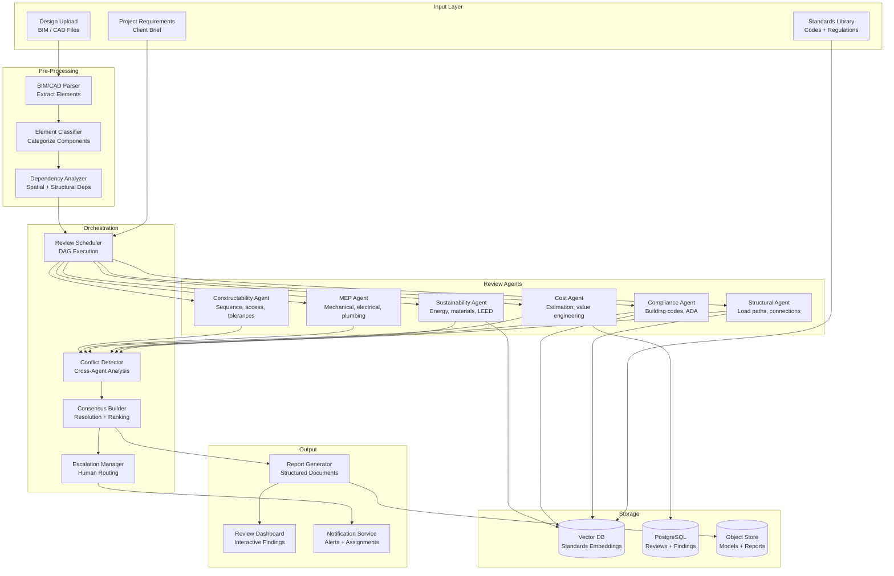
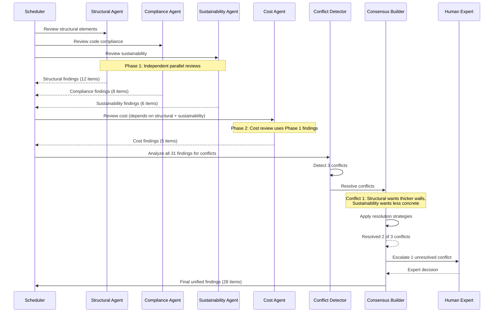

# Design: Multi-Agent Design Review System

This document presents a system design for a multi-agent system that reviews engineering designs -- architectural, mechanical, and electrical. Rather than using a single monolithic model, the system deploys specialized review agents for structural integrity, code compliance, sustainability, cost estimation, and constructability. These agents collaborate through an orchestrated pipeline, resolve conflicts between their recommendations, and produce a unified review report. This is an excellent system design interview topic because it demonstrates multi-agent coordination, domain expertise decomposition, and consensus-building under uncertainty.

---

## Requirements Gathering

### Functional Requirements

1. **Specialized review agents** -- dedicated agents for structural, compliance, sustainability, cost, MEP (mechanical/electrical/plumbing), and constructability review
2. **Review orchestration** -- coordinate agents in the correct sequence with dependency management
3. **Conflict detection** -- identify and resolve contradictions between agent recommendations
4. **Consensus building** -- produce a unified set of recommendations from multiple agent opinions
5. **Human expert escalation** -- route unresolved conflicts and low-confidence findings to human reviewers
6. **Compliance checking** -- verify against building codes (IBC, local codes), standards (ADA, ASHRAE), and zoning
7. **Report generation** -- structured reports with visualizations, severity ratings, and actionable recommendations
8. **Iterative review cycles** -- re-review after the designer addresses findings from a previous cycle

### Non-Functional Requirements

| Requirement | Target |
|-------------|--------|
| Full review latency | < 30 minutes for a typical building design |
| Finding accuracy | > 85% of flagged issues are genuine problems |
| False positive rate | < 15% (to maintain reviewer trust) |
| Compliance coverage | > 95% of applicable code sections checked |
| Concurrent reviews | 100+ simultaneous review sessions |
| Report generation | < 2 minutes after review completes |

### Out of Scope

- Physical simulation (FEA, CFD) -- the system interprets simulation results but does not run simulations
- Design modification (the system reviews, not redesigns)
- Construction scheduling and logistics

---

## High-Level Architecture



---

## Multi-Agent Communication Protocol



---

## Component Deep Dive

### 1. Review Orchestration Scheduler

The scheduler manages review execution order based on dependencies between agents.

```python
class ReviewScheduler:
    """Orchestrates multi-agent review with dependency-aware scheduling."""

    # Define agent dependencies as a DAG
    AGENT_DEPENDENCIES = {
        "structural": [],                    # No dependencies -- runs first
        "compliance": [],                    # No dependencies -- runs first
        "mep": [],                           # No dependencies -- runs first
        "sustainability": ["structural"],    # Needs structural data
        "cost": ["structural", "sustainability"],  # Needs both
        "constructability": ["structural", "mep"],  # Needs both
    }

    async def execute_review(self, design: ParsedDesign, project_reqs: ProjectRequirements) -> ReviewResult:
        findings = {}
        completed = set()

        # Execute in topological order with parallelism
        while len(completed) < len(self.AGENT_DEPENDENCIES):
            # Find agents whose dependencies are all satisfied
            ready = [
                agent for agent, deps in self.AGENT_DEPENDENCIES.items()
                if agent not in completed and all(d in completed for d in deps)
            ]

            # Run ready agents in parallel
            tasks = []
            for agent_name in ready:
                agent = self.agents[agent_name]
                dep_findings = {d: findings[d] for d in self.AGENT_DEPENDENCIES[agent_name]}
                tasks.append(self._run_agent(agent, design, project_reqs, dep_findings))

            results = await asyncio.gather(*tasks, return_exceptions=True)

            for agent_name, result in zip(ready, results):
                if isinstance(result, Exception):
                    findings[agent_name] = self._handle_agent_failure(agent_name, result)
                else:
                    findings[agent_name] = result
                completed.add(agent_name)

        return ReviewResult(findings=findings)

    async def _run_agent(self, agent, design, reqs, dep_findings) -> list[Finding]:
        """Run a single review agent with timeout and retry."""
        try:
            return await asyncio.wait_for(
                agent.review(design, reqs, dep_findings),
                timeout=300,  # 5 minute timeout per agent
            )
        except asyncio.TimeoutError:
            return await self._retry_with_reduced_scope(agent, design, reqs, dep_findings)
```

### 2. Specialized Review Agent (Compliance Example)

```python
class ComplianceReviewAgent:
    """Reviews designs against building codes and standards."""

    def __init__(self, rag_pipeline, llm, standards_db):
        self.rag = rag_pipeline
        self.llm = llm
        self.standards_db = standards_db

    async def review(
        self, design: ParsedDesign, reqs: ProjectRequirements, dep_findings: dict
    ) -> list[Finding]:
        findings = []

        # Determine applicable codes based on project location and type
        applicable_codes = await self._determine_applicable_codes(reqs)

        # Review each building system against applicable codes
        for system in design.systems:
            # Retrieve relevant code sections
            code_sections = await self.rag.retrieve(
                query=f"{system.type} requirements for {reqs.building_type}",
                filter={"code": {"$in": [c.name for c in applicable_codes]}},
                top_k=15,
            )

            # Check compliance with LLM
            response = await self.llm.generate(
                system=COMPLIANCE_REVIEW_PROMPT,
                user=f"""Review this {system.type} system for code compliance.

Design elements:
{system.to_summary()}

Applicable code sections:
{self._format_code_sections(code_sections)}

Project: {reqs.building_type} in {reqs.location}
Occupancy: {reqs.occupancy_type}

For each potential violation, provide:
- Element ID and description
- Code section violated
- Severity (critical / major / minor)
- Specific requirement not met
- Recommended fix""",
                response_format=ComplianceFindingsSchema,
            )

            findings.extend(self._parse_findings(response, system))

        # Cross-check: ADA accessibility
        findings.extend(await self._check_accessibility(design, reqs))

        # Cross-check: Fire safety egress
        findings.extend(await self._check_fire_egress(design, reqs))

        return findings
```

### 3. Conflict Detection and Consensus Building

```python
class ConflictDetector:
    """Detects conflicts between findings from different review agents."""

    CONFLICT_PATTERNS = [
        ("structural", "sustainability", "material_quantity"),
        ("structural", "cost", "over_engineering"),
        ("compliance", "cost", "code_minimum_vs_value"),
        ("mep", "structural", "penetration_conflicts"),
        ("sustainability", "cost", "green_premium"),
    ]

    async def detect_conflicts(self, all_findings: dict[str, list[Finding]]) -> list[Conflict]:
        conflicts = []

        for agent_a, agent_b, conflict_type in self.CONFLICT_PATTERNS:
            if agent_a in all_findings and agent_b in all_findings:
                detected = await self._check_pair(
                    all_findings[agent_a],
                    all_findings[agent_b],
                    conflict_type,
                )
                conflicts.extend(detected)

        # Also check for spatial conflicts (same element, different recommendations)
        conflicts.extend(await self._check_spatial_conflicts(all_findings))

        return conflicts

    async def _check_pair(self, findings_a, findings_b, conflict_type) -> list[Conflict]:
        """Use LLM to detect semantic conflicts between two sets of findings."""
        response = await self.llm.generate(
            system=CONFLICT_DETECTION_PROMPT,
            user=f"""Detect conflicts between these two sets of review findings.
Conflict type to check: {conflict_type}

Agent A findings:
{self._format_findings(findings_a)}

Agent B findings:
{self._format_findings(findings_b)}

A conflict exists when two findings recommend contradictory actions
for the same element or system.""",
            response_format=ConflictListSchema,
        )
        return self._parse_conflicts(response)


class ConsensusBuilder:
    """Resolves conflicts and builds unified recommendations."""

    RESOLUTION_STRATEGIES = {
        "safety_first": "Structural and life-safety findings always take priority",
        "code_compliance": "Code compliance is non-negotiable -- always wins",
        "cost_benefit": "Weigh cost against benefit for non-safety items",
        "escalate": "Route to human expert when strategies are insufficient",
    }

    async def resolve(self, conflicts: list[Conflict]) -> list[Resolution]:
        resolutions = []
        escalations = []

        for conflict in conflicts:
            # Apply resolution strategies in priority order
            resolution = None

            if conflict.involves_safety():
                resolution = self._apply_safety_first(conflict)
            elif conflict.involves_compliance():
                resolution = self._apply_code_compliance(conflict)
            else:
                resolution = await self._apply_cost_benefit(conflict)

            if resolution and resolution.confidence > 0.7:
                resolutions.append(resolution)
            else:
                escalations.append(conflict)

        return resolutions, escalations
```

### 4. Report Generation

```python
class ReviewReportGenerator:
    """Generates structured review reports with visualizations."""

    async def generate(self, review: ReviewResult, resolutions: list[Resolution]) -> Report:
        # Organize findings by severity and system
        organized = self._organize_findings(review.all_findings())

        # Generate executive summary with LLM
        exec_summary = await self.llm.generate(
            system=REPORT_SUMMARY_PROMPT,
            user=f"""Generate an executive summary for this design review.

Total findings: {len(review.all_findings())}
Critical: {organized['critical']}
Major: {organized['major']}
Minor: {organized['minor']}
Top issues: {self._top_issues(review)}
Conflicts resolved: {len(resolutions)}

The summary should be 3-5 paragraphs suitable for a project manager.""",
        )

        report = Report(
            executive_summary=exec_summary,
            findings_by_severity=organized,
            findings_by_system=self._group_by_system(review),
            conflicts_and_resolutions=resolutions,
            compliance_matrix=self._generate_compliance_matrix(review),
            recommendations=self._prioritize_recommendations(review),
        )

        return report
```

---

## Iterative Review Cycles

:::tip
Design reviews are rarely one-shot. The system should track which findings have been addressed, which are still open, and what new issues might have been introduced by the designer's changes.
:::

```python
class IterativeReviewManager:
    async def run_follow_up_review(
        self, updated_design: ParsedDesign, previous_review: ReviewResult
    ) -> ReviewResult:
        # Identify what changed since last review
        changes = await self._diff_designs(previous_review.design, updated_design)

        # Only re-review affected systems and their dependents
        affected_agents = self._determine_affected_agents(changes)

        # Run targeted review
        new_findings = await self.scheduler.execute_partial_review(
            updated_design, affected_agents
        )

        # Reconcile with previous findings
        reconciled = self._reconcile(previous_review.findings, new_findings, changes)

        return ReviewResult(
            findings=reconciled,
            previous_review_id=previous_review.id,
            changes_addressed=changes.addressed_findings,
            new_issues=changes.new_issues,
            cycle_number=previous_review.cycle_number + 1,
        )
```

---

## Scaling Considerations

| Component | Strategy |
|-----------|----------|
| Review agents | Stateless workers; scale per agent type based on demand |
| Standards RAG | Pre-computed embeddings; cached code sections per jurisdiction |
| BIM parsing | GPU-accelerated geometry processing; chunked for large models |
| Report generation | Template-based with LLM-generated sections; cached visualizations |
| Concurrent reviews | Queue-based with priority; dedicated GPU pool for large models |

:::warning
Building codes vary by jurisdiction and are updated regularly. The standards database must be versioned and the system must track which code version was used for each review. Using an outdated code version in a review creates legal liability.
:::

---

## Interview Answer Structure

1. **Clarify scope** (2 min) -- which disciplines; new design vs. renovation; compliance jurisdictions
2. **Multi-agent decomposition** (5 min) -- why separate agents per domain; how they share findings
3. **Orchestration DAG** (3 min) -- dependency-aware scheduling; parallel where possible
4. **Conflict resolution** (5 min) -- how contradictory recommendations are detected and resolved
5. **Compliance checking** (3 min) -- RAG over building codes; jurisdiction-aware retrieval
6. **Human escalation** (2 min) -- when and how to involve human experts
7. **Iterative cycles** (2 min) -- tracking addressed findings; incremental re-review
8. **Report generation** (2 min) -- structured output with severity, system grouping, and compliance matrix
