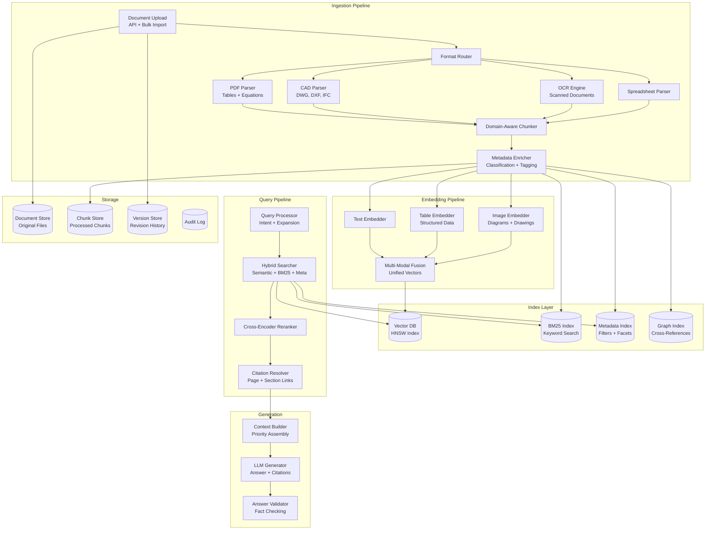

# Design: RAG Platform for Engineering Documents

This document presents a system design for a Retrieval-Augmented Generation platform purpose-built for engineering documents -- technical manuals, specifications, standards, blueprints, datasheets, and regulatory filings. Unlike general-purpose RAG, engineering documents contain tables, equations, diagrams, cross-references, revision histories, and domain-specific terminology that demand specialized ingestion, chunking, and retrieval strategies. This is a rich system design topic because it combines document understanding, multi-modal embeddings, hybrid search, and strict accuracy requirements where incorrect information can have safety consequences.

---

## Requirements Gathering

### Functional Requirements

1. **Multi-format ingestion** -- PDF, DWG (AutoCAD), IFC (BIM), STEP (3D), spreadsheets, Word documents, and scanned legacy documents
2. **Specialized chunking** -- preserve tables, equations, figure references, section hierarchy, and cross-document links
3. **Multi-modal embeddings** -- embed text, tables, diagrams, and engineering drawings into a unified vector space
4. **Hybrid search** -- combine semantic search, keyword/BM25 search, and structured metadata filtering
5. **Citation with page-level references** -- every answer links to exact page, section, and paragraph
6. **Version-aware retrieval** -- distinguish between document revisions; answer from the correct version
7. **Access control** -- document-level and collection-level permissions aligned with enterprise roles
8. **Domain-specific evaluation** -- measure retrieval and generation quality with engineering-specific benchmarks

### Non-Functional Requirements

| Requirement | Target |
|-------------|--------|
| Ingestion throughput | 10,000 documents/hour |
| Query latency (retrieval) | < 500ms for top-20 results |
| Query latency (generation) | < 3s for first token |
| Citation accuracy | > 95% of citations point to correct source section |
| Retrieval recall@20 | > 90% for domain-specific queries |
| Scale | 10M+ documents, 100M+ chunks |
| Availability | 99.9% uptime |

### Out of Scope

- Document authoring or editing
- Real-time collaboration on documents
- Translation (V1 supports English only)

---

## High-Level Architecture



---

## Component Deep Dive

### 1. Multi-Format Document Parsing

```python
class DocumentIngestionPipeline:
    """Routes documents to specialized parsers based on format."""

    PARSER_REGISTRY = {
        ".pdf": "pdf_parser",
        ".dwg": "cad_parser",
        ".dxf": "cad_parser",
        ".ifc": "bim_parser",
        ".step": "step_parser",
        ".stp": "step_parser",
        ".xlsx": "spreadsheet_parser",
        ".xls": "spreadsheet_parser",
        ".docx": "word_parser",
        ".tiff": "ocr_parser",
        ".tif": "ocr_parser",
    }

    async def ingest(self, document: RawDocument) -> IngestedDocument:
        parser_name = self.PARSER_REGISTRY.get(document.extension)
        if not parser_name:
            raise UnsupportedFormatError(document.extension)

        parser = self.parsers[parser_name]

        # Parse into structured representation
        parsed = await parser.parse(document)

        # Detect if scanned (image-based PDF)
        if isinstance(parsed, PDFDocument) and parsed.is_scanned:
            parsed = await self.ocr_parser.parse(document)

        # Extract cross-references
        cross_refs = await self._extract_cross_references(parsed)

        # Store original and parsed versions
        await self.doc_store.store(document.id, document.raw_bytes)

        return IngestedDocument(
            id=document.id,
            parsed=parsed,
            cross_references=cross_refs,
            version=document.version,
            metadata=await self._extract_metadata(parsed),
        )


class EngineeringPDFParser:
    """Specialized PDF parser that handles tables, equations, and figures."""

    async def parse(self, document: RawDocument) -> PDFDocument:
        pages = []

        for page_num, page in enumerate(self._extract_pages(document)):
            # Extract text with layout preservation
            text_blocks = await self._extract_text_blocks(page)

            # Detect and extract tables
            tables = await self._detect_tables(page)
            for table in tables:
                table.content = await self._parse_table_structure(table)

            # Detect and extract equations
            equations = await self._detect_equations(page)
            for eq in equations:
                eq.latex = await self._ocr_equation(eq.image)

            # Detect and extract figures/diagrams
            figures = await self._detect_figures(page)
            for fig in figures:
                fig.caption = self._extract_caption(fig, text_blocks)
                fig.description = await self._describe_figure(fig.image)

            pages.append(ParsedPage(
                number=page_num + 1,
                text_blocks=text_blocks,
                tables=tables,
                equations=equations,
                figures=figures,
                section_headers=self._extract_headers(text_blocks),
            ))

        return PDFDocument(pages=pages, toc=self._build_toc(pages))
```

### 2. Domain-Aware Chunking

Engineering documents require chunking strategies that preserve semantic completeness and structural context.

```python
class EngineeringDocumentChunker:
    """Chunks engineering documents while preserving tables, equations, and context."""

    def __init__(self, max_chunk_tokens: int = 512, overlap_tokens: int = 64):
        self.max_chunk_tokens = max_chunk_tokens
        self.overlap_tokens = overlap_tokens

    async def chunk(self, doc: IngestedDocument) -> list[Chunk]:
        chunks = []

        for page in doc.parsed.pages:
            # Strategy 1: Section-based chunking (preferred)
            sections = self._identify_sections(page)
            for section in sections:
                section_chunks = self._chunk_section(section, page.number)
                chunks.extend(section_chunks)

            # Strategy 2: Tables get their own chunks
            for table in page.tables:
                chunks.append(Chunk(
                    text=self._table_to_text(table),
                    chunk_type="table",
                    page=page.number,
                    metadata={
                        "table_title": table.title,
                        "columns": table.column_headers,
                        "row_count": table.row_count,
                    },
                ))

            # Strategy 3: Equations with surrounding context
            for eq in page.equations:
                context = self._get_equation_context(eq, page.text_blocks)
                chunks.append(Chunk(
                    text=f"Equation: {eq.latex}\nContext: {context}",
                    chunk_type="equation",
                    page=page.number,
                ))

            # Strategy 4: Figures with captions and descriptions
            for fig in page.figures:
                chunks.append(Chunk(
                    text=f"Figure: {fig.caption}\nDescription: {fig.description}",
                    chunk_type="figure",
                    page=page.number,
                    image=fig.image,
                ))

        # Add document-level summary chunk
        summary = await self._generate_doc_summary(doc)
        chunks.insert(0, Chunk(
            text=summary,
            chunk_type="summary",
            page=0,
            metadata={"is_summary": True},
        ))

        # Enrich all chunks with hierarchical context
        for chunk in chunks:
            chunk.section_path = self._resolve_section_path(chunk, doc.parsed.toc)
            chunk.document_id = doc.id
            chunk.version = doc.version

        return chunks
```

:::tip
The chunking strategy is the single highest-leverage component in an engineering RAG system. Poor chunking -- splitting tables across chunks, losing equation context, or breaking cross-references -- degrades retrieval quality more than any other factor. In interviews, emphasize that you would invest disproportionate effort here.
:::

### 3. Hybrid Search with Multi-Modal Retrieval

```python
class HybridSearchEngine:
    """Combines semantic, keyword, and metadata search for engineering documents."""

    async def search(
        self, query: str, filters: dict = None, top_k: int = 20
    ) -> list[SearchResult]:
        # Step 1: Query expansion for engineering terminology
        expanded = await self._expand_query(query)
        # e.g., "beam deflection limit" -> adds "L/360", "serviceability", "IBC 1604.3"

        # Step 2: Parallel search across all indices
        semantic_task = self.vector_db.search(
            embedding=await self.embedder.embed(expanded.semantic_query),
            top_k=top_k * 3,
            filter=self._build_vector_filter(filters),
        )
        keyword_task = self.bm25_index.search(
            query=expanded.keyword_query,
            top_k=top_k * 3,
            filter=filters,
        )
        metadata_task = self.meta_index.search(
            structured_query=expanded.metadata_query,
            filter=filters,
        )

        semantic, keyword, metadata = await asyncio.gather(
            semantic_task, keyword_task, metadata_task
        )

        # Step 3: Reciprocal Rank Fusion
        fused = self._reciprocal_rank_fusion(
            [semantic, keyword, metadata],
            weights=[0.5, 0.3, 0.2],
            k=60,
        )

        # Step 4: Cross-encoder reranking (top candidates only)
        candidates = fused[:top_k * 2]
        reranked = await self.reranker.rerank(query, candidates, top_k=top_k)

        # Step 5: Resolve citations
        for result in reranked:
            result.citation = await self._resolve_citation(result)

        return reranked

    async def _expand_query(self, query: str) -> ExpandedQuery:
        """Expand query with domain-specific synonyms and standards references."""
        response = await self.llm.generate(
            system="You are an engineering terminology expert.",
            user=f"""Expand this engineering query with:
1. Technical synonyms
2. Relevant standards references (ISO, IBC, ASHRAE, ASTM)
3. Key numerical parameters commonly associated

Query: {query}""",
        )
        return ExpandedQuery.parse(response)

    def _reciprocal_rank_fusion(
        self, result_lists: list[list], weights: list[float], k: int = 60
    ) -> list[SearchResult]:
        """Combine multiple ranked lists using weighted RRF."""
        scores = {}
        for results, weight in zip(result_lists, weights):
            for rank, result in enumerate(results):
                if result.id not in scores:
                    scores[result.id] = {"result": result, "score": 0.0}
                scores[result.id]["score"] += weight / (k + rank + 1)

        sorted_results = sorted(scores.values(), key=lambda x: x["score"], reverse=True)
        return [item["result"] for item in sorted_results]
```

### 4. Version-Aware Retrieval

Engineering documents have revisions. The system must answer from the correct version.

```python
class VersionAwareRetriever:
    """Ensures retrieval respects document versions and revision history."""

    async def retrieve(
        self, query: str, version_policy: VersionPolicy, filters: dict = None
    ) -> list[SearchResult]:
        if version_policy.mode == "latest":
            # Only search latest version of each document
            filters = {**(filters or {}), "is_latest": True}
        elif version_policy.mode == "specific":
            filters = {**(filters or {}), "version": version_policy.version}
        elif version_policy.mode == "as_of_date":
            # Find the version that was current on the specified date
            filters = {**(filters or {}), "effective_date": {"$lte": version_policy.date}}

        results = await self.search_engine.search(query, filters)

        # Annotate results with version context
        for result in results:
            result.version_info = await self._get_version_info(result.document_id)
            if result.version_info.has_newer_version:
                result.warnings.append(
                    f"A newer version ({result.version_info.latest}) exists. "
                    f"You are viewing {result.version_info.current}."
                )

        return results
```

### 5. Citation Resolution

```python
class CitationResolver:
    """Resolves search results to precise citations with page and section references."""

    async def resolve(self, result: SearchResult) -> Citation:
        chunk = await self.chunk_store.get(result.chunk_id)

        citation = Citation(
            document_title=chunk.document_title,
            document_id=chunk.document_id,
            version=chunk.version,
            page=chunk.page,
            section_path=chunk.section_path,
            chunk_type=chunk.chunk_type,
        )

        # Generate a deep link to the exact location in the source document
        citation.deep_link = await self._generate_deep_link(chunk)

        # Include a snippet of the original source for verification
        citation.source_snippet = await self._extract_source_snippet(
            chunk.document_id, chunk.page, chunk.text[:200]
        )

        return citation
```

---

## Access Control

:::warning
Engineering documents often contain proprietary information, export-controlled data (ITAR/EAR), or safety-critical specifications. Access control is not optional -- it must be enforced at the retrieval layer, not just the UI. Every search query must be filtered by the user's permissions before results are returned.
:::

```python
class AccessControlFilter:
    """Enforces document-level access control on search results."""

    async def filter_results(
        self, results: list[SearchResult], user: User
    ) -> list[SearchResult]:
        # Get user's accessible document collections
        accessible = await self.permissions.get_accessible_collections(user)

        # Filter results
        filtered = [
            r for r in results
            if r.collection_id in accessible
            and self._check_classification_level(r, user)
        ]

        # Audit log
        await self.audit.log(
            user=user.id,
            action="search",
            results_total=len(results),
            results_filtered=len(filtered),
            results_redacted=len(results) - len(filtered),
        )

        return filtered
```

---

## Evaluation Framework

```python
class EngineeringRAGEvaluator:
    """Evaluates RAG quality with engineering-specific metrics."""

    async def evaluate(self, test_set: list[EvalCase]) -> EvalReport:
        metrics = {
            "retrieval_recall_at_20": [],
            "citation_accuracy": [],
            "answer_correctness": [],
            "table_retrieval_rate": [],
            "cross_ref_resolution": [],
        }

        for case in test_set:
            results = await self.rag.search(case.query, top_k=20)
            answer = await self.rag.generate_answer(case.query)

            # Retrieval recall: did we find the relevant chunks?
            metrics["retrieval_recall_at_20"].append(
                self._recall(results, case.expected_chunks)
            )

            # Citation accuracy: do citations point to correct sources?
            metrics["citation_accuracy"].append(
                self._citation_accuracy(answer.citations, case.expected_citations)
            )

            # Answer correctness (LLM-as-judge with domain expert rubric)
            metrics["answer_correctness"].append(
                await self._judge_correctness(answer.text, case.expected_answer, case.rubric)
            )

            # Table retrieval: were relevant tables found?
            metrics["table_retrieval_rate"].append(
                self._table_recall(results, case.expected_tables)
            )

        return EvalReport(metrics={k: sum(v) / len(v) for k, v in metrics.items()})
```

---

## Scaling Considerations

| Component | Strategy | Target Scale |
|-----------|----------|-------------|
| Document ingestion | Worker pool with format-specific queues | 10K docs/hour |
| Embedding computation | Batched GPU inference; pre-computed for static docs | 1M chunks/hour |
| Vector index | Sharded by collection; HNSW with quantization | 100M+ vectors |
| BM25 index | Elasticsearch cluster with cross-collection search | 100M+ documents |
| Query serving | Read replicas; edge caching for frequent queries | 10K QPS |
| Storage | Tiered: hot (SSD) / warm (HDD) / cold (object store) | Petabyte-scale |

### Cost Analysis

| Component | Monthly Cost (10M docs) | Notes |
|-----------|------------------------|-------|
| Storage (originals) | $2,000 | Object store, avg 5MB/doc |
| Vector DB | $5,000 | Managed service, 100M vectors |
| Embedding compute | $3,000 | One-time + incremental |
| LLM generation | $15,000 | 500K queries/month |
| Search infrastructure | $4,000 | Elasticsearch + reranker GPU |
| **Total** | **$29,000/month** | $0.06 per query at 500K queries |

:::info
For engineering firms, $0.06 per query is trivial compared to an engineer spending 30 minutes manually searching through specifications. If the platform saves 10 minutes per query and engineers cost $80/hour, the ROI is roughly 200x.
:::

---

## Trade-Off Analysis

| Decision | Option A | Option B | Chosen | Rationale |
|----------|----------|----------|--------|-----------|
| Chunking strategy | Fixed-size sliding window | Domain-aware (section + table + equation) | Domain-aware | Engineering docs have structured elements that must not be split |
| Search approach | Semantic only | Hybrid (semantic + BM25 + metadata) | Hybrid | Exact code references (e.g., "ASTM A36") need keyword match |
| Embedding model | General-purpose (OpenAI) | Domain fine-tuned | Domain fine-tuned | 15-20% recall improvement on engineering terminology |
| Reranking | No reranking | Cross-encoder reranker | Cross-encoder | Critical for precision; worth the added 100ms latency |
| Version handling | Latest only | Version-aware with policy | Version-aware | Regulatory compliance requires answering from the applicable version |

---

## Interview Answer Structure

1. **Clarify scope** (2 min) -- document types; query patterns; accuracy requirements; scale
2. **Ingestion pipeline** (5 min) -- multi-format parsing; specialized handling for tables, equations, diagrams
3. **Chunking strategy** (5 min) -- why domain-aware chunking matters; examples of table and equation preservation
4. **Hybrid search** (5 min) -- semantic + BM25 + metadata; query expansion; reciprocal rank fusion
5. **Citation resolution** (3 min) -- page-level references; deep links; source verification
6. **Version awareness** (2 min) -- retrieval policies; revision tracking; deprecation warnings
7. **Access control** (2 min) -- document-level permissions; audit logging; export control
8. **Evaluation** (2 min) -- domain-specific metrics; table retrieval rate; citation accuracy
