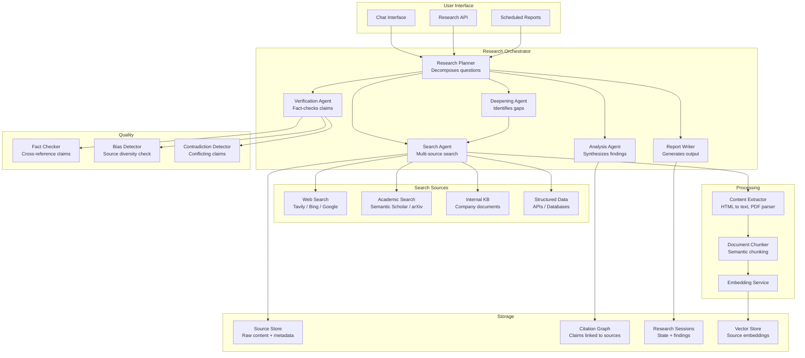
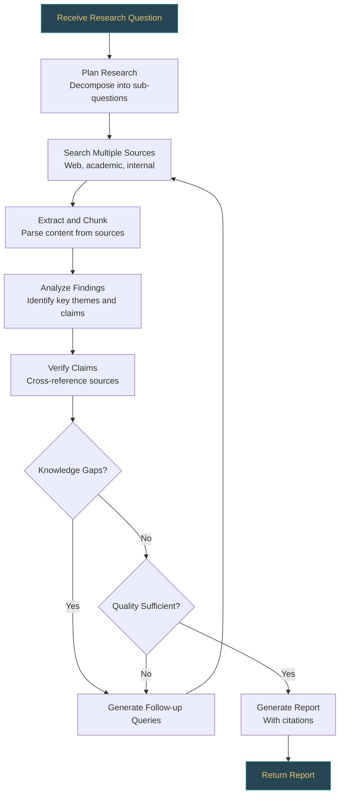
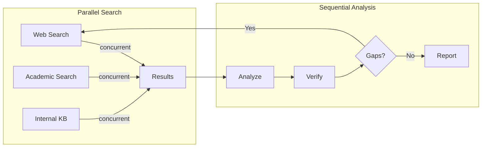

# Case Study: Research Agent

This case study designs a deep research agent -- an autonomous system that takes a research question, searches multiple sources, synthesizes information, tracks citations, and produces a structured report. This is one of the most interesting agentic system design problems because it requires planning under uncertainty, iterative deepening, and information quality assessment.

---

## Requirements Gathering

### Functional Requirements

1. **Multi-source search** -- query web search, academic papers, internal knowledge bases, and structured databases
2. **Information synthesis** -- combine findings from multiple sources into a coherent analysis
3. **Citation tracking** -- every claim must be linked to its source with a verifiable citation
4. **Iterative deepening** -- identify knowledge gaps and perform additional research to fill them
5. **Report generation** -- produce a structured report with executive summary, findings, analysis, and references
6. **Quality control** -- verify claims against sources, detect contradictions, and flag low-confidence findings

### Non-Functional Requirements

| Requirement | Target |
|-------------|--------|
| Latency (quick research) | < 2 minutes |
| Latency (deep research) | < 15 minutes |
| Citation accuracy | > 95% of citations correctly link to source material |
| Source diversity | At least 3 independent sources per major finding |
| Factual accuracy | > 90% of claims verifiable against cited sources |
| Cost per research task | < $2.00 for deep research |

### Out of Scope

- Real-time data (stock prices, live events)
- Primary research (conducting surveys, experiments)
- Languages other than English (V1)

---

## High-Level Architecture



---

## Research Workflow

The research process follows an iterative loop: plan, search, analyze, identify gaps, and deepen.



---

## Component Deep Dive

### 1. Research Planner

The planner decomposes a broad research question into specific, searchable sub-questions.

```python
class ResearchPlanner:
    async def create_research_plan(self, question: str, depth: str = "deep") -> ResearchPlan:
        response = await self.llm.generate(
            system_prompt=PLANNER_SYSTEM_PROMPT,
            messages=[{
                "role": "user",
                "content": f"""Create a research plan for the following question.

Question: {question}
Depth: {depth}  (quick = 2-3 sub-questions, deep = 5-8 sub-questions)

For each sub-question, specify:
1. The specific sub-question to investigate
2. Which sources to search (web, academic, internal, structured)
3. What kind of evidence to look for (statistics, expert opinions, case studies)
4. How important this sub-question is to the overall answer (critical / important / supplementary)
""",
            }],
        )

        plan = self._parse_plan(response)

        # Order sub-questions by importance (critical first)
        plan.sub_questions.sort(key=lambda q: q.importance, reverse=True)

        return plan

    async def identify_gaps(
        self,
        plan: ResearchPlan,
        findings: list[Finding],
    ) -> list[SubQuestion]:
        """Identify knowledge gaps based on current findings."""
        response = await self.llm.generate(
            prompt=f"""Given this research plan and current findings, identify knowledge gaps.

Original question: {plan.question}
Sub-questions investigated: {[q.text for q in plan.sub_questions if q.status == 'completed']}
Current findings: {self._summarize_findings(findings)}

Identify:
1. Sub-questions that were not adequately answered
2. New questions raised by the findings
3. Contradictions that need resolution
4. Areas where source quality is insufficient

Return new sub-questions to fill these gaps.
""",
        )

        return self._parse_sub_questions(response)
```

### 2. Multi-Source Search Agent

```python
class SearchAgent:
    def __init__(self, sources: dict):
        self.sources = sources  # name -> SearchProvider

    async def search(self, query: str, source_types: list[str],
                     max_results_per_source: int = 10) -> list[SearchResult]:
        """Search multiple sources in parallel."""
        tasks = []
        for source_type in source_types:
            if source_type in self.sources:
                tasks.append(
                    self._search_source(
                        self.sources[source_type], query, max_results_per_source
                    )
                )

        results_per_source = await asyncio.gather(*tasks, return_exceptions=True)

        all_results = []
        for results in results_per_source:
            if isinstance(results, Exception):
                continue  # Source failed -- log and skip
            all_results.extend(results)

        # Deduplicate and rank
        deduplicated = self._deduplicate(all_results)
        ranked = await self._rank_by_relevance(deduplicated, query)

        return ranked

    async def _search_source(self, provider, query: str, max_results: int) -> list[SearchResult]:
        """Search a single source with timeout."""
        try:
            return await asyncio.wait_for(
                provider.search(query, max_results=max_results),
                timeout=15.0,
            )
        except asyncio.TimeoutError:
            return []

    async def _rank_by_relevance(self, results: list[SearchResult], query: str) -> list[SearchResult]:
        """Re-rank results using semantic similarity."""
        query_embedding = await self.embedder.embed(query)
        for result in results:
            result_embedding = await self.embedder.embed(result.snippet)
            result.relevance_score = cosine_similarity(query_embedding, result_embedding)
        return sorted(results, key=lambda r: r.relevance_score, reverse=True)
```

### 3. Content Extraction and Processing

```python
class ContentExtractor:
    async def extract(self, url: str) -> ExtractedContent:
        """Extract clean text content from a URL."""
        # Determine content type
        content_type = await self._detect_type(url)

        match content_type:
            case "html":
                raw = await self._fetch_html(url)
                text = self._html_to_text(raw)
            case "pdf":
                raw = await self._fetch_pdf(url)
                text = self._pdf_to_text(raw)
            case "api":
                raw = await self._fetch_api(url)
                text = json.dumps(raw, indent=2)
            case _:
                text = await self._fetch_text(url)

        # Chunk the content for embedding and analysis
        chunks = self._semantic_chunk(text, max_chunk_size=1000)

        return ExtractedContent(
            url=url,
            title=self._extract_title(raw),
            full_text=text,
            chunks=chunks,
            extracted_at=datetime.utcnow(),
            metadata={
                "content_type": content_type,
                "word_count": len(text.split()),
                "chunk_count": len(chunks),
            },
        )
```

### 4. Citation Tracking

Every claim in the final report must be linked to its source. The citation system maintains this mapping.

```python
@dataclass
class Citation:
    citation_id: str
    source_url: str
    source_title: str
    source_type: str  # "web", "academic", "internal"
    relevant_text: str  # The specific passage that supports the claim
    accessed_at: datetime
    confidence: float  # How well the source supports the claim

@dataclass
class Finding:
    claim: str
    citations: list[Citation]
    confidence: float  # Aggregate confidence based on citations
    category: str  # "fact", "opinion", "statistic", "case_study"

class CitationTracker:
    def __init__(self):
        self.citations: dict[str, Citation] = {}
        self.claim_to_citations: dict[str, list[str]] = {}

    def add_citation(self, claim: str, source: SearchResult, relevant_text: str,
                     confidence: float) -> Citation:
        citation = Citation(
            citation_id=str(uuid4()),
            source_url=source.url,
            source_title=source.title,
            source_type=source.source_type,
            relevant_text=relevant_text,
            accessed_at=datetime.utcnow(),
            confidence=confidence,
        )
        self.citations[citation.citation_id] = citation

        if claim not in self.claim_to_citations:
            self.claim_to_citations[claim] = []
        self.claim_to_citations[claim].append(citation.citation_id)

        return citation

    def get_citations_for_claim(self, claim: str) -> list[Citation]:
        ids = self.claim_to_citations.get(claim, [])
        return [self.citations[cid] for cid in ids]

    def verify_coverage(self, findings: list[Finding]) -> dict:
        """Check that all findings have adequate citation support."""
        uncited = [f for f in findings if not f.citations]
        weak = [f for f in findings if f.confidence < 0.5]
        single_source = [f for f in findings if len(f.citations) == 1]

        return {
            "total_findings": len(findings),
            "uncited_findings": len(uncited),
            "weak_findings": len(weak),
            "single_source_findings": len(single_source),
            "citation_coverage": 1 - (len(uncited) / max(len(findings), 1)),
        }
```

### 5. Iterative Deepening

```python
class DeepeningAgent:
    async def deepen(
        self,
        plan: ResearchPlan,
        findings: list[Finding],
        max_iterations: int = 3,
    ) -> list[Finding]:
        """Iteratively deepen research until quality thresholds are met."""
        all_findings = list(findings)

        for iteration in range(max_iterations):
            # Check quality
            coverage = self.citation_tracker.verify_coverage(all_findings)
            if (coverage["citation_coverage"] > 0.95
                    and coverage["weak_findings"] == 0):
                break

            # Identify gaps
            gaps = await self.planner.identify_gaps(plan, all_findings)
            if not gaps:
                break

            # Search for gap-filling information
            for gap in gaps[:3]:  # Limit to top 3 gaps per iteration
                results = await self.search_agent.search(
                    query=gap.text,
                    source_types=gap.source_types,
                    max_results_per_source=5,
                )

                new_findings = await self.analyst.analyze(
                    question=gap.text,
                    sources=results,
                    existing_findings=all_findings,
                )
                all_findings.extend(new_findings)

        return all_findings
```

### 6. Verification Agent

```python
class VerificationAgent:
    async def verify_findings(self, findings: list[Finding]) -> VerificationReport:
        """Cross-reference findings against their sources and each other."""
        report = VerificationReport()

        for finding in findings:
            # Check 1: Is the claim supported by the cited source?
            for citation in finding.citations:
                is_supported = await self._check_support(
                    claim=finding.claim,
                    source_text=citation.relevant_text,
                )
                if not is_supported:
                    report.add_issue(
                        finding=finding,
                        issue="unsupported_claim",
                        details=f"Claim not adequately supported by citation from {citation.source_url}",
                    )

        # Check 2: Are there contradictions between findings?
        contradictions = await self._detect_contradictions(findings)
        for contradiction in contradictions:
            report.add_issue(
                finding=contradiction["finding_a"],
                issue="contradiction",
                details=f"Contradicts: {contradiction['finding_b'].claim}",
            )

        # Check 3: Source diversity
        source_counts = self._count_unique_sources(findings)
        if source_counts["unique_domains"] < 3:
            report.add_issue(
                finding=None,
                issue="low_source_diversity",
                details=f"Only {source_counts['unique_domains']} unique sources. Recommend broadening search.",
            )

        return report

    async def _check_support(self, claim: str, source_text: str) -> bool:
        """Use LLM to verify if the source text supports the claim."""
        response = await self.llm.generate(
            prompt=f"""Does the following source text support this claim?

Claim: {claim}
Source text: {source_text}

Answer with YES or NO, followed by a brief explanation.
""",
            temperature=0.0,
        )
        return response.strip().upper().startswith("YES")
```

---

## Report Generation

```python
class ReportWriter:
    async def generate_report(
        self,
        question: str,
        findings: list[Finding],
        verification: VerificationReport,
        format: str = "markdown",
    ) -> str:
        response = await self.llm.generate(
            system_prompt=REPORT_WRITER_PROMPT,
            messages=[{
                "role": "user",
                "content": f"""Write a research report based on these findings.

Research question: {question}
Findings: {self._format_findings(findings)}
Verification notes: {verification.summary}

Report structure:
1. Executive Summary (2-3 paragraphs)
2. Key Findings (numbered, each with inline citations [1], [2], etc.)
3. Detailed Analysis (organized by theme)
4. Contradictions and Uncertainties
5. Recommendations for Further Research
6. References (numbered list matching inline citations)

Rules:
- Every factual claim MUST have at least one citation
- Use [N] notation for inline citations
- Flag low-confidence findings explicitly
- Note contradictions between sources
""",
            }],
        )

        # Post-process: verify all citations are present
        report = self._validate_citations(response, findings)
        return report
```

---

## Scaling Considerations

### Concurrency Model



| Optimization | Impact |
|-------------|--------|
| Parallel source search | 3-5x faster search phase |
| Embedding cache | Avoid re-embedding known content |
| Source content cache | Avoid re-fetching recently accessed pages |
| Early termination | Stop deepening when quality threshold met |
| Streaming report | Return sections as they are generated |

### Cost Projection

| Phase | Tokens (Typical) | Cost |
|-------|-----------------|------|
| Planning | 5K | $0.02 |
| Search + extraction (5 sources) | 30K | $0.10 |
| Analysis | 25K | $0.15 |
| Verification | 15K | $0.08 |
| Deepening (1 iteration) | 30K | $0.15 |
| Report generation | 20K | $0.12 |
| **Total (deep research)** | **125K** | **$0.62** |

---

## Failure Modes

| Failure | Impact | Mitigation |
|---------|--------|------------|
| Search source down | Incomplete results | Degrade gracefully; note limited sources in report |
| Paywalled content | Cannot access full text | Use snippet/abstract; note access limitation |
| Contradictory sources | Confusing findings | Verification agent flags contradictions; present both perspectives |
| Hallucinated citations | Fake references | Verify URLs are valid and content matches |
| Circular reasoning | Agent cites its own prior output | Track source provenance; exclude agent-generated content |
| Token budget exceeded | Incomplete analysis | Prioritize critical sub-questions; generate partial report |

:::warning
The most insidious failure mode is **hallucinated citations** -- where the agent invents a reference that looks plausible but does not exist. The verification agent must check that every cited URL returns a page, and that the cited text actually appears on that page. Never trust the LLM to accurately recall source content from its training data.
:::

---

## Quality Metrics

| Metric | Measurement | Target |
|--------|-------------|--------|
| Citation accuracy | % of citations that link to actual content supporting the claim | > 95% |
| Source diversity | Number of unique domains cited | > 3 per major finding |
| Factual accuracy | Human evaluation of claims against sources | > 90% |
| Completeness | % of sub-questions adequately addressed | > 85% |
| Contradiction detection | % of contradictions flagged | > 80% |
| Report coherence | Human evaluation of structure and readability | > 4/5 |

---

## Interview Answer Structure

1. **Clarify requirements** (2 min) -- what kind of research, depth level, source types, output format
2. **Architecture diagram** (3 min) -- show the iterative research loop and multi-source search
3. **Deep dive: Iterative deepening** (5 min) -- explain how the agent identifies gaps and refines its research
4. **Deep dive: Citation tracking** (5 min) -- how every claim links back to a verifiable source
5. **Verification system** (4 min) -- cross-referencing, contradiction detection, source diversity
6. **Concurrency and performance** (3 min) -- parallel search, caching, early termination
7. **Failure modes** (3 min) -- hallucinated citations, paywalled content, contradictions
8. **Quality metrics** (2 min) -- how you measure and guarantee research quality

:::info
The research agent is an excellent system design interview topic because it tests your ability to design for uncertainty. Unlike a CRUD system where the data flow is deterministic, a research agent must adapt its strategy based on what it finds. Interviewers want to see that you can handle this non-determinism with structured iteration, quality thresholds, and graceful degradation.
:::
