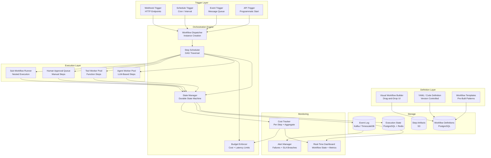
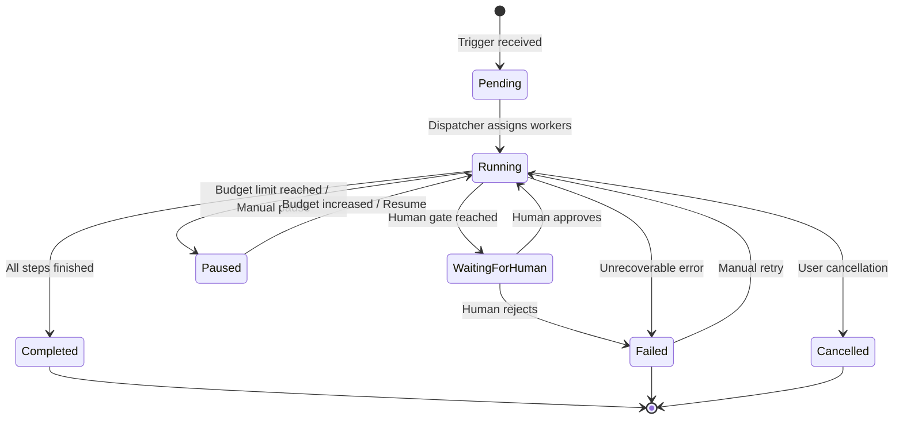

# Design: AI Workflow Orchestrator

This document presents a system design for an AI Workflow Orchestrator -- a system that defines, executes, and monitors complex workflows composed of AI agents, tools, and human checkpoints. Think of it as Apache Airflow meets LangGraph, purpose-built for agentic AI workloads. The orchestrator supports DAG-based workflow definitions, a visual builder, dynamic task routing, parallel execution with join semantics, error handling with retry policies, human approval gates, sub-workflow composition, cost and latency budgets, and event-driven triggers. This is an excellent interview topic because it combines distributed systems fundamentals (DAGs, state machines, fault tolerance) with AI-specific concerns (non-determinism, cost management, human-in-the-loop).

---

## Requirements Gathering

### Functional Requirements

1. **Workflow definition** -- define workflows as DAGs with typed inputs/outputs, branching, and loops
2. **Visual workflow builder** -- drag-and-drop UI for creating and editing workflows
3. **Dynamic task routing** -- route tasks to different agents or paths based on runtime conditions
4. **Parallel execution with join semantics** -- run independent tasks in parallel; join with configurable merge strategies
5. **Error handling and retry** -- configurable retry policies, fallback paths, and dead letter queues
6. **Human approval gates** -- pause workflow execution pending human review and approval
7. **Sub-workflow composition** -- nest workflows within workflows for reuse
8. **Real-time monitoring** -- live dashboard showing workflow state, per-step metrics, and cost accumulation
9. **Cost and latency budgets** -- enforce per-workflow limits on total cost and execution time
10. **Event-driven triggers** -- start workflows from events (webhooks, schedules, message queues)
11. **Integration with external systems** -- HTTP APIs, databases, file systems, message brokers

### Non-Functional Requirements

| Requirement | Target |
|-------------|--------|
| Workflow start latency | < 500ms from trigger to first step execution |
| Step scheduling latency | < 100ms between step completion and next step start |
| Concurrent workflows | 10,000+ simultaneous workflow executions |
| Fault tolerance | No workflow lost on worker crash; exactly-once step execution |
| State persistence | Durable; survive system restarts |
| Dashboard latency | < 2s for real-time workflow state |
| API response time | < 200ms for workflow submission |

### Out of Scope

- Agent development or training
- Data pipeline ETL (use Airflow/Dagster for that)
- Long-running batch ML training jobs

---

## High-Level Architecture



---

## Workflow State Machine

Each workflow instance follows a state machine that governs its lifecycle.



---

## Component Deep Dive

### 1. Workflow Definition and DAG Model

```python
class WorkflowDefinition:
    """Defines a workflow as a directed acyclic graph of steps."""

    def __init__(self, name: str, version: str):
        self.name = name
        self.version = version
        self.steps: dict[str, StepDefinition] = {}
        self.edges: list[Edge] = []
        self.triggers: list[TriggerConfig] = []
        self.budget: BudgetConfig = BudgetConfig()
        self.error_policy: ErrorPolicy = ErrorPolicy.default()

    def add_step(self, step: "StepDefinition") -> "WorkflowDefinition":
        self.steps[step.id] = step
        return self

    def add_edge(self, from_step: str, to_step: str, condition: str = None) -> "WorkflowDefinition":
        self.edges.append(Edge(from_step=from_step, to_step=to_step, condition=condition))
        return self

    def validate(self) -> list[str]:
        """Validate the workflow DAG for correctness."""
        errors = []
        # Check for cycles
        if self._has_cycle():
            errors.append("Workflow contains a cycle")
        # Check all edges reference valid steps
        for edge in self.edges:
            if edge.from_step not in self.steps:
                errors.append(f"Edge references unknown step: {edge.from_step}")
            if edge.to_step not in self.steps:
                errors.append(f"Edge references unknown step: {edge.to_step}")
        # Check for unreachable steps
        reachable = self._get_reachable_steps()
        for step_id in self.steps:
            if step_id not in reachable and step_id != self._get_entry_step():
                errors.append(f"Step {step_id} is unreachable")
        # Check type compatibility between connected steps
        for edge in self.edges:
            if not self._types_compatible(edge.from_step, edge.to_step):
                errors.append(f"Type mismatch: {edge.from_step} output incompatible with {edge.to_step} input")
        return errors


class StepDefinition:
    """Defines a single step in the workflow."""

    def __init__(
        self,
        id: str,
        step_type: str,           # "agent", "tool", "human_gate", "sub_workflow", "router"
        config: dict,
        input_schema: dict = None,
        output_schema: dict = None,
        retry_policy: RetryPolicy = None,
        timeout_seconds: int = 300,
        cost_limit_usd: float = None,
    ):
        self.id = id
        self.step_type = step_type
        self.config = config
        self.input_schema = input_schema
        self.output_schema = output_schema
        self.retry_policy = retry_policy or RetryPolicy.default()
        self.timeout_seconds = timeout_seconds
        self.cost_limit_usd = cost_limit_usd


# Example workflow definition
def create_customer_support_workflow() -> WorkflowDefinition:
    wf = WorkflowDefinition("customer_support_v2", "2.0")

    wf.add_step(StepDefinition(
        id="classify",
        step_type="agent",
        config={"agent": "classifier", "model": "claude-haiku"},
        timeout_seconds=30,
    ))
    wf.add_step(StepDefinition(
        id="research",
        step_type="agent",
        config={"agent": "researcher", "model": "claude-sonnet"},
        timeout_seconds=120,
    ))
    wf.add_step(StepDefinition(
        id="draft_response",
        step_type="agent",
        config={"agent": "responder", "model": "claude-sonnet"},
        timeout_seconds=60,
    ))
    wf.add_step(StepDefinition(
        id="review_gate",
        step_type="human_gate",
        config={"assignee_role": "support_lead", "timeout_hours": 4},
    ))
    wf.add_step(StepDefinition(
        id="send_response",
        step_type="tool",
        config={"tool": "email_sender"},
        timeout_seconds=30,
    ))

    wf.add_edge("classify", "research")
    wf.add_edge("research", "draft_response")
    wf.add_edge("draft_response", "review_gate")
    wf.add_edge("review_gate", "send_response", condition="approved")

    wf.budget = BudgetConfig(max_cost_usd=2.0, max_duration_seconds=600)

    return wf
```

### 2. Step Scheduler with DAG Traversal

```python
class StepScheduler:
    """Schedules workflow steps respecting DAG dependencies and parallelism."""

    async def schedule_next(self, instance: WorkflowInstance) -> list[str]:
        """Determine which steps are ready to execute."""
        ready = []

        for step_id, step in instance.workflow.steps.items():
            # Skip already completed, running, or failed steps
            if instance.step_states[step_id] in ("completed", "running", "failed", "skipped"):
                continue

            # Check if all dependencies are satisfied
            dependencies = self._get_dependencies(step_id, instance.workflow)
            all_deps_met = all(
                instance.step_states[dep] == "completed" for dep in dependencies
            )

            if not all_deps_met:
                continue

            # Check conditional edges
            if self._has_conditional_edge(step_id, instance.workflow):
                condition = self._evaluate_condition(step_id, instance)
                if not condition:
                    instance.step_states[step_id] = "skipped"
                    continue

            # Check budget before scheduling
            if not await self.budget_enforcer.can_proceed(instance, step_id):
                instance.state = "paused"
                await self.alerting.notify(
                    f"Workflow {instance.id} paused: budget limit reached"
                )
                return []

            ready.append(step_id)

        # Dispatch ready steps to appropriate worker pools
        for step_id in ready:
            instance.step_states[step_id] = "running"
            await self._dispatch_step(instance, step_id)

        return ready

    async def _dispatch_step(self, instance: WorkflowInstance, step_id: str):
        """Route step to the appropriate execution pool."""
        step = instance.workflow.steps[step_id]

        # Collect inputs from upstream steps
        inputs = self._collect_inputs(instance, step_id)

        task = ExecutionTask(
            workflow_id=instance.id,
            step_id=step_id,
            step_config=step.config,
            inputs=inputs,
            timeout=step.timeout_seconds,
            retry_policy=step.retry_policy,
        )

        if step.step_type == "agent":
            await self.agent_queue.enqueue(task)
        elif step.step_type == "tool":
            await self.tool_queue.enqueue(task)
        elif step.step_type == "human_gate":
            await self.human_queue.enqueue(task)
        elif step.step_type == "sub_workflow":
            await self._start_sub_workflow(instance, step_id, task)
```

### 3. Dynamic Task Router

```python
class DynamicRouter:
    """Routes workflow execution dynamically based on runtime conditions."""

    async def evaluate_route(
        self, instance: WorkflowInstance, router_step: StepDefinition, inputs: dict
    ) -> str:
        """Determine which downstream path to take."""
        routing_strategy = router_step.config.get("strategy", "llm_classify")

        if routing_strategy == "rule_based":
            return self._rule_based_route(router_step.config["rules"], inputs)
        elif routing_strategy == "llm_classify":
            return await self._llm_route(router_step, inputs)
        elif routing_strategy == "score_threshold":
            return self._threshold_route(router_step.config["thresholds"], inputs)

    async def _llm_route(self, router_step: StepDefinition, inputs: dict) -> str:
        """Use LLM to classify and route to the appropriate path."""
        routes = router_step.config["routes"]
        response = await self.llm.generate(
            system="You are a task router. Classify the input and select the best route.",
            user=f"""Input: {inputs}

Available routes:
{self._format_routes(routes)}

Select the route that best matches the input. Return only the route ID.""",
        )
        route_id = response.strip()
        if route_id not in routes:
            return router_step.config.get("default_route", list(routes.keys())[0])
        return route_id

    def _rule_based_route(self, rules: list[dict], inputs: dict) -> str:
        """Evaluate rules in order and return the first matching route."""
        for rule in rules:
            if self._evaluate_expression(rule["condition"], inputs):
                return rule["route"]
        return rules[-1].get("default_route", rules[-1]["route"])
```

### 4. Error Handling and Retry Policies

```python
class ErrorHandler:
    """Handles step failures with configurable retry and fallback strategies."""

    async def handle_step_failure(
        self, instance: WorkflowInstance, step_id: str, error: Exception
    ) -> ErrorAction:
        step = instance.workflow.steps[step_id]
        policy = step.retry_policy
        attempt = instance.get_attempt_count(step_id)

        # Check if retries are available
        if attempt < policy.max_retries:
            delay = self._compute_backoff(policy, attempt)
            return ErrorAction(
                action="retry",
                delay_seconds=delay,
                attempt=attempt + 1,
                reason=f"Retry {attempt + 1}/{policy.max_retries} after {delay}s",
            )

        # Check for fallback step
        if policy.fallback_step:
            return ErrorAction(
                action="fallback",
                fallback_step=policy.fallback_step,
                reason=f"All {policy.max_retries} retries exhausted. Falling back to {policy.fallback_step}",
            )

        # Check workflow-level error policy
        wf_policy = instance.workflow.error_policy
        if wf_policy.on_step_failure == "continue":
            return ErrorAction(
                action="skip",
                reason=f"Step {step_id} failed but workflow policy is 'continue'",
            )
        elif wf_policy.on_step_failure == "pause":
            return ErrorAction(
                action="pause",
                reason=f"Step {step_id} failed. Workflow paused for manual intervention.",
            )

        return ErrorAction(action="fail_workflow", reason=f"Step {step_id} failed after all retries")

    def _compute_backoff(self, policy: RetryPolicy, attempt: int) -> float:
        if policy.backoff_strategy == "exponential":
            return min(policy.base_delay * (2 ** attempt), policy.max_delay)
        elif policy.backoff_strategy == "linear":
            return min(policy.base_delay * (attempt + 1), policy.max_delay)
        return policy.base_delay


class RetryPolicy:
    def __init__(
        self,
        max_retries: int = 3,
        base_delay: float = 1.0,
        max_delay: float = 60.0,
        backoff_strategy: str = "exponential",
        retryable_errors: list[str] = None,
        fallback_step: str = None,
    ):
        self.max_retries = max_retries
        self.base_delay = base_delay
        self.max_delay = max_delay
        self.backoff_strategy = backoff_strategy
        self.retryable_errors = retryable_errors or ["timeout", "rate_limit", "transient"]
        self.fallback_step = fallback_step

    @classmethod
    def default(cls):
        return cls(max_retries=3, base_delay=2.0, backoff_strategy="exponential")
```

### 5. Human Approval Gates

```python
class HumanApprovalGate:
    """Manages human-in-the-loop approval steps."""

    async def create_approval_request(
        self, instance: WorkflowInstance, step_id: str, context: dict
    ) -> ApprovalRequest:
        step = instance.workflow.steps[step_id]

        request = ApprovalRequest(
            id=f"approval-{uuid4().hex[:8]}",
            workflow_id=instance.id,
            step_id=step_id,
            assignee_role=step.config["assignee_role"],
            title=f"Approval needed: {instance.workflow.name} / {step_id}",
            context=context,
            created_at=datetime.utcnow(),
            deadline=datetime.utcnow() + timedelta(hours=step.config.get("timeout_hours", 24)),
        )

        # Persist and notify
        await self.approval_store.create(request)
        await self.notification_service.notify(
            role=request.assignee_role,
            message=f"Approval required for workflow '{instance.workflow.name}'",
            action_url=f"{self.base_url}/approvals/{request.id}",
            deadline=request.deadline,
        )

        return request

    async def process_decision(self, request_id: str, decision: ApprovalDecision):
        """Process a human approval or rejection."""
        request = await self.approval_store.get(request_id)

        if decision.approved:
            # Resume workflow with any human-provided modifications
            await self.scheduler.resume_step(
                request.workflow_id,
                request.step_id,
                additional_context=decision.notes,
            )
        else:
            # Handle rejection
            await self.scheduler.fail_step(
                request.workflow_id,
                request.step_id,
                reason=f"Rejected by {decision.reviewer}: {decision.notes}",
            )
```

### 6. Cost and Latency Budget Enforcement

```python
class BudgetEnforcer:
    """Enforces cost and latency budgets per workflow execution."""

    async def can_proceed(self, instance: WorkflowInstance, next_step_id: str) -> bool:
        budget = instance.workflow.budget

        # Check cost budget
        if budget.max_cost_usd:
            current_cost = await self.cost_tracker.get_total_cost(instance.id)
            estimated_step_cost = self._estimate_step_cost(
                instance.workflow.steps[next_step_id]
            )
            if current_cost + estimated_step_cost > budget.max_cost_usd:
                await self.alerting.notify(
                    f"Workflow {instance.id}: cost budget exhausted "
                    f"({current_cost:.2f} / {budget.max_cost_usd:.2f} USD)"
                )
                return False

        # Check latency budget
        if budget.max_duration_seconds:
            elapsed = (datetime.utcnow() - instance.started_at).total_seconds()
            if elapsed > budget.max_duration_seconds:
                await self.alerting.notify(
                    f"Workflow {instance.id}: time budget exceeded "
                    f"({elapsed:.0f}s / {budget.max_duration_seconds}s)"
                )
                return False

        return True

    def _estimate_step_cost(self, step: StepDefinition) -> float:
        """Estimate cost for a step based on type and historical data."""
        if step.cost_limit_usd:
            return step.cost_limit_usd
        # Use historical average for this step type
        historical = self.cost_history.get_average(step.step_type, step.config.get("model"))
        return historical or 0.10  # Default estimate
```

:::tip
Budget enforcement is a key differentiator in production workflow orchestrators. Without it, a runaway agent loop can accumulate hundreds of dollars in LLM costs in minutes. Always enforce budgets at both the step level and the workflow level, and alert operators when budgets are approaching limits.
:::

---

## Real-Time Monitoring Dashboard

```python
class WorkflowDashboard:
    """Provides real-time visibility into workflow execution."""

    async def get_workflow_state(self, instance_id: str) -> WorkflowView:
        instance = await self.state_store.get(instance_id)

        return WorkflowView(
            id=instance.id,
            workflow_name=instance.workflow.name,
            state=instance.state,
            started_at=instance.started_at,
            elapsed_seconds=(datetime.utcnow() - instance.started_at).total_seconds(),
            steps=[
                StepView(
                    id=step_id,
                    state=instance.step_states[step_id],
                    started_at=instance.step_timings.get(step_id, {}).get("started"),
                    completed_at=instance.step_timings.get(step_id, {}).get("completed"),
                    cost_usd=instance.step_costs.get(step_id, 0),
                    tokens_used=instance.step_tokens.get(step_id, 0),
                    error=instance.step_errors.get(step_id),
                    retry_count=instance.step_retries.get(step_id, 0),
                )
                for step_id in instance.workflow.steps
            ],
            total_cost_usd=sum(instance.step_costs.values()),
            budget_remaining_usd=(
                instance.workflow.budget.max_cost_usd - sum(instance.step_costs.values())
                if instance.workflow.budget.max_cost_usd else None
            ),
            pending_approvals=await self.approval_store.get_pending(instance.id),
        )
```

---

## Scaling Considerations

| Component | Strategy |
|-----------|----------|
| Workflow dispatcher | Partitioned by workflow_id; consistent hashing for affinity |
| Step scheduler | Lock-free DAG traversal; optimistic concurrency on state updates |
| Agent workers | Auto-scaled pool; per-model queues for GPU efficiency |
| State store | PostgreSQL for durability; Redis for hot state and locking |
| Event log | Kafka for high-throughput event streaming; TimescaleDB for queryable history |
| Dashboard | WebSocket push for real-time updates; pre-aggregated metrics for historical views |

### Fault Tolerance

| Failure Mode | Recovery Strategy |
|-------------|-------------------|
| Worker crash mid-step | Step timeout triggers retry; idempotent step execution |
| Scheduler crash | State persisted in DB; new scheduler resumes from last committed state |
| Database unavailable | Queue backs up; steps retry with backoff; no data loss |
| LLM provider outage | Model router fails over to alternative provider |
| Network partition | Workflow pauses automatically; resumes when connectivity restored |

:::warning
Exactly-once execution of workflow steps is critical. If a step has external side effects (sending an email, making an API call), the orchestrator must use idempotency keys to prevent duplicate execution after retries. Without this, a simple retry can send two emails or create duplicate records.
:::

---

## Trade-Off Analysis

| Decision | Option A | Option B | Chosen | Rationale |
|----------|----------|----------|--------|-----------|
| State storage | Redis only | PostgreSQL + Redis | PG + Redis | Redis for speed; PostgreSQL for durability; can survive full Redis loss |
| DAG vs. state machine | Pure DAG | DAG with state machine per step | Both | DAG for workflow structure; state machine for step lifecycle |
| Parallelism | Run all ready steps | Cap parallel steps per workflow | Capped | Prevents resource starvation; controls cost accumulation rate |
| Human gates | Synchronous block | Async with timeout and escalation | Async | Humans are slow; async prevents workflow threads from blocking |
| Sub-workflows | Inline expansion | Separate workflow instances | Separate | Better isolation; independent retry and monitoring; reusable |

---

## Interview Answer Structure

1. **Clarify scope** (2 min) -- what kinds of workflows; how many steps; human involvement frequency
2. **Workflow definition model** (3 min) -- DAG of steps; typed edges; conditional branching
3. **State machine** (3 min) -- workflow and step lifecycle states; transitions; persistence
4. **DAG scheduler** (5 min) -- dependency resolution; parallel dispatch; join semantics
5. **Error handling** (3 min) -- retry policies; fallback steps; dead letter queues
6. **Human gates** (3 min) -- async approval; timeout and escalation; decision routing
7. **Budget enforcement** (3 min) -- cost and latency budgets; per-step limits; alerts on breach
8. **Monitoring** (2 min) -- real-time dashboard; step-level metrics; cost tracking
9. **Fault tolerance** (2 min) -- exactly-once semantics; idempotency; recovery from crashes
