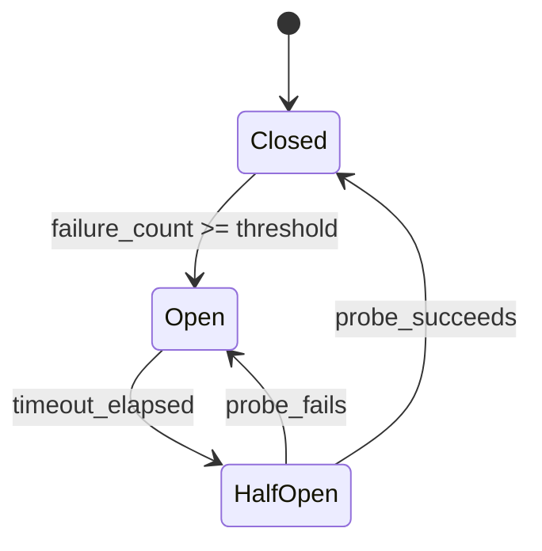

# Error Handling and Recovery

Agentic systems have more failure modes than traditional software. In addition to the usual network errors, timeouts, and crashes, you must handle LLM-specific failures: rate limits, context window overflow, malformed tool calls, and hallucinated outputs. This page covers the patterns that make agents resilient.

---

## Error Taxonomy

Before designing recovery strategies, categorize the errors your system will encounter.

| Category | Examples | Retryable | Recovery Strategy |
|----------|----------|-----------|------------------|
| **Transient** | Network timeout, 503, connection reset | Yes | Retry with backoff |
| **Rate limit** | 429 from LLM API | Yes (after delay) | Backoff + queue throttling |
| **Context overflow** | Prompt exceeds max tokens | No (as-is) | Truncate, summarize, or split |
| **Malformed output** | LLM returns invalid JSON, wrong tool name | Partial | Re-prompt with correction |
| **Hallucination** | LLM invents a tool, fabricates data | No | Validation + re-prompt |
| **Tool failure** | External API down, permission denied | Depends | Fallback tool or skip |
| **Budget exceeded** | Cost or token budget exhausted | No | Graceful termination |
| **Poisoned input** | Prompt injection, adversarial input | No | Reject + log |

---

## Retry Strategies

### Exponential Backoff with Jitter

The standard pattern for transient failures. Exponential backoff prevents thundering herd; jitter prevents synchronized retries from multiple workers.

```python
import asyncio
import random
from functools import wraps

def retry_with_backoff(
    max_retries: int = 3,
    base_delay: float = 1.0,
    max_delay: float = 60.0,
    jitter: bool = True,
    retryable_exceptions: tuple = (TimeoutError, ConnectionError),
):
    """Decorator for retrying async functions with exponential backoff."""
    def decorator(func):
        @wraps(func)
        async def wrapper(*args, **kwargs):
            last_exception = None
            for attempt in range(max_retries + 1):
                try:
                    return await func(*args, **kwargs)
                except retryable_exceptions as e:
                    last_exception = e
                    if attempt == max_retries:
                        break

                    delay = min(base_delay * (2 ** attempt), max_delay)
                    if jitter:
                        delay = delay * (0.5 + random.random())

                    await asyncio.sleep(delay)

            raise MaxRetriesExceededError(
                f"Failed after {max_retries + 1} attempts: {last_exception}"
            ) from last_exception
        return wrapper
    return decorator


# Usage
class LLMClient:
    @retry_with_backoff(
        max_retries=3,
        base_delay=1.0,
        retryable_exceptions=(TimeoutError, RateLimitError, ServerError),
    )
    async def generate(self, prompt: str, **kwargs) -> str:
        return await self._provider.complete(prompt, **kwargs)
```

### Rate-Limit-Aware Retry

LLM APIs return `Retry-After` headers when rate-limited. Respect these rather than using a generic backoff.

```python
class RateLimitAwareClient:
    async def generate(self, prompt: str, **kwargs) -> str:
        for attempt in range(5):
            try:
                return await self._provider.complete(prompt, **kwargs)
            except RateLimitError as e:
                retry_after = e.retry_after_seconds or (2 ** attempt)
                await asyncio.sleep(retry_after + random.uniform(0, 1))

        raise RateLimitExhaustedError("Rate limit not recovered after 5 attempts")
```

:::tip
Always extract the `Retry-After` header (or equivalent) from 429 responses. Blindly retrying with exponential backoff can be either too aggressive (still rate-limited) or too conservative (waiting longer than necessary).
:::

---

## Fallback Strategies

When the primary approach fails, fall back to a less capable but more reliable alternative.

### Fallback Chain

```python
class FallbackChain:
    """Try a series of strategies until one succeeds."""

    def __init__(self, strategies: list):
        self.strategies = strategies

    async def execute(self, *args, **kwargs):
        errors = []
        for i, strategy in enumerate(self.strategies):
            try:
                result = await strategy.execute(*args, **kwargs)
                if i > 0:
                    # Log that we used a fallback
                    logger.warning(
                        f"Used fallback strategy {i}: {strategy.__class__.__name__}",
                        extra={"primary_errors": [str(e) for e in errors]},
                    )
                return result
            except Exception as e:
                errors.append(e)
                continue

        raise AllFallbacksExhaustedError(
            f"All {len(self.strategies)} strategies failed",
            errors=errors,
        )


# Example: LLM fallback chain
llm_fallback = FallbackChain([
    GPT4oStrategy(),           # Primary: most capable
    Claude35SonnetStrategy(),  # Fallback 1: different provider
    GPT4oMiniStrategy(),       # Fallback 2: cheaper, faster
    CachedResponseStrategy(),  # Fallback 3: return a cached similar response
    TemplateStrategy(),        # Fallback 4: rule-based template
])
```

### Tool Fallback

```python
class ToolFallbackExecutor:
    def __init__(self, primary_tools: dict, fallback_tools: dict):
        self.primary = primary_tools
        self.fallback = fallback_tools

    async def execute(self, tool_name: str, params: dict) -> dict:
        # Try primary tool
        try:
            return await self.primary[tool_name].run(params)
        except ToolExecutionError as e:
            logger.warning(f"Primary tool '{tool_name}' failed: {e}")

        # Try fallback tool (e.g., cached version, alternative API)
        if tool_name in self.fallback:
            try:
                return await self.fallback[tool_name].run(params)
            except ToolExecutionError:
                pass

        # Return a structured error that the agent can reason about
        return {
            "error": True,
            "message": f"Tool '{tool_name}' is currently unavailable.",
            "suggestion": "Try an alternative approach or skip this step.",
        }
```

---

## Dead-Letter Queues

When a task exhausts all retries, do not drop it silently. Route it to a dead-letter queue (DLQ) for investigation and potential manual replay.

```python
class DeadLetterHandler:
    def __init__(self, dlq_store, alerter):
        self.dlq = dlq_store
        self.alerter = alerter

    async def handle_failed_task(self, task, error, attempt_count: int):
        """Route a permanently failed task to the dead-letter queue."""
        dlq_entry = {
            "task_id": task.task_id,
            "session_id": task.session_id,
            "payload": task.payload,
            "error_type": type(error).__name__,
            "error_message": str(error),
            "attempt_count": attempt_count,
            "failed_at": datetime.utcnow().isoformat(),
            "stack_trace": traceback.format_exc(),
        }

        await self.dlq.put(dlq_entry)

        # Alert the on-call team
        await self.alerter.send(
            severity="warning",
            title=f"Agent task sent to DLQ: {task.task_id}",
            details=dlq_entry,
        )

    async def replay(self, task_id: str):
        """Replay a task from the DLQ (after fixing the root cause)."""
        entry = await self.dlq.get(task_id)
        if entry is None:
            raise TaskNotFoundError(task_id)

        task = AgentTask.from_dict(entry["payload"])
        await self.dispatcher.submit(task)
        await self.dlq.mark_replayed(task_id)
```

:::info
Dead-letter queues are non-negotiable in production. Without them, failed tasks disappear, and you lose visibility into systematic issues (e.g., a tool that started failing for all requests).
:::

---

## Circuit Breakers

A circuit breaker prevents an agent from repeatedly calling a failing service, which wastes time and can worsen the downstream failure.

### State Machine



### Implementation

```python
import time
from enum import Enum

class CircuitState(Enum):
    CLOSED = "closed"      # Normal operation
    OPEN = "open"          # Failing; reject calls immediately
    HALF_OPEN = "half_open"  # Testing if the service recovered

class CircuitBreaker:
    def __init__(
        self,
        failure_threshold: int = 5,
        recovery_timeout: float = 30.0,
        half_open_max_calls: int = 1,
    ):
        self.failure_threshold = failure_threshold
        self.recovery_timeout = recovery_timeout
        self.half_open_max_calls = half_open_max_calls

        self.state = CircuitState.CLOSED
        self.failure_count = 0
        self.last_failure_time = 0.0
        self.half_open_calls = 0

    async def call(self, func, *args, **kwargs):
        """Execute a function through the circuit breaker."""
        if self.state == CircuitState.OPEN:
            if time.time() - self.last_failure_time > self.recovery_timeout:
                self.state = CircuitState.HALF_OPEN
                self.half_open_calls = 0
            else:
                raise CircuitOpenError(
                    f"Circuit is open. Retry after {self.recovery_timeout}s."
                )

        if self.state == CircuitState.HALF_OPEN:
            if self.half_open_calls >= self.half_open_max_calls:
                raise CircuitOpenError("Circuit is half-open; max probe calls reached.")
            self.half_open_calls += 1

        try:
            result = await func(*args, **kwargs)
            self._on_success()
            return result
        except Exception as e:
            self._on_failure()
            raise

    def _on_success(self):
        if self.state == CircuitState.HALF_OPEN:
            self.state = CircuitState.CLOSED
        self.failure_count = 0

    def _on_failure(self):
        self.failure_count += 1
        self.last_failure_time = time.time()
        if self.failure_count >= self.failure_threshold:
            self.state = CircuitState.OPEN


# Usage: One circuit breaker per external dependency
llm_circuit = CircuitBreaker(failure_threshold=5, recovery_timeout=60)
search_circuit = CircuitBreaker(failure_threshold=3, recovery_timeout=30)

async def safe_llm_call(prompt):
    return await llm_circuit.call(llm_client.generate, prompt)
```

---

## Timeout Management

Every external call needs a timeout. Without explicit timeouts, a hanging LLM call or tool execution can block an agent worker indefinitely.

### Timeout Budget Pattern

```python
class TimeoutBudget:
    """Distribute a total timeout across multiple sequential steps."""

    def __init__(self, total_seconds: float):
        self.total = total_seconds
        self.start_time = time.time()

    @property
    def remaining(self) -> float:
        elapsed = time.time() - self.start_time
        return max(0, self.total - elapsed)

    @property
    def expired(self) -> bool:
        return self.remaining <= 0

    def allocate(self, fraction: float) -> float:
        """Allocate a fraction of the remaining budget."""
        return self.remaining * fraction


# Usage in an agent step
async def execute_agent_step(step, budget: TimeoutBudget):
    if budget.expired:
        raise TimeoutBudgetExhaustedError("No time remaining for this step")

    # Allocate 60% of remaining budget to LLM, 40% to tool execution
    llm_timeout = budget.allocate(0.6)
    tool_timeout = budget.allocate(0.4)

    reasoning = await asyncio.wait_for(
        llm_client.generate(step.prompt),
        timeout=llm_timeout,
    )

    result = await asyncio.wait_for(
        tool_executor.execute(step.tool, step.params),
        timeout=tool_timeout,
    )

    return reasoning, result
```

### Recommended Timeouts

| Operation | Timeout | Rationale |
|-----------|---------|-----------|
| LLM generation (simple) | 15s | Most calls complete in 2-10s |
| LLM generation (complex, long output) | 60s | Long reasoning chains or code generation |
| Tool execution (API call) | 10s | External APIs should respond quickly |
| Tool execution (code sandbox) | 30s | Code execution can be slow |
| Tool execution (database query) | 5s | Queries should be optimized |
| End-to-end agent task | 120s | Total budget for a multi-step task |
| Human approval wait | 24h | Long-running workflows |

---

## LLM-Specific Errors

### Rate Limit Handling

```python
class AdaptiveRateLimiter:
    """Adjust request rate based on API feedback."""

    def __init__(self, initial_rpm: int = 60):
        self.target_rpm = initial_rpm
        self.current_rpm = initial_rpm
        self.semaphore = asyncio.Semaphore(initial_rpm)
        self._consecutive_429s = 0

    async def acquire(self):
        await self.semaphore.acquire()

    def release(self):
        self.semaphore.release()

    def on_success(self):
        self._consecutive_429s = 0
        # Slowly ramp back up
        if self.current_rpm < self.target_rpm:
            self.current_rpm = min(self.current_rpm + 1, self.target_rpm)

    def on_rate_limit(self):
        self._consecutive_429s += 1
        # Halve the rate on rate limit
        self.current_rpm = max(1, self.current_rpm // 2)
```

### Context Window Overflow

When the prompt exceeds the model's context window, the system must reduce the input size.

```python
class ContextOverflowHandler:
    def __init__(self, tokenizer, max_context: int):
        self.tokenizer = tokenizer
        self.max_context = max_context

    async def handle_overflow(self, messages: list[dict], system_prompt: str) -> list[dict]:
        """Reduce message list to fit within context window."""
        total_tokens = self._count_tokens(messages, system_prompt)

        if total_tokens <= self.max_context:
            return messages

        # Strategy 1: Remove old messages (keep system + last N turns)
        reduced = self._truncate_history(messages, system_prompt)
        if self._count_tokens(reduced, system_prompt) <= self.max_context:
            return reduced

        # Strategy 2: Summarize old messages
        summary = await self._summarize(messages[:-4])  # Summarize all but last 2 turns
        summarized = [
            {"role": "system", "content": f"Previous conversation summary: {summary}"}
        ] + messages[-4:]
        if self._count_tokens(summarized, system_prompt) <= self.max_context:
            return summarized

        # Strategy 3: Truncate individual messages
        return self._truncate_messages(messages[-4:], system_prompt)
```

### Hallucination Detection

LLMs sometimes hallucinate tool names, parameter values, or factual claims. Detect and handle these before they propagate.

```python
class HallucinationDetector:
    def __init__(self, tool_registry, fact_checker=None):
        self.tool_registry = tool_registry
        self.fact_checker = fact_checker

    def check_tool_call(self, tool_name: str, parameters: dict) -> list[str]:
        """Detect hallucinated tool calls."""
        issues = []

        # Check if the tool exists
        if not self.tool_registry.exists(tool_name):
            issues.append(f"Hallucinated tool: '{tool_name}' does not exist")
            # Suggest closest match
            closest = self.tool_registry.find_closest(tool_name)
            if closest:
                issues.append(f"Did you mean '{closest}'?")
            return issues

        # Check if parameters match the schema
        tool = self.tool_registry.resolve(tool_name)
        schema_errors = self._validate_params(tool, parameters)
        if schema_errors:
            issues.extend(schema_errors)

        return issues

    async def check_factual_claims(self, response: str, sources: list[str]) -> dict:
        """Check if the response is grounded in the provided sources."""
        if not self.fact_checker:
            return {"grounded": True, "confidence": 0.0}

        return await self.fact_checker.verify(
            claim=response,
            evidence=sources,
        )
```

:::warning
Hallucination detection is not foolproof. Treat it as a safety net, not a guarantee. For high-stakes actions (sending emails, modifying data, making payments), always require explicit validation or human approval regardless of hallucination checks.
:::

---

## Error Recovery in Agent Loops

Putting it all together: how does an agent loop handle errors gracefully?

```python
class ResilientAgentLoop:
    def __init__(self, llm, tools, memory, config):
        self.llm = llm
        self.tools = tools
        self.memory = memory
        self.max_steps = config.max_steps
        self.max_consecutive_errors = config.max_consecutive_errors

    async def run(self, task: str) -> str:
        consecutive_errors = 0

        for step in range(self.max_steps):
            try:
                # Get LLM decision
                action = await self._get_action(task)

                if action.type == "final_answer":
                    return action.content

                # Validate tool call
                issues = self.hallucination_detector.check_tool_call(
                    action.tool_name, action.parameters
                )
                if issues:
                    # Feed issues back to the LLM for self-correction
                    self.memory.add_system_message(
                        f"Your tool call had issues: {issues}. Please correct."
                    )
                    consecutive_errors += 1
                    continue

                # Execute tool
                result = await self._execute_tool_safely(
                    action.tool_name, action.parameters
                )
                self.memory.add_tool_result(action.tool_name, result)
                consecutive_errors = 0  # Reset on success

            except (TimeoutError, RateLimitError) as e:
                consecutive_errors += 1
                self.memory.add_system_message(
                    f"Step {step} encountered a transient error: {e}. Retrying."
                )

            except BudgetExceededError:
                return self._generate_partial_response(
                    "Budget exceeded. Returning partial results."
                )

            if consecutive_errors >= self.max_consecutive_errors:
                return self._generate_partial_response(
                    f"Stopping after {consecutive_errors} consecutive errors."
                )

        return self._generate_partial_response("Maximum steps reached.")
```

---

## Interview Preparation

**Sample question:** "How would you handle a scenario where your agent's primary LLM provider goes down mid-conversation?"

**Strong answer structure:**
1. **Circuit breaker** detects the failure after N consecutive errors and opens the circuit
2. **Fallback chain** routes to a secondary provider (or smaller local model)
3. **Checkpoint recovery** -- the agent's state was checkpointed after each step; the fallback provider resumes from the last checkpoint
4. **Graceful degradation** -- if no fallback is available, return a cached or templated response and queue the task for later
5. **Dead-letter queue** -- if the task cannot be completed, route it to the DLQ with full context for manual retry
6. **Observability** -- emit metrics on provider failover rate, alert on-call if DLQ depth exceeds threshold
