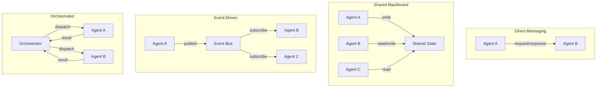
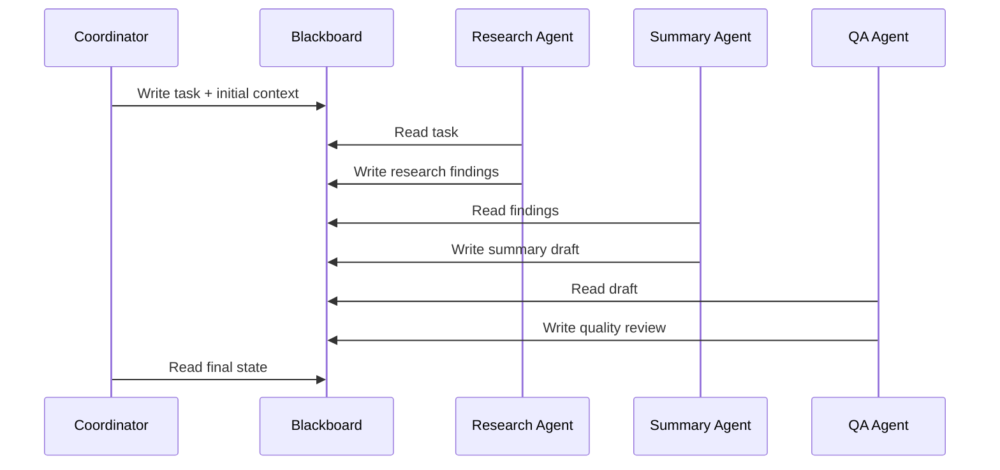
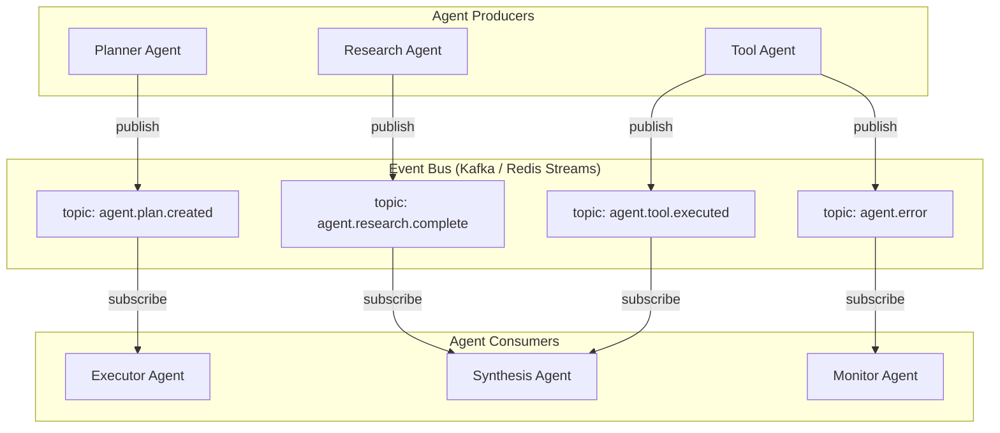
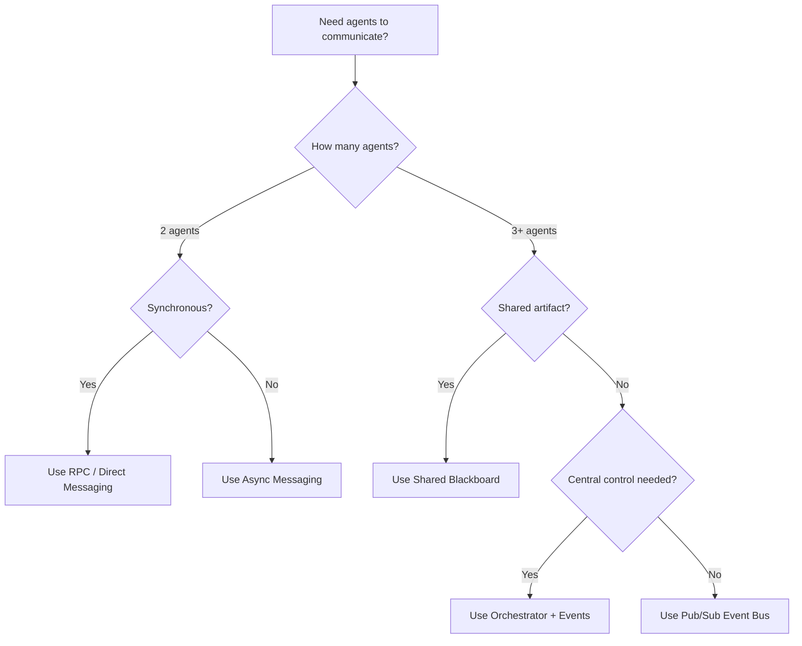

# Multi-Agent Communication

When a system has more than one agent, the agents need to talk to each other. The communication pattern you choose -- direct messaging, shared blackboard, event bus, or RPC -- shapes everything from latency to fault tolerance to debuggability. This page covers the core patterns, their trade-offs, and how to choose between them.

---

## Communication Patterns Overview



---

## Message Passing Patterns

### Request-Response (Synchronous)

The simplest pattern. One agent sends a request to another and waits for a response.

```python
from dataclasses import dataclass, field
from datetime import datetime
import uuid

@dataclass
class AgentMessage:
    sender: str
    recipient: str
    content: dict
    message_id: str = field(default_factory=lambda: str(uuid.uuid4()))
    correlation_id: str | None = None  # Links request to response
    timestamp: datetime = field(default_factory=datetime.utcnow)
    message_type: str = "request"  # "request", "response", "event", "error"
    ttl_seconds: int = 60

class DirectMessaging:
    def __init__(self, transport):
        self.transport = transport
        self._pending: dict[str, asyncio.Future] = {}

    async def send_and_wait(
        self,
        sender: str,
        recipient: str,
        content: dict,
        timeout: float = 30.0,
    ) -> AgentMessage:
        """Send a message and wait for the response."""
        msg = AgentMessage(
            sender=sender,
            recipient=recipient,
            content=content,
            message_type="request",
        )

        future = asyncio.get_event_loop().create_future()
        self._pending[msg.message_id] = future

        await self.transport.send(recipient, msg)

        try:
            response = await asyncio.wait_for(future, timeout=timeout)
            return response
        except asyncio.TimeoutError:
            del self._pending[msg.message_id]
            raise AgentCommunicationTimeout(
                f"No response from {recipient} within {timeout}s"
            )

    async def handle_incoming(self, msg: AgentMessage):
        """Process an incoming message (could be a response to a pending request)."""
        if msg.correlation_id and msg.correlation_id in self._pending:
            self._pending[msg.correlation_id].set_result(msg)
            del self._pending[msg.correlation_id]
```

**When to use:** Simple two-agent handoffs, delegation chains, when the caller needs the result before proceeding.

**Trade-offs:** Tight coupling between agents. If Agent B is slow, Agent A blocks. Not suitable for fan-out patterns.

### Fire-and-Forget (Asynchronous)

The sender publishes a message and continues without waiting for a response.

```python
class AsyncMessaging:
    async def send(self, sender: str, recipient: str, content: dict):
        """Send a message without waiting for a response."""
        msg = AgentMessage(
            sender=sender,
            recipient=recipient,
            content=content,
            message_type="event",
        )
        await self.transport.send(recipient, msg)
        # No waiting -- the sender moves on immediately

    async def send_with_callback(
        self,
        sender: str,
        recipient: str,
        content: dict,
        callback_queue: str,
    ):
        """Send a message with a callback queue for eventual response."""
        msg = AgentMessage(
            sender=sender,
            recipient=recipient,
            content={**content, "_callback_queue": callback_queue},
            message_type="request",
        )
        await self.transport.send(recipient, msg)
```

**When to use:** Notifications, logging, triggering background work, fan-out to multiple agents.

---

## Shared Blackboard

The blackboard pattern uses a shared data store that all agents can read from and write to. Agents observe the blackboard, decide if they can contribute, and write their results back.



### Implementation

```python
from datetime import datetime
from typing import Any
import asyncio

class Blackboard:
    """Shared state that all agents can read and write."""

    def __init__(self, store):
        self.store = store
        self._subscribers: dict[str, list[callable]] = {}

    async def write(self, key: str, value: Any, author: str):
        """Write a value to the blackboard and notify subscribers."""
        entry = {
            "value": value,
            "author": author,
            "timestamp": datetime.utcnow().isoformat(),
            "version": await self._increment_version(key),
        }
        await self.store.set(key, entry)

        # Notify any agents watching this key
        for callback in self._subscribers.get(key, []):
            await callback(key, entry)

    async def read(self, key: str) -> Any:
        """Read the current value for a key."""
        entry = await self.store.get(key)
        return entry["value"] if entry else None

    async def read_section(self, prefix: str) -> dict[str, Any]:
        """Read all entries under a key prefix."""
        entries = await self.store.scan(prefix)
        return {k: v["value"] for k, v in entries.items()}

    def subscribe(self, key: str, callback):
        """Subscribe to changes on a specific key."""
        if key not in self._subscribers:
            self._subscribers[key] = []
        self._subscribers[key].append(callback)

    async def wait_for(self, key: str, timeout: float = 60.0) -> Any:
        """Block until a key is written, then return its value."""
        event = asyncio.Event()
        result = {}

        async def on_write(k, entry):
            result["value"] = entry["value"]
            event.set()

        self.subscribe(key, on_write)
        await asyncio.wait_for(event.wait(), timeout=timeout)
        return result["value"]
```

**When to use:** Multi-agent collaboration on a shared artifact (document, analysis, plan). Works well when agents contribute different aspects of a solution.

**Trade-offs:** Requires conflict resolution for concurrent writes. Harder to trace causality (who changed what and why). Can become a bottleneck under high write contention.

:::info
The blackboard pattern originated in AI research (Hearsay-II speech recognition system, 1980). It remains one of the most natural patterns for multi-agent collaboration because it decouples agents from each other -- they only need to know about the blackboard, not about each other.
:::

---

## Event-Driven Architecture

Agents communicate by publishing and subscribing to events on a message bus. This fully decouples producers from consumers.

### Event Bus Architecture



### Implementation

```python
from dataclasses import dataclass, field
from datetime import datetime
import json

@dataclass
class AgentEvent:
    event_type: str  # "plan.created", "research.complete", "tool.executed"
    source_agent: str
    session_id: str
    payload: dict
    event_id: str = field(default_factory=lambda: str(uuid.uuid4()))
    timestamp: datetime = field(default_factory=datetime.utcnow)
    metadata: dict = field(default_factory=dict)

class EventBus:
    def __init__(self, broker):
        self.broker = broker  # Kafka, Redis Streams, NATS, etc.
        self._handlers: dict[str, list[callable]] = {}

    async def publish(self, event: AgentEvent):
        """Publish an event to the bus."""
        topic = f"agent.{event.event_type}"
        await self.broker.publish(
            topic=topic,
            message=json.dumps(event.to_dict()),
            key=event.session_id,  # Partition by session for ordering
        )

    async def subscribe(self, event_type: str, handler, group: str = None):
        """Subscribe to events of a given type."""
        topic = f"agent.{event_type}"
        await self.broker.subscribe(
            topic=topic,
            handler=handler,
            consumer_group=group,  # For load balancing across agent instances
        )

    async def subscribe_pattern(self, pattern: str, handler):
        """Subscribe to events matching a pattern (e.g., 'agent.research.*')."""
        await self.broker.subscribe_pattern(pattern, handler)
```

### Event Choreography vs. Orchestration

| Approach | Description | Pros | Cons |
|----------|-------------|------|------|
| **Choreography** | Each agent reacts to events independently | Decoupled, scalable | Hard to trace flow, no central control |
| **Orchestration** | Central coordinator dispatches tasks to agents | Clear flow, easy to trace | Single point of failure, coupling |
| **Hybrid** | Orchestrator for the happy path, events for side effects | Balanced | More complex |

:::tip
For most production multi-agent systems, the **hybrid approach** works best. Use an orchestrator for the main workflow (it is easier to debug and manage), and use events for cross-cutting concerns like logging, monitoring, and notifications.
:::

---

## Pub/Sub Between Agents

When multiple agents need to react to the same event -- for example, a new customer message triggers both a classification agent and a sentiment analysis agent -- pub/sub is the natural pattern.

```python
class MultiAgentPubSub:
    """Pub/Sub pattern for multi-agent fan-out."""

    def __init__(self, event_bus: EventBus):
        self.event_bus = event_bus

    async def fan_out(self, event: AgentEvent, target_agents: list[str]):
        """Publish an event that multiple agents will process."""
        await self.event_bus.publish(event)

    async def fan_in(
        self,
        session_id: str,
        expected_responses: int,
        timeout: float = 60.0,
    ) -> list[AgentEvent]:
        """Wait for multiple agent responses to complete."""
        responses = []
        event = asyncio.Event()

        async def collect(response_event: AgentEvent):
            if response_event.session_id == session_id:
                responses.append(response_event)
                if len(responses) >= expected_responses:
                    event.set()

        await self.event_bus.subscribe("*.complete", collect)

        try:
            await asyncio.wait_for(event.wait(), timeout=timeout)
        except asyncio.TimeoutError:
            pass  # Return whatever we collected

        return responses
```

---

## RPC Between Agents

For tightly coupled agent interactions where one agent needs a specific result from another, RPC (Remote Procedure Call) provides a clean request-response model.

```python
class AgentRPC:
    """RPC interface for inter-agent calls."""

    def __init__(self, transport, registry):
        self.transport = transport
        self.registry = registry  # Maps agent_name -> endpoint

    async def call(
        self,
        caller: str,
        target_agent: str,
        method: str,
        params: dict,
        timeout: float = 30.0,
    ) -> dict:
        """Call a method on a remote agent and wait for the result."""
        endpoint = self.registry.resolve(target_agent)
        request = {
            "jsonrpc": "2.0",
            "method": method,
            "params": params,
            "id": str(uuid.uuid4()),
            "metadata": {
                "caller": caller,
                "timestamp": datetime.utcnow().isoformat(),
            },
        }

        response = await self.transport.request(
            endpoint, request, timeout=timeout
        )

        if "error" in response:
            raise AgentRPCError(
                f"Agent '{target_agent}' returned error: {response['error']}"
            )

        return response["result"]
```

---

## Protocol Design

When agents are built by different teams or in different languages, a well-defined communication protocol is essential.

### Agent Communication Protocol (ACP)

```python
@dataclass
class AgentProtocolMessage:
    """Standard message format for inter-agent communication."""

    # Envelope
    protocol_version: str = "1.0"
    message_id: str = field(default_factory=lambda: str(uuid.uuid4()))
    correlation_id: str | None = None
    timestamp: str = field(default_factory=lambda: datetime.utcnow().isoformat())

    # Routing
    source: str = ""       # "agent:research-agent:instance-3"
    destination: str = ""  # "agent:synthesis-agent" or "broadcast:*"

    # Payload
    message_type: str = ""  # "task", "result", "error", "heartbeat", "control"
    content_type: str = "application/json"
    payload: dict = field(default_factory=dict)

    # Quality of Service
    priority: int = 1       # 0 = highest, 9 = lowest
    ttl_seconds: int = 300
    require_ack: bool = True

    # Tracing
    trace_id: str = ""
    span_id: str = ""
    parent_span_id: str = ""
```

### Message Type Taxonomy

| Type | Purpose | Response Expected |
|------|---------|------------------|
| `task` | Assign work to an agent | Yes (result or error) |
| `result` | Return completed work | No (but may trigger downstream) |
| `error` | Report a failure | No |
| `heartbeat` | Liveness signal | No |
| `control` | Start, stop, reconfigure | Yes (ack) |
| `query` | Request information without side effects | Yes |

---

## Serialization Formats

The choice of serialization format affects performance, debuggability, and cross-language compatibility.

| Format | Size | Speed | Human-Readable | Schema Support | Cross-Language |
|--------|------|-------|----------------|----------------|---------------|
| **JSON** | Large | Moderate | Yes | JSON Schema | Excellent |
| **Protocol Buffers** | Small | Fast | No | Built-in | Excellent |
| **MessagePack** | Small | Fast | No | External | Good |
| **Avro** | Small | Fast | No | Built-in (schema registry) | Good |
| **CBOR** | Small | Fast | No | CDDL | Good |

:::warning
For inter-agent communication, avoid Python-specific serialization (pickle, marshal). Multi-agent systems often evolve into polyglot environments where some agents are in Python, others in TypeScript or Go. Use a language-neutral format from the start.
:::

### Recommendation

- **Development and debugging:** JSON. Readable in logs, easy to inspect.
- **High-throughput production:** Protocol Buffers or MessagePack. Smaller payloads, faster serialization.
- **Schema evolution:** Avro with a schema registry. Guarantees backward/forward compatibility.

---

## Conversation Between Agents

When agents have a multi-turn dialogue (e.g., a supervisor agent and a worker agent iterating on a solution), structure the conversation with clear roles and turn management.

```python
class AgentConversation:
    """Manages a structured conversation between two agents."""

    def __init__(self, agent_a, agent_b, max_turns: int = 10):
        self.agent_a = agent_a
        self.agent_b = agent_b
        self.max_turns = max_turns
        self.transcript: list[AgentMessage] = []

    async def run(self, initial_message: str) -> list[AgentMessage]:
        """Run a conversation until completion or max turns."""
        current_message = initial_message
        current_speaker = self.agent_a

        for turn in range(self.max_turns):
            response = await current_speaker.respond(
                message=current_message,
                conversation_history=self.transcript,
            )

            self.transcript.append(AgentMessage(
                sender=current_speaker.name,
                recipient=self._other(current_speaker).name,
                content={"text": response.text, "metadata": response.metadata},
                message_type="response",
            ))

            # Check for conversation termination
            if response.metadata.get("conversation_complete"):
                break

            current_message = response.text
            current_speaker = self._other(current_speaker)

        return self.transcript

    def _other(self, agent):
        return self.agent_b if agent == self.agent_a else self.agent_a
```

---

## Pattern Selection Guide



---

## Interview Preparation

**Sample question:** "How would you design communication between a supervisor agent and 5 worker agents that collaborate on a research task?"

**Strong answer structure:**
1. **Orchestrator pattern** for the main flow -- supervisor assigns sub-tasks via a task queue
2. **Shared blackboard** for the research artifact -- each worker writes findings to a shared store
3. **Event bus** for progress and status -- workers publish progress events; supervisor subscribes
4. **Request-response** for synchronous decisions -- supervisor asks a worker to clarify a finding
5. **Protocol** with correlation IDs and trace context for end-to-end observability
6. **Fan-out / fan-in** for parallel research -- supervisor dispatches to all workers, collects results with a timeout
