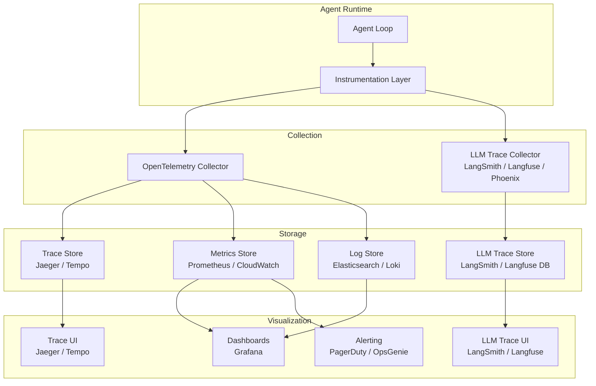
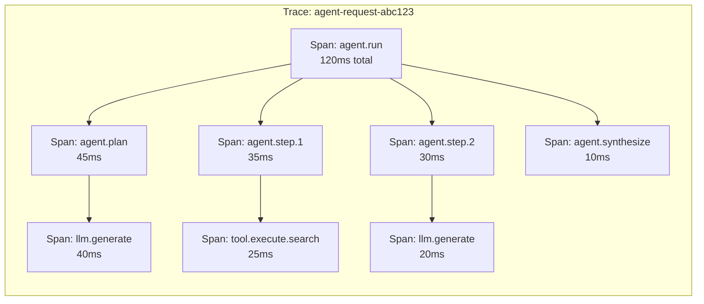
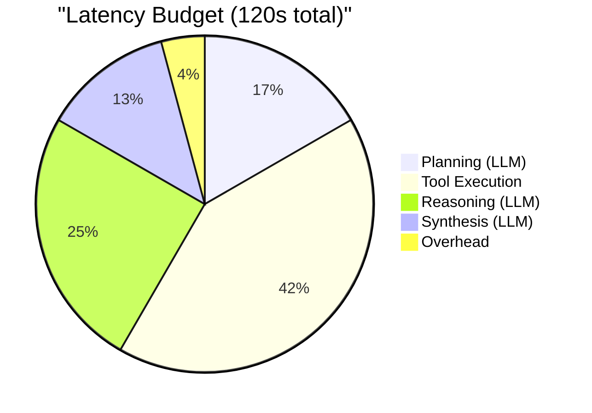

# Observability and Tracing

Agentic systems are non-deterministic. The same input can produce different reasoning chains, tool calls, and outputs on every run. Without deep observability, you are flying blind -- unable to debug failures, optimize costs, or improve quality. This page covers the observability stack purpose-built for agentic AI.

---

## Why Agent Observability Is Different

Traditional APM (Application Performance Monitoring) tracks request latency, error rates, and throughput. Agent observability must additionally track:

- **Reasoning quality** -- did the agent make good decisions?
- **Token economics** -- how many tokens were consumed and at what cost?
- **Tool effectiveness** -- which tools were called, and did they return useful results?
- **Multi-step causality** -- what chain of reasoning led to the final output?
- **Non-determinism** -- why did the same input produce a different output this time?

---

## Observability Architecture



---

## LLM Tracing

LLM-specific tracing captures the full prompt-completion lifecycle: what was sent to the model, what came back, how long it took, and how much it cost.

### Key Platforms

| Platform | Self-Hosted | Cloud | Open Source | Key Strength |
|----------|-----------|-------|-------------|-------------|
| **LangSmith** | No | Yes | No | Deep LangChain integration |
| **Langfuse** | Yes | Yes | Yes | Open source, self-hostable |
| **Arize Phoenix** | Yes | Yes | Yes | Evaluation and embeddings analysis |
| **OpenLLMetry** | Yes | No | Yes | OpenTelemetry-native |
| **Helicone** | No | Yes | Partial | Cost tracking focus |

### Instrumenting LLM Calls

```python
from opentelemetry import trace
from opentelemetry.trace import StatusCode
import time

tracer = trace.get_tracer("agent.llm")

class InstrumentedLLMClient:
    def __init__(self, client, cost_tracker):
        self.client = client
        self.cost_tracker = cost_tracker

    async def generate(self, prompt: str, model: str = "gpt-4o", **kwargs) -> str:
        with tracer.start_as_current_span("llm.generate") as span:
            span.set_attribute("llm.model", model)
            span.set_attribute("llm.prompt_length", len(prompt))
            span.set_attribute("llm.temperature", kwargs.get("temperature", 1.0))

            start = time.monotonic()
            try:
                response = await self.client.complete(
                    prompt=prompt, model=model, **kwargs
                )

                # Record metrics
                duration = time.monotonic() - start
                span.set_attribute("llm.completion_length", len(response.text))
                span.set_attribute("llm.prompt_tokens", response.usage.prompt_tokens)
                span.set_attribute("llm.completion_tokens", response.usage.completion_tokens)
                span.set_attribute("llm.total_tokens", response.usage.total_tokens)
                span.set_attribute("llm.duration_seconds", duration)
                span.set_attribute("llm.cost_usd", self._compute_cost(model, response.usage))

                # Track cost
                await self.cost_tracker.record(
                    model=model,
                    prompt_tokens=response.usage.prompt_tokens,
                    completion_tokens=response.usage.completion_tokens,
                )

                span.set_status(StatusCode.OK)
                return response.text

            except Exception as e:
                span.set_status(StatusCode.ERROR, str(e))
                span.record_exception(e)
                raise

    def _compute_cost(self, model: str, usage) -> float:
        pricing = {
            "gpt-4o": {"input": 2.50 / 1_000_000, "output": 10.00 / 1_000_000},
            "gpt-4o-mini": {"input": 0.15 / 1_000_000, "output": 0.60 / 1_000_000},
            "claude-sonnet-4-20250514": {"input": 3.00 / 1_000_000, "output": 15.00 / 1_000_000},
        }
        rates = pricing.get(model, {"input": 0, "output": 0})
        return (usage.prompt_tokens * rates["input"]) + (usage.completion_tokens * rates["output"])
```

---

## Distributed Tracing with OpenTelemetry

OpenTelemetry (OTel) provides a vendor-neutral standard for distributed tracing. For agentic systems, each agent step becomes a span within a trace.

### Trace Structure for an Agent



### Agent-Specific Span Attributes

```python
# Standard attributes to set on every agent span
AGENT_SPAN_ATTRIBUTES = {
    # Identity
    "agent.name": "research-agent",
    "agent.version": "2.1.0",
    "agent.session_id": "sess-abc123",

    # Step context
    "agent.step.number": 3,
    "agent.step.type": "tool_execution",  # "planning", "reasoning", "tool_execution", "synthesis"
    "agent.step.tool_name": "web_search",

    # LLM context
    "llm.model": "gpt-4o",
    "llm.prompt_tokens": 1500,
    "llm.completion_tokens": 350,
    "llm.total_cost_usd": 0.0073,

    # Performance
    "agent.total_steps": 5,
    "agent.total_tool_calls": 3,
    "agent.total_tokens": 8500,
    "agent.total_cost_usd": 0.034,
}
```

### Setting Up OpenTelemetry

```python
from opentelemetry import trace
from opentelemetry.sdk.trace import TracerProvider
from opentelemetry.sdk.trace.export import BatchSpanProcessor
from opentelemetry.exporter.otlp.proto.grpc.trace_exporter import OTLPSpanExporter
from opentelemetry.sdk.resources import Resource

def setup_tracing(service_name: str, otlp_endpoint: str):
    resource = Resource.create({"service.name": service_name})
    provider = TracerProvider(resource=resource)

    exporter = OTLPSpanExporter(endpoint=otlp_endpoint)
    processor = BatchSpanProcessor(exporter)
    provider.add_span_processor(processor)

    trace.set_tracer_provider(provider)
    return trace.get_tracer(service_name)

# Initialize once at startup
tracer = setup_tracing("agent-service", "http://otel-collector:4317")
```

---

## Cost Tracking

LLM costs can spike unexpectedly. A runaway agent loop, an unoptimized prompt, or a sudden traffic increase can burn through budgets in minutes.

### Cost Tracking System

```python
from dataclasses import dataclass
from datetime import datetime

@dataclass
class CostRecord:
    session_id: str
    user_id: str
    model: str
    prompt_tokens: int
    completion_tokens: int
    cost_usd: float
    timestamp: datetime

class CostTracker:
    def __init__(self, store, budget_config):
        self.store = store
        self.budget = budget_config

    async def record(self, session_id: str, user_id: str, model: str,
                     prompt_tokens: int, completion_tokens: int):
        cost = self._compute_cost(model, prompt_tokens, completion_tokens)
        record = CostRecord(
            session_id=session_id,
            user_id=user_id,
            model=model,
            prompt_tokens=prompt_tokens,
            completion_tokens=completion_tokens,
            cost_usd=cost,
            timestamp=datetime.utcnow(),
        )
        await self.store.append(record)

        # Check budgets
        await self._check_session_budget(session_id, cost)
        await self._check_user_budget(user_id, cost)
        await self._check_global_budget(cost)

    async def _check_session_budget(self, session_id: str, cost: float):
        total = await self.store.sum_cost(session_id=session_id)
        if total > self.budget.max_per_session:
            raise BudgetExceededError(
                f"Session {session_id} exceeded budget: ${total:.4f} > ${self.budget.max_per_session:.4f}"
            )

    async def _check_user_budget(self, user_id: str, cost: float):
        total = await self.store.sum_cost_today(user_id=user_id)
        if total > self.budget.max_per_user_per_day:
            raise BudgetExceededError(
                f"User {user_id} exceeded daily budget: ${total:.2f}"
            )
```

### Cost Dashboard Metrics

| Metric | Granularity | Alert Threshold |
|--------|------------|-----------------|
| Cost per request | Per session | > $0.50 per request |
| Daily cost | Per user, per org | > daily budget |
| Cost per model | Aggregate | Unusual spike |
| Tokens per step | Per agent step | > 4000 tokens per step |
| Cost efficiency | Output quality / cost | Below baseline |

---

## Latency Budgets

Define how long each component of an agent request is allowed to take. This prevents any single component from consuming the entire timeout.

### Budget Allocation



### Implementation

```python
class LatencyBudget:
    """Track and enforce latency budgets across agent steps."""

    def __init__(self, total_budget_ms: float):
        self.total_budget = total_budget_ms
        self.allocations: dict[str, float] = {}
        self.actuals: dict[str, float] = {}
        self.start_time = time.monotonic()

    def allocate(self, component: str, fraction: float):
        self.allocations[component] = self.total_budget * fraction

    def remaining(self, component: str) -> float:
        allocated = self.allocations.get(component, 0)
        used = self.actuals.get(component, 0)
        return max(0, allocated - used)

    def record(self, component: str, duration_ms: float):
        self.actuals[component] = self.actuals.get(component, 0) + duration_ms

        if self.actuals[component] > self.allocations.get(component, float('inf')):
            logger.warning(
                f"Component '{component}' exceeded budget: "
                f"{self.actuals[component]:.0f}ms > {self.allocations[component]:.0f}ms"
            )

    @property
    def total_elapsed(self) -> float:
        return (time.monotonic() - self.start_time) * 1000

    @property
    def total_remaining(self) -> float:
        return max(0, self.total_budget - self.total_elapsed)
```

---

## Metrics to Monitor

### Tier 1: Must-Have (Alert on Anomalies)

| Metric | Description | Alert Condition |
|--------|-------------|-----------------|
| `agent.request.error_rate` | Percentage of requests that fail | > 5% over 5 minutes |
| `agent.request.latency_p99` | 99th percentile end-to-end latency | > 60s |
| `agent.llm.rate_limit_count` | Number of 429 responses | > 10 per minute |
| `agent.cost.hourly_usd` | Hourly LLM spend | > 2x rolling average |
| `agent.dlq.depth` | Number of tasks in dead-letter queue | > 0 (any DLQ entry) |

### Tier 2: Operational (Dashboard)

| Metric | Description |
|--------|-------------|
| `agent.steps_per_request` | Average number of agent steps per request |
| `agent.tokens_per_request` | Total tokens consumed per request |
| `agent.tool.call_count` | Number of tool calls by tool name |
| `agent.tool.error_rate` | Error rate by tool name |
| `agent.fallback.triggered_count` | Number of fallback activations |
| `agent.circuit_breaker.state` | Current state of each circuit breaker |

### Tier 3: Quality (Weekly Review)

| Metric | Description |
|--------|-------------|
| `agent.response.user_rating` | User satisfaction score |
| `agent.response.groundedness` | Factual accuracy of responses |
| `agent.hallucination.detected_count` | Number of detected hallucinations |
| `agent.tool.relevance_score` | How often selected tools were actually used |

---

## Alerting Strategies

### Alert Hierarchy

```python
class AlertManager:
    async def evaluate_alerts(self, metrics: dict):
        # Critical: Page the on-call engineer immediately
        if metrics["error_rate_5m"] > 0.20:
            await self.page(
                severity="critical",
                title="Agent error rate > 20%",
                runbook="https://runbook.internal/agent-high-error-rate",
            )

        # Warning: Send to Slack, investigate within 1 hour
        elif metrics["error_rate_5m"] > 0.05:
            await self.notify_slack(
                channel="#agent-alerts",
                title="Agent error rate > 5%",
                metrics=metrics,
            )

        # Cost alert: Budget protection
        if metrics["hourly_cost_usd"] > self.budget_threshold * 2:
            await self.page(
                severity="critical",
                title=f"Agent cost spike: ${metrics['hourly_cost_usd']:.2f}/hr",
                runbook="https://runbook.internal/agent-cost-spike",
            )
            # Automatic mitigation: reduce concurrency
            await self.reduce_worker_count(factor=0.5)

        # DLQ alert: Any entry means a task permanently failed
        if metrics["dlq_depth"] > 0:
            await self.notify_slack(
                channel="#agent-alerts",
                title=f"DLQ has {metrics['dlq_depth']} entries",
            )
```

:::warning
Alert fatigue kills observability. Start with a small set of high-signal alerts (error rate, cost spikes, DLQ depth). Add more only when you have a clear action for each alert. An alert without a runbook is noise.
:::

---

## Debugging Agent Failures

### The Agent Debugging Workflow

1. **Find the trace** -- use the session ID or request ID to locate the trace in your trace UI
2. **Identify the failing span** -- which step failed? LLM call? Tool execution? Validation?
3. **Inspect the prompt** -- was the LLM given correct context? Was the tool schema included?
4. **Check the LLM output** -- did the model hallucinate? Return malformed JSON? Refuse the request?
5. **Review tool results** -- did the tool return an error? Was the result what the agent expected?
6. **Compare with successful runs** -- find a similar successful request and diff the traces

### Structured Logging for Agents

```python
import structlog

logger = structlog.get_logger()

class ObservableAgentLoop:
    async def run_step(self, step_number: int, context: dict):
        log = logger.bind(
            session_id=context["session_id"],
            step_number=step_number,
            agent_name=self.name,
        )

        log.info("agent.step.start", step_type="reasoning")

        try:
            action = await self.llm.generate(context["prompt"])
            log.info(
                "agent.step.llm_complete",
                model=action.model,
                tokens=action.total_tokens,
                cost_usd=action.cost,
                action_type=action.type,
            )

            if action.type == "tool_call":
                log.info(
                    "agent.step.tool_call",
                    tool_name=action.tool_name,
                    parameters=action.parameters,
                )
                result = await self.tool_executor.execute(action.tool_name, action.parameters)
                log.info(
                    "agent.step.tool_result",
                    tool_name=action.tool_name,
                    success=not result.get("error"),
                    result_size=len(str(result)),
                )

        except Exception as e:
            log.error(
                "agent.step.error",
                error_type=type(e).__name__,
                error_message=str(e),
                exc_info=True,
            )
            raise
```

---

## Interview Preparation

**Sample question:** "How would you set up observability for an agentic system processing 10,000 requests per day?"

**Strong answer structure:**
1. **Distributed tracing** with OpenTelemetry -- every agent step is a span with LLM-specific attributes (model, tokens, cost)
2. **LLM tracing** with Langfuse or LangSmith -- capture full prompt-completion pairs for quality debugging
3. **Cost tracking** at session, user, and org level -- with budget enforcement and alerts
4. **Structured logging** with session IDs for correlation -- use structlog or equivalent
5. **Metrics pipeline** (Prometheus + Grafana) -- error rate, latency, cost, DLQ depth
6. **Alerting hierarchy** -- critical (page), warning (Slack), informational (dashboard)
7. **Latency budgets** -- allocate time across planning, tool execution, and synthesis
8. **Debugging workflow** -- trace ID lookup, span inspection, prompt/completion review, comparison with successful runs
