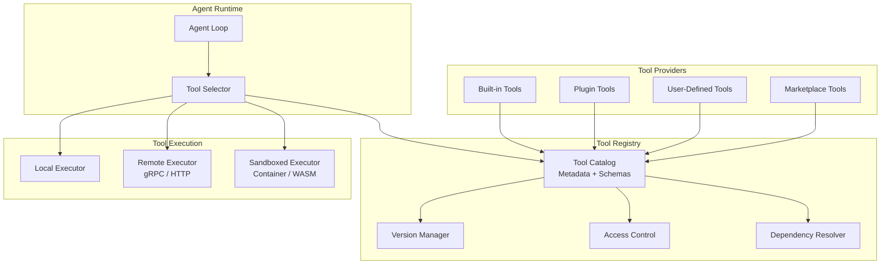
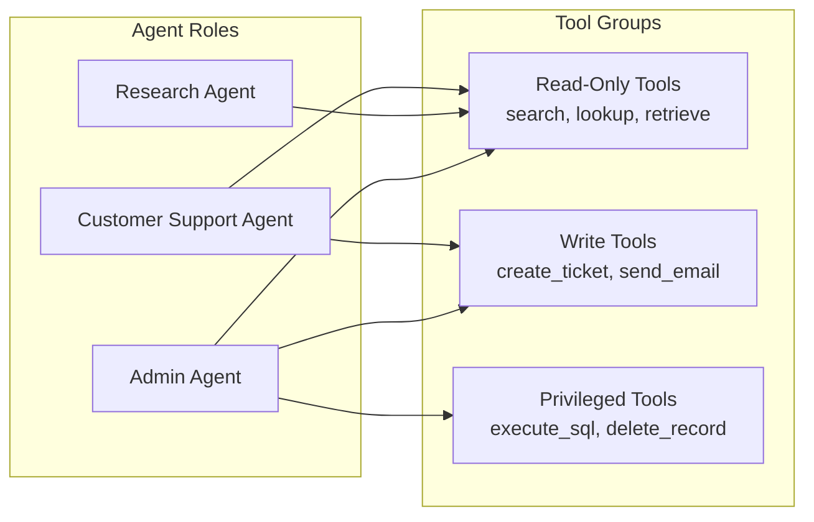
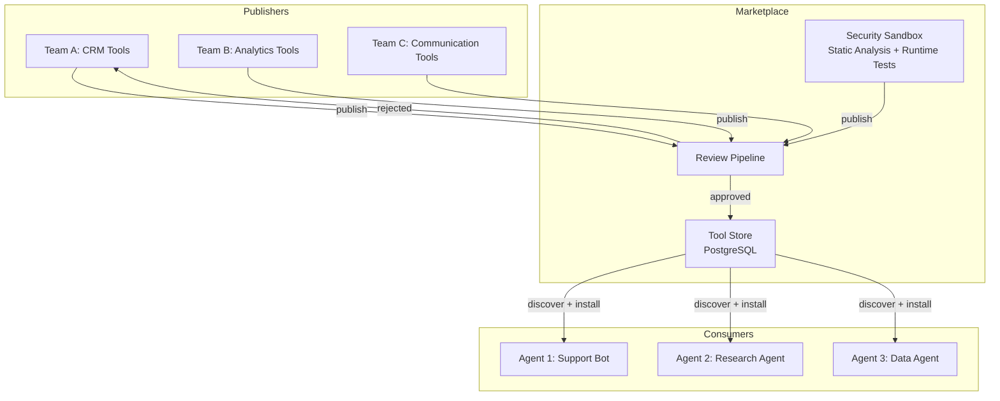

# Tool Registry Design

Tools are what make an agent more than a chatbot. The tool registry is the component that tells the agent what it can do, validates how it calls tools, and manages the lifecycle of tool availability. A well-designed registry is the difference between a brittle prototype and a production system that can safely evolve.

---

## Architecture Overview



---

## Dynamic Tool Discovery

In static systems, the set of available tools is hardcoded. In production, tools must be discoverable at runtime -- registered, deregistered, and updated without redeploying the agent.

### Tool Definition Schema

```python
from dataclasses import dataclass, field
from typing import Any

@dataclass
class ToolParameter:
    name: str
    type: str  # "string", "integer", "boolean", "object", "array"
    description: str
    required: bool = True
    default: Any = None
    enum: list[str] | None = None

@dataclass
class ToolDefinition:
    name: str
    version: str  # Semver: "1.2.3"
    description: str
    parameters: list[ToolParameter]
    returns: dict  # JSON Schema for return type
    category: str  # "search", "code", "data", "communication"
    execution_mode: str  # "local", "remote", "sandboxed"
    timeout_seconds: int = 30
    rate_limit: int | None = None  # Max calls per minute
    requires_approval: bool = False
    tags: list[str] = field(default_factory=list)
    deprecated: bool = False
    deprecation_message: str = ""

    def to_llm_schema(self) -> dict:
        """Convert to the function-calling schema expected by the LLM."""
        properties = {}
        required = []
        for param in self.parameters:
            properties[param.name] = {
                "type": param.type,
                "description": param.description,
            }
            if param.enum:
                properties[param.name]["enum"] = param.enum
            if param.required:
                required.append(param.name)

        return {
            "name": self.name,
            "description": self.description,
            "parameters": {
                "type": "object",
                "properties": properties,
                "required": required,
            },
        }
```

### Registry Implementation

```python
class ToolRegistry:
    def __init__(self):
        self._tools: dict[str, dict[str, ToolDefinition]] = {}  # name -> version -> def
        self._listeners: list[callable] = []

    def register(self, tool: ToolDefinition):
        """Register a tool, replacing any existing version."""
        if tool.name not in self._tools:
            self._tools[tool.name] = {}
        self._tools[tool.name][tool.version] = tool
        self._notify_listeners("registered", tool)

    def deregister(self, name: str, version: str):
        """Remove a specific version of a tool."""
        if name in self._tools:
            self._tools[name].pop(version, None)
            if not self._tools[name]:
                del self._tools[name]
            self._notify_listeners("deregistered", name, version)

    def discover(
        self,
        category: str | None = None,
        tags: list[str] | None = None,
        include_deprecated: bool = False,
    ) -> list[ToolDefinition]:
        """Discover available tools with optional filtering."""
        results = []
        for versions in self._tools.values():
            # Get the latest version of each tool
            latest = self._latest_version(versions)
            if latest.deprecated and not include_deprecated:
                continue
            if category and latest.category != category:
                continue
            if tags and not set(tags).issubset(set(latest.tags)):
                continue
            results.append(latest)
        return results

    def resolve(self, name: str, version: str | None = None) -> ToolDefinition:
        """Resolve a specific tool by name and optional version."""
        if name not in self._tools:
            raise ToolNotFoundError(f"Tool '{name}' not registered")
        versions = self._tools[name]
        if version:
            if version not in versions:
                raise ToolVersionNotFoundError(f"Tool '{name}' version '{version}' not found")
            return versions[version]
        return self._latest_version(versions)

    def _latest_version(self, versions: dict[str, ToolDefinition]) -> ToolDefinition:
        sorted_versions = sorted(versions.keys(), key=lambda v: self._parse_semver(v))
        return versions[sorted_versions[-1]]

    @staticmethod
    def _parse_semver(version: str) -> tuple[int, ...]:
        return tuple(int(x) for x in version.split("."))
```

---

## Tool Versioning

Tools evolve. Parameters are added, return formats change, and behaviors are updated. Without versioning, an agent trained on v1 of a tool may call v2 with incompatible parameters.

### Versioning Strategy

| Change Type | Version Bump | Backward Compatible | Example |
|-------------|-------------|-------------------|---------|
| Bug fix | Patch (1.0.x) | Yes | Fix edge case in search results |
| New optional parameter | Minor (1.x.0) | Yes | Add `max_results` parameter |
| Remove parameter | Major (x.0.0) | No | Remove deprecated `format` param |
| Change return schema | Major (x.0.0) | No | Restructure response JSON |

### Version Resolution

```python
class VersionResolver:
    def resolve(self, requested: str, available: list[str]) -> str:
        """Resolve a version constraint to a specific version.

        Supports:
          - Exact: "1.2.3"
          - Compatible: "^1.2.0" (>=1.2.0, <2.0.0)
          - Latest: "latest"
        """
        if requested == "latest":
            return sorted(available, key=self._parse_semver)[-1]

        if requested.startswith("^"):
            base = self._parse_semver(requested[1:])
            compatible = [
                v for v in available
                if self._is_compatible(base, self._parse_semver(v))
            ]
            if not compatible:
                raise NoCompatibleVersionError(requested, available)
            return sorted(compatible, key=self._parse_semver)[-1]

        if requested in available:
            return requested
        raise VersionNotFoundError(requested)

    @staticmethod
    def _is_compatible(base: tuple, candidate: tuple) -> bool:
        """Check if candidate is compatible with base (same major, >= base)."""
        return candidate[0] == base[0] and candidate >= base
```

:::tip
When designing a tool registry for an interview, mention semver compatibility. It shows you understand that tools are APIs with consumers (agents and their prompts) that break on incompatible changes.
:::

---

## Schema Validation

Before executing a tool call, validate the parameters against the tool's schema. This catches LLM hallucinations (inventing parameters, wrong types) before they reach the tool executor.

```python
from jsonschema import validate, ValidationError

class ToolCallValidator:
    def __init__(self, registry: ToolRegistry):
        self.registry = registry

    def validate_call(self, tool_name: str, parameters: dict) -> list[str]:
        """Validate tool call parameters. Returns list of errors (empty if valid)."""
        tool = self.registry.resolve(tool_name)
        errors = []

        # Build JSON Schema from tool definition
        schema = {
            "type": "object",
            "properties": {},
            "required": [],
            "additionalProperties": False,
        }
        for param in tool.parameters:
            schema["properties"][param.name] = {"type": param.type}
            if param.enum:
                schema["properties"][param.name]["enum"] = param.enum
            if param.required:
                schema["required"].append(param.name)

        try:
            validate(instance=parameters, schema=schema)
        except ValidationError as e:
            errors.append(f"Parameter validation failed: {e.message}")

        # Check tool-specific constraints
        if tool.deprecated:
            errors.append(f"Tool '{tool_name}' is deprecated: {tool.deprecation_message}")

        return errors
```

:::warning
LLMs frequently hallucinate tool parameters -- especially when the tool list is large or the parameter names are similar. Always validate before executing. In production, log validation failures to detect prompt quality issues.
:::

---

## Access Control

Not every agent should have access to every tool. A customer support agent should not be able to execute arbitrary SQL. A research agent should not be able to send emails.

### Role-Based Tool Access



### Implementation

```python
from dataclasses import dataclass

@dataclass
class ToolPermission:
    tool_name: str
    allowed_roles: set[str]
    requires_approval: bool = False
    max_calls_per_session: int | None = None

class ToolAccessController:
    def __init__(self):
        self._permissions: dict[str, ToolPermission] = {}

    def grant(self, permission: ToolPermission):
        self._permissions[permission.tool_name] = permission

    def check_access(self, tool_name: str, agent_role: str, session_calls: int = 0) -> bool:
        perm = self._permissions.get(tool_name)
        if perm is None:
            return False  # Default deny

        if agent_role not in perm.allowed_roles:
            return False

        if perm.max_calls_per_session and session_calls >= perm.max_calls_per_session:
            return False

        return True

    def filter_tools_for_role(self, tools: list[ToolDefinition], role: str) -> list[ToolDefinition]:
        """Filter a tool list to only those accessible by the given role."""
        return [t for t in tools if self.check_access(t.name, role)]
```

---

## Tool Marketplace Pattern

In multi-tenant platforms, different teams publish tools that other agents can consume. This is the marketplace pattern.

### Marketplace Architecture



### Marketplace Tool Metadata

```python
@dataclass
class MarketplaceTool:
    # Core identity
    tool_id: str
    name: str
    version: str
    publisher: str

    # Discovery metadata
    description: str
    long_description: str
    category: str
    tags: list[str]
    icon_url: str

    # Quality signals
    install_count: int
    average_rating: float
    verified: bool  # Passed security review

    # Technical
    definition: ToolDefinition
    source_url: str  # Git repository
    documentation_url: str

    # Security
    required_permissions: list[str]  # "network", "filesystem", "database"
    sandbox_required: bool
    last_security_audit: str  # ISO date
```

---

## Hot-Reload

In a running system, you need to add, update, or remove tools without restarting agents. Hot-reload enables this.

### Event-Driven Hot-Reload

```python
import asyncio

class HotReloadableRegistry(ToolRegistry):
    def __init__(self, event_bus):
        super().__init__()
        self.event_bus = event_bus

    async def start_watching(self):
        """Subscribe to registry change events."""
        await self.event_bus.subscribe("tool.registered", self._on_tool_registered)
        await self.event_bus.subscribe("tool.deregistered", self._on_tool_deregistered)
        await self.event_bus.subscribe("tool.updated", self._on_tool_updated)

    async def _on_tool_registered(self, event):
        tool_def = ToolDefinition.from_dict(event.payload)
        self.register(tool_def)
        # Invalidate any cached LLM tool schemas
        await self._invalidate_tool_cache()

    async def _on_tool_deregistered(self, event):
        self.deregister(event.payload["name"], event.payload["version"])
        await self._invalidate_tool_cache()

    async def _on_tool_updated(self, event):
        tool_def = ToolDefinition.from_dict(event.payload)
        self.register(tool_def)  # register overwrites existing version
        await self._invalidate_tool_cache()

    async def _invalidate_tool_cache(self):
        """Force agents to refresh their tool list on next LLM call."""
        await self.event_bus.publish("tool.cache.invalidated", {})
```

:::info
Hot-reload requires careful coordination with in-flight agent sessions. If an agent is mid-execution using tool v1.0.0 and you hot-reload v2.0.0, the agent should finish its current plan with v1.0.0 and only pick up v2.0.0 on the next session. This is the same principle as blue-green deployment.
:::

---

## Dependency Management

Some tools depend on others. A `generate_chart` tool might require the `query_database` tool to have run first. The registry should model these dependencies.

```python
@dataclass
class ToolDependency:
    tool_name: str
    version_constraint: str  # "^1.0.0"
    relationship: str  # "requires", "recommends", "conflicts"

class DependencyResolver:
    def __init__(self, registry: ToolRegistry):
        self.registry = registry

    def resolve_execution_order(
        self, requested_tools: list[str]
    ) -> list[str]:
        """Topological sort of tools based on dependencies."""
        graph: dict[str, list[str]] = {}
        for tool_name in requested_tools:
            tool = self.registry.resolve(tool_name)
            deps = [d.tool_name for d in tool.dependencies if d.relationship == "requires"]
            graph[tool_name] = deps

        return self._topological_sort(graph)

    def check_conflicts(self, tool_set: list[str]) -> list[str]:
        """Check for conflicting tools in the set."""
        conflicts = []
        for tool_name in tool_set:
            tool = self.registry.resolve(tool_name)
            for dep in tool.dependencies:
                if dep.relationship == "conflicts" and dep.tool_name in tool_set:
                    conflicts.append(
                        f"'{tool_name}' conflicts with '{dep.tool_name}'"
                    )
        return conflicts

    @staticmethod
    def _topological_sort(graph: dict[str, list[str]]) -> list[str]:
        visited = set()
        order = []

        def dfs(node):
            if node in visited:
                return
            visited.add(node)
            for dep in graph.get(node, []):
                dfs(dep)
            order.append(node)

        for node in graph:
            dfs(node)
        return order
```

---

## Contextual Tool Selection

Sending all available tools to the LLM wastes context window tokens and confuses the model. Contextual tool selection surfaces only the tools relevant to the current task.

```python
class ContextualToolSelector:
    def __init__(self, registry: ToolRegistry, embedder, vector_store):
        self.registry = registry
        self.embedder = embedder
        self.vector_store = vector_store

    async def select_tools(
        self,
        query: str,
        agent_role: str,
        max_tools: int = 10,
    ) -> list[ToolDefinition]:
        """Select the most relevant tools for a given query."""
        # Step 1: Filter by access control
        all_tools = self.registry.discover()
        accessible = [t for t in all_tools if self._has_access(t, agent_role)]

        # Step 2: Semantic search for relevance
        query_embedding = await self.embedder.embed(query)
        scored_tools = []
        for tool in accessible:
            tool_embedding = await self._get_tool_embedding(tool)
            score = self._cosine_similarity(query_embedding, tool_embedding)
            scored_tools.append((score, tool))

        # Step 3: Return top-k
        scored_tools.sort(reverse=True, key=lambda x: x[0])
        return [tool for _, tool in scored_tools[:max_tools]]
```

---

## Interview Preparation

**Sample question:** "How would you design a tool registry that supports 500 tools across 50 agent types with safe hot-reload?"

**Strong answer structure:**
1. **Schema-first tools** -- every tool has a JSON Schema definition with versioning (semver)
2. **Dynamic discovery** -- registry backed by a database, not hardcoded; supports filtering by category, tags, role
3. **Access control** -- role-based permissions; default deny; privileged tools require approval
4. **Validation layer** -- validate every LLM-generated tool call against the schema before execution
5. **Hot-reload** -- event-driven registry updates; in-flight sessions finish with the old version
6. **Contextual selection** -- semantic search to surface only relevant tools (saves tokens and improves accuracy)
7. **Dependency management** -- topological sort for execution order; conflict detection
